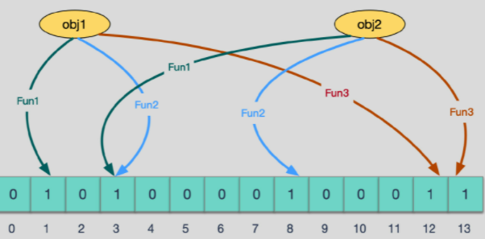

# Algorithm Notes

[AlgorithmPDF](_pdf/algorithm/AlgorithmNotes.pdf)

## 位运算

### LSB MSB

**最低有效位**（**the least significant bit**，**lsb**）是指一个二进制数字中的第0位（即最低位），具有权值为2^0，可以用它来检测数的奇偶性。与之相反的称之为最高有效位。在大端序中，lsb指最右边的位


**最高有效位**（**the Most Significant Bit**，**msb**），是指一个n位二进制数字中的n-1位，具有最高的权值2^n − 1。与之相反的称之为最低有效位。在大端序中，msb即指最左端的位。

### xor & (-xor)

取异或值最后一个二进制位为 1 的数字作为 mask，如果是 1 则表示两个数字在这一位上不同。

```java
  int mask = xor & (-xor);
```


## 布隆过滤器

BloomFilter

1970年布隆提出

实际上是一个很长的二进制向量和一系列随机映射函数

主要用于判断一个元素是否在一个集合中


一般判断元素在集合中的方法是利用 树、链表、HASH结构等

但是随着数据量的增加，存储空间需求急剧增加

布隆过滤器就产生了

### hash

哈希函数的概念是：将任意大小的输入数据转换成特定大小的输出数据的函数，转换后的数据称为哈希值或哈希编码，也叫散列值。

所有散列函数都有如下基本特性：

- 如果两个散列值是不相同的（根据同一函数），那么这两个散列值的原始输入也是不相同的。这个特性是散列函数具有确定性的结果，具有这种性质的散列函数称为**单向散列函数**。
- 散列函数的输入和输出不是唯一对应关系的，如果两个散列值相同，两个输入值很可能是相同的，但也可能不同，这种情况称为“**散列碰撞**（collision）”

### 布隆过滤器结构

bloom filter是由一个固定大小的二进制向量或者位图和一系列的映射函数构成的。

在初始状态时，对于长度为 m 的位数组，它的所有位都被置为0

当有变量被加入集合时，通过 K 个映射函数将这个变量映射成位图中的 K 个点，把它们置为 1（假定有两个变量都通过 3 个映射函数）。



查询某个变量的时候我们只要看看这些点是不是都是 1 就可以大概率知道集合中有没有它了

- 如果这些点有任何一个 0，则被查询变量一定不在；
- 如果都是 1，则被查询变量很**可能存在**

为什么说是可能存在，而不是一定存在呢？那是因为映射函数本身就是散列函数，散列函数是会有碰撞的

### 误判率

布隆过滤器的误判是指多个输入经过哈希之后在相同的bit位置1了，这样就无法判断究竟是哪个输入产生的，因此误判的根源在于相同的 bit 位被多次映射且置 1。

这种情况也造成了布隆过滤器的删除问题，因为布隆过滤器的每一个 bit 并不是独占的，很有可能多个元素共享了某一位。如果我们直接删除这一位的话，会影响其他的元素。(比如上图中的第 3 位)

### 特性

- **一个元素如果判断结果为存在的时候元素不一定存在，但是判断结果为不存在的时候则一定不存在**。
- **布隆过滤器可以添加元素，但是不能删除元素**。因为删掉元素会导致误判率增加。


### 优点

相比于其它的数据结构，布隆过滤器在空间和时间方面都有巨大的优势。布隆过滤器存储空间和插入/查询时间都是常数 $O(K)$，另外，散列函数相互之间没有关系，方便由硬件并行实现。布隆过滤器不需要存储元素本身，在某些对保密要求非常严格的场合有优势。

布隆过滤器可以表示全集，其它任何数据结构都不能；

### 缺点

但是布隆过滤器的缺点和优点一样明显。误算率是其中之一。随着存入的元素数量增加，误算率随之增加。但是如果元素数量太少，则使用散列表足矣。

另外，一般情况下不能从布隆过滤器中删除元素。我们很容易想到把位数组变成整数数组，每插入一个元素相应的计数器加 1, 这样删除元素时将计数器减掉就可以了。然而要保证安全地删除元素并非如此简单。首先我们必须保证删除的元素的确在布隆过滤器里面。这一点单凭这个过滤器是无法保证的。另外计数器回绕也会造成问题。

### 布隆过滤器的典型应用有：

- 数据库防止穿库。 Google Bigtable，HBase 和 Cassandra 以及 Postgresql 使用BloomFilter来减少不存在的行或列的磁盘查找。避免代价高昂的磁盘查找会大大提高数据库查询操作的性能。
- 业务场景中判断用户是否阅读过某视频或文章，比如抖音或头条，当然会导致一定的误判，但不会让用户看到重复的内容。
- 缓存宕机、缓存击穿场景，一般判断用户是否在缓存中，如果在则直接返回结果，不在则查询db，如果来一波冷数据，会导致缓存大量击穿，造成雪崩效应，这时候可以用布隆过滤器当缓存的索引，只有在布隆过滤器中，才去查询缓存，如果没查询到，则穿透到db。如果不在布隆器中，则直接返回。
- WEB拦截器，如果相同请求则拦截，防止重复被攻击。用户第一次请求，将请求参数放入布隆过滤器中，当第二次请求时，先判断请求参数是否被布隆过滤器命中。可以提高缓存命中率。Squid 网页代理缓存服务器在 cache digests 中就使用了布隆过滤器。Google Chrome浏览器使用了布隆过滤器加速安全浏览服务
- Venti 文档存储系统也采用布隆过滤器来检测先前存储的数据。
- SPIN 模型检测器也使用布隆过滤器在大规模验证问题时跟踪可达状态空间。


```java
public class MyBloomFilter {

    /**
     * 一个长度为10 亿的比特位
     */
    private static final int DEFAULT_SIZE = 256 << 22;

    /**
     * 为了降低错误率，使用加法hash算法，所以定义一个8个元素的质数数组
     */
    private static final int[] seeds = {3, 5, 7, 11, 13, 31, 37, 61};

    /**
     * 相当于构建 8 个不同的hash算法
     */
    private static HashFunction[] functions = new HashFunction[seeds.length];

    /**
     * 初始化布隆过滤器的 bitmap
     */
    private static BitSet bitset = new BitSet(DEFAULT_SIZE);

    /**
     * 添加数据
     *
     * @param value 需要加入的值
     */
    public static void add(String value) {
        if (value != null) {
            for (HashFunction f : functions) {
                //计算 hash 值并修改 bitmap 中相应位置为 true
                bitset.set(f.hash(value), true);
            }
        }
    }

    /**
     * 判断相应元素是否存在
     * @param value 需要判断的元素
     * @return 结果
     */
    public static boolean contains(String value) {
        if (value == null) {
            return false;
        }
        boolean ret = true;
        for (HashFunction f : functions) {
            ret = bitset.get(f.hash(value));
            //一个 hash 函数返回 false 则跳出循环
            if (!ret) {
                break;
            }
        }
        return ret;
    }

    /**
     * 模拟用户是不是会员，或用户在不在线。。。
     */
    public static void main(String[] args) {

        for (int i = 0; i < seeds.length; i++) {
            functions[i] = new HashFunction(DEFAULT_SIZE, seeds[i]);
        }

        // 添加1亿数据
        for (int i = 0; i < 100000000; i++) {
            add(String.valueOf(i));
        }
        String id = "123456789";
        add(id);

        System.out.println(contains(id));   // true
        System.out.println("" + contains("234567890"));  //false
    }
}

class HashFunction {

    private int size;
    private int seed;

    public HashFunction(int size, int seed) {
        this.size = size;
        this.seed = seed;
    }

    public int hash(String value) {
        int result = 0;
        int len = value.length();
        for (int i = 0; i < len; i++) {
            result = seed * result + value.charAt(i);
        }
        int r = (size - 1) & result;
        return (size - 1) & result;
    }
}
```


## 树

### 字典树

字典树 Tire

字典树也叫Trie树、前缀树。顾名思义，它是一种针对字符串进行维护的数据结构。

字典树，顾名思义，是关于“字典”的一棵树。即：它是对于字典的一种存储方式（所以是一种数据结构而不是算法）。这个词典中的每个“单词”就是从根节点出发一直到某一个目标节点的路径，路径中每条边的字母连起来就是一个单词


字典树的本质是把很多字符串拆成单个字符的形式，以树的方式存储起来

那么根据这个最基本的性质，我们可以由此延伸出字典树的很多妙用。简单总结起来大体如下：

- 1、维护字符串集合（即**字典**）。
- 2、向字符串集合中插入字符串（即**建树**）。
- 3、查询字符串集合中是否有某个字符串（即**查询**）。
- 4、统计字符串在集合中出现的个数（即**统计**）。
- 5、将字符串集合按字典序排序（即**字典序排序**）。
- 6、求集合内两个字符串的LCP（Longest Common Prefix，最长公共前缀）（即**求最长公共前缀**）。

经常被搜索引擎系统用于文本词频统计。它的优点是：最大限度地减少无谓的字符串比较。

Trie的核心思想是空间换时间。利用字符串的公共前缀来降低查询时间的开销以达到提高效率的目的。

**前缀树的3个基本性质：**

1. 根节点不包含字符，除根节点外每一个节点都只包含一个字符。
2. 从根节点到某一节点，路径上经过的字符连接起来，为该节点对应的字符串。
3. 每个节点的所有子节点包含的字符都不相同。
4. 它的key都为字符串，能做到高效查询和插入，时间复杂度为O(k)，k为字符串长度，缺点是如果大量字符串没有共同前缀时很耗内存。


```java
其中count表示以当前单词结尾的单词数量。
prefix表示以该处节点之前的字符串为前缀的单词数量。
    
public class TrieNode {
	int count;
	int prefix;
	TrieNode[] nextNode=new TrieNode[26];
	public TrieNode(){
		count=0;
		prefix=0;
	}
}

public static void insert(TrieNode root,String str){
    if(root==null||str.length()==0){
        return;
    }
    char[] c=str.toCharArray();
    for(int i=0;i<str.length();i++){
        //如果该分支不存在，创建一个新节点
        if(root.nextNode[c[i]-'a']==null){
            root.nextNode[c[i]-'a']=new TrieNode();
        }
        root=root.nextNode[c[i]-'a'];
        root.prefix++;//注意，应该加在后面
    }

    //以该节点结尾的单词数+1
    root.count++;
}

public static int search(TrieNode root,String str){
    if(root==null||str.length()==0){
        return -1;
    }
    char[] c=str.toCharArray();
    for(int i=0;i<str.length();i++){
        //如果该分支不存在，表名该单词不存在
        if(root.nextNode[c[i]-'a']==null){
            return -1;
        }
        //如果存在，则继续向下遍历
        root=root.nextNode[c[i]-'a'];	
    }

    //如果count==0,也说明该单词不存在
    if(root.count==0){
        return -1;
    }
    return root.count;
}

//查询以str为前缀的单词数量
public static int searchPrefix(TrieNode root,String str){
    if(root==null||str.length()==0){
        return -1;
    }
    char[] c=str.toCharArray();
    for(int i=0;i<str.length();i++){
        //如果该分支不存在，表名该单词不存在
        if(root.nextNode[c[i]-'a']==null){
            return -1;
        }
        //如果存在，则继续向下遍历
        root=root.nextNode[c[i]-'a'];	
    }
    return root.prefix;
}
```


