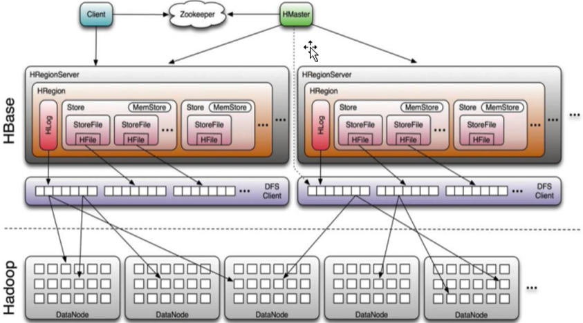
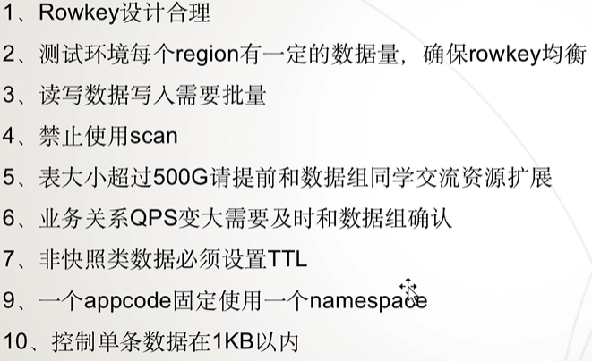

# BigData NOTES

## BASIC

### TECH

- Hadoop
- hdfs
- hive
- flume
- oozie
- hbase
- kafka
- spark
- flink

### 数据类型

**热数据**：是需要被计算节点频繁访问的在线类数据。
**冷数据**：是对于离线类不经常访问的数据，比如企业备份数据、业务与操作日志数据、话单与统计数据。

热数据就近计算，冷数据集中存储

### 学习路线

## 概述

### 基本说明

- HBASE是一个**高可靠、高性能、面向列、可伸缩、实时读写**的**分布式**数据库
- 利用**Hadoop** HDFS作为其文件系统
- 利用**Zookeeper**作为其分布式协同服务
- 主要用来存储**非结构化、半结构化**的**松散数据**[**列存NoSQL数据库**]

### VS 关系型数据库

### 使用场景

- 数据规模大
- 实时的点查询
- 容忍NoSQL短板
- 数据分析需求不多

## 架构

### 集群架构

## 使用

### 使用规范

## 数据仓库

https://www.jianshu.com/p/da62fb0c6a0b

ELT

学习顺序

