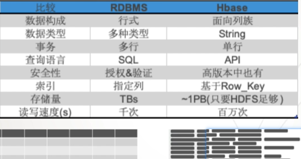
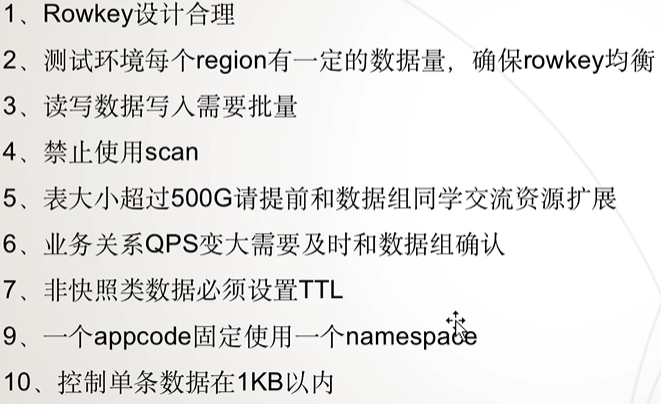
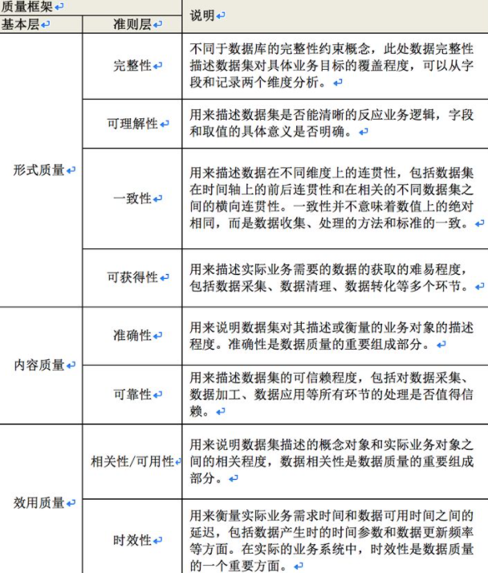
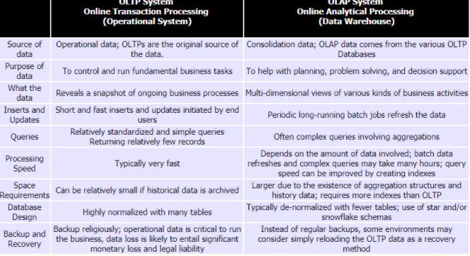
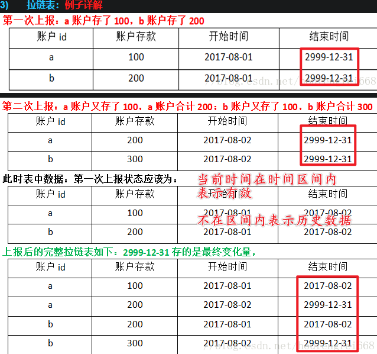

# BigData NOTES

## BASIC

### TECH

- Hadoop
- hdfs
- hive
- flume
- oozie
- hbase
- kafka
- spark
- flink

### 数据类型

**热数据**：是需要被计算节点频繁访问的在线类数据。
**冷数据**：是对于离线类不经常访问的数据，比如企业备份数据、业务与操作日志数据、话单与统计数据。

热数据就近计算，冷数据集中存储

### 学习路线

## 概述

### 基本说明

- HBASE是一个**高可靠、高性能、面向列、可伸缩、实时读写**的**分布式**数据库
- 利用**Hadoop** HDFS作为其文件系统
- 利用**Zookeeper**作为其分布式协同服务
- 主要用来存储**非结构化、半结构化**的**松散数据**[**列存NoSQL数据库**]

### VS 关系型数据库

### 使用场景

- 数据规模大
- 实时的点查询
- 容忍NoSQL短板
- 数据分析需求不多

## 架构

### 集群架构

## 使用

### 使用规范

## 大数据概念

### ODS

ODS全称是Operational Data Store，即操作数据存储

Bill.Inmon的定义：ODS是一个面向主题的、集成的、可变的、当前的细节数据集合，用于支持企业对于即时性的、操作性的、集成的全体信息的需求。常常被作为数据仓库的过渡，也是数据仓库项目的可选项之一。

而Kimball的定义：操作型系统的集成，用于当前、历史以及其它细节查询(业务系统的一部分)；为决策支持提供当前细节数据(数据仓库的一部分)。

DB 是现有的数据来源，可以为mysql、SQLserver、文件日志等，为数据仓库提供数据来源的一般存在于现有的业务系统之中。

ETL的是 Extract-Transform-Load 的缩写，用来描述将数据从来源迁移到目标的几个过程：

- Extract，数据抽取，也就是把数据从数据源读出来。
- Transform，数据转换，把原始数据转换成期望的格式和维度。如果用在数据仓库的场景下，Transform也包含数据清洗，清洗掉噪音数据。
- Load  数据加载，把处理后的数据加载到目标处，比如数据仓库。

ODS(Operational Data Store) 操作性数据，是作为数据库到数据仓库的一种过渡，ODS的数据结构一般与数据来源保持一致，便于减少ETL的工作复杂性，而且ODS的数据周期一般比较短。ODS的数据最终流入DW
 +DW (Data Warehouse)数据仓库，是数据的归宿，这里保持这所有的从ODS到来的数据，并长期报错，而且这些数据不会被修改。

DM(Data Mart) 数据集市,为了特定的应用目的或应用范围，而从数据仓库中独立出来的一部分数据，也可称为部门数据或主题数据。面向应用。

### 数据质量

## 数据仓库

https://www.jianshu.com/p/da62fb0c6a0b

### 概述

#### 什么是数据仓库

数据仓库 DataWarehouse，DW/DWH

数据仓库是一个面向主题的Subject Oriented、集成的Integrate、相对稳定的Non-Volatile、反映历史变化的Time Variant的数据集合，用于支持管理决策。

#### OLTP和OLAP

OLTP： online transaction processing，联机事务处理，主要是业务处理，需要考虑高并发、事务

OLAP：online Analytical Processing, 联机分析处理，主要是面向分析，会产生大量的查询，很少涉及增删改。

#### 数据库和数仓

数据库是物理存储；数仓是管理数据的体系，是一种方法论

### 拉链表 流水表 全量表 增量表

1. 全量表：每天的所有的最新状态的数据，
2. 增量表：每天的新增数据，增量数据是上次导出之后的新数据。
3. 拉链表：**维护历史状态，以及最新状态数据的一种表**，拉链表根据拉链粒度的不同，实际上相当于快照，只不过做了优化，去除了一部分不变的记录而已,**通过拉链表可以很方便的还原出拉链时点的客户记录**。
4. 流水表： 对于表的每一个修改都会记录，可以用于反映实际记录的变更。 

拉链表通常是对账户信息的历史变动进行处理保留的结果，流水表是每天的交易形成的历史；

流水表用于统计业务相关情况，拉链表用于统计账户及客户的情况

在数仓中，一般在数仓中通过增加begin_date,en_date来实现拉链表

面试题：

- 什么是数仓？
- 数仓的几个特点是什么？
- 什么是OLAP？什么是OLTP？区别是什么？
- 拉链表是什么？怎么实现拉链表？
- 同步又哪几种方式？
- 为什么要做增量？怎么做增量？
- 什么是ETL？

ELT

学习顺序

