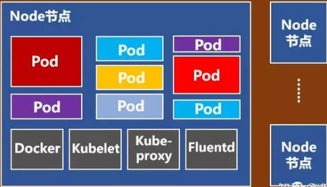

# 容器 云远程 微服务

## CN相关技术

- 混沌工程
- 容器化
- K8S
- 可观测性
- 微服务
- DevOps
- serviceMesh
- serviceless
- 边缘计算
- low code
- cloud native
- 中台


## 容器基础

### 发展历程


### VM vs. Container

都是虚拟化技术，粒度不同

VM：OS级别的虚拟化

容器：进程级的虚拟化


容器：

- 更低的资源消耗
- 更好的系统弹性
- 更快的交付速度
- 更好的系统稳定性
- 更好的系统一致性

### 容器虚拟化的实现原理

容器是一种通过 **namespace** 和 **cgroup** 实现的轻**量级进程级别的虚拟化**，并可以**对应用进程进行隔离**

#### Namespace

Namespace 是操作系统内核在不同进程间实现的一种环境隔离机制

| **Namespace**               | **隔离效果**                                                 |
| --------------------------- | ------------------------------------------------------------ |
| **Mount**                   | 每个容器能看到不同的文件系统层次结构                         |
| **UTS(UNIX  Time-Sharing)** | 每个容器可以有自己的 hostname 和 domainame                   |
| **IPC**                     | 每个容器有其自己的 System V IPC 和 POSIX 消息队列文件系统，因此，只有在同一个 IPC namespace 的进程之间才能互相通信 |
| **PID**                     | 每个 PID namespace 中的进程可以有其独立的 PID, 默认是 1      |
| **Network**                 | 每个容器用有其独立的网络设备，IP 地址，IP 路由表，/proc/net 目录，端口号等等。这也使得一个 host 上多个容器内的同一个应用都绑定到各自容器的 80 端口上 |
| **User**                    | 在  user namespace 中的进程的用户和组 ID 可以和在 host 上不同； 每个 container 可以有不同的  user 和 group id |

#### Cgroups

Linux Control Group， 是Linux内核的一个功能，用来限制，控制与分离一个进程组群的资源（如CPU、内存、磁盘输入输出等）

CGoup 子系统:

1. cpu: 主要限制进程的 cpu 使用率。

2. cpuacct: 可以统计 cgroups 中的进程的 cpu 使用报告。

3. cpuset: 可以为 cgroups 中的进程分配单独的 cpu 节点或者内存节点。

4. memory: 可以限制进程的 memory 使用量。

5. blkio: 可以限制进程的块设备 io。

6. devices: 可以控制进程能够访问某些设备。

7. net_cls: 可以标记 cgroups 中进程的网络数据包，然后可以使用 tc 模块（traffic control）对数据包进行控制。

8. freezer: 可以挂起或者恢复 cgroups 中的进程。


#### LCX

 Linux Containers

LXC Linux Container容器是一种**内核虚拟化技术**，可以提供**轻量级的虚拟化**，以便隔离进程和资源. Docker 最初就是基于 lxc 实现的容器化功能


### 镜像

**镜像**由多个只读层组成

**容器**存储上的主要差别就在于容器多了一个读写层

所有的image都起始于一个基础镜像层，新的层加在其基础上

镜像分层-多容器**共用一个 base 镜像**，节省磁盘空间；提升分发速度


当前image的分层策略：

- 应用，如war
- 自定义软件，如tomcat
- 中间件，如jdk
- OS， 如centos


## Docker

口号：

- **Build, Ship and Run** 搭建、发送、运行
- **Build once，Run anywhere**


- An **image** is a read-only template with instructions for creating a container

- A d**ockerfile** is a simple text file that consists of instructions to build Docker images

- A **container** is a runnable instance of an image

- A container **registry** stores container images


### 命令

#### docker image

```bash
docker image ls
docker image rm imagename
docker image build -t image-name:tag
docker image inspect # 查看镜像分层
docker image push # 推送镜像

// . 表示当前目录 -f 参数指定 Dockerfile 文件 -t 表示 制作的镜像:tag
docker image build -f Dockerfile -t edw/scratch-cms-backend:1.0.0 .


```


#### docker container

```bash
docker container run
参数： -it: 进入容器内部，并连接到shell

docker container stop # 优雅关闭，发送SIFTERM信号，10秒后还没有停止再发送SIGKILL强行关闭

docker container rm  # 直接kill，删除，不建议，先stop
docker rm

docker container ls  
docker ps 

docker container start
docker start


# 进入容器，并使用bash交互
docker exec -it  36080e8c431c bash


docker container --help
Commands:
  attach      Attach local standard input, output, and error streams to a running container
  commit      Create a new image from a container's changes
  cp          Copy files/folders between a container and the local filesystem
  create      Create a new container
  diff        Inspect changes to files or directories on a container's filesystem
  exec        Run a command in a running container
  export      Export a container's filesystem as a tar archive
  inspect     Display detailed information on one or more containers
  kill        Kill one or more running containers
  logs        Fetch the logs of a container
  ls          List containers
  pause       Pause all processes within one or more containers
  port        List port mappings or a specific mapping for the container
  prune       Remove all stopped containers
  rename      Rename a container
  restart     Restart one or more containers
  rm          Remove one or more containers
  run         Run a command in a new container
  start       Start one or more stopped containers
  stats       Display a live stream of container(s) resource usage statistics
  stop        Stop one or more running containers
  top         Display the running processes of a container
  unpause     Unpause all processes within one or more containers
  update      Update configuration of one or more containers
  wait        Block until one or more containers stop, then print their exit codes
```


#### docker system

```bash
docker system info
```


#### docker history

```dockerfile
docker history imageName

```


#### docker run

```bash
docker run -d -e TZ="Asia/Shanghai" \
-p 2182:2182 \
-v /usr/local/zookeeper/data:/data \
-v /usr/local/zookeeper/conf/zoo.cfg:/conf/zoo.cfg \ (如果在配置中指定 data 目录，则上面一行不用)
--name zookeeper \
--restart always zookeeper

-e TZ="Asia/Shanghai" # 指定上海时区
-d # 表示在一直在后台运行容器
-p 2181:2181 # 对端口进行映射，将本地 2181 端口映射到容器内部的 2181 端口
--name # 设置创建的容器名称
-v # 将本地目录(文件)挂载到容器指定目录；
--restart always #始终重新启动 zookeeper

```


### docker compose

编排

默认配置yml: docker-compose.yml


demo:

```yml
version: "3"  # 版本，必须，第一行
services:  # 定义不同的服务
  redis:
    image: redis:alpine
    ports:
      - "6379"  # 宿主机 和 容器内服务的端口映射
    networks:
      - frontend  # 可以连接的网络
    deploy:
      replicas: 2
      update_config:
        parallelism: 2
        delay: 10s
      restart_policy:
        condition: on-failure

  db:
    image: postgres:9.4
    volumes:
      - db-data:/var/lib/postgresql/data
    networks:
      - backend
    deploy:
      placement:
        constraints: [node.role == manager]

  vote:
    image: dockersamples/examplevotingapp_vote:before
    ports:
      - 5000:80
    networks:
      - frontend
    depends_on:
      - redis
    deploy:
      replicas: 2
      update_config:
        parallelism: 2
      restart_policy:
        condition: on-failure

  result:
    image: dockersamples/examplevotingapp_result:before
    ports:
      - 5001:80
    networks:
      - backend
    depends_on:
      - db
    deploy:
      replicas: 1
      update_config:
        parallelism: 2
        delay: 10s
      restart_policy:
        condition: on-failure

  worker:
    image: dockersamples/examplevotingapp_worker
    networks:
      - frontend
      - backend
    deploy:
      mode: replicated
      replicas: 1
      labels: [APP=VOTING]
      restart_policy:
        condition: on-failure
        delay: 10s
        max_attempts: 3
        window: 120s
      placement:
        constraints: [node.role == manager]

  visualizer:
    image: dockersamples/visualizer:stable
    ports:
      - "8080:8080"
    stop_grace_period: 1m30s
    volumes:
      - "/var/run/docker.sock:/var/run/docker.sock"
    deploy:
      placement:
        constraints: [node.role == manager]

networks:  # 网络，默认情况下会创建 bridge网络
  frontend:
  backend:

volumes:   # 指引docker创建新的卷
  db-data:
```


默认查找名为docker-compose的yml或者yaml文件，如果自定义名称，需要使用-f指定：

```bash
docker-compose -f a.yml up -d
# -d:后台

docker-compose stop
docker-compose start
docker-compose restart
```


### Dockerfile

```dockfile
FROM alpine: 以 alpine 镜像作为当前镜像基础
LABLE maintainer="a":指定维护者a
RUN apk add --update nodejs nodejs-npm :安装 nodejs\npm
COPY . /src : 复制应用代码到镜像中
WORKDIR /src : 设置工作目录
RUN npm install : 运行构建命令
EXPOSE 8080 :暴露的端口
ENTRYPOINT ["node", "./app.js"] ：入口程序，运行应用
```


## K8S

### 概述

Google开发

Kubernetes： 源于希腊语，“舵手”的意思。ubernete 8个字母，缩写为 k8s 

**自动化的容器编排平台**

三个特点：

- 部署
- 弹性
- 管理

核心功能：

- 服务发现与负载均衡
- 容器自动装箱
- 自动容器恢复
- 自动发布与回滚
- 配置与密文管理
- 批量执行
- 水平伸缩

解决的问题：

| **Tasks**              | **Explanation**                                              |
| ---------------------- | ------------------------------------------------------------ |
| Scheduling             | Automatically  provision container instances.                |
| Affinity/anti-affinity | Provision  containers nearby or far apart from each other, helping availability and  performance. |
| Health  monitoring     | Automatically  detect and correct failures.                  |
| Failover               | Automatically  reprovision failed instance to healthy machines. |
| Scaling                | Automatically  add or remove container instance to meet demand. |
| Networking             | Manage  a networking overlay for container communication.    |
| Service  Discovery     | Enable  containers to locate each other.                     |
| Rolling  Upgrades      | Coordinate  incremental upgrades with zero downtime deployment. Automatically roll back  problematic changes. |

### 架构

一个K8S系统通常称为一个K8S集群，这个集群包含两个部分：

- 一个Master节点：主节点，负责管理和控制
- 一群Node节点：计算节点，负责工作负载

#### Master

Master节点包括

- API Server：整个系统的对外接口，供客户端和其它组件调用
- Scheduler：对集群内部的资源进行调度
- Controller manager：负责管理控制器
- etcd


#### Node



Node节点包括

- Docker
- **kubelet**，主要负责监视指派到它所在Node上的Pod，包括创建、修改、监控、删除等。
- kube-proxy，主要负责为Pod对象提供代理。
- Fluentd，主要负责日志收集、存储与查询。
- kube-dns（可选）
- **Pod**

Pod是Kubernetes最基本的操作单元。一个Pod代表着集群中运行的一个进程，它内部封装了一个或多个紧密相关的容器。除了Pod之外，K8S还有一个**Service**的概念，一个Service可以看作一组提供相同服务的Pod的对外访问接口。


## 云原生


