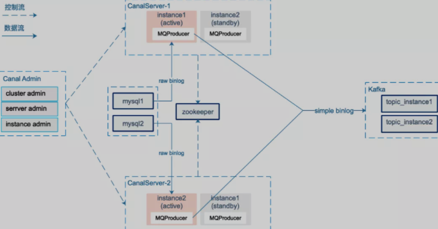
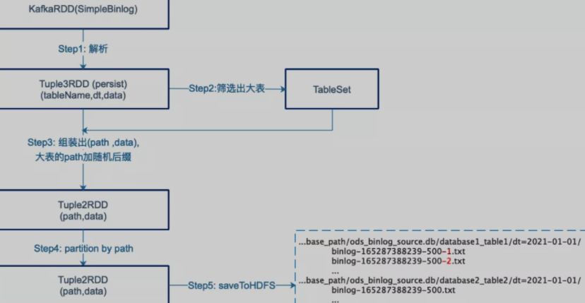
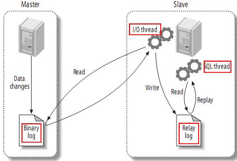

# Data Infrastructure 数据基础架构

## 基于Binlog实时流的数据基础架构

https://mp.weixin.qq.com/s/QYibhkZsBbpvfxYPdMcqOQ

### 概述

携程金融，集团风控和金融业务，需要在携程DC构建统一的金融数据中心，实现多地多机房的数据融合，满足离线和在线需求。这涉及到数千张MySQL表到离线数仓、实时数仓、在线缓存的同步。

由于跨地域、实时性、准确性、完整性要求高，集团内二次开发的DataX（业界常用的离线同步方案）无法支持。以mysql-hive同步为例，DataX通过直连MySQL批量拉取数据，存在以下问题：

- 性能瓶颈：随着业务规模增加，数据规模增大，影响mysql-hive表的产出时间，进而影响数仓下游任务。对于一些需要mysql-hive小时级镜像的场景更加不满足
- 影响线上业务：离线批量拉取数据，可能导致**慢查询**，影响业务库的线上服务。
- 无法保证幂等：线上库在实时更新，对于一些对时点要求非常高的场景(如离线对账)无法接受
- 缺乏对DELETE的支持：业务库做了DELETE操作后，只有整表全量拉取，才能在hive镜像中体现。

### 方案架构概述

基于上述BG，设计了一套 基于**binlog实时流的数据基础层构建方案**。


webUI做binlog采集的配置，以及mysql->hive，mysql→实时数仓，mysql→在线缓存的镜像配置工作。

canal负责binlog采集 ，写入kafka ；其中kafka在多地部署，并通过专线实现topic的实时同步。

spark-streaming 负责将binlog写入HDFS

merge 离线调度的ETL作业，负责将HDFS增量和 snap 合并成新的 snap

mirror 负责将binlog事件更新到实时数仓、在线缓存。

基础服务：包括历史数据的重放，数据校验，全链路监控，明文检测等功能。

### 详细介绍

以mysql-hive镜像为例

#### binlog采集

对canal做了二次开发，主要是将Raw Binlog -> Simple Binlog



采用canal-admin图形化地管理binlog的采集，采集粒度是mysql instance级别

Canal Server会向canalAdmin 拉取所属集群下的所有mysql instance 列表，针对每个mysql instance采集任务，canal server通过在zookeeper创建临时节点的方式实现HA，并通过zookeeper实现binlog position的共享

canal 1.1.1版本引入MQProducer 原生支持kafka消息投递 , 图中instance active 从mysql 获取实时的增量raw binlog数据，在MQProducer 环节进行raw binlog → simple binlog的消息转换，发送至kafka。我们按照instance 创建了对应的kafka topic，而非每个database 一个topic , 主要考虑到同一个mysql instance 下有多个database，过多的topic (partition) 导致kafka随机IO增加，影响吞吐。发送Kafka时以schemaName+tableName作为partitionKey，结合producer的参数控制，保证同一个表的binlog消息按顺序写入kafka。

从保证数据的顺序性、容灾等方面考虑，我们设计了一个轻量级的SimpleBinlog消息格式


- binlogOffset：全局序列ID，由${timestamp}${seq} 组成，该字段用于全局排序，方便Hive做row_number 取出最新镜像，其中seq是同一个时间戳下自增的数字，长度为6。
- executeTime：binlog 的执行时间。
- eventType：事件类型：INSERT，UPDATE，DELETE。
- schemaName：库名，在后续的spark-streaming，mirror 处理时，可以根据分库的规则，只提取出前缀，比如(ordercenter_001 → ordercenter) 以屏蔽分库问题。
- tableName：表名，在后续的spark-streaming，mirror 处理时，可以根据分表规则，只提取出前缀，比如(orderinfo_001 → orderinfo ) 以屏蔽分表问题。
- source：用于区分simple binlog的来源，实时采集的binlog 为 BINLOG， 重放的历史数据为 MOCK 。
- version：版本
- content：本次变更的内容，INSERT，UPDATE 取afterColumnList，DELETE 取beforeColumnList。

Q： 事件类型只有三种，如果alter table，如删除一列，是那种事件？

#### 历史数据重放

有两个场景需要我们采集历史数据：

- 首次做 mysql-hive镜像，需要从mysql加载历史数据
- 系统故障，需要从mysql恢复数据


有两种方案：

1）从mysql 批量拉取历史数据，上传到HDFS 。需要考虑批量拉取的数据与 binlog 采集产出的mysql-hive镜像的格式差异，比如去重主键的选择，排序字段的选择等问题。

2）流式方式， 批量从mysql 拉取历史数据，转换为simple binlog消息流写入kafka，同实时采集的simple binlog流复用后续的处理流程。在合并产生mysql-hive镜像表时，需要确保这部分数据不会覆盖实时采集的simple binlog数据。

我们选用了更简单易维护的方案2，并开发了一个binlog-mock 服务，可以根据用户给出的库、表（前缀）以及条件，按批次（比如每次select 10000行）从mysql查询数据，组装成simple_binlog消息发送kafka。

#### **Write2HDFS** 

我们采用spark-streaming 将kafka消息持久化到HDFS，每5分钟一个批次，一个批次的数据处理完成（持久化到HDFS）后再提交consumer offset，保证消息被at-least-once处理；同时也考虑了分库分表问题、数据倾斜问题：

**屏蔽分库分表**：以订单表为例，mysql数据存储在ordercenter_00 ... ordercenter_99 100个库，每个库下面又有orderinfo_00...orderinfo_99 100张表，库前缀schemaNamePrefix=ordercenter,表前缀tableNamePrefix=orderinfo，统一映射到tableName=${schemaNamePrefix}_${tableNamePrefix}里; 根据binlog executeTime字段生成对应的分区dt，确保同一个库表同一天的数据落到同一个分区目录里: base_path/ods_binlog_source.db/${database_prefix}_${table_prefix}/dt={binlogDt}/binlog-{timestamp}-{rdd.id}

**防止数据倾斜**: 系统上线初期经常出现数据倾斜问题，排查发现某些时间段个别表由于业务跑批等产生的binlog量特别大，一张表一个批次的数据需要写入同一个HDFS文件，单个HDFS文件的写入速度成为瓶颈。因此增加了一个环节（Step2），过滤出当前批次里的“大表"，将这些大表的数据分散写入多个HDFS文件里。 



#### 生成镜像

数据就绪检查

全链路对延迟进行监控，在merge前，先对数据就绪状态进行检查

检查的方式是，所有延迟的累计和，要小于正是merge的时间，保证T-1的数据全部落入HDFS


Merge：

hdfs上simple binlog就绪或，下一步对相应的MySQL业务表数据进行还原，merge流程：

1. 加载T-1分区的simple binlog数据

   通过 MSCK REPAIR PARTITION加载T-1分区数据。(第一次做mysql-hive镜像时，历史数据重放的simple-binlog也会落入T-1分区)

2. 检查Schema，并抽取T-1增量

   

3. 判断业务库是否发生了归档操作，以决定后续合并时是否忽略DELETE事件

4. 对增量DELTA数据和当前快照snap T-2 进行合并去重，得到最新的 snap T-1


最后需要check，这里使用的是最后7天的数据进行hive-mysql比对


## 新版QC数据同步-DB数据到ODS


## 相关工具和技术

### DataX

#### 概述

DataX 是一个**异构数据源离线同步工具**，致力于实现包括关系型数据库(MySQL、Oracle等)、HDFS、Hive、ODPS、HBase、FTP等各种**异构数据源**之间稳定高效的数据同步功能。


这是中介者模式 Mediator （调停者模式）

(中介者模式和门面facade模式有区别，中介者模式是内部组件的交互中介，而facade模式是外部访问系统的统一接口)

DataX的几个特点：

- 处理异构数据：不同结构的数据源
- 离线任务：是离线的
- 同步：不同数据的同步

https://github.com/alibaba/DataX

DataX已经更新到3.0

#### 框架设计


DataX采用**FrameWork + plugin**的设计，将数据源读取和写入抽象成为Reader/Writer插件，纳入整个同步框架中：

- Reader： Reader是数据读取/采集模块，负责采集数据源的数据，将数据发送给Framework
- Writer：数据写入模块，负责不断向Framework读数据，将数据写入到目标DB
- Framework：用于连接W、R，作为两者的数据传输通道，并处理缓冲、流控、并发、数据转换等核心技术问题。

#### DataX3.0插件体系

| 类型               | 数据源                          | Reader(读) | Writer(写) |
| :----------------- | :------------------------------ | :--------- | :--------- |
| RDBMS 关系型数据库 | MySQL                           | √          | √          |
|                    | Oracle                          | √          | √          |
|                    | SqlServer                       | √          | √          |
|                    | PostgreSQL                      | √          | √          |
|                    | 达梦                            | √          | √          |
|                    | 通用RDBMS(支持所有关系型数据库) | √          | √          |
| 阿里云数仓数据存储 | ODPS                            | √          | √          |
|                    | ADS                             |            | √          |
|                    | OSS                             | √          | √          |
|                    | OCS                             | √          | √          |
| NoSQL数据存储      | OTS                             | √          | √          |
|                    | Hbase0.94                       | √          | √          |
|                    | Hbase1.1                        | √          | √          |
|                    | MongoDB                         | √          | √          |
| 无结构化数据存储   | TxtFile                         | √          | √          |
|                    | FTP                             | √          | √          |
|                    | HDFS                            | √          | √          |

#### DataX3.0核心架构

DataX 3.0 开源版本支持单机多线程模式完成同步作业运行，本小节按一个DataX作业生命周期的时序图，从整体架构设计非常简要说明DataX各个模块相互关系


1. DataX完成单个数据同步的作业，我们称之为Job，DataX接受到一个Job之后，将启动一个进程来完成整个作业同步过程。DataX Job模块是单个作业的中枢管理节点，承担了数据清理、子任务切分(将单一作业计算转化为多个子Task)、TaskGroup管理等功能。
2. DataXJob启动后，会根据不同的源端切分策略，将Job切分成多个小的Task(子任务)，以便于并发执行。Task便是DataX作业的最小单元，每一个Task都会负责一部分数据的同步工作。
3. 切分多个Task之后，DataX Job会调用Scheduler模块，根据配置的并发数据量，将拆分成的Task重新组合，组装成TaskGroup(任务组)。每一个TaskGroup负责以一定的并发运行完毕分配好的所有Task，默认单个任务组的并发数量为5。
4. 每一个Task都由TaskGroup负责启动，Task启动后，会固定启动Reader—>Channel—>Writer的线程来完成任务同步工作。
5. DataX作业运行起来之后， Job监控并等待多个TaskGroup模块任务完成，等待所有TaskGroup任务完成后Job成功退出。否则，异常退出，进程退出值非0

举例来说，用户提交了一个DataX作业，并且配置了20个并发，目的是将一个100张分表的mysql数据同步到odps里面。 DataX的调度决策思路是：

1. DataXJob根据分库分表切分成了100个Task。
2. 根据20个并发，DataX计算共需要分配4个TaskGroup。
3. 4个TaskGroup平分切分好的100个Task，每一个TaskGroup负责以5个并发共计运行25个Task。

#### 优点

- 数据质量监控
- 数据转换
- 速度控制：控制速度，防止对原来的DB造成过大压力
- 同步性能
- 容错机制：
  - 线程内部重试
  - 线程级别重试


### Canal

#### 背景

早期，阿里巴巴B2B公司因为存在杭州和美国双机房部署，存在跨机房同步的业务需求。不过早期的数据库同步业务，主要是基于trigger的方式获取增量变更，不过从2010年开始，阿里系公司开始逐步的尝试基于数据库的日志解析，获取增量变更进行同步，由此衍生出了 **增量订阅&消费** 的业务，从此开启了一段新纪元

基于 日志增量订阅 & 消费支持 的业务:

- 数据库镜像
- 数据库实时备份
- 多级索引
- search build
- 业务cache刷新
- 价格变化等重要业务消息

Canal **基于数据库增量日志解析，提供增量数据订阅和消费**，目前主要支持MySQL

#### MySQL主备复制原理



复制分为三步：

- master将改变记录到binary log(这些记录叫做**二进制日志事件**，binary log events，可以通过 **show binlog events** 查看)
- slave将master的binary log events拷贝到中继日志(relay log)中
- slave重做中继日志中的事件，将改变反应到它自己的数据


#### 工作原理


canal模拟MySQL slave交互协议，伪装成slave，想mysql master发送dump协议，master收到dump请求，开始推送binlog给slave，canal得到binlog流，解析得到binlog对象。

#### canal安装

```shell
# download
[root@master1 canal]#wget https://github.com/alibaba/canal/releases/download/v1.0.23/canal.deployer-1.0.23.tar.gz
[root@master1 canal]#mkdir /root/canal
[root@master1 canal]#tar zxvf canal.deployer-1.0.23.tar.gz  -C /root/canal

# create canan user of mysql
mysql> CREATE USER 'canal'@'localhost' IDENTIFIED BY 'canal';
Query OK, 0 rows affected (0.00 sec)
mysql> GRANT ALL PRIVILEGES ON *.* TO 'canal'@'localhost' WITH GRANT OPTION;
Query OK, 0 rows affected (0.01 sec)
mysql> CREATE USER 'canal'@'%' IDENTIFIED BY 'canal';
Query OK, 0 rows affected (0.00 sec)
mysql> GRANT ALL PRIVILEGES ON *.* TO 'canal'@'%' WITH GRANT OPTION;
Query OK, 0 rows affected (0.00 sec)
mysql> flush privileges;
Query OK, 0 rows affected (0.00 sec)

# 修改canal配置文件(如果是访问本机，并且用户密码都为canal则不需要修改配置文件)
[root@master1 canal]# vi /root/canal/conf/example/instance.properties
#################################################
## mysql serverId
canal.instance.mysql.slaveId = 1234
# position info
canal.instance.master.address = 127.0.0.1:3306
canal.instance.master.journal.name =
canal.instance.master.position =
canal.instance.master.timestamp =
#canal.instance.standby.address =
#canal.instance.standby.journal.name =
#canal.instance.standby.position =
#canal.instance.standby.timestamp =
# username/password
#修改这两项
canal.instance.dbUsername = canal
canal.instance.dbPassword = canal
canal.instance.defaultDatabaseName =
canal.instance.connectionCharset = UTF-8
# table regex
canal.instance.filter.regex = .*\\..*
# table black regex
canal.instance.filter.black.regex =
#################################################

# start canal
[root@master1 canal]# sh /root/canal/bin/startup.sh
# stop canal
[root@master1 canal]# sh /root/canal/bin/stop.sh

# log path:
[root@master1 canal]# cat /root/canal/logs/canal/canal.log
[root@master1 canal]# cat /root/canal/logs/example/example.log

```

#### canal 读取binlog

```xml
        <dependency>
            <groupId>com.alibaba.otter</groupId>
            <artifactId>canal.client</artifactId>
            <version>1.0.12</version>
        </dependency>
```

```java
>package com.chainfin.canal;
>
>import java.net.InetSocketAddress;
>import java.util.List;
>
>import com.alibaba.otter.canal.client.CanalConnector;
import com.alibaba.otter.canal.client.CanalConnectors;
import com.alibaba.otter.canal.protocol.CanalEntry.Column;
import com.alibaba.otter.canal.protocol.CanalEntry.Entry;
import com.alibaba.otter.canal.protocol.CanalEntry.EntryType;
import com.alibaba.otter.canal.protocol.CanalEntry.EventType;
import com.alibaba.otter.canal.protocol.CanalEntry.RowChange;
import com.alibaba.otter.canal.protocol.CanalEntry.RowData;
import com.alibaba.otter.canal.protocol.Message;
>
/**
 * 
 * @author jinxiaoxin
 *
 */
public class ClientSample {
    public static void main(String[] args) {
        // 创建链接
        CanalConnector connector = CanalConnectors.newSingleConnector(
                new InetSocketAddress("10.105.10.121", 11111), "example", "",
                "");// AddressUtils.getHostIp(),
        int batchSize = 1000;
        int emptyCount = 0;
        try {
            connector.connect();
            connector.subscribe("test\\..*");// .*代表database，..*代表table
            connector.rollback();//
            int totalEmptyCount = 120;
            while (emptyCount < totalEmptyCount) {
                Message message = connector.getWithoutAck(batchSize); // 获取指定数量的数据
                long batchId = message.getId();
                int size = message.getEntries().size();
                if (batchId == -1 || size == 0) {
                    emptyCount++;
                    // System.out.println("empty count : " + emptyCount);
                    try {
                        Thread.sleep(1000);
                    } catch (InterruptedException e) {
                    }
                } else {
                    emptyCount = 0;
                    // System.out.printf("message[batchId=%s,size=%s] \n",
                    // batchId, size);
                    printEntry(message.getEntries());
                }
                connector.ack(batchId); // 提交确认
                // connector.rollback(batchId); // 处理失败, 回滚数据
            }
            System.out.println("empty too many times, exit");
        } finally {
            connector.disconnect();
        }
    }
>
    private static void printEntry(List<Entry> entrys) {
        for (Entry entry : entrys) {
            if (entry.getEntryType() == EntryType.TRANSACTIONBEGIN
                    || entry.getEntryType() == EntryType.TRANSACTIONEND) {
                continue;
            }
            RowChange rowChage = null;
            try {
                rowChage = RowChange.parseFrom(entry.getStoreValue());
            } catch (Exception e) {
                throw new RuntimeException(
                        "ERROR ## parser of eromanga-event has an error,data:"
                                + entry.toString(), e);
            }
            EventType eventType = rowChage.getEventType();
            System.out
                    .println(String
                            .format("================> binlog[%s:%s] ,name[%s,%s] , eventType : %s",
                                    entry.getHeader().getLogfileName(), entry
                                            .getHeader().getLogfileOffset(),
                                    entry.getHeader().getSchemaName(), entry
                                            .getHeader().getTableName(),
                                    eventType));
            for (RowData rowData : rowChage.getRowDatasList()) {
                if (eventType == EventType.DELETE) {
                    printColumn(rowData.getBeforeColumnsList());
                } else if (eventType == EventType.INSERT) {
                    printColumn(rowData.getAfterColumnsList());
                } else {
                    System.out.println("-------> before");
                    printColumn(rowData.getBeforeColumnsList());
                    System.out.println("-------> after");
                    printColumn(rowData.getAfterColumnsList());
                }
            }
        }
    }
>
    private static void printColumn(List<Column> columns) {
        for (Column column : columns) {
            System.out.println(column.getName() + " : " + column.getValue()
                    + "    update=" + column.getUpdated());
        }
    }
}
>
```

canal集群...


