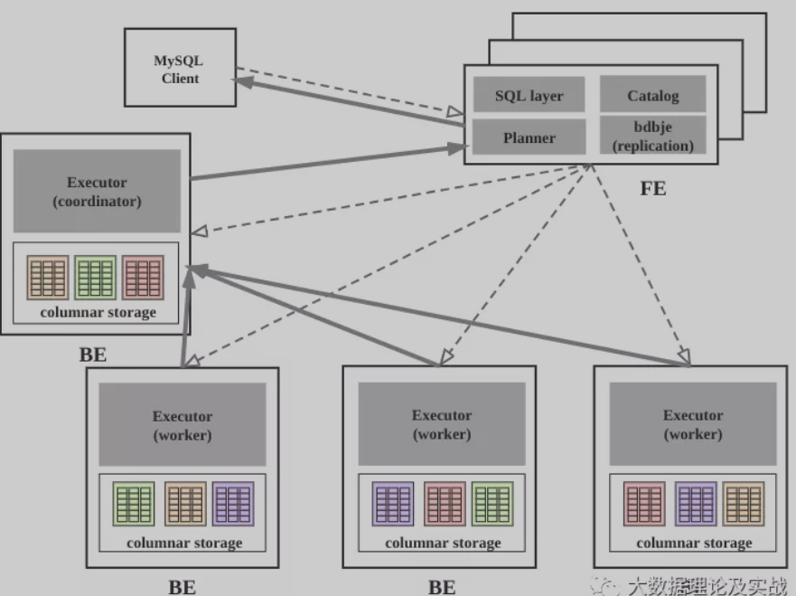
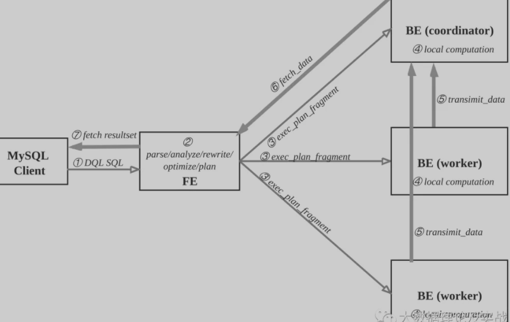
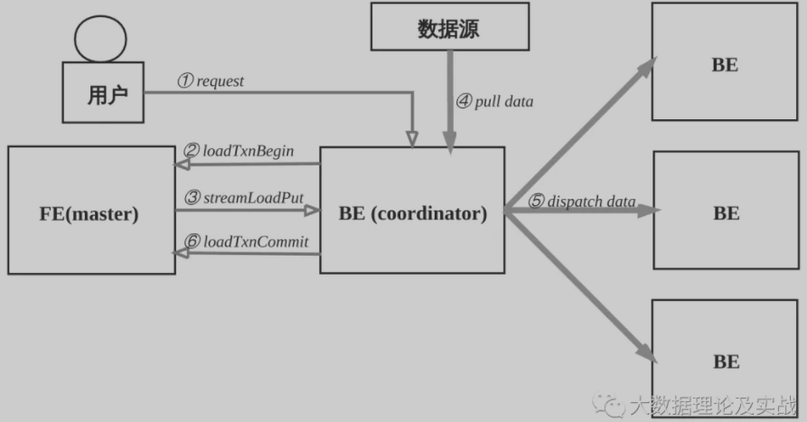

# Doris Notes

## My Doris Notes

### Doris快速入门

#### 概况

https://mp.weixin.qq.com/s/D-jLjDpUG4RfH2Se4lAFFQ

鼎石科技

Doris是一个基于mpp的交互式SQL数据仓库，是一个面向多种数据分析场景的、 兼容MySQL协议的， 高性能的， 分布式关系型列式数据库，用于报告和分析。它最初的名字是Palo，由百度开发。在于2018年捐赠给Apache软件基金会后，它被命名为Doris。Doris主要集成了谷歌Mesa和Apache Impala技术，基于面向列的存储引擎，可以**通过MySQL客户端进行通信**。

应用场景：

- 数据仓库建设
- OLAP/BI分析
- 用户行为分析
- 广告数据分析
- 系统监控分析
- 探针分析 APM（Application Performance Management）

简单的来说，传统数仓能做的事Doris也能做，查询分析引擎能干的事Doris也能搞定，总之一句话，存储、计算、查询Doris统一搞定，实时、离线统一数据源。

#### 架构

- FE：FrontEnd Doris的前端节点，负责**管理元数据，管理客户端连接，进行查询规划，查询调度**等工作。
- BE：BackEnd Doris的后端节点，负责**数据存储，计算执行，以及compaction，副本管理**等工作。
- Broker：Doris中和**外部HDFS/对象存储等外部数据对接的中转服务**，辅助提供导入导出功能。
- **Tablet**：Doris 表的**逻辑分片**，也是Doris中**副本管理的基本单位**，每**个表根据分区和分桶机制被划分成多个Tablet存储在不同BE节点上**。

****

**FE**

FE接收MySQL客户端的连接, **解析并执行SQL语句**。

- **管理元数据**, **执行SQL DDL命令, 用Catalog记录库, 表, 分区, tablet副本**等信息。
- **FE高可用部署**, 使用复制协议选主和主从同步元数据, 所有的元数据修改操作, 由FE leader节点完成, FE follower节点可执行读操作。元数据的读写满足顺序一致性。FE的节点数目采用2n+1, 可容忍n个节点故障。当FE leader故障时, 从现有的follower节点重新选主, 完成故障切换。
- FE的SQL layer对用户提交的SQL进行解析, 分析, 改写, 语义分析和关系代数优化, 生产逻辑执行计划。
- FE的Planner负载把逻辑计划转化为可分布式执行的物理计划, 分发给一组BE。
- FE监督BE, 管理BE的上下线, 根据BE的存活和健康状态, 维持tablet副本的数量。
- FE协调数据导入, 保证数据导入的一致性。

**BE**

- BE管理tablet副本, tablet是table经过分区分桶形成的子表, 采用列式存储。
- BE受FE指导, 创建或删除子表。
- BE接收FE分发的物理执行计划并指定BE coordinator节点, 在BE coordinator的调度下, 与其他BE worker共同协作完成执行。
- BE读本地的列存储引擎, 获取数据, 通过索引和谓词下沉快速过滤数据。
- BE后台执行compact任务, 减少查询时的读放大。
- 数据导入时, 由FE指定BE coordinator, 将数据以fanout的形式写入到tablet多副本所在的BE上。

**其他组件**

- Hdfs Broker: 用于从Hdfs中导入数据到Doris集群。

#### 数据流和控制流

查询

用户可使用MySQL客户端连接FE，执行SQL查询， 获得结果。

查询流程如下：

- ① MySQL客户端执行DQL SQL命令。
- ② FE解析, 分析, 改写, 优化和规划, 生成分布式执行计划。
- ③ 分布式执行计划由 若干个可在单台be上执行的plan fragment构成， FE执行exec_plan_fragment, 将plan fragment分发给BE，指定其中一台BE为coordinator。
- ④ BE执行本地计算, 比如扫描数据。
- ⑤ 其他BE调用transimit_data将中间结果发送给BE coordinator节点汇总为最终结果。
- ⑥ FE调用fetch_data获取最终结果。
- ⑦ FE将最终结果发送给MySQL client。

**执行计划在BE上的实际执行过程比较复杂, 采用向量化执行方式，比如一个算子产生4096个结果，输出到下一个算子参与计算，而非batch方式或者one-tuple-at-a-time。**

数据导入

数据导入功能是将原始数据按照相应的模型进行清洗转换并加载到Doris中，方便查询使用。Doris提供了多种导入方式，用户可以根据数据量大小、导入频率等要求选择最适合自己业务需求的导入方式。

用户创建表之后, 导入数据填充表.

- 支持导入数据源有: 本地文件, HDFS、Kafka和S3等。
- 支持导入方式有: 批量导入, 流式导入, 实时导入.
- 支持的数据格式有: CSV, Parquet, ORC等.
- 导入发起方式有: 用RESTful接口, 执行SQL命令.

数据导入的流程如下:

## Official Manual

