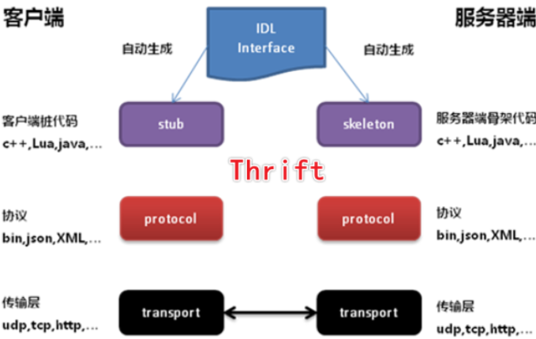
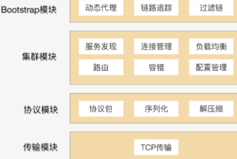
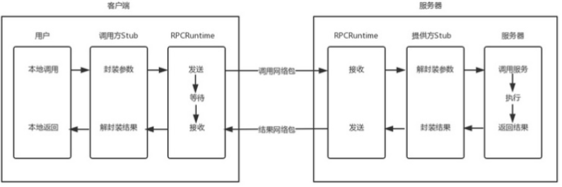
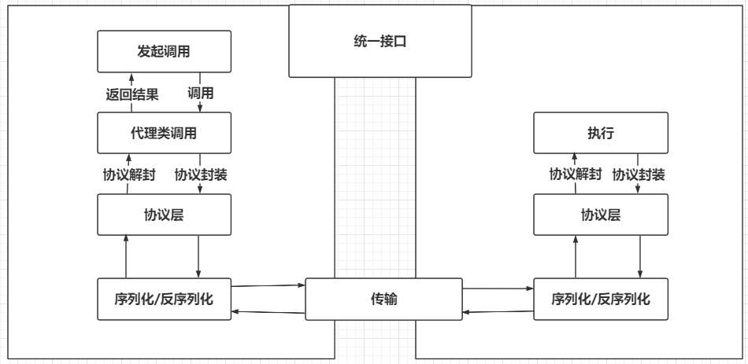
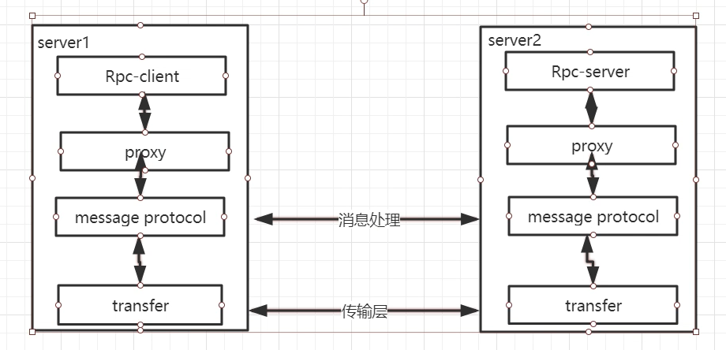
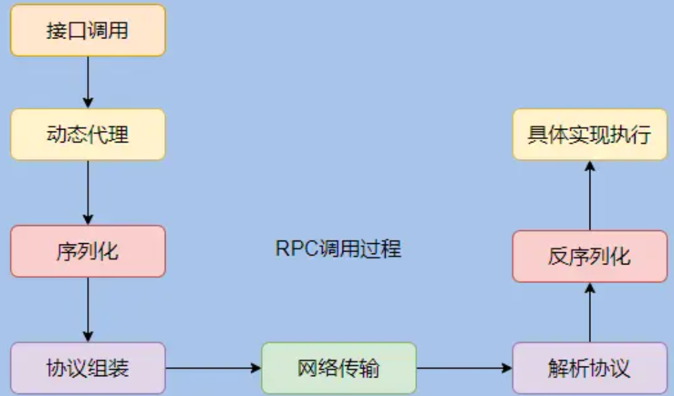
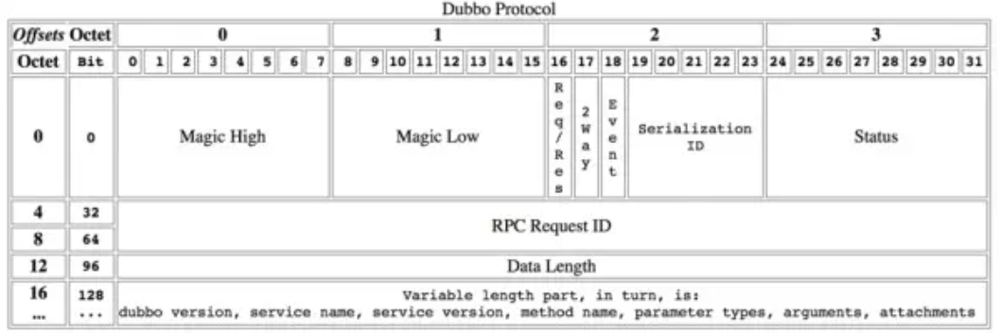

# Dubbo Notes

## RPC设计

RPC简单来说就是远程主机之间的服务调用，这里的服务狭义上可以指具体程序中的函数。要实现这种服务调用，需要考虑多个方面：

- 首先是服务定位。一个主机上的程序要调用另一个主机上的服务，得先知道该服务的地址，比如主机的IP、端口，调用的具体类/接口、方法。只有知道了这些，才能明确定义一个远程调用。
- 其次是连接的方式。两个主机之间要进行调用，必须要先建立连接，可以采用不同的通信协议，比如TCP、HTTP。不同协议具有不同的特性，适应不同的场景。
- 然后是协议格式。要进行调用，必须要有一个基本的共识，即协议，比如调用请求的格式、响应的格式等。
- 然后是数据的传输。在建立的连接上可以进行数据传输，但是数据的格式应该是不同的，可以采用二进制、xml、JSON等。比如采用二进制传输，那么就会涉及到序列化，则其中又必须有一套序列化和反序列化的协议。
- 还有服务发现。在分布式场景中，一个服务不可能以硬编码的方式了解需要调用服务的地址，可以采用注册中心作为服务发现机制，解耦。
- 另外是调用的方式。到底是采用传参返回结果，还是使用本地代理，都是可以考虑的内容。


考虑四个点：

### 资源定位

调用什么服务？

• 注册点 • 服务版本 • 服务实现组 • 接口名 • 方法名

### 服务发现

服务在哪里？谁提供的？

ZK

### 协议格式

服务提供和消费之间的约定

### 数据传输

数据该如何传输？

dubbo底层也用了tcp，是怎么解决连接建立断开的损耗的？ 默认与每个发现的provider一直保持一个长连接


实现一个高性能高可靠的RPC框架需要解决哪些问题？
1.应用都基于微服务化，实现资源调用离不开远程调用

2.一个服务可能有多个实例，你在调用时，要如何获取这些实例的地址呢？--- 这时候就需要一个服务注册中心，从服务注册中心获取服务的实例列表，再从中选择一个进行调用。

3.选哪个调用好呢？这时候就需要负载均衡了，于是又得考虑如何实现复杂均衡

4.总不能每次调用时都去注册中心查询实例列表吧，这样效率多低呀，于是又有了缓存，有了缓存，就要考虑缓存的更新问题

5.客户端总不能每次调用完都干等着服务端返回数据吧,于是就要支持异步调用;

6.服务端的接口修改了，老的接口还有人在用，怎么办？总不能让他们都改了吧？这就需要版本控制了；

7.服务端总不能每次接到请求都马上启动一个线程去处理吧？于是就需要线程池；

8.服务端关闭时，还没处理完的请求怎么办？是直接结束呢，还是等全部请求处理完再关闭呢？

至少4个组件：

Client 、Client Stub 、Server Server、 Stub

五、RPC框架需要解决的问题？

1、如何确定客户端和服务端之间的通信协议？

2、如何更高效地进行网络通信？

3、服务端提供的服务如何暴露给客户端？

4、客户端如何发现这些暴露的服务？

5、如何更高效地对请求对象和响应结果进行序列化和反序列化操作？

六、RPC的实现基础？

1、需要有非常高效的网络通信，比如一般选择Netty作为网络通信框架；

2、需要有比较高效的序列化框架，比如谷歌的Protobuf序列化框架；

3、可靠的寻址方式（主要是提供服务的发现），比如可以使用Zookeeper来注册服务等等；

4、如果是带会话（状态）的RPC调用，还需要有会话和状态保持的功能；


RPC使用了哪些关键技术？

1、动态代理

生成Client Stub（客户端存根）和Server Stub（服务端存根）的时候需要用到Java动态代理技术，可以使用JDK提供的原生的动态代理机制，也可以使用开源的：CGLib代理，Javassist字节码生成技术。

2、序列化和反序列化

在网络中，所有的数据都将会被转化为字节进行传送，所以为了能够使参数对象在网络中进行传输，需要对这些参数进行序列化和反序列化操作。序列化：把对象转换为字节序列的过程称为对象的序列化，也就是编码的过程。反序列化：把字节序列恢复为对象的过程称为对象的反序列化，也就是解码的过程。 目前比较高效的开源序列化框架：如Kryo、FastJson和Protobuf等。反序列化：把字节序列恢复为对象的过程称为对象的反序列化，也就是解码的过程。 目前比较高效的开源序列化框架：如Kryo、FastJson和Protobuf等。

3、NIO通信

出于并发性能的考虑，传统的阻塞式 IO 显然不太合适，因此我们需要异步的 IO，即 NIO。Java 提供了 NIO 的解决方案，Java 7 也提供了更优秀的 NIO.2 支持。可以选择Netty或者MINA来解决NIO数据 传输的问题。

4、服务注册中心

可选：Redis、Zookeeper、Consul 、Etcd。一般使用ZooKeeper提供服务注册与发现功能，解决单点故障以及分布式部署的问题(注册中心)。


## 服务通信协议

### RPC

RPC，一台机器通过网络远程调用另一台机器上的服务

RPC四个点：

- 资源定位
- 服务发现
- 协议格式
- 数据传输

### HTTP

- URI
- URL
- URN

### TCP

tcp连接的建立和关闭开销很大

- **长连接** (通过心跳机制保持连接)
- **连接池**


### 序列化

Jackson

- @JsonIgnore
- @JsonProperty
- @JsonCreator

使用mapper序列化


## 基础知识

公司的Dubbo服务治理平台

http://cactus.dev.qunar.com/


QunarAsyncClient, 支持异步、高性能、封装了调用者信息


官方与QUNAR的异步 不一样，建议使用公司的


### Stub

桩的应用

dubbo stub：

 相当于代理，通过它转发，可以增强。

用法：

- cache
- 服务降级
- 统一异常处理

sub需要一个使用对应server的构造方法


dubbo filter做监控


## RPC 框架对比

### 系统演进过程

- 单体架构
- 垂直架构： MVC
- 分布式服务架构
- 流动计算架构

### 各RPC对比

| 功能             | Hessian | Montan                       | rpcx   | gRPC              | Thrift        | Dubbo   | Dubbox   | Spring Cloud |
| ---------------- | ------- | ---------------------------- | ------ | ----------------- | ------------- | ------- | -------- | :----------- |
| 开发语言         | 跨语言  | Java                         | Go     | 跨语言            | 跨语言        | Java    | Java     | Java         |
| 分布式(服务治理) | ×       | √                            | √      | ×                 | ×             | √       | √        | √            |
| 多序列化框架支持 | hessian | √(支持Hessian2、Json,可扩展) | √      | × 只支持protobuf) | ×(thrift格式) | √       | √        | √            |
| 多种注册中心     | ×       | √                            | √      | ×                 | ×             | √       | √        | √            |
| 管理中心         | ×       | √                            | √      | ×                 | ×             | √       | √        | √            |
| 跨编程语言       | √       | ×(支持php client和C server)  | ×      | √                 | √             | ×       | ×        | ×            |
| 支持REST         | ×       | ×                            | ×      | ×                 | ×             | ×       | √        | √            |
| 关注度           | 低      | 中                           | 低     | 中                | 中            | 中      | 高       | 中           |
| 上手难度         | 低      | 低                           | 中     | 中                | 中            | 低      | 低       | 中           |
| 运维成本         | 低      | 中                           | 中     | 中                | 低            | 中      | 中       | 中           |
| 开源机构         | Caucho  | Weibo                        | Apache | Google            | Apache        | Alibaba | Dangdang | Apache       |


问题： RPC都是面向接口代理的吗？

个人决定应该都是的，如果不使用接口，那么该使用什么作为统一的约定，让消费方感知服务方暴露的方法呢？但是有些RPC是跨语言的，这时候是会有类似接口的功能吧？


## problems

### timeout过小导致连接不上问题

```yml
dubbo:
	registry:
		address: zookeeper://42.192.203.208:2181
		timeout: 30000
```

**timeout默认值太小了，容易连不上，需要设置大一点**


## 自写RPC

### RPC设计












代理的作用，对于面向接口的RPC，需要根据接口生成代理对象。

通过这个对象调用实际的方法，而这个调用实际是把请求接口、方法、参数发送到Server端。

https://www.bilibili.com/video/BV1ZW411Q7Hg?from=search&seid=17065543959530522605



#### 如何做到对远程调用无感知？

RPC 会给接口生成一个代理类，所以我们调用这个接口实际调用的是动态生成的代理类，由代理类来触发远程调用，这样我们调用远程接口就无感知了。


#### 代理类的生成

在 Dubbo 中用的是 Javassist。

还可以选择的有：asm\jdk\cglib


#### 协议

协议只规定通信相关的约定吧？ 比如序列化、反序列化应该是使用的是序列化工具的协议



不对，调用时应该是先序列化，在组装到协议，还是先组装协议，再序列化。 感觉还是应该先经过协议组装，再序列化，序列化后直接传输。


#### 网络传输


#### 可能存在的问题

实际的调用可能出现一些问题，比如参数，如果传递多态性的参数，是否能够识别？反射是否能够获取到对于的一个方法

反射的getMethod获取方法中，基本类和封装类是怎么识别的，没有区别？


