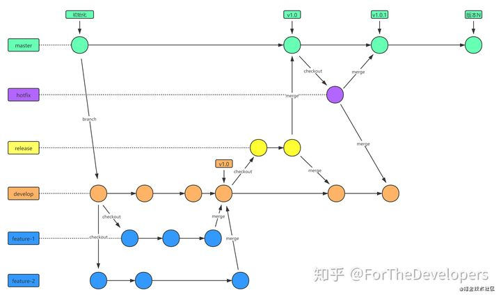

# Git Notes

## 多用户

https://blog.csdn.net/yuanlaijike/article/details/95650625


## Git分支类型

### master

- master 为产品主分支，该分支为只读唯一分支，也是用于部署生产环境的分支，需确保master分支的稳定性。
- master 分支一般由release分支或hotfix分支合并，任何情况下都不应该直接修改master分支代码。
- 产品的功能全部实现后，最终在master分支对外发布，另外所有在master分支的推送应该打标签（tag）做记录，方便追溯。
- master 分支不可删除。

### develop

- develop 为主开发分支，基于master分支创建，始终保持最新完成功能的代码以及bug修复后的代码。
- develop 分支为只读唯一分支，只能从其他分支合并，不可以直接在该分支做功能开发或bug修复。
- 一般开发新功能时，feature分支都是基于develop分支下创建的。
- develop 分支包含所有要发布到下一个release的代码。
- feature功能分支完成后, 开发人员需合并到develop分支(不推送远程)，需先将develop分支合并到feature，解决完冲突后再合并到develop分支。
- 当所有新功能开发完成后，开发人员并自测完成后，此时从develop拉取release分支，进行提测。
- release或hotfix 分支上线完成后, 开发人员需合并到develop分支并推送远程。
- develop 分支不可删。

### freture

- feature 分支通常为新功能或新特性开发分支，以develop分支为基础创建feature分支。
- 分支命名: feature/ 开头的为新特性或新功能分支，建议的命名规则: feature/user_createtime_feature，例如：feature/ftd_20201018_alipay，含义为：开发人员ftd在2020年10月18日时创建了一个支付宝支付的功能分支。
- 新特性或新功能开发完成后，开发人员需合到develop分支。
- feature 分支可同时存在多个，用于团队中多个功能同时开发。
- feature 分支属于临时分支，功能完成后可选删除。

### release

- release 分支为预上线分支，基于本次上线所有的feature分支合并到develop分支之后，从develop分支创建。
- 分支命名: release/ 开头的为预上线分支，建议的命名规则: release/version_publishtime，例如：release/v2.1.1_20201018，含义为：版本号v2.1.1计划于2020年10月18日时发布。
- release 分支主要用于提交给测试人员进行功能测试。发布提测阶段，会以release分支代码为基准进行提测。测试过程中发现的bug在本分支进行修复，上线完成后需合并到develop/master分支并推送远程。
- release 分支属于临时分支，产品上线后可选删除。

当有一组feature开发完成后，首先开发人员会各自将最新功能代码合并到develop分支。进入提测阶段时，开发组长在develop分支上创建release分支。 如果在测试过程中发现bug需要修复，则直接由开发者在release分支修复并提交。当测试完成后，开发组长将release分支合并到master和develop分支，此时master为最新可发布代码，用作产品发布上线

### hotfix

- hotfix 分支为线上bug修复分支或叫补丁分支，主要用于对线上的版本进行bug修复。
- 分支命名: hotfix/ 开头的为修复分支，它的命名规则与 feature 分支类似，建议的命名规则: hotfix/user_createtime_hotfix，例如：hotfix/ftd_20201018_alipaybugfix，含义为：开发人员ftd在2020年10月18日时创建了一个支付宝支付bug修复的分支。
- hotfix 分支用于线上出现紧急问题时，需要及时修复，以master分支为基线，创建hotfix分支。当问题修复完成后，需要合并到master分支和develop分支并推送远程。
- 所有hotfix分支的修改会进入到下一个release。
- hotfix 分支属于临时分支，bug修复上线后可选删除。

## **Git日志规范**

**「目前，社区有多种 Commit message 的写法规范。来自Angular 规范是目前使用最广的写法，比较合理和系统化。建议使用如下：」**

```text
# EN
<type>(<scope>): <subject>
<BLANK LINE>
<body>
<BLANK LINE>
<footer>

# CN
<类型>[可选的作用域]: <描述>
[可选的正文]
[可选的脚注]
```

- type: 本次 commit 的类型，诸如 bugfix、docs、style 等，类型说明参见下方。
- scope: 本次 commit 影响的范围，比如数据层、控制层、视图层等等，视项目不同而不同。
- subject: 简明扼要的阐述下本次 commit 的主旨，是 commit 目的的简短描述，建议不超过50个字符。
- body: 在主体内容中我们需要把本次 commit 详细的描述一下，比如此次变更的动机，详细的修改方法或其他需要额外重点说明的内容。
- footer: 描述下与之关联的 issue 或 break change

### **Type的类别说明：**

```text
# 主要type
feat: 增加新功能
fix: 修复bug
 
# 特殊type
docs: 只改动了文档相关的内容
style: 不影响代码含义的改动，例如去掉空格、改变缩进、增删分号
build: 构造工具的或者外部依赖的改动，例如webpack，npm
refactor: 代码重构时使用
revert: 执行git revert打印的message
 
# 暂不使用type
test: 添加测试或者修改现有测试
perf: 提高性能的改动
ci: 与CI（持续集成服务）有关的改动
chore: 不修改src或者test的其余修改，例如构建过程或辅助工具的变动
```

eg:

```text
# fix：修复支付宝支付bug
#
# 1，修复支付完成后未查询支付状态问题
# 2，增加定时任务保证支付状态完整
#
# link：http://github.com/ftd/shopmall/issue001
```

## git 工作流




git log: commit

git reflog: 所有操作，如clone

git fetch 拉去远程仓库到本地仓库


git merge 是两个分支相交，产生一个新的分支

git rebase 是线性的，没有分支。找到两个分支的第一个父节点，把该父节点后的一个分支应用到另一个分支的后面


