# Hadoop Notes

# Notes From Video

https://ke.qq.com/course/3030492?taid=10164911987375580

## 大数据概况及Hadoop

### 大数据

大数据是一个描述大量告诉复杂和可变数据的术语，需要先进的技术来实现信息的获取、存储、分发、管理和分析


- volume 体量大
- velocity 处理速度快
- variety：种类繁多：结构化 半结构化 非结构化
- value：价值密度低

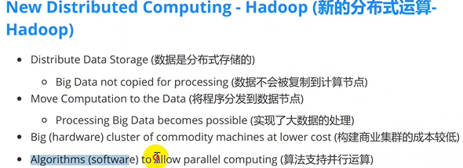

### Hadoop概述

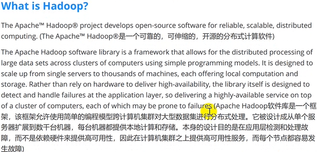

http://hadoop.apache.org/

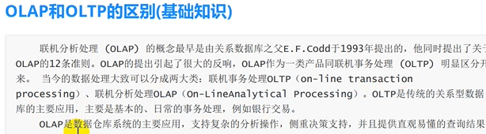


## Hadoop

### 架构

- common 公共模块

- HDFS 数据存储，分布式

- MapReduce：处理数据的核心框架

- yarn：资源管理器，资源调度，协调管理，2.x是Tez

- ecosystem：生态圈

  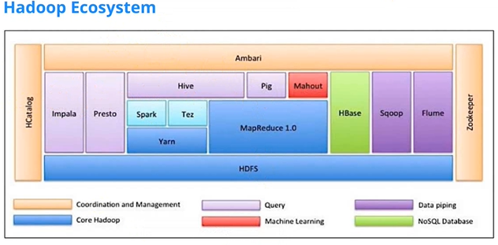

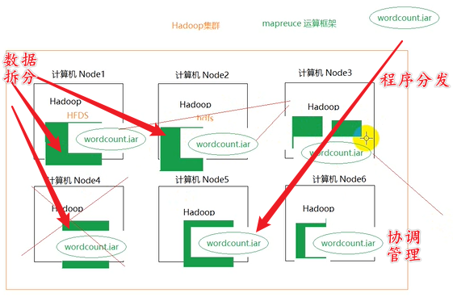

java语言实现的

### install

- 配置jdk
- Hadoop配置
- 


### HDFS role

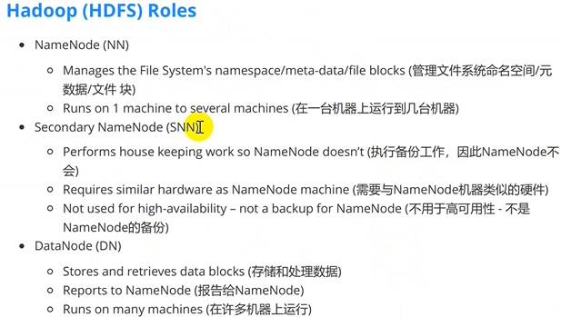

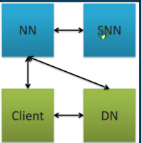

#### NameNode

NameNode存储元数据，保存数据分为多少块，每一块存放在那些节点上

数据都是存在DataNode节点

https://ke.qq.com/course/3030492?taid=10164942052146652

#### DataNode


### 组件

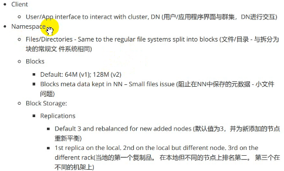

2.x版本每一个块默认是128MB

避免在HDFS中存储小文件

每个块默认保存三份，用以备份


### MapReduce Engine

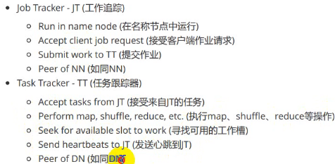


## HDFS 读写


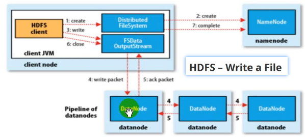

### HDFS CLI


hdfs命令有两个：

- hdfs fs：推荐
- hadoop fs: 已经过时了

```bash
# 创建目录
hdfs dfs -mkdir /dir_name 
# 查看目录
hdfs dfs -ls /dir_name
# 上传到HDFS
hdfs dfs -put a.md /dir
```

### HDFS java客户端

java 编码


## MapReduce

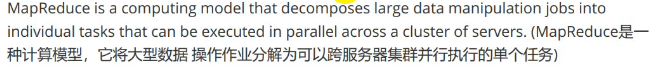

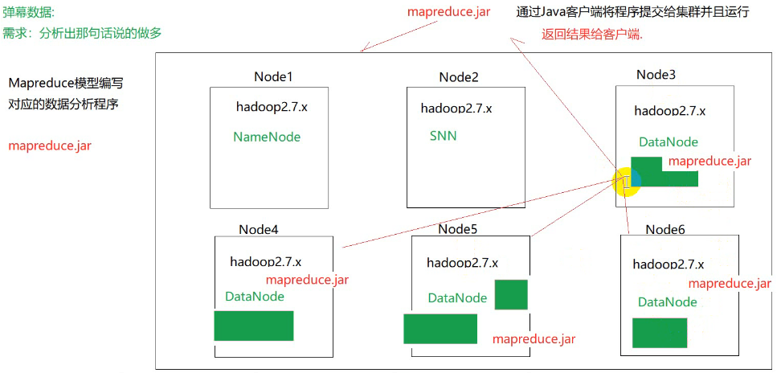

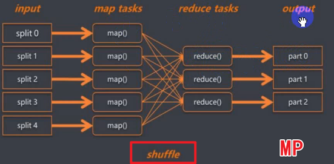

shuffle


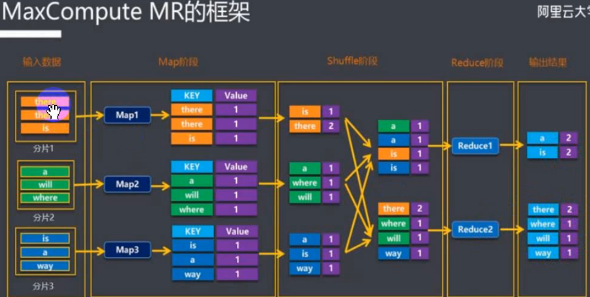

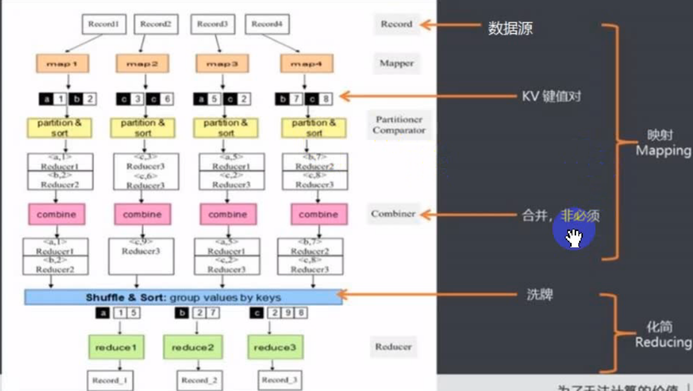

并行计算框架

用户只需要关系map和reduce两个函数


# Hadoop官方教程

http://hadoop.apache.org/docs/r1.0.4/cn/index.html

## Hadoop快速入门

编辑 conf/hadoop-env.sh文件，至少需要将JAVA_HOME设置为Java安装根路径。


可以用以下三种支持的模式中的一种启动Hadoop集群：

- 单机模式

- 伪分布式模式

  每一个Hadoop守护进程都作为一个独立的Java进程运行。

  

- 完全分布式模式

# Hadoop权威指南

Tom White著

### 0.序

Google帝国基石？MapReduce算法？

Hadoop起源于Nutch, 后来Tom White成为开发负责人

国内Hadoop人才：邵铮


Internet数据爆炸性增长，传统的技术架构不适合海量数据处理的要求，Hadoop在这样的环境下出现的，Hadoop的出现代表着互联网发展的两个方向：

第一：海量数据处理的广泛应用

第二：开源软件的蓬勃发展


### 1.初始Hadoop

#### 1.1 data

纽约证券交易所每天产生1TB的交易数据

#### 1.2 数据存储和分析

硬盘容量快速增长，访问速度却难以与时俱进

读取速度的问题：从多个磁盘读取数据

硬盘故障问题：复制备份

#### 1.3 相较于其他系统

##### 1.3.1 RDBMS

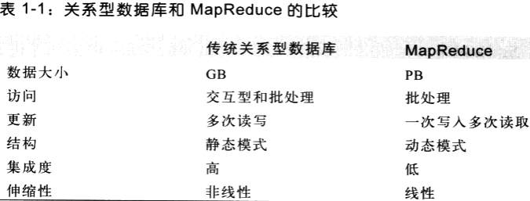

RDBMS适用于关系型数据库，而MR适合非结构化半结构化数据

##### 1.3.2 网格计算

High Performance Computing/HPC高性能计算和网格计算，做大规模数据处理，他们使用消息传递接口MPI/message passing interface这样的api

##### 1.3.3 志愿计算


#### 1.4 Hadoop发展简史


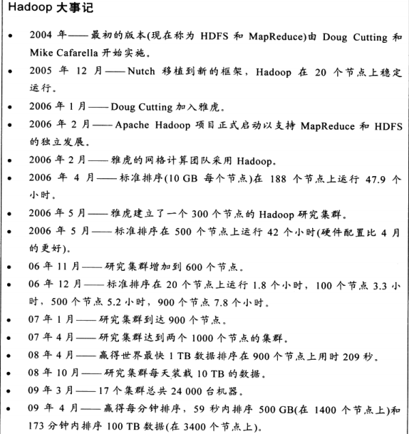


#### 1.5 Apache Hadoop

虽然Hadoop最出名的是MapReduce以及其分布式文件系统HDFS，但是其还有很多其他子项目：


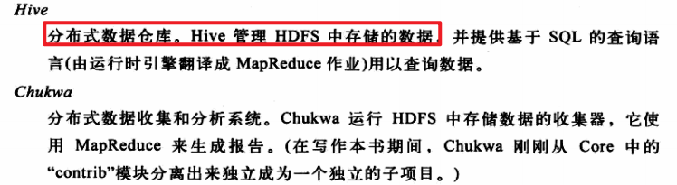

### 2.MapReduce

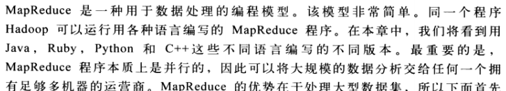


# 实践

## 安装运行

下载Hadoop，解压

使用windows环境需要下载hadoop.dll和winutils.exe

配置：

```xml
# core-site.xml
<configuration>
<property>
      <name>fs.defaultFS</name>
      <value>hdfs://localhost:9000</value>
</property>
</configuration>


# hdfs-site.xml 需要创建相应的目录
<configuration>
<property>
       <name>dfs.replication</name>
       <value>1</value>
   </property>
   <property>
       <name>dfs.namenode.name.dir</name>
       <value>/home/edwinxu/Desktop/EdwinXu/workspace/hadoop/hadoop-2.7.1/data/namenode</value>
   </property>
   <property>
       <name>dfs.datanode.data.dir</name>
     <value>/home/edwinxu/Desktop/EdwinXu/workspace/hadoop/hadoop-2.7.1/data/datanode</value>
   </property>
</configuration>


# mapred-site.xml
<configuration>
    <property>
        <name>mapreduce.framework.name</name>
        <value>yarn</value>
    </property>
</configuration>


# yarn-stie.xml
<configuration>
 <property>
       <name>yarn.nodemanager.aux-services</name>
       <value>mapreduce_shuffle</value>
   </property>
   <property>
       <name>yarn.nodemanager.aux-services.mapreduce.shuffle.class</name>
       <value>org.apache.hadoop.mapred.ShuffleHandler</value>
   </property>
   
</configuration>
```

安装java，配置环境变量

- 系统指定JAVA_HOME
- 在hadoop-env.sh中直接指定：export JAVA_HOME=/usr


验证：

jps:

```java
jps
6101 DataNode
6725 Jps
6299 SecondaryNameNode
6622 NodeManager
```


