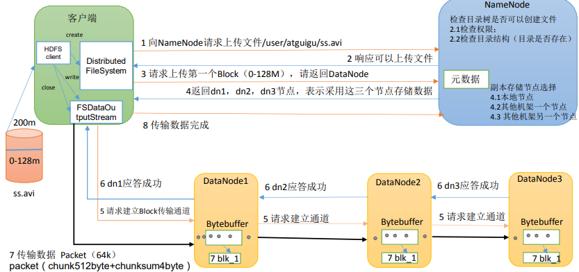
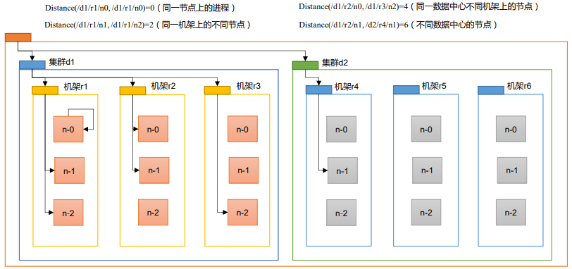
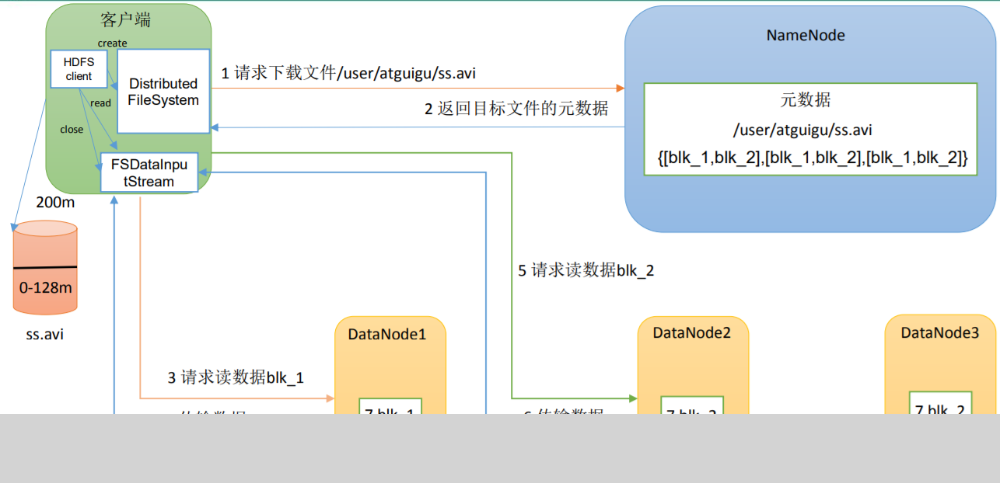
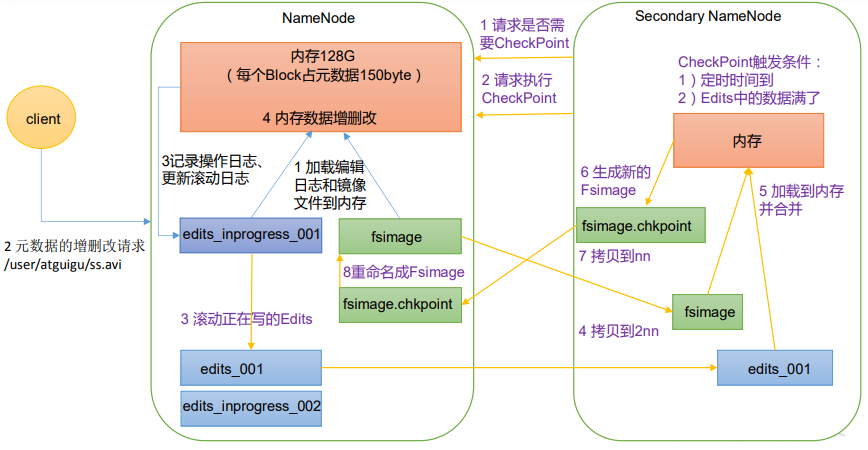
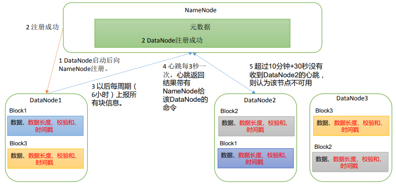
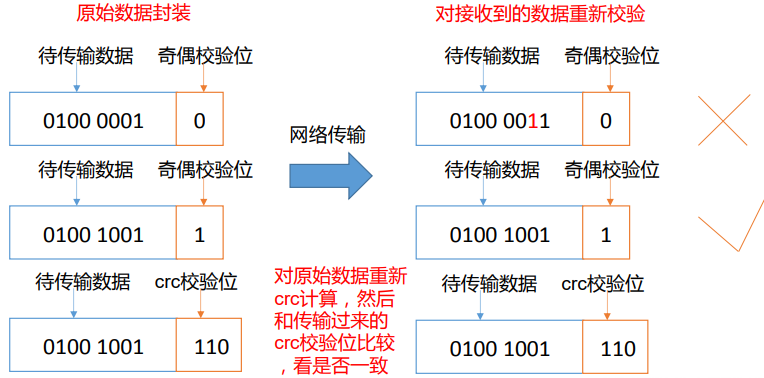
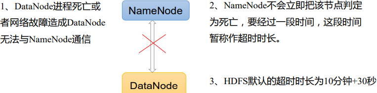

# Hadoop Notes

[01_尚硅谷大数据技术之大数据概论](_pdf/bigdata/hadoop/01_尚硅谷大数据技术之大数据概论.pdf)

[02_尚硅谷大数据技术之Hadoop_入门V3.3](_pdf/bigdata/hadoop/02_尚硅谷大数据技术之Hadoop_入门V3.3.pdf)

[03_尚硅谷大数据技术之Hadoop_HDFS_V3.3](_pdf/bigdata/hadoop/03_尚硅谷大数据技术之Hadoop_HDFS_V3.3.pdf)

[04_尚硅谷大数据技术之Hadoop_MapReduce_V3.3](_pdf/bigdata/hadoop/04_尚硅谷大数据技术之Hadoop_MapReduce_V3.3.pdf)

[05_尚硅谷大数据技术之Hadoop_Yarn_V3.3](_pdf/bigdata/hadoop/05_尚硅谷大数据技术之Hadoop_Yarn_V3.3.pdf)

[06_尚硅谷大数据技术之Hadoop_生产调优手册_V3.3](_pdf/bigdata/hadoop/06_尚硅谷大数据技术之Hadoop_生产调优手册_V3.3.pdf)

[07_尚硅谷大数据技术之Hadoop_源码解析_V3.3](_pdf/bigdata/hadoop/07_尚硅谷大数据技术之Hadoop_源码解析_V3.3.pdf)


## My Hadoop Notes

### MR

#### MR 原理


1. 在client启动一个作业
2. 向JOBTracker请求一个JOB ID
3. 将运行作业所需额资源文件复制到HDFS上：包括MR程序jar、配置文件、客户端计算所得的输入划分信息。这些file都存在job tracker专门为该作业创建的目录中，目录名为job id，jar文件默认有10个副本（mapred.submit.replication属性控制），输入划分信息告诉job tracker应该为这个作业启动多少个map任务等信息。
4. job tracker接收到作业后将其放在一个作业队列中，等待作业调度器调度。作业被调度时，会根据输入划分信息为每一个划分创建一个map任务，并将map任务分配给task tracker执行，对于map和reduce任务，task tracker根据主机核的数量和内存的大小，有固定的map槽和reduce槽。 注意毛不是随便分配给某个task tracker的，有个概念叫“**数据本地化DataLocal**”，意思是将毛任务分配给含有该map处理的数据块的task tracker上，同时将jar复制到该task tracker---“**运算移动，数据不移动**”，这样不需要传输数据，但是对于reduce任务，则不需要考虑数据本地化，因为map的输出不可避免地需要传输到reduce任务。
5. task tracker通过心跳机制想job tracker汇报：运行状态、进度


#### 过程

map阶段：

就是程序员编写好的map函数了，因此map函数效率相对好控制，而且一般map操作都是本地化操作也就是在数据存储节点上进行；

combiner阶段是程序员可以选择的，combiner其实也是一种reduce操作，因此我们看见WordCount类里是用reduce进行加载的。Combiner是一个本地化的reduce操作，它是map运算的后续操作，主要是在map计算出中间文件前做一个简单的合并重复key值的操作，例如我们对文件里的单词频率做统计，map计算时候如果碰到一个hadoop的单词就会记录为1，但是这篇文章里hadoop可能会出现n多次，那么map输出文件冗余就会很多，因此在reduce计算前对相同的key做一个合并操作，那么文件会变小，这样就提高了宽带的传输效率，毕竟hadoop计算力宽带资源往往是计算的瓶颈也是最为宝贵的资源，但是combiner操作是有风险的，使用它的原则是combiner的输入不会影响到reduce计算的最终输入，例如：如果计算只是求总数，最大值，最小值可以使用combiner，但是做平均值计算使用combiner的话，最终的reduce计算结果就会出错。

###### shuffle阶段：

将map的输出作为reduce的输入的过程就是shuffle了，这个是mapreduce优化的重点地方。这里我不讲怎么优化shuffle阶段，讲讲shuffle阶段的原理，因为大部分的书籍里都没讲清楚shuffle阶段。Shuffle一开始就是map阶段做输出操作，一般mapreduce计算的都是海量数据，map输出时候不可能把所有文件都放到内存操作，因此map写入磁盘的过程十分的复杂，更何况map输出时候要对结果进行排序，内存开销是很大的，map在做输出时候会在内存里开启一个环形内存缓冲区，这个缓冲区专门用来输出的，默认大小是100mb，并且在配置文件里为这个缓冲区设定了一个阀值，默认是0.80（这个大小和阀值都是可以在配置文件里进行配置的），同时map还会为输出操作启动一个守护线程，如果缓冲区的内存达到了阀值的80%时候，这个守护线程就会把内容写到磁盘上，这个过程叫spill，另外的20%内存可以继续写入要写进磁盘的数据，写入磁盘和写入内存操作是互不干扰的，如果缓存区被撑满了，那么map就会阻塞写入内存的操作，让写入磁盘操作完成后再继续执行写入内存操作，前面我讲到写入磁盘前会有个排序操作，这个是在写入磁盘操作时候进行，不是在写入内存时候进行的，如果我们定义了combiner函数，那么排序前还会执行combiner操作。每次spill操作也就是写入磁盘操作时候就会写一个溢出文件，也就是说在做map输出有几次spill就会产生多少个溢出文件，等map输出全部做完后，map会合并这些输出文件。这个过程里还会有一个Partitioner操作，对于这个操作很多人都很迷糊，其实Partitioner操作和map阶段的输入分片（Input split）很像，一个Partitioner对应一个reduce作业，如果我们mapreduce操作只有一个reduce操作，那么Partitioner就只有一个，如果我们有多个reduce操作，那么Partitioner对应的就会有多个，Partitioner因此就是reduce的输入分片，这个程序员可以编程控制，主要是根据实际key和value的值，根据实际业务类型或者为了更好的reduce负载均衡要求进行，这是提高reduce效率的一个关键所在。到了reduce阶段就是合并map输出文件了，Partitioner会找到对应的map输出文件，然后进行复制操作，复制操作时reduce会开启几个复制线程，这些线程默认个数是5个，程序员也可以在配置文件更改复制线程的个数，这个复制过程和map写入磁盘过程类似，也有阀值和内存大小，阀值一样可以在配置文件里配置，而内存大小是直接使用reduce的tasktracker的内存大小，复制时候reduce还会进行排序操作和合并文件操作，这些操作完了就会进行reduce计算了。

###### reduce阶段：

和map函数一样也是程序员编写的，最终结果是存储在hdfs上的。

输入 --> map --> shuffle --> reduce -->输出


**Partitioner:数据分组 决定了Map task输出的每条数据交给哪个Reduce Task处理。默认实现：hash(key) mod R R是Reduce Task数目，允许用户自定义，很多情况下需要自定义Partitioner ，比如“hash(hostname(URL)) mod R”确保相同域名的网页交给同一个Reduce Task处理 属于（map）阶段。**

Combiner：可以看做local reduce  合并相同的key对应的value，通常与reducer逻辑一样 ，好处是减少map task输出 数量（磁盘IO），减少Reduce-map网络传输数据量(网络IO) 结果叠加属于（map）阶段。

Shuffle：Shuffle描述着数据从map task输出到reduce task输入的这段过程 (完整地从map task端拉取数据到reduce 端。
 在跨节点拉取数据时，尽可能地减少对带宽的不必要消耗。减少磁盘IO对task执行的影响。) 属于(reduce)阶段。


### HDFS

#### 概述

GFS

缺点：

- 高时延
- 不适合大量小文件：占用过多namenode内存，且小文件的寻址时间过长
- **不支持并发写入、随机写入**：
  - 一个文件只能一个写，不允许多个线程同时写
  - 仅支持append，不支持随机修改

#### 读写流程

##### 写



（1）客户端通过 Distributed FileSystem 模块向 NameNode 请求上传文件查目标文件是否已存在，父目录是否存在

（2）NameNode 返回是否可以上传。 

（3）客户端请求第一个 Block 上传到哪几个 DataNode 服务器上。 

（4）NameNode 返回 3 个 DataNode 节点，分别为 dn1、dn2、dn3。 

（5）客户端通过 FSDataOutputStream 模块请求 dn1 上传数据，dn1 收到请求会继续调用 dn2，然后 dn2 调用 dn3，将这个通信管道建立完成。 

（6）dn1、dn2、dn3 逐级应答客户端。

（7）客户端开始往 dn1 上传第一个 Block（先从磁盘读取数据放到一个本地内存缓存）， 以 Packet 为单位，dn1 收到一个 Packet 就会传给 dn2，dn2 传给 dn3；dn1 每传一个 packet 会放入一个应答队列等待应答。 

（8）当一个 Block 传输完成之后，客户端再次请求 NameNode 上传第二个 Block 的服务 器。（重复执行 3-7 步）


网络拓扑-节点距离计算

在 HDFS 写数据的过程中，NameNode 会选择距离待上传数据最近距离的 DataNode 接 收数据。

节点距离：两个节点到达最近的共同祖先的距离总和。



##### 读



（1）客户端通过 DistributedFileSystem 向 NameNode 请求下载文件，NameNode 通过查 询元数据，找到文件块所在的 DataNode 地址。 （2）挑选一台 DataNode（就近原则，然后随机）服务器，请求读取数据。 （3）DataNode 开始传输数据给客户端（从磁盘里面读取数据输入流，以 Packet 为单位 来做校验）。 （4）客户端以 Packet 为单位接收，先在本地缓存，然后写入目标文件


机架感知（副本存储节点选择）

#### NN 和 2NN

##### 工作原理

思考：NameNode 中的元数据是存储在哪里的？ 

首先，我们做个假设，如果存储在 NameNode 节点的磁盘中，因为经常需要进行随机访 问，还有响应客户请求，必然是效率过低。因此，**元数据需要存放在内存中**。但如果只存在 内存中，一旦断电，元数据丢失，整个集群就无法工作了。因此产生**在磁盘中备份元数据的 FsImage**。

这样又会带来新的问题，当在内存中的元数据更新时，如果同时更新 FsImage，就会导 致效率过低，但如果不更新，就会发生一致性问题，一旦 NameNode 节点断电，就会产生数 据丢失。因此，引入 **Edits** 文件（**只进行追加操作，效率很高**）。每当元数据有更新或者添 加元数据时，修改内存中的元数据并追加到 Edits 中。这样，一旦 NameNode 节点断电，可 以通过 FsImage 和 Edits 的合并，合成元数据

但是，如果长时间添加数据到 Edits 中，会导致该文件数据过大，效率降低，而且一旦 断电，恢复元数据需要的时间过长。因此，需要定**期进行 FsImage 和 Edits 的合并，如果这 个操作由NameNode节点完成，又会效率过低。因此，引入一个新的节点SecondaryNamenode， 专门用于 FsImage 和 Edits 的合并**。



第一阶段：NameNode 启动 

（1）第一次启动 NameNode 格式化后，创建 Fsimage 和 Edits 文件。如果不是第一次启动，直接加载编辑日志和镜像文件到内存

（2）客户端对元数据进行增删改的请求。 

（3）NameNode 记录操作日志，更新滚动日志。 

（4）NameNode 在内存中对元数据进行增删改。

第二阶段：Secondary NameNode 工作 

（1）Secondary NameNode 询问 NameNode 是否需要 CheckPoint。直接带回 NameNode 是否检查结果。 

（2）Secondary NameNode 请求执行 CheckPoint。 

（3）NameNode 滚动正在写的 Edits 日志。 

（4）将滚动前的编辑日志和镜像文件拷贝到 Secondary NameNode。 

（5）Secondary NameNode 加载编辑日志和镜像文件到内存，并合并。 

（6）生成新的镜像文件 fsimage.chkpoint。 

（7）拷贝 fsimage.chkpoint 到 NameNode。 

（8）NameNode 将 fsimage.chkpoint 重新命名成 fsimage。


NameNode被格式化之后，将在/opt/module/hadoop-3.1.3/data/tmp/dfs/name/current目录中产生如下文件 ：

```
fsimage_0000000000000000000 
fsimage_0000000000000000000.md5 
seen_txid 
VERSION
```

（1）Fsimage文件：HDFS文件系统元数据的一个永久性的检查点，其中包含HDFS文件系统的所有目 录和文件inode的序列化信息。  

（2）Edits文件：存放HDFS文件系统的所有更新操作的路径，文件系统客户端执行的所有写操作首先 会被记录到Edits文件中。 

（3）seen_txid文件保存的是一个数字，就是最后一个edits_的数字 

（4）每 次NameNode启动的时候都会将Fsimage文件读入内存，加 载Edits里面的更新操作，保证内存 中的元数据信息是最新的、同步的，可以看成NameNode启动的时候就将Fsimage和Edits文件进行了合并


##### 查看与配置

oev 查看 Edits 文件


CheckPoint 时间设置 

1）通常情况下，SecondaryNameNode **每隔一小时**执行一次

```xml
# hdfs-default.xml
<property>
 <name>dfs.namenode.checkpoint.period</name>
 <value>3600s</value>
</property>
```

2）一分钟检查一次操作次数，当操作次数达到 1 百万时，SecondaryNameNode 执行一次。

```xml
<property>
 <name>dfs.namenode.checkpoint.txns</name>
 <value>1000000</value>
<description>操作动作次数</description>
</property>
<property>
 <name>dfs.namenode.checkpoint.check.period</name>
 <value>60s</value>
<description> 1 分钟检查一次操作次数</description>
</property>
```

#### DataNode



1. 一个数据块在 DataNode 上以文件形式存储在磁盘上，包括两个文件，一个是数据 本身，一个是**元数据包括数据块的长度，块数据的校验和，以及时间戳**

2. DataNode 启动后向 NameNode 注册，通过后，周期性（6 小时）的向 NameNode 上 报所有的块信息

   ```xml
   <!-- DN 向 NN 汇报当前解读信息的时间间隔，默认 6 小时； -->
   <property>
   <name>dfs.blockreport.intervalMsec</name>
   <value>21600000</value>
   <description>Determines block reporting interval in
   milliseconds.</description>
   </property>
   
   DN 扫描自己节点块信息列表的时间，默认 6 小时
   <property>
   <name>dfs.datanode.directoryscan.interval</name>
   <value>21600s</value>
   <description>Interval in seconds for Datanode to scan data
   directories and reconcile the difference between blocks in memory and on
   the disk.
   Support multiple time unit suffix(case insensitive), as described
   in dfs.heartbeat.interval.
   </description>
   </property>
   
   ```

3. 心跳是每 3 秒一次，心跳返回结果带有 NameNode 给该 DataNode 的命令如复制块 数据到另一台机器，或删除某个数据块。如果超过 10 分钟没有收到某个 DataNode 的心跳， 则认为该节点不可用


数据完整性校验：

如下是 DataNode 节点保证数据完整性的方法。 

（1）当 DataNode 读取 Block 的时候，它会计算 CheckSum。 

（2）如果计算后的 CheckSum，与 Block 创建时值不一样，说明 Block 已经损坏。 

（3）Client 读取其他 DataNode 上的 Block。 

（4）常见的校验算法 crc（32），md5（128），sha1（160） 

（5）DataNode 在其文件创建后周期验证 CheckSum。




 掉线时限参数设置：



如果定义超时时间为TimeOut，则超时时长的计算公式为

TimeOut = 2 * dfs.namenode.heartbeat.recheck-interval + 10 * dfs.heartbeat.interval

而默认的dfs.namenode.heartbeat.recheck-interval 大小为5分钟，dfs.heartbeat.interval默认为3秒

需要注意的是 hdfs-site.xml 配置文件中的 heartbeat.recheck.interval 的单位为毫秒， dfs.heartbeat.interval 的单位为秒


# Notes From Video

https://ke.qq.com/course/3030492?taid=10164911987375580

## 大数据概况及Hadoop

### 大数据

大数据是一个描述大量告诉复杂和可变数据的术语，需要先进的技术来实现信息的获取、存储、分发、管理和分析


- volume 体量大
- velocity 处理速度快
- variety：种类繁多：结构化 半结构化 非结构化
- value：价值密度低


### Hadoop概述


http://hadoop.apache.org/


## Hadoop

```text
一、Hadoop入门
	1、常用端口号
	hadoop3.x 
		HDFS NameNode 内部通常端口：8020/9000/9820
		HDFS NameNode 对用户的查询端口：9870
		Yarn查看任务运行情况的：8088
		历史服务器：19888
	hadoop2.x 
		HDFS NameNode 内部通常端口：8020/9000
		HDFS NameNode 对用户的查询端口：50070
		Yarn查看任务运行情况的：8088
		历史服务器：19888
	2、常用的配置文件
	3.x core-site.xml  hdfs-site.xml  yarn-site.xml  mapred-site.xml workers
	2.x core-site.xml  hdfs-site.xml  yarn-site.xml  mapred-site.xml slaves
	
二、HDFS
	1、HDFS文件块大小（面试重点）
		硬盘读写速度
		在企业中  一般128m（中小公司）   256m （大公司）
	2、HDFS的Shell操作（开发重点）
	3、HDFS的读写流程（面试重点）
三、Map Reduce
	1、InputFormat
		1）默认的是TextInputformat  kv  key偏移量，v :一行内容
		2）处理小文件CombineTextInputFormat 把多个文件合并到一起统一切片
	2、Mapper 
		setup()初始化；  map()用户的业务逻辑； clearup() 关闭资源；
	3、分区
		默认分区HashPartitioner ，默认按照key的hash值%numreducetask个数
		自定义分区
	4、排序
		1）部分排序  每个输出的文件内部有序。
		2）全排序：  一个reduce ,对所有数据大排序。
		3）二次排序：  自定义排序范畴， 实现 writableCompare接口， 重写compareTo方法
			总流量倒序  按照上行流量 正序
	5、Combiner 
		前提：不影响最终的业务逻辑（求和 没问题   求平均值）
		提前聚合map  => 解决数据倾斜的一个方法
	6、Reducer
		用户的业务逻辑；
		setup()初始化；reduce()用户的业务逻辑； clearup() 关闭资源；
	7、OutputFormat
		1）默认TextOutputFormat  按行输出到文件
		2）自定义
四、Yarn
	1、Yarn的工作机制（面试题）
		
	2、Yarn的调度器
		1）FIFO/容量/公平
		2）apache 默认调度器  容量； CDH默认调度器 公平
		3）公平/容量默认一个default ，需要创建多队列
		4）中小企业：hive  spark flink  mr  
		5）中大企业：业务模块：登录/注册/购物车/营销
		6）好处：解耦  降低风险  11.11  6.18  降级使用
		7）每个调度器特点：
			相同点：支持多队列，可以借资源，支持多用户
			不同点：容量调度器：优先满足先进来的任务执行
					公平调度器，在队列里面的任务公平享有队列资源
		8）生产环境怎么选：
			中小企业，对并发度要求不高，选择容量
			中大企业，对并发度要求比较高，选择公平。
	3、开发需要重点掌握：
		1）队列运行原理	
		2）Yarn常用命令
		3）核心参数配置
		4）配置容量调度器和公平调度器。
		5）tool接口使用。
```


### 架构

- common 公共模块

- HDFS 数据存储，分布式

- MapReduce：处理数据的核心框架

- yarn：资源管理器，资源调度，协调管理，2.x是Tez

- ecosystem：生态圈

  


java语言实现的

### install

- 配置jdk
- Hadoop配置
- 


### HDFS role


#### NameNode

NameNode存储元数据，保存数据分为多少块，每一块存放在那些节点上

数据都是存在DataNode节点

https://ke.qq.com/course/3030492?taid=10164942052146652

#### DataNode


### 组件


2.x版本每一个块默认是128MB

避免在HDFS中存储小文件

每个块默认保存三份，用以备份


### MapReduce Engine


## HDFS 读写


### HDFS CLI


hdfs命令有两个：

- hdfs fs：推荐
- hadoop fs: 已经过时了

```bash
# 创建目录
hdfs dfs -mkdir /dir_name 
# 查看目录
hdfs dfs -ls /dir_name
# 上传到HDFS
hdfs dfs -put a.md /dir

要从HDFS中删除文件，可以使用以下命令：

hadoop fs -rm -r -skipTrash /path_to_file/file_name
要从HDFS中删除文件夹，可以使用以下命令：

hadoop fs -rm -r -skipTrash /folder_name
hadoop fs jar MAIN_CLASS a
```

### HDFS java客户端

java 编码


## MapReduce


shuffle


并行计算框架

用户只需要关系map和reduce两个函数

Partition类

### WordCount案例

依赖：

```xml
   <dependencies>
        <dependency>
            <groupId>org.apache.hadoop</groupId>
            <artifactId>hadoop-common</artifactId>
            <version>3.2.1</version>
        </dependency>
        <dependency>
            <groupId>org.apache.hadoop</groupId>
            <artifactId>hadoop-client</artifactId>
            <version>3.2.1</version>
        </dependency>
        <dependency>
            <groupId>org.apache.hadoop</groupId>
            <artifactId>hadoop-hdfs</artifactId>
            <version>3.2.1</version>
        </dependency>
        <dependency>
            <groupId>org.apache.hadoop</groupId>
            <artifactId>hadoop-mapreduce-client-common</artifactId>
            <version>3.2.1</version>
        </dependency>
        <dependency>
            <groupId>org.apache.hadoop</groupId>
            <artifactId>hadoop-mapreduce-client-core</artifactId>
            <version>3.2.1</version>
        </dependency>
    </dependencies>
```

mapper reduce job:

```java
public class WordCountMapper extends Mapper<LongWritable, Text, Text, IntWritable> {
    @Override
    protected void map(LongWritable key, Text value, Context context) throws IOException, InterruptedException {
        String string = value.toString();
        if (!Strings.isNullOrEmpty(string)){
            String[] strArr = string.trim().split(" +");
            for (String s : strArr) {
                context.write(new Text(s), new IntWritable(1));
            }
        }
    }
}

public class WordCountReducer extends Reducer<Text, IntWritable, Text, IntWritable> {
    @Override
    protected void reduce(Text key, Iterable<IntWritable> values, Context context) throws IOException, InterruptedException {
        AtomicInteger cnt = new AtomicInteger();
        values.forEach(val -> {
            cnt.addAndGet(val.get());
        });
        context.write(key, new IntWritable(cnt.get()));
    }
}

public class WordCountJob {
    public void countWords(String input , String output){
        try {
            Job job = Job.getInstance();
            job.setJarByClass(WordCountJob.class);

            job.setMapperClass(WordCountMapper.class);
            job.setMapOutputKeyClass(Text.class);
            job.setMapOutputValueClass(IntWritable.class);

            job.setReducerClass(WordCountReducer.class);
            job.setOutputKeyClass(Text.class);
            job.setOutputValueClass(IntWritable.class);

            FileInputFormat.setInputPaths(job, new Path(input));
            FileOutputFormat.setOutputPath(job, new Path(output));
            boolean waitForCompletion = job.waitForCompletion(true);
            System.out.println("Count Words " + (waitForCompletion ? "SUCCEEDED." : "FAILED."));
        } catch (Exception e) {
            e.printStackTrace();
        }
    }

    public static void main(String[] args) {
        WordCountJob job = new WordCountJob();
        if (args.length < 2){
            System.out.println("Please input source filepath and target filepath!");
            System.exit(-1);
        }
        job.countWords(args[0], args[1]);
    }
}
```

打包

启动hadoop

上传输入文件

```shell
./hadoop fs -put /home/edwinxu/Desktop/EdwinXu/workspace/hadoop/jars/wordcount/input.txt /wordcount
```


运行jar：

```shell
./hadoop jar /home/edwinxu/Desktop/EdwinXu/workspace/hadoop/jars/wordcount/wordcount.jar cn.edw.bigdata.hadoop.WordCountJob /wordcount/input.txt /wordcount
```


先跳到Hive：

https://ke.qq.com/webcourse/3030492/103148093#taid=10171332963483100&vid=5285890808495683641

## Hive

### 数据仓库

大量的数据汇集到一起


hive将结构化数据映射为一张表

优势：

- 编码简单：HQL
- hive支持不同的运算框架：如spark等


**HQL会翻译成MR然后执行**

Hive实现WordCount：


# Hadoop官方教程

http://hadoop.apache.org/docs/r1.0.4/cn/index.html

## Hadoop快速入门

编辑 conf/hadoop-env.sh文件，至少需要将JAVA_HOME设置为Java安装根路径。


可以用以下三种支持的模式中的一种启动Hadoop集群：

- 单机模式

- 伪分布式模式

  每一个Hadoop守护进程都作为一个独立的Java进程运行。

  

- 完全分布式模式

# Hadoop权威指南

Tom White著

### 0.序

Google帝国基石？MapReduce算法？

Hadoop起源于Nutch, 后来Tom White成为开发负责人

国内Hadoop人才：邵铮


Internet数据爆炸性增长，传统的技术架构不适合海量数据处理的要求，Hadoop在这样的环境下出现的，Hadoop的出现代表着互联网发展的两个方向：

第一：海量数据处理的广泛应用

第二：开源软件的蓬勃发展


### 1.初始Hadoop

#### 1.1 data

纽约证券交易所每天产生1TB的交易数据

#### 1.2 数据存储和分析

硬盘容量快速增长，访问速度却难以与时俱进

读取速度的问题：从多个磁盘读取数据

硬盘故障问题：复制备份

#### 1.3 相较于其他系统

##### 1.3.1 RDBMS


RDBMS适用于关系型数据库，而MR适合非结构化半结构化数据

##### 1.3.2 网格计算

High Performance Computing/HPC高性能计算和网格计算，做大规模数据处理，他们使用消息传递接口MPI/message passing interface这样的api

##### 1.3.3 志愿计算


#### 1.4 Hadoop发展简史


#### 1.5 Apache Hadoop

虽然Hadoop最出名的是MapReduce以及其分布式文件系统HDFS，但是其还有很多其他子项目：


### 2.MapReduce


#### 2.4 分布化

**MR JOB是执行的单位：包含输入数据、MR程序和配置信息**

**Hadoop通过把作业分成若干个小任务Task来工作：包括map和reduce**

**有两种类型的节点控制着作业执行过程：JOBTracker和多个TaskTracker**

**job tracker通过调度任务在task tracker上执行，来协调所有运行在系统上的作业，task tracker在运行的同时想jobtracker汇报进度**

**jobtracker记录每个任务的执行情况，如果有任务失败则调用其他task执行**

hadoop将数据分片发送给MR，MR为每一个分片创建一个map任务

一个分片往往是一个HDFS块的大小


也有可能是没有Reducer，Map输出后直接写到HDFS


Combiner 可以在map阶段对数据做一些简单的处理，比如求最大值，减少map的输出，提升性能

### 3.分布式文件系统

HDFS：Hadoop Distributed FileSystem

“一次写入，多次读取”思想

#### 块

磁盘有块，以块为单位操作

HDFS也是以块为单元，默认64(高版本128M)，(为什么这么大？最大化磁盘的传输效率，数据传输时间应该远大于磁盘转移时间)

注意：HDFS中没有一个块的文件实际不会占据一个块的物理空间

#### DataNode NameNode

HDFS集群中有两种节点

Namenode维护目录中所有的索引和地址，以及各种元数据

DataNode存储数据，提供定位服务

#### FS

DistributedFileSystem

#### java接口

从Hadoop URL中读取数据


hdfs://host/path/*

FSDataInputStream

FileSystemDoubleCat


目录：

Filestatus


#### 3.6.数据流


节点间通过RPC通信


副本的存放：


#### 归档

Hadoop Archives

### Hadoop IO

数据完整性校验

压缩


编码解码


序列化：

Hadoop使用自己的序列化工具Writables


##### Writeable


# 实践

## 安装运行

下载Hadoop，解压

使用windows环境需要下载hadoop.dll和winutils.exe

配置：

```xml
# core-site.xml
<configuration>
<property>
      <name>fs.defaultFS</name>
      <value>hdfs://localhost:9000</value>
</property>
</configuration>


# hdfs-site.xml 需要创建相应的目录
<configuration>
<property>
       <name>dfs.replication</name>
       <value>1</value>
   </property>
   <property>
       <name>dfs.namenode.name.dir</name>
       <value>/home/edwinxu/Desktop/EdwinXu/workspace/hadoop/hadoop-2.7.1/data/namenode</value>
   </property>
   <property>
       <name>dfs.datanode.data.dir</name>
     <value>/home/edwinxu/Desktop/EdwinXu/workspace/hadoop/hadoop-2.7.1/data/datanode</value>
   </property>
</configuration>


# mapred-site.xml
<configuration>
    <property>
        <name>mapreduce.framework.name</name>
        <value>yarn</value>
    </property>
</configuration>


# yarn-stie.xml
<configuration>
 <property>
       <name>yarn.nodemanager.aux-services</name>
       <value>mapreduce_shuffle</value>
   </property>
   <property>
       <name>yarn.nodemanager.aux-services.mapreduce.shuffle.class</name>
       <value>org.apache.hadoop.mapred.ShuffleHandler</value>
   </property>
   
</configuration>
```

安装java，配置环境变量

- 系统指定JAVA_HOME
- 在hadoop-env.sh中直接指定：export JAVA_HOME=/usr


验证：

jps:

```java
jps
6101 DataNode
6725 Jps
6299 SecondaryNameNode
6622 NodeManager
```


