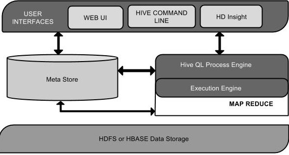
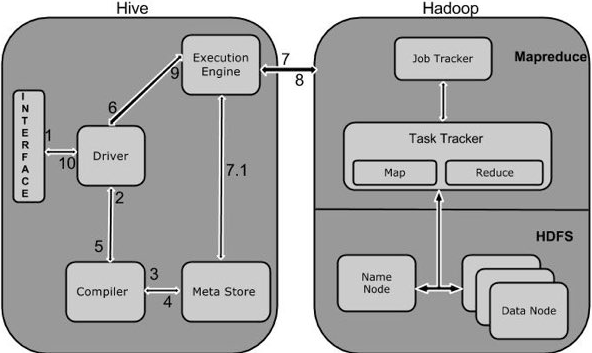
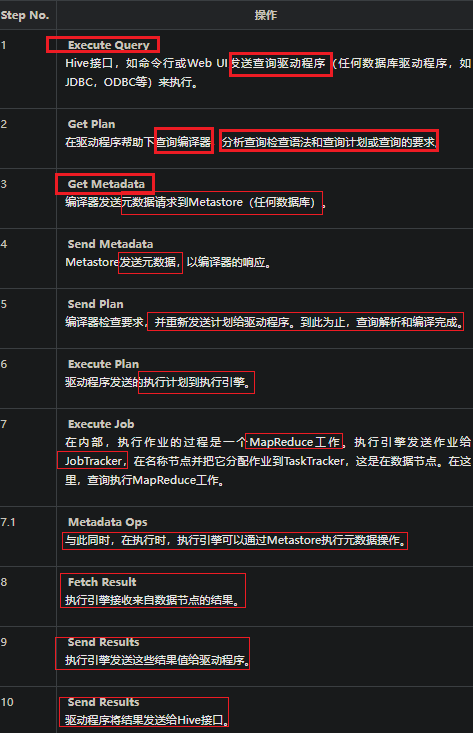
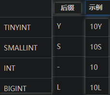
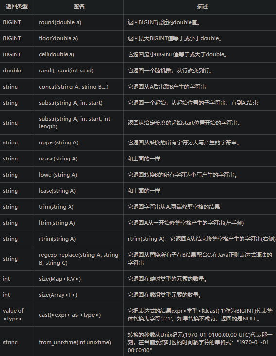
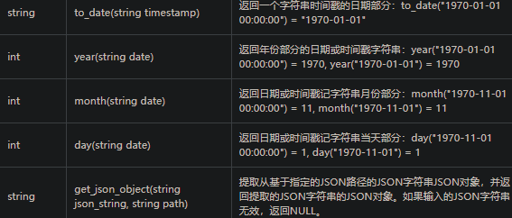
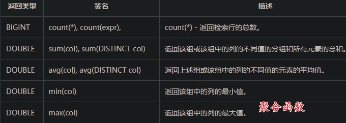

# Hive Notes

## Hive基础

### 简介

hive是一个数据仓库工具，用来在Hadoop中处理 **结构化数据**。

hive结构在Hadoop之上，总归为大数据，使查询和分析更加方便

提供简单的SQL，可以将SQL语句转化为MapReduce任务执行

Hadoop是用于处理大数据的框架，分为MapReduce和hdfs两个主要模块

Hadoop生态系统包含用于协助Hadoop的不同子项目工具模块，如Sqoop\Pig\Hive：

- Sqoop: 用来在hdfs和rdbms之间来回导入和导出数据
- Pig：用来开发MapReduce操作的脚本程序语言的平台
- Hive：用来开发SQL类型脚本用于做MapReduce操作


hive是一个**数据仓库基础工具**，用来在Hadoop中处理结构化数据

Facebook开发，转由Apache孵化


特点:

- 存储架构在一个数据库中并处理数据到hdfs
- 转为联机事务处理（OLTP）设计
- 提供SQL类型语言查询：HiveQL or HQL
- 快速可扩展

### 架构



- 用户接口/界面：Hive是一个数据仓库基础工具软件，可以创建用户和HDFS之间互动。用户界面，Hive支持是Hive的Web UI，Hive命令行，HiveHD洞察（在Windows服务器）。
- 元存储：Hive选择各自的数据库服务器，用以储存表，数据库，列模式或元数据表，它们的数据类型和HDFS映射。
- HQL处理引擎：HiveQL类似于SQL的查询上Metastore模式信息。这是传统的方式进行MapReduce程序的替代品之一。相反，使用Java编写的MapReduce程序，可以编写为MapReduce工作，并处理它的查询。
- 执行引擎：HiveQL处理引擎和MapReduce的结合部分是由Hive执行引擎。执行引擎处理查询并产生结果和MapReduce的结果一样。它采用MapReduce方法。
- HDFS/HBASE: Hadoop的分布式文件系统或者HBASE数据存储技术是用于将数据存储到文件系统。

### 工作原理





### 安装

依赖于：

- java
- Hadoop

下载hive：apache-hive-0.14.0-bin.tar.gz

配置

Apache Derby

### 数据类型

hive有四种数据类型：

#### 列类型

用作hive的列类型，包含：

1.整形

整型数据可以指定使用整型数据类型，INT。当数据范围超过INT的范围，需要使用BIGINT，如果数据范围比INT小，使用SMALLINT。 TINYINT比SMALLINT小。



2.字符串

字符串类型的数据类型可以使用单引号('')或双引号(“”)来指定。它包含两个数据类型：VARCHAR和CHAR。Hive遵循C-类型的转义字符。

- varchar: 1~65535
- char: 255

3.时间戳

它支持传统的UNIX时间戳可选纳秒的精度。它支持的java.sql.Timestamp格式“YYYY-MM-DD HH:MM:SS.fffffffff”和格式“YYYY-MM-DD HH:MM:ss.ffffffffff”。

4.日期

DATE值在年/月/日的格式形式描述 {{YYYY-MM-DD}}.

5.小数

在Hive 小数类型与Java大十进制格式相同。它是用于表示不可改变任意精度。语法和示例如下：

```
DECIMAL(precision, scale)
decimal(10,0)
```

6.联合类型

联合是异类的数据类型的集合。可以使用联合创建的一个实例

```text
UNIONTYPE<int, double, array<string>, struct<a:int,b:string>>

{0:1} 
{1:2.0} 
{2:["three","four"]} 
{3:{"a":5,"b":"five"}} 
{2:["six","seven"]} 
{3:{"a":8,"b":"eight"}} 
{0:9} 
{1:10.0}
```

#### 文字

浮点

浮点类型是有小数点的数字

十进制

十进制数据类型是只不过浮点值范围比DOUBLE数据类型更大。十进制类型的范围大约是 -10-308 到 10308.

#### Null

缺失值

#### 复杂类型

数组

ARRAY<data_type>

映射

 MAP<primitive_type, data_type>

结构体

STRUCT<col_name : data_type [COMMENT col_comment], ...>

### 库操作

创建库：

CREATE DATABASE|SCHEMA [IF NOT EXISTS] <database name>

JDBC方式：

```java
public class HiveCreateDb {
   private static String driverName = "org.apache.hadoop.hive.jdbc.HiveDriver";
   
   public static void main(String[] args) throws SQLException {
      // Register driver and create driver instance
   
      Class.forName(driverName);
      // get connection
      
      Connection con = DriverManager.getConnection("jdbc:hive://localhost:10000/default", "", "");
      Statement stmt = con.createStatement();
      
      stmt.executeQuery("CREATE DATABASE userdb");
      System.out.println(“Database userdb created successfully.”);
      
      con.close();
   }
}
```

删除库：

DROP (DATABASE|SCHEMA) [IF EXISTS] database_name  [RESTRICT|CASCADE];


```java
public class HiveDropDb {
   private static String driverName = "org.apache.hadoop.hive.jdbc.HiveDriver";
   
   public static void main(String[] args) throws SQLException {
   
      // Register driver and create driver instance
      Class.forName(driverName);
      
      // get connection
      Connection con = DriverManager.getConnection("jdbc:hive://localhost:10000/default", "", "");
      Statement stmt = con.createStatement();
      stmt.executeQuery("DROP DATABASE userdb");
      
      System.out.println(“Drop userdb database successful.”);
      
      con.close();
   }
}
```

### 表操作

创建表：

```sql
CREATE [TEMPORARY] [EXTERNAL] TABLE [IF NOT EXISTS] [db_name.] table_name

[(col_name data_type [COMMENT col_comment], ...)]
[COMMENT table_comment]
[ROW FORMAT row_format]
[STORED AS file_format]

hive> CREATE TABLE IF NOT EXISTS employee ( eid int, name String,
> salary String, destination String)
> COMMENT ‘Employee details’
> ROW FORMAT DELIMITED
> FIELDS TERMINATED BY ‘\t’
> LINES TERMINATED BY ‘\n’
> STORED AS TEXTFILE;
```

修改表

```java
ALTER TABLE name RENAME TO new_name
ALTER TABLE name ADD COLUMNS (col_spec[, col_spec ...])
ALTER TABLE name DROP [COLUMN] column_name
ALTER TABLE name CHANGE column_name new_name new_type
ALTER TABLE name REPLACE COLUMNS (col_spec[, col_spec ...])
```

重命名表

ALTER TABLE employee RENAME TO emp;

修改列

hive> ALTER TABLE employee CHANGE name ename String; hive> ALTER TABLE employee CHANGE salary salary Double;

删除表：

DROP TABLE [IF EXISTS] table_name;

### 数据操作

插入数据 **LOAD DATA**

一般来说，在SQL创建表后，我们就可以使用INSERT语句插入数据。但在Hive中，可以使用LOAD DATA语句插入数据。

将数据插入到Hive，最好是使用LOAD DATA来存储大量记录。有两种方法用来加载数据：一种是从本地文件系统，第二种是从Hadoop文件系统。

```sql
LOAD DATA [LOCAL] INPATH 'filepath' [OVERWRITE] INTO TABLE tablename 
[PARTITION (partcol1=val1, partcol2=val2 ...)]
```

LOCAL是标识符指定本地路径。它是可选的。

OVERWRITE 是可选的，覆盖表中的数据。

PARTITION 这是可选的

eg: 

sample.txt:

```text
1201  Gopal       45000    Technical manager
1202  Manisha     45000    Proof reader
1203  Masthanvali 40000    Technical writer
1204  Kiran       40000    Hr Admin
1205  Kranthi     30000    Op Admin

hive> LOAD DATA LOCAL INPATH '/home/user/sample.txt'
> OVERWRITE INTO TABLE employee;
```

JDBC:

```java
public class HiveLoadData {

   private static String driverName = "org.apache.hadoop.hive.jdbc.HiveDriver";
   
   public static void main(String[] args) throws SQLException {
   
      // Register driver and create driver instance
      Class.forName(driverName);
      
      // get connection
      Connection con = DriverManager.getConnection("jdbc:hive://localhost:10000/userdb", "", "");
      
      // create statement
      Statement stmt = con.createStatement();
      
      // execute statement
      stmt.executeQuery("LOAD DATA LOCAL INPATH '/home/user/sample.txt'" + "OVERWRITE INTO TABLE employee;");
      System.out.println("Load Data into employee successful");
      
      con.close();
   }
}
```

### 分区

Hive组织表到分区。它是将一个表到基于分区列，如日期，城市和部门的值相关方式。使用分区，很容易对数据进行部分查询。

​	表或分区是细分成桶，以提供额外的结构，可以使用更高效的查询的数据。桶的工作是基于表的一些列的散列函数值。

​	例如，一个名为Tab1表包含雇员数据，如 id, name, dept 和yoj (即加盟年份)。假设需要检索所有在2012年加入，查询搜索整个表所需的信息员工的详细信息。但是，如果用年份分区雇员数据并将其存储在一个单独的文件，它减少了查询处理时间

可以通过添加分区表改变所述表。假设我们有一个表叫employee ，拥有如 Id, Name, Salary, Designation, Dept, 和 yoj等字段。

```sql
ALTER TABLE table_name ADD [IF NOT EXISTS] PARTITION partition_spec
[LOCATION 'location1'] partition_spec [LOCATION 'location2'] ...;

partition_spec:
: (p_column = p_col_value, p_column = p_col_value, ...)//原文出自【易百教程】，商业转载请联系作者获得授权，非商业请保留原文链接：https://www.yiibai.com/hive/hive_partitioning.html#article-start

hive> ALTER TABLE employee
> ADD PARTITION (year=’2013’)
> location '/2012/part2012';
```

重命名分区

ALTER TABLE table_name PARTITION partition_spec RENAME TO PARTITION partition_spec;

删除分区

ALTER TABLE table_name DROP [IF EXISTS] PARTITION partition_spec, PARTITION partition_spec,...;

### 内置运算符

HIVE有四种内置运算符

#### 关系运算符

- =
- !=
- <
- <=
- \> 
- \>=
- IS NULL
- IS NOT NULL
- LIKE
- A RLIKE B：A或B任一个为null，true，否则看是否匹配正则表达式
- REGEXP: 等同于

#### 算术运算符

- +
- \-
- *
- /
- %
- &
- |
- ^
- ~

同java

#### 逻辑运算符

- and &&
- or ||
- not !

#### 复杂运算符


### 内置函数







### 视图和索引

```sql
CREATE VIEW [IF NOT EXISTS] view_name [(column_name [COMMENT column_comment], ...) ]
[COMMENT table_comment]
AS SELECT ...

DROP VIEW view_name

CREATE INDEX index_name
ON TABLE base_table_name (col_name, ...)
AS 'index.handler.class.name'
[WITH DEFERRED REBUILD]
[IDXPROPERTIES (property_name=property_value, ...)]
[IN TABLE index_table_name]
[PARTITIONED BY (col_name, ...)]
[
   [ ROW FORMAT ...] STORED AS ...
   | STORED BY ...
]
[LOCATION hdfs_path]
[TBLPROPERTIES (...)]


DROP INDEX <index_name> ON <table_name>
```

### 查询

```sql
SELECT [ALL | DISTINCT] select_expr, select_expr, ... 
FROM table_reference 
[WHERE where_condition] 
[GROUP BY col_list] 
[HAVING having_condition] 
[CLUSTER BY col_list | [DISTRIBUTE BY col_list] [SORT BY col_list]] 
[LIMIT number];
```

大体同SQL


