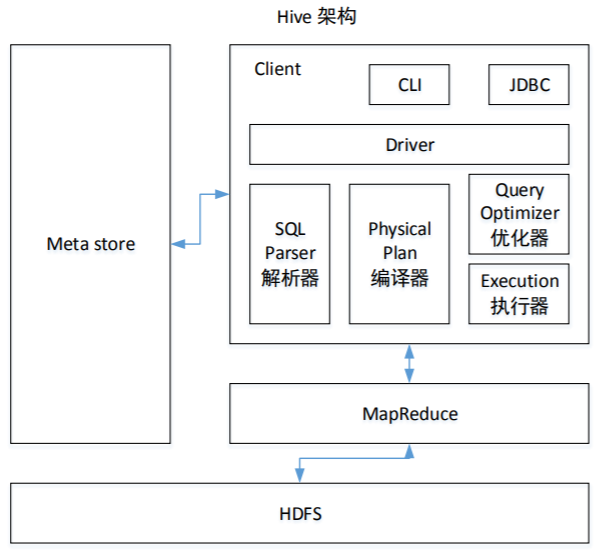
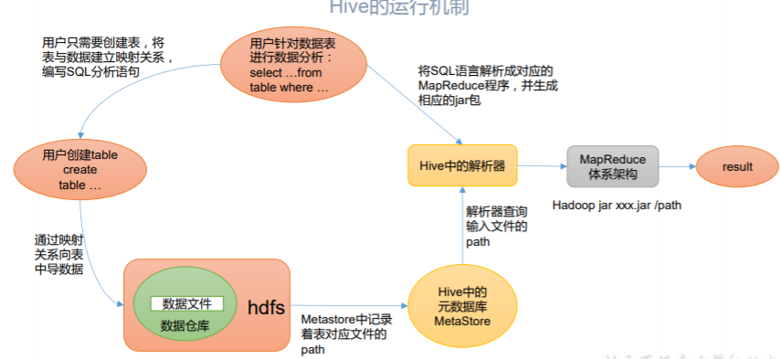
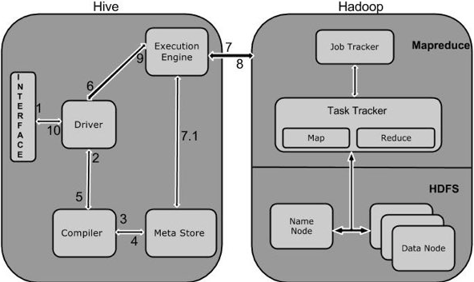
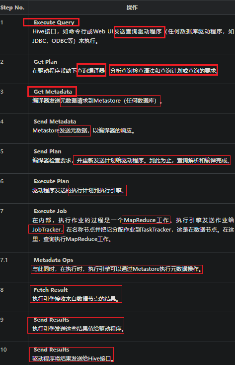
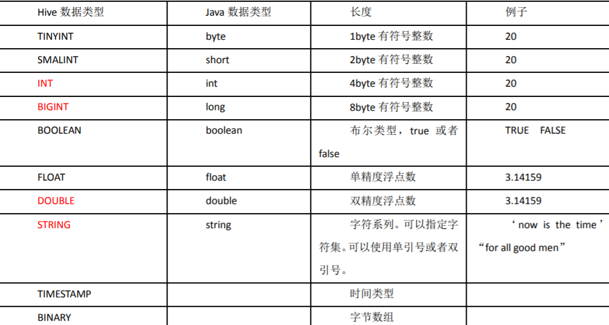
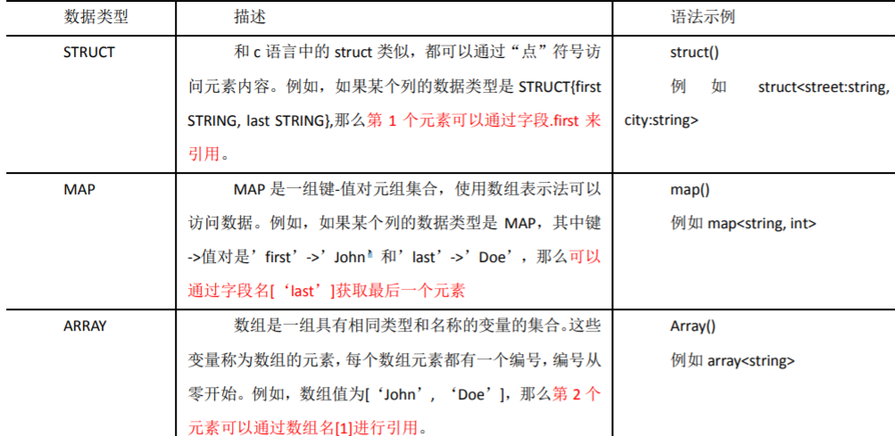
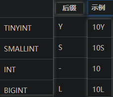
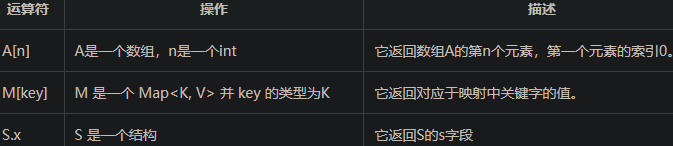
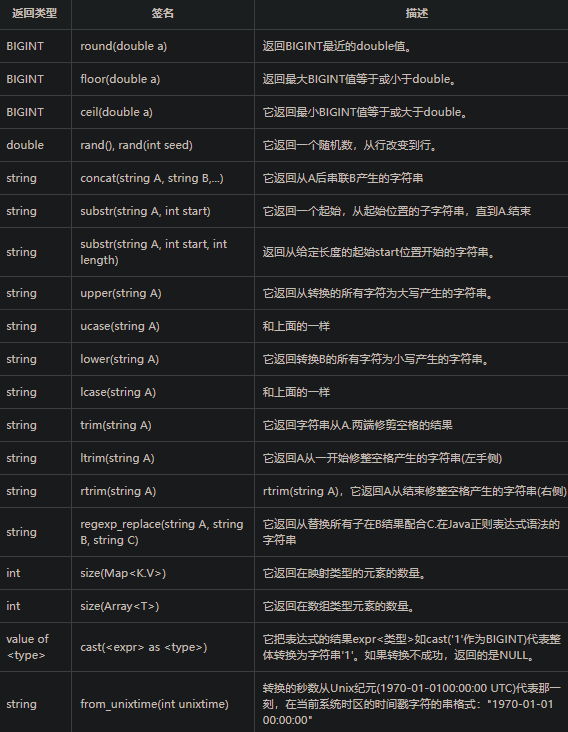

# Hive Notes

[尚硅谷笔记](_pdf/bigdata\hive/尚硅谷大数据技术之Hive.pdf)

## Hive基础

Manual Book

https://cwiki.apache.org/confluence/display/Hive/LanguageManual+UDF

### 简介

hive是一个数据仓库工具，用来在Hadoop中处理 **结构化数据**。

hive结构在Hadoop之上，总归为大数据，使查询和分析更加方便

提供简单的SQL，可以将SQL语句转化为MapReduce任务执行

Hadoop是用于处理大数据的框架，分为MapReduce和hdfs两个主要模块

Hadoop生态系统包含用于协助Hadoop的不同子项目工具模块，如Sqoop\Pig\Hive：

- Sqoop: 用来在hdfs和rdbms之间来回导入和导出数据
- Pig：用来开发MapReduce操作的脚本程序语言的平台
- Hive：用来开发SQL类型脚本用于做MapReduce操作


hive是一个**数据仓库基础工具**，用来在Hadoop中处理结构化数据

Facebook开发，转由Apache孵化


特点:

- 存储架构在一个数据库中并处理数据到hdfs
- 转为联机事务处理（OLTP）设计
- 提供SQL类型语言查询：HiveQL or HQL
- 快速可扩展

### 架构


- 用户接口/界面：Hive是一个数据仓库基础工具软件，可以创建用户和HDFS之间互动。用户界面，Hive支持是Hive的Web UI，Hive命令行，HiveHD洞察（在Windows服务器）。
- 元存储：Hive选择各自的数据库服务器，用以储存表，数据库，列模式或元数据表，它们的数据类型和HDFS映射。
- HQL处理引擎：HiveQL类似于SQL的查询上Metastore模式信息。这是传统的方式进行MapReduce程序的替代品之一。相反，使用Java编写的MapReduce程序，可以编写为MapReduce工作，并处理它的查询。
- 执行引擎：HiveQL处理引擎和MapReduce的结合部分是由Hive执行引擎。执行引擎处理查询并产生结果和MapReduce的结果一样。它采用MapReduce方法。
- HDFS/HBASE: Hadoop的分布式文件系统或者HBASE数据存储技术是用于将数据存储到文件系统。






### 工作原理





### 安装

依赖于：

- java
- Hadoop

下载hive：apache-hive-0.14.0-bin.tar.gz

配置

Apache Derby


#### hive元数据配置到mysql

将 MySQL 的 JDBC 驱动拷贝到 Hive 的 lib 目录下

hive-site.xml配置

### 命令

#### 常用交互命令

```sql
usage: hive
-d,--define <key=value> Variable subsitution to apply to hive
 commands. e.g. -d A=B or --define A=B
 --database <databasename> Specify the database to use
-e <quoted-query-string> SQL from command line
-f <filename> SQL from files
-H,--help Print help information
 --hiveconf <property=value> Use value for given property
 --hivevar <key=value> Variable subsitution to apply to hive
 commands. e.g. --hivevar A=B
-i <filename> Initialization SQL file
-S,--silent Silent mode in interactive shell
-v,--verbose Verbose mode (echo executed SQL to the
console)
```


```sql
“-e”不进入 hive 的交互窗口执行 sql 语句

“-f”执行脚本中 sql 语句

hive(default)>exit; 

hive(default)>quit;

查看在 hive 中输入的所有历史命令:查看. hivehistory 文件


```


### 数据类型

基本数据类型：



集合数据类型：




hive有四种数据类型：

#### 列类型

用作hive的列类型，包含：

1.整形

整型数据可以指定使用整型数据类型，INT。当数据范围超过INT的范围，需要使用BIGINT，如果数据范围比INT小，使用SMALLINT。 TINYINT比SMALLINT小。



2.字符串

字符串类型的数据类型可以使用单引号('')或双引号(“”)来指定。它包含两个数据类型：VARCHAR和CHAR。Hive遵循C-类型的转义字符。

- varchar: 1~65535
- char: 255


3.时间戳

它支持传统的UNIX时间戳可选纳秒的精度。它支持的java.sql.Timestamp格式“YYYY-MM-DD HH:MM:SS.fffffffff”和格式“YYYY-MM-DD HH:MM:ss.ffffffffff”。

4.日期

DATE值在年/月/日的格式形式描述 {{YYYY-MM-DD}}.

5.小数

在Hive 小数类型与Java大十进制格式相同。它是用于表示不可改变任意精度。语法和示例如下：

```
DECIMAL(precision, scale)
decimal(10,0)
```

6.联合类型

联合是异类的数据类型的集合。可以使用联合创建的一个实例

```text
UNIONTYPE<int, double, array<string>, struct<a:int,b:string>>

{0:1} 
{1:2.0} 
{2:["three","four"]} 
{3:{"a":5,"b":"five"}} 
{2:["six","seven"]} 
{3:{"a":8,"b":"eight"}} 
{0:9} 
{1:10.0}
```

#### 文字

浮点

浮点类型是有小数点的数字

十进制

十进制数据类型是只不过浮点值范围比DOUBLE数据类型更大。十进制类型的范围大约是 -10-308 到 10308.

#### Null

缺失值

#### 复杂类型

数组

ARRAY<data_type>

映射

 MAP<primitive_type, data_type>

结构体

STRUCT<col_name : data_type [COMMENT col_comment], ...>

### 库操作

创建库：

CREATE DATABASE|SCHEMA [IF NOT EXISTS] <database name>

JDBC方式：

```java
public class HiveCreateDb {
   private static String driverName = "org.apache.hadoop.hive.jdbc.HiveDriver";
   
   public static void main(String[] args) throws SQLException {
      // Register driver and create driver instance
   
      Class.forName(driverName);
      // get connection
      
      Connection con = DriverManager.getConnection("jdbc:hive://localhost:10000/default", "", "");
      Statement stmt = con.createStatement();
      
      stmt.executeQuery("CREATE DATABASE userdb");
      System.out.println(“Database userdb created successfully.”);
      
      con.close();
   }
}
```

删除库：

DROP (DATABASE|SCHEMA) [IF EXISTS] database_name  [RESTRICT|CASCADE];


```java
public class HiveDropDb {
   private static String driverName = "org.apache.hadoop.hive.jdbc.HiveDriver";
   
   public static void main(String[] args) throws SQLException {
   
      // Register driver and create driver instance
      Class.forName(driverName);
      
      // get connection
      Connection con = DriverManager.getConnection("jdbc:hive://localhost:10000/default", "", "");
      Statement stmt = con.createStatement();
      stmt.executeQuery("DROP DATABASE userdb");
      
      System.out.println(“Drop userdb database successful.”);
      
      con.close();
   }
}
```

### 表操作

创建表：

```sql
CREATE [TEMPORARY] [EXTERNAL] TABLE [IF NOT EXISTS] [db_name.] table_name

[(col_name data_type [COMMENT col_comment], ...)]
[COMMENT table_comment]
[ROW FORMAT row_format]
[STORED AS file_format]

hive> CREATE TABLE IF NOT EXISTS employee ( eid int, name String,
> salary String, destination String)
> COMMENT ‘Employee details’
> ROW FORMAT DELIMITED
> FIELDS TERMINATED BY ‘\t’
> LINES TERMINATED BY ‘\n’
> STORED AS TEXTFILE;
```

修改表

```java
ALTER TABLE name RENAME TO new_name
ALTER TABLE name ADD COLUMNS (col_spec[, col_spec ...])
ALTER TABLE name DROP [COLUMN] column_name
ALTER TABLE name CHANGE column_name new_name new_type
ALTER TABLE name REPLACE COLUMNS (col_spec[, col_spec ...])
```

重命名表

ALTER TABLE employee RENAME TO emp;

修改列

hive> ALTER TABLE employee CHANGE name ename String; hive> ALTER TABLE employee CHANGE salary salary Double;

删除表：

DROP TABLE [IF EXISTS] table_name;

### 数据操作

插入数据 **LOAD DATA**

一般来说，在SQL创建表后，我们就可以使用INSERT语句插入数据。但在Hive中，可以使用LOAD DATA语句插入数据。

将数据插入到Hive，最好是使用LOAD DATA来存储大量记录。有两种方法用来加载数据：一种是从本地文件系统，第二种是从Hadoop文件系统。

```sql
LOAD DATA [LOCAL] INPATH 'filepath' [OVERWRITE] INTO TABLE tablename 
[PARTITION (partcol1=val1, partcol2=val2 ...)]
```

LOCAL是标识符指定本地路径。它是可选的。

OVERWRITE 是可选的，覆盖表中的数据。

PARTITION 这是可选的

eg: 

sample.txt:

```text
1201  Gopal       45000    Technical manager
1202  Manisha     45000    Proof reader
1203  Masthanvali 40000    Technical writer
1204  Kiran       40000    Hr Admin
1205  Kranthi     30000    Op Admin

hive> LOAD DATA LOCAL INPATH '/home/user/sample.txt'
> OVERWRITE INTO TABLE employee;
```

JDBC:

```java
public class HiveLoadData {

   private static String driverName = "org.apache.hadoop.hive.jdbc.HiveDriver";
   
   public static void main(String[] args) throws SQLException {
   
      // Register driver and create driver instance
      Class.forName(driverName);
      
      // get connection
      Connection con = DriverManager.getConnection("jdbc:hive://localhost:10000/userdb", "", "");
      
      // create statement
      Statement stmt = con.createStatement();
      
      // execute statement
      stmt.executeQuery("LOAD DATA LOCAL INPATH '/home/user/sample.txt'" + "OVERWRITE INTO TABLE employee;");
      System.out.println("Load Data into employee successful");
      
      con.close();
   }
}
```

### 分区

Hive组织表到分区。它是将一个表到基于分区列，如日期，城市和部门的值相关方式。使用分区，很容易对数据进行部分查询。

​	表或分区是细分成桶，以提供额外的结构，可以使用更高效的查询的数据。桶的工作是基于表的一些列的散列函数值。

​	例如，一个名为Tab1表包含雇员数据，如 id, name, dept 和yoj (即加盟年份)。假设需要检索所有在2012年加入，查询搜索整个表所需的信息员工的详细信息。但是，如果用年份分区雇员数据并将其存储在一个单独的文件，它减少了查询处理时间

可以通过添加分区表改变所述表。假设我们有一个表叫employee ，拥有如 Id, Name, Salary, Designation, Dept, 和 yoj等字段。

```sql
ALTER TABLE table_name ADD [IF NOT EXISTS] PARTITION partition_spec
[LOCATION 'location1'] partition_spec [LOCATION 'location2'] ...;

partition_spec:
: (p_column = p_col_value, p_column = p_col_value, ...)//原文出自【易百教程】，商业转载请联系作者获得授权，非商业请保留原文链接：https://www.yiibai.com/hive/hive_partitioning.html#article-start

hive> ALTER TABLE employee
> ADD PARTITION (year=’2013’)
> location '/2012/part2012';
```

重命名分区

ALTER TABLE table_name PARTITION partition_spec RENAME TO PARTITION partition_spec;

删除分区

ALTER TABLE table_name DROP [IF EXISTS] PARTITION partition_spec, PARTITION partition_spec,...;


数据库分区的主要目的是为了在特定的SQL操作中减少数据读写的总量以缩减响应时间，主要包括两种分区形式：**水平分区与垂直分区**。水平分区是对表进行行分区。而垂直分区是对列进行分区，一般是通过对表的垂直划分来减少目标表的宽度，常用的是水平分区

hive建立分区语法：       


```sql
create external table if not exists tablename(
    a string,
    b string)
 partitioned by (year string, month string)
 row format delimited fields terminated by ',';
```

hive通常有三种方式对包含分区字段的表进行数据插入：

​    1）静态插入数据：要求插入数据时指定与建表时相同的分区字段，如：

```sql
insert overwrite table tablename （year='2017', month='03'） select a, b from tablename2;
```

 2）动静混合分区插入：要求指定部分分区字段的值，如：

```sql
insert overwrite table tablename （year='2017', month） select a, b from tablename2;
```

3）动态分区插入：只指定分区字段，不用指定值，如：

```sql
insert overwrite table tablename （year, month） select a, b from tablename2;
```


数据插入之insert into 和 insert overwrite
        hive是基于Hadoop的一个数据仓库工具，可以将结构化的数据文件映射为一张数据库表，并提供简单的sql查询功能，可以将sql语句转换为MapReduce任务进行运行。通常hive包括以下四种数据导入方式：

（1）、从本地文件系统中导入数据到Hive表；

（2）、从HDFS上导入数据到Hive表；

（3）、在创建表的时候通过从别的表中查询出相应的记录并插入到所创建的表中；

（4）、从别的表中查询出相应的数据并导入到Hive表中。

```sql
      insert into table tablename1 select a, b, c from tablename2;
      insert overwrite table tablename1 select a, b, c from tablename2;
```

 insert into 与 insert overwrite 都可以向hive表中插入数据，但是insert into直接追加到表中数据的尾部，而insert overwrite会重写数据，既先进行删除，再写入。如果存在分区的情况，insert overwrite会只重写当前分区数据。


```sql
// 当前分区新增写入
insert into tableName partition(year='2021',month='10') values ('1001','350001'),('1002','350002');
 
// overwrite删当前分区数据写入新数据
insert overwrite table tableName partition(year='2021',month='10') values ('1002','350002'),('1004','350004');
 
// 当前分区新增写入
insert into tableName partition(year='2021',month='10') select a, b from tableName2;
 
// overwrite删当前分区数据写入新数据
insert overwrite table tableName (year='2021',month='10') select a, b from tableName2;
```


- 在反复对同一个分区执行`insert overwrite`操作时，您通过`desc`命令查看到的数据分区Size会不同。这是因为从同一个表的同一个分区`select`出来再`insert overwrite`回相同分区时，文件切分逻辑发生变化，从而导致数据的Size发生变化。数据的总长度在`insert overwrite`前后是不变的，您不必担心存储计费会产生问题。


### 内置运算符

HIVE有四种内置运算符

#### 关系运算符

- =
- !=
- <
- <=
- \> 
- \>=
- IS NULL
- IS NOT NULL
- LIKE
- A RLIKE B：A或B任一个为null，true，否则看是否匹配正则表达式
- REGEXP: 等同于

#### 算术运算符

- +
- \-
- *
- /
- %
- &
- |
- ^
- ~

同java

#### 逻辑运算符

- and &&
- or ||
- not !

#### 复杂运算符



### 内置函数




#### **coalesce**

COALESCE是一个函数， (expression_1, expression_2, ...,expression_n)依次参考各参数表达式，遇到非null值即停止并返回该值。如果所有的表达式都是空值，最终将返回一个空值。使用COALESCE在于大部分包含空值的表达式最终将返回空值。

```sql
select coalesce(success_cnt, 1) from tableA
```

当success_cnt 为**null**值的时候，将返回1，否则将返回success_cnt的真实值。

### 视图和索引

```sql
CREATE VIEW [IF NOT EXISTS] view_name [(column_name [COMMENT column_comment], ...) ]
[COMMENT table_comment]
AS SELECT ...

DROP VIEW view_name

CREATE INDEX index_name
ON TABLE base_table_name (col_name, ...)
AS 'index.handler.class.name'
[WITH DEFERRED REBUILD]
[IDXPROPERTIES (property_name=property_value, ...)]
[IN TABLE index_table_name]
[PARTITIONED BY (col_name, ...)]
[
   [ ROW FORMAT ...] STORED AS ...
   | STORED BY ...
]
[LOCATION hdfs_path]
[TBLPROPERTIES (...)]


DROP INDEX <index_name> ON <table_name>
```

### 查询

```sql
SELECT [ALL | DISTINCT] select_expr, select_expr, ... 
FROM table_reference 
[WHERE where_condition] 
[GROUP BY col_list] 
[HAVING having_condition] 
[CLUSTER BY col_list | [DISTRIBUTE BY col_list] [SORT BY col_list]] 
[LIMIT number];
```

大体同SQL


<<<<<<< HEAD
### 配置

#### 正则表达式

```shell
set hive.support.quoted.identifiers=none 
SELECT `(id|100name)?+.+` from st;
```
=======
#### 剔除部分字段

这是HIVE中查询语句的一个小技巧，一个表有很多字段，我们想要除个别字段外的剩余所有字段，全部列出来不方便且不美观，实际上hive语句可以解决这个问题。

选择tableName表中除了name、id、pwd之外的所有字段：

set hive.support.quoted.identifiers=None;
select `(name|id|pwd)?+.+` from tableName;

## My Hive Notes

### SERDE 

Serde是 Serializer/Deserializer的简写。hive使用Serde进行行对象的序列与反序列化。

```java
SerDe is a short name for "Serializer and Deserializer."
Hive uses SerDe (and FileFormat) to read and write table rows.
HDFS files --> InputFileFormat --> <key, value> --> Deserializer --> Row object
Row object --> Serializer --> <key, value> --> OutputFileFormat --> HDFS files
```

序列化是对象转换为字节序列的过程。
 序列化是字节序列恢复为对象的过程。
 对象的序列化主要有两种用途：对象的持久化，即把对象转换成字节序列后保存到文件中；对象数据的网络传送。
 除了上面两点， hive的序列化的作用还包括：Hive的反序列化是对key/value反序列化成hive table的每个列的值。Hive可以方便的将数据加载到表中而不需要对数据进行转换，这样在处理海量数据时可以节省大量的时间。

SerDe说明hive如何去处理一条记录，包括Serialize/Deserilize两个功能， Serialize把hive使用的java object转换成能写入hdfs的字节序列，或者其他系统能识别的流文件。Deserilize把字符串或者二进制流转换成hive能识别的java object对象。比如：select语句会用到Serialize对象， 把hdfs数据解析出来；insert语句会使用Deserilize，数据写入hdfs系统，需要把数据序列化。

你可以创建表时使用用户**自定义的Serde或者native Serde**， **如果 ROW FORMAT没有指定或者指定了 ROW FORMAT DELIMITED就会使用native Serde。**hive已经实现了许多自定义的Serde，之前我们在介绍stored时也涉及到：

- Avro (Hive 0.9.1 and later)
- ORC (Hive 0.11 and later)
- RegEx
- Thrift
- Parquet (Hive 0.13 and later)
- CSV (Hive 0.14 and later)
- JsonSerDe (Hive 0.12 and later)


```sql
hive> show create table tbl06;
OK
CREATE TABLE `tbl06`(
  `id` int)
ROW FORMAT SERDE 
  'org.apache.hadoop.hive.serde2.lazy.LazySimpleSerDe' # 看我这里默认使用的是LazySimpleSerDe
STORED AS INPUTFORMAT 
  'org.apache.hadoop.mapred.TextInputFormat' 
OUTPUTFORMAT 
  'org.apache.hadoop.hive.ql.io.HiveIgnoreKeyTextOutputFormat'
LOCATION
  'hdfs://ubuntu:9000/user/hive/warehouse/tbl06'
TBLPROPERTIES (
  'COLUMN_STATS_ACCURATE'='true', 
  'numFiles'='2', 
  'numRows'='4', 
  'rawDataSize'='4', 
  'totalSize'='8', 
  'transient_lastDdlTime'='1638623697')
Time taken: 0.107 seconds, Fetched: 17 row(s)
```


#### RegEx

```csharp
ROW FORMAT SERDE
'org.apache.hadoop.hive.serde2.RegexSerDe'
WITH SERDEPROPERTIES 
(
"input.regex" = "<regex>"
)
STORED AS TEXTFILE;
```

使用正则来序列化行数据:

```php
CREATE TABLE apachelog (
  host STRING,
  identity STRING,
  user STRING,
  time STRING,
  request STRING,
  status STRING,
  size STRING,
  referer STRING,
  agent STRING)
ROW FORMAT SERDE 'org.apache.hadoop.hive.serde2.RegexSerDe'
WITH SERDEPROPERTIES (
  "input.regex" = "([^]*) ([^]*) ([^]*) (-|\\[^\\]*\\]) ([^ \"]*|\"[^\"]*\") (-|[0-9]*) (-|[0-9]*)(?: ([^ \"]*|\".*\") ([^ \"]*|\".*\"))?"
)
STORED AS TEXTFILE;
```

#### Json

```php
ROW FORMAT SERDE 
'org.apache.hive.hcatalog.data.JsonSerDe' 
STORED AS TEXTFILE


ADD JAR /usr/lib/hive-hcatalog/lib/hive-hcatalog-core.jar;

CREATE TABLE my_table(a string, b bigint, ...)
ROW FORMAT SERDE 'org.apache.hive.hcatalog.data.JsonSerDe'
STORED AS TEXTFILE;
```

### DDL

#### create

```sql
CREATE [EXTERNAL] TABLE [IF NOT EXISTS] table_name
[(col_name data_type [COMMENT col_comment], ...)]
[COMMENT table_comment]
[PARTITIONED BY (col_name data_type [COMMENT col_comment], ...)]
[CLUSTERED BY (col_name, col_name, ...)
[SORTED BY (col_name [ASC|DESC], ...)] INTO num_buckets BUCKETS]
[ROW FORMAT row_format]
[STORED AS file_format]
[LOCATION hdfs_path]
[TBLPROPERTIES (property_name=property_value, ...)]
[AS select_statement]
```

（1）CREATE TABLE 创建一个指定名字的表。如果相同名字的表已经存在，则抛出异常； 用户可以用 IF NOT EXISTS 选项来忽略这个异常

（2）EXTERNAL 关键字可以让用户创建一个外部表，在建表的同时可以指定一个指向实 际数据的路径（LOCATION），在删除表的时候，内部表的元数据和数据会被一起删除，而外 部表只删除元数据，不删除数据。 （3）COMMENT：为表和列添加注释。 （4）PARTITIONED BY 创建分区表 （5）CLUSTERED BY 创建分桶表 （6）SORTED BY 不常用，对桶中的一个或多个列另外排序 （7）ROW FORMAT DELIMITED [FIELDS TERMINATED BY char] [COLLECTION ITEMS TERMINATED BY char] [MAP KEYS TERMINATED BY char] [LINES TERMINATED BY char] | SERDE serde_name [WITH SERDEPROPERTIES (property_name=property_value, property_name=property_value, ...)] 用户在建表的时候可以自定义 SerDe 或者使用自带的 SerDe。如果没有指定 ROW FORMAT 或者 ROW FORMAT DELIMITED，将会使用自带的 SerDe。在建表的时候，用户还需 要为表指定列，用户在指定表的列的同时也会指定自定义的 SerDe，Hive 通过 SerDe 确定表 的具体的列的数据。 SerDe 是 Serialize/Deserilize 的简称， hive 使用 Serde 进行行对象的序列与反序列化。 （8）STORED AS 指定存储文件类型 常用的存储文件类型：SEQUENCEFILE（二进制序列文件）、TEXTFILE（文本）、RCFILE（列 式存储格式文件） 如果文件数据是纯文本，可以使用STORED AS TEXTFILE。如果数据需要压缩，使用 STORED AS SEQUENCEFILE。 （9）LOCATION ：指定表在 HDFS 上的存储位置。 （10）AS：后跟查询语句，根据查询结果创建表。 （11）LIKE 允许用户复制现有的表结构，但是不复制数据

#### load

 load data [local] inpath '数据的 path' [overwrite] into table student [partition (partcol1=val1,…)]; （1）load data:表示加载数据 （2）local:表示从本地加载数据到 hive 表；否则从 HDFS 加载数据到 hive 表 （3）inpath:表示加载数据的路径 （4）overwrite:表示覆盖表中已有数据，否则表示追加 （5）into table:表示加载到哪张表 （6）student:表示具体的表

（7）partition:表示上传到指定分区

#### insert

insert into：以追加数据的方式插入到表或分区，原有数据不会删除 insert overwrite：会覆盖表中已存在的数据 注意：insert 不支持插入部分字段

#### order by

全局排序


#### sort by

对于大规模的数据集 order by 的效率非常低。在很多情况下，并不需要全局排 序，此时可以使用 sort by。 Sort by 为每个 reducer 产生一个排序文件。每个 Reducer 内部进行排序，对全局结果集 来说不是排序。

设置 reduce 个数 

hive (default)> set mapreduce.job.reduces=3;

#### Distribute By

Distribute By： 在有些情况下，我们需要控制某个特定行应该到哪个 reducer，通常是为 了进行后续的聚集操作。distribute by 子句可以做这件事。distribute by 类似 MR 中 partition （自定义分区），进行分区，结合 sort by 使用。 对于 distribute by 进行测试，一定要分配多 reduce 进行处理，否则无法看到 distribute by 的效果

```sql
hive (default)> set mapreduce.job.reduces=3;
hive (default)> insert overwrite local directory
'/opt/module/data/distribute-result' select * from emp distribute by
deptno sort by empno desc;
先按照部门编号分区，再按照员工编号降序排序。
```

distribute by 的分区规则是根据分区字段的 hash 码与 reduce 的个数进行模除后， 余数相同的分到一个区。 ➢ Hive 要求 DISTRIBUTE BY 语句要写在 SORT BY 语句之前。

#### Cluster by

当 distribute by 和 sorts by 字段相同时，可以使用 cluster by 方式。 cluster by 除了具有 distribute by 的功能外还兼具 sort by 的功能。但是排序只能是升序 排序，不能指定排序规则为 ASC 或者 DESC。 （1）以下两种写法等价 hive (default)> select * from emp cluster by deptno; hive (default)> select * from emp distribute by deptno sort by deptno; 注意：按照部门编号分区，不一定就是固定死的数值，可以是 20 号和 30 号部门分到一 个分区里面去


### HQL

```sql
# set 参数
set a = 1
# 参看参数
set a

# struct
create table tbl02(id bigint, person struct<name:string, age :int>);
# map
create table tbl03(id bigint, params map<int, string>);
# array
create table tbl04(id bigint, list array<String>);
# 注意：复合类型都是<>，而不是括号
create table tbl05(arr array<string>, map map<key:int,value:string>, obj struct<name:string, age：int>)


> show create table tbl05;
OK
CREATE TABLE `tbl05`(
  `id` bigint, 
  `name` string, 
  `params` map<int,string>, 
  `arr` array<string>, 
  `child` struct<name:string,age:int>)
ROW FORMAT SERDE 
  'org.apache.hadoop.hive.serde2.lazy.LazySimpleSerDe' 
STORED AS INPUTFORMAT 
  'org.apache.hadoop.mapred.TextInputFormat' 
OUTPUTFORMAT 
  'org.apache.hadoop.hive.ql.io.HiveIgnoreKeyTextOutputFormat'
LOCATION
  'hdfs://ubuntu:9000/user/hive/warehouse/tbl05'
TBLPROPERTIES (
  'transient_lastDdlTime'='1638108731')
Time taken: 0.085 seconds, Fetched: 16 row(s)

# 字段解释
- row format serde


create table test(
name string,
friends array<string>,
children map<string, int>,
address struct<street:string, city:string>
)
row format delimited fields terminated by ','
collection items terminated by '_'
map keys terminated by ':'
lines terminated by '\n';

row format delimited fields terminated by ',' -- 列分隔符
collection items terminated by '_' --MAP STRUCT 和 ARRAY 的分隔符(数据分割符号)
map keys terminated by ':' -- MAP 中的 key 与 value 的分隔符
lines terminated by '\n'; -- 行分隔符


# 导入文件数据到hive
load data local inpath '/opt/module/hive/datas/test.txt' into table test;


# 三种复合类型的访问
# 数组 arr[1], map: map[‘key’], struct: obj.field


```


## Problems

### Access denied

Access denied for user 'root'@'localhost' (using password: YES)

先通过mysql查看：

```sql
select user,host,password from user;
```

然后看hive配置：hive-site.xml

```xml
<?xml version="1.0" encoding="UTF-8" standalone="no"?>
<?xml-stylesheet type="text/xsl" href="configuration.xsl"?>
<configuration>
  <property>
    <name>javax.jdo.option.ConnectionURL</name>
    <value>jdbc:mysql://127.0.0.1:3306/hive?createDatabaseIfNotExist=true</value>
    <description>JDBC connect string for a JDBC metastore</description>
  </property>
  <property>
    <name>javax.jdo.option.ConnectionDriverName</name>
    <value>com.mysql.jdbc.Driver</value>
    <description>Driver class name for a JDBC metastore</description>
  </property>
  <property>
    <name>javax.jdo.option.ConnectionUserName</name>
    <value>root</value>
    <description>username to use against metastore database</description>
  </property>
  <property>
    <name>javax.jdo.option.ConnectionPassword</name>
    <value>root</value>
    <description>password to use against metastore database</description>
  </property>
</configuration>

```

配置了用户名和密码

这时候需要噶MySQL对应的用户名和hive配置的改为一样。


比如该mysql的：

```sql
mysql> set password for 'root'@'localhost' =password('root');
mysql> grant all privileges on *.* to root@'%'identified by 'root';
mysql>flush privileges; 
```

即可


>>>>>>> 1ee3b06c195afd2bae348612f45d8ffcca3561b2


