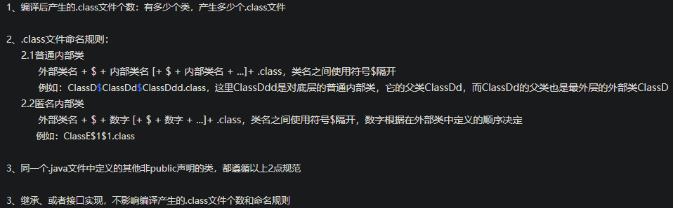
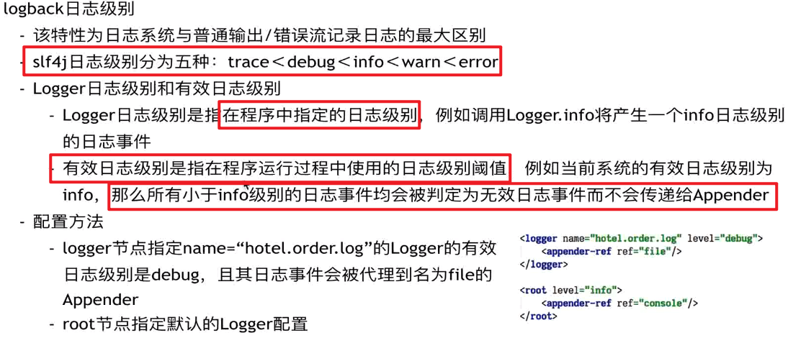
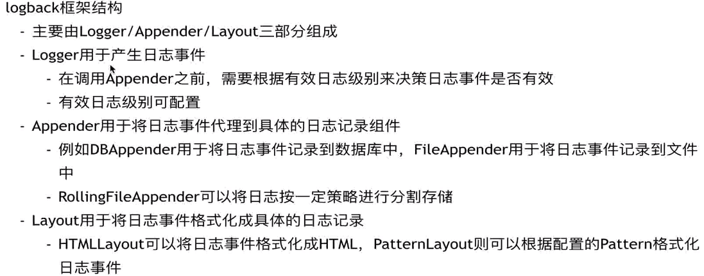
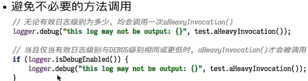
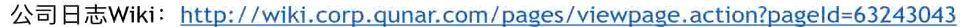
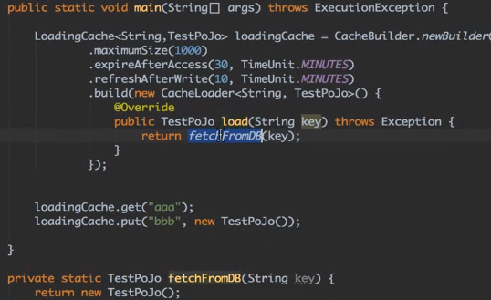

# Java Notes

>解决问题的能力最重要

## Basic

### Access Privileges

### extend

privete只能在本类访问，关于继承上，不会继承private方法和成员，那是父亲的私有部分，只能对父类中的成员开放。

一般情况下，父类中会有公用接口get、set之类的方法，可以通过这个方法进行访问。不能直接访问，即使通过super也不能调用。

子类和父类可以有完全一样的私有方法，他们不算重写，是各自的，互不影响。

### 

### interface

```java
public interface Int {
    // 实质为 public static final int M;
    int M = 110;
}
```


### 异常

printStackTrace： 在stderr中输出异常堆栈。**注意：此方法无论何时都不应该被调用！**


何时应该抛出异常？

一般来说，程序出现异常情况，逻辑无法继续时，需要抛出异常：

- 参数检查不通过，抛异常告知调用者调用错误
- 出现异常数据，导致继续执行会引发逻辑错误。

出现了异常情况，但是不影响正常逻辑的情况下，不需要抛出异常


如果能够妥善处理异常，则捕获异常，否则不要捕获异常

需要关注异常类型、监控异常时，捕获异常，可以处理掉，或者简单处理后抛出


#### Try With Resource

```java
try(InputStream is = new FileInputStream("D://d")) {

} catch (IOException e) {

}
```

java8就支持，编译器自动关闭资源

实质为实现AutoCloseable 的类都会自动关闭资源


1. 凡是实现了AutoCloseable接口的类，在try()里声明该类实例的时候，在try结束后，close方法都会被调用
2. try结束后自动调用的close方法，这个动作会早于finally里调用的方法。
3. 不管是否出现异常（int i=1/0会抛出异常），try()里的实例都会被调用close方法
4. 越晚声明的对象，会越早被close掉。


=======
>>>>>>> ec50c495d2610736010628a578873a8ec8bf6fc6
### 序列化

**什么情况下需要序列化**  
  a）当你想把的内存中的对象状态保存到一个文件中或者数据库中时候；
  b）当你想用套接字在网络上传送对象的时候；
  c）当你想通过RMI传输对象的时候；

```java
String path = "D:SerializableTest.txt";
final ObjectOutputStream outputStream = new ObjectOutputStream(new FileOutputStream(path));

final Cat cat = new Cat("edw");
outputStream.writeObject(cat);

final ObjectInputStream inputStream = new ObjectInputStream(new FileInputStream(path));
final Cat cat1 = (Cat)inputStream.readObject();
System.out.println(cat1);
```

相关注意事项
  a）序列化时，**只对对象的状态进行保存**，而不管对象的方法；
  b）当一个**父类实现序列化，子类自动实现序列化**，不需要显式实现Serializable接口；
  c）当**一个对象的实例变量引用其他对象，序列化该对象时也把引用对象进行序列化**；
  d）并非所有的对象都可以序列化，,至于为什么不可以，有很多原因了,比如：
    1.安全方面的原因，比如一个对象拥有**private**，public等field，对于一个要传输的对象，比如写到文件，或者进行rmi传输 等等，在序列化进行传输的过程中，这个对象的private等域是不受保护的。

​	2.资源分配方面的原因，比如socket，thread类，如果可以序列化，进行传输或者保存，也无法对他们进行重新的资源分 配，而且，也是没有必要这样实现。


#### Serializable

一个类实现了Serializable接口，它就可以被序列化

因为实现该接口后，使用ObjectOutputStream来持久化对象，该对象中：

```java
private void writeObject0(Object obj, boolean unshared)
    throws IOException
{
    boolean oldMode = bout.setBlockDataMode(false);
    depth++;
    try {
        // handle previously written and non-replaceable objects
        int h;
        if ((obj = subs.lookup(obj)) == null) {
            writeNull();
            return;
        } else if (!unshared && (h = handles.lookup(obj)) != -1) {
            writeHandle(h);
            return;
        } else if (obj instanceof Class) {
            writeClass((Class) obj, unshared);
            return;
        } else if (obj instanceof ObjectStreamClass) {
            writeClassDesc((ObjectStreamClass) obj, unshared);
            return;
        }

        // check for replacement object
        Object orig = obj;
        Class<?> cl = obj.getClass();
        ObjectStreamClass desc;
        for (;;) {
            // REMIND: skip this check for strings/arrays?
            Class<?> repCl;
            desc = ObjectStreamClass.lookup(cl, true);
            if (!desc.hasWriteReplaceMethod() ||
                (obj = desc.invokeWriteReplace(obj)) == null ||
                (repCl = obj.getClass()) == cl)
            {
                break;
            }
            cl = repCl;
        }
        if (enableReplace) {
            Object rep = replaceObject(obj);
            if (rep != obj && rep != null) {
                cl = rep.getClass();
                desc = ObjectStreamClass.lookup(cl, true);
            }
            obj = rep;
        }

        // if object replaced, run through original checks a second time
        if (obj != orig) {
            subs.assign(orig, obj);
            if (obj == null) {
                writeNull();
                return;
            } else if (!unshared && (h = handles.lookup(obj)) != -1) {
                writeHandle(h);
                return;
            } else if (obj instanceof Class) {
                writeClass((Class) obj, unshared);
                return;
            } else if (obj instanceof ObjectStreamClass) {
                writeClassDesc((ObjectStreamClass) obj, unshared);
                return;
            }
        }

        // remaining cases
        if (obj instanceof String) {
            writeString((String) obj, unshared);
        } else if (cl.isArray()) {
            writeArray(obj, desc, unshared);
        } else if (obj instanceof Enum) {
            writeEnum((Enum<?>) obj, desc, unshared);
        } else if (obj instanceof Serializable) {
            writeOrdinaryObject(obj, desc, unshared);
        } else {
            if (extendedDebugInfo) {
                throw new NotSerializableException(
                    cl.getName() + "\n" + debugInfoStack.toString());
            } else {
                throw new NotSerializableException(cl.getName());
            }
        }
    } finally {
        depth--;
        bout.setBlockDataMode(oldMode);
    }
}
```

从上述代码可知，如果被写对象的类型是String，或数组，或Enum，或Serializable，那么就可以对该对象进行序列化，否则将抛出NotSerializableException。

如果仅仅只是让某个类实现Serializable接口，而没有其它任何处理的话，则就是使用默认序列化机制。使用默认机制，在序列化对象时，不仅会序列化当前对象本身，还会对该对象引用的其它对象也进行序列化，同样地，这些其它对象引用的另外对象也将被序列化，以此类推。所以，如果一个对象包含的成员变量是容器类对象，而这些容器所含有的元素也是容器类对象，那么这个序列化的过程就会较复杂，开销也较大。

#### transient

 当某个字段被声明为transient后，默认序列化机制就会忽略该字段。

 对于上述已被声明为transient的字段age，除了将transient关键字去掉之外，是否还有其它方法能使它再次可被序列化？方法之一就是在Person类中添加两个方法：writeObject()与readObject()

```java
public   class  Person  implements  Serializable {
     transient   private  Integer age  =   null ;

     private   void  writeObject(ObjectOutputStream out)  throws  IOException {
        out.defaultWriteObject();
        out.writeInt(age);
    }

     private   void  readObject(ObjectInputStream in)  throws  IOException, ClassNotFoundException {
        in.defaultReadObject();
        age  =  in.readInt();
    }
}
```

在writeObject()方法中会先调用ObjectOutputStream中的defaultWriteObject()方法，该方法会执行默认的序列化机制，如5.1节所述，此时会忽略掉age字段。然后再调用writeInt()方法显示地将age字段写入到ObjectOutputStream中。readObject()的作用则是针对对象的读取，其原理与writeObject()方法相同。

####  Externalizable

无论是使用transient关键字，还是使用writeObject()和readObject()方法，其实都是基于Serializable接口的序列化。JDK中提供了另一个序列化接口--Externalizable，使用该接口之后，之前基于Serializable接口的序列化机制就将失效。

 Externalizable继承于Serializable，当使用该接口时，序列化的细节需要由程序员去完成

#### 序列化源码

```java
// writeObject是最复杂的、核心的方法，其他如writeString()等相对较为简单
public final void writeObject(Object obj) throws IOException {
    try {
        writeObject0(obj, false);
    } catch (IOException ex) {

    }
}

// unshared是否是共享对象
private void writeObject0(Object obj, boolean unshared)
    throws IOException
{
    boolean oldMode = bout.setBlockDataMode(false);
    depth++;
    try {
        // handle previously written and non-replaceable objects
        int h;
        if ((obj = subs.lookup(obj)) == null) {
            writeNull();
            return;
        } else if (!unshared && (h = handles.lookup(obj)) != -1) {
            writeHandle(h);
            return;
        } else if (obj instanceof Class) {
            writeClass((Class) obj, unshared);
            return;
        } else if (obj instanceof ObjectStreamClass) {
            writeClassDesc((ObjectStreamClass) obj, unshared);
            return;
        }

        // check for replacement object
        Object orig = obj;
        Class<?> cl = obj.getClass();
        ObjectStreamClass desc;
        for (;;) {
            // REMIND: skip this check for strings/arrays?
            Class<?> repCl;
            desc = ObjectStreamClass.lookup(cl, true);
            if (!desc.hasWriteReplaceMethod() ||
                (obj = desc.invokeWriteReplace(obj)) == null ||
                (repCl = obj.getClass()) == cl)
            {
                break;
            }
            cl = repCl;
        }
        if (enableReplace) {
            Object rep = replaceObject(obj);
            if (rep != obj && rep != null) {
                cl = rep.getClass();
                desc = ObjectStreamClass.lookup(cl, true);
            }
            obj = rep;
        }

        // if object replaced, run through original checks a second time
        if (obj != orig) {
            subs.assign(orig, obj);
            if (obj == null) {
                writeNull();
                return;
            } else if (!unshared && (h = handles.lookup(obj)) != -1) {
                writeHandle(h);
                return;
            } else if (obj instanceof Class) {
                writeClass((Class) obj, unshared);
                return;
            } else if (obj instanceof ObjectStreamClass) {
                writeClassDesc((ObjectStreamClass) obj, unshared);
                return;
            }
        }

        // remaining cases
        if (obj instanceof String) {
            writeString((String) obj, unshared);
        } else if (cl.isArray()) {
            writeArray(obj, desc, unshared);
        } else if (obj instanceof Enum) {
            writeEnum((Enum<?>) obj, desc, unshared);
        } else if (obj instanceof Serializable) {
            writeOrdinaryObject(obj, desc, unshared);
        } else {
            if (extendedDebugInfo) {
                throw new NotSerializableException(
                    cl.getName() + "\n" + debugInfoStack.toString());
            } else {
                throw new NotSerializableException(cl.getName());
            }
        }
    } finally {
        depth--;
        bout.setBlockDataMode(oldMode);
    }
}

// 上述代码中大部分是处理一些特殊情况，writeOrdinaryObject 才是序列化我们定义的普通对象
    private void writeOrdinaryObject(Object obj,
                                     ObjectStreamClass desc,
                                     boolean unshared
        try {
            desc.checkSerialize();
			// 序列化之前，会先写入一个标志位，用来表示后面是一个对象
            bout.writeByte(TC_OBJECT);
            writeClassDesc(desc, false);
            handles.assign(unshared ? null : obj);
            // 这里判断是否实现Externalizable，可以看到实现Externalizable后原来的Serialiable是无效的，前者优先级更高
            if (desc.isExternalizable() && !desc.isProxy()) {
                writeExternalData((Externalizable) obj);
            } else {
                writeSerialData(obj, desc);
            }
        } finally {
            if (extendedDebugInfo) {
                debugInfoStack.pop();
            }
        }
    }


private void writeSerialData(Object obj, ObjectStreamClass desc)
        throws IOException
    {
        ObjectStreamClass.ClassDataSlot[] slots = desc.getClassDataLayout();
        for (int i = 0; i < slots.length; i++) {
            ObjectStreamClass slotDesc = slots[i].desc;
            if (slotDesc.hasWriteObjectMethod()) {
                PutFieldImpl oldPut = curPut;
                curPut = null;
                SerialCallbackContext oldContext = curContext;

                if (extendedDebugInfo) {
                    debugInfoStack.push(
                        "custom writeObject data (class \"" +
                        slotDesc.getName() + "\")");
                }
                try {
                    curContext = new SerialCallbackContext(obj, slotDesc);
                    bout.setBlockDataMode(true);
                    // 反射，序列化
                    slotDesc.invokeWriteObject(obj, this);
                    bout.setBlockDataMode(false);
                    // 添加结束标志
                    bout.writeByte(TC_ENDBLOCKDATA);
                } finally {
                    curContext.setUsed();
                    curContext = oldContext;
                    if (extendedDebugInfo) {
                        debugInfoStack.pop();
                    }
                }

                curPut = oldPut;
            } else {
                // 序列化成员属性
                defaultWriteFields(obj, slotDesc);
            }
        }
    }
                                     
                                     
    private void defaultWriteFields(Object obj, ObjectStreamClass desc)
        throws IOException
    {
        Class<?> cl = desc.forClass();
        if (cl != null && obj != null && !cl.isInstance(obj)) {
            throw new ClassCastException();
        }

        desc.checkDefaultSerialize();
		// 处理基本类型
        int primDataSize = desc.getPrimDataSize();
        if (primVals == null || primVals.length < primDataSize) {
            primVals = new byte[primDataSize];
        }
        desc.getPrimFieldValues(obj, primVals);
        bout.write(primVals, 0, primDataSize, false);

        ObjectStreamField[] fields = desc.getFields(false);
        Object[] objVals = new Object[desc.getNumObjFields()];
        int numPrimFields = fields.length - objVals.length;
        desc.getObjFieldValues(obj, objVals);
        for (int i = 0; i < objVals.length; i++) {
            if (extendedDebugInfo) {
                debugInfoStack.push(
                    "field (class \"" + desc.getName() + "\", name: \"" +
                    fields[numPrimFields + i].getName() + "\", type: \"" +
                    fields[numPrimFields + i].getType() + "\")");
            }
            try {
                // 递归处理非基本类型
                writeObject0(objVals[i],
                             fields[numPrimFields + i].isUnshared());
            } finally {
                if (extendedDebugInfo) {
                    debugInfoStack.pop();
                }
            }
        }
    }
```


ObjectOutputStream封装了自己的IO 流对象：

```java
private static class BlockDataOutputStream
    extends OutputStream implements DataOutput
{
    /** maximum data block length */
    private static final int MAX_BLOCK_SIZE = 1024;
    /** maximum data block header length */
    private static final int MAX_HEADER_SIZE = 5;
    /** (tunable) length of char buffer (for writing strings) */
    private static final int CHAR_BUF_SIZE = 256;

    /** buffer for writing general/block data */
    private final byte[] buf = new byte[MAX_BLOCK_SIZE];
    /** buffer for writing block data headers */
    private final byte[] hbuf = new byte[MAX_HEADER_SIZE];
    /** char buffer for fast string writes */
    private final char[] cbuf = new char[CHAR_BUF_SIZE];
}
```

ObjectInputStream是相反的一个操作。

只看了个大概，后面有时间了再继续。


### Stream

Java8 中添加了一个新的接口类 Stream，Collection 新增了两个流方法，分别是 **Stream**() 和 **parallelStream**()

之前使用for或者迭代器来对数据进行遍历、排序、合并等操作。这种方式**不适合大数据量**，效率问题

Stream的聚合操作类似SQL的聚合操作

```java
List<String> names = Arrays.asList("张三","李四","王五","赵柳","张五六七","王少","赵四","张仁","李星");
//需求：找出 姓张中名字最长的
  int maxLengthStartWithZ = names.parallelStream()
    .filter(name -> name.startsWith("张"))
    .mapToInt(String::length)
    .max()
    .getAsInt();
  System.out.println(names.get(maxLengthStartWithZ));
}
```

#### Stream操作分类

官方将 Stream 中的操作分为两大类：

- **终结操作**（Terminal operations）
- **中间操作**（Intermediate operations）

**中间操作**会**返回一个新的流**，一个流可以后面跟随零个或多个中间操作。其目的主要是打开流，做出某种程度的数据映射/过滤，然后会返回一个新的流，交给下一个操作使用。这类操作都是**惰性化的（lazy），就是说，仅仅调用到这类方法，并没有真正开始流的遍历。而是在终结操作开始的时候才真正开始执行**。

**中间操作**又可以分为**无状态**（Stateless）与**有状态**（Stateful）操作:

- 无状态是指元素的处理不受之前元素的影响；

- 有状态是指该操作只有拿到所有元素之后才能继续下去。


**终结操作**是指返回最终的结果。**一个流只能有一个终结操作**，当这个操作执行后，这个流就被使用“光”了，无法再被操作。所以这必定这个流的最后一个操作。终结操作的执行才会真正开始流的遍历，并且会生成一个结果。


**终结操作**又可以分为**短路**（Short-circuiting）与**非短路**（Unshort-circuiting）操作，

- **短路**是指遇到某些符合条件的元素就可以得到最终结果，

- **非短路**是指必须处理完所有元素才能得到最终结果。操作分类详情如下图所示：


map():将流中的元素进行再次加工形成一个新流，流中的每一个元素映射为另外的元素。

filter(): 返回结果生成新的流中只包含满足筛选条件的数据

limit()：返回指定数量的元素的流。返回的是 Stream 里前面的 n 个元素。

skip()：和 limit()相反，将前几个元素跳过（取出）再返回一个流，如果流中的元素小于或者等于 n，就会返回一个空的流。

sorted()：将流中的元素按照自然排序方式进行排序。

distinct()：将流中的元素去重之后输出。

peek()：对流中每个元素执行操作，并返回一个新的流，返回的流还是包含原来流中的元素。

#### 性能对比

- 常规数据量：

  ##### 常规的迭代 > Stream 并行迭代> Stream 串行迭代

  Stream 串行迭代，使用了复杂的设计，导致执行速度偏低。所以是性能最低的

  Stream 并行迭代 使用了 Fork-Join 线程池,所以效率比 Stream 串行迭代快，但是对比常规迭代还是要慢

- 大数据量

  - 默认线程池：线程舒朗=CPU核心数。Stream并行快
  - 线程数<CPU核数：常规快(大概)
  - 线程数>CPU核数：常规快

  

```java
public class StreamTest01 {
    @AllArgsConstructor
    @Data
    private static final class Student {
        String name;
        int age;
        String sex;
    }


    public static void main(String[] args) {
        List<Student> studentList = init();
        final Map<String, List<Student>> groupBy = groupBySex(studentList);
        groupBy.forEach((s, students) -> System.out.println(s+":"+ students.size()));
    }

    public static List<Student> init() {
        return Arrays.asList(
                new Student("小明", 168, "男"),
                new Student("大明", 182, "男"),
                new Student("小白", 174, "男"),
                new Student("小黑", 186, "男"),
                new Student("小红", 156, "女"),
                new Student("小黄", 158, "女"),
                new Student("小青", 165, "女"),
                new Student("小紫", 172, "女"));
    }

    public static Map<String, List<Student>> groupBySex(List<Student> studentsList) {
        return studentsList
                .stream()
                .collect(Collectors.groupingBy(Student::getSex));
    }

    public static List<Student> filterByAgeGh(List<Student> studentsList, int ghAge) {
            return studentsList
                .stream()
                .filter(student -> student.getAge() > ghAge)
                .collect(Collectors.toList());
    }

    public static void total(List<Student> studentsList) {
        int totalHeight = studentsList
                .stream()
                .mapToInt(Student::getAge)
                .sum();
        System.out.println(totalHeight);
    }

    public static void MaxAndMin(List<Student> studentsList) {
        int maxHeight = studentsList
                .stream()
                .mapToInt(Student::getAge)
                .max()
                .getAsInt();
        System.out.println("max:" + maxHeight);
        int minHeight = studentsList
                .stream()
                .mapToInt(Student::getAge)
                .min()
                .getAsInt();
        System.out.println("min:" + minHeight);
    }
}
```

### 反射

#### int.class

基本类型也是有对应的Class的

#### getFields() getDeclaredFields()

getFields()：获得某个类的所有的公共（public）的字段，包括父类中的字段。 
getDeclaredFields()：获得某个类的所有声明的字段，即包括public、private和proteced，但是不包括父类的申明字段。


#### getInterfaces() getGenericInterfaces()

都是获取实现的接口，后者带有泛型


### 网络编程

#### socket is closed问题

出现这种问题，可能的原因有：

- server/client调用了socker.close()
- socket的inputstream、outputstream被关闭了
- 使用socket的inputstream、outputstream装饰的流被close

### IO流

#### 关闭问题

Java IO流可以采用装饰着模式，即可以不断添加装饰。但是需要注意：

装饰时流都是相关联的，外层的流依赖于底层的流，不管是那个流close都会导致里层的流close，所有流都会closed。

### classname

根据JVM类型，每一种对象都会对应一个Class对象，即使是基本类型、Void/void、一维/多维数组都有的。

```java
public class Test02 {
    public static void main(String[] args) {
        // 基本类型
        System.out.println(int.class.getName()); // int
        System.out.println(int.class.getSimpleName()); // int

        // 一维基本类型数据
        final int[] ints = new int[10];
        System.out.println(ints.getClass().getName()); // [I
        System.out.println(ints.getClass().getSimpleName()); // int[]

        final byte[] bytes = new byte[1];
        System.out.println(bytes.getClass().getName());// [B
        System.out.println(bytes.getClass().getSimpleName()); //byte[]

        final short[] shorts = new short[1];
        System.out.println(shorts.getClass().getName()); // [S
        System.out.println(shorts.getClass().getSimpleName()); //short[]

        final long[] longs = new long[1];
        System.out.println(longs.getClass().getName()); // [J :注意是[J 而不是[L
        System.out.println(longs.getClass().getSimpleName()); // long[]

        // Void也是有对应的class的
        System.out.println(void.class.getName()); // void
        System.out.println(void.class.getSimpleName()); // void

        // void也是有对应包装类的
        System.out.println(Void.class.getName()); // java.lang.Void
        System.out.println(Void.class.getSimpleName()); // Void


        final Integer[] integers = new Integer[1];
        System.out.println(integers.getClass().getName()); // [Ljava.lang.Integer;
        System.out.println(integers.getClass().getSimpleName()); // Integer[]

        final int[][] ints1 = new int[1][1];
        System.out.println(ints1.getClass().getName()); // [[I
        System.out.println(ints1.getClass().getSimpleName()); //int[][]

        final Integer[][] integers1 = new Integer[1][1];
        System.out.println(integers1.getClass().getName());
        System.out.println(integers1.getClass().getSimpleName());
    }
}
```

| **元素类型**       | **class.getName** | **class.getSimpleName** |
| ------------------ | ------------- | ------------- |
| **boolean[]**      | **[Z**        | **boolean[]** |
| **byte[]**         | **[B**        | **byte[]** |
| **char[]**         | **[C**        | **char[]** |
| **class or interface[]** | **[Lclassname;** | **[L全限定名; 如[Ljava.lang.Integer;** |
| **double[]**       | **[D**        | **double[]** |
| **float[]**        | **[F**        | **float[]** |
| **int[]**          | **[I**        | **int[]** |
| **long[]**         | **[J**        | **long[]** |
| **short[]**        | **[S**        | **short[]** |
| **int[\][\]** | **[[I** | **int[\][\]** |
| **Integer[\][\]** | **[[Ljava.lang.Integer;** | **Integer[\][\]** |

### .class naming rules




## 动态代理 

### Spring动态代理类输出

```java
public static void main(String[] args) {
    // 产生jdk 代理文件
    System.getProperties().put("sun.misc.ProxyGenerator.saveGeneratedFiles", "true");
    // 输出cglib动态代理产生的类
    System.setProperty(DebuggingClassWriter.DEBUG_LOCATION_PROPERTY,
            "D:\\EdwinXu\\ProgrammingWorkspace\\myspringlearning\\cglib");

    SpringApplication.run(SpringlearningApplication.class, args);
}
```

### CGLIB动态代理

#### 案例

写一个普通的目标对象：

```java
public class Dog {
    public void eat(String food){
        System.out.println("The dog is eating "+food);
    }
}
```

定义方法拦截器MethodInterceptor，方法拦截器是对于CGLIB是核心的，增强是在方法拦截器中实现的：

```java
public class MyMethodInterceptor implements MethodInterceptor {
    @Override
    public Object intercept(Object o, Method method, Object[] objects, MethodProxy methodProxy) throws Throwable {
        System.out.println("before");
        // 注意这里的方法调用，不是用反射
        Object o1 = methodProxy.invokeSuper(o, objects);
        System.out.println("after");
        return o1;
    }
}
```

注意实现MethodInterceptor接口。

然后使用Enhancer生成代理类：

```java
public class Main {
    public static void main(String[] args) {
        //在指定目录下生成动态代理类，我们可以反编译看一下里面到底是一些什么东西
        System.setProperty(DebuggingClassWriter.DEBUG_LOCATION_PROPERTY,
                "D:\\EdwinXu\\ProgrammingWorkspace\\myspringlearning\\cglib");

        //创建Enhancer对象，类似于JDK动态代理的Proxy类
        Enhancer enhancer = new Enhancer();
        //设置目标类的字节码文件
        enhancer.setSuperclass(Dog.class);
        //设置回调函数
        enhancer.setCallback(new MyMethodInterceptor());
        //这里的creat方法就是正式创建代理类
        Dog proxyDog = (Dog)enhancer.create();
        System.out.println(proxyDog.getClass().getName()); // cn.edw.spring.aop.proxypattern.cglibdynamicproxy.demo01.Dog$$EnhancerByCGLIB$$e001ed5c
        //调用代理类的eat方法
        proxyDog.eat("baozi");
    }
}
```

可以发现这个proxyDog并不是Dog类，而是其子类，这里用多态特性。

打开字节码反编译就可以发现：

```java
public class Dog$$EnhancerByCGLIB$$e001ed5c extends Dog implements Factory {
    private boolean CGLIB$BOUND;
    public static Object CGLIB$FACTORY_DATA;
    private static final ThreadLocal CGLIB$THREAD_CALLBACKS;
    private static final Callback[] CGLIB$STATIC_CALLBACKS;
    // 自己写的MethodInterceptor被赋值到这里
    private MethodInterceptor CGLIB$CALLBACK_0;
    private static Object CGLIB$CALLBACK_FILTER;
    private static final Method CGLIB$eat$0$Method;
    private static final MethodProxy CGLIB$eat$0$Proxy;
    private static final Object[] CGLIB$emptyArgs;
    private static final Method CGLIB$equals$1$Method;
    private static final MethodProxy CGLIB$equals$1$Proxy;
    private static final Method CGLIB$toString$2$Method;
    private static final MethodProxy CGLIB$toString$2$Proxy;
    private static final Method CGLIB$hashCode$3$Method;
    private static final MethodProxy CGLIB$hashCode$3$Proxy;
    private static final Method CGLIB$clone$4$Method;
    private static final MethodProxy CGLIB$clone$4$Proxy;

    static void CGLIB$STATICHOOK1() {
        // 使用到了ThreadLocal
        CGLIB$THREAD_CALLBACKS = new ThreadLocal();
        CGLIB$emptyArgs = new Object[0];
        Class var0 = Class.forName("cn.edw.spring.aop.proxypattern.cglibdynamicproxy.demo01.Dog$$EnhancerByCGLIB$$e001ed5c");
        Class var1;
        // 还是利用了反射技术
        CGLIB$eat$0$Method = ReflectUtils.findMethods(new String[]{"eat", "(Ljava/lang/String;)V"}, (var1 = Class.forName("cn.edw.spring.aop.proxypattern.cglibdynamicproxy.demo01.Dog")).getDeclaredMethods())[0];
        // 创建了方法代理
        CGLIB$eat$0$Proxy = MethodProxy.create(var1, var0, "(Ljava/lang/String;)V", "eat", "CGLIB$eat$0");
    }

    final void CGLIB$eat$0(String var1) {
        super.eat(var1);
    }

    // 这个是代理方法
    public final void eat(String var1) {
        MethodInterceptor var10000 = this.CGLIB$CALLBACK_0;
        if (var10000 == null) {
            // 这里会通过ThreadLocal获取MethodInterceptor
            CGLIB$BIND_CALLBACKS(this);
            var10000 = this.CGLIB$CALLBACK_0;
        }
		// 这里方法代理不为空的话，会使用方法代理发起调用
        if (var10000 != null) {
            var10000.intercept(this, CGLIB$eat$0$Method, new Object[]{var1}, CGLIB$eat$0$Proxy);
        } else {
            // 否则直接调用父类方法，即非增强模式
            super.eat(var1);
        }
    }

    public Dog$$EnhancerByCGLIB$$e001ed5c() {
        CGLIB$BIND_CALLBACKS(this);
    }

    public static void CGLIB$SET_THREAD_CALLBACKS(Callback[] var0) {
        CGLIB$THREAD_CALLBACKS.set(var0);
    }

    public static void CGLIB$SET_STATIC_CALLBACKS(Callback[] var0) {
        CGLIB$STATIC_CALLBACKS = var0;
    }

    private static final void CGLIB$BIND_CALLBACKS(Object var0) {
        Dog$$EnhancerByCGLIB$$e001ed5c var1 = (Dog$$EnhancerByCGLIB$$e001ed5c)var0;
        if (!var1.CGLIB$BOUND) {
            var1.CGLIB$BOUND = true;
            Object var10000 = CGLIB$THREAD_CALLBACKS.get();
            if (var10000 == null) {
                var10000 = CGLIB$STATIC_CALLBACKS;
                if (var10000 == null) {
                    return;
                }
            }
            var1.CGLIB$CALLBACK_0 = (MethodInterceptor)((Callback[])var10000)[0];
        }
    }

    public Object newInstance(Callback[] var1) {
        CGLIB$SET_THREAD_CALLBACKS(var1);
        Dog$$EnhancerByCGLIB$$e001ed5c var10000 = new Dog$$EnhancerByCGLIB$$e001ed5c();
        CGLIB$SET_THREAD_CALLBACKS((Callback[])null);
        return var10000;
    }

    static {
        CGLIB$STATICHOOK1();
    }
}
```


##### 原理

```java
/**
 * General-purpose {@link Enhancer} callback which provides for "around advice". 环绕增强
 */
public interface MethodInterceptor
extends Callback
{
    /**
     * All generated proxied methods call this method instead of the original method. 所有生成的被代理方法调用被调用intercept，从而代替原方法
     * The original method may either be invoked by normal reflection using the Method object, 当然用Method也是可以通过反射调用的
     * or by using the MethodProxy (faster). 但是MethodProxy调用更快（Why）
     * @param obj "this", the enhanced object 增强对象
     * @param method intercepted Method       被拦截的方法
     * @param args argument array; primitive types are wrapped 参数，基本类型会包装 （注意包装使用的是单词wrapped， 而不是boxed）
     * @param proxy used to invoke super (non-intercepted method); may be called 
     * as many times as needed    MethodProxy proxy 用于调用父类，就是真正被代理的对象的方法
     */    
    public Object intercept(Object obj, java.lang.reflect.Method method, Object[] args,
                               MethodProxy proxy) throws Throwable;
```


```
MethodProxy
```


## JVM

### 引用

#### 强引用

默认声明就是强引用

```java
Object obj = new Object(); //只要obj还指向Object对象，Object对象就不会被回收
obj = null;  //手动置null
```

只要强引用存在，垃圾回收器将永远不会回收被引用的对象，哪怕内存不足时，JVM也会直接抛出OutOfMemoryError，不会去回收。如果想中断强引用与对象之间的联系，可以显示的将强引用赋值为null，这样一来，JVM就可以适时的回收对象了

#### 软引用

描述一些非必需但仍有用的对象。**在内存足够的时候，软引用对象不会被回收，只有在内存不足时，系统则会回收软引用对象，如果回收了软引用对象之后仍然没有足够的内存，才会抛出内存溢出异常**。这种特性常常被用来实现缓存技术，比如网页缓存，图片缓存等。

java.lang.ref.**SoftReference**类来表示软引用。

```java
public class TestOOM {
	private static List<Object> list = new ArrayList<>();
	public static void main(String[] args) {
	     testSoftReference();
	}
	private static void testSoftReference() {
		for (int i = 0; i < 10; i++) {
			byte[] buff = new byte[1024 * 1024];
			SoftReference<byte[]> sr = new SoftReference<>(buff);
			list.add(sr);
		}
		
		System.gc(); //主动通知垃圾回收
		
		for(int i=0; i < list.size(); i++){
			Object obj = ((SoftReference) list.get(i)).get();
			System.out.println(obj);
		}
		
	}
	
}
```

发现无论循环创建多少个软引用对象，打印结果总是只有最后一个对象被保留，其他的obj全都被置空回收了。

#### 弱引用

弱引用的引用强度比软引用要更弱一些，**无论内存是否足够，只要 JVM 开始进行垃圾回收，那些被弱引用关联的对象都会被回收**。在 JDK1.2 之后，用 java.lang.ref.**WeakReference** 来表示弱引用。

```java
	private static void testWeakReference() {
		for (int i = 0; i < 10; i++) {
			byte[] buff = new byte[1024 * 1024];
			WeakReference<byte[]> sr = new WeakReference<>(buff);
			list.add(sr);
		}
		
		System.gc(); //主动通知垃圾回收
		
		for(int i=0; i < list.size(); i++){
			Object obj = ((WeakReference) list.get(i)).get();
			System.out.println(obj);
		}
	}
```

#### 虚引用

虚引用是最弱的一种引用关系，如果一个对象仅持有虚引用，那么它就和没有任何引用一样，它随时可能会被回收，在 JDK1.2 之后，用 **PhantomReference** 类来表示，通过查看这个类的源码，发现它只有一个构造函数和一个 get() 方法，而且它的 get() 方法仅仅是返回一个null，也就是说将永远无法通过虚引用来获取对象，虚引用必须要和 **ReferenceQueue** 引用队列一起使用。

```java
public class PhantomReference<T> extends Reference<T> {
    /**
     * Returns this reference object's referent.  Because the referent of a
     * phantom reference is always inaccessible, this method always returns
     * <code>null</code>.
     *
     * @return  <code>null</code>
     */
    public T get() {
        return null;
    }
    public PhantomReference(T referent, ReferenceQueue<? super T> q) {
        super(referent, q);
    }
}
```

#### 引用队列（ReferenceQueue）

**引用队列可以与软引用、弱引用以及虚引用一起配合使用**，当**垃圾回收器准备回收一个对象时，如果发现它还有引用，那么就会在回收对象之前，把这个引用加入到与之关联的引用队列中去**。程序可以通过判断引用队列中是否已经加入了引用，来判断被引用的对象是否将要被垃圾回收，这样就可以在对象被回收之前采取一些必要的措施。

与软引用、弱引用不同，**虚引用必须和引用队列一起使用。**


### Exception

#### 异常处理

何时应该抛出异常？

一般来说，程序出现异常情况，逻辑无法继续时，需要抛出异常：

- 参数检查不通过，抛异常告知调用者调用错误
- 出现异常数据，导致继续执行会引发逻辑错误。

出现了异常情况，但是不影响正常逻辑的情况下，不需要抛出异常


如果能够妥善处理异常，则捕获异常，否则不要捕获异常

需要关注异常类型、监控异常时，捕获异常，可以处理掉，或者简单处理后抛出

#### sneakyThrows

lombok的功能

`@SneakyThrows`注解的用途得从java的异常设计体系说起。
 java中我们常见的2类异常。
 1.普通`Exception`类,也就是我们常说的受检异常或者Checked Exception。
 2.`RuntimeException`类，既运行时异常。
 前者会强制要求抛出它的方法声明throws，调用者必须显示的去处理这个异常。设计的目的是为了提醒开发者处理一些场景中必然可能存在的异常情况。比如网络异常造成IOException。

但是现实，往往事与愿违。大部分情况下的异常，我们都是一路往外抛了事。（强制处理我也处理不了啊！臣妾做不到）所以渐渐的java程序员处理Exception的常见手段就是外面包一层RuntimeException，接着往上丢。这种解决思想尤其在Spring中到处出现。

```php
try{
}catch(Exception e){
	throw new RuntimeException(e);
}
```

Lombok的@SneakyThrows就是为了消除这样的模板代码。
使用注解后不需要担心Exception的处理

```dart
 import lombok.SneakyThrows;

public class SneakyThrowsExample implements Runnable {
  @SneakyThrows(UnsupportedEncodingException.class)
  public String utf8ToString(byte[] bytes) {
    return new String(bytes, "UTF-8");
  }
  
  @SneakyThrows
  public void run() {
    throw new Throwable();
  }
}
```

真正生成的代码

```java
import lombok.Lombok;

public class SneakyThrowsExample implements Runnable {
  public String utf8ToString(byte[] bytes) {
    try {
      return new String(bytes, "UTF-8");
    } catch (UnsupportedEncodingException e) {
      throw Lombok.sneakyThrow(e);
    }
  }
  
  public void run() {
    try {
      throw new Throwable();
    } catch (Throwable t) {
      throw Lombok.sneakyThrow(t);
    }
  }
}
```

Lombok.sneakyThrow():

```java
    public static RuntimeException sneakyThrow(Throwable t) {
        if (t == null) throw new NullPointerException("t");
        return Lombok.<RuntimeException>sneakyThrow0(t);
    }

    private static <T extends Throwable> T sneakyThrow0(Throwable t) throws T {
        throw (T)t;
    }
    
```

利用泛型将我们传入的**Throwable强转为RuntimeException**。虽然事实上我们不是RuntimeException。但是没关系。因为**JVM并不关心这个。泛型最后存储为字节码时并没有泛型的信息**。这样写只是为了**骗过javac编译器**。


```java
Example usage:
public void run() {
	 throw sneakyThrow(new IOException("You don't need to catch me!"));
}
```


### Collections

#### WeakHashMap

自动清理无用数据的HashMap

案例：设计一个Cache，空间有限需要及时清除无用数据，所以需要对Key设置过期时间，比如可以使用Guava Cache，支持定期过期、LRU、LFU等，但是也有小概率可能导致有用的数据被淘汰，无用的数据迟迟不淘汰。

WeakHashMap可以利用JVM本身的GC机制，及时清除无用的数据。其中主要利用的是WeakReference，如果某个WeakReference对象指向的对象被判定为垃圾对象时，JVM会将该**WeakReference**对象放到一个ReferenceQueue中。

WeakHashMap的**键是“弱键”**。在 WeakHashMap 中，当某个键不再正常使用时，会被从WeakHashMap中被自动移除。某个键被终止时，它对应的键值对也就从映射中有效地移除了。

非线程安全，Collections.synchronizedMap 构造线程安全MAP

```
    private static class Entry<K, V> extends WeakReference<Object> implements java.util.Map.Entry<K, V> {
        V value;
        final int hash;
        WeakHashMap.Entry<K, V> next;

        Entry(Object key, V value, ReferenceQueue<Object> queue, int hash, WeakHashMap.Entry<K, V> next) {
            super(key, queue);
            this.value = value;
            this.hash = hash;
            this.next = next;
        }
```

其Entry继承自 WeakReference 


## Thread

### deamon

```
# 将一个线程设置为守护线程
thread.setDaemon(true);
```

**当运行的线程都是守护进程线程时，Java虚拟机会退出。**

setDaemon()必须在start之前得到调用


### join

```
public final synchronized void join(long millis) throws InterruptedException
```

Waits at most millis milliseconds for this thread to die

**主线程等待该线程millis毫秒，等待millis毫秒后主线程会继续执行，如果子线程运行不需要millis毫秒，则主线程在子线程结束后就会执行**

> 注意: join应该在start之后调佣，子线程启动后才会有等待一说


### interrupt() interruptted


### ThreadFactory


## Math

### BigDecimal问题

```xml
public static void main(String[] args) {
    // Warning: unpredictable
    BigDecimal a = new BigDecimal(0.1);
    BigDecimal b = new BigDecimal(0.2);
    // 0.30000000000000004
    System.out.println(a.add(b).doubleValue() );

    a = new BigDecimal("0.1");
    b = new BigDecimal("0.2");
    // 0.3
    System.out.println(a.add(b).doubleValue() );
}
```

可以看到，使用int参数构造BigDecimal时，会出现误差，IDE也会提示不可预测的结果，原因是计算机本身就不能准确表达大部分小数，使用0.1作为参数，本身传入到BigDecimal就不是0.1， 于是会出现问题。

于是一定要使用String作为入参。

或者使用valueOf，本质也是一样的：

```java
    public static BigDecimal valueOf(double val) {
        return new BigDecimal(Double.toString(val));
    }
```

## Time

### Joda Time

The standard date and time classes prior to Java SE 8 are poor.

java自带的时间处理不方便

```java
<dependency>
  <groupId>joda-time</groupId>
  <artifactId>joda-time</artifactId>
  <version>2.10.10</version>
</dependency>
```

The five date-time classes that will be used most are:

- [`Instant`](https://www.joda.org/joda-time/apidocs/org/joda/time/Instant.html) - Immutable class representing an instantaneous point on the time-line
- [`DateTime`](https://www.joda.org/joda-time/apidocs/org/joda/time/DateTime.html) - Immutable replacement for JDK `Calendar`
- [`LocalDate`](https://www.joda.org/joda-time/apidocs/org/joda/time/LocalDate.html) - Immutable class representing a local date without a time (no time-zone)
- [`LocalTime`](https://www.joda.org/joda-time/apidocs/org/joda/time/LocalTime.html) - Immutable class representing a time without a date (no time-zone)
- [`LocalDateTime`](https://www.joda.org/joda-time/apidocs/org/joda/time/LocalDateTime.html) - Immutable class representing a local date and time (no time-zone)

### SimpleDateFormat线程不安全

```java
public class Test {
    public static void main(String[] args) {
        SimpleDateFormat sdf = new SimpleDateFormat("yyyy-MM-dd");
        String[] dateStringArray = new String[]{
                "2000-01-01", "2000-01-02", "2000-01-03",
                "2000-01-04", "2000-01-05", "2000-01-06",
                "2000-01-07", "2000-01-08", "2000-01-09",
                "2000-01-10"
        };

        MyThread[] threadArray = new MyThread[10];
        for (int i = 0; i < 10; i++) {
            threadArray[i] = new MyThread(sdf, dateStringArray[i]);
        }
        for (int i = 0; i < 10; i++) {
            threadArray[i].start();
        }
    }


    static class MyThread extends Thread {

        private SimpleDateFormat sdf;
        private String dateString;

        public MyThread(SimpleDateFormat sdf,String dateString) {
            this.sdf = sdf;
            this.dateString = dateString;
        }

        @Override
        public void run() {
            try {
                Date dateRef = sdf.parse(dateString);
                String newDateString = sdf.format(dateRef).toString();
                if(!newDateString.equals(dateString)) {
                    System.out.println("ThreadName = " + Thread.currentThread().getName()
                            + "报错了  日期字符串：" + dateString + "转换成日期为：" + newDateString);
                }
            } catch (ParseException e) {
                e.printStackTrace();
            }
        }
    }
}
```

>ThreadName = Thread-0报错了  日期字符串：2000-01-01转换成日期为：2000-01-02
>ThreadName = Thread-6报错了  日期字符串：2000-01-07转换成日期为：2000-01-01
>ThreadName = Thread-4报错了  日期字符串：2000-01-05转换成日期为：0009-01-09
>ThreadName = Thread-8报错了  日期字符串：2000-01-09转换成日期为：0020-01-09

多线程下慎用


## concurrent

### InterruptedException

当阻塞方法收到中断请求的时候就会抛出InterruptedException异常

中断某一个线程需要调用该线程对象的interrupt方法。

即使在主线程中执行目标线程的interrupt()方法，但**目标线程并没有停止执行**。这正是interrupt机制设计的特别之处，**<u>当主线程发起目标线程中断的命令后，目标线程并不会立即放弃线程的执行权</u>**。


阻塞方法为何抛出InterruptedException

如果目标线程正在执行sleep方法而线程阻塞，调用interrupt()尝试中断，只能抛出异常结束阻塞状态。


#### 中断标志位：

当主线程向目标线程发起interrupt中断命令后，**目标线程的中断标志位被置为true**，目标线程通过查询中断标志位**自行决定是否停止当前线程的执行**。


#### isInterrupted()与interrupted()

```java
public static boolean interrupted() {
    return currentThread().isInterrupted(true);
}

public boolean isInterrupted() {
    return isInterrupted(false);
}

private native boolean isInterrupted(boolean ClearInterrupted);
```

interrupted()是静态方法而isInterrupted()是实例方法，他们的实现都是调用同一个native方法。主要的区别是他们的形参ClearInterrupted传的不一样。interrupted()在返回中断标志位后会清除标志位，isInterrupted()则不清除中断标志位。


### ThreadLocal

ThreadLocal为解决多线程程序的并发问题提供了一种新的思路，使用这个工具类可以很简洁地编写出优美的多线程程序。

ThreadLocal并不是一个Thread，而是Thread的局部变量

当使用ThreadLocal维护变量时，**ThreadLocal为每个使用该变量的线程提供独立的变量副本**，所以每一个线程都可以独立地改变自己的副本，而不会影响其它线程所对应的副本。从线程的角度看，目标变量就像是线程的本地变量，这也是类名中“Local”所要表达的意思。

案例：

> JDBC Connection 类是非线程安全的，两个线程不能安全地共享一个 Connection：当线程A获取到Connection，开启一个事务，正在在执行事务，但是未结束。此时，线程B也获取到Connection，它发送了一些SQL操作，这些SQL操作将会被数据库归入线程A的事务当中被执行，这就造成了张冠李戴。
>
> 如果采用线程局部变量的形式，此时Connection为线程A和线程B的局部变量，本质上就是开启了两个Connection，从而可以使线程A和线程B可以相关独立。


ThreadLocal类接口很简单，只有4个方法：

```java
void set(Object value) // 设置当前线程的线程局部变量的值。
public Object get() //返回当前线程所对应的线程局部变量。
public void remove()
protected Object initialValue() //返回该线程局部变量的初始值，该方法是一个protected的方法，显然是为了让子类覆盖而设计的。如果有人心急则吃不了热豆腐，在还没有set的情况下，调用get则返回null。
```


ThreadLocal是如何做到为每一个线程维护变量的副本的呢？其实实现的思路很简单：在ThreadLocal类中有一个Map，用于存储每一个线程的变量副本，Map中元素的键为线程对象，而值对应线程的变量副本。我们自己就可以提供一个简单的实现版本：

```java
public class MyThreadLocal
{
	private final ConcurrentHashMap<Thread, Object> valueMap = new ConcurrentHashMap<>();
	public void set(Object newValue)
	{
		valueMap.put(Thread.currentThread(), newValue);
	}
	public Object get()
	{
		Thread currentThread = Thread.currentThread();
		Object o = valueMap.get(currentThread);
		if (o == null && !valueMap.containsKey(currentThread))
		{
			o = initialValue();
			valueMap.put(currentThread, o);
		}
		return o;
	}

	public void remove()
	{
		valueMap.remove(Thread.currentThread());
	}
	public Object initialValue()
	{
		return null;
	}
}
        

public class Test
{
        //随机休息1000到2000毫秒
	public static void randSleep()
	{

		Random random = new Random();

		int rand = random.nextInt(1000) + 1000;

		try
		{
			Thread.sleep(rand);
		}
		catch (InterruptedException e)
		{
			e.printStackTrace();
		}

	}

	public static void main(String[] args)
	{

		final MyThreadLocal myThreadLocal = new MyThreadLocal();

		Runnable task1 = () -> {
			for (int i = 0; i < 5; i++)
			{
				randSleep();
				myThreadLocal.set(i);
				int num = (int) myThreadLocal.get();
				System.out.println("task1:" + num);
			}

		};

		Runnable task2 = () -> {

			for (int i = 5; i < 10; i++)
			{
				randSleep();
				myThreadLocal.set(i);
				int num = (int) myThreadLocal.get();
				System.out.println("task2:" + num);
			}

		};

		new Thread(task1).start();

		new Thread(task2).start();

	}

}
```


在同步机制中，通过对象的锁机制保证同一时间只有一个线程访问变量。这时该变量是多个线程共享的，使用同步机制要求程序慎密地分析什么时候对变量进行读写，什么时候需要锁定某个对象，什么时候释放对象锁等繁杂的问题，程序设计和编写难度相对较大。

而ThreadLocal则从另一个角度来解决多线程的并发访问。ThreadLocal会为每一个线程提供一个独立的变量副本，从而隔离了多个线程对数据的访问冲突。因为每一个线程都拥有自己的变量副本，从而也就没有必要对该变量进行同步了。ThreadLocal提供了线程安全的共享对象，在编写多线程代码时，可以把不安全的变量封装进ThreadLocal。

概括起来说，对于多线程资源共享的问题，**同步机制采用了“以时间换空间”的方式，而ThreadLocal采用了“以空间换时间”**的方式。前者仅提供一份变量，让不同的线程排队访问，而后者为每一个线程都提供了一份变量，因此可以同时访问而互不影响。


`ThreadLocal`实例通常总是以静态字段初始化如下：

```java
static ThreadLocal<User> threadLocalUser = new ThreadLocal<>();
```


思考：ThreadLocal只是实现了多线程的共享问题，如果需要共享一个值并保持可见性那就不行了

### JUC 

juc(Doug Lea贡献)下可以分为4类：

- 并发任务的提交
- 线程安全集合类
- CAS
- 线程协调类：如Semaphore


### ReadWriteLock


### ReentrantLock

- lock();  // block until condition holds 阻塞的

- tryLock()  // 非阻塞地获取锁，调用后立即返回，获取锁则返回true
- tryLock(timeout) //指定时间内尝试获取锁

### Semaphore

信号量，用来控制访问特定资源的线程数量

```java
acquire()  
获取一个令牌，在获取到令牌、或者被其他线程调用中断之前线程一直处于阻塞状态。

acquire(int permits)  
获取一个令牌，在获取到令牌、或者被其他线程调用中断、或超时之前线程一直处于阻塞状态。
    
acquireUninterruptibly() 
获取一个令牌，在获取到令牌之前线程一直处于阻塞状态（忽略中断）。
    
tryAcquire()
尝试获得令牌，返回获取令牌成功或失败，不阻塞线程。

tryAcquire(long timeout, TimeUnit unit)
尝试获得令牌，在超时时间内循环尝试获取，直到尝试获取成功或超时返回，不阻塞线程。

release()
释放一个令牌，唤醒一个获取令牌不成功的阻塞线程。

hasQueuedThreads()
等待队列里是否还存在等待线程。

getQueueLength()
获取等待队列里阻塞的线程数。

drainPermits()
清空令牌把可用令牌数置为0，返回清空令牌的数量。

availablePermits()
返回可用的令牌数量。
```


原理：利用AQS

### CountDownLatch

等待一组线程全部执行完，才继续执行后面的代码。此时这组线程已经全部执行完毕

CountDownLatch是通过一个计数器来实现的，计数器的初始化值为线程的数量。每当一个线程完成了自己的任务后，计数器的值就相应得减1。当计数器到达0时，表示所有的线程都已完成任务，然后在闭锁上等待的线程就可以恢复执行任务。


### CyclicBarrier

等待某组线程运行至某个状态，再同时全部执行线程，此时这组线程还未运行完

CyclicBarrier也叫同步屏障，在JDK1.5被引入，可以让一组线程达到一个屏障时被阻塞，直到最后一个线程达到屏障时，所以被阻塞的线程才能继续执行。

```java
public class Test {
    public static void main(String[] args) {
        final CyclicBarrier cyclicBarrier = new CyclicBarrier(3, ()->{
            System.out.println("over");
        });

        for (int i = 0; i < 3; i++) {
            new Thread(new Runnable() {
                @SneakyThrows
                @Override
                public void run() {
                    Thread.sleep((int)(Math.random() * 5000));
                    System.out.println(Thread.currentThread().getName());
                    cyclicBarrier.await();
                }
            }).start();
        }
        /**
         * Thread-1
         * Thread-2
         * Thread-0
         * over
         * */
    }
}
```


### Future

```java
public class FutureTest01 {
    public static void main(String[] args) throws ExecutionException, InterruptedException {
        ExecutorService executorService = Executors.newFixedThreadPool(10);
        // submit的任务，只会执行一次，get第一次调用时运行，并得到运行结果
        Future<Integer> submit = executorService.submit(() -> {
            System.out.println("begin");
            Thread.sleep(2000);
            System.out.println("end");
            return (int) (Math.random() * 100);
        });
        Integer integer = null;
        try {
            integer = submit.get(1000, TimeUnit.MILLISECONDS);
            System.out.println(integer);
        } catch (InterruptedException | TimeoutException | ExecutionException e) {
            System.out.println(e.getMessage());
        }

        try {
            integer = submit.get(3000, TimeUnit.MILLISECONDS);
            System.out.println(integer);
        } catch (InterruptedException | TimeoutException | ExecutionException e) {
            System.out.println(e.getMessage());
        }

        System.out.println(submit.get());
        System.out.println(submit.get());
        /*
        * output：
        * begin
            null
            end
            33
            33
            33
        * */
    }
}
```


Future 的重要方法：

- get(): 获取任务执行的返回值，可以传入时间，时间到之前阻塞线程，直到返回

- ```
  boolean cancel(boolean mayInterruptIfRunning);
  可以取消未执行/执行中的任务
  如果取消后再次get, 则会抛出CancellationException
  
  ```


### RunnableFuture

```java
public interface RunnableFuture<V> extends Runnable, Future<V> {
    /**
     * Sets this Future to the result of its computation
     * unless it has been cancelled.
     */
    void run();
}
```

RunnableFuture是可以运行的Future，它还允许访问执行结果

### FutureTask

```java
public class FutureTask<V> implements RunnableFuture<V> 
```


### ListableFuture

```java
public interface ListenableFuture<V> extends Future<V> 
```

能够接收completion listener(完成监听器)的Future。

每一个listener会关联一个executor，当改future完成后，executor会调用这个listener。listener添加时如何future已经完成了，listener会立即执行

ListenableFuture的主要作用是 串联异步操作图

不能直接访问Future result，如果要访问使用Futures.addCallback()

### ListenableFutureTask

```java
public class ListenableFutureTask<V> extends FutureTask<V> implements ListenableFuture<V> 
```

很少使用，常用于ExecutorService的开发


### CompletableFuture

使用`Future`获得异步执行结果时，要么调用阻塞方法`get()`，要么轮询看`isDone()`是否为`true`，这两种方法都不是很好，因为主线程也会被迫等待。

从Java 8开始引入了`CompletableFuture`，它针对`Future`做了改进，**可以传入回调对象，当异步任务完成或者发生异常时，自动调用回调对象的回调方法**。

```java
// 第一个任务:
        CompletableFuture<String> cfQuery = CompletableFuture.supplyAsync(() -> {
            return queryCode("中国石油");
        });
        // cfQuery成功后继续执行下一个任务:
        CompletableFuture<Double> cfFetch = cfQuery.thenApplyAsync((code) -> {
            return fetchPrice(code);
        });
```


`CompletableFuture`的优点是：

- 异步任务结束时，会自动回调某个对象的方法；
- 异步任务出错时，会自动回调某个对象的方法；
- 主线程设置好回调后，不再关心异步任务的执行。

`CompletableFuture`可以指定异步处理流程：

- `thenAccept()`处理正常结果；
- `exceptional()`处理异常结果；
- `thenApplyAsync()`用于串行化另一个`CompletableFuture`；
- `anyOf()`和`allOf()`用于并行化多个`CompletableFuture`。


### Futures

- transform：对于ListenableFuture的返回值进行转换。
- allAsList：对多个ListenableFuture的合并，返回一个当所有Future成功时返回多个Future返回值组成的List对象。注：当其中一个Future失败或者取消的时候，将会进入失败或者取消。
- successfulAsList：和allAsList相似，唯一差别是对于失败或取消的Future返回值用null代替。不会进入失败或者取消流程。
- immediateFuture/immediateCancelledFuture： 立即返回一个待返回值的ListenableFuture。
- makeChecked: 将ListenableFuture 转换成CheckedFuture。CheckedFuture 是一个ListenableFuture ，其中包含了多个版本的get 方法，方法声明抛出检查异常.这样使得创建一个在执行逻辑中可以抛出异常的Future更加容易
- JdkFutureAdapters.listenInPoolThread(future): guava同时提供了将JDK Future转换为ListenableFuture的接口函数。
- addCallBack为Future增加回调


## 容器

Ordering


TreeMap

### Map

#### LinkedHashMap

通过给Node加上前后连接，从而控制顺序。尾部存放的是最新的数据，头部是最老的数据。

有两种顺序，通过变量accessOrder控制

- accessOrder = true: 按访问顺序，即每次访问后都会自动调整顺序，把访问的调整到末尾。可以用来实现LRU缓存。
- accessOrder = false: 只通过查询顺序，不自动调整。

其中还有溢出策略，即达到容量时的移除策略，返回一个true, false， 插入时每次都会访问，如果返回true则移除旧的数据。

```java
@Override
protected boolean removeEldestEntry(Map.Entry<K, V> eldest) {
    return super.size() > capacity;
}
```

#### WeekHashMap


MRU(最近最常使用算法)


SimpleDateFormat不是线程安全的，时间处理全部使用joda-time


**@NotNull**

OOM怎么处理


### Iterator

容器实现Iterator接口，即可通过iterator()方法返回一个迭代器

#### 动态删除

iterator可以动态删除:

```java
public static void main(String[] args) {
    List<Integer> list = new ArrayList<Integer>();
    list.add(1);
    list.add(2);
    list.add(3);
    Iterator<Integer> iterator = list.iterator();
    while (iterator.hasNext()){
        System.out.println(iterator.next());
        iterator.remove();
    }
    System.out.println(list.size());


    // Exception，文档里面写了，remove会抛出异常
    list = Arrays.asList(1,2,3);
    iterator = list.iterator();
    while (iterator.hasNext()){
        System.out.println(iterator.next());
        iterator.remove();
    }
    System.out.println(list.size());
}
```

需要注意的是不同的容器实现iterator的方式不同，有的并不一定会符合Iterator原本的接口描述。比如上面 Arrays.asList(1,2,3)返回的内部类ArrayList的iterator即不支持remove方法。

需要注意：remove()只能在next()方法后调用一次。

#### 迭代器的一般实现：

**一般容器都会实现一个内部类，在内部类中实现自己的迭代器逻辑**，不过这些自定义的迭代器大体上类似。

#### 删除的实现

```java
public E remove(int index) {
    rangeCheck(index);

    modCount++;
    E oldValue = elementData(index);

    int numMoved = size - index - 1;
    if (numMoved > 0)
        System.arraycopy(elementData, index+1, elementData, index,
                         numMoved);
    elementData[--size] = null; // clear to let GC do its work

    return oldValue;
}
```

一般是将当前元素后面的元素整体前移一步，覆盖当前元素，并将size减一

注意: 删除没有采取失败策略，即不是快速失败，也不是安全失败。


## 日志

### SLF4j

SLF4J仿佛就是一个日志接口，Log4J更像是一个底层的实现，其中SLF4J提供了绝大部分的日志实现，在它下面可以包括更多的日志实现框架，比如Logback等等


SLF4J，即简单日志门面（Simple Logging Facade for Java），不是具体的日志解决方案，它只服务于各种各样的日志系统。按照官方的说法，SLF4J是一个用于日志系统的简单Facade，允许最终用户在部署其应用时使用其所希望的日志系统。


slf4j日志有五种级别：trace < debug < info < warn < error




(SLF4J是一个抽象，相当于接口，可以适配到任何实现，他也有自己的多个具体实现)

```
 Logger logger = LoggerFactory.getLogger(PlaceHolders.class);
```

```
<!-- slf4j依赖 -->
		<dependency>
			<groupId>org.slf4j</groupId>
			<artifactId>slf4j-api</artifactId>
			<version>1.7.12</version>
		</dependency>
		<!-- log4j依赖 -->
		<dependency>
			<groupId>org.slf4j</groupId>
			<artifactId>slf4j-log4j12</artifactId>
			<version>1.7.12</version>
		</dependency>
		<dependency>
			<groupId>log4j</groupId>
			<artifactId>log4j</artifactId>
			<version>1.2.17</version>
		</dependency>
		<!-- logback依赖 -->
		<dependency>
			<groupId>ch.qos.logback</groupId>
			<artifactId>logback-classic</artifactId>
			<version>1.1.2</version>
		</dependency>
		<dependency>
			<groupId>ch.qos.logback</groupId>
			<artifactId>logback-core</artifactId>
			<version>1.1.2</version>
		</dependency>
		<!-- slf4j自带的简单日志 -->
		<dependency>
			<groupId>org.slf4j</groupId>
			<artifactId>slf4j-simple</artifactId>
			<version>1.7.12</version>
		</dependency>
		<!-- jdk自带的日志 -->
		<dependency>
			<groupId>org.slf4j</groupId>
			<artifactId>slf4j-jdk14</artifactId>
			<version>1.7.12</version>
		</dependency>
		<!-- common-logging日志框架 -->
		<dependency>
			<groupId>org.slf4j</groupId>
			<artifactId>slf4j-jcl</artifactId>
			<version>1.7.12</version>
		</dependency>
		<dependency>
			<groupId>commons-logging</groupId>
			<artifactId>commons-logging</artifactId>
			<version>1.2</version>
		</dependency>

```

### log4j

Log4j是Apache的一个开源项目，通过使用Log4j，我们可以控制日志信息输送的目的地是控制台、文件、GUI组件，甚至是套接口服务器、NT的事件记录器、UNIX Syslog守护进程等；我们也可以控制每一条日志的输出格式；通过定义每一条日志信息的级别，我们能够更加细致地控制日志的生成过程。最令人感兴趣的就是，这些可以通过一个配置文件来灵活地进行配置，而不需要修改应用的代码。

```
<dependency>
    <groupId>log4j</groupId>
    <artifactId>log4j</artifactId>
    <version>1.2.12</version>
</dependency>
```

```
static final Logger logger = Logger.getLogger(Log4jTest.class);
```

config:

```bash
# Global logging configuration
# 设置日志输出级别以及输出目的地，可以设置多个输出目的地，开发环境下，日志级别要设置成DEBUG或者ERROR
# 前面写日志级别，逗号后面写输出目的地：我自己下面设置的目的地相对应，以逗号分开
# log4j.rootLogger = [level],appenderName1,appenderName2,…
log4j.rootLogger=DEBUG,CONSOLE,LOGFILE

#### 控制台输出 ####
log4j.appender.CONSOLE=org.apache.log4j.ConsoleAppender
# 输出到控制台
log4j.appender.CONSOLE.Target = System.out
# 指定控制台输出日志级别
log4j.appender.CONSOLE.Threshold = DEBUG
# 默认值是 true, 表示是否立即输出
log4j.appender.CONSOLE.ImmediateFlush = true
# 设置编码方式
log4j.appender.CONSOLE.Encoding = UTF-8
# 日志输出布局
log4j.appender.CONSOLE.layout=org.apache.log4j.PatternLayout
# 如果日志输出布局为PatternLayout 自定义级别，需要使用ConversionPattern指定输出格式
log4j.appender.CONSOLE.layout.ConversionPattern=%d{yyyy-MM-dd HH:mm:ss} %5p (%c:%L) - %m%n


#### 输出错误信息到文件 ####
log4j.appender.LOGFILE=org.apache.log4j.FileAppender
# 指定输出文件路径
#log4j.appender.LOGFILE.File =F://Intellij idea/logs/error.log 
log4j.appender.LOGFILE.File =./logs/error.log 

#日志输出到文件，默认为true
log4j.appender.LOGFILE.Append = true
# 指定输出日志级别
log4j.appender.LOGFILE.Threshold = ERROR
# 是否立即输出，默认值是 true,
log4j.appender.LOGFILE.ImmediateFlush = true
# 设置编码方式
log4j.appender.LOGFILE.Encoding = UTF-8
# 日志输出布局
log4j.appender.LOGFILE.layout = org.apache.log4j.PatternLayout
# 如果日志输出布局为PatternLayout 自定义级别，需要使用ConversionPattern指定输出格式
log4j.appender.LOGFILE.layout.ConversionPattern = %-d{yyyy-MM-dd HH:mm:ss}  [ %t:%r ] - [ %p ]  %m%n
```


常用的：

```
		<dependency>
            <groupId>org.slf4j</groupId>
            <artifactId>slf4j-api</artifactId>
            <version>1.7.31</version>
        </dependency>
        <dependency>
            <groupId>org.slf4j</groupId>
            <artifactId>slf4j-log4j12</artifactId>
            <version>1.7.31</version>
        </dependency>
   
   
   
log4j.rootLogger=info,CONSOLE,FILE

log4j.appender.CONSOLE=org.apache.log4j.ConsoleAppender
log4j.appender.CONSOLE.layout=org.apache.log4j.PatternLayout
log4j.appender.CONSOLE.layout.ConversionPattern=[%-5p] %d{yyyy-MM-dd HH:mm:ss} %C{1}@(%F:%L):%m%n

log4j.appender.FILE=org.apache.log4j.DailyRollingFileAppender
log4j.appender.FILE.File=${catalina.base}/logs/spring-web.log
log4j.appender.FILE.Encoding=utf-8
log4j.appender.FILE.DatePattern='.'yyyy-MM-dd
log4j.appender.FILE.layout=org.apache.log4j.PatternLayout
log4j.appender.FILE.layout.ConversionPattern=[%-5p] %d{yyyy-MM-dd HH\:mm\:ss} %C{1}@(%F\:%L)\:%m%n
```


### logback

logback直接实现了slf4j的接口，而不是使用适配曾调用日志的实现




### log IDEA Live Template

添加java live Template log

编辑属性，Expression设置为className()

```java
private static final Logger logger = LoggerFactory.getLogger(FutureTest02.class);
```

然后编辑器敲如log回车即可


### @Slf4j

:**如果不想每次都写private final Logger logger = LoggerFactory.getLogger(当前类名.class); 可以用注解@Slf4j;**


### 日志查看

一般公司不能直连服务器，使用跳板机


### 日志规范

- 禁止使用System.out.printXXX: 影响性能
- 在异常处理中需要打印关键信息：入参、关键变量
- 数据保密
- 不能影响正常业务：搞QPS控制日志量
- 
- 使用占位符代替字符串拼接




## 缓存

### 缓存设计

- 存储数据结构
- 容量大小
- 有效期
- 清理策略 LRU FIFO LFU
- 相关指标 ：miss hit

### Guava Cache




## 设计模式

### 单例

```java
public class Singleton {
    private static Object object;
    /**
     * 这个单例还是有问题：有序性。
     * 存在指令重排。
     * 使用validate可以解决
     * */
    public static Object getSingleton() {
        if (object == null){
            synchronized (Singleton.class) {
                if (object == null){
                    object = new Object();
                }
            }
        }
        return object;
    }
}
```


## 编程规范

### else也加上

```java
if (StringUtil.isChinese(ch)) {
    chineseCharacterCount++;
} else if (Character.isLetter(ch)) {
    englishCharacterCount++;
} else if (StringUtil.isChinesePunctuation(ch) || StringUtil.isEnPunctuation(ch)) {
    punctuationCount++;
} else {
    // do nothing TODO 一般可以这么写，保证逻辑结构完整
}
```


## 其他

### if a = x

```java
        boolean a = false;
        if (a == true){
            System.out.println("true");
        }

        boolean b = false;
        if (b = true){
            System.out.println("true");
        }
```

### predicate

断言

