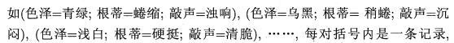
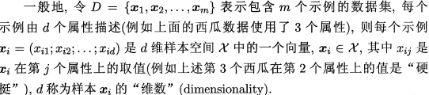
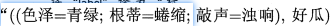
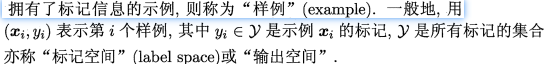

# Machine Learning Notes

## Concepts

### PMML

PMML全称**预言模型标记模型（Predictive Model Markup Language）**，以XML 为载体呈现数据挖掘模型。PMML 允许您在不同的应用程序之间轻松共享预测分析模型。因此，您可以在一个系统中定型一个模型，在 PMML 中对其进行表达，然后将其移动到另一个系统中，而不需考虑分析和预测过程中的具体实现细节。使得模型的部署摆脱了模型开发和产品整合的束缚。

PMML 标准是数据挖掘过程的一个实例化标准，它按照数据挖掘任务执行过程，有序的定义了数据挖掘不同阶段的相关信息

- 头信息（Header）
- 数据字典（DataDictionary）
- 挖掘模式(Mining Schema)
- 数据转换（Transformations）
- 模型定义 (Model Definition)
- 评分结果 (Score Result)

pmml 的用途和使用案例：https://zhuanlan.zhihu.com/p/73245462

### pkl

对pkl文件的理解为：

　　1）python中有一种存储方式，可以存储为.pkl文件。

　　2）该存储方式，可以将python项目过程中用到的一些暂时变量、或者需要提取、暂存的字符串、列表、字典等数据保存起来。

　　3）保存方式就是保存到创建的.pkl文件里面。

　　4）然后需要使用的时候再 open，load。

### **联邦学习**

# 西瓜书读书笔记

## 绪论

机器学习，是关于在计算机上从数据产生模型的算法，即学习算法。产生模型后，通过数据输入，得到相应的结果。

### 基本术语

#### 数据集 DATASET

这就是一个数据集，其中每一个描述都可以称为一个样本**sample、示例**

其中反映某方面属性的————**特征 feature**

属性上的取值————属性值

属性构成的空间：**属性空间、样本空间、输入空间**

如把色泽、根蒂、敲声作为三个坐标轴，则可以勾陈一个描述西瓜的三维空间，每一个西瓜都可以在空间中定位到。

空间中每一个点对应一个坐标向量，因此把每一个示例/样本，称为一个 特征向量

数据到模型过程叫训练、学习，训练数据**training** data，每个样本称为一个训练样本training sample

学习得到的模型是一种规律假设，规律本身则是真实

如果需要训练一个判断瓜是否熟的模型，训练样本还需要结果信息，如

这里的结果称为 **标记 label**

- 分类Classification：预测的是离散值，如好瓜、坏瓜
  - 二分类：正类反类。
  - 多分类

- 回归Regression：预测连续值，如瓜的成熟度

测试testing：学习到模型后，需要多模型进行测试

测试样本test sample：用于测试的样本

- 聚类clustering：将训练集分为多个组，每个组称为一个簇cluster

根据训练数据是否拥有标记，学习任务可以分为两类：

- **监督学习：suppervised learning，需要标记，如分类和回归**
- **无监督学习：unsupervised learning，不需要标记，如聚类**

泛化能力：在非训练集上表现出来的模型预测能力

训练样本在样本空间往往占比非常小，假设样本空间服从一个未知分布，每个样本都应该从空间中独立采集————**独立同分布independent and identically distriibuted**

### 假设空间

- 归纳induction：从一般到泛化

- 演绎deduction：从一般到特殊化

从样例中学习，是一个归纳过程，也称为归纳学习，这是广义的归纳学习。狭义的归纳学习则是从训练数据中学习概念，因此成为概念学习。

布尔概念学习

