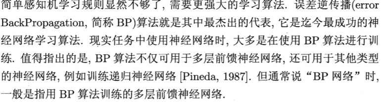
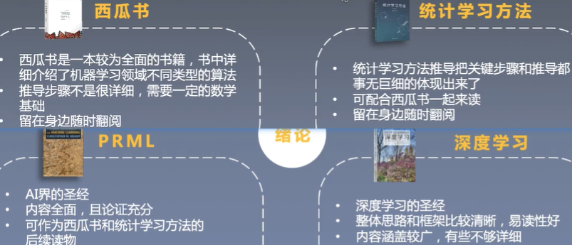
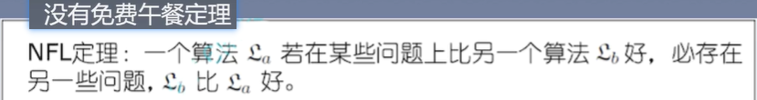

# Machine Learning Notes

## 学习相关

### 资源

公式解析：

https://github.com/datawhalechina/pumpkin-book

earn the respect from the person you repsect, not the envy from the person you envy.

https://www.coursera.org/learn/machine-learning/home/welcome

### 如何学习

https://zhuanlan.zhihu.com/p/112484706

门阶段主要有三个任务：

1. **快速看完周志华的《西瓜书》**；
2. **看吴恩达 Coursera 上的《机器学习》**；
3. **调包跑算法**。

周志华看到逻辑回归就差不多了，不需要深入

《机器学习实践》使用算法实现

## Concepts

### PMML

PMML全称**预言模型标记模型（Predictive Model Markup Language）**，以XML 为载体呈现数据挖掘模型。PMML 允许您在不同的应用程序之间轻松共享预测分析模型。因此，您可以在一个系统中定型一个模型，在 PMML 中对其进行表达，然后将其移动到另一个系统中，而不需考虑分析和预测过程中的具体实现细节。使得模型的部署摆脱了模型开发和产品整合的束缚。

PMML 标准是数据挖掘过程的一个实例化标准，它按照数据挖掘任务执行过程，有序的定义了数据挖掘不同阶段的相关信息

- 头信息（Header）
- 数据字典（DataDictionary）
- 挖掘模式(Mining Schema)
- 数据转换（Transformations）
- 模型定义 (Model Definition)
- 评分结果 (Score Result)

PMML**是一种可以呈现预测分析模型的事实标准语言**，标准的好处是各种语言都可以使用，PMML相当于一种中间格式，一种语言的模型导出为PMML，另一种语言解析然后使用。

同一种语言的话就没必要使用PMML，因为都有标准的输出格式。

因为PMML格式的通用性，所以会丧失特殊模型的特殊优化，例如上线XGBoost模型，也可以使用XGBoost4J，该包会链接一个本地环境编译的 .so 文件，C++实现的核心代码效率很高。不过PMML格式通用，在效率要求不高的场景可以发挥很大作用。

 **1  优点**

- \1. 平台无关性。PMML采用标准的XML格式保存模型，可以实现跨平台部署。
- \2. 广泛的支持性。很多常用的开源模型都可以转换成PMML文件。
- \3. 易读性。PMML模型文件是一个基于XML的文本文件，任意文本编辑器都可以打开查阅。

 **2  缺点**

- 1.对数据预处理的支持有限。虽然已经支持了几乎所有的标准数据处理方式，但是对于自拓展的方法，还缺乏有效支持。
- \2. 模型类型支持有限。缺乏对深度学习模型的支持。
- \3. 预测会有一点偏差。因为PMML格式的通用性，会损失特殊模型的特殊优化。 比如一个样本，用sklearn的决策树模型预测为类别2，但是我们把这个决策树保存为PMML文件，并用JAVA加载后，继续预测刚才这个样本，有较小的概率出现预测的结果不为类别2。

pmml 的用途和使用案例：https://zhuanlan.zhihu.com/p/73245462

### pkl

对pkl文件的理解为：

　　1）python中有一种存储方式，可以存储为.pkl文件。

　　2）该存储方式，可以将python项目过程中用到的一些暂时变量、或者需要提取、暂存的字符串、列表、字典等数据保存起来。

　　3）保存方式就是保存到创建的.pkl文件里面。

　　4）然后需要使用的时候再 open，load。

### **联邦学习**

https://zhuanlan.zhihu.com/p/100688371

### 模型评估

- ROC
- AUC
- KS

### 金融风控

TODO https://zhuanlan.zhihu.com/p/213800630

# 西瓜书读书笔记

## C1-绪论

机器学习，是关于在计算机上从数据产生模型的算法，即学习算法。产生模型后，通过数据输入，得到相应的结果。

### 基本术语

#### 数据集 DATASET

这就是一个数据集，其中每一个描述都可以称为一个样本**sample、示例**

其中反映某方面属性的————**特征 feature**

属性上的取值————属性值

属性构成的空间：**属性空间、样本空间、输入空间**

如把色泽、根蒂、敲声作为三个坐标轴，则可以勾陈一个描述西瓜的三维空间，每一个西瓜都可以在空间中定位到。

空间中每一个点对应一个坐标向量，因此把每一个示例/样本，称为一个 特征向量

数据到模型过程叫训练、学习，训练数据**training** data，每个样本称为一个训练样本training sample

学习得到的模型是一种规律假设，规律本身则是真实

如果需要训练一个判断瓜是否熟的模型，训练样本还需要结果信息，如

这里的结果称为 **标记 label**

- 分类Classification：预测的是离散值，如好瓜、坏瓜
  - 二分类：正类反类。
  - 多分类

- 回归Regression：预测连续值，如瓜的成熟度

测试testing：学习到模型后，需要多模型进行测试

测试样本test sample：用于测试的样本

- 聚类clustering：将训练集分为多个组，每个组称为一个簇cluster

根据训练数据是否拥有标记，学习任务可以分为两类：

- **监督学习：suppervised learning，需要标记，如分类和回归**
- **无监督学习：unsupervised learning，不需要标记，如聚类**

泛化能力：在非训练集上表现出来的模型预测能力

训练样本在样本空间往往占比非常小，假设样本空间服从一个未知分布，每个样本都应该从空间中独立采集————**独立同分布independent and identically distriibuted**

### 假设空间

- **归纳induction：从一般到泛化**

- **演绎deduction：从一般到特殊化**

从样例中学习，是一个归纳过程，也称为归纳学习，这是广义的归纳学习。狭义的归纳学习则是从训练数据中学习概念，因此成为概念学习。

布尔概念学习

假设空间：可以假设的各种情况的集合？

把和训练集一致的假设集合称为 版本空间

### 归纳偏好

通过学习得到的模型对应假设空间中一个假设，那么那种模型更好呢？该选择哪一种模型。

这就需要归纳偏好，即以那种标准来选择模型

根据奥卡姆剃刀Occam's Razor，如果有U盾讴歌假设和观察一致，那么选择最简单的那个。如无必要勿增实体

### 发展历程

ML 是 AI 发展到一定阶段的产物

## C2-模型评估与选择

### 经验误差和过拟合

错误率error： 分类错误的样本数赞总样本数量的比例

精度accuracy：和错误率相反，正确/总

误差：实际的输出和真实的之间的误差

学习器在训练集上的误差称为 **训练误差**/**经验误差**，**在新样本上的误差称为泛化误差**

我们的目标是是泛化误差更小，即模型更在其他数据上也有很好的性能

当学习器学过头了，把训练数据自身的特点当成是所有数据都具有的特点时，就会出现**过拟合overfitting**，**过拟合相对于欠拟合underfitting**

学习能力过强可能导致过拟合

NP问题：非P问题

P类问题：在多项式时间复杂度下可以解决的问题。有效的算法必须在多项式时间内运行完毕。

### 模型评估方法

通常使用测试集来对模型进行测试，**使用测试误差粗略代表泛化误差**。

测试样本应该和训练样本互斥

**留出法**：hold-out，直接把数据集划分为两个互斥的集合（注意要保证数据分布的一致性，2/3~4/5的数据用于训练）

**交叉验证法**：

**自助法**：

前两者用的更多

调参：parameter tuning

训练数据分为 **训练集和验证集**，验证集用于调参

### 性能度量

performance measure

衡量模型泛化能力的评价标准

常用性能度量指标：

#### 错误率和精度

错误率：

精度：

#### 查准率、查全率、F1

PR图可以表现P与R的大概关系

如果一个PR线完全包住另一个，则其性能更好，如A>C，否则无法判断，AB两个无法判断。不过可以通过曲线的形成的面积估计。不过面积不好算，还有其他指标：

- 平衡点break event point BEP：P = R的取值， A > B 

BEP过于简化了，更多使用F1度量：

在N个混淆矩阵上计算查准率和查全率

#### ROC AUC

用一个阈值区分正类、反类，通过阈值的设置，来决定查准率和查全率谁重要

#### 代价敏感错误率 和 代价曲线

现实生活中，不同类型的错误造成的代价是不同的。

### 比较检验

不同的模型性能比较是比较麻烦的。

统计假设检验 hypothesis test是一种方式

#### 假设检验

todo

#### 交叉验证t检验

#### McNemar检验

### 偏差与方差

偏差-方法分解bias-variance decomposition是解释学习算法泛化性能的重要工具

泛化误差 = 偏差 + 方差 + 噪声

- 偏差：期望预测和真实结果的偏离程度，即刻画学习算法本身的拟合能力
- 方差：度量同样大小的训练集的变动所导致的学习性能的变化
- 噪声：误差下界，即学习问题本身的难度

## C3-线性模型

### 基本形式

### 线性回归

### 对数几率回归

看不太懂

#### 线性判别分析

Linear Discriminant Analysis **LDA**

是一种经典的线性学习方法

### 多分类学习

## C4-决策树

### 基本流程

decision tree

基于树形的方式来分类

### 划分选择

关键在第8行：如何选择划分，是节点的 **纯度** 越来越高

#### 信息增益

著名的ID3决策树算法就是以 信息增益 为准则划分属性的

#### 增益率

### 剪枝处理

pruning

处理过拟合情况：分支过多

- 预剪枝：生成过程中剪枝
- 后剪枝：在完整的决策树上进行剪枝

### 多变量决策树

决策树著名算法：

- ID3
- C4.5
- CART

## C5-神经网络

### 神经网络

NEURAL NETWORKS

如今的神经网络是一个相当大的、学科交叉的领域

基本单元： 神经元 neuron

神经元有一个阈值 threshold ，超过这个阈值就出于激活状态

### 感知机 和 多层网络

感知机 Perception 由两层神经元组成

权重和阈值都需要学习，不过阈值可以初始化为 -1，那么只需要学习权重，不断调整阈值即可：

感知机只有一层功能性网络，功能非常有限，解决问题也必须要保证收敛性，如果发生震荡，则不会收敛，比如亦或问题就不能解决，因为它是非线性可分问题

两层的繁殖季就能够解决：

### 误差逆传播算法

多层感知机

BP是迭代学习算法

由于强大的表达能力，BP经常遭遇过拟合，在训练集上表现良好，但是在测试集上却不太好。

### 全局最小和局部最小

BP算法的目的是尽可能减小误差，有两种思路：全局与局部的最小

### 其他常见神经网络

#### RBF网络

#### ART网络

#### SOM网络

#### 级联相关网络

### 深度学习

理论上，参数雨多的模型，复杂度越到，capacity越大，能完成更加复杂的问题

计算机计算能力的提升也促进复杂模型的出现

深度学习就是具有很深层的神经网络。

CNN卷积神经网络

一般都是通过稍微简单的层次/模型将输入转化为和目标相关的数据，即特征的提取和精华，————特征工程

## C6-支持向量机

### 间隔与支持向量

我们需要找到最大的 间隔

### 对偶问题

### 核函数

核函数是机器学习的通用基本技术

### 软间隔和正则化

## C7-贝叶斯分类器

基于概率的分类器

### 贝叶斯决策论

### 极大似然估计

### 朴素贝叶斯分类器

### 半朴素贝叶斯分类器

# 视频学习01

https://www.bilibili.com/video/BV1wx411o7CK?p=2&spm_id_from=pageDriver

## 绪论

## 模型评估与选择

二分类，产生四种数据类型：

trade off权衡折中

## 线性模型

## 决策树

# Andrew Ng经典课程 Machine Learning

## WEEK01

### 引言

### 单变量线性回归

#### 模型表示

Linear Regression With One Variable

第一个学习算法，了解监督学习的完整过程

根据占地预测房价问题：

h是一个一元一次函数，只有一个特征/输入变量，这类问题叫做单变量线性回归，h = ax +b

#### 代价函数

cost function

为了更好地拟合数据，定义代价函数

a\b是参数，决定了模型的好坏，**模型所预测出来的值和训练集中实际值的差距是建模误差**

可以看出在三维空间中存在一个使得𝐽(𝜃0, 𝜃1)最小的点。

代价函数也被称作平方误差函数，有时也被称为平方误差代价函数。我们之所以要求出 误差的平方和，是因为误差平方代价函数，对于大多数问题，特别是回归问题，都是一个合 理的选择。

如何找出使代价函数最小的参数是一个问题？

#### 梯度下降

Gradient Descent

梯度下降是一个用来求函数最小值的算法，我们将使用梯度下降算法来求出代价函数 𝐽(𝜃0, 𝜃1) 的最小值

梯度下降背后的思想是：开始时我们随机选择一个参数的组合(𝜃0, 𝜃1, . . . . . . , 𝜃𝑛 )，计算代 价函数，然后我们寻找下一个能让代价函数值下降最多的参数组合。我们持续这么做直到到 到一个局部最小值（local minimum），因为我们并没有尝试完所有的参数组合，所以不能确 定我们得到的局部最小值是否便是全局最小值（global minimum），选择不同的初始参数组 合，可能会找到不同的局部最小值

批量梯度下降（batch gradient descent）算法的公式为：

𝜃0, 𝜃1应该同时更新。

注意：这里是偏导数，而不是全导数

## 他人笔记学习

有人总结了笔记，直接看笔记

使用 Octave 编程环境。Octave,是免费的开源软件，使用一个像 Octave 或 Matlab 的工具，许多学习算法变得只有几行代码就可实现

因为软件在 Octave 中可 以令人难以置信地、快速地实现这些学习算法。这里的这些函数比如 SVM（支持向量机）函 数，奇异值分解，Octave 里已经建好了

#### 

Octave:

https://www.gnu.org/software/octave/index

https://www.zhihu.com/topic/19845505/top-answers

