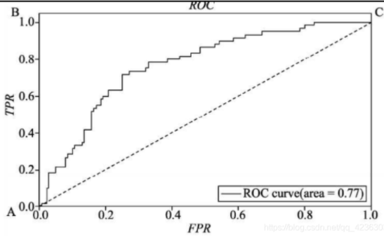
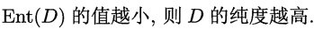
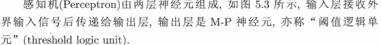
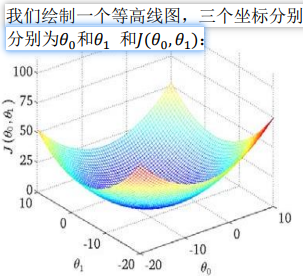
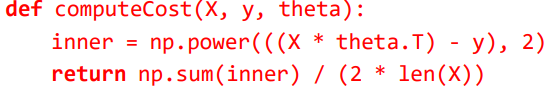

# Machine Learning Notes

## 学习相关

### 资源

公式解析：

https://github.com/datawhalechina/pumpkin-book

earn the respect from the person you repsect, not the envy from the person you envy.

https://www.coursera.org/learn/machine-learning/home/welcome

### 如何学习

https://zhuanlan.zhihu.com/p/112484706

门阶段主要有三个任务：

1. **快速看完周志华的《西瓜书》**；
2. **看吴恩达 Coursera 上的《机器学习》**；
3. **调包跑算法**。


周志华看到逻辑回归就差不多了，不需要深入

《机器学习实践》使用算法实现


## My ML Notes

### PMML

PMML全称**预言模型标记模型（Predictive Model Markup Language）**，以XML 为载体呈现数据挖掘模型。PMML 允许您在不同的应用程序之间轻松共享预测分析模型。因此，您可以在一个系统中定型一个模型，在 PMML 中对其进行表达，然后将其移动到另一个系统中，而不需考虑分析和预测过程中的具体实现细节。使得模型的部署摆脱了模型开发和产品整合的束缚。

PMML 标准是数据挖掘过程的一个实例化标准，它按照数据挖掘任务执行过程，有序的定义了数据挖掘不同阶段的相关信息

- 头信息（Header）
- 数据字典（DataDictionary）
- 挖掘模式(Mining Schema)
- 数据转换（Transformations）
- 模型定义 (Model Definition)
- 评分结果 (Score Result)


PMML**是一种可以呈现预测分析模型的事实标准语言**，标准的好处是各种语言都可以使用，PMML相当于一种中间格式，一种语言的模型导出为PMML，另一种语言解析然后使用。

同一种语言的话就没必要使用PMML，因为都有标准的输出格式。

因为PMML格式的通用性，所以会丧失特殊模型的特殊优化，例如上线XGBoost模型，也可以使用XGBoost4J，该包会链接一个本地环境编译的 .so 文件，C++实现的核心代码效率很高。不过PMML格式通用，在效率要求不高的场景可以发挥很大作用。


 **1  优点**

- \1. 平台无关性。PMML采用标准的XML格式保存模型，可以实现跨平台部署。
- \2. 广泛的支持性。很多常用的开源模型都可以转换成PMML文件。
- \3. 易读性。PMML模型文件是一个基于XML的文本文件，任意文本编辑器都可以打开查阅。

 **2  缺点**

- 1.对数据预处理的支持有限。虽然已经支持了几乎所有的标准数据处理方式，但是对于自拓展的方法，还缺乏有效支持。
- \2. 模型类型支持有限。缺乏对深度学习模型的支持。
- \3. 预测会有一点偏差。因为PMML格式的通用性，会损失特殊模型的特殊优化。 比如一个样本，用sklearn的决策树模型预测为类别2，但是我们把这个决策树保存为PMML文件，并用JAVA加载后，继续预测刚才这个样本，有较小的概率出现预测的结果不为类别2。


pmml 的用途和使用案例：https://zhuanlan.zhihu.com/p/73245462


### pkl

对pkl文件的理解为：

　　1）python中有一种存储方式，可以存储为.pkl文件。

　　2）该存储方式，可以将python项目过程中用到的一些暂时变量、或者需要提取、暂存的字符串、列表、字典等数据保存起来。

　　3）保存方式就是保存到创建的.pkl文件里面。

　　4）然后需要使用的时候再 open，load。

### **联邦学习**

https://zhuanlan.zhihu.com/p/100688371

联邦学习的作用主要是用来解决数据孤岛

联邦机器学习是一个机器学习框架，能有效帮助多个机构在满足用户隐私保护、数据安全和政府法规的要求下，进行数据使用和机器学习建模。联邦学习作为分布式的机器学习范式,可以有效解决数据孤岛问题,让参与方在不共享数据的基础上联合建模,能从技术上打破数据孤岛,实现AI协作。

谷歌在2016年提出了针对手机终端的联邦学习,微众银行AI团队则从金融行业实践出发,关注跨机构跨组织的大数据合作场景，首次提出“联邦迁移学习”的解决方案，将迁移学习和联邦学习结合起来。据杨强教授在“联邦学习研讨会”上介绍,联邦迁移学习让联邦学习更加通用化,可以在不同数据结构、不同机构间发挥作用，没有领域和算法限制,同时具有模型质量无损、保护隐私、确保数据安全的优势。

联邦学习有三大构成要素：数据源、联邦学习系统、用户。三者间关系如图所示，在联邦学习系统下，各个数据源方进行数据预处理，共同建立及其学习模型，并将输出结果反馈给用户。


根据参与各方数据源分布的情况不同，联邦学习可以被分为三类：横向联邦学习、纵向联邦学习、联邦迁移学习。

#### 横向联邦学习

在两个数据集的用户特征重叠较多而用户重叠较少的情况下，我们把数据集按照横向(即用户维度)切分，并取出双方用户特征相同而用户不完全相同的那部分数据进行训练。这种方法叫做横向联邦学习。

比如业务相同但是分布在不同地区的两家企业，它们的用户群体分别来自各自所在的地区，相互的交集很小。但是，它们的业务很相似，因此，记录的用户特征是相同的。此时，就可以使用横向联邦学习来构建联合模型。

横向联邦学习中多方联合训练的方式与分布式机器学习（Distributed Machine Learning）有部分相似的地方。分布式机器学习涵盖了多个方面，包括把机器学习中的训练数据分布式存储、计算任务分布式运行、模型结果分布式发布等，参数服务器是分布式机器学习中一个典型的例子。参数服务器作为加速机器学习模型训练过程的一种工具，它将数据存储在分布式的工作节点上，通过一个中心式的调度节点调配数据分布和分配计算资源，以便更高效的获得最终的训练模型。而对于联邦学习而言，首先在于横向联邦学习中的工作节点代表的是模型训练的数据拥有方，其对本地的数据具有完全的自治权限，可以自主决定何时加入联邦学习进行建模，相对地在参数服务器中，中心节点始终占据着主导地位，因此联邦学习面对的是一个更复杂的学习环境；其次，联邦学习则强调模型训练过程中对数据拥有方的数据隐私保护，是一种应对数据隐私保护的有效措施，能够更好地应对未来愈加严格的数据隐私和数据安全监管环境。

#### **纵向联邦学习**

在两个数据集的用户重叠较多而用户特征重叠较少的情况下，我们把数据集按照纵向（即特征维度）切分，并取出双方用户相同而用户特征不完全相同的那部分数据进行训练。这种方法叫做纵向联邦学习。

比如有两个不同机构，一家是某地的银行，另一家是同一个地方的电商。它们的用户群体很有可能包含该地的大部分居民，因此用户的交集较大。但是，由于银行记录的都是用户的收支行为与信用评级，而电商则保有用户的浏览与购买历史，因此它们的用户特征交集较小。纵向联邦学习就是将这些不同特征在加密的状态下加以聚合，以增强模型能力的联邦学习。目前机器学习模型如逻辑回归、决策树等均是建立在纵向联邦学习系统框架之下的。

#### **联邦迁移学习**

在两个数据集的用户与用户特征重叠都较少的情况下，我们不对数据进行切分，而可以利用迁移学习来克服数据或标签不足的情况。这种方法叫做联邦迁移学习

比如有两个不同机构，一家是位于中国的银行，另一家是位于美国的电商。由于受到地域限制，这两家机构的用户群体交集很小。同时，由于机构类型的不同，二者的数据特征也只有小部分重合。在这种情况下，要想进行有效的联邦学习，就必须引入迁移学习，来解决单边数据规模小和标签样本少的问题，从而提升模型的效果。

#### FATE

https://github.com/FederatedAI/FATE/blob/master/README_zh.md

FATE (Federated AI Technology Enabler) 是微众银行AI部门发起的开源项目，为联邦学习生态系统提供了可靠的安全计算框架。FATE项目使用多方安全计算 (MPC) 以及同态加密 (HE) 技术构建底层安全计算协议，以此支持不同种类的机器学习的安全计算，包括逻辑回归、基于树的算法、深度学习和迁移学习等。

FATE官方网站：https://fate.fedai.org/


### 模型评估

- ROC
- AUC
- KS

### 金融风控

TODO https://zhuanlan.zhihu.com/p/213800630

### PSI 

https://blog.csdn.net/weixin_31866177/article/details/93634211

特征稳定性

所谓特征稳定性，就是关注该特征的取值随着时间的推移会不会发生大的波动。

**对特征稳定性的关注，一定一定要在建模之前完成，从一开始就避免将那些本身不太稳定的特征选入模型**

通常采用PSI（PopulationStability Index，群体稳定性指数）指标评估特征稳定性。


**PSI是对两个日期的特征数据进行计算，可以任选其一作为base集，另一则是test集**（也有其他叫法为expected集和actual集）

特征的PSI是如何计算出来的？


群体稳定性指标**PSI**(Population Stability Index)是衡量**模型的预测值**与**实际值偏差大小**的指标。

**PSI = sum（（实际占比-预期占比）\* ln（实际占比/预期占比））**


### 模型的评估指标

模型的开发基于历史数据，模型的使用针对未来的数据，于是数据分为三部分：训练集、验证集、测试集

训练误差：模型在训练集上的误差，即真实结果和预测结果之间的差异

泛化误差：模型在验证集和测试集上的误差

交叉验证：对多个候选模型进行测试，以选出最优的模型，嵌套交叉验证

内层交叉验证用于模型参数优化；外层交叉验证用于模型选择即寻找最优模型

#### 回归问题的评估标准

##### SSE(和方差、误差平方和)

该统计参数计算的是拟合数据和原始数据对应点的误差的平方和


SSE越接近于0，说明模型选择和拟合更好，数据预测也越成功。接下来的MSE和RMSE因为和SSE是同出一宗，所以效果一样

##### MSE(均方差)

该统计参数是预测数据和原始数据对应点误差的平方和的均值，也就是SSE/n，和SSE没有太大的区别


##### RMSE(均方根)

该统计参数，也叫回归系统的拟合标准差，是MSE的平方根


##### R-square(确定系数)

在讲确定系数之前，我们需要介绍另外两个参数SSR和SST，因为确定系数就是由它们两个决定的

SSR：Sum of squares of the regression，即预测数据与原始数据均值之差的平方和


SST：Total sum of squares，即原始数据和均值之差的平方和


“确定系数”是定义为SSR和SST的比值


#### 分类问题的评估指标

##### 错误率


其中，I(f(x)≠y)为指示函数，如条件成立时，输出为 1，条件不成立时，结果为 0。因此，错误率就是被错分的样本数占总体样本数的比例

##### 召回率(查全率)

召回率衡量了在所有正例中模型正确预测的概率，召回率与漏报率相对，即召回率越高，漏报率越小.(预测为正 / 真实正例)


##### 查准率 精准率


##### PR曲线

召回率和精确率是相互制约、此消彼长的

为了综合考虑召回率与精准率(P-R曲线和f1指标)

P-R:以召回率为横坐标、精准率为纵坐标，绘制 P-R 曲线来比较模型的优劣

同时也可以采用平衡点来衡量，令每个分类模型的召回率与精准率相等即为该模型的 BEP，BEP 越大，则模型的性能越好


##### 准确率


##### F1

BEP方法是P-R曲线的一种量化方法，更好的量化方法是F1指标


F1 指标综合考虑了召回率与精准率两种情况，如果希望考虑更多的召回率或精准率，则有如下的变异形式


当β=1 时，Fβ 指标蜕化为 F1 指标，此时召回率与精准率的重要程度相同；

当 β＞1 时召回率的影响大于精准率；

相反，当β＜1 时，精准率的影响大于召回率


- 当衡量所有正例中预测正确的概率，用召回率（所有正例预测为正）
  - 召回率越高，漏报率越小
- 当衡量预测为正例中，真实为正例的概率，用精确率（预测为正实际为正）
  - 精确率越高，误报率越小

#### 概率密度评估指标

##### 信息量


##### 信息熵


##### 相对熵(K-L散度)

K-L 散度是两个随机分布之间距离的度量，就是似然比的对数期望，这正是要找的衡量两个概率密度函数独立性的指标

用于衡量对于同一个随机变量x的两个分布 真实 和 预测 之间的差异


p(x)常用于描述样本的真实分布，而q(x)则常常用于表示预测的分布

**KL散度的值越小表示两个分布越接近（越小越好）。**

既然 K- L 散度没有对称性，两个随机分布之间的 K-L 散度求和，这个求和后的距离越大，证明两个随机分布的距离越大，即独立性越好，模型的预测效果越好

因此，得到了一个具有对称性的距离，即为 K-L 距离

对称化后的 K-L 散度即 K-L 距离就是 IV 值

##### 交叉熵


#### 概率分布评估标准

##### ROC曲线

纵坐标为真正率(TPR)，横坐标为假正率(FPR)




绘制方法

1.对输出概率进行降序排序
2.确定阈值
3.根据阈值点计算TPR和FPR
4.苗点连线
ROC曲线反映了排序质量的好坏，也就是预测结果的好坏(正例在前，反例在后)

ROC曲线的量化指标：AUC，就是曲线下面积，AUC值越大越好，即面积曲线下面积越大越好

AUC的取值在0.5-1之间，我们更习惯于一个取值在0-1之间的指标，这时候就有了归一化后的AUC，就是基尼系数或基尼统计量（这里的基尼系数和决策树的不同）基尼系数（基尼统计量）是AUC的一种归一化形式

**ROC反映的是整体的性能**

##### KS曲线

K-S曲线本质就是坏样本的洛伦兹曲线和好样本的洛伦兹曲线构成的


**KS值反映了模型对好坏样本的区分能力，KS值越大表示对好坏样本的区分能力越强，最大的KS值对应的概率就是预测模型的最优阈值点**

KS值越大说明模型对好坏样本的区分能力越好，模型的性能越优


### 深度学习

- 深度学习是一种机器学习

深度学习的基础是神经网络

最近人们将深度学习独立出来，区分传统的机器学习


- 深度学习是一个数学问题

深度学习的数学表达能力极强，

背后的数学原理：万能近似定理：神经网络可以拟合任何函数，不管这个函数的表达是多么的复杂。

- 深度学习是一个黑箱

黑箱：深度学习的中间过程不可知，深度学习产生的结果不可控

传统机器学习逻辑性很强，具有可解释性


**深度学习算法：**
    1.卷积神经网络（convolutional neural network）， 这种算法在图像识别中应用广泛。
    2.Recursive neural network， 这种算法主要用在时序数据集中，比如语音。
    3.neural autoregressive topic model， 这种算法主要用在自然语言处理（主题模型）中。
    4.基于autoencoder, restricted Boltzmann machine的深层模型。
    5.sum-product network，这种模型是基于和积运算的。


#### java部署深度学习模型

TensorFlow模型：https://github.com/tensorflow/models/tree/master/research/slim

使用TensorFlow Java API部署TensorFlow模型


### 模型聚合

聚合模型实际上就是将许多模型聚合在一起，从而使其分类性能更佳

模型聚合的几种方式：

（1）选择最好的模型；

（2）每个模型均匀的投票；

（3）每个模型按不同的权重投票；

（4）每个模型的权重跟输入有关


### 模型‘生命周期’

完成了前面的数据获取、数据清洗、模型训练、模型评估等等步骤之后，终于等到老大说“部署上线”啦。

模型训练--模型部署--模型调用--模型监控

#### 离线模型


#### 实时模型

实时模型指的是需要**在线上实时获取数据并输出结果的模型**。常用于一些实时申请业务，例如欺诈模型和征信模型。


***见问题：是使用实时模型还是离线模型？***

解释这个问题，可以从下面2个角度分析。

首先，从业务角度来看，首先需要确认是否需要实时审批，如果不需要，那就可以直接用离线模型。

其次，从数据角度看，可以用以下2个方面来判断：

- 是否有需要实时调用收费的数据源
- 是否需要使用当天的实时申请数据

如果有这两个方面数据要求，那就需要实时模型。

例如，在风控模型中，有些风控模型需要用到用户填写提交的实时申请表数据，这时就要实时模型。但如果在电商环境下的风控模型，从电商交易行为入手，模型性能已经很强了，完全不需要外部数据或者申请表数据，那就可以用离线模型，给所有用户先打好分。


实时模型的开发，可以分为以下3个步骤：

1. 模型训练：利用离线数据对模型进行训练
2. 线上部署：把训练好的模型放到实时数据流中进行测试
3. 实时调用与模型监控：测试完毕后，正式开始使用并对模型输入和输出进行监控

##### 模型训练

实时模型的训练和离线模型的训练基本一样，都是用到历史数据和样本进行训练。唯一需要注意的点是，离线原始数据存储格式可能和线上数据不一致。这里最好保持原始数据格式一致，不然线上和线下两套变量逻辑非常容易出错。

举个例子，线上数据流一般是json格式。但离线存储的时候，为了方便分析，很多团队会把json的数据解析后进行存储。如果在抽取离线训练变量的时候使用这种解析后的数据，就会造成和线上数据流的格式不一致。


训练好模型后，把模型文件保存下来。模型文件格式没有限制，可以是模型python包自带的存储方式，也可以存成Pickle格式，只要方便读取就好。


# 西瓜书读书笔记

## C1-绪论

机器学习，是关于在计算机上从数据产生模型的算法，即学习算法。产生模型后，通过数据输入，得到相应的结果。

### 基本术语

#### 数据集 DATASET


这就是一个数据集，其中每一个描述都可以称为一个样本**sample、示例**

其中反映某方面属性的————**特征 feature**

属性上的取值————属性值

属性构成的空间：**属性空间、样本空间、输入空间**

如把色泽、根蒂、敲声作为三个坐标轴，则可以勾陈一个描述西瓜的三维空间，每一个西瓜都可以在空间中定位到。

空间中每一个点对应一个坐标向量，因此把每一个示例/样本，称为一个 特征向量


数据到模型过程叫训练、学习，训练数据**training** data，每个样本称为一个训练样本training sample

学习得到的模型是一种规律假设，规律本身则是真实


如果需要训练一个判断瓜是否熟的模型，训练样本还需要结果信息，如


这里的结果称为 **标记 label**


- 分类Classification：预测的是离散值，如好瓜、坏瓜
  - 二分类：正类反类。
  - 多分类

- 回归Regression：预测连续值，如瓜的成熟度


测试testing：学习到模型后，需要多模型进行测试

测试样本test sample：用于测试的样本

- 聚类clustering：将训练集分为多个组，每个组称为一个簇cluster


根据训练数据是否拥有标记，学习任务可以分为两类：

- **监督学习：suppervised learning，需要标记，如分类和回归**
- **无监督学习：unsupervised learning，不需要标记，如聚类**

泛化能力：在非训练集上表现出来的模型预测能力


训练样本在样本空间往往占比非常小，假设样本空间服从一个未知分布，每个样本都应该从空间中独立采集————**独立同分布independent and identically distriibuted**


### 假设空间

- **归纳induction：从一般到泛化**

- **演绎deduction：从一般到特殊化**

从样例中学习，是一个归纳过程，也称为归纳学习，这是广义的归纳学习。狭义的归纳学习则是从训练数据中学习概念，因此成为概念学习。

布尔概念学习

假设空间：可以假设的各种情况的集合？

把和训练集一致的假设集合称为 版本空间

### 归纳偏好

通过学习得到的模型对应假设空间中一个假设，那么那种模型更好呢？该选择哪一种模型。

这就需要归纳偏好，即以那种标准来选择模型


根据奥卡姆剃刀Occam's Razor，如果有U盾讴歌假设和观察一致，那么选择最简单的那个。如无必要勿增实体

### 发展历程

ML 是 AI 发展到一定阶段的产物

## C2-模型评估与选择

### 经验误差和过拟合

错误率error： 分类错误的样本数赞总样本数量的比例

精度accuracy：和错误率相反，正确/总

误差：实际的输出和真实的之间的误差


学习器在训练集上的误差称为 **训练误差**/**经验误差**，**在新样本上的误差称为泛化误差**

我们的目标是是泛化误差更小，即模型更在其他数据上也有很好的性能

当学习器学过头了，把训练数据自身的特点当成是所有数据都具有的特点时，就会出现**过拟合overfitting**，**过拟合相对于欠拟合underfitting**

学习能力过强可能导致过拟合


NP问题：非P问题

P类问题：在多项式时间复杂度下可以解决的问题。有效的算法必须在多项式时间内运行完毕。

### 模型评估方法

通常使用测试集来对模型进行测试，**使用测试误差粗略代表泛化误差**。

测试样本应该和训练样本互斥


**留出法**：hold-out，直接把数据集划分为两个互斥的集合（注意要保证数据分布的一致性，2/3~4/5的数据用于训练）

**交叉验证法**：


**自助法**：


前两者用的更多


调参：parameter tuning

训练数据分为 **训练集和验证集**，验证集用于调参

### 性能度量

performance measure

衡量模型泛化能力的评价标准


常用性能度量指标：

#### 错误率和精度

错误率：

精度：


#### 查准率、查全率、F1


PR图可以表现P与R的大概关系

如果一个PR线完全包住另一个，则其性能更好，如A>C，否则无法判断，AB两个无法判断。不过可以通过曲线的形成的面积估计。不过面积不好算，还有其他指标：

- 平衡点break event point BEP：P = R的取值， A > B 

BEP过于简化了，更多使用F1度量：


在N个混淆矩阵上计算查准率和查全率


#### ROC AUC

用一个阈值区分正类、反类，通过阈值的设置，来决定查准率和查全率谁重要


#### 代价敏感错误率 和 代价曲线

现实生活中，不同类型的错误造成的代价是不同的。

### 比较检验

不同的模型性能比较是比较麻烦的。

统计假设检验 hypothesis test是一种方式

#### 假设检验

todo

#### 交叉验证t检验

#### McNemar检验

### 偏差与方差

偏差-方法分解bias-variance decomposition是解释学习算法泛化性能的重要工具

泛化误差 = 偏差 + 方差 + 噪声

- 偏差：期望预测和真实结果的偏离程度，即刻画学习算法本身的拟合能力
- 方差：度量同样大小的训练集的变动所导致的学习性能的变化
- 噪声：误差下界，即学习问题本身的难度


## C3-线性模型

### 基本形式


### 线性回归


### 对数几率回归

看不太懂

#### 线性判别分析

Linear Discriminant Analysis **LDA**

是一种经典的线性学习方法


### 多分类学习


## C4-决策树

### 基本流程

decision tree

基于树形的方式来分类


### 划分选择

关键在第8行：如何选择划分，是节点的 **纯度** 越来越高

#### 信息增益





著名的ID3决策树算法就是以 信息增益 为准则划分属性的

#### 增益率


### 剪枝处理

pruning

处理过拟合情况：分支过多

- 预剪枝：生成过程中剪枝
- 后剪枝：在完整的决策树上进行剪枝

### 多变量决策树


决策树著名算法：

- ID3
- C4.5
- CART

## C5-神经网络

### 神经网络

NEURAL NETWORKS

如今的神经网络是一个相当大的、学科交叉的领域


基本单元： 神经元 neuron

神经元有一个阈值 threshold ，超过这个阈值就出于激活状态


### 感知机 和 多层网络

感知机 Perception 由两层神经元组成




权重和阈值都需要学习，不过阈值可以初始化为 -1，那么只需要学习权重，不断调整阈值即可：


感知机只有一层功能性网络，功能非常有限，解决问题也必须要保证收敛性，如果发生震荡，则不会收敛，比如亦或问题就不能解决，因为它是非线性可分问题

两层的繁殖季就能够解决：


### 误差逆传播算法

多层感知机


BP是迭代学习算法

由于强大的表达能力，BP经常遭遇过拟合，在训练集上表现良好，但是在测试集上却不太好。

### 全局最小和局部最小

BP算法的目的是尽可能减小误差，有两种思路：全局与局部的最小

### 其他常见神经网络

#### RBF网络

#### ART网络

#### SOM网络

#### 级联相关网络

### 深度学习

理论上，参数雨多的模型，复杂度越到，capacity越大，能完成更加复杂的问题

计算机计算能力的提升也促进复杂模型的出现

深度学习就是具有很深层的神经网络。


CNN卷积神经网络

一般都是通过稍微简单的层次/模型将输入转化为和目标相关的数据，即特征的提取和精华，————特征工程


## C6-支持向量机

### 间隔与支持向量


我们需要找到最大的 间隔

### 对偶问题

### 核函数


核函数是机器学习的通用基本技术


### 软间隔和正则化


## C7-贝叶斯分类器


基于概率的分类器


### 贝叶斯决策论


### 极大似然估计


### 朴素贝叶斯分类器


### 半朴素贝叶斯分类器


# 视频学习01

https://www.bilibili.com/video/BV1wx411o7CK?p=2&spm_id_from=pageDriver

## 绪论


## 模型评估与选择


二分类，产生四种数据类型：


trade off权衡折中


## 线性模型


## 决策树


# Andrew Ng经典课程 Machine Learning

## WEEK01

### 引言

使用 Octave 编程环境。Octave,是免费的开源软件，使用一个像 Octave 或 Matlab 的工具，许多学习算法变得只有几行代码就可实现

因为软件在 Octave 中可 以令人难以置信地、快速地实现这些学习算法。这里的这些函数比如 SVM（支持向量机）函 数，奇异值分解，Octave 里已经建好了

### 单变量线性回归

#### 模型表示

Linear Regression With One Variable

第一个学习算法，了解监督学习的完整过程

根据占地预测房价问题：


h是一个一元一次函数，只有一个特征/输入变量，这类问题叫做单变量线性回归，h = ax +b

#### 代价函数

cost function

为了更好地拟合数据，定义代价函数

a\b是参数，决定了模型的好坏，**模型所预测出来的值和训练集中实际值的差距是建模误差**




可以看出在三维空间中存在一个使得𝐽(𝜃0, 𝜃1)最小的点。

代价函数也被称作平方误差函数，有时也被称为平方误差代价函数。我们之所以要求出 误差的平方和，是因为误差平方代价函数，对于大多数问题，特别是回归问题，都是一个合 理的选择。

如何找出使代价函数最小的参数是一个问题？

#### 梯度下降

Gradient Descent

梯度下降是一个用来求函数最小值的算法，我们将使用梯度下降算法来求出代价函数 𝐽(𝜃0, 𝜃1) 的最小值

梯度下降背后的思想是：开始时我们随机选择一个参数的组合(𝜃0, 𝜃1, . . . . . . , 𝜃𝑛 )，计算代 价函数，然后我们寻找下一个能让代价函数值下降最多的参数组合。我们持续这么做直到到 到一个局部最小值（local minimum），因为我们并没有尝试完所有的参数组合，所以不能确 定我们得到的局部最小值是否便是全局最小值（global minimum），选择不同的初始参数组 合，可能会找到不同的局部最小值

批量梯度下降（batch gradient descent）算法的公式为：


𝜃0, 𝜃1应该同时更新。

注意：这里是偏导数，而不是全导数

其中𝑎是学习率（learning rate），它决定了我们沿着能让代价函数下降程度最大的方向 向下迈出的步子有多大，在批量梯度下降中，我们每一次都同时让所有的参数减去学习速率 乘以代价函数的导数。


如果𝑎太大，它会导致无法收敛，甚至发散，太小收敛慢

#### 梯度下降的线性回归


对我们之前的线性回归问题运用梯度下降法，关键在于求出代价函数的导数


则算法改写成


除了梯度下降，为正规方程(normal equations)也能求出代价函数

### 线性代数回顾

#### 矩阵和向量

Matrices and Vectors

矩阵的维数即行数×列数

向量是一种特殊的矩阵，讲义中的向量一般都是列向量


#### 加法和标量乘法

矩阵的加法：行列数相等的可以加。

矩阵的标量乘法：每个元素都要乘

#### 向量乘法

𝑚 × 𝑛的矩阵乘以𝑛 × 1的向量，得到的是𝑚 × 1的向量


#### 矩阵乘法

𝑚 × 𝑛矩阵乘以𝑛 × 𝑜矩阵，变成𝑚 × 𝑜矩阵。


#### 矩阵乘法的性质

矩阵的乘法不满足交换律：𝐴 × 𝐵 ≠ 𝐵 × 𝐴 

矩阵的乘法满足结合律。即：𝐴 × (𝐵 × 𝐶) = (𝐴 × 𝐵) × 𝐶 

单位矩阵：

在矩阵的乘法中，有一种矩阵起着特殊的作用，如同数的乘法中的 1,我们称 这种矩阵为单位矩阵．它是个方阵，一般用 𝐼 或者 𝐸 表示，本讲义都用 𝐼 代表单位矩阵， 从左上角到右下角的对角线（称为主对角线）上的元素均为 1 以外全都为 0

𝐴𝐴 −1 = 𝐴 −1𝐴 = �

𝐴𝐼 = 𝐼𝐴 = �

#### 逆、转置

矩阵的逆：如矩阵𝐴是一个𝑚 × 𝑚矩阵（方阵），如果有逆矩阵，则：𝐴𝐴 −1 = 𝐴 −1𝐴 = I


矩阵的逆：如矩阵𝐴是一个𝑚 × 𝑚矩阵（方阵），如果有逆矩阵，则：𝐴𝐴 −1 = 𝐴 −1𝐴 = �


定义𝐴的转置为这样一个𝑛 × 𝑚阶矩阵𝐵，满足𝐵 = 𝑎(𝑗, 𝑖)，即 𝑏(𝑖,𝑗) = 𝑎(𝑗, 𝑖)（𝐵的第𝑖行 第𝑗列元素是𝐴的第𝑗行第𝑖列元素），记𝐴 𝑇 = 𝐵。(有些书记为 A'=B）


## WEEK02

### 多变量线性回归

Linear Regression with Multiple Variables

#### 多维特征


𝑛 代表特征的数量

𝑥 (𝑖)代表第 𝑖 个训练实例，是特征矩阵中的第𝑖行，是一个向量（vector）：


𝑥𝑗 (𝑖)代表特征矩阵中第 𝑖 行的第 𝑗 个特征，也就是第 𝑖 个训练实例的第 𝑗 个特征。

支持多变量的假设 ℎ 表示为：ℎ𝜃 (𝑥) = 𝜃0 + 𝜃1𝑥1 + 𝜃2𝑥2+. . . +𝜃𝑛𝑥𝑛

为了使得公式能够简化一些，引入𝑥0 = 1，则公 式转化为：ℎ𝜃 (𝑥) = 𝜃0𝑥0 + 𝜃1𝑥1 + 𝜃2𝑥2+. . . +𝜃𝑛𝑥n

此时模型中的参数是一个𝑛 + 1维的向量，任何一个训练实例也都是𝑛 + 1维的向量，特 征矩阵𝑋的维度是 𝑚 ∗ (𝑛 + 1)。 因此公式可以简化为：ℎ𝜃 (𝑥) = 𝜃 𝑇𝑋，其中上标𝑇代表矩阵 转置

#### 多变量梯度下降

Gradient Descent for Multiple Variables

代价 函数是所有建模误差的平方和


梯度下降算法：


即：


代价函数代码：




正常情况下等高线很不规则，将所有特征的尺度都尽量缩放到-1 到 1 之间


梯度下降算法收敛所需要的迭代次数根据模型的不同而不同，我们不能提前预知，我们 可以绘制迭代次数和代价函数的图表来观测算法在何时趋于收敛

通常可以考虑尝试些学习率： 𝛼 = 0.01，0.03，0.1，0.3，1，3，10

#### 特征和多项式回归

 Polynomial Regression

线性回归不能解决所有问题，因为它是一元一次直线，如果需要曲线，则不能很好地拟合，比如一元二次模型

不过，我们可以通过参数替代，把多项式回归转为为线性回归

#### 正规方程

梯度下降算法不适合某些线性回归，**正规方程**是更好的解决方案


正规方程是通过求解下面的方程来找出使得代价函数最小的参数的：


假设我们的训练集特征矩阵为 𝑋（包含了 𝑥0 = 1）并且我们的训练集结果为向量 𝑦，则利 用正规方程解出向量 𝜃 = (𝑋 𝑇𝑋) −1𝑋 𝑇𝑦 

设矩阵𝐴 = 𝑋 𝑇𝑋，则：(𝑋 𝑇𝑋) −1 = 𝐴 −1


对于那些不可逆的矩阵（通常是因为特征之间不独立，如同时包含英尺为单位的尺 寸和米为单位的尺寸两个特征，也有可能是特征数量大于训练集的数量），正规方程方法是 不能用的。


```python
# 正规方程的 python 实现：
import numpy as np
def normalEqn(X, y):
 theta = np.linalg.inv(X.T@X)@X.T@y #X.T@X 等价于 X.T.dot(X)
 return theta
```


有些矩阵可逆，而有些矩阵不可逆。我 们称那些不可逆矩阵为奇异或退化矩阵

### Octave教程

octave相对比较原始，但是比较适合入门

#### 基础知识

```shell
^ : 幂

% ： 注释

~=：不等于，注意不是!=

xor: 异或  xor(0,1)


PSl('>> ') 设置命令行的前缀


变量声明：a = 1， a = 'a', a=pi

如果不想输出，在末尾添加分号

对于更复杂的屏幕输出，也可以用 DISP 命令显示

disp(sprintf('pi is: %0.2f', pi))


>> A = [1 2; 3 4; 5 6]
A =

   1   2
   3   4
   5   6

向量：
>> V = [1 2 3 4]
V =

   1   2   3   4


按步长生成一组值
>> V = 1: 0.2: 2
V =

    1.0000    1.2000    1.4000    1.6000    1.8000    2.0000

Ȁ>> v = 1:10
v =

    1    2    3    4    5    6    7    8    9   10
步长不写默认1


生成矩阵：
>> ones(2,3)
ans =

   1   1   1
   1   1   1

>> 22*ones(2,3)
ans =

   22   22   22
   22   22   22

zeros


>> rand(2,2)
ans =
   0.2456   0.2186
   0.7203   0.6228


正态分布：

>> randn(1,3)
ans =

   0.340821  -0.231513  -0.040441


绘制直方图：
w = -6 + sqrt(10)*(randn(1,10000))
hist(w)
hist(w, 50)


单位矩阵
ÿ>> eye(3)
ans =

Diagonal Matrix

   1   0   0
   0   1   0
   0   0   1
   

help eye 帮助


矩阵大小
size(A)
ans =

   100    10
   
>> size(A,1) 行数
ans = 100  
>> size(A,2) 列数
ans = 10


向量长度
>> length(V)
ans = 6


```

#### 移动数据

显示当前路径： pwd

```shell
乆>> pwd
ans = D:\EdwinXu\ProgrammingWorkspace2\octave
>> cd ..
>> pwd
ans = D:\EdwinXu\ProgrammingWorkspace2
>> cd /octave
error: /octave: No such file or directory
>> cd ./octave
>> pwd
ans = D:\EdwinXu\ProgrammingWorkspace2\octavè

ls
```

who 显示当前定义的所有变量


导入数据

```shell
1.直接输入文件名
2. load 文件名
3. load('文件名')
```

注意：导入是会检查文件格式、内容，如果不合法则导入失败，比如空文件会导入失败。

导入后文件名作为变量名, 注意没有后缀


删除变量： clear variableName

clear 则会清空所有变量


导出变量

```shell
>> save dat02.dat dat01
>> ls
 Volume in drive D is DATA
 Volume Serial Number is 6EEB-1ED3

 Directory of D:\EdwinXu\ProgrammingWorkspace2\octave\learning\L01

[.]         [..]        dat01.dat   dat02.dat
               2 File(s)            144 bytes
               2 Dir(s)  96,548,917,248 bytes free
```


导出时转码

save hello.txt v -ascii

这样就可以转换为文本文档了


矩

```shell
取值
>> A (1,1)
ans = 6.6725

支持类似python的语法 :
返回一行
>> A(2,:)
ans =
   1   1   1   1

返回一列
>> A(:,2)
ans =
   1
   1
   1
   1


多行
>> A([1,3],:)
ans =

   1   0   0   0
   0   0   1   0


还能对行赋值：
l 쉙̀>> A(2,:) = [1,2,3,4]
A =
   1   0   0   0
   1   2   3   4
   0   0   1   0
   0   0   0   1

ᩪ
(:)能整合为一列
>> A(:)
ans =

   1
   1
   0
   0
   0
   2
   0
   0
   0
   3
   1
   0
   0
   4
   0
   1
   
   
 联合矩阵
 [A B]行联合
 
>> A = zeros(2,2)
A =
   0   0
   0   0

>> B = zeros(2,2)
B =
   0   0
   0   0

>> C = [A,B]
C =
   0   0   0   0
   0   0   0   0
   
[A;B] 列联合܀>> D = [A;B]
D =
   0   0
   0   0
   0   0
   0   0

```

#### 计算数据

矩阵

```
乘法 A * B
଀>> C = A * B
C =

   0   0
   0   0

点乘
A.*B，这么做 Octave 将矩阵 𝐴中
的每一个元素与矩阵 𝐵 中的对应元素相乘
>> A.*B
ans =

   2   2
   2   2
   

点除
>> A./B
ans =
   0.5000   0.5000
   0.5000   0.5000

对数  默认以e为底
>> log(2.7)
ans = 0.9933
>> log(e)
ans = 1

自然数e的幂
>> exp(1)
ans = 2.7183

矩阵加
A + 1

向量加
v+1
加减乘除直接来就行


转置 T'
ᤈD =
   0   0
   0   0
   0   0
   0   0
>> D'
ans =

   0   0   0   0
   0   0   0   0
   
   
矩阵每一列求最大值
>> max(A)
ans =
   1   1
   
筛选：
>> find(A<3)
ans =
   1
   2
   3
   4
[r,c] = find(A>=7)，这将找出所有𝐴矩阵中大于等于 7 的元素

magic 矩阵： 们所有的行和列和对角线加起来都等于相同的值
>> C = magic(3)
C =

   8   1   6
   3   5   7
   4   9   2
   
sum ：把向量元素相加，如果是矩阵就是每一列
prod(a)相乘
floor(a) 是向下四舍五入
ceil(a)，表示向上四舍五入
type(3)，这通常得到一个 3×3 的矩阵，如果键入 max(rand(3),rand(3))，
这样做的结果是返回两个 3×3 的随机矩阵，并且逐元素比较取最大值。
flipup/flipud 表示向上/向下翻转。
pinv(A) 矩阵逆

```

#### 绘图数据

```shell
t = [0:0.1:1]
f = sin(2*pi*4*t)
plot(t, f)
横轴是 自变量， 纵轴是因变量

 legend('sin','cos')将这个图例放在右上方
 title('myplot') 标题
xlabel('time')
ylabel('value')


plot(1,2,1)，它将图像分为一个 1*2 的格子，也就是前两个参数，然后它使用第一个格子
axis([0.5 1-1 1])也就是设置了右边图的𝑥轴和𝑦轴的范围

Clf（清除一幅图像）


更复杂的命令 imagesc(A)，colorbar，
colormap gray。这实际上是在同一时间运行三个命令：运行 imagesc，然后运行，
colorbar，然后运行 colormap gray。
它生成了一个颜色图像，一个灰度分布图，并在右边也加入一个颜色条。所以这个颜色
条显示不同深浅的颜色所对应的值。
```

#### 控制语句

for

```shell
ࠀ>> for i=1:10,
     v(i) = 10*i;
   end;
```

disp : display, 相当于java sout

获取索引：

```shell
 >> indices = 1:10
indices =

    1    2    3    4    5    6    7    8    9   10
```


while

```shell
while true,
	v(i)=i;
	i = i+1;
	if i==10,
		break;
	end;
end;
```


ifelseif

```shell
a = 1
if a = 1,
    a = 2;
elseif a=2,
   a = 3;
else a = 4;
end;
```

函数


P89 

先学到这里

明天再来


## WEEK03

### 逻辑回归

#### 分类问题

逻辑回归 (Logistic Regression) 

们将因变量(dependent variable)可能属于的两个类分别称为负向类（negative class） 和正向类（positive class），则因变量 y 0,1 ，其中 0 表示负向类，1 表示正向类

对于线性回归：假设函数的输出可能在0-1外很远，远大于1， 远小于0，有些奇怪，对于一些偏离的值，不能很好拟合，也不能用来判断分类

而逻辑回归则不同，**它的输出值永远在0~1之间**

注意：**逻辑回归是一种分类算法，而不是一种回归算法**

#### 假说表示

根据线性回归模型我们只能预测连续的值，然而对于分类问题，我们需要输出 0 或 1， 我们可以预测： 

当ℎ𝜃 (𝑥) >= 0.5时，预测 𝑦 = 1。 当ℎ𝜃 (𝑥) < 0.5时，预测 𝑦 = 0 。


逻辑 回归模型的假设是： ℎ𝜃 (𝑥) = 𝑔(𝜃 𝑇𝑋)

 𝑋 代表特征向量

 𝑔 代表逻辑函数：常用的逻辑函数为 S 形函数（Sigmoid function）


```python
import numpy as np
def sigmoid(z):
 return 1 / (1 + np.exp(-z))
```


ℎ𝜃 (𝑥)的作用是，对于给定的输入变量，根据选择的参数计算输出变量=1 的可能性 （estimated probablity）即ℎ𝜃 (𝑥) = 𝑃(𝑦 = 1|𝑥; 𝜃)

例如，如果对于给定的𝑥，通过已经确定的参数计算得出ℎ𝜃 (𝑥) = 0.7，则表示有 70%的 几率𝑦为正向类，

#### 判定边界

决策边界(decision boundary)

使用不同的方式来划分不同的边界

#### 代价函数

拟合逻辑回归模型的参数�


```python
import numpy as np
def cost(theta, X, y):
 theta = np.matrix(theta)
 X = np.matrix(X)
 y = np.matrix(y)
 first = np.multiply(-y, np.log(sigmoid(X* theta.T)))
 second = np.multiply((1 - y), np.log(1 - sigmoid(X* theta.T)))
 return np.sum(first - second) / (len(X))
```

然后使用梯度下降算法计算使代价函数最小的参数

除了梯度下降算法以外，还有一些常被用来令代价函 数最小的算法，这些算法更加复杂和优越，而且通常不需要人工选择学习率，通常比梯度下 降算法要更加快速。这些算法有：共轭梯度（Conjugate Gradient），局部优化法(Broyden fletcher goldfarb shann,BFGS)和有限内存局部优化法(LBFGS)


#### 多类别分类

通过逻辑回归解决多分类问题

一对多one-vs-all算法


### 正则化

#### 过拟合问题


遇到过拟合了该怎么办？

- 丢弃一些不能帮助我们正确预测的特征，或者借助算法取舍，如PCA算法
- 正则化：保留所有特征，减少参数大小


代价函数：


削减高次(惩罚)带来的负面影响

但是如果参数过多，我们并不知道那些需要惩罚

那么我们就所有的参数都进行惩罚，使用其他算法(正则化)来调整惩罚的程度即可


#### 正则化线性回归

对于线性回归的求解，我们之前推导了两种学习算法：一种基于梯度下降，一种基于正 规方程


## WEEK04

### 神经网络

非线性假设

无论线性回归还是逻辑回归，都有一个缺点：当特征太多时，计算负荷非常大，普通的回归算法难以解决，这时候需要神经网络


神经网络建立在神经元之上，每个神经元是一个学习模型，也叫激活单元

神经网络模型是许多逻辑单元按照不同层级组织起来的网络，每一层的输出变量都是下 一层的输入变量。

第一层成为输入层（Input Layer），最后一 层称为输出层（Output Layer），中间一层成为隐藏层（Hidden Layers）。

为每一层都增 加一个偏差单位（bias unit）


## WEEEK05

反向传播算法


## WEEK06

应用机器学习的建议


### 类偏斜的误差分析


查准率=TP/(TP+FP)

查全率=TP/(TP+FN)


## WEEK07

### SVM 支持向量机


### 核函数


个高斯核函数(Gaussian Kernel)。


## WEEK08

### 无监督学习

在一个典型的监督学习中，我们有一个有标签的训练集，我们的目标是找到能够区分正 样本和负样本的决策边界，在这里的监督学习中，我们有一系列标签，我们需要据此拟合一 个假设函数。与此不同的是，在非监督学习中，我们的数据没有附带任何标签

聚类：无监督学习，找到有相同特点的一类数据，将它们分为多个组/簇


### k-均值算法


### 降维

数据压缩

第二种类型的无监督学习问题————降维

维度太高有时候反而不好，很多有用的东西比覆盖了


#### 主成分分析PCA

PCA是一种最常用的降维算法

在 PCA 中，我们要做的是找到一个方向向量（Vector direction），当我们把所有的数据 都投射到该向量上时，我们希望投射平均均方误差能尽可能地小。方向向量是一个经过原点 的向量，而投射误差是从特征向量向该方向向量作垂线的长度

是要将𝑛维数据降至𝑘维，目标是找到向量𝑢 (1) ,𝑢 (2) ,...,𝑢 (𝑘)使得总的投射误差最小。


## WEEK09

### 异常检测 Anomaly Detection


### 推荐系统

基于内容的推荐


## WEEK10

### 大规模机器学习


## Resources

有人总结了笔记，直接看笔记


Octave:

https://www.gnu.org/software/octave/index

https://www.zhihu.com/topic/19845505/top-answers


