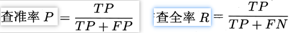
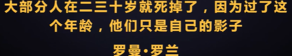

# Machine Learning Notes

公式解析：

https://github.com/datawhalechina/pumpkin-book

earn the respect from the person you repsect, not the envy from the person you envy.

## Concepts

### PMML

PMML全称**预言模型标记模型（Predictive Model Markup Language）**，以XML 为载体呈现数据挖掘模型。PMML 允许您在不同的应用程序之间轻松共享预测分析模型。因此，您可以在一个系统中定型一个模型，在 PMML 中对其进行表达，然后将其移动到另一个系统中，而不需考虑分析和预测过程中的具体实现细节。使得模型的部署摆脱了模型开发和产品整合的束缚。

PMML 标准是数据挖掘过程的一个实例化标准，它按照数据挖掘任务执行过程，有序的定义了数据挖掘不同阶段的相关信息

- 头信息（Header）
- 数据字典（DataDictionary）
- 挖掘模式(Mining Schema)
- 数据转换（Transformations）
- 模型定义 (Model Definition)
- 评分结果 (Score Result)

pmml 的用途和使用案例：https://zhuanlan.zhihu.com/p/73245462

### pkl

对pkl文件的理解为：

　　1）python中有一种存储方式，可以存储为.pkl文件。

　　2）该存储方式，可以将python项目过程中用到的一些暂时变量、或者需要提取、暂存的字符串、列表、字典等数据保存起来。

　　3）保存方式就是保存到创建的.pkl文件里面。

　　4）然后需要使用的时候再 open，load。

### **联邦学习**

https://zhuanlan.zhihu.com/p/100688371

# 西瓜书读书笔记

## C1-绪论

机器学习，是关于在计算机上从数据产生模型的算法，即学习算法。产生模型后，通过数据输入，得到相应的结果。

### 基本术语

#### 数据集 DATASET

这就是一个数据集，其中每一个描述都可以称为一个样本**sample、示例**

其中反映某方面属性的————**特征 feature**

属性上的取值————属性值

属性构成的空间：**属性空间、样本空间、输入空间**

如把色泽、根蒂、敲声作为三个坐标轴，则可以勾陈一个描述西瓜的三维空间，每一个西瓜都可以在空间中定位到。

空间中每一个点对应一个坐标向量，因此把每一个示例/样本，称为一个 特征向量

数据到模型过程叫训练、学习，训练数据**training** data，每个样本称为一个训练样本training sample

学习得到的模型是一种规律假设，规律本身则是真实

如果需要训练一个判断瓜是否熟的模型，训练样本还需要结果信息，如

这里的结果称为 **标记 label**

- 分类Classification：预测的是离散值，如好瓜、坏瓜
  - 二分类：正类反类。
  - 多分类

- 回归Regression：预测连续值，如瓜的成熟度

测试testing：学习到模型后，需要多模型进行测试

测试样本test sample：用于测试的样本

- 聚类clustering：将训练集分为多个组，每个组称为一个簇cluster

根据训练数据是否拥有标记，学习任务可以分为两类：

- **监督学习：suppervised learning，需要标记，如分类和回归**
- **无监督学习：unsupervised learning，不需要标记，如聚类**

泛化能力：在非训练集上表现出来的模型预测能力

训练样本在样本空间往往占比非常小，假设样本空间服从一个未知分布，每个样本都应该从空间中独立采集————**独立同分布independent and identically distriibuted**

### 假设空间

- **归纳induction：从一般到泛化**

- **演绎deduction：从一般到特殊化**

从样例中学习，是一个归纳过程，也称为归纳学习，这是广义的归纳学习。狭义的归纳学习则是从训练数据中学习概念，因此成为概念学习。

布尔概念学习

假设空间：可以假设的各种情况的集合？

把和训练集一致的假设集合称为 版本空间

### 归纳偏好

通过学习得到的模型对应假设空间中一个假设，那么那种模型更好呢？该选择哪一种模型。

这就需要归纳偏好，即以那种标准来选择模型

根据奥卡姆剃刀Occam's Razor，如果有U盾讴歌假设和观察一致，那么选择最简单的那个。如无必要勿增实体

### 发展历程

ML 是 AI 发展到一定阶段的产物

## C2-模型评估与选择

### 经验误差和过拟合

错误率error： 分类错误的样本数赞总样本数量的比例

精度accuracy：和错误率相反，正确/总

误差：实际的输出和真实的之间的误差

学习器在训练集上的误差称为 **训练误差**/**经验误差**，**在新样本上的误差称为泛化误差**

我们的目标是是泛化误差更小，即模型更在其他数据上也有很好的性能

当学习器学过头了，把训练数据自身的特点当成是所有数据都具有的特点时，就会出现**过拟合overfitting**，**过拟合相对于欠拟合underfitting**

学习能力过强可能导致过拟合

NP问题：非P问题

P类问题：在多项式时间复杂度下可以解决的问题。有效的算法必须在多项式时间内运行完毕。

### 模型评估方法

通常使用测试集来对模型进行测试，**使用测试误差粗略代表泛化误差**。

测试样本应该和训练样本互斥

**留出法**：hold-out，直接把数据集划分为两个互斥的集合（注意要保证数据分布的一致性，2/3~4/5的数据用于训练）

**交叉验证法**：

**自助法**：

前两者用的更多

调参：parameter tuning

训练数据分为 **训练集和验证集**，验证集用于调参

### 性能度量

performance measure

衡量模型泛化能力的评价标准

常用性能度量指标：

#### 错误率和精度

错误率：

精度：

#### 查准率、查全率、F1

PR图可以表现P与R的大概关系

如果一个PR线完全包住另一个，则其性能更好，如A>C，否则无法判断，AB两个无法判断。不过可以通过曲线的形成的面积估计。不过面积不好算，还有其他指标：

- 平衡点break event point BEP：P = R的取值， A > B 

BEP过于简化了，更多使用F1度量：

在N个混淆矩阵上计算查准率和查全率

#### ROC AUC

用一个阈值区分正类、反类，通过阈值的设置，来决定查准率和查全率谁重要

#### 代价敏感错误率 和 代价曲线

现实生活中，不同类型的错误造成的代价是不同的。

### 比较检验

不同的模型性能比较是比较麻烦的。

统计假设检验 hypothesis test是一种方式

#### 假设检验

todo

#### 交叉验证t检验

#### McNemar检验

### 偏差与方差

偏差-方法分解bias-variance decomposition是解释学习算法泛化性能的重要工具

泛化误差 = 偏差 + 方差 + 噪声

- 偏差：期望预测和真实结果的偏离程度，即刻画学习算法本身的拟合能力
- 方差：度量同样大小的训练集的变动所导致的学习性能的变化
- 噪声：误差下界，即学习问题本身的难度

## C3-线性模型

### 基本形式

### 线性回归

### 对数几率回归

看不太懂

#### 线性判别分析

Linear Discriminant Analysis **LDA**

是一种经典的线性学习方法

### 多分类学习

## C4-决策树

### 基本流程

decision tree

基于树形的方式来分类

### 划分选择

关键在第8行：如何选择划分，是节点的 **纯度** 越来越高

#### 信息增益

著名的ID3决策树算法就是以 信息增益 为准则划分属性的

#### 增益率

### 剪枝处理

pruning

处理过拟合情况：分支过多

- 预剪枝：生成过程中剪枝
- 后剪枝：在完整的决策树上进行剪枝

### 多变量决策树

决策树著名算法：

- ID3
- C4.5
- CART

## C5-神经网络

# 视频学习01

https://www.bilibili.com/video/BV1wx411o7CK?p=2&spm_id_from=pageDriver

## 绪论

## 模型评估与选择

二分类，产生四种数据类型：

trade off权衡折中

## 线性模型

## 决策树

