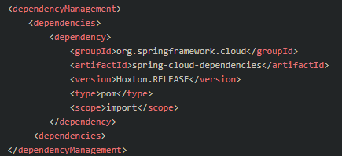

# Maven Notes

## Maven Basic

### 功能与特性

- **项目构建**
- **依赖管理**
- 测试驱动开发TDD
- 项目模块化管理
- 项目骨架创建
- 约定由于配置

### 基本架构设计

maven对构建(build)的过程进行了抽象和定义，这个过程被称为构建的生命周期(lifecycle)。生命周期(lifecycle)由多个阶段(phase)组成,每个阶段(phase)会挂接一到多个goal。goal是maven里定义任务的最小单元，goal分为两类，一类是绑定phase的，就是执行到某个phase，那么这个goal就会触发，另外一类不绑定，就是单独任务

Maven预设了三个Lifecycle ，各包含了下列Phases.

1. 1. Clean Lifecycle
      - pre-clean
      - clean
      - post-clean
   2. Default Lifecycle
      - validate
      - initialize
      - generate-sources
      - process-sources
      - generate-resources
      - process-resources
      - compile
      - process-classes
      - generate-test-sources
      - process-test-sources
      - process-test-resources
      - test-compile
      - process-test-classes
      - test
      - prepare-package
      - package
      - pre-integration-test
      - integration-test
      - post-integration-test
      - verify
      - install
      - deploy
   3. Site Lifecycle
      - pre-site
      - site
      - post-site
      - site-deploy


### maven仓库

- 本地仓库
- 远程仓库
  - 私服，自建Nexus：http://nexus.corp.qunar.com/
  - 中央仓库
  - 中央仓库镜像

### 定位

- groupid: 公司组织域名倒序 + 项目名
- artifact: 模块名

### POM

project of maven

- properties: 属性

- dependencyManagement：依赖管理，主要是版本管理，只是定义，不会有实际的引入。被动依赖上，约束被动依赖的属性，比如 A包隐式依赖B，我们只能引入A不能控制B，使用本标签可以管理被动依赖的属性。

- profile：针对不同的环境提供不同的配置文件，比如有环境local、dev、beta、prod

  ```xml
  <profiles>
      <profile>
          <id>dev_evn</id>
          <properties>
              <db.driver>com.mysql.jdbc.Driver</db.driver>
              <db.url>jdbc:mysql://localhost:3306/test</db.url>
              <db.username>root</db.username>
              <db.password>root</db.password>
          </properties>
      </profile>
      <profile>
          <id>test_evn</id>
          <properties>
              <db.driver>com.mysql.jdbc.Driver</db.driver>
              <db.url>jdbc:mysql://localhost:3306/test_db</db.url>
              <db.username>root</db.username>
              <db.password>root</db.password>
          </properties>
      </profile>
  </profiles>
  ```

  开发时可以用 mvn 命令后面添加“-P dev_evn”激活“dev_evn profile”

  用户可以在 mvn 命令行中添加参数“-P”，指定要激活的 profile 的 id。如果一次要激活多个 profile，可以用逗号分开一起激活。例如：

  > mvn clean install -Pdev_env,test_evn


### **scope**

约定优于配置：Convention Over Configuration

scope指定了依赖的作用范围

- 作用范围包括，所在项目的**测试、编译、运行、打包等**生命周期
- 其中，编译和运行还分为
  - **测试代码**的编译和运行
  - **非测试代码**的编译和运行


- compile
  默认的scope，表示 dependency 参与当前项目的**编译、测试、运行、打包**。而且，这些dependencies 会传递到依赖的项目中。适用于所有阶段，会随着项目一起发布
  
- provided
  provided 表明该**依赖已经提供，故只在未提供时才被使用这个scope** ，只能作用在编译和测试时，运行的时候使用已经提供的依赖而不使用导入的依赖，同时没有传递性。
  
- test

  **针对测试相关代码的编译和运行**，在**通常代码**的编译和运行时都不需要，只有在**有关测试的代码编译和运行测试代码阶段**可用

- runtime 

  依赖**无需参与当前项目的编译**，但是后期的**运行和测试**需要参与。 如MySQL驱动

- system

  被依赖项**不会从maven仓库下载**，而是**从本地系统指定路径下寻找**，需要 systemPath 属性
  
- import
  
  我们知道Maven的继承和Java的继承一样，是无法实现多继承的，这个父模块的dependencyManagement可能会包含大量的依赖。如果你想把这些依赖分类以更清晰的管理，那就不可能了，import scope依赖能解决这个问题。你可以把dependencyManagement放到单独的专门用来管理依赖的pom中，然后在需要使用依赖的模块中通过import scope依赖，就可以引入dependencyManagement。
  
  例如，在Spring boot 项目的POM文件中，我们可以通过在POM文件中继承 Spring-boot-starter-parent来引用Srping boot默认依赖的jar包
  
  但是，**通过上面的parent继承的方法，只能继承一个 spring-boot-start-parent。实际开发中，用户很可能需要继承多个parent配置，这个时候可以使用 scope=import 来实现多继承**。
  
  
  
  注意：**import scope只能用在dependencyManagement里面**，且仅用于type=pom的dependency
  
  这样就可以导入spring-boot-dependencies-Hoxton.RELEASE.pom文件中dependencyManagement配置的jar包依赖。


Scope的依赖传递：

A–>B–>C。当前项目为A，A依赖于B，B依赖于C。知道B在A项目中的scope，那么怎么知道C在A中的scope呢？

  答案是：

  **当C是test或者provided时，C直接被丢弃**，A不依赖C； 否则A依赖C，C的scope继承于B的scope。

### packaging

打包方式：war, jar

还有一种：pom， 表示父子工程，父模块必须使用pom类型

**<packaging>pom</packaging>**


### 版本号

> 主版本.次版本.增量版本-里程碑版本
>
> 主版本表示一个大的更新，次版本是一个小一点的更新，比如一个feature，增量版本是一个小版本。

- PRE：灰度版本(Qunar规范)
- SNAPSHOT：不确定版本，用于开发调试，底层通过时间戳确定版本，引入时选择最新的时间戳
- RELEASE或者不带后缀：正式版本，发布版本


### 生命周期

- clean：preclean--clean-- post-clean
- default: ...--compile--test-package-install--package
- site

### Maven插件

如maven-dependency-plugin

使用 ```mvn dependency:tree/list/analyze```是插件执行的，而不是maven本身

### 依赖冲突

> A - B - C1.0
>
> D - C2.0

怎么仲裁？

- dependencyManagement如果声明了，选择指定版本即可
- 短路径有限：选短的
- 先声明者优先

不推荐使用exclusion排除，因为很可能导致错误


引入多个不同版本的统一依赖，不会报错，遇到谁就是谁，双亲委派模型

### 父子工程

父子各模块版本必须一直


### 如何写好pom

- 父pom只做版本管理
- 子pom不管理依赖版本
- 父pom统一指定版本
- 字模块相互依赖，使用\${project.version}$​​
- 使用properties统一管理、定义
- 直接依赖的包要显式引入，不要间接引入
- 避免使用exclusion，使用dependencyManagement
- 

### Wrapper

要使用maven那就必要要安装maven,如果有些用户不想安装maven怎么办？或者说用户不想全局安装maven,那么可以使用**项目级别的Maven Wrapper**来实现这个功能。

如果大家使用IntelliJ IDEA来开发Spring boot项目, 如果选择从Spring Initializr来创建项目，则会在项目中自动应用Maven Wrapper。简单点说就是在项目目录下面会多出两个文件： **mvnw 和 mvnw.cmd**。


#### Maven Wrapper的结构

mvnw是Linux系统的启动文件。

mvnw.cmd是windows系统的启动文件。

本文不会详细讲解启动文件的内部信息，有兴趣的小伙伴可以自行去研究。除了这两个启动文件，在项目中还会生成一个.mvn的隐藏文件夹


如果不是使用IntelliJ IDEA，我们该怎么样下载Maven Wrapper呢？

在程序的主目录下面：

```shell
mvn -N io.takari:maven:wrapper
```

如果要指定maven版本：

```shell
mvn -N io.takari:maven:wrapper -Dmaven=3.5.2
```

-N 意思是 –non-recursive，只会在主目录下载一次。


Maven Wrapper的使用和maven命令是一样的，比如：

```shell
./mvnw clean install
./mvnw spring-boot:run
```


## Nexus

Nexus是Maven仓库管理器，如果你使用Maven。

你可以从[Maven中央仓库](https://link.zhihu.com/?target=http%3A//repo1.maven.org/maven2/) 下载所需要的构件（artifact），但这通常不是一个好的做法，你应该在本地架设一个Maven仓库服务器，在代理远程仓库的同时维护本地仓库，以节省带宽和时间，Nexus就可以满足这样的需要。此外，他还提供了强大的仓库管理功能，构件搜索功能，它基于REST，友好的UI是一个extjs的REST客户端，它占用较少的内存，基于简单文件系统而非数据库。这些优点使其日趋成为最流行的Maven仓库管理器


## Tail


