# MySQL Notes

## SQL

SQL语言共分为四大类：数据查询语言**DQL**，数据操纵语言**DML**，数据定义语言**DDL**，数据控制语言**DCL**。

### DQL

select

### DML

**数据操纵语言**（Data Manipulation Language, DML）

insert

update: update tb set a =b

delete： delete from table where

### DDL

Data Definition Language 数据定义语言

- create 
- drop
- truncate: 清空数据，保存结构，比delete from性能高
- rename: rename table a to b
- alter
  - add: alter table a add column city varchar
  - modify/change: 
  - drop

### DCL

控制语言

DBA的职责

1) GRANT：授权。
2) ROLLBACK [WORK] TO [SAVEPOINT]：回退到某一点。回滚---ROLLBACK回滚命令使数据库状态回到上次最后提交的状态。其格式为：SQL>ROLLBACK;


### 显示建表语句

>  show create table book\G

```sql
show create table book\G
***************************[ 1. row ]***************************
Table        | book
Create Table | CREATE TABLE `book` (
  `id` int(11) NOT NULL AUTO_INCREMENT,
  `book_id` int(11) NOT NULL,
  `book_name` varchar(128) COLLATE utf8_bin NOT NULL,
  `pages` int(11) NOT NULL,
  `price` int(11) NOT NULL DEFAULT '0',
  `press` varchar(256) COLLATE utf8_bin NOT NULL DEFAULT '',
  PRIMARY KEY (`id`),
  UNIQUE KEY `book_id_UNIQUE` (`book_id`),
  KEY `book_index` (`book_id`)
) ENGINE=InnoDB AUTO_INCREMENT=4 DEFAULT CHARSET=utf8 COLLATE=utf8_bin
```

### delete vs. truncate

delete

### upsert

- upsert(update or insert), 即更新或写入。
- MySQL中实现upsert操作方式：
  思路：通过判断插入的记录里是否存在主键索引或唯一索引冲突，来决定是插入还是更新。当出现主键索引或唯一索引冲突时则进行update操作，否则进行insert操作。
  实现：使用 ON DUPLICATE KEY UPDATE

```sql
insert into demo(a,b,c,d,e,f) values(1,1,1,2,2,2) ON DUPLICATE KEY UPDATE a=2,b=2,c=3,d=4,e=5,f=6;
-- 因为已经存在由abc三列组成唯一索引数据：1，1，1，本次又写入demo(a,b,c,d,e,f) values(1,1,1,2,2,2)，会造成唯一索引冲突。因此，会触发ON DUPLICATE KEY 后面的 UPDATE a=2,b=2,c=3,d=4,e=5,f=6操作。
```


## 主键 外键


### 外键

> 以前对外键的理解有误，外键是一种约束，需要通过语句添加

由于一个班级可以有多个学生，在关系模型中，这两个表的关系可以称为“一对多”，即一个`classes`的记录可以对应多个`students`表的记录。

为了表达这种一对多的关系，我们需要在`students`表中加入一列`class_id`，让它的值与`classes`表的某条记录相对应：

这样，我们就可以根据`class_id`这个列直接定位出一个`students`表的记录应该对应到`classes`的哪条记录。

在`students`表中，通过`class_id`的字段，可以把数据与另一张表关联起来，这种列称为`外键`。


**外键并不是通过列名实现的，而是通过定义外键约束实现的**：

```sql
ALTER TABLE students
ADD CONSTRAINT fk_class_id
FOREIGN KEY (class_id)
REFERENCES classes (id);
```

其中，外键约束的名称`fk_class_id`可以任意，`FOREIGN KEY (class_id)`指定了`class_id`作为外键，`REFERENCES classes (id)`指定了这个外键将关联到`classes`表的`id`列（即`classes`表的主键）。

**通过定义外键约束，关系数据库可以保证无法插入无效的数据。即如果`classes`表不存在`id=99`的记录，`students`表就无法插入`class_id=99`的记录。**

由于外键约束会降低数据库的性能，大部分互联网应用程序为了追求速度，并不设置外键约束，而是仅靠应用程序自身来保证逻辑的正确性。这种情况下，`class_id`仅仅是一个普通的列，只是它起到了外键的作用而已。

要删除一个外键约束，也是通过`ALTER TABLE`实现的：

```sql
ALTER TABLE students
DROP FOREIGN KEY fk_class_id;

# 注意：删除外键约束并没有删除外键这一列。删除列是通过DROP COLUMN ...实现的。
```

## 索引

- 主键索引(聚簇索引)
- 唯一索引 非唯一索引
- 单列索引  组合索引
- 全文索引

### 索引选择性

索引的选择性，指的是不重复的索引值（基数）和表记录数的比值。选择性是索引筛选能力的一个指标。索引的取值范围是 0—1 ，当选择性越大，索引价值也就越大。

举例说明：假如有一张表格，总共有一万行的记录，其中有一个性别列sex，这个列的包含选项就两个：男/女。那么，这个时候，这一列创建索引的话，索引的选择性为万分之二，这时候，在性别这一列创建索引是没有啥意义的。假设个极端情况，列内的数据都是女，那么索引的选择性为万分之一，其效率还不如直接进行全表扫描。如果是主键索引的话，那么选择性为1，索引价值比较大。可以直接根据索引定位到数据。

索引选择性 = 基数 / 总行数 

　　举例：有个学校表 school ,学校名称 school_nick 的索引选择性为： 

```SELECT COUNT(DISTINCT(school_nick))/COUNT(id) AS Selectivity FROM school; ```

### 覆盖索引

覆盖索引是select的数据列只用从索引中就能够取得，不必读取数据行，换句话说查询列要被所建的索引覆盖。


覆盖索引必须要存储索引列的值，而哈希索引、空间索引和全文索引不存储索引列的值，所以mysql只能用B-tree索引做覆盖索引。


### 索引原理

B+Tree


### 索引类型

- 聚簇索引
- 非聚簇索引/辅助索引， 二级索引---**回表**


- 单列索引

  

- 联合索引

  

- 覆盖索引

- 

### 索引失效


注意： 

- join字段/字符集不一致
- 扫描全表20%（非确定值）
- 聚合函数
- like

### 不同数据类型的索引性能差别

索引的性能好坏，主要是由建立索引字段的数据的分散程度决定，与字段类型无关。如果是完全相同的数据内容，int理论上性能略好，但是实际差异不可能体现出来。

？？？

这是错的吧，int索引应该在性能上好


## 事务

### 事务实践

```sql
# 查看事务自动提交设置
mysql> show variables like 'autocommit' \G
*************************** 1. row ***************************
Variable_name: autocommit
        Value: ON
        
# 关闭
set autocommit=off

# 手动提交

        
```


## 数据类型

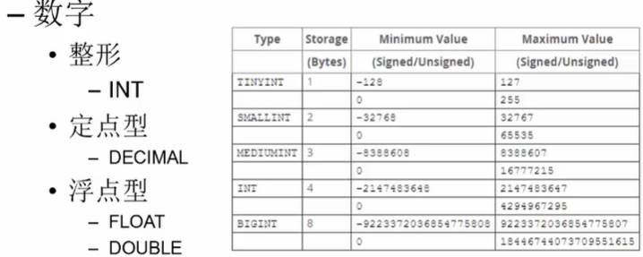

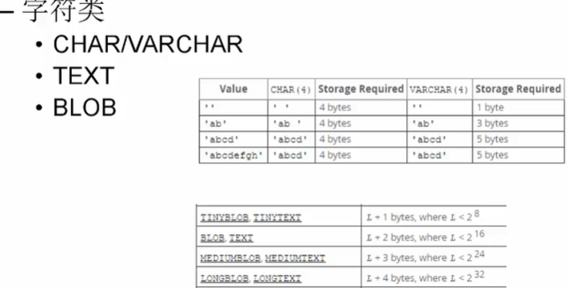


### char

如何存储的？


### varchar

当长度<=255时，使用一个字节来记录长度，超过255后使用两个字节来记录


如何存储的？


char vs varchar


### Text

长字符串

以字节为单位，注意 和varchar/char不同的。

- `TEXT`：65,535 bytes，64kb；
- `MEDIUMTEXT`：16,777,215bytes，16Mb；
- `LONGTEXT`：4,294,967,295 bytes，4Gb；

#### VARCHAR和TEXT

- VARCHAR中的VAR表示您可以将最大大小设置为1到65,535之间的任何值。 TEXT字段的最大固定大小为65,535个字符。
- VARCHAR可以是索引的一部分，而TEXT字段要求您指定前缀长度，该长度可以是索引的一部分。
- VARCHAR与表内联存储（至少对于MyISAM存储引擎而言），因此在大小合理时可能会更快。当然，快得多少取决于您的数据和硬件。同时，**TEXT存储在表外，该表具有指向实际存储位置的指针。**
- 排序使用TEXT列将需要使用基于磁盘的临时表作为MEMORY（HEAP）存储引擎。


### Blob

二进制

可以存储文件等


### 字符字节

不同的编码下，每个字符最多占多少字节

#### uft8

占2个字节的：带有附加符号的拉丁文、希腊文、西里尔字母、亚美尼亚语、希伯来文、阿拉伯文、叙利亚文及它拿字母则需要二个字节编码

占3个字节的：基本等同于GBK，含21000多个汉字

最多三字节？？？

#### utf8mb4 

是utf-8的超集，一个字符最多4字节


### 时间日期

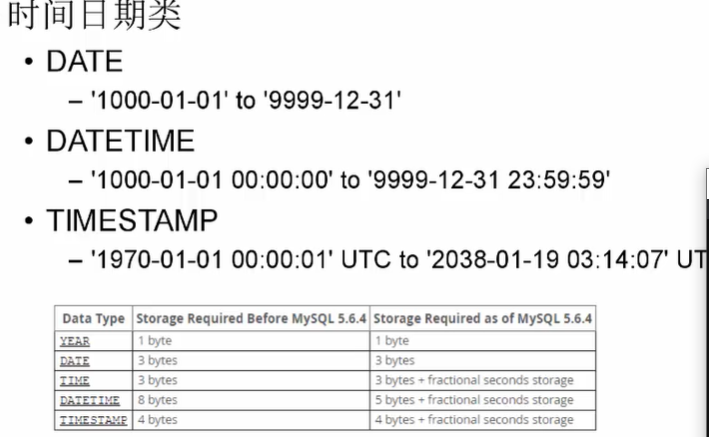

#### DATETIME VS. TIMESTAMP

- 区别1：存储方式不一样

  **对于TIMESTAMP，它把客户端插入的时间从当前时区转化为UTC（世界标准时间）进行存储。查询时，将其又转化为客户端当前时区进行返回。**

  **而对于DATETIME，不做任何改变，基本上是原样输入和输出。**

  

  所以说DATETIME数据，插入和获取不会有任何区别。

  但是对于TIMESTAMP，如果插入后更改了时区，那么select后将会转化为当前时区，和原来insert的时间有差别，差别就是两个时区的时差。

- 区别2：存储的时间范围不一样

  timestamp所能存储的时间范围为：'1970-01-01 00:00:01.000000' 到 '2038-01-19 03:14:07.999999'。 **2038年，快了**

  datetime所能存储的时间范围为：'1000-01-01 00:00:00.000000' 到 '9999-12-31 23:59:59.999999'。

- 区别3： 存储大小不同

  TIMESTAMP只需要4字节，而DATETIME需要8字节
  
  


### 编码

在mysql中存在着各种utf8编码格式，如下(**新建数据库时一般选用utf8_general_ci就可以**)：
utf8_bin:将字符串中的**每一个字符用二进制数据存储**，区分大小写(在二进制中 ,小写字母 和大写字母 不相等.即 a !=A)。
**utf8_genera_ci:不区分大小写，ci为case insensitive的缩写**（insensitive ; 中文解释: adj. 感觉迟钝的，对…没有感觉的），即大小写不敏感。
utf8_general_cs:区分大小写，cs为case sensitive的缩写（sensitive 中文解释:敏感事件;大小写敏感;注重大小写;全字拼写须符合），即大小写敏感
utf8_unicode_ci:不能完全支持组合的记号。


## 相关配置

### auto commit

的数据库连接池，设置的autoCommit = true然后在一个方法上，我又加了@Transactional注解，Spring执行到一个方法，扫描到@Transactional注解后，会自动执行Spring事务管理器，事务管理器会把当前获得的数据库连接对象conn的autoCommit给设置成false.那么问题来了：当执行完这个方法后，Spring还会把这个数据库连接对象设置回autoCommit = true吗？

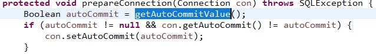


添加@transactional注解，autoCommit仍然为true

首先加了这个注解之后，会对你的SQL进行拦截，并开启事务（begin或者start transaction），一旦开启事务，无论autocommit是0还是1，都必须使用commit才能提交，rollback才能回滚。这时候一旦发生异常，并会执行rollback,否则执行commit


## 存储引擎

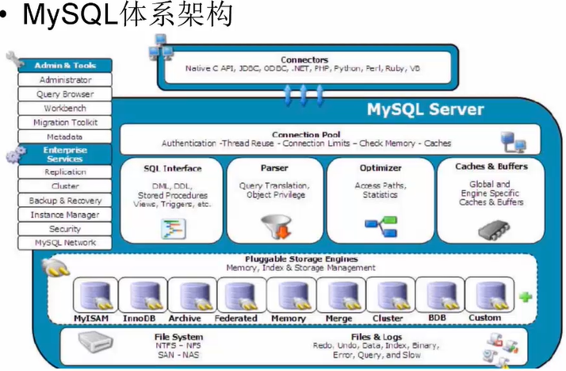

MySQL是**单进程多线程**模式


```sql
show engines
```

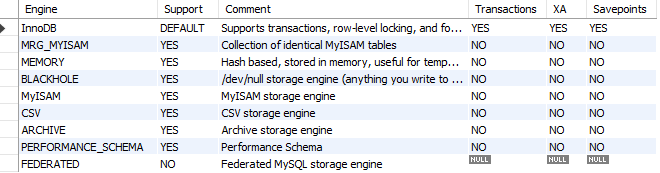

### InnoDB


### MyISAM


## 权限管理


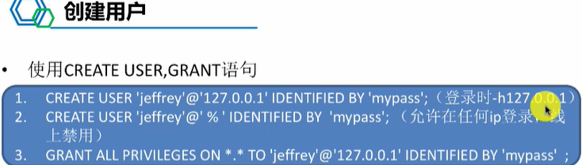

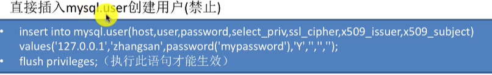


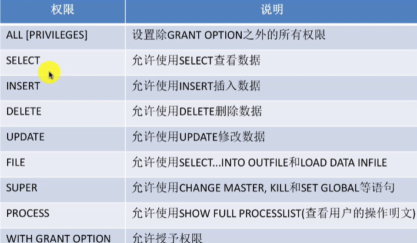

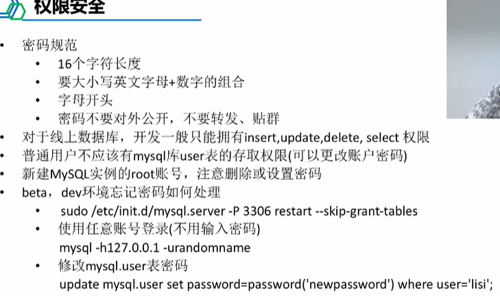


## 系统命令

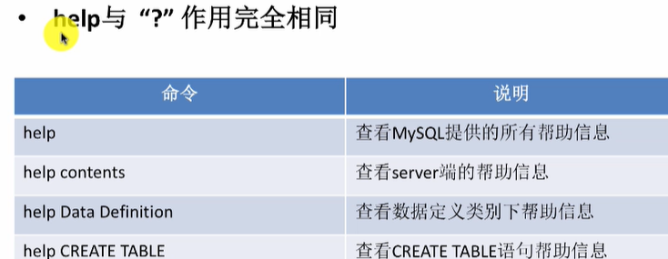

\G :按列显示


```sql
# 查看表
show tables like '%s%'
# 查看表定义
show create table tb
# 查看数据库定义
show create database db
# 查看表数据、索引所占空间、平均行长、行数等
show table status like 'xxx'\G
# 查看索引
show index from tb\G

# 查看列信息
show columns from tb

```


#### set

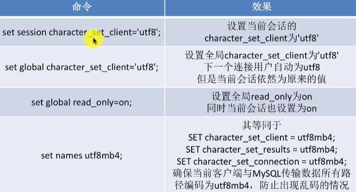


## 高可用

### Master-Slave

 

异步复制出现了

### Binlog   & Relay Log


提交顺序


GTID

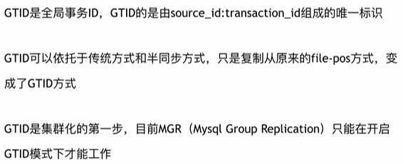


### 3M架构

MMM

**Master-Master Replication** for mysql

MySQL主主复制管理器

**是一套双主 故障切换 和 双主日常管理 的脚本程序**

MMM使用Perl开发，主要用来管理MySQL master-master双主复制。(虽然叫双主，但是业务上同一时刻只允许一个Master进行写入，另一台备选主提供部分读服务，以加速在主主切换是备选主的预热)


应用场景：

MMM提供了自动和手动两种方式移除一组服务器中复制延迟较高的服务器的虚拟ip，同时它还可以备份数据，实现两节点之间的数据同步等。由于MMM无法完全保证数据的一致性，所以MMM适用于对数据的一致性要求不是很高的，但是又想最大程度地保证业务可用性的场景。对于那些对数据的一致性要求很高的业务，非常不建议采用MMM这种高可用架构。

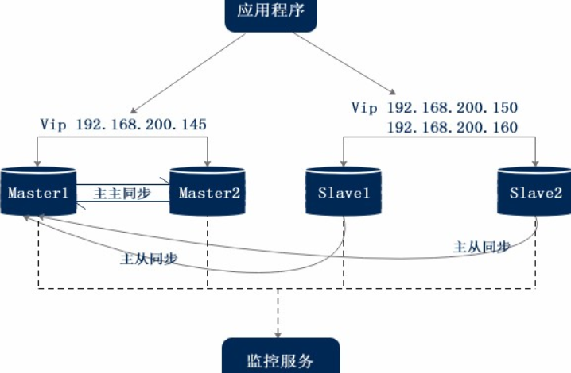


mysql-mmm的组成以及原理

三个脚本：
mmm_mond:
 监控进程，负责所有的监控工作，决定和处理所有节点角色活动。此脚本需要在监管机上运行。
mmm_agentd:
 运行在每个mysql服务器上的代理进程，完成监控的探针工作，执行简单的远端服务设置，此脚本需要在被监管机器上运行。
mmm_control:
 提供管理mmm_mond进程的命令。


### 3M,QMHA,PXC架构的mysql

TODO 

## 高阶知识

### 慢查询

慢查询就是执行很慢的查询

有多慢？超过 long_query_time 参数设定的时间阈值 就认为是慢的

慢查询认为是需要优化的，被记录在慢查询日志中。

然而，慢查询日志默认是不开启的，也就是说一般人没玩过这功能。如果你需要优化SQL语句，就可以开启这个功能，它可以让你很容易地知道哪些语句是需要优化的

开启慢查询：set global slow_query_log = 1;

slow_query_log：是否开启慢查询

slow_query_log_file：指定慢查询日志地址（默认和数据文件放一起）

long_query_time：慢查询阈值

log_queries_not_using_indexes：是否记录不使用索引的SQL

log_output ：日志存放的地方

慢查询工具：

- mysqldumpslow
- pt_query_digest

### binlog 

#### binlog概述

binary log

**二进制日志事件**，binary log events，可以通过 **show binlog events** 查看

binlog是二进制日志文件，用于记录mysql的数据更新或者潜在更新(比如DELETE语句执行删除而实际并没有符合条件的数据)，在mysql主从复制中就是依靠的binlog。

binlog两个作用：

- 主从复制
- 数据恢复：mysql binlog工具用于恢复数据


#### 两类文件

二进制日志包括两类文件：

- **二进制日志索引文件（文件名后缀为.index）**用于记录所有的二进制文件
- **二进制日志文件（文件名后缀为.00000*）**记录数据库所有的**DDL和DML(除了数据查询语句)语句事件**。

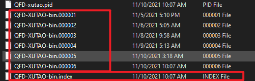

index索引文件只是单纯地记录所有binlog文件，仅是普通text文件

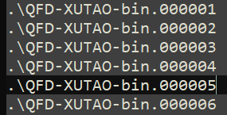


#### 实践

查看binlog是否开启

```sql
show variables like 'log_%'
+----------------------------------------+---
| Variable_name                          | Value                    
+----------------------------------------+---
| log_bin                                | ON                         
| log_bin_basename                       | C:\ProgramData\MySQL\MySQL Server 8.0\Data\QFD-XUTAO-bin       
| log_bin_index                          | C:\ProgramData\MySQL\MySQL Server 8.0\Data\QFD-XUTAO-bin.index 
| log_bin_trust_function_creators        | OFF                       
| log_bin_use_v1_row_events              | OFF
```

查看binlog格式： 5.7.7及之后，binlog的默认格式是Row

```sql
mysql> show variables like 'binlog_format' \G
*************************** 1. row ***************************
Variable_name: binlog_format
        Value: ROW
        
# 查看MySQL版本
mysql> select version();
+-----------+
| version() |
+-----------+
| 8.0.27    |
+-----------+
```


查看binlog内容：

```sql
-- 查看第一个binlog
mysql> show binlog events\G;
*************************** 1. row ***************************
   Log_name: QFD-XUTAO-bin.000001
        Pos: 4
 Event_type: Format_desc
  Server_id: 1
End_log_pos: 125
       Info: Server ver: 8.0.27, Binlog ver: 4
*************************** 2. row ***************************
   Log_name: QFD-XUTAO-bin.000001
        Pos: 125
 Event_type: Previous_gtids
  Server_id: 1
End_log_pos: 156
       Info:
*************************** 3. row ***************************
   Log_name: QFD-XUTAO-bin.000001
        Pos: 156
 Event_type: Stop
  Server_id: 1
End_log_pos: 179
       Info:

# 指定具体的binlog文件
mysql> show binlog events in 'QFD-XUTAO-bin.000005' \G;

# 从具体的POS开始
show binlog events in 'mysql-bin.000002' from 624 limit 10\G;

```


mysqlbinlog查看binlog

```shell
mysqlbinlog QFD-XUTAO-bin.000005
```


注意：根据上面的显示，pos是记录当前记录位置，是连续的、递增的，即使跨文件。

binlog似乎是不区分库、表的，整个server的操作都不区分地记录


binlog关注的是对数据库的修改操作，select等查询操作不会别记录binlog


#### MySQL主备复制原理

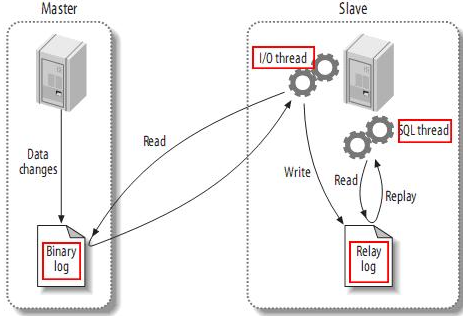

复制分为三步：

- master将改变记录到binary log(这些记录叫做**二进制日志事件**，binary log events，可以通过 **show binlog events** 查看)
- slave将master的binary log events拷贝到中继日志(relay log)中
- slave重做中继日志中的事件，将改变反应到它自己的数据

#### binlog三种格式

binlog有三种格式：Statement， MIXED, ROW

查看

```sh
show golbal variables like '%binlog_format%'
```

##### Statement

**每一条修改数据的SQL都会被记录到binlog中**

> 优点：不需要记录每一行的变化，减少binlog日志量，节约io提升性能

> 缺点：由于记录的知识执行的SQL，为了这些语句能在slave上正确运行，还需要保存很多其他相关的信息，以保证SQL在slave上执行也会得到正确的结果，比如current_timestamp这个就会有问题，需要另外记录。另外mysql 的复制,像一些特定函数功能，slave可与master上要保持一致会有很多相关问题(如sleep()函数， last_insert_id()，以及user-defined functions(udf)会出现问题).

##### ROW

不记录SQL语句上下文现骨干信息，只保存那条记录被修改

优点：**只记录变化**，所以会记录下每一行数据修改的细节，不会出现某些特定情况下的存储过程或function，以及trigger的调用和触发无法被正确复制的问题

缺点：可能会产生大量的日志内容，比如一条update修改多条记录，则会产生很多日志，再如alter table导致表结构变化，数据也会全部变化，每一条记录都会产生日志。

##### Mixed

是以上两种的混合使用

是以上两种level的混合使用，一般的语句修改使用statment格式保存binlog，如一些函数，statement无法完成主从复制的操作，则采用row格式保存binlog

在slave日志同步过程中，对于使用now这样的时间函数，MIXED日志格式，会在日志中产生对应的unix_timestamp()*1000的时间字符串，slave在完成同步时，取用的是sqlEvent发生的时间来保证数据的准确性。另外对于一些功能性函数slave能完成相应的数据同步，而对于上面指定的一些类似于UDF函数，导致Slave无法知晓的情况，则会采用ROW格式存储这些Binlog，以保证产生的Binlog可以供Slave完成数据同步。


binlog格式配置

BInlog日志格式可以通过mysql的**my.cnf**文件的属性**binlog_format**指定。

```mysql
binlog_format           = MIXED                 //binlog日志格式
log_bin                     =目录/mysql-bin.log    //binlog日志名
expire_logs_days     = 7                //binlog过期清理时间
max_binlog_size      100m                    //binlog每个日志文件大小
```

**在 MySQL 5.7.7之前，默认的格式是STATEMENT，MySQL 5.7.7之后，默认值是ROW。日志格式通过binlog-format指定。**

由于一些特殊使用，可以考虑使用ROWED，如自己通过binlog日志来同步数据的修改，这样会节省很多相关操作。对于binlog数据处理会变得非常轻松,相对mixed，解析也会很轻松(当然前提是增加的日志量所带来的IO开销在容忍的范围内即可)。 

#### binlog vs. redu/undo log

innodb引擎中的redo/undo log与mysql binlog是完全不同的日志，它们主要有以下几个区别：

- a）层次不同。**redo/undo log是innodb层维护的**，而**binlog是mysql server层维护的，跟采用何种引擎没有关系**，记录的是所有引擎的更新操作的日志记录。
- b）记录内容不同。**redo/undo日志记录的是每个页的修改情况，属于物理日志+逻辑日志结合的方式**（**redo log物理到页，页内采用逻辑日志，undo log采用的是逻辑日志**），**目的是保证数据的一致性**。**binlog记录的都是事务操作内容，比如一条语句`DELETE FROM TABLE WHERE i > 1`之类的，不管采用的是什么引擎**，当然**格式是二进制**的，要解析日志内容可以用这个命令`mysqlbinlog -vv BINLOG`。
- c）记录时机不同。redo/undo日志在事务执行过程中会不断的写入;binlog是在事务最终commit前写入的。当然，binlog什么时候刷新到磁盘跟参数`sync_binlog`相关。
- **redo/undo是事务日志，保证事务特性，binlog主要用于记录数据修改，用于主从备份。**

原子性底层就是通过undo log实现的。undo log主要记录了数据的逻辑变化，比如一条INSERT语句，对应一条DELETE的undo log，对于每个UPDATE语句，对应一条相反的UPDATE的undo log，这样在发生错误时，就能回滚到事务之前的数据状态。 undo log也是MVCC(多版本并发控制)实现的关键

#### binlog刷盘时机

对于InnoDB存储引擎而言，只有在事务提交时才会记录biglog，此时记录还在内存中，那么biglog是什么时候刷到磁盘中的呢？mysql通过sync_binlog参数控制biglog的刷盘时机，取值范围是0-N：

- 0：不去强制要求，由系统自行判断何时写入磁盘；
- 1：每次commit的时候都要将binlog写入磁盘；
- N：每N个事务，才会将binlog写入磁盘。

从上面可以看出，sync_binlog最安全的是设置是1，这也是MySQL 5.7.7之后版本的默认值。但是设置一个大一些的值可以提升数据库性能，因此实际情况下也可以将值适当调大，牺牲一定的一致性来获取更好的性能。

### Redo、undo log

https://www.cnblogs.com/better-farther-world2099/p/9290966.html

数据库通常借助日志来实现事务，常见的有undo log、redo log，undo/redo log都能保证事务特性，**undolog实现事务原子性，redolog实现事务的持久性**。

为了最大程度避免数据写入时io瓶颈带来的性能问题，MySQL采用了这样一种缓存机制：当query修改数据库内数据时，InnoDB先将该数据从磁盘读取到内存中，修改内存中的数据拷贝，并将该修改行为持久化到磁盘上的事务日志（先写redo log buffer，再定期批量写入），而不是每次都直接将修改过的数据记录到硬盘内，等事务日志持久化完成之后，内存中的脏数据可以慢慢刷回磁盘，称之为Write-Ahead Logging。事务日志采用的是追加写入，顺序io会带来更好的性能优势。

为了避免脏数据刷回磁盘过程中，掉电或系统故障带来的数据丢失问题，InnoDB采用事务日志（redo log）来解决

#### 相关概念

数据库数据存放的文件称为data file；

日志文件称为log file；

数据库数据是有缓存的，如果没有缓存，每次都写或者读物理disk，那性能就太低下了。数据库数据的缓存称为data buffer，日志（redo）缓存称为log buffer。

#### 内存缓冲区

buffer pool如果mysql不用内存缓冲池，每次读写数据时，都需要访问磁盘，必定会大大增加I/O请求，导致效率低下。所以Innodb引擎在读写数据时，把相应的数据和索引载入到内存中的缓冲池(buffer pool)中，一定程度的提高了数据读写的速度。

buffer pool：占最大块内存，用来存放各种数据的缓存包括有索引页、数据页、undo页、插入缓冲、自适应哈希索引、innodb存储的锁信息、数据字典信息等。工作方式总是将数据库文件按页(每页16k)读取到缓冲池，然后按最近最少使用(lru)的算法来保留在缓冲池中的缓存数据。如果数据库文件需要修改，总是首先修改在缓存池中的页(发生修改后即为脏页dirty page)，然后再按照一定的频率将缓冲池的脏页刷新到文件。

#### 表空间

 表空间可看做是InnoDB存储引擎逻辑结构的最高层。 表空间文件：InnoDB默认的表空间文件为ibdata1。 

- 段：表空间由各个段组成，常见的段有数据段、索引段、回滚段（undo log段）等。
- 区：由64个连续的页组成，每个页大小为16kb，即每个区大小为1MB。
- 页：每页16kb，且不能更改。常见的页类型有：数据页、Undo页、系统页、事务数据页、插入缓冲位图页、插入缓冲空闲列表页、未压缩的二进制大对象页、压缩的二进制大对象页。

为了满足事务的持久性，防止buffer pool数据丢失，innodb引入了redo log。为了满足事务的原子性，innodb引入了undo log。

#### undo log

Undo log 是为了实现事务的原子性。还用Undo Log来实现多版本并发控制(简称：MVCC)。

 通过undo log记录delete和update操作的结果发现：(insert操作无需分析，就是插入行而已) 

- delete操作实际上不会直接删除，而是将delete对象打上delete flag，标记为删除，最终的删除操作是purge线程完成的。
- update分为两种情况：update的列是否是主键列。
- 如果不是主键列，在undo log中直接反向记录是如何update的。即update是直接进行的。
- 如果是主键列，update分两部执行：先删除该行，再插入一行目标行。

Undo Log的原理很简单，为了满足事务的原子性，在操作任何数据之前，首先将数据备份到一个地方（这个存储数据备份的地方称为Undo Log）。然后进行数据的修改。如果出现了错误或者用户执行了ROLLBACK语句，系统可以利用Undo Log中的备份将数据恢复到事务开始之前的状态。

#### Redo Log

**redo log通常是物理日志，记录的是数据页的物理修改，而不是某一行或某几行修改成怎样怎样，它用来恢复提交后的物理数据页(恢复数据页，且只能恢复到最后一次提交的位置)。**

引入buffer pool会导致更新的数据不会实时持久化到磁盘，当系统崩溃时，虽然buffer pool中的数据丢失，数据没有持久化，但是系统可以根据Redo Log的内容，将所有数据恢复到最新的状态。redo log在磁盘上作为一个独立的文件存在。默认情况下会有两个文件，名称分别为 ib_logfile0和ib_logfile1。

参数innodb_log_file_size指定了redo log的大小；innodb_log_file_in_group指定了redo log的数量，默认为2; innodb_log_group_home_dir指定了redo log所在路径。

了满足事务的原子性，在操作任何数据之前，首先将数据备份到Undo Log，然后进行数据的修改。如果出现了错误或者用户执行了ROLLBACK语句，系统可以利用Undo Log中的备份将数据恢复到事务开始之前的状态。与redo log不同的是，磁盘上不存在单独的undo log文件，它存放在数据库内部的一个特殊段(segment)中，这称为undo段(undo segment)，undo段位于共享表空间内。

Innodb为每行记录都实现了三个隐藏字段：

- 6字节的事务ID（DB_TRX_ID）
- 7字节的回滚指针（DB_ROLL_PTR）
- 隐藏的ID


## 规范

### QUNAR规范

主键没有业务意义，是unsigned的

每个列必须有注释

使用utf8mb4


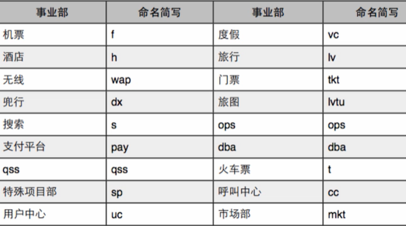


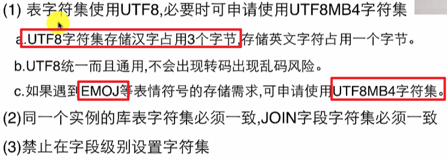

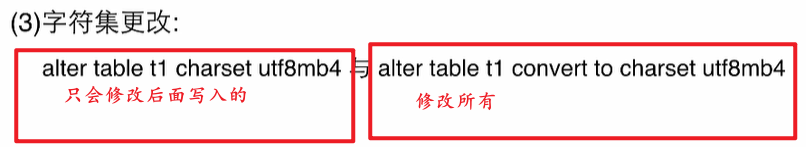

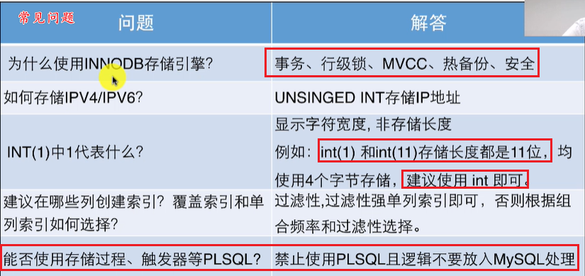


## 数据库设计

### 数据库表字段设计


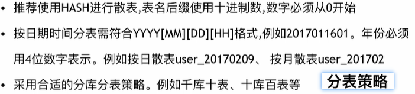


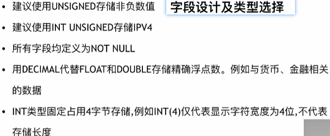


Timestamp是从1960年开始？datetime从1000


禁止：


### 范式

- 1NF：列的原子性
- 2NF：在1NF基础上，非码属性必须完全依赖于候选码（在1NF基础上消除非主属性对主码的部分函数依赖）
- 3NF：在2NF的基础上，任何的非主属性不依赖于其他非主属性 （在第二范式基础上消除传递依赖）

## SQL 优化

### explain执行计划

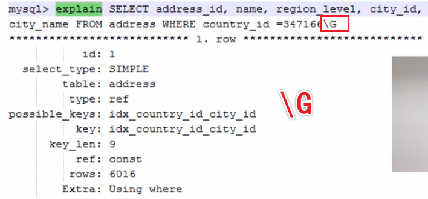

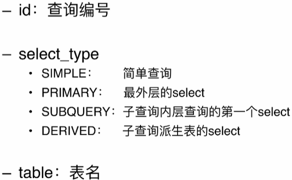

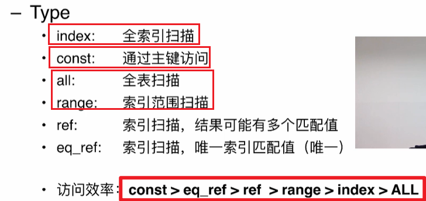


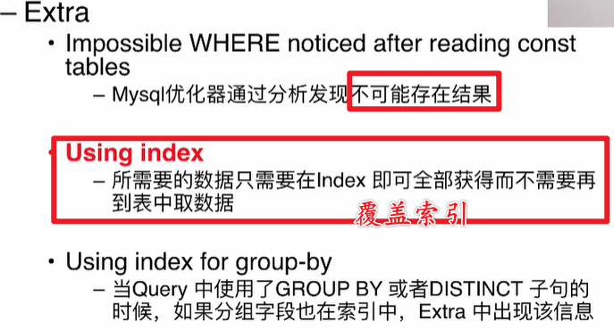

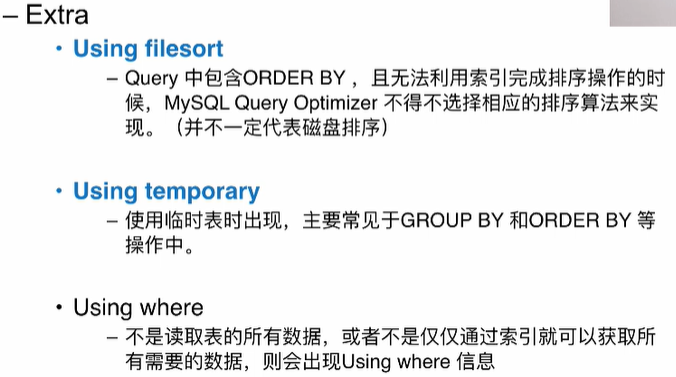


### 正确使用索引：


join两边都加

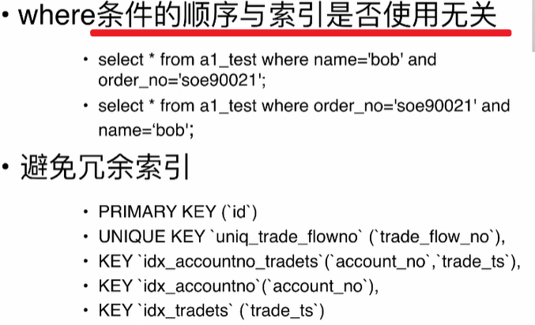


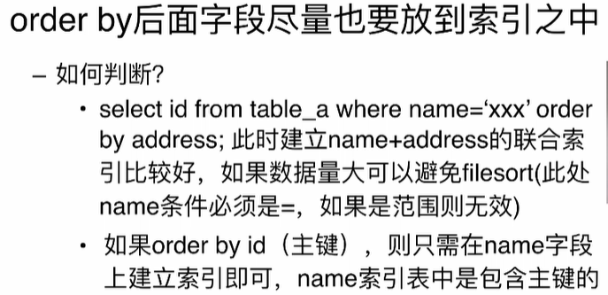

尽量利用覆盖索引


### 避免Bad SQL


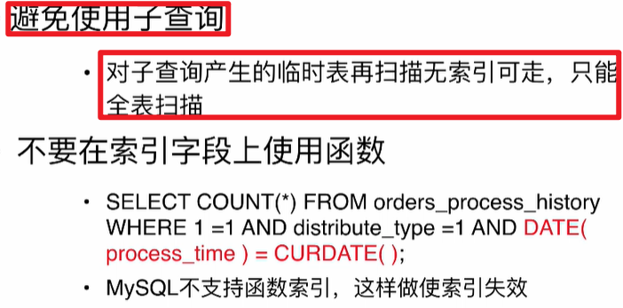

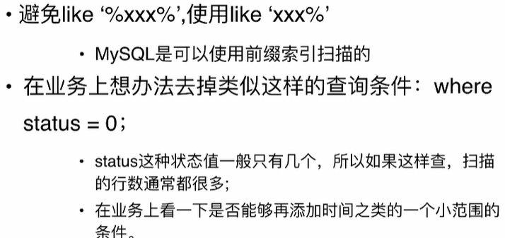


## 性能优化

- 参数优化
  - 内存相关
    - innode_buffer_pool_size
    - innode_log_buffer_size
    - sort_buffer_size
  - io相关
    - sync_binlog
- SQL优化
  - SQL优化
    - 选取最少的满足需求的数据
    - 执行之前explain查看执行计划，扫描行数尽可能少
    - 利用好索引
    - 避免出现索引失效：隐式转换，最左前缀，聚合函数，20%(MySQL不确定，非确值)
  - SQL改写
- 其他优化
  - in
    - 控制in后面只能接常量，长度一般不超过200
    - **in后面不能接子查询**
  - 不等于： not in ,  !=, <>
  - 前缀模糊查询
  - 尽可能使用count(*)： **count( *) 不同于列，有特殊机制**
  - limit


## 日常操作数据库要求

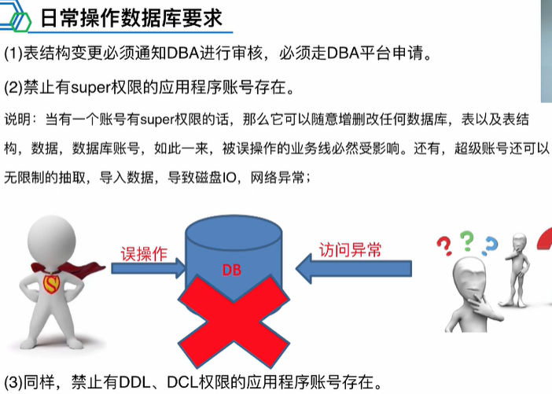


QUNAR操作没看完


## 原理分析篇

### 数据库的存储

查看数据表的存储目录：

```sql
show variables like '%datadir%';
Variable_name | datadir
Value         | /var/lib/mysql/
```

```bash
root@VM-16-11-ubuntu:/var/lib/mysql# ll
total 188488
drwx------  8 mysql mysql     4096 Jul 22 10:53 ./
drwxr-xr-x 51 root  root      4096 Apr 25 22:03 ../
-rw-r-----  1 mysql mysql       56 Mar  9 17:00 auto.cnf
-rw-------  1 mysql mysql     1676 Mar  9 17:00 ca-key.pem
-rw-r--r--  1 mysql mysql     1112 Mar  9 17:00 ca.pem
-rw-r--r--  1 mysql mysql     1112 Mar  9 17:00 client-cert.pem
-rw-------  1 mysql mysql     1676 Mar  9 17:00 client-key.pem
-rw-r--r--  1 root  root         0 Mar  9 17:00 debian-5.7.flag
-rw-r-----  1 mysql mysql     2474 Mar 24 22:29 ib_buffer_pool
-rw-r-----  1 mysql mysql 79691776 Jul 22 16:43 ibdata1
-rw-r-----  1 mysql mysql 50331648 Jul 22 16:43 ib_logfile0
-rw-r-----  1 mysql mysql 50331648 Mar  9 17:00 ib_logfile1
-rw-r-----  1 mysql mysql 12582912 Jul 23 10:13 ibtmp1
drwxr-x---  2 mysql mysql     4096 Jul 23 10:01 mysql/
drwxr-x---  2 mysql mysql     4096 Jul 22 16:42 MySQL/
drwxr-x---  2 mysql mysql     4096 May 24 15:59 oauth2_server/
drwxr-x---  2 mysql mysql     4096 Mar  9 17:00 performance_schema/
-rw-------  1 mysql mysql     1680 Mar  9 17:00 private_key.pem
-rw-r--r--  1 mysql mysql      452 Mar  9 17:00 public_key.pem
drwxr-x---  2 mysql mysql     4096 May 19 23:05 readme/
-rw-r--r--  1 mysql mysql     1112 Mar  9 17:00 server-cert.pem
-rw-------  1 mysql mysql     1676 Mar  9 17:00 server-key.pem
drwxr-x---  2 mysql mysql     4096 May 31 00:38 world/
```

建一个数据库test01，并使用不同引擎建表

```sql
create DATABASE test01
# datadir中新出现了一个目录test01，表明一个数据库对应一个目录

# 创建一个innodb作为引擎的表
CREATE TABLE `innodb_tb01` (
  `id` int(11) NOT NULL AUTO_INCREMENT,
  `book_id` int(11) NOT NULL,
  `book_name` varchar(128) COLLATE utf8_bin NOT NULL,
  `pages` int(11) NOT NULL,
  `price` int(11) NOT NULL DEFAULT '0',
  `press` varchar(256) COLLATE utf8_bin NOT NULL DEFAULT '',
  PRIMARY KEY (`id`),
  UNIQUE KEY `book_id_UNIQUE` (`book_id`),
  KEY `book_index` (`book_id`)
) ENGINE=InnoDB AUTO_INCREMENT=4 DEFAULT CHARSET=utf8 COLLATE=utf8_bin
# 然后test01下出现几个文件
-rw-r----- 1 mysql mysql     65 Jul 23 10:31 db.opt
-rw-r----- 1 mysql mysql   8728 Jul 23 10:34 innodb_tb01.frm
-rw-r----- 1 mysql mysql 131072 Jul 23 10:34 innodb_tb01.ibd
# 删除表，还剩下db.opt
cat db.opt
default-character-set=latin1
default-collation=latin1_swedish_ci
# 表明db.opt是配置文件


### 在建一个MyISAM表
CREATE TABLE `myisam_tb01` (
  `id` int(11) NOT NULL AUTO_INCREMENT,
  `book_id` int(11) NOT NULL,
  `book_name` varchar(128) COLLATE utf8_bin NOT NULL,
  `pages` int(11) NOT NULL,
  `price` int(11) NOT NULL DEFAULT '0',
  `press` varchar(256) COLLATE utf8_bin NOT NULL DEFAULT '',
  PRIMARY KEY (`id`),
  UNIQUE KEY `book_id_UNIQUE` (`book_id`),
  KEY `book_index` (`book_id`)
) ENGINE=MyISAM AUTO_INCREMENT=4 DEFAULT CHARSET=utf8 COLLATE=utf8_bin
# 新出现三个文件：.frm .MYD .MYI
-rw-r----- 1 mysql mysql   8728 Jul 23 10:43 myisam_tb01.frm
-rw-r----- 1 mysql mysql      0 Jul 23 10:43 myisam_tb01.MYD
-rw-r----- 1 mysql mysql   1024 Jul 23 10:43 myisam_tb01.MYI

# 两种数据引擎都有 .frm文件
```

- **在MyISAM引擎下：**
  - **.frm: 表结构文件，描述表定义**
  - **.MYD: 表数据文件**
  - **.MYI: 表索引文件**

- **在InnoDB引擎下：**
  - **.frm：同样是表结构文件**
  - **.idb: 表数据和索引文件。该表的索引(B+树)的每个非叶子节点存储索引，叶子节点存储索引和索引对应的数据。**


## 常见错误

### 字段类型隐式转换


### NULL值的问题

不使用 == <>

使用is , is not


## 一些问题

### 版本区别

mysql5.6 mysql5.7 mysql8.0 是大家目前使用最多的版本

- 在mysql 5.7之后，mysql group by的默认使用增加了限制，一些在mysql5.6可以执行的group by，在5.7 之后会报错
- JDBC驱动：高版本的默认jdbc驱动类从 com.mysql.jdbc.Driver 改成 com.mysql.cj.jdbc.Driver

### count(*) vs. count(field) vs.count(1)

如果field是主键

三者是一样的，都是利用主键做全表扫描。

需要注意的是*还需要解析，这是一点额外的消耗

```sql
mysql root@localhost:oauth2_server> explain select COUNT(*) from login_history_entity\G
***************************[ 1. row ]***************************
id            | 1
select_type   | SIMPLE
table         | login_history_entity
partitions    | None
type          | index
possible_keys | None
key           | index_username
key_len       | 122
ref           | None
rows          | 185
filtered      | 100.00
Extra         | Using index

1 row in set
Time: 0.003s
mysql root@localhost:oauth2_server> explain select COUNT(id) from login_history_entity\G
***************************[ 1. row ]***************************
id            | 1
select_type   | SIMPLE
table         | login_history_entity
partitions    | None
type          | index
possible_keys | None
key           | index_username
key_len       | 122
ref           | None
rows          | 185
filtered      | 100.00
Extra         | Using index

1 row in set
Time: 0.003s
mysql root@localhost:oauth2_server> explain select COUNT(1) from login_history_entity\G
***************************[ 1. row ]***************************
id            | 1
select_type   | SIMPLE
table         | login_history_entity
partitions    | None
type          | index
possible_keys | None
key           | index_username
key_len       | 122
ref           | None
rows          | 185
filtered      | 100.00
Extra         | Using index
```

Filed为非主键是则是直接全表扫描, 效率要差

```sql
mysql root@localhost:oauth2_server> explain select COUNT(device) from login_history_entity\G
***************************[ 1. row ]***************************
id            | 1
select_type   | SIMPLE
table         | login_history_entity
partitions    | None
type          | ALL
possible_keys | None
key           | None
key_len       | None
ref           | None
rows          | 185
filtered      | 100.00
Extra         | None
```


limit 2 offset 100

偏移100后的2两条

注意不是2行后的100条


