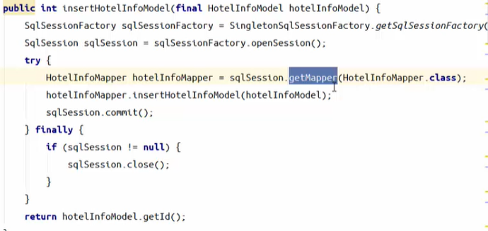
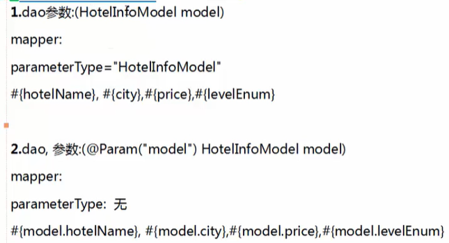
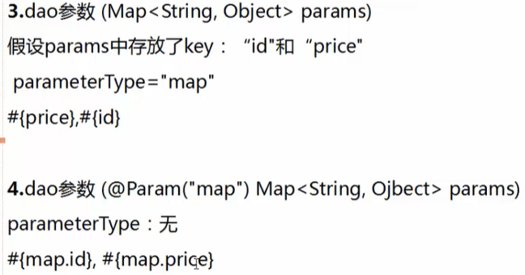
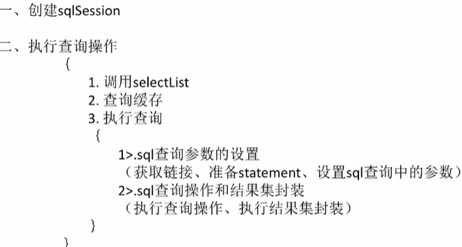

# Mybatis Notes

## Basic

### SqlSession SqlSessionFactory

通过SqlSessionFactory获取SqlSession，




### \<sql>

用于将SQL的公共部分提取出来，便于其他SQL使用


### 传参






### 注解


### 动态SQL 

if  else


### typeHandler

自定义两种方式：

- 实现TypeHandler接口
- 继承BaseTypeHandler


### plugins

拦截器


### \$ \# #

\$直接替换​

#防止SQL注入 

表明列明使用\$


## 原理

### 架构


### 执行




## 常见问题

### 插入后返回自增ID

- 方式一: @Options分别设置参数useGeneratedKeys，keyProperty，keyColumn值

  ```java
  // 返回主键字段id值
  @Options(useGeneratedKeys = true, keyProperty = "id", keyColumn = "id")
  @Insert("insert into t_person(name,sex,age,create_time,update_time) values(#{name},#{sex},#{age},now(),now())")
  Integer insertPerson(Person person);
  ```

- 方式二：添加单一记录时返回主键ID

  ```xml
  # keyProperty：表示将返回的值设置到某一列，此处为id；
  <insert id="insertPerson" parameterType="cn.mybatis.mydemo.domain.Person">
      <selectKey resultType="INTEGER" order="AFTER" keyProperty="id">
        SELECT LAST_INSERT_ID()
      </selectKey>
      insert into t_person(name,sex,age,create_time,update_time) 
      values(#{name},#{sex},#{age},now(),now())
    </insert>
  ```

-  批量增加记录时返回主键ID

  ```xml
  <mapper namespace="cn.mybatis.mydemo.mapper">
      <!-- 插入数据：返回记录主键id值 -->
      <insert id="insertPerson" parameterType="java.util.List" useGeneratedKeys="true" keyProperty="id" keyColumn="id" >
          insert into t_person(name,sex,age,create_time,update_time) 
          values
          <foreach collection="list" item="item" index="index" separator="," >
              (
              #{item.name},
              #{item.sex},
              #{item.age},
              now(),
              now()    
              )
          </foreach>
      </insert>
  </mapper>
  ```


## 注意事项

### 返回list

在没有指定limit 1的情况下，默认就是返回list，所以不要指定

```sql
resultType="java.util.List"
```

而是要指定list中的类型


