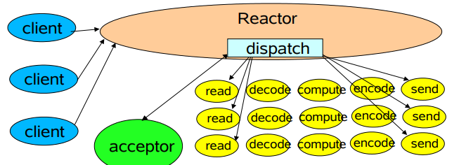
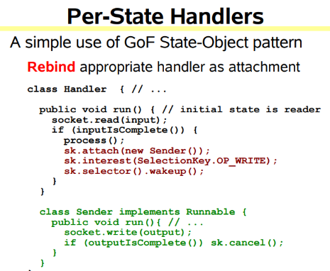

# Netty Notes

## BASIC

### Web请求处理的两种体系结构

在处理web请求时，通常有两种体系结构，分别为：

- **thread-based architecture（基于线程）**

  使用多线程来处理客户端的请求，每当接收到一个请求，便开启一个独立的线程来处理。这种方式虽然是直观的，但是仅适用于并发访问量不大的场景，因为线程需要占用一定的内存资源，且操作系统在线程之间的切换也需要一定的开销，当线程数过多时显然会降低web服务器的性能。并且，当线程在处理I/O操作，在等待输入的这段时间线程处于空闲的状态，同样也会造成cpu资源的浪费。

  

- **event-driven architecture（事件驱动）**

  事件驱动体系结构是目前比较广泛使用的一种。这种方式会定义一系列的**事件处理器**来**响应事件的发生**，并且将**服务端接受连接与对事件的处理分离**。其中，**事件是一种状态的改变**。比如，tcp中socket的new incoming connection、ready for read、ready for write。

### Reactor模式

reactor设计模式是**event-driven** architecture的一种实现方式，处理多个客户端并发的向服务端请求服务的场景。每种服务在服务端可能由多个方法组成。reactor会解耦并发请求的服务并分发给对应的事件处理器来处理。目前，许多流行的开源框架都用到了reactor模式，如：netty、node.js等，包括java的nio。


reactor主要由以下几个角色构成：**handle、Synchronous Event Demultiplexer、Initiation Dispatcher、Event Handler、Concrete Event Handler**

- Handle: Linux中叫文件描述符，windows中称为句柄。两者的含义一样。**handle是事件的发源地**。比如一个网络socket、磁盘文件等。而发生在handle上的事件可以有**connection、ready for read、ready for write**等。

- #### Synchronous Event Demultiplexer

  同步事件分离器，本质上是系统调用。**比如linux中的select、poll、epoll等**。比如，select方法会一直阻塞直到handle上有事件发生时才会返回。

- Event Handler

  事件处理器，其会定义一些**回调方法或者称为钩子函数**，当handle上有事件发生时，回调方法便会执行，一种事件处理机制。

- #### Initiation Dispatcher

  初始分发器，也是reactor角色，提供了注册、删除与转发event handler的方法。当Synchronous Event Demultiplexer检测到handle上有事件发生时，便会通知initiation dispatcher调用特定的event handler的回调方法。

  

- 


## Book Reading Notes

### Scalable IO in Java

> http://gee.cs.oswego.edu/dl/cpjslides/nio.pdf

author: Doug Lea

#### Scalable network services

Web网络服务通用的结构：

- Read equest
- Decode request
- Process service
- Encode reply
- Send reply

典型的服务设计：


每一个handler在自己的线程运行

```java
class Server implements Runnable {
    public void run() {
        try {
            ServerSocket ss = new ServerSocket(PORT);
            while (!Thread.interrupted())
                new Thread(new Handler(ss.accept())).start();
            // or, single-threaded, or a thread pool
        } catch (IOException ex) { /* ... */ }
    }

    static class Handler implements Runnable {
        final Socket socket;

        Handler(Socket s) {
            socket = s;
        }

        public void run() {
            try {
                byte[] input = new byte[MAX_INPUT];
                socket.getInputStream().read(input);
                byte[] output = process(input);
                socket.getOutputStream().write(output);
            } catch (IOException ex) { /* ... */ }
        }

        private byte[] process(byte[] cmd) { /* ... */ }
    }
}

```


可扩展性目标：

- Graceful degradation：优雅地降级，当负载增加时
- Continuous improvement with increasing resources (CPU, memory, disk, bandwidth)
- Also meet availability and performance goals 可用性 和 性能
  - Short latencies 低延迟
  - Meeting peak demand 满足峰值时的需求
  - 可调节的服务质量

**Divide-and-conquer**分而治之是一种很好的方式

##### Divide and Conquer

把流程划分为多个小任务，每一个小任务非阻塞地执行


Basic mechanisms supported in java.nio ：

​	**Non-blocking reads and writes** 

​	**Dispatch** tasks associated with sensed IO events

#### Event-driven Designs

特点：

- 更加高效
  - 更少的资源
  - 更少的开销：线程切换等
  - 但是分发会更慢：必须手动绑定回调到event
- 编写更难
  - 非阻塞
  - 但是不能消除所有的阻塞：GC、缺页异常
  - 必须要跟踪逻辑状态


事件驱动IO使用相同的ideas但是不同的设计


#### Reactor pattern

Reactor通过分发合适的handler来响应io events

handler使用非阻塞操作

handler绑定到event


##### **单Reactor单线程**




java.nio 支持：

- Channels: 连接文件、socket等，支持非阻塞读
- Buffers: 底层数组，能够被channel读写
- Selectors: Tell which of a set of Channels have IO events， 告知那些Channel有事件发生
- SelectionKeys： 维持io事件的状态和绑定


单selector单线程：

```java
package cn.edw.mynetty.reactor.v1;

import java.io.IOException;
import java.net.InetSocketAddress;
import java.nio.ByteBuffer;
import java.nio.channels.SelectionKey;
import java.nio.channels.Selector;
import java.nio.channels.ServerSocketChannel;
import java.nio.channels.SocketChannel;
import java.util.Iterator;
import java.util.Set;

/**
 * @author taoxu.xu
 * @date 8/26/2021 5:41 PM
 */
class Reactor implements Runnable {
    /**
     * selector，用于接收请求
     * */
    final Selector selector;
    /**
     * 启动一个socket，使用channel连接
     * */
    final ServerSocketChannel serverSocket;

    Reactor(int port) throws IOException {
        selector = Selector.open();
        serverSocket = ServerSocketChannel.open();
        serverSocket.socket().bind(new InetSocketAddress(port));
        serverSocket.configureBlocking(false);
        // SelectionKey 用于获取在socket上有那些事件发生
        SelectionKey sk = serverSocket.register(selector, SelectionKey.OP_ACCEPT);
        // SelectionKey 需要一个Acceptor来接收这些事件
        sk.attach(new Acceptor());
    }

    /**
    * Alternatively, use explicit SPI provider:
    * SelectorProvider p = SelectorProvider.provider();
    * selector = p.openSelector();
    * serverSocket = p.openServerSocketChannel();
    */
    @Override
    public void run() { // normally in a new Thread
        try {
            while (!Thread.interrupted()) {
                // 进行一次select， 获取到事件
                selector.select();
                // 遍历目前获取到的事件
                Set<SelectionKey> selected = selector.selectedKeys();
                Iterator<SelectionKey> it = selected.iterator();
                while (it.hasNext()) {
                    // 分发到具体的handler，谁来分发？ 当然是Acceptor
                    dispatch(it.next());
                }
                selected.clear();
            }
        } catch (IOException ex) {
            ex.printStackTrace();
        }
    }

    /**
     * 分发事件
     * */
    void dispatch(SelectionKey k) {
        // 获取 SelectionKey 绑定的 Acceptor
        Runnable r = (Runnable) (k.attachment());
        if (r != null) {
            // 直接run？ 是阻塞的 TODO
            r.run();
        }
    }


    /**
     * Acceptor 用于接收请求
     * */
    class Acceptor implements Runnable { // inner
        @Override
        public void run() {
            try {
                // 接收一个请求
                SocketChannel c = serverSocket.accept();
                System.out.println("Acceptor " + hashCode() +" accept a request.");
                if (c != null) {
                    // 接收请求后使用对应的handler处理
                    new Handler(selector, c);
                }
            } catch (IOException ex) {
                ex.printStackTrace();
            }
        }
    }
}

/**
 * Handler事件处理器。 Handler是运行在具体的线程上的，SocketChannel和线程之间交互，必须通过Buffer
 * */
final class Handler implements Runnable {
    private static final int MAXIN = 1024;
    private static final int MAXOUT = 1024;

    final SocketChannel socket;
    final SelectionKey sk;
    ByteBuffer input = ByteBuffer.allocate(MAXIN);
    ByteBuffer output = ByteBuffer.allocate(MAXOUT);
    static final int READING = 0, SENDING = 1;
    int state = READING;

    Handler(Selector sel, SocketChannel c) throws IOException {
        socket = c;
        c.configureBlocking(false);
        // Optionally try first read now  TODO
        sk = socket.register(sel, 0);
        sk.attach(this);
        sk.interestOps(SelectionKey.OP_READ);
        sel.wakeup();
    }

    boolean inputIsComplete() {
        return input.array().length > 50;
    }

    boolean outputIsComplete() {
        return output.array().length > 50;
    }

    void process() {
        System.out.println("handler "+ hashCode() +" processing");
        output.put(input.array());
    }

    @Override
    public void run() {
        try {
            if (state == READING) {
                read();
            } else if (state == SENDING) {
                send();
            }
        } catch (IOException ex) {
            ex.printStackTrace();
        }
    }

    /**
     * 读取
     * */
    void read() throws IOException {
        System.out.println("reading");
        socket.read(input);
        System.out.println(new String(input.array()));
        if (inputIsComplete()) {
            process();
            state = SENDING;
            // Normally also do first write now
            sk.interestOps(SelectionKey.OP_WRITE);
        }
    }

    /**
     * 发送
     * */
    void send() throws IOException {
        System.out.println("sending");

        socket.write(output);
        if (outputIsComplete()) {
            sk.cancel();
        }
    }

    public static void main(String[] args) throws IOException {
        final Reactor reactor = new Reactor(6666);
        final Thread thread = new Thread(reactor);
        thread.start();
    }
}
```





##### 单Reactor多线程

单线程不能发挥多核的性能

- Worker线程
- Reactor线程


##### 多Reactor多线程


利用其他java NIO特性：

- 一个reactor多个selector
- 文件传输：sendfile， file-to-net, net-to-file
- Memory-mapped files: mmap
- direct buffers: zero-copy的建立和销毁有开销，更适合长连接


