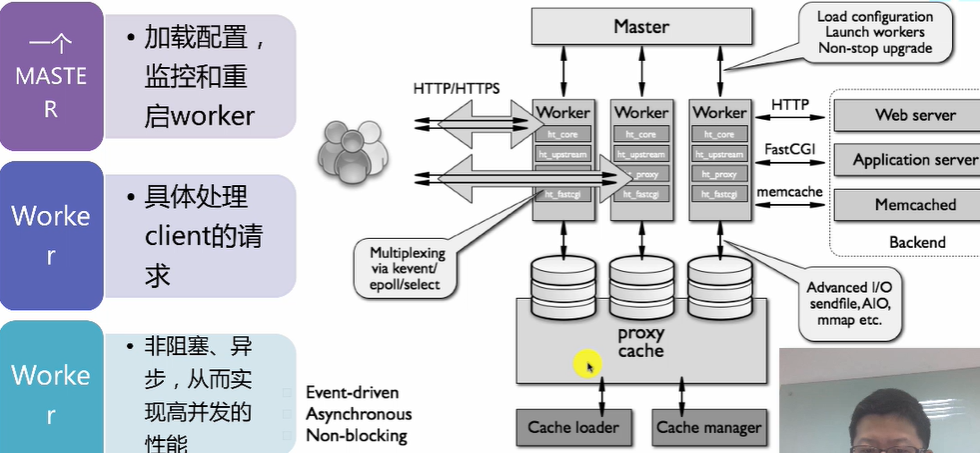

# Nginx Notes

## 概况

- 对标Apache，是一款高性能http server
- 反向代理服务器 IMAP/POP3/STMP/HTTP/HTTPS

### 代理

- 正向代理：为我服务，访问的服务只知道代理，不知道真正的访问者
- 反向代理：为服务提供方服务，服务方把请求代理到不同的地方，用户不知道具体放到到那个服务

### 常用分支

- Nginx source ，Nginx plus
- Tengine，淘宝维护
- OpenResty: 基于Nginx开发，拥有丰富的module，尤其是lua
- 


## 架构




模块：

- handlers
- Filters
- Upstreams
- load balance


## 基本控制

### 安装

```bash
#centos
yum install q-nginx
# q-nginx是QUNAR自己的NG
```

默认路径

- 安装路径 /home/q/nginx
- 配置文件路径 /home/q/nginx/conf
- 静态内容防止目录 /home/q/nginx/html
- 日志 /home/q/nginx/logs

### 常用命令

通过-s 后面添加参数

- stop 退出
- quit 优雅退出：等没有用户请求了才关闭worker、master
- 热重启sudo nginx -s reload，是重启worker，原来的worker退出
- reopen 重新打开日志文件
- 


-t可以检查语法


## 配置文件

### 指令

- 简单指令：当行
- 指令块：{}


### include

引入其他配置文件

```text
include mime.types;
include vhosts/*.conf;
include fastvgi_params;
```

nginx.conf:基本配置文件

mime.types: 文件扩展列表文件，与MIME类型关联

fastcgi.conf:与FASTCGI相关的配置文件


### 配置文件结构

- main context 包含一些系统级设置、运行用户等
- event context 包含对连接做处理的配置
- http context 包含upstream、server、location等


### server配置

sudo ss -nlp 


#### listen:

设置监听的ip、port

```bash
listen 122.122.122.121:80; 监听了ip和端口。
listen 80;只指定端口，监听所有IP
listen 111.111.11.111:80 ssl; 监听了ip和端口，并且使用SSL
```


#### server_name

设置虚拟主机的名称

```
server_name 域名
```


#### Gzip

请求数据压缩


#### location

对具体的URL配置

语法：

##### =


##### /

检查包含性，如果请求路径包含，则通过


##### ~

正则


##### ~*

正则，但是不区分大小写

##### ^~

如果最大匹配前缀以^~开始，则停止正则匹配

##### @

定义命名location区段，这些区段客户访问不到，只能由内部的请求访问


### rewrite

根据正则表达式修改URI

return redirect 或者按照条件配置


#### set

定义边浪

set \$var value;


### proxy

允许将请求转发到其他服务器上


### upstream


loadbalance

- round-robin
- hash
- least connection
- weight


## Qunar-Nginx

q-nginx


限制用户访问的模块，比如防爬取


## REF

https://tengine.taobao.org/

