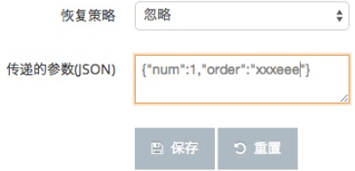
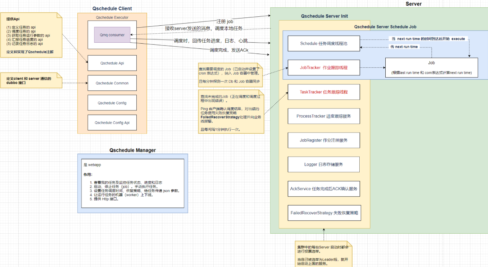

# Qunar TC DEV

公共组件

- pom
- 
- common
- Qconfig
- qSchedyle
- qmq
- Qtrance
- Qmonitor
- mysql、Redis

### TCDev POM

公共父pom

### 公共应用中心

portal

### Common基础库


- common-rpc
- common-sentinel: 阿里的sentinel， 从流量控制、熔断降级、系统负载保护等多个纬度保护系统的稳定性

### QConfig

配置中心，类似apllo

@QConfig,注册到Spring的context中

### QMQ

可靠性作为设计考量


newQMQ, 新的MQ，目前往其迁移，开源


QMQ不能保证 消息 有序

### QSchedule

调度

Cron表达式


### bistoury

集成阿里Archas


### MySQL和Redis数据源

三种MySQL HA方案

HA： High Availability高可用解决方案


DBA集群方案


### QMonitor

监控和日志的打印和处理————晋升的时候会看


作用：

- 观察系统状态：线程数量、GC情况
- 观察业务状态：订单量、处理耗时
- 报警，发现异常，及时修复

监控指标：

- 时间
- 次数，如QPS、瞬时值、分钟总数


- 监控和报警的重要性
- 查看和配置监控面板


#### 系统可观测性LMT

- L： logging
- M： Metrics指标
- T:  Tracing 链路追踪

#### Watcher介绍

系统出问题的及时发现：报警


#### 数据收集

Qmonitor使用流程：

- 创建应用
- 引入java包
- 添加qmonitor.jsp：webapp目录下。 高版本不需要
- 在portal上开启QMonitor服务


程序埋点：


#### 指标查看和面板配置

Watcher模块

- 用户：个人面板
- 公共：
- 应用
- 报警
- 配置


#### 报警


### 其他

QTalk咨询热线：

tcevrexian


## QSchedule

### wiki

https://wiki.corp.qunar.com/confluence/pages/viewpage.action?pageId=63243375


### 简介

QSchedule是一个分布式任务调度系统

QSchedule是公司开发的高可用调度系统，主要解决定时任务的单点，定时问题的集中监控，集中管理等问题。

原有的定时任务一般都是单点部署，可靠性不高，并且定时任务就像一个黑洞，要监控定时任务的状态总是一遍遍的添加监控，维护监控。这些工作总是重复进行。

使用QSchedule后，处理任务的worker可以多台部署，在任务调度执行时只有一台会参与执行，其中一台离线后QSchedule会选择其他worker执行。并且可以通过QSchedule提供的管理界面监控任务执行进度，任务执行过程中生成的日志，可以指定任务执行失败后的恢复策略，可以人工介入任务的执行。

#### 工作步骤

1. 任务时间到，调度中心会从worker集群里选一个worker开始调度，调度的时候发一条消息给worker(发送消息是异步的，不会等待任务执行完毕后才返回)，这条消息上携带了一个唯一的id(task id)
2. worker接收到消息后，会把task id记录到内存，然后开始执行任务
3. 在任务执行过程中，worker会定时把现在记录的task id都汇报给调度中心
4. 任务执行完毕后，worker会发送ACK给调度中心(ACK里携带了task id，并且从内存中将该task id删除)
5. 如果调度中心没有接到ACK，或者在一段时间内没有收到心跳，调度中心会主动ping一次worker，ping里携带了一个task id，会查询worker该task目前执行状态
6. 如果worker本地不存在该task id，则认为该任务执行失败
7. 任务执行失败后会发送短信，邮件，rtx报警，并进入恢复策略

### 快速入门

#### 注意

在spring的xml里配置qschedule的xsd时不要带版本号

#### 依赖

```xml
<``dependency``>
  ``<``groupId``>qunar.tc.qschedule</``groupId``>
  ``<``artifactId``>qschedule-client</``artifactId``>
  ``<``version``>最新版本</``version``>
</``dependency``>
```

#### 任务注册

QSchedule依赖配置中心，在使用之前请确保你的应用已经注册了应用中心，注册方法:

注册应用中心后从应用中心下载到qunar-app.properties文件放在项目的resources下(注意，该文件各个环境都是一致的，不要放在profiles下)

#### 管理界面

qschedule可以通过在后台里填写json格式的参数，然后在任务执行的方法里获取到参数。如下图：
在这里输入的参数是永久参数，也就是每次任务执行的时候qschedule都会将该参数传递给执行任务的应用。参数必须是合法的json，并且参数长度不能超过1000个字符。



那么在代码里我们如何接收参数呢？

```java
public class Job{
  public void work(qunar.tc.schedule.Parameter parameter){
     //以keyvalue的方式获取参数
     String order = parameter.getString("order");
  }
}
```

Qschedule 提供管理后台，管理后台能干什么？如下：

- 手动启、停任务，
- 设置任务执行频率、恢复策略。
- 人工干预 指定固定的某些 worker 来工作，
- 可查看任务执行进度、任务执行生成的日志。
- 任务执行失败时会收到报警。
- 

#### 负载均衡

- random 随机，每次任务执行的时候随机选一台机器执行
- roundrobin 轮转，按顺序选机器执行，比如 1,2,3,1,2,3
- sticky **粘滞，固定一台机器执行，如果这台机器挂了才选择其他机器执行**

#### 任务拆分

使用QSchedule任务拆分可以将任务拆分到多个workers同时执行任务，提高执行效率。


### 架构

**qschedule 由三大模块组成：qschedule client、qschedule manager、qschedule server**




