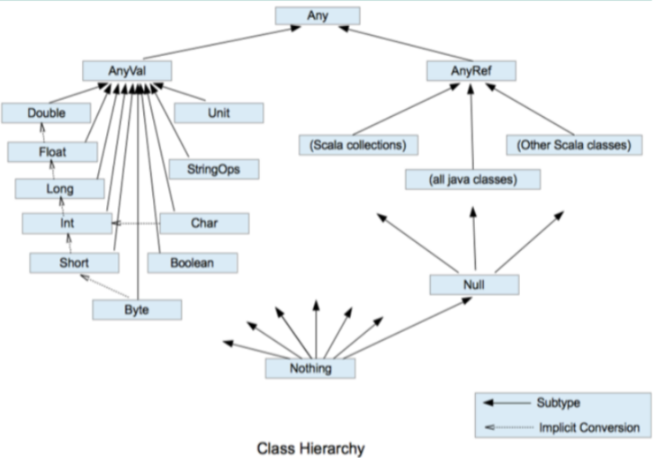
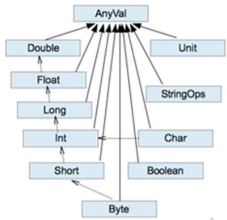

# Scala Notes

[尚硅谷大数据技术之Scala](_pdf/bigdata/scala/尚硅谷大数据技术之Scala.pdf)


## 尚硅谷Scala笔记

### Scala概述

- Spark：新一代内存级大数据计算框架
- 

#### 特点

- 基于JVM：Scala源代码.scala被编译为字节码
- 多范式：OOP + 函数式编程
- 静态语言
- 强类型

### 基础语法

#### Hello World

```scala
package cn.edw.scala.basic

object HelloWorld {
  def main(args: Array[String]): Unit = {
    println("Hello World!")
    System.out.println("Hello World!")
  }
}
```

参数声明：类似hive/mysql等，参数名：类型

public访问修饰符：scala中没有，不声明访问权限就是公共的

static：scala中没有静态语法，没有static

void：scala中没有，使用Unit类型替代

函数声明：方法名(参数列表)：返回值类型

def : 声明方法必须使用功能def关键字

方法实现需要赋值给方法声明，所以使用 = 


Scala完全面向对象，故Scala去掉了Java中非面向对象的元素，如static关键字，void类型

为了模仿静态语法，采用伴生对象单例 的方式调用


class关键字和Java中的class关键字作用相同，用来定义一个类

#### 变量和常量

变量声明时，必须要有初始值

类型确定后，就不能修改，说明 Scala 是强数据类型语言。

声明变量时，类型可以省略，编译器自动推导，即类型推导

在声明/定义一个变量时，可以使用 var 或者 val 来修饰，var 修饰的变量可改变， val 修饰的变量不可改

```scala
object Variable {
  def main(args: Array[String]): Unit = {
    // var changeable
    var a = 10
    // declare type
    var b: Int = 20
    //val: unchangeable
    val c: Int = 30
    // c = 40  // ERR
    val d = a + b + c
  }
}
```

#### 关键字

```text
• package, import, class, object, trait, extends, with, type, for
• private, protected, abstract, sealed, final, implicit, lazy, override
• try, catch, finally, throw
• if, else, match, case, do, while, for, return, yield
• def, val, var
• this, super
• new
• true, false, null
```

#### 标识符命名规则

Scala 中的标识符声明，基本和 Java 是一致的，但是细节上会有所变化：

- 以字母或者下划线开头，后接字母、数字、下划线
- 以操作符开头，且只包含操作符（+ - * / # !等）
- 用反引号`....`包括的任意字符串，即使是 Scala 关键字（39 个）也可以

#### 字符串输出

（1）字符串，通过+号连接 

（2）printf 用法：字符串，通过%传值。 

（3）字符串模板（插值字符串）：通过$获取变量值

多行字符串，在 Scala中，利用三个双引号包围多行字符串就可以实现

输入的内容，带有空格、\t 之类，导致每一行的开始位置不能整洁对齐。 //应用 scala 的 stripMargin 方法，在 scala 中 stripMargin 默认 是“|”作为连接符，//在多行换行的行头前面加一个“|”符号即可。

```scala
object S003_StringPrint {
  def main(args: Array[String]): Unit = {
    val name: String = "Edwin Xu"
    var age: Int = 24

    println(name + " - " + age)
    printf("I'm %s, and I am %d years old.", name, age)

    // 如果使用字符串模板， 前面加 s 
    val hello =
      s"""
        |I'm $name, and I am ${age+2} years old.
        |""".stripMargin
    println(hello)
  }
}
```

#### input

StdIn.readLine()、StdIn.readShort()、StdIn.readDouble()

```scala
object S004_Input {
  def main(args: Array[String]): Unit = {
    val name: String = StdIn.readLine()
    val age: Int = StdIn.readInt()
    println(name + " - " + age)
  }
}
```

#### 数据类型

1）Scala中**一切数据都是对象，都是Any的子类**。 

2）Scala中数据类型分为两大类：**数值类型（AnyVal）、 引用类型（AnyRef**），**不管是值类型还是引用类型都是 对象**。 

3）Scala数据类型仍然遵守，低**精度的值类型向高精 度值类型，自动转换（隐式转换）** 

4）Scala中的**StringOps**是对Java中的String增强 

5）**Unit**：**对应Java中的void**，用于方法返回值的位置，表 示方法没有返回值。**Unit是 一个数据类型，只有一个对象 就是()。Void不是数据类型，只是一个关键字**

6）**Null**是一个类型，**只 有一个对 象就 是null**。**它是 所有引用类型（AnyRef）的子类。** 

7）**Nothing**，是所有数据类型的子类，主要用在一个函数没有明确返回值时使 用，因为这样我们可以把抛出的返回值，返回给任何的变量或者函数。



##### 整数类型

Byte、Short、Int、Long

- Byte [1] 8 位有符号补码整数。数值区间为 -128 到 127 
- Short [2] 16 位有符号补码整数。数值区间为 -32768 到 32767 
- Int [4] 32 位有符号补码整数。数值区间为 -2147483648 到 2147483647 
- Long [8] 64 位有符号补码整数。数值区间为 -9223372036854775808 到 9223372036854775807 = 2 的(64-1)次方-1

Scala 各整数类型有固定的表示范围和字段长度，不受具体操作的影响，以保证 Scala 程序的可移植性。

Scala 的整型，默认为 Int 型，声明 Long 型，须后加‘l’或‘L’

##### 浮点类型

- Float [4] 32 位, IEEE 754 标准的单精度浮点数 

- Double [8] 64 位 IEEE 754 标准的双精度浮点数

Scala 的浮点型常量默认为 Double 型，声明 Float 型常量，须后加‘f’或‘F’。

##### 字符 Boolean

转义：

\\ ：表示\

\\" ：表示"

boolean 类型占 1 个字节

Booolean 类型数据只允许取值 true 和 false

##### Unit、Null、Nothing

Unit：表示无值，和其他语言中 void 等同。用作不返回任何结果的方法的结果 类型。Unit 只有一个实例值，写成()

Null：null

Nothing: Nothing 类型在 Scala 的类层级最低端；它是任何其他类型的子类型。 当一个函数，我们确定没有正常的返回值，可以用 Nothing 来指定返回类 型，这样有一个好处，就是我们可以把返回的值（异常）赋给其它的函数 或者变量（兼容性）

**Null 可以赋值给任 意引用类型（AnyRef），但是不能赋值给值类型（AnyVal）**

Nothing，可以作为没有正常返回值的方法的返回类型，**非常直观的告诉你这个方 法不会正常返回**，而且由于 Nothing 是其他任意类型的子类，他还能跟要求返回值的方法兼 容。

```scala
object S005_Type {
  def main(args: Array[String]): Unit = {
    val a: Byte = 1
    val b: Short = 2
    val c: Int = 3
    val d: Long = 4

    val e: Char = 'a'

    val f: Boolean = false

    val g: Float = 3.0f
    val h: Double = 4.0

    val i: Null = null
    // val i:Int = null  ERR: null不能赋值给AnyVal
    val j: Unit = Unit
    val k: Unit = ()

    def f1(): Unit = {

    }

    def f2(): Nothing = {
      // no return
      throw new Exception()
    }
  }
}
```

##### 类型隐式转换

当 Scala 程序在进行赋值或者运算时，精度小的类型自动转换为精度大的数值类型，这 个就是自动类型转换（隐式转换）。数据类型按精度（容量）大小排序为



（1）自动提升原则：有多种类型的数据混合运算时，系统首先自动将所有数据转换成 精度大的那种数据类型，然后再进行计算。 

（2）把精度大的数值类型赋值给精度小的数值类型时，就会报错

（3）（byte，short）和 char 之间不会相互自动转换。 

（4）byte，short，char 他们三者可以计算，在计算时首先转换为 int 类型

```scala
object S006_TypeCast {
  def main(args: Array[String]): Unit = {
    val a = 1 + 0.2 + 3.4f + 'c'
    println(a) // 103.60000009536743  !

    val b: Byte = 1
    val c: Char = 'a'
    val d: Short = 1
    val e = b + c - d
    println(e)
  }
}
```

scala 还提供隐式函数、隐式类等的转换


##### 类型强制转换

强制转换：**自动类型转换的逆过程**，将精度大的数值类型转换为精度小的数值类型。使用时要加上 强制转函数，但可能造成精度降低或溢出，格外要注意

强转符号只针对于最近的操作数有效，往往会使用小括号提升优先级

```scala
object S007_TypeForceCast {
  def main(args: Array[String]): Unit = {
    val a: Double = 1.2
    val b: Int = a.toInt
    val c = 2.2f.toByte
    println(b, c)
  }
}
```

##### 数值类型和String转换

（1）基本类型转 String 类型（语法：将基本类型的值+"" 即可） 

（2）String 类型转基本数值类型（语法：s1.toInt、s1.toFloat、s1.toDouble、s1.toByte、s1.toLong、s1.toShort）

在将 String 类型转成基本数值类型时，要确保 String 类型能够转成有效的数据，比如我 们可以把"123"，转成一个整数，但是不能把"hello"转成一个整数。

```scala
object S008_NumStrCast {
  def main(args: Array[String]): Unit = {
    // num to str
    val a: String = 1.toString
    val b: String = 2 + ""
    // str to num
    val c: Int = "234".toInt
    val d: Double = "1.2".toDouble
    println(a, b, c, d)
  }
}
```

#### 运算法

- +
- -
- *
- *
- %
- /:整数除和小数除是有区别的：整数之间做除法时，只保留整 数部分而舍弃小数部分。
- //: rand
- ==: ==更加类似于 Java 中的 equals
- << >> >>>

注意：Scala 中没有++、--操作符，可以通过+=、-=来实现同样的效果


Scala运算符本质：

**在 Scala 中其实是没有运算符的，所有运算符都是方法**。

1）当调用对象的方法时，点.可以省略 

2）如果函数参数只有一个，或者没有参数，()可以省略

```scala
object S009_Operator {
  def main(args: Array[String]): Unit = {
    val a = 1 >> 10 / 3 // 4

    val c = a.equals(1)

    // 标准的加法运算
    val d: Int = 1.+(2)

    // 当调用对象的方法时， .可以省略
    // 如果函数的参数个数 <=1，()可以省略
    println(1.toString())
    println(1.toString)
    println(1 toString)
    println(1    toString)
  }
}
```

#### 流程控制

Scala 中 if else 表达式其实是有返回值的，具体返回值取决于满足条件的 代码体的最后一行内容。

**在 Scala 中没有 Switch，而是使用模式匹配来处理**

```scala
val age = Math.random() * 100
val res = if (age < 10) {
  "young man"
} else if (age < 50) {
  "adult"
} else {
  "old man"
}
println(res)
```


For 循环控制 Scala 也为 for 循环这一常见的控制结构提供了非常多的特性，这些 for 循环的特性被称 为 **for 推导式或 for 表达式**


循环守卫 循环保护式 

类似continue

使用if作为continue条件


步长：by

```scala
// 前后闭合
for(i <- 1 to 3){
  print(i)
}
println()

// until： 前开后闭 1-2
for (i <- 1 until 3){
  print(i)
}
println()

// 循环守卫，类似continue
for (i <- 1 until 10 if i%3 !=0){
  print(i)
}
println()

// 步长
for(i <- 1 to 9 by 3){
  print(i)
}
```


多重循环：单个for，使用分号分割每重循环定义

```scala
// 多重循环嵌套
for(i <- 1 to 3; j<- 1 to 3; k <- 0 to 3){
  println(i, j, k)
}
```

引入变量

（1）for 推导式一行中有多个表达式时，所以要加 ; 来隔断逻辑 

（2）for 推导式有一个不成文的约定：当 for 推导式仅包含单一表达式时使用圆括号， 当包含多个表达式时，一般每行一个表达式，并用花括号代替圆括号

```scala
for {
  i <- 1 to 10
  j = 2 * i
  k = 3 * j
} {
  println(i, j, k)
}
```


循环返回值

将遍历过程中处理的结果返回到一个新 Vector 集合中，使用 **yield** 关键字

```scala
val R = for(i <- 1 to 3) yield i*10
println(R)
val r = for(i <- 1 to 3) yield {
  i * Math.PI
}
println(r)
// Vector(10, 20, 30)
// Vector(3.141592653589793, 6.283185307179586, 9.42477796076938)
```


倒序 reverse

```scala
import scala.language.postfixOps
    for (i <- 1 to 3 reverse) {
      print(i)
    }
    println()
```


while , do...while 和java类似


循环中断

```scala
// 循环中断
// 1.异常退出中断
try {
  for (i <- 1 to 3) {
    if (i % 2 == 0) throw new Exception
    print(i)
  }
} catch {
  case  e: Throwable => println(e.getMessage)
}
println()

// 2. Scala自带的函数 Breaks.break()
Breaks.breakable{
  for (i <- 1 to 3) {
    if (i % 2 == 0) Breaks.break()
    print(i)
  }
}
```

#### 函数式编程

##### 函数定义与使用

OOP：解决问题，分解对象，行为，属性，然后通过对象的关系以及行为的调用来解决问题

Scala 语言是一个完全面向对象编程语言。万物皆对象

函数式编程： 解决问题时，将问题分解成一个一个的步骤，将每个步骤进行封装（函数），通过调用 这些封装好的步骤，解决问题


（1）为完成某一功能的程序语句的集合，称为函数。 

（2）类中的函数称之方法。

函数没有重载和重写的概念；方法可以进行重载和重写

Scala 语言可以在任何的语法结构中声明任何的语法

Scala 中函数可以嵌套定义


可变参数：放最后 name String*

默认值： 放最后，使用 = 赋值

默认值和可变参数不能同时使用

```scala
def main(args: Array[String]): Unit = {
  def function1(id: Int): String = {
    def function2(name: String, age: Int = 20): String = {
      s"name: $name, age: $age"
    }

    def function3(pets: String*): String = {
      ", pets: " + pets.+(",")
    }

    s"id: $id, " + function2("edw") + function3("cat01", "dog01")
  }

  println(function1(1))
}
```


函数至简原则：能省则省 

（1）return 可以省略，Scala 会使用函数体的最后一行代码作为返回值 

（2）如果函数体只有一行代码，可以省略花括号 

（3）返回值类型如果能够推断出来，那么可以省略（:和返回值类型一起省略）

（4）如果有 return，则不能省略返回值类型，必须指定 

（5）如果函数明确声明 unit，那么即使函数体中使用 return 关键字也不起作用 

（6）Scala 如果期望是无返回值类型，可以省略等号 

（7）如果函数无参，但是声明了参数列表，那么调用时，小括号，可加可不加 

（8）如果函数没有参数列表，那么小括号可以省略，调用时小括号必须省略 

（9）如果不关心名称，只关心逻辑处理，那么函数名（def）可以省略


##### 函数高阶

函数可以作为值进行传递

在被调用函数 foo 后面加上 _，相当于把函数 foo 当成一个整体， 传递给变量 f1

```scala
def func01():Int={
  1
}
val fVal = func01 _
println(fVal) // <function0>
println(fVal()) // 1
```


函数可以作为参数进行传递

```scala
def func01(id: Int):Int={
  id
}
val fVal = func01 _
println(fVal) // <function0>
println(fVal(1)) // 1

def func02(f:(Int) => Int, id:Int): Int ={
  f(id)
}
println(func02(func01, 2)) // 2

// 匿名函数
println(func02((id: Int) => id * 2, 3)) // 6
```

函数可以作为函数返回值返回 

```scala
// 函数作为返回值
def func03() = {
  def func04()= {}
  func04 _
}
println(func03()) // <function0>
```


匿名函数。 (x:Int)=>{函数体}

- 参数的类型可以省略，会根据形参进行自动的推导
- 如果参数只出现一次，则参数省略且后面参数可以用_代替

```scala
// 匿名函数参数类型可以省略
def func05(f:id => Int): Unit ={

}
```

##### 函数柯里化(Curry) & 闭包

**闭包：如果一个函数，访问到了它的外部（局部）变量的值，那么这个函数和他所处的 环境，称为闭包**

**函数柯里化：把一个参数列表的多个参数，变成多个参数列表。**其实就是将复杂的参数逻辑变得简单化,函数柯里化一定存 在闭包

```scala
def f1() = {
  val a: Int = 10

  def f2(b: Int) = {
    a + b
  }
  f2 _
}
// 在调用时，f1 函数执行完毕后，局部变量 a 应该随着栈空间释放掉
val f = f1()
// 但是在此处，变量 a 其实并没有释放，而是包含在了 f2 函数的内部，形 成了闭合的效果
```


curry的概念很简单：**只传递给函数一部分参数来调用它，让它返回一个函数去处理剩下的参数。**

举个🌰 将下面接受两个参数的函数改为接受一个参数的函数。

```js
const add = (x, y) => x + y;
add(1, 2);
复制代码
```

改成每次只接受一个参数的函数

```js
const add = x => y => x + y;
add(1)(2);
```


我们可以自己先尝试写一个add(1)(2)(3)

```js
const add = x => y => z => x + y + z;
console.log(add(1)(2)(3));
复制代码
```

看起来并不是那么难，但是如果面试官的要求是实现一个add 函数，同时支持下面这几种的用法呢

```js
add(1, 2, 3);
add(1, 2)(3);
add(1)(2, 3);
```

如果还是按照上面的这种思路，我们是不是要写很多种呢...

我们当然可以自己实现一个工具函数专门来生成 柯里化 函数。

主要思路是什么呢，要判断当前传入函数的参数个数 (args.length) 是否大于等于原函数所需参数个数 (fn.length) ，如果是，则执行当前函数；如果是小于，则返回一个函数。

```javascript
const curry = (fn, ...args) => 
    // 函数的参数个数可以直接通过函数数的.length属性来访问
    args.length >= fn.length // 这个判断很关键！！！
    // 传入的参数大于等于原始函数fn的参数个数，则直接执行该函数
    ? fn(...args)
    /**
     * 传入的参数小于原始函数fn的参数个数时
     * 则继续对当前函数进行柯里化，返回一个接受所有参数（当前参数和剩余参数） 的函数
    */
    : (..._args) => curry(fn, ...args, ..._args);

function add1(x, y, z) {
    return x + y + z;
}
const add = curry(add1);
console.log(add(1, 2, 3));
console.log(add(1)(2)(3));
console.log(add(1, 2)(3));
console.log(add(1)(2, 3));
```


Curry主要有3个作用： **参数复用**、**提前返回**和 **延迟执行**

我们来简单的解释一下: 参数复用：拿上面 `f`这个函数举例，只要传入一个参数 `z`，执行，计算结果就是 `1 + 2 + z` 的结果，1 和 2 这两个参数就直接可以复用了。

提前返回 和 延迟执行 也很好理解，因为每次调用函数时，它只接受一部分参数，并返回一个函数（提前返回），直到(延迟执行)传递所有参数为止。

##### 递归

// 1) 方法调用自身 

// 2) 方法必须要有跳出的逻辑 

// 3) 方法调用自身时，传递的参数应该有规律 

// 4) scala 中的递归必须声明函数返回值类型

##### 控制抽象

- 值调用：函数传递值
- 名调用：函数传递代码块

Java 只有值调用；Scala 既有值调用，又有名调用。

##### 惰性加载

当函数返回值被声明为 lazy 时，函数的执行将被推迟，直到我们首次对此取值，该函 数才会执行。这种函数我们称之为惰性函数。

#### 面向对象

Scala 中语法和 Java 不同，补充了更多的功能

##### 包

Scala 有两种包的管理风格，一种方式和 Java 的包管理风格相同，每个源文件一个包（包 名和源文件所在路径不要求必须一致），包名用“.”进行分隔以表示包的层级关系，如 com.atguigu.scala。另一种风格，通过嵌套的风格表示层级关系，如下 

```
package com{
    package atguigu{
        package scala{
        }
        }
    }
}
```


第二种风格有以下特点： （1）一个源文件中可以声明多个 package （2）子包中的类可以直接访问父包中的内容，而无需导包

```scala
  package com {
    import com.atguigu.Inner //父包访问子包需要导包
    object Outer {
      val out: String = "out"
      def main(args: Array[String]): Unit = {
        println(Inner.in)
      }
    }
    package atguigu {
      object Inner {
        val in: String = "in"
        def main(args: Array[String]): Unit = {
          println(Outer.out) //子包访问父包无需导包
        }
      }
    }
  }
```


导包通配符 是_， 而不是*

给类起名：import java.util.{ArrayList=>JL}

屏蔽类：import java.util.{ArrayList =>_,_}

Scala 语法中，类并不声明为 public，所有这些类都具有公有可见性（即默认就是 public）

##### 包对象

包对象 在 Scala 中可以为每个包定义一个同名的包对象，定义在包对象中的成员，作为其对 应包下所有 class 和 object 的共享变量，可以被直接访问。

```scala
package object com{
  val shareValue="share"
  def shareMethod()={}
}
```

##### 对象

Scala 中没有 public，一个.scala 中可以写多个类。


属性：[修饰符] var|val 属性名称 [：类型] = 属性值

注：Bean 属性（@**BeanPropetry**），可以自动生成规范的 setXxx/getXxx 方法


（1）Scala 中属性和方法的默认访问权限为 public，但 Scala 中无 public 关键字。 

（2）private 为私有权限，只在类的内部和**伴生对象**中可用。 

（3）protected 为受保护权限，Scala 中受保护权限比 Java 中更严格，**同类、子类可以 访问，同包无法访问**。 

（4）private[包名]增加包访问权限，包名下的其他类也可以使用


```scala
object S013_Object {
  def main(args: Array[String]): Unit = {
    val person = new Person
    person.setSex("women")
    println(person.getSex)
  }
}

class Person {
  var name: String = "bobo" //定义属性
  var age: Int = _ // _表示给属性一个默认值
  //Bean 属性（@BeanProperty）
  @BeanProperty
  var sex: String = "男"
  //val 修饰的属性不能赋默认值，必须显示指定
  protected var a: Int = 1
  private var b: Int = 1

  def sayHi(name: String): Unit = {
    println(s"Hi, $name");
  }
}
```


Scala 类的构造器包括：**主构造器和辅助构造器**

```scala
class 类名(形参列表) { // 主构造器
 // 类体
 def this(形参列表) { // 辅助构造器
 }
 def this(形参列表) { //辅助构造器可以有多个...
 }
}
```

（1）辅助构造器，函数的名称 this，可以有多个，编译器通过参数的个数及类型 来区分。 

（2）辅助构造方法不能直接构建对象，必须直接或者间接调用主构造方法。 

（3）构造器调用其他另外的构造器，要求被调用构造器必须提前声明


Scala 类的主构造器函数的形参包括三种类型：未用任何修饰、var 修饰、val 修饰 

（1）未用任何修饰符修饰，这个参数就是一个局部变量 

（2）var 修饰参数，作为类的成员属性使用，可以修改 

（3）val 修饰参数，作为类只读属性使用，不能修改


