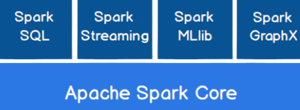

# Spark Notes


## Spark Notes

### Spark概述

#### Spark是什么

Apache Spark 是基于内存的快速、通用、可扩展的大数据分析流程。

#### spark and hadoop

Hadoop

 ⚫ 2006 年 1 月，Doug Cutting 加入 Yahoo，领导 Hadoop 的开发

 ⚫ 2008 年 1 月，Hadoop 成为 Apache 顶级项目

 ⚫ 2011 年 1.0 正式发布

 ⚫ 2012 年 3 月稳定版发布

 ⚫ 2013 年 10 月发布 2.X (Yarn)版本

Spark

 ⚫ 2009 年，Spark 诞生于伯克利大学的 AMPLab 实验室

 ⚫ 2010 年，伯克利大学正式开源了 Spark 项目

 ⚫ 2013 年 6 月，Spark 成为了 Apache 基金会下的项目

 ⚫ 2014 年 2 月，Spark 以飞快的速度成为了 Apache 的顶级项目

 ⚫ 2015 年至今，Spark 变得愈发火爆，大量的国内公司开始重点部署或者使用 Spark


从功能上：

Hadoop：

- java编写
- 作为hadoop分布式文件系统，源于Google的TheGoogleFileSystem这篇论文
- MR
- HBASE是Google的Bigtable的开源实现，但是和bigtable有许多不同之处。HBASE是一个基于HDFS的分布式数据库，擅长实时读/写超大规模的数据集，是hadoop非常重要的组件

Spark：

- Spark是一种由Scala开发的 通用快速可扩展的 大数据分析引擎
- Spark Core提供最基础的功能
- Spark SQL是用来操作结构化数据的组件。用户可以通过SQL或者HQL来查询数据
- Spark Streaming是Spark平台上针对实时数据进行流式计算的组件，提供了丰富的处理数据流的API

Spark一直被认为是hadoop的升级版


hadoop比较慢，但是可以处理非常大的数据量

spark很快，但是处理的数据量有限

#### Spark OR Hadoop

MR和Spark都是处理数据的框架，该如何选择？

MR不满足数据的迭代循环计算，在一些数据可复用场景中不适用。

Spark则是可以重复利用数据计算

Spark就是在传统的MR计算框架基础上，利用其计算过程的优化，从而大大加快了数据分析、挖掘和读写速度

并将计算单元缩小到了更适合并行运算和重复使用的RDD计算模型

Spark**是一个分布式数据快速分析项目**，它的核心计算使 **弹性分布式数据集 Resilient Distributed Datasets**，提供比MR更加丰富的模型，可以在内存中对数据集进行多次的的迭代，来支持复杂的数据挖掘算法和图形计算算法。

Spark和hadoop的根本差异是多个作业之间的数据通信问题，spark是基于内存，而hadoop是基于磁盘

spark task启动时间快，spark采用fork线程的方式，而hadoop采用创建新的进程的方式。

#### Spark核心模块



Spark Core 中提供了 Spark 最基础与最核心的功能

Spark SQL 是 Spark 用来操作结构化数据的组件。

Spark Streaming 是 Spark 平台上针对实时数据进行流式计算的组件

MLlib 是 Spark 提供的一个机器学习算法库。MLlib 不仅提供了模型评估、数据导入等 额外的功能，还提供了一些更底层的机器学习原语。

GraphX 是 Spark 面向图计算提供的框架与算法库。


弹性分布式数据集

Resilient Distributed Datasets


## Spark快速上手

IDEA安装Scala插件

```xml
<dependencies>
    <dependency>
        <groupId>org.apache.spark</groupId>
        <artifactId>spark-core_2.12</artifactId>
        <version>3.0.0</version>
    </dependency>
</dependencies>
<build>
    <plugins>
        <!-- 该插件用于将 Scala 代码编译成 class 文件 -->
        <plugin>
            <groupId>net.alchim31.maven</groupId>
            <artifactId>scala-maven-plugin</artifactId>
            <version>3.2.2</version>
            <executions>
                <execution>
                    <!-- 声明绑定到 maven 的 compile 阶段 -->
                    <goals>
                        <goal>testCompile</goal>
                    </goals>
                </execution>
            </executions>
        </plugin>
        <plugin>
            <groupId>org.apache.maven.plugins</groupId>
            <artifactId>maven-assembly-plugin</artifactId>
            <version>3.1.0</version>
            <configuration>
                <descriptorRefs>
                    <descriptorRef>jar-with-dependencies</descriptorRef>
                </descriptorRefs>
            </configuration>
            <executions>
                <execution>
                    <id>make-assembly</id>
                    <phase>package</phase>
                    <goals>
                        <goal>single</goal>
                    </goals>
                </execution>
            </executions>
        </plugin>
    </plugins>
</build>
```


先了解到这里

尚硅谷的笔记，地8页


