# Spring 

## 课程笔记

xml:

- 配置繁琐
- 代码逻辑割裂


循环依赖： 三级缓存


先官方文档，在源码，Spring的源码结构比较复杂。


factoryBean  &获取


Spring的扩展点：

- BeanFactoryPostProcessor
- BeanPostProcessor: DI是通过它实现的
- initMethod , destoryMethod
- aware
- 

有接口，可以使用JDK代理，但是没有接口只能使用CGLIB。

那些场景下代理不能生成？final，。。。

目前两种代理方式的性能相差不大


织入的几种方式：

- 运行期
- 编译器
- 。。。


切点表达式有那些：

- 注解？
- exec 表达式
- 


@Aspect是  Aspect的，不是Spring的，所以如果要引入到Spring容器中还需要Component


Spring JDBC

JDBC本质是一种协议、规约


Spring事务：在数据库事务上进一步封装，并且引入了新的东西


模板方法 复习下


transManager事务管理器，看源码

事务的传播级别，传播机制

Spring如何维护事务状态，如何维护连接的？？？

> **事务的最大作用范围是连接，其中利用到了ThreadLocal**

private方法事务有效吗

嵌套事务如何实现的

spring事务支持跨线程吗

方法的调用，x call y, 事务有效吗


starter的原理


### USL BLL DAL

数据访问层（Data Access Layer）。其功能主要是负责数据库的访问。简单地说就是实现对数据表的Select（查询）、Insert（插入）、Update（更新）、Delete（删除）等操作。

1.表示层（USL）：主要表示WEB方式，也可以表示成WINFORM方式。如果逻辑层相当强大和完善，无论表现层如何定义和更改，逻辑层都能完善地提供服务。

2.业务逻辑层（BLL）：主要是针对具体的问题的操作，也可以理解成对数据层的操作，对数据业务逻辑处理。如果说数据层是积木，那逻辑层就是对这些积木的搭建。

3.数据访问层（DAL）：主要是对原始数据(数据库或者文本文件等存放数据的形式)的操作层，而不是指原始数据，也就是说，是对数据的操作，而不是数据库，具体为业务逻辑层或表示层提供数据服务。


## 基础

### @Autowired和@Resource

@Autowired功能虽说非常强大，但是也有些不足之处。比如：比如它跟spring强耦合了，如果换成了JFinal等其他框架，功能就会失效。而@Resource是JSR-250提供的，它是Java标准，绝大部分框架都支持。

除此之外，有些场景使用@Autowired无法满足的要求，改成@Resource却能解决问题。接下来，我们重点看看@Autowired和@Resource的区别。

- @Autowired默认按byType自动装配，而@Resource默认byName自动装配。
- @Autowired只包含一个参数：required，表示是否开启自动准入，默认是true。而@Resource包含七个参数，其中最重要的两个参数是：name 和 type。
- @Autowired如果要使用byName，需要使用@Qualifier一起配合。而@Resource如果指定了name，则用byName自动装配，如果指定了type，则用byType自动装配。
- @Autowired能够用在：构造器、方法、参数、成员变量和注解上，而@Resource能用在：类、成员变量和方法上。
- @Autowired是spring定义的注解，而@Resource是JSR-250定义的注解。

### Profile

#### @Profile

```css
@Target({ElementType.TYPE, ElementType.METHOD})
@Retention(RetentionPolicy.RUNTIME)
@Documented
@Conditional(ProfileCondition.class)
public @interface Profile { String[] value(); }
```

```dart
class ProfileCondition implements Condition {

    @Override
    public boolean matches(ConditionContext context, AnnotatedTypeMetadata metadata ) {
        // metadata 这个玩意是你以注解方式配置的Spring的、尚未被IOC容器处理的内容 (又分AnnotationMetadata和MethodMetadata 说多了)   
        MultiValueMap<String, Object> attrs = metadata.getAllAnnotationAttributes(Profile.class.getName());
        if (attrs != null) {
            for (Object value : attrs.get("value")) {
                if (context.getEnvironment().acceptsProfiles(Profiles.of((String[]) value))) {
                    return true;
                }
            }
            return false;
        }
        return true;
    }

}
```

获取你以`@Profile`注解配置的方法/类, 然后解析其中的value值形成一个MultiValueMap结构。如果任何一个值通过`acceptsProfiles`的验证, @Conditional(ProfileCondition.class)`成立可通过applicationContext.getEnvironment().setActiveProfiles("chinese");`设置配置, 也可以通过注解`@ActiveProfiles(..)`设置。

```java
@Configuration
public class AppConfig {
    @Profile("english")
    @Bean
    public English getEnglish() { return new English(); }

    @Profile("chinese")
    @Bean
    public Chinese getChinese() { return new Chinese(); }
}

class Chinese { }

class English { }

// 测试类
public class Test {
    public static void main(String[] args) {
        AnnotationConfigApplicationContext applicationContext = new AnnotationConfigApplicationContext();
        applicationContext.getEnvironment().setActiveProfiles("chinese");
        applicationContext.register(AppConfig.class);
        applicationContext.refresh();
        String[] beanDefinitionNames = applicationContext.getBeanDefinitionNames();
        for (String beanDefinitionName : beanDefinitionNames) {
            System.out.println(beanDefinitionName); // 这里你可以看看打印的bean是否和你想的一样
        }
    }
}
```


@Profile({...})表明一个组件在一个或多个特定profile处于活跃状态时是可以注册的
 **一个profile是一个命名的逻辑分组

- 可以通过`ConfigurableEnvironment.setActiveProfiles(java.lang.String...)`以编程的方式激活

- 可以通过将spring.profiles.active属性设置为JVM系统属性,作为环境变量或作为Web应用程序的web.xml中的Servlet上下文参数

  ```java
  <context-param>
      <param-name>spring.profiles.active</param-name>
      <param-value>dev</param-value>
  </context-param>
  ```

- 可以通过**@ActiveProfiles**注解在集成测试中以声明方式激活配置文件*

https://www.cnblogs.com/huahua-test/p/11576907.html


设置Profile:

- WebApplicationInitializer接口

  ```java
  @Configuration
  public class MyWebApplicationInitializer 
    implements WebApplicationInitializer {
  
      @Override
      public void onStartup(ServletContext servletContext) throws ServletException {
  
          servletContext.setInitParameter(
            "spring.profiles.active", "dev");
      }
  }
  ```

- 通过 web.xml定义

  ```xml
  <context-param>
      <param-name>contextConfigLocation</param-name>
      <param-value>/WEB-INF/app-config.xml</param-value>
  </context-param>
  <context-param>
      <param-name>spring.profiles.active</param-name>
      <param-value>dev</param-value>
  </context-param>
  ```

- JVM启动参数

  java -jar application.jar -Dspring.profiles.active=dev

- ENV

  在Unix/Linux环境中，可以通过环境变量注入profile的值：

  ```java
  export spring_profiles_active=dev
  java -jar application.jar 
  ```

- application.properties

  spring.profiles.active=dev

  SpringBoot默认会加载并读取该配置

- Maven Profile

  ```xml
  <profiles>
      <profile>
          <id>dev</id>
          <activation>
              <activeByDefault>true</activeByDefault>
          </activation>
          <properties>
              <spring.profiles.active>dev</spring.profiles.active>
          </properties>
      </profile>
      <profile>
          <id>prod</id>
          <properties>
              <spring.profiles.active>prod</spring.profiles.active>
          </properties>
      </profile>
  </profiles>
  ```

  这里，分别声明了dev和prod两个profile，每个profile都包含了一个**spring.profiles.active**属性，这个属性用来注入到 Spring中的profile入参。

  在SpringBoot的配置文件application.properties中，需要替换为这个maven传入的property：

  ```java
  ## 使用Maven的属性进行替换
  spring.profiles.active=@spring.profiles.active@
  ```

  接下来，需要让Maven在打包时能将application.properties进行过滤处理，同时替换掉变量，需编辑pom.xml如下：

  ```xml
  <build>
      <resources>
          <resource>
              <directory>src/main/resources</directory>
              <filtering>true</filtering>
          </resource>
      </resources>
  </build>
  ```

  这里定义了filtering=true，因此Resource打包插件会对配置文件执行过滤。

  

  如果你的项目pom定义继承自 spring-boot-starter-parent，那么可以不需要配置这个filter

  最后，在maven打包时指定参数如下：

  mvn clean package -Pprod

- 使用@ActiveProfiles
- ConfigurableEnvironment
- SpringApplication.setAdditionalProfiles
- 

#### **spring-boot-maven-plugin**插件

也支持设定profile，其原理也是通过启动参数实现

@ActiveProfile 是用于单元测试场景的注解，可以为测试代码指定一个隔离的profile

优先级：

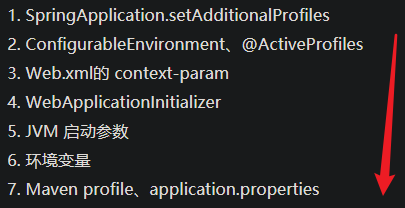


### Filter and Interceptor

#### 过滤器Filter

Servlet中的过滤器Filter是实现了javax.servlet.Filter接口的服务器端程序，主要的用途是设置字符集、控制权限、控制转向、做一些业务逻辑判断等。其工作原理是，只要你在web.xml文件配置好要拦截的客户端请求，它都会帮你拦截到请求，此时你就可以对请求或响应(Request、Response)统一设置编码，简化操作；同时还可进行逻辑判断，如用户是否已经登陆、有没有权限访问该页面等等工作。它是随你的web应用启动而启动的，只初始化一次，以后就可以拦截相关请求，只有当你的web应用停止或重新部署的时候才销毁。

使用Filter完整的流程是：Filter对用户请求进行预处理，接着将请求交给Servlet进行处理并生成响应，最后Filter再对服务器响应进行后处理。

 Filter有如下几个用处。

- 在HttpServletRequest到达Servlet之前，拦截客户的HttpServletRequest。
- 根据需要检查HttpServletRequest，也可以修改HttpServletRequest头和数据。
- 在HttpServletResponse到达客户端之前，拦截HttpServletResponse。
- 根据需要检查HttpServletResponse，也可以修改HttpServletResponse头和数据。

 Filter有如下几个种类。

- 用户授权的Filter：Filter负责检查用户请求，根据请求过滤用户非法请求。
- 日志Filter：详细记录某些特殊的用户请求。
- 负责解码的Filter:包括对非标准编码的请求解码。
- 能改变XML内容的XSLT Filter等。
- Filter可以负责拦截多个请求或响应；一个请求或响应也可以被多个Filter拦截。


 创建Filter必须实现**javax.servlet.Filter接口**，在该接口中定义了如下三个方法。

- void init(FilterConfig config):用于完成Filter的初始化。
- void destory():用于Filter销毁前，完成某些资源的回收。
- void doFilter(**ServletRequest request,ServletResponse response**,FilterChain chain):实现**过滤功能**，该方法就是**对每个请求及响应增加的额外处理**。该方法可以实现**对用户请求进行预处理(ServletRequest request)**，也可实现**对服务器响应进行后处理(ServletResponse response)**—它们的**分界线为是否调用了chain.doFilter(),执行该方法之前，即对用户请求进行预处理；执行该方法之后，即对服务器响应进行后处理**

#### 拦截器Interceptor

**拦截器是在面向切面编程中应用的**，就是在你的service或者一个方法前调用一个方法，或者在方法后调用一个方法。**是基于JAVA的反射机制**。拦截器不是在web.xml，比如struts在struts.xml中配置。

拦截器，在AOP(Aspect-Oriented Programming)中用于在某个方法或字段被访问之前，进行拦截，然后在之前或之后加入某些操作。拦截是AOP的一种实现策略。

pringMVC 中的Interceptor 拦截请求是通过HandlerInterceptor 来实现的。在SpringMVC 中定义一个Interceptor 非常简单，主要有两种方式，

- 第一种方式是要定义的Interceptor类要**实现了Spring 的HandlerInterceptor 接口**，或者是这个类继承实现了HandlerInterceptor 接口的类，比如Spring 已经提供的实现了HandlerInterceptor 接口的抽象类**HandlerInterceptorAdapter** ；
- 第二种方式是实现Spring的**WebRequestInterceptor**接口，或者是继承实现了WebRequestInterceptor的类。

HandlerInterceptor 接口：

1 ）**preHandle** (HttpServletRequest request, HttpServletResponse response, Object handle) 方法，顾名思义，该方法将在请求处理之前进行调用。**SpringMVC 中的Interceptor 是链式的调用的，在一个应用中或者说是在一个请求中可以同时存在多个Interceptor 。**每个Interceptor 的调用会依据它的声明顺序依次执行，而且最先执行的都是Interceptor 中的preHandle 方法，所以可以在这个方法中进行一些前置初始化操作或者是对当前请求的一个预处理，也可以在这个方法中进行一些判断来决定请求是否要继续进行下去。该**方法的返回值是布尔值Boolean类型的，当它返回为false 时，表示请求结束，后续的Interceptor 和Controller 都不会再执行**；当返回值为true 时就会继续调用下一个Interceptor 的preHandle 方法，如果已经是**最后一个Interceptor 的时候就会是调用当前请求的Controller 方法。**

  （2 ）**postHandle** (HttpServletRequest request, HttpServletResponse response, Object handle, ModelAndView modelAndView) 方法，由preHandle 方法的解释我们知道这个方法包括后面要说到的afterCompletion 方法都只能是在当前所属的Interceptor 的preHandle 方法的返回值为true 时才能被调用。postHandle 方法，顾名思义就是在当前请求进行处理之后，也就是Controller 方法调用之后执行，但是它会在DispatcherServlet 进行视图返回渲染之前被调用，所以我们可以在这个方法中对Controller 处理之后的ModelAndView 对象进行操作。**postHandle 方法被调用的方向跟preHandle 是相反的，也就是说先声明的Interceptor 的postHandle 方法反而会后执行**，这和Struts2 里面的Interceptor 的执行过程有点类型。Struts2 里面的Interceptor 的执行过程也是链式的，只是在Struts2 里面需要手动调用ActionInvocation 的invoke 方法来触发对下一个Interceptor 或者是Action 的调用，然后每一个Interceptor 中在invoke 方法调用之前的内容都是按照声明顺序执行的，而invoke 方法之后的内容就是反向的。

  （3 ）**afterCompletion**(HttpServletRequest request, HttpServletResponse response, Object handle, Exception ex) 方法，**该方法也是需要当前对应的Interceptor 的preHandle 方法的返回值为true 时才会执行。**顾名思义，**该方法将在整个请求结束之后，也就是在DispatcherServlet 渲染了对应的视图之后执行。这个方法的主要作用是用于进行资源清理工作的。**


interceptor 的执行顺序大致为：

1. 请求到达 DispatcherServlet
2. DispatcherServlet 发送至 Interceptor ，执行 preHandle
3. 请求达到 Controller
4. 请求结束后，postHandle 执行

```java
import javax.servlet.http.HttpServletRequest;
import javax.servlet.http.HttpServletResponse;

import org.apache.log4j.Logger;
import org.springframework.web.servlet.ModelAndView;
import org.springframework.web.servlet.handler.HandlerInterceptorAdapter;

public class ExecuteTimeInterceptor extends HandlerInterceptorAdapter{

    private static final Logger logger = Logger.getLogger(ExecuteTimeInterceptor.class);

    //before the actual handler will be executed
    public boolean preHandle(HttpServletRequest request,
        HttpServletResponse response, Object handler)
        throws Exception {

        long startTime = System.currentTimeMillis();
        request.setAttribute("startTime", startTime);

        return true;
    }

    //after the handler is executed
    public void postHandle(
        HttpServletRequest request, HttpServletResponse response,
        Object handler, ModelAndView modelAndView)
        throws Exception {

        long startTime = (Long)request.getAttribute("startTime");

        long endTime = System.currentTimeMillis();

        long executeTime = endTime - startTime;

        //modified the exisitng modelAndView
        modelAndView.addObject("executeTime",executeTime);

        //log it
        if(logger.isDebugEnabled()){
           logger.debug("[" + handler + "] executeTime : " + executeTime + "ms");
        }
    }
}
```

使用mvc:interceptors标签来声明需要加入到SpringMVC拦截器链中的拦截器

```java
<mvc:interceptors>  
<!-- 使用bean定义一个Interceptor，直接定义在mvc:interceptors根下面的Interceptor将拦截所有的请求 -->  
<bean class="com.company.app.web.interceptor.AllInterceptor"/>  
    <mvc:interceptor>  
         <mvc:mapping path="/**"/>  
         <mvc:exclude-mapping path="/parent/**"/>  
         <bean class="com.company.authorization.interceptor.SecurityInterceptor" />  
    </mvc:interceptor>  
    <mvc:interceptor>  
         <mvc:mapping path="/parent/**"/>  
         <bean class="com.company.authorization.interceptor.SecuritySystemInterceptor" />  
    </mvc:interceptor>  
</mvc:interceptors>
```

可以利用mvc:interceptors标签声明一系列的拦截器，然后它们就可以形成一个拦截器链，拦截器的执行顺序是按声明的先后顺序执行的，先声明的拦截器中的preHandle方法会先执行，然而它的postHandle方法和afterCompletion方法却会后执行。

在mvc:interceptors标签下声明interceptor主要有两种方式：

- 直接定义一个Interceptor实现类的bean对象。使用这种方式声明的Interceptor拦截器将会对所有的请求进行拦截。
- 使用mvc:interceptor标签进行声明。使用这种方式进行声明的Interceptor可以通过mvc:mapping子标签来定义需要进行拦截的请求路径。


#### 拦截器（Interceptor）和过滤器（Filter）的区别

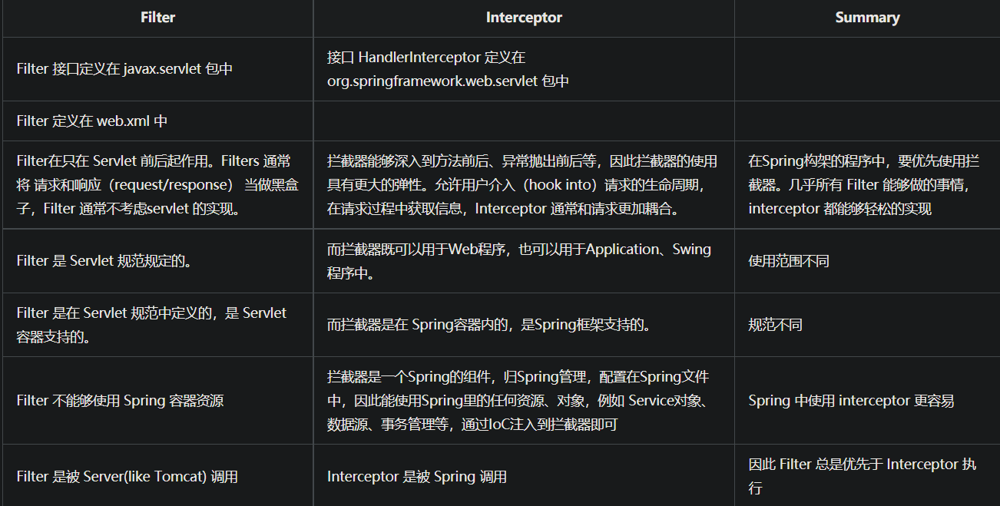

### @Repository

@Repository用在持久层的接口上，这个注解是将接口的一个实现类交给spring管理。

为什么有时候我们不用@Repository来注解接口,我们照样可以注入到这个接口的实现类呢?
1、spring配置文件中配置了MapperScannerConfigurer这个bean，它会扫描持久层接口创建实现类并交给spring管理。

2、接口上使用了@Mapper注解或者springboot中主类上使用了@MapperScan注解，和MapperScannerConfigurer作用一样。

### 热部署

目前的java虚拟机只能实现方法体的热部署，对于整个类的结构修改，仍然需要重启虚拟机，对类重新加载才能完成更新操作。

深层原理是使用了两个ClassLoader，一个ClassLoader加载那些不会改变的类（第三方jar包），另一个ClassLoader加载会改变的类，称为restart ClassLoader，这样在有代码更改的时候，原来的restart ClassLoader被丢弃，重新创建一个restart ClassLoader，由于需要加载的类相对少，所以实现了较快的重启时间。


springboot实现热部署的2种方式

- Spring Loaded
- spring-boot-devtools实现热部署
- 

### 优雅关闭

#### just java

 我们的java程序运行在JVM上，有很多情况可能会突然崩溃掉，比如OOM、用户强制退出、业务其他报错。。。等一系列的问题可能导致我们的进程挂掉。如果我们的进程在运行一些很重要的内容，比如事务操作之类的，很有可能导致事务的不一致性问题。所以，实现应用的优雅关闭还是蛮重要的，起码我们可以在关闭之前做一些记录补救操作。

在java程序中，可以通过添加关闭钩子函数，实现在程序退出时关闭资源、平滑退出的功能。

主要就是通过Runtime.addShutDownHook(Thread hook)来实现的。


```java
public class HookTest {
  public static void main(String[] args) {
 
    // 添加hook thread，重写其run方法
    Runtime.getRuntime().addShutdownHook(new Thread(){
        @Override
        public void run() {
            System.out.println("this is hook demo...");
            // TODO
        }
    });
 
    int i = 0;
    // 这里会报错，我们验证写是否会执行hook thread
    int j = 10/i;
    System.out.println("j" + j);
}
```

**应用场景**：

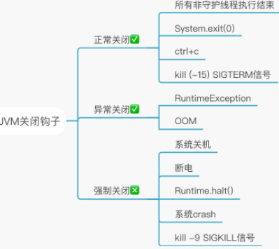

#### not-web spring

调用ApplicationContext.registerShutdownHook()来注册钩子函数，实现bean的destroy

#### web spring

**传统SpringWeb** 指的是基于 Springmvc 和Spring 父子容器的模式

Tomcat的在关闭的过程中会逐一关闭注册在其上的 Servlet 和 Listener 以及 Filter 等。而在关闭Servlet和Listener的这个过程中,**会触发分别关闭 springmvc 和 spring 容器**。

Springmvc 核心就是一个 `servlet`，因此能够直接接收到 `tomcat` 的关机信号

Springmvc 核心 Servlet  FrameworkServlet
 `FrameworkServlet` 实现了 Servlet 的 destroy 方法，并在方法里面调用了 `applicationContext.close()` 的方法，这样spring容器即可以关闭。

```java
public void destroy() {
    this.getServletContext().log("Destroying Spring FrameworkServlet '" + this.getServletName() + "'");
    if (this.webApplicationContext instanceof ConfigurableApplicationContext && !this.webApplicationContextInjected) {
       ((ConfigurableApplicationContext)this.webApplicationContext).close();
    }
}
```

context.registerShutdownHook(); 是一个钩子方法，当jvm关闭退出的时候会调用这个钩子方法

#### Bean 

Bean在销毁前也可以做一些事情

##### destory-method

destory-method和init-method可以在Bean的实例化之后和销毁之前做一些工作

##### @PreDestroy

##### DisposableBean

DisposableBean接口和InitializingBean接口一样，为bean提供了释放资源方法的方式，它只包括destroy方法，凡是继承该接口的类，在bean被销毁之前都会执行该方法。

DisposableBean的destroy()先执行，然后destroy-method后执行

在销毁前，该Bean所依赖的Bean应该不会先销毁


如果需要在关闭前做一些操作，感觉在Bean的销毁前做就可以了，不能等到JVM关闭，那时可能所有Bean都销毁了？


## IOC

### 父子容器及关系

在spring和springmvc进行整合的时候，一般情况下我们会使用不同的配置文件来配置spring和springmvc，因此我们的应用中会存在至少2个ApplicationContext实例，由于是在web应用中，因此最终实例化的是ApplicationContext的子接口WebApplicationContext

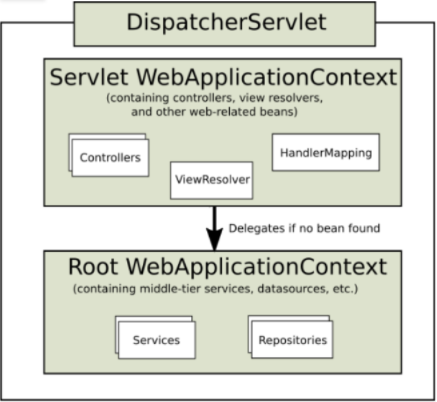

上图中显示了2个WebApplicationContext实例，为了进行区分，分别称之为：Servlet WebApplicationContext、Root WebApplicationContext。 其中：

- Servlet WebApplicationContext：这是对J2EE三层架构中的web层进行配置，如控制器(controller)、视图解析器(view resolvers)等相关的bean。通过spring mvc中提供的DispatchServlet来加载配置，通常情况下，配置文件的名称为spring-servlet.xml。
- Root WebApplicationContext：这是对J2EE三层架构中的service层、dao层进行配置，如业务bean，数据源(DataSource)等。通常情况下，配置文件的名称为applicationContext.xml。在web应用中，其一般通过ContextLoaderListener来加载。

 以下是一个web.xml配置案例

```xml
<?xml version="1.0" encoding="UTF-8"?>  
  
<web-app version="3.0" xmlns="http://java.sun.com/xml/ns/javaee"  
    xmlns:xsi="http://www.w3.org/2001/XMLSchema-instance"  
    xsi:schemaLocation="http://java.sun.com/xml/ns/javaeehttp://java.sun.com/xml/ns/javaee/web-app_3_0.xsd">  
    
    <!—创建Root WebApplicationContext-->
    <context-param>  
        <param-name>contextConfigLocation</param-name>  
        <param-value>/WEB-INF/spring/applicationContext.xml</param-value>  
    </context-param>  
  
    <listener>  
        <listener-class>org.springframework.web.context.ContextLoaderListener</listener-class>  
    </listener>  
    
    <!—创建Servlet WebApplicationContext-->
    <servlet>  
        <servlet-name>dispatcher</servlet-name>  
        <servlet-class>org.springframework.web.servlet.DispatcherServlet</servlet-class>  
        <init-param>  
            <param-name>contextConfigLocation</param-name>  
            <param-value>/WEB-INF/spring/spring-servlet.xml</param-value>  
        </init-param>  
        <load-on-startup>1</load-on-startup>  
    </servlet>  
    <servlet-mapping>  
        <servlet-name>dispatcher</servlet-name>  
        <url-pattern>/*</url-pattern>  
    </servlet-mapping>  
  
</web-app>
```

在上面的配置中：

- 1、ContextLoaderListener会被优先初始化时，其会根据<context-param>元素中contextConfigLocation参数指定的配置文件路径，在这里就是"/WEB-INF/spring/applicationContext.xml”，来创建WebApplicationContext实例。 并调用ServletContext的setAttribute方法，将其设置到ServletContext中，属性的key为”org.springframework.web.context.WebApplicationContext.ROOT”，最后的”ROOT"字样表明这是一个 Root WebApplicationContext。
- 2、DispatcherServlet在初始化时，会根据<init-param>元素中contextConfigLocation参数指定的配置文件路径，即"/WEB-INF/spring/spring-servlet.xml”，来创建Servlet WebApplicationContext。同时，其会调用ServletContext的getAttribute方法来判断是否存在Root WebApplicationContext。如果存在，则将其设置为自己的parent。这就是父子上下文(父子容器)的概念。

​    父子容器的作用在于，当我们尝试从child context(即：Servlet WebApplicationContext)中获取一个bean时，如果找不到，则会委派给parent context (即Root WebApplicationContext)来查找。
如果我们没有通过ContextLoaderListener来创建Root WebApplicationContext，那么Servlet WebApplicationContext的parent就是null，也就是没有parent context。


父子容器的作用主要是划分框架边界, 提升扩展性

如果再父子容器中同时扫描，会在两个父子IOC容器中生成大量的相同bean，这就会造成内存资源的浪费。

因为@RequestMapping一般会和@Controller搭配使。为了防止重复注册bean，建议在spring-servlet.xml配置文件中只扫描含有Controller bean的包，其它的共用bean的注册定义到applicationContext.xml文件中。

```xml
// applicationContext.xml
<context:component-scan base-package="org.xuan.springmvc">
        <context:exclude-filter type="annotation"
           expression="org.springframework.stereotype.Controller"/>
    </context:component-scan>
// spring-servlet.xml
<context:component-scan base-package="org.xuan.springmvc.controller"
                            use-default-filters="false">
        <context:include-filter type="annotation"
              expression="org.springframework.stereotype.Controller"/>
</context:component-scan>
```


还有一篇文章，写得比较好：

https://www.cnblogs.com/hafiz/p/5875740.html


Springmvc  web.xml

Spring的配置 applicationContext.xml

需要学习


web.xml等变化，并非是classes和resource，必须重新打包war


#### Spring & Spring MVC加载

加载顺序

1:web.xml：web应用一经加载，先来找他

​    1）：指明applicationContext的位置

​    2）：引入spring监听，ContextLoaderListener,这样启动web容器时，会自动装配applicaiontContext的配置信息

​    3）：配置springmvc的前端控制器DispatcherServlet

​    4）：配置psringmvc的前端处理器

​    5）：处理文字乱码的监听：这个监听要写在所有监听的最开始

​    6）：德鲁伊 druid监控

2:applicationContext.xml 

  1）：如果有数据配置文件，先加载数据配置文件

  1）：配置数据连接（连接数据库）

  2）：配置sqlSessionFactory（将数据连接交给mybatis，告诉mybatis去哪找*-mapper.xml）

  3）：把所有的mapper生成代理类，注入到spring容器里

  4）：定义事务管理器transcationManager --DataSourceTranscatioManager

  5）：配置声明事务

  6）：配置切入点(aop)

3:wang-servlet.xml

​    1）：指明要扫描的控制层的路径

​    2）：引入mvc注解驱动

​    3）：配置视图解析器org.springframework.web.servlet.view.InternalResourceViewResolver

4：写自己的*-mapper.xml


#### spring的listener的配置问题
1. 如果只有 Spring mvc 的一个 Servlet，listener 可以不用。
2. 但是如果用了Shiro 等，Shiro 用到的 Spring 的配置必须在 listener 里加载。
3. 一般 Dao, Service 的 Spring 配置都会在 listener 里加载，因为可能会在多个 Servlet 里用到，因为父子 Context 的可见性问题，防止重复加载所以在 listener 里加载。

把全部Bean都放在Spring MVC，那么父容器就是null，也是没问题的


Spring singletonObjects管理所有的Bean，打断点以查看

比如看Controller依赖的Service是否是代理类，如果不是则事务是不会生效的


singletonObjects是一级缓存？

三级缓存 循环依赖

### context

#### context:component-scan

context:component-scan的属性	描述
base-package	扫描的基本包路径，可以使用通配符配置
annotation-config	是否激活属性注入注解，false则关闭属性注入注解功能
name-generator	Bean的ID策略生成器。指定你的构造型注解，注册为Bean的ID生成策略
resource-pattern	对资源进行筛选的正则表达式，具体细分在include-filter与exclude-filter中进行
scope-resolver	scope解析器 ，与scoped-proxy只能同时配置一个
scoped-proxy	scope的代理，与scope-resolver只能同时配置一个
use-default-filters	是否使用默认的扫描过滤，默认值true
————————————————

use-default-filters是component-scan标签的一个属性，默认为true，指扫描“comtroller、repository、component、service”所有的注解类，如果为false，指关闭这个默认行为，需要手动指定扫描的注解，所以一般use-default-filters=false与include-filter配合使用。


父容器先加载的，然后子容器再加载，依赖于父容器

#### context:annotation-config

< context:annotation-config> 是用于激活那些已经在spring容器里注册过的bean上面的注解，也就是显示的向Spring注册

AutowiredAnnotationBeanPostProcessor
CommonAnnotationBeanPostProcessor
PersistenceAnnotationBeanPostProcessor
RequiredAnnotationBeanPostProcessor

这四个Processor，注册这4个BeanPostProcessor的作用，就是为了你的系统能够识别相应的注解。BeanPostProcessor就是处理注解的处理器。

- 比如我们要使用@Autowired注解，那么就必须事先在 Spring 容器中声明 AutowiredAnnotationBeanPostProcessor Bean。传统声明方式如下

```html
<bean class="org.springframework.beans.factory.annotation. AutowiredAnnotationBeanPostProcessor "/>
```

- 如果想使用@ Resource 、@ PostConstruct、@ PreDestroy等注解就必须声明CommonAnnotationBeanPostProcessor。传统声明方式如下

```html
<bean class="org.springframework.beans.factory.annotation. CommonAnnotationBeanPostProcessor"/> 
```

- 如果想使用@PersistenceContext注解，就必须声明PersistenceAnnotationBeanPostProcessor的Bean。

```html
<bean class="org.springframework.beans.factory.annotation.PersistenceAnnotationBeanPostProcessor"/> 
```

- 如果想使用 @Required的注解，就必须声明RequiredAnnotationBeanPostProcessor的Bean。同样，传统的声明方式如下：

```html
<bean class="org.springframework.beans.factory.annotation.RequiredAnnotationBeanPostProcessor"/> 
```

一般来说，像@ Resource 、@ PostConstruct、@Antowired这些注解在自动注入还是比较常用，所以如果总是需要按照传统的方式一条一条配置显得有些繁琐和没有必要，于是spring给我们提供< context:annotation-config/>的简化配置方式，自动帮你完成声明。


思考1：假如我们要使用如@Component、@Controller、@Service等这些注解，使用能否激活这些注解呢?

答案：单纯使用< context:annotation-config/>对上面这些注解无效，不能激活！


Spring 给我提供了context:component-scan配置，如下

```html
<context:component-scan base-package=”XX.XX”/> 
```

该配置项其实也包含了自动注入上述 四个processor 的功能，因此当使用 < context:component-scan/> 后，就可以将 < context:annotation-config/> 移除了

#### context:property-placeholder

context:property-placeholder大大的方便了我们一些配置的加载，尤其是数据库方面

```xml
<context:property-placeholder location="classpath:*.properties" ignore-unresolvable="true" file-encoding="utf-8"/>
```

声明后在配置中可以调用location下的properties中的配置项


ignore-unresolvable

同个模块中如果出现多个context:property-placeholder ，location properties文件后，运行时出现Could not resolve placeholder 'key' in string value${key}。原因是在加载第一个context:property-placeholder时会扫描所有的bean，而有的bean里面出现第二个 context:property-placeholder引入的properties的占位符${key}，此时还没有加载第二个property-placeholder，所以解析不了${key}。

解决：

办法一，可以将通过模块的多个property-placeholder合并为一个，将初始化放在一起。

方法二，添加ignore-unresolvable="true"，这样可以在加载第一个property-placeholder时出现解析不了的占位符进行忽略掉。

### 三级缓存

1. `singletonObjects`：用于存放完全初始化好的 bean，**从该缓存中取出的 bean 可以直接使用**
2. `earlySingletonObjects`：提前曝光的单例对象的cache，存放原始的 bean 对象（尚未填充属性），用于解决循环依赖
3. `singletonFactories`：单例对象工厂的cache，存放 bean 工厂对象，用于解决循环依赖

**获取单例Bean的源码如下：**

```java
public class DefaultSingletonBeanRegistry extends SimpleAliasRegistry implements SingletonBeanRegistry {
	...
	@Override
	@Nullable
	public Object getSingleton(String beanName) {
		return getSingleton(beanName, true);
	}
	@Nullable
	protected Object getSingleton(String beanName, boolean allowEarlyReference) {
		Object singletonObject = this.singletonObjects.get(beanName);
		if (singletonObject == null && isSingletonCurrentlyInCreation(beanName)) {
			synchronized (this.singletonObjects) {
				singletonObject = this.earlySingletonObjects.get(beanName);
				if (singletonObject == null && allowEarlyReference) {
					ObjectFactory<?> singletonFactory = this.singletonFactories.get(beanName);
					if (singletonFactory != null) {
						singletonObject = singletonFactory.getObject();
						this.earlySingletonObjects.put(beanName, singletonObject);
						this.singletonFactories.remove(beanName);
					}
				}
			}
		}
		return singletonObject;
	}
	...
	public boolean isSingletonCurrentlyInCreation(String beanName) {
		return this.singletonsCurrentlyInCreation.contains(beanName);
	}
	protected boolean isActuallyInCreation(String beanName) {
		return isSingletonCurrentlyInCreation(beanName);
	}
	...
}
```


1. 先从`一级缓存singletonObjects`中去获取。（如果获取到就直接return）
2. 如果获取不到或者对象正在创建中（`isSingletonCurrentlyInCreation()`），那就再从`二级缓存earlySingletonObjects`中获取。（如果获取到就直接return）
3. 如果还是获取不到，且允许singletonFactories（allowEarlyReference=true）通过`getObject()`获取。就从`三级缓存singletonFactory`.getObject()获取。**（如果获取到了就从**`**singletonFactories**`**中移除，并且放进**`**earlySingletonObjects**`**。其实也就是从三级缓存**`**移动（是剪切、不是复制哦~）**`**到了二级缓存）**

>  **加入`singletonFactories`三级缓存的前提是执行了构造器，所以构造器的循环依赖没法解决** 

`getSingleton()`从缓存里获取单例对象步骤分析可知，Spring解决循环依赖的诀窍：**就在于singletonFactories这个三级缓存**。这个Cache里面都是`ObjectFactory`，它是解决问题的关键。

```javascript
// 它可以将创建对象的步骤封装到ObjectFactory中 交给自定义的Scope来选择是否需要创建对象来灵活的实现scope。  具体参见Scope接口
@FunctionalInterface
public interface ObjectFactory<T> {
	T getObject() throws BeansException;
}
```

 经过ObjectFactory.getObject()后，此时放进了二级缓存`earlySingletonObjects`内。这个时候对象已经实例化了，`虽然还不完美`，但是对象的引用已经可以被其它引用了。


构造器注入循环依赖不能直接解决：

- 用懒加载
- 使用Setter/Field注入
- 使用@PostConstruct
- 实现ApplicationContextAware与InitializingBean


## AOP

### 代理

静态代理：

- 容易编码实现
- 容易理解
- 实现代码量大，不可重用

Java动态代理：

- 基于InvocationHandlerProxy实现
- 可重用
- **只能基于接口实现**
- SpringAPO的优先选择

cglib代理

	- **不能代理final类和私有方法**
	- **能够对接口和类进行代理**
	- **通过生成子类的方式创建代理**

### AOP概念

- 连接点： jointpoint, 需要在程序中插入横切关注点的扩展点，spring只支持方法执行连接点。其他还有类初始化、方法执行、字段调用等
- 切入点：pointcut，连接点的集合
- 通知：advice，在连接点上执行的增强行为
- 切面：aspect，横切关注点的模块化
- 目标对象
- APO代理：代理模式创建对象，从而实现在连接点插入通知
- 织入：**weaving，织入是一个过程，是将切面应用到目标对象从而创建出AOP代理对象的过程，**织入可以发生在**编译期、类装载期、运行期**。
- 前置通知
- 后置通知：
  - 返回通知
  - 异常通知
  - 后置通知
- 环绕通知

### CGLIB

#### FastClass

FastClass不使用反射类（Constructor或Method）来调用委托类方法，而是动态生成一个新的类（继承FastClass），向类中写入委托类实例直接调用方法的语句，用**模板方式解决Java语法不支持问题**，同时改善Java反射性能。

**动态类为委托类方法调用语句建立索引，使用者根据方法签名（方法名+参数类型）得到索引值**，再通过索引值进入相应的方法调用语句，得到调用结果。

```java
public abstract class FastClass{

    // 委托类
    private Class type;
    
    // 子类访问构造方法
    protected FastClass() {}
    protected FastClass(Class type) {
        this.type = type;
    }
    
    // 创建动态FastClass子类
    public static FastClass create(Class type) {
        // Generator：子类生成器，继承AbstractClassGenerator
        Generator gen = new Generator();
        gen.setType(type);
        gen.setClassLoader(type.getClassLoader());
        return gen.create();
    }
    
    /**
     * 调用委托类方法
     *
     * @param name 方法名
     * @param parameterTypes 方法参数类型
     * @param obj 委托类实例
     * @param args 方法参数对象
     */
    public Object invoke(String name, Class[] parameterTypes, Object obj, Object[] args) {
        return invoke(getIndex(name, parameterTypes), obj, args);
    }
    
    /**
     * 根据方法描述符找到方法索引
     *
     * @param name 方法名
     * @param parameterTypes 方法参数类型
     */
    public abstract int getIndex(String name, Class[] parameterTypes);
    
    
    /**
     * 根据方法索引调用委托类方法
     *
     * @param index 方法索引
     * @param obj 委托类实例
     * @param args 方法参数对象
     */
    public abstract Object invoke(int index, Object obj, Object[] args);
    
    /**
     * 调用委托类构造方法
     * 
     * @param parameterTypes 构造方法参数类型
     * @param args 构造方法参数对象
     */
    public Object newInstance(Class[] parameterTypes, Object[] args) throws {
        return newInstance(getIndex(parameterTypes), args);
    }
    
    /**
     * 根据构造方法描述符（参数类型）找到构造方法索引
     *
     * @param parameterTypes 构造方法参数类型
     */
    public abstract int getIndex(Class[] parameterTypes);
    
    /**
     * 根据构造方法索引调用委托类构造方法
     *
     * @param index 构造方法索引
     * @param args 构造方法参数对象
     */
    public abstract Object newInstance(int index, Object[] args);
    
}
```

- 动态子类

```java
public class DelegateClass$$FastClassByCGLIB$$4af5b667 extends FastClass {
    
    /**
     * 动态子类构造方法
     */
    public DelegateClass$$FastClassByCGLIB$$4af5b667(Class delegateClass) {
        super(delegateClass);
    }

    /**
     * 根据方法签名得到方法索引
     *
     * @param name 方法名
     * @param parameterTypes 方法参数类型
     */
    public int getIndex(String methodName, Class[] parameterTypes) {
        switch(methodName.hashCode()) {
            
            // 委托类方法add索引：0
            case 96417:
                if (methodName.equals("add")) {
                    switch(parameterTypes.length) {
                        case 2:
                            if (parameterTypes[0].getName().equals("java.lang.String") && 
                                parameterTypes[1].getName().equals("int")) {
                                return 0;
                            }
                    }
                }
                break;
            
            // 委托类方法update索引：1
            case -838846263:
                if (methodName.equals("update")) {
                    switch(parameterTypes.length) {
                        case 0:
                            return 1;
                    }
                }
                break;
                
            // Object方法equals索引：2
            case -1295482945:
                if (methodName.equals("equals")) {
                    switch(parameterTypes.length) {
                        case 1:
                            if (parameterTypes[0].getName().equals("java.lang.Object")) {
                                return 2;
                            }
                    }
                }
                break;
            
            // Object方法toString索引：3
            case -1776922004:
                if (methodName.equals("toString")) {
                    switch(parameterTypes.length) {
                        case 0: return 3;
                    }
                }
                break;
            
            // Object方法hashCode索引：4
            case 147696667:
                if (methodName.equals("hashCode")) {
                    switch(parameterTypes.length) {
                        case 0:
                            return 4;
                    }
                }
        }

        return -1;
    }
    
    /**
     * 根据方法索引调用委托类方法
     *
     * @param methodIndex 方法索引
     * @param delegateInstance 委托类实例
     * @param parameterValues 方法参数对象
     */
    public Object invoke(int methodIndex, Object delegateInstance, Object[] parameterValues) {
        DelegateClass instance = (DelegateClass) delegateInstance;
        int index = methodIndex;
        try {
            switch(index) {
                case 0:
                    // 委托类实例直接调用方法语句
                    return new Boolean(instance.add((String)parameterValues[0], 
                            ((Number)parameterValues[1]).intValue()));
                case 1:
                    instance.update();
                    return null;
                case 2:
                    return new Boolean(instance.equals(parameterValues[0]));
                case 3:
                    return instance.toString();
                case 4:
                    return new Integer(instance.hashCode());
            }
        } catch (Throwable t) {
            throw new InvocationTargetException(t);
        }

        throw new IllegalArgumentException("Cannot find matching method/constructor");
    }

    /**
     * 根据构造方法描述符（参数类型）找到构造方法索引
     *
     * @param parameterTypes 构造方法参数类型
     */
    public int getIndex(Class[] parameterTypes) {
        switch(parameterTypes.length) {
            // 无参构造方法索引：0
            case 0:
                return 0;
            
            // 有参构造方法索引：1
            case 1:
                if (parameterTypes[0].getName().equals("java.lang.String")) {
                    return 1;
                }
            default:
                return -1;
        }
    }
    
    /**
     * 根据构造方法索引调用委托类构造方法
     *
     * @param methodIndex 构造方法索引
     * @param parameterValues 构造方法参数对象
     */
    public Object newInstance(int methodIndex, Object[] parameterValues) {
        // 创建委托类实例
        DelegateClass newInstance = new DelegateClass;
        DelegateClass newObject = newInstance;
        int index = methodIndex;
        try {
            switch(index) {
                // 调用构造方法（<init>）
                case 0:
                    newObject.<init>();
                    return newInstance;
                case 1:
                    newObject.<init>((String)parameterValues[0]);
                    return newInstance;
            }
        } catch (Throwable t) {
            throw new InvocationTargetException(t);
        }

        throw new IllegalArgumentException("Cannot find matching method/constructor");
    }

    public int getMaxIndex() {
        return 4;
    }
}
```


原理直观案例：

```java
public class FastclassTest {
	public static void main(String[] args) {
		Test1 t1 = new Test1();
		Test2 fc = new Test2();
		int index = fc.getIndex("f()V");
		fc.invoke(index, t1, null);
	}
}

class Test1 {
	public void f() {
		System.out.println("f method");
	}

	public void g() {
		System.out.println("g method");
	}
}

class Test2 {
	public Object invoke(int index, Object o, Object[] ol) {
		Test1 t = (Test1) o;
		switch (index) {
		case 1:
			t.f();
			return null;
		case 2:
			t.g();
			return null;
		}
		return null;
	}

	public int getIndex(String signature) {
		switch (signature.hashCode()) {
		case 3078479:
			return 1;
		case 3108270:
			return 2;
		}
		return -1;
	}
}
```


Spring CGLIB 

一个Service会生成三个代理类：

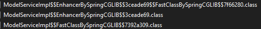

CGLIB不使用反射调用，在Spring源码中也有写，在方法代理那个类中，说比反射效率高，确实，通过fastclass，使用模板方法模型，避免重量级的反射，可以大大加快速度。


## MVC

架构：


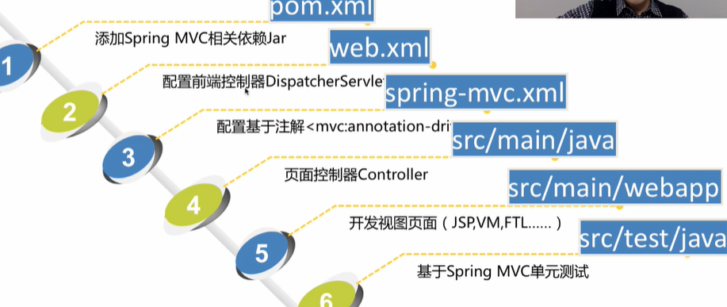


MVC测试

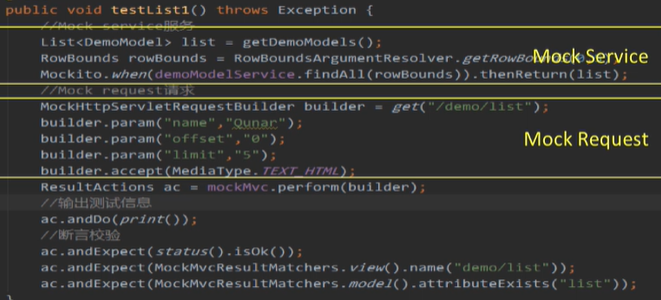

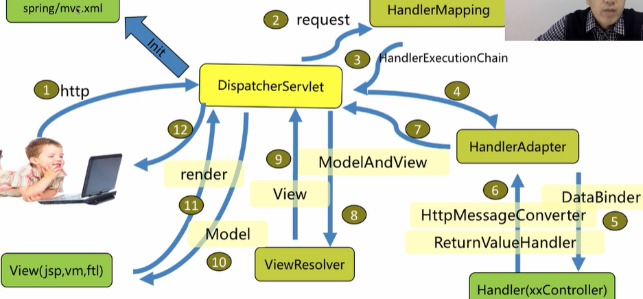

### Servlet

#### 配置

```xml
    <servlet>
        <servlet-name>dispatcher</servlet-name>
        <servlet-class>org.springframework.web.servlet.DispatcherServlet</servlet-class>
        <load-on-startup>1</load-on-startup>
```

在servlet的配置当中，<load-on-startup>1</load-on-startup>的含义是：

标记容器是否在启动的时候就加载这个servlet。

当值为0或者大于0时，表示容器在应用启动时就加载这个servlet；

当是一个负数时或者没有指定时，则指示容器在该servlet被选择时才加载。


 web.xml里 listener加载顺序优先于servlet , 相同的servlet如果load-on-startup的值越小,加载优先级越高 。如果你的spring mvc配置文件在WEB-INF下面且名字是XXX-servlet就可以不用配置在web.xml里，否则就要


#### web容器的启动

1、web项目启动的时候，容器会优先读取web.xml文件，并且先找到<listener></listener>和<context-param></context-param>两个节点；

2、容器会创建一个ServlextContext上下文，并解析<context-param></context-param>节点，存入上下文中；

3、容器创建listener实例，并执行listener实例中的contextInitialized(ServletContextEvent sce)方法；

4、执行filter节点信息；

5、最后创建servlet；


## SpringBoot

### 特点

- 丰富的starter简化pom配置
- 智能装配autoconfigure
- 可视化运行信息
- 不要求xml配置
- 约定大于配置


springboot插件

spring-boot-maven-plugin


> <scope>provided</scope>


#### AutoConfiguration

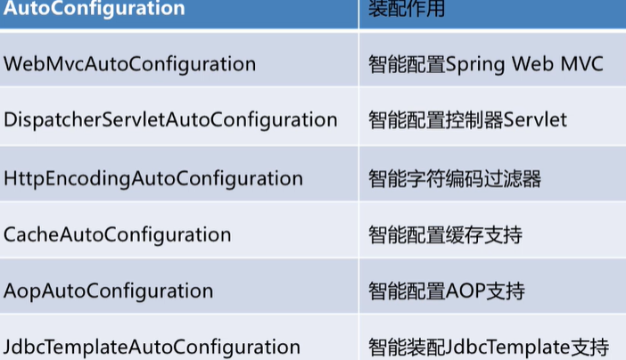

@Import


### 监控

运维监控 Starter Actuator

```
http://ip:port/manage
```


### 资源引入

```java
@ImportResource(value = {
        "classpath:applicationContext.xml"
})
```

@ImportResource：导入Spring的配置文件，让配置文件里面的内容生效；

### 注解

#### 条件注解

 SpringBoot条件注解**@Conditional**，可用于**根据某个特定的条件来判断是否需要创建某个特定的Bean**。**SpringBoot自动配置功能里面就大量的使用了条件注解**。

@Conditional注解需要和Condition接口搭配一起使用。通过对应Condition接口来告知是否满足匹配条件。

```java
@Target({ElementType.TYPE, ElementType.METHOD})
@Retention(RetentionPolicy.RUNTIME)
@Documented
public @interface Conditional {

   /**
    * All {@link Condition Conditions} that must {@linkplain Condition#matches match}
    * in order for the component to be registered.
    所有用于匹配的Condition接口(实现该接口的类)，只有这些类都返回true才认为是满足条件
    */
   Class<? extends Condition>[] value();
}
```

@Conditional注解可以添加在@Configuration、@Component、@Service等修饰的类上用于控制对应的Bean是否需要创建，或者添加在@Bean修饰的方法上用于控制方法对应的Bean是否需要创建。

注意：@Conditional添加在@Configuration修饰的类上时，用于控制该类和该类里面所有添加的@Bean方法对应的Bean是否需要创建。


@Conditional扩展注解：

| 条件注解                        | Condition处理类           | 实例                                                         | 解释                                                         |
| :------------------------------ | :------------------------ | ------------------------------------------------------------ | ------------------------------------------------------------ |
| @ConditionalOnBean              | OnBeanCondition           | @ConditionalOnBean(DataSource.class)                         | Spring容器中不存在对应的实例生效                             |
| @ConditionalOnMissingBean       | OnBeanCondition           | @ConditionalOnMissingBean(name = "redisTemplate")            | Spring容器中不存在对应的实例生效                             |
| @ConditionalOnSingleCandidate   | OnBeanCondition           | @ConditionalOnSingleCandidate(FilteringNotifier.class)       | Spring容器中是否存在且只存在一个对应的实例，或者虽然有多个但 是指定首选的Bean生效 |
| @ConditionalOnClass             | OnClassCondition          | @ConditionalOnClass(RedisOperations.class)                   | 类加载器中存在对应的类生效                                   |
| @ConditionalOnMissingClass      | OnClassCondition          | @ConditionalOnMissingClass(RedisOperations.class)            | 类加载器中不存在对应的类生效                                 |
| @ConditionalOnExpression        | OnExpressionCondition     | @ConditionalOnExpression(“’${server.host}’==’localhost’”)    | 判断SpEL 表达式成立生效                                      |
| @ConditionalOnJava              | OnJavaCondition           | @ConditionalOnJava(JavaVersion.EIGHT)                        | 指定Java版本符合要求生效                                     |
| @ConditionalOnProperty          | OnPropertyCondition       | @ConditionalOnProperty(prefix = “spring.aop”, name = “auto”, havingValue = “true”, matchIfMissing = true) | 应用环境中的属性满足条件生效                                 |
| @ConditionalOnResource          | OnResourceCondition       | @ConditionalOnResource(resources=”mybatis.xml”)              | 存在指定的资源文件生效                                       |
| @ConditionalOnWebApplication    | OnWebApplicationCondition |                                                              | 当前应用是Web应用生效                                        |
| @ConditionalOnNotWebApplication | OnWebApplicationCondition |                                                              | 当前应用不是Web应用生效                                      |

上面的扩展注解我们可以简单的分为以下几类：

- Bean作为条件：@ConditionalOnBean、@ConditionalOnMissingBean、@ConditionalOnSingleCandidate。
- 类作为条件：@ConditionalOnClass、@ConditionalOnMissingClass。
- SpEL表达式作为条件：@ConditionalOnExpression。
- JAVA版本作为条件: @ConditionalOnJava
- 配置属性作为条件：@ConditionalOnProperty。
- 资源文件作为条件：@ConditionalOnResource。
- 是否Web应用作为判断条件：@ConditionalOnWebApplication、@ConditionalOnNotWebApplication。

https://www.jianshu.com/p/e21b9079a23c


### SpringBoot几个官方依赖

#### spring-boot-devtools

DevTools通过提供自动重启和LiveReload功能，使您更快、更轻松地开发Spring Boot应用程序。除此之外，它还将各种属性设置为更适合本地开发的值。此外，它允许您远程连接到您的应用程序，并仍然使用其大部分功能。在生产中运行时，不要使用DevTools。

```xml
<dependency>
    <groupId>org.springframework.boot</groupId>
    <artifactId>spring-boot-devtools</artifactId>
    <optional>true</optional>
</dependency>
```

**依赖项声明为可选**。这个很重要。这可以**防止DevTools依赖性传递性地应用于依赖于你项目的其他模块**。

功能：

- 自动重启：每当类路径中的文件发生更改时，DevTools会自动重新启动正在运行的应用程序，并应用新的更改。重新启动应用程序的速度比平常快得多，DevTools使用两个类加载器 - base和restart。base类加载器加载不更改的类。你正在使用的类由restart类加载器加载。每当触发重启时，都会重新启动并重新创建restart的类加载器。

  

  在IDE中触发重新启动：只要类路径发生更改，就会触发重新启动。但是，这取决于您的IDE。这意味着，仅仅更改.java文件是不够的。**重要的是您的IDE实际上更新.class了类路径上的文件**：您需要**构建项目**

  

- 权限开发：仅用于开发，而不用于生产。如果您的应用程序检测到您正在生产中运行，则会自动禁用DevTools。部署时有两种模式：**fully packaged artifact完全打包和exploded artifact** ；采取前者打包方式Spring会认为是生产应用；后者认为是开发模式，在Idea等IDE中采取的是后者。

- live reload

- 远程连接

### 配置读取

#### @Value方式获取

@Value是org.springframework.beans.factory.annotation.Value

我们在配置文件application.properties中新增如下配置，用于测试@Value方式获取配置文件的值

 @Value("${value.request.encrypted.key}")

使用@Value方式获取配置文件的值，如果配置项的key不存在，也没有设置默认值，则程序直接报错
使用@Value方式默认值的设置方法：配置项的key后面加冒号然后写默认值如：${配置项的key：默认值}
使用@Value方式如果是配置文件里配置项太多，并且使用的地方过多的时候，维护和管理不太方便

#### Environment对象获取

使用很简单，直接使用spring的注解@Autowired引入即可

```java
    @Autowired
    private Environment environment;
```

Environment 是org.springframework.core.env.Environment

我们继续在配置文件application.properties中新增如下配置，用于测试Environment 方式获取配置文件的值

```text
#定义Environment的变量测试
#系统组
envir.system.group=Alian
#系统组
envir.system.level=1
#系统名称
envir.system.name=administrator
#系统密码
envir.system.password=e6fa5927cc37437ac6cbe5e988288f80
```

@Service
public class EnvironmentService {

```java 
@Autowired
private Environment environment;

@PostConstruct
public void testEnvironment() {
    System.out.println("-------------------Environment测试开始-------------------");
    System.out.println("Environment测试获取的系统组：" + environment.getProperty("envir.system.group"));
    System.out.println("Environment测试获取的系统级别：" + environment.getProperty("envir.system.level"));
    System.out.println("Environment测试获取的系统名：" + environment.getProperty("envir.system.name"));
    System.out.println("Environment测试获取的系统密码：" + environment.getProperty("envir.system.password"));
    //如果配置文件未设置该key的值，则使用默认值
    System.out.println("Environment测试获取的默认值设置：" + environment.getProperty("envir.system.init", "未设置初始化参数"));
    System.out.println("-------------------Environment测试结束-------------------");
}
```
- 使用Environment对象获取配置文件的值，最好使用带默认值的方法：getProperty(“配置项key”,“默认值”)，避免null值
- 使用Environment对象还可以获取到一些系统的启动信息，当然如果配置项过多也会有维护管理方面的问题

#### @ConfigurationProperties方式获取

为了更契合java的面向对象，我们采用自动配置的方式映射配置文件属性，配置完成后直接当做java对象即可使用。我们继续在配置文件application.properties中新增如下配置，用于测试@ConfigurationProperties方式获取配置文件的值

```text
##定义Properties的变量测试
#作者
app.author-name=Alian
#博客网站
app.web-url=https://blog.csdn.net/Alian_1223
#小程序应用id
app.micro-applet.app-id=wx4etd7e3803c6c555
#小程序应用secretId
app.micro-applet.secret-id=e6fa5627cc57437ac8cbe5e988288f80
#小程序超时时间
app.micro-applet.expire-time=3600
```

@Data
@Component
@ConfigurationProperties(value = "app")
public class AppProperties {

```java 
/**
 * 作者名称
 */
private String authorName = "";

/**
 * 博客网站
 */
private String webUrl = "https://blog.csdn.net/Alian_1223";

/**
 * 小程序配置
 */
private MicroApplet microApplet;

@Data
public static class MicroApplet {
    /**
     * 应用id
     */
    private String appId = "";
    /**
     * secretId
     */
    private String secretId = "";
    /**
     * 过期时间
     */
    private int expireTime = 30;
}
```
@ConfigurationProperties(value = “app”)表示的配置文件里属性的前缀都是app开头
配置类上记得加上@Data和@Component注解（或者在启动类上加上@EnableConfigurationProperties(value = AppProperties.class)）
如果有内部类对象，记得加上@Data，不然无法映射数据
.properties类型文件映射规则，短横线(-)后面的首个字母会变成大写，同时注意有内部类时的写法
使用方法也很简单，直接使用spring的注解@Autowired引入即可

    @Autowired
    private AppProperties appProperties;
@Service
public class PropertiesService {

    @Autowired
    private AppProperties appProperties;
    
    @PostConstruct
    public void testProperties() {
        System.out.println("-------------------Properties测试开始-------------------");
        System.out.println("Properties测试获取的作者：" + appProperties.getAuthorName());
        System.out.println("Properties测试获取的博客地址：" + appProperties.getWebUrl());
        System.out.println("Properties测试获取的小程序应用id：" + appProperties.getMicroApplet().getAppId());
        System.out.println("Properties测试获取的小程序SecretId：" + appProperties.getMicroApplet().getSecretId());
        System.out.println("Properties测试获取的小程序超时时间：" + appProperties.getMicroApplet().getExpireTime());
        System.out.println("-------------------Properties测试结束-------------------");
    }
#### @PropertySource方式获取

有时候我们会有一些特殊意义的配置，会单独用一个配置文件存储，比如数据库配置连接参数，同样我们在application.properties同级目录新建一个配置文件alian.properties，内容如下：

```text
alian.properties

#博客用户
csdn.user-name=Alian
#博客密码
csdn.password=123456
#博客地址
csdn.blog-url=https://blog.csdn.net/Alian_1223
```


    @Data
    @Component
    @ConfigurationProperties(prefix = "csdn")
    @PropertySource(value = "classpath:alian.properties", encoding = "UTF-8", ignoreResourceNotFound = true) 
    public class ALianProperties {
        private String userName;
    
        private String password;
    
        private String blogUrl;
    
        private String blogDesp;
    }


### Spring Boot Test

Spring Test与JUnit等其他测试框架结合起来，提供了便捷高效的测试手段。而Spring Boot Test 是在Spring Test之上的再次封装，增加了切片测试，增强了mock能力。

Spring Test与JUnit支持三种测试种类：

- 单元测试：一般面向方法，编写测试成本较大
- **切片测试**：面向难以测试的便捷功能，涉及注解有@RunWith、@WebMvcTest等
- **功能测试**：一般面向整个完整的业务功能，同时也可以使用切面测试中的mock能力，推荐使用。涉及到的注解主要有@**RunWith**、@**SpringBootTest**等

功能测试过程中的几个关键要素及支撑方式如下：

- 测试运行环境：**通过@RunWith 和 @SpringBootTest启动spring容器**。
- mock能力：Mockito提供了强大mock功能。
- 断言能力：AssertJ、Hamcrest、JsonPath提供了强大的断言能力。

```xml
<dependency>
  <groupId>org.springframework.boot</groupId>
  <artifactId>spring-boot-starter-test</artifactId>
  <scope>test</scope>
</dependency>
```

一旦依赖了spring-boot-starter-test，下面这些类库将被一同依赖进去：

- **JUnit**：java测试事实上的标准，默认依赖版本是4.12（**JUnit5和JUnit4差别比较大，集成方式有不同**）。
- **Spring Test** & **Spring Boot Test**：Spring的测试支持。
- **AssertJ**：提供了**流式的断言方式**。
- **Hamcrest**：提供了丰富的**matcher**。
- **Mockito：mock**框架，可以按类型创建mock对象，可以根据方法参数指定特定的响应，也支持对于mock调用过程的断言。
- **JSONassert**：为JSON提供了断言功能。
- **JsonPath**：为JSON提供了**XPATH**功能。

**@RunWith是Junit4提供的注解，将Spring和Junit链接了起来**。假如使用Junit5，不再需要使用@ExtendWith注解，@SpringBootTest和其它@*Test默认已经包含了该注解。

@**SpringBootTest替代了spring-test中的@ContextConfiguration注解**，目的是加载ApplicationContext，启动spring容器。

使用@SpringBootTest时并没有像@ContextConfiguration一样显示指定locations或classes属性，原因在于@SpringBootTest注解会自动检索程序的配置文件，检索顺序是从当前包开始，逐级向上查找被@SpringBootApplication或@SpringBootConfiguration注解的类。


由于web服务是最常见的服务，且我们对于web服务的测试有一些特殊的期望，所以@SpringBootTest注解中，给出了webEnvironment参数指定了web的environment，该参数的值一共有四个可选值：

- MOCK：此值为默认值，该类型提供一个mock环境，可以和@AutoConfigureMockMvc或@AutoConfigureWebTestClient搭配使用，开启Mock相关的功能。注意此时内嵌的服务（servlet容器）并没有真正启动，也不会监听web服务端口。
- RANDOM_PORT：启动一个真实的web服务，监听一个随机端口。
- DEFINED_PORT：启动一个真实的web服务，监听一个定义好的端口（从application.properties读取）。
- NONE：启动一个非web的ApplicationContext，既不提供mock环境，也不提供真实的web服务。

注：如果当前服务的classpath中没有包含web相关的依赖，spring将启动一个非web的ApplicationContext，此时的webEnvironment就没有什么意义了。


所谓**切片测试**，官网文档称为 “slice” of your application，实际上是对**一些特定组件的称呼**。这里的slice并非单独的类（毕竟普通类只需要基于JUnit的单元测试即可），而是介于单元测试和集成测试中间的范围。

**slice是指一些在特定环境下才能执行的模块，比如MVC中的Controller**、JDBC数据库访问、Redis客户端等，**这些模块大多脱离特定环境后不能独立运行**，假如spring没有为此提供测试支持，开发者只能启动完整服务对这些模块进行测试，这在一些复杂的系统中非常不方便，所以spring为这些模块提供了测试支持，使开发者有能力单独对这些模块进行测试。

通过@*Test开启具体模块的测试支持，开启后spring仅加载相关的bean，无关内容不会被加载。

使用@WebMvcTest用来校验controllers是否正常工作的示例：

```java
@RunWith(SpringRunner.class)
@WebMvcTest(IndexController.class)
public class SpringBootTest {
    @Autowired
    private MockMvc mvc;
    
    @Test
    public void testExample() throws Exception {
        //groupManager访问路径
        //param传入参数
        MvcResult result=mvc.perform(MockMvcRequestBuilders.post("/groupManager").param("pageNum","1").param("pageSize","10")).andReturn();
        MockHttpServletResponse response = result.getResponse();
        String content = response.getContentAsString();
        List<JtInfoDto> jtInfoDtoList = GsonUtils.toObjects(content, new TypeToken<List<JtInfoDto>>() {}.getType());
        for(JtInfoDto infoDto : jtInfoDtoList){
            System.out.println(infoDto.getJtCode());
        }

    }
}
// 使用@WebMvcTest和MockMvc搭配使用，可以在不启动web容器的情况下，对Controller进行测试（注意：仅仅只是对controller进行简单的测试，如果Controller中依赖用@Autowired注入的service、dao等则不能这样测试）。
```

#### @SpringBootTest与@RunWith

idea中springboot项目不加@RunWith仍然可以运行

标准测试类里是要有@RunWith的，作用是告诉java你这个类通过用什么运行环境运行，例如启动和创建spring的应用上下文。否则你需要为此在启动时写一堆的环境配置代码。你在IDEA里去掉@RunWith仍然能跑是因为在IDEA里识别为一个JUNIT的运行环境，相当于就是一个自识别的RUNWITH环境配置。但在其他IDE里并没有。
所以，为了你的代码能在其他IDE里边正常跑，建议还是加@RunWith

### 数据源

Spring主从数据库的配置和动态数据源切换原理

https://cloud.tencent.com/developer/article/1472124


### Spring Boot Starter

#### 基本概念

Starter是Spring Boot中的一个非常重要的概念，Starter相当于模块，它能将模块所需的依赖整合起来并对模块内的Bean根据环境（ 条件）进行自动配置。使用者只需要依赖相应功能的Starter，无需做过多的配置和依赖，Spring Boot就能自动扫描并加载相应的模块。

```text
1.它整合了这个模块需要的依赖库；
2.提供对模块的配置项给使用者；
3.提供自动配置类对模块内的Bean进行自动装配；
```

例如，在Maven的依赖中加入spring-boot-starter-web就能使项目支持Spring MVC，并且Spring Boot还为我们做了很多默认配置，无需再依赖spring-web、spring-webmvc等相关包及做相关配置就能够立即使用起来。

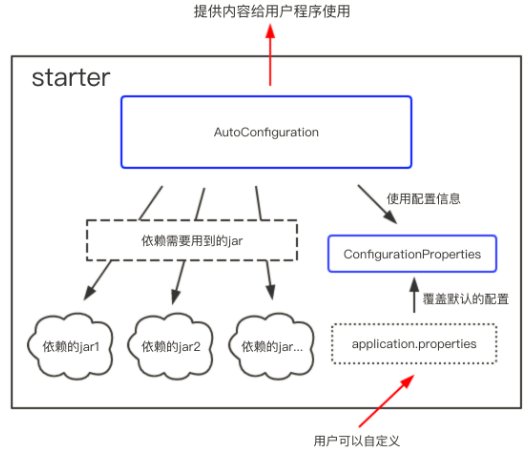

#### 开发步骤

```text
1.新建Maven项目，在项目的POM文件中定义使用的依赖；
2.新建配置类(ConfigurationProperties)，写好配置项和默认的配置值，指明配置项前缀；
3.新建自动装配类(AutoConfiguration)，使用@Configuration和@Bean来进行自动装配,实现所有starter应该完成的操作；
4.新建spring.factories文件，指定Starter的自动装配类(上面这个类)；
```


##### 建立SpringBoot工程

建工程，引入依赖

需要注意：新建工程必须要继承spring-boot-starters工程

```xml
<!-- 自定义starter都应该继承自该依赖 -->
<!-- 如果自定义starter本身需要继承其它的依赖，可以参考 https://stackoverflow.com/a/21318359 解决 -->
 <parent>
     <groupId>org.springframework.boot</groupId>
     <artifactId>spring-boot-starters</artifactId>
     <version>2.2.13.RELEASE</version>
 </parent>
```

此外。由于要使用SpringBoot的一些注解，也必须依赖springboot starter：

```xml
<dependency>
    <groupId>org.springframework.boot</groupId>
    <artifactId>spring-boot-starter</artifactId>
</dependency>
```

##### 编写配置类

配置前缀需要指定，用户可以通过applicaiton.yml覆盖配置

```java
@Data
@ConfigurationProperties(prefix = "email.sender")
public class EmailSenderProperties {
    /**
     * 发邮件的URL/API
     */
    private String host = "https://edwinxu.xyz";

    /**
     * port
     * */
    private int port = 7777;

    /**
     * 和host、ip组成起来构成访问接口，默认使用POST提交邮件发送请求
     * */
    private String api = "/email/send";

    /**
     * 和 host:port/api 等价
     * */
    private String url = "https://edwinxu.xyz:7777/email/send";
}
```

##### 编写业务类

```java
/**
 * 邮件发送client
 *
 * @author taoxu.xu
 * @date 8/18/2021 7:26 PM
 */
@Data
public class EmailSenderClient {
    /**
     * 目标邮箱
     */
    private String[] emails;
    /**
     * 主题
     */
    private String subject;
    /**
     * 正文
     */
    private String content;

    /**
     * 附件
     */
    private File[] files;

    /**
     * 发送邮件调用的URI， 这里赋予一个默认值，在autoconfig时应该从获取配置进行覆盖。
     */
    private String uri = "https://edwinxu.xyz:7777/email/send";

    public EmailSenderClient() {
    }

    public EmailSenderClient(String[] emails, String subject, String content, File[] files) {
        this.emails = emails;
        this.subject = subject;
        this.content = content;
        this.files = files;
    }


    private static final ContentType OCTEC_STREAM = ContentType.create("application/octet-stream", StandardCharsets.UTF_8);

    public void send() {
        if (emails == null || emails.length == 0) {
            throw new EmailNotSetException();
        }
        if (subject == null || subject.isEmpty()) {
            throw new SubjectNotSetException();
        }
        send(emails, subject, content, files);
    }

    /**
     * 发送邮件
     * */
    public void send(String[] emails, String subject, String content, File... files) {
        final CloseableHttpClient httpClient = HttpClients.createDefault();

        HttpPost httpPost = new HttpPost(uri);

        // 设置长连接
        httpPost.setHeader("Connection", "keep-alive");
        // 创建 HttpPost 参数
        List<BasicNameValuePair> params = new ArrayList<BasicNameValuePair>();
        // 拼接邮箱
        String targetEmails = "";
        for (String email : emails) {
            targetEmails += email + ";";
        }

        final StringBody emailBody = new StringBody(targetEmails, ContentType.create("text/plain", Consts.UTF_8));
        final StringBody subjectBody = new StringBody(subject, ContentType.create("text/plain", Consts.UTF_8));
        final StringBody contentBody = new StringBody(content, ContentType.create("text/plain", Consts.UTF_8));


        final MultipartEntityBuilder builder = MultipartEntityBuilder.create();
        builder.setCharset(StandardCharsets.UTF_8);

        // 依次添加文件
        if (files != null) {
            for (File f : files) {
                if (f != null) {
                    builder.addBinaryBody("files", f, OCTEC_STREAM, f.getName());
                }
            }
        }

        builder.addPart("emails", emailBody);
        builder.addPart("subject", subjectBody);
        builder.addPart("content", contentBody);

        httpPost.setEntity(builder.build());

        CloseableHttpResponse response = null;
        try {
            response = httpClient.execute(httpPost);
            final int statusCode = response.getStatusLine().getStatusCode();
            // 通过状态码判断是否成功
            if (statusCode != 200) {
                throw new EmailSendFailedException();
            }
        } catch (IOException e) {
            throw new EmailSendFailedException(e.getMessage());
        } finally {
            try {
                if (httpClient != null) {
                    httpClient.close();
                }
                if (response != null) {
                    response.close();
                }
            } catch (IOException e) {
                e.printStackTrace();
            }
        }
    }
}
```

##### 编写spring.factories

在resources/META-INF下建立spring.factories文件

写入上面定义的自动装配类进行配置，在使用时会自动装配，生成指定的业务Bean，以方便使用。

```text
org.springframework.boot.autoconfigure.EnableAutoConfiguration=\
cn.edw.emailsender.autoconfig.EmailSenderAutoConfiguration
```


##### 编写AutoConfiguration类

引入配置，生成业务Bean。

```java
@EnableConfigurationProperties(EmailSenderProperties.class)
@Configuration
public class EmailSenderAutoConfiguration {
    @Resource
    private EmailSenderProperties properties;

    @Bean
    @ConditionalOnMissingBean
    public EmailSenderClient getEmailSenderClient() {
        EmailSenderClient emailSenderClient = new EmailSenderClient();
        // 设置EmailSenderClient请求发送邮件的URI
        String url = properties.getUrl();
        if (url == null || url.isEmpty()) {
            String api = properties.getApi();
            if (api == null) {
                api = "";
            }
            // 拼接URI
            url = properties.getHost() + ":" + properties.getPort()
                    + (api.startsWith("/") ? api.substring(1) : api);
        }
        emailSenderClient.setUri(url);
        return emailSenderClient;
    }
}
```

##### 打包使用

打包生成依赖。

在其他项目中导入即可使用，需要注意必须在SpringBoot项目中使用

```java
@Service
public class EmailSenderService {
    /**
     * EmailSenderService只能作为一个Bean使用，不能脱离Spring环境
     * */
    @Resource
    private EmailSenderClient emailSenderClient;

    public void sendEmail(String []emails, String subject, String content, File...files){
        emailSenderClient.sendEmail(emails, subject, content,files);
    }
}
```

### @SpringBootApplication

@SpringBootApplication由**@SpringBootConfiguration、@EnableAutoConfiguration、@ComponentScan**三个注解组合而成，其中@EnableAutoConfiguration注解让Spring Boot根据类路径中的jar包依赖为当前项目进行自动配置。


## 异常处理

朴素的异常处理是try-catch，可能造成代码冗余。

Spring有多种方式处理这种问题：

- @ExceptionHandler：统一处理某一类异常，从而能够减少代码重复率和复杂度
- @ControllerAdvice：异常集中处理，更好的使业务逻辑与异常处理剥离开；其是对Controller层进行拦截
- @ResponseStatus：可以将某种异常映射为HTTP状态码

### @ExceptionHandler

```java
@Target({ElementType.METHOD})
@Retention(RetentionPolicy.RUNTIME)
@Documented
public @interface ExceptionHandler {
    Class<? extends Throwable>[] value() default {};
}
```

方法级，value()可以指定异常类

由该注解注释的方法可以具有灵活的输入参数：

- 异常参数：包括一般的异常或特定的异常（即自定义异常），如果注解没有指定异常类，会默认进行映射。
- 请求或响应对象 (Servlet API or Portlet API)： 你可以选择不同的类型，如ServletRequest/HttpServletRequest或PortleRequest/ActionRequest/RenderRequest`。`
- Session对象(Servlet API or Portlet API)： HttpSession或PortletSession。
- WebRequest或NativeWebRequest 
- Locale
- InputStream/Reader 
- OutputStream/Writer 
- `Model`

方法返回值可以为：

- ModelAndView对象
- Model对象
- Map对象
- View对象
- String对象
- 还有@ResponseBody、HttpEntity<?>或ResponseEntity<?>，以及void

```java
@ExceptionHandler()
public String handleExeption2(Exception ex) {
    System.out.println("抛异常了:" + ex);
    ex.printStackTrace();
    String resultStr = "异常：默认";
    return resultStr;
}
```

当我们使用这个@ExceptionHandler注解时，我们需要定义一个异常的处理方法，比如上面的handleExeption2()方法，给这个方法加上@ExceptionHandler注解，这个方法就会处理类中其他方法（被@RequestMapping注解）抛出的异常。

@ExceptionHandler注解中可以添加参数，参数是某个异常类的class，代表这个方法专门处理该类异常

当异常发生时，Spring会选择最接近抛出异常的处理方法。


注解方法的返回值
标识了@ExceptionHandler注解的方法，返回值类型和标识了@RequestMapping的方法是统一的，可参见@RequestMapping的说明，比如默认返回Spring的ModelAndView对象，也可以返回String，这时的String是ModelAndView的路径，而不是字符串本身。

有些情况下我们会给标识了@RequestMapping的方法添加@ResponseBody，比如使用Ajax的场景，直接返回字符串，异常处理类也可以如此操作，添加@ResponseBody注解后，可以直接返回字符串，比如这样：

```java
@ExceptionHandler(NumberFormatException.class)
@ResponseBody
public String handleExeption(Exception ex) {
    System.out.println("抛异常了:" + ex);
    ex.printStackTrace();
    String resultStr = "异常：NumberFormatException";
    return resultStr;
}
```

使用@ExceptionHandler时尽量**不要使用相同的注解参数**。

### @ControllerAdvice

该注解作用对象为TYPE，包括类、接口和枚举等，在运行时有效，并且可以通过Spring扫描为bean组件。其可以包含由@ExceptionHandler、@InitBinder 和@ModelAttribute标注的方法，可以处理多个Controller类，这样所有控制器的异常可以在一个地方进行处理。

```java
@ControllerAdvice
public class ExceptionsHandler {

    @ExceptionHandler(CustomGenericException.class)//可以直接写@ExceptionHandler,不指明异常类，会自动映射
    public ModelAndView customGenericExceptionHnadler(CustomGenericException exception){ //还可以声明接收其他任意参数
        ModelAndView modelAndView = new ModelAndView("generic_error");
        modelAndView.addObject("errCode",exception.getErrCode());
        modelAndView.addObject("errMsg",exception.getErrMsg());
        return modelAndView;
    }

    @ExceptionHandler(Exception.class)//可以直接写@EceptionHandler，IOExeption继承于Exception
    public ModelAndView allExceptionHandler(Exception exception){
        ModelAndView modelAndView = new ModelAndView("generic_error");
        modelAndView.addObject("errMsg", "this is Exception.class");
        return modelAndView;
    }
}
```

### @RestControllerAdvice

用于RestController捕获异常，并返回给请求者。这样的话Service层就不用捕获任何异常，有业务问题直接抛出异常。

```java
@RestControllerAdvice(basePackages = "com.ctrip.finance.atm.core.controller")
public class ExceptionControllerAdvice {
    /**
     * 参数非法（效验参数）异常 MethodArgumentNotValidException
     * @param e 由springMVC抛出
     * @return R
     */
    @ExceptionHandler(MethodArgumentNotValidException.class)
    @ResponseStatus(HttpStatus.BAD_REQUEST)
    public R handleValidException(MethodArgumentNotValidException e) {
        BindingResult bindingResult = e.getBindingResult();

        Map<String,String> errMap = new HashMap<>();
        bindingResult.getFieldErrors().forEach((fieldError) -> {
            errMap.put(fieldError.getField(),fieldError.getDefaultMessage());
        });
        return R.error(BizCodeEnum.VAILD_EXCEPTION.getMessage())
                .setData(errMap);
    }

    /**
     * 业务异常，一般是客户端参数错误
     */
    @ExceptionHandler(RRException.class)
    public R handleCustomException(RRException e){
        return R.error(e.getMsg());
    }

    /**
     * 其余未处理的异常
     */
    @ExceptionHandler(value = Throwable.class)
    public R handleException(Throwable throwable) {
        return R.error(BizCodeEnum.UNKNOW_EXCEPTION.getMessage());
    }
}
```


## 事务

### 声明式事务@Transactional

#### rollbackFor

不指定时，默认只在遇到**运行时异常和Error时才会回滚**，**非运行时异常不回滚**

**rollbackFor = Exception.class表示Exception及其子类的异常都会触发回滚，同时不影响Error的回滚。**


- 不加rollbackFor属性，抛出RuntimeException，正常回滚
- 不加rollbackFor属性，抛出IOException，不回滚
- 加上rollbackFor = Exception.class，抛出IOException，正常回滚
- 不加rollbackFor属性，抛出OutOfMemoryError，正常回滚
- 加上rollbackFor = Exception.class，抛出OutOfMemoryError，正常回滚，`说明rollbackFor = Exception.class不会覆盖Error的回滚`


#### 调用是否失效

不同类之间的方法调用，如类A的方法a()调用类B的方法b()，这种情况事务是正常起作用的。只要方法a()或b()配置了事务，运行中就会开启事务，产生代理。

若两个方法都配置了事务，两个事务具体以何种方式传播，取决于设置的事务传播特性。

同一个类内方法调用：重点来了，同一个类内的方法调用就没那么简单了，假定类A的方法a()调用方法b()

- **同一类内方法调用，无论被调用的b()方法是否配置了事务，此事务在被调用时都将不生效。**

why？ 涉及到Spring事务原理和Spring动态代理：https://blog.csdn.net/JIESA/article/details/53438342 ， 趁机好好研究下


### Spring事务原理

> 目标对象没有实现接口，必须采用CGLIB库，Spring会自动在JDK动态代理和CGLIB之间转换


#### 编程时式事务


#### 声明式事务

##### 代理对象生成和增强

首先明确Spring声明式事务的基本原理：使用动态代理技术(CGLIB)，对需要事务的类生成代理类，在代理类中对需要使用事务的方法进行增强，即使用编程式事务对方法进行包装。所以声明式事物本质还是编程式事务，只不过是spring为我们把这个工作做了。

那么Spring是怎么实现的？


首先回忆一下CGLIB生成代理对象的过程： CGLIB不依赖与接口，通过字节码编辑技术，生成一个继承自目标对象的类，这个类override每一个对象的方法，但是不直接调用父类的对应方法，而是通过一个方法拦截器MethodInterceptor进行调用，而这个MethodInterceptor中才会调用真正的对象。那么可以知道，我们可以在MethodInterceptor中进行增强操作，这也是AOP的基本思想。

我们来验证下上述推理。

在一个SpringBoot工程中，建立一个接口和对应的实现类，实现类加上@Transactional，标识为使用声明式事务：

```java
@Service
@Transactional(rollbackFor = Exception.class)
public class TxServiceImpl implements TxService {
    @Override
    public void tx() {
        System.out.println("tx");
    }
}
```

在启动类中main之前设置系统属性，输入代理类字节码：

```java
// 输出cglib动态代理产生的类
System.setProperty(DebuggingClassWriter.DEBUG_LOCATION_PROPERTY,
        "D:\\EdwinXu\\ProgrammingWorkspace\\myspringlearning\\cglib");
```

构建工程，找到TxServiceImpl生成的CGLIB代理类，反编译,省略无关代码：

```java
public class TxServiceImpl$$EnhancerBySpringCGLIB$$d90d90b extends TxServiceImpl implements SpringProxy, Advised, Factory {
    // 对应的Method类
    private static final Method CGLIB$tx$0$Method;
    // 方法代理
    private static final MethodProxy CGLIB$tx$0$Proxy;
    static{
        CGLIB$tx$0$Method = ReflectUtils.findMethods(new String[]{"tx", "()V"}, (var1 = Class.forName("cn.edw.spring.transaction.tx.TxServiceImpl")).getDeclaredMethods())[0];
        CGLIB$tx$0$Proxy = MethodProxy.create(var1, var0, "()V", "tx", "CGLIB$tx$0");
    }
    public final void tx() {
        MethodInterceptor var10000 = this.CGLIB$CALLBACK_0;
        if (var10000 == null) {
            CGLIB$BIND_CALLBACKS(this);
            var10000 = this.CGLIB$CALLBACK_0;
        }

        if (var10000 != null) {
            // 核心中的核心，这里通过MethodInterceptor发起调用。
            var10000.intercept(this, CGLIB$tx$0$Method, CGLIB$emptyArgs, CGLIB$tx$0$Proxy);
        } else {
            super.tx();
        }
    }
}
```

可以看到MethodInterceptor是核心，该接口如下：

```java
public interface MethodInterceptor extends Callback{
    // 这个intercept是唯一的方法，通过它发起调用。
    // 真正的调用时MethodProxy发起的，当然也可以通过Method反射调用，但是MethodProxy更快，Why？？？
    public Object intercept(Object obj, java.lang.reflect.Method method, Object[] args, MethodProxy proxy) throws Throwable;
}
```


所以，要想通过代理类实现方法增强从而实现事务，提供对应的MethodInterceptor并在其中做增强即可。

那么这个MethodInterceptor的实现是那个类？答案是TransactionInterceptor：

```java
public class TransactionInterceptor extends TransactionAspectSupport implements MethodInterceptor, Serializable {
    @Override
	@Nullable
	public Object invoke(MethodInvocation invocation) throws Throwable {
		// Work out the target class: may be {@code null}.
		// The TransactionAttributeSource should be passed the target class
		// as well as the method, which may be from an interface.
		Class<?> targetClass = (invocation.getThis() != null ? AopUtils.getTargetClass(invocation.getThis()) : null);

		// Adapt to TransactionAspectSupport's invokeWithinTransaction...
        // 这里是增强入口
		return invokeWithinTransaction(invocation.getMethod(), targetClass, invocation::proceed);
	}
}
```

invokeWithinTransaction()在父类TransactionAspectSupport中：

```java
public abstract class TransactionAspectSupport implements BeanFactoryAware, InitializingBean {
    // 事务方法增强，实现声明式事物的真正地方
	@Nullable
	protected Object invokeWithinTransaction(Method method, @Nullable Class<?> targetClass,
			final InvocationCallback invocation) throws Throwable {

		// If the transaction attribute is null, the method is non-transactional.  前面是做一些验证工作
		TransactionAttributeSource tas = getTransactionAttributeSource();
		final TransactionAttribute txAttr = (tas != null ? tas.getTransactionAttribute(method, targetClass) : null);
		final TransactionManager tm = determineTransactionManager(txAttr);

        // 对事务管理器类型进行分别处理，当事务管理器是ReactiveTransactionManager时
		if (this.reactiveAdapterRegistry != null && tm instanceof ReactiveTransactionManager) {
			ReactiveTransactionSupport txSupport = this.transactionSupportCache.computeIfAbsent(method, key -> {
				if (KotlinDetector.isKotlinType(method.getDeclaringClass()) && KotlinDelegate.isSuspend(method)) {
					throw new TransactionUsageException(
							"Unsupported annotated transaction on suspending function detected: " + method +
							". Use TransactionalOperator.transactional extensions instead.");
				}
				ReactiveAdapter adapter = this.reactiveAdapterRegistry.getAdapter(method.getReturnType());
				if (adapter == null) {
					throw new IllegalStateException("Cannot apply reactive transaction to non-reactive return type: " +
							method.getReturnType());
				}
				return new ReactiveTransactionSupport(adapter);
			});
            // 调用ReactiveTransactionManager的方法处理事务
			return 
                txSupport.invokeWithinTransaction(
					method, targetClass, invocation, txAttr, (ReactiveTransactionManager) tm);
		}

		PlatformTransactionManager ptm = asPlatformTransactionManager(tm);
		final String joinpointIdentification = methodIdentification(method, targetClass, txAttr);

        // 当事务管理器是CallbackPreferringPlatformTransactionManager类型时
		if (txAttr == null || !(ptm instanceof CallbackPreferringPlatformTransactionManager)) {
			// Standard transaction demarcation with getTransaction and commit/rollback calls.
            // 开启了事务
			TransactionInfo txInfo = createTransactionIfNecessary(ptm, txAttr, joinpointIdentification);

			Object retVal;
			try {
				// This is an around advice: Invoke the next interceptor in the chain.
				// This will normally result in a target object being invoked.
                // !!!!!! 这里是真正的方法调用，被包裹在事务中 !!!!!!!
				retVal = invocation.proceedWithInvocation();
			}
			catch (Throwable ex) {
				// target invocation exception
                // 遇到异常时 回滚
				completeTransactionAfterThrowing(txInfo, ex);
				throw ex;
			}
			finally {
                // 清理事务
				cleanupTransactionInfo(txInfo);
			}

			if (vavrPresent && VavrDelegate.isVavrTry(retVal)) {
				// Set rollback-only in case of Vavr failure matching our rollback rules...
				TransactionStatus status = txInfo.getTransactionStatus();
				if (status != null && txAttr != null) {
					retVal = VavrDelegate.evaluateTryFailure(retVal, txAttr, status);
				}
			}
			// 如果上面都没有问题，提交事务，返回目标对象方法调用的返回值
			commitTransactionAfterReturning(txInfo);
			return retVal;
		}

		else { // 另一种情况
			final ThrowableHolder throwableHolder = new ThrowableHolder();

			// It's a CallbackPreferringPlatformTransactionManager: pass a TransactionCallback in.
			try {
				Object result = ((CallbackPreferringPlatformTransactionManager) ptm).execute(txAttr, status -> {
					TransactionInfo txInfo = prepareTransactionInfo(ptm, txAttr, joinpointIdentification, status);
					try {
						Object retVal = invocation.proceedWithInvocation();
						if (vavrPresent && VavrDelegate.isVavrTry(retVal)) {
							// Set rollback-only in case of Vavr failure matching our rollback rules...
							retVal = VavrDelegate.evaluateTryFailure(retVal, txAttr, status);
						}
						return retVal;
					}
					catch (Throwable ex) {
						if (txAttr.rollbackOn(ex)) {
							// A RuntimeException: will lead to a rollback.
							if (ex instanceof RuntimeException) {
								throw (RuntimeException) ex;
							}
							else {
								throw new ThrowableHolderException(ex);
							}
						}
						else {
							// A normal return value: will lead to a commit.
							throwableHolder.throwable = ex;
							return null;
						}
					}
					finally {
						cleanupTransactionInfo(txInfo);
					}
				});

				// Check result state: It might indicate a Throwable to rethrow.
				if (throwableHolder.throwable != null) {
					throw throwableHolder.throwable;
				}
				return result;
			}
			catch (ThrowableHolderException ex) {
				throw ex.getCause();
			}
			catch (TransactionSystemException ex2) {
				if (throwableHolder.throwable != null) {
					logger.error("Application exception overridden by commit exception", throwableHolder.throwable);
					ex2.initApplicationException(throwableHolder.throwable);
				}
				throw ex2;
			}
			catch (Throwable ex2) {
				if (throwableHolder.throwable != null) {
					logger.error("Application exception overridden by commit exception", throwableHolder.throwable);
				}
				throw ex2;
			}
		}
	}
}
```

可以看到，TransactionInterceptor作为核心的类，是CGLIB生成代理类的关键，也是将声明式事务进行包装、利用编程式事务处理的核心，当然，真正的实现逻辑是在父类TransactionAspectSupport中。


##### @Transactional注解的解析

只有看到具体的注解解析，才知道声明式事务有那些特点，比如非public方法为什么不生效，是因为传入的MethodInterceptor为null还是做了特殊处理？

TODO


首先我们知道@SpringBoot包含@EnableTransactionManagement，后者又@Import(TransactionManagementConfigurationSelector.class)

MyBeanPostProcessor#postProcessAfterInitialization of DataSourceTransactionManagerConfiguration
MyBeanPostProcessor#postProcessAfterInitialization of TransactionAutoConfiguration
MyBeanPostProcessor#postProcessAfterInitialization of TransactionProperties
MyBeanPostProcessor#postProcessAfterInitialization of TransactionManagerCustomizers
MyBeanPostProcessor#postProcessAfterInitialization of DataSourceTransactionManager
MyBeanPostProcessor#postProcessAfterInitialization of DataSourceTransactionManagerAutoConfiguration
MyBeanPostProcessor#postProcessAfterInitialization of CglibAutoProxyConfiguration
MyBeanPostProcessor#postProcessAfterInitialization of EnableTransactionManagementConfiguration
MyBeanPostProcessor#postProcessAfterInitialization of TransactionTemplateConfiguration
MyBeanPostProcessor#postProcessAfterInitialization of TransactionTemplate


### 同类方法调用不生效的原因

现象：非事务方法调用事务方法无效

```java
@Service
public class TxServiceImpl implements TxService {
    @Autowired
    private TaskDao taskDao;

    /**
     *  Transactional方法调用非Transactional方法，有事务
     *  name 和 age都不会更新成功，因为异常回滚了
     * */
    @Override
    @Transactional(rollbackFor = Exception.class)
    public void a() {
        final UserPO userPO = taskDao.selectById(1);
        userPO.setName("new name 2");
        taskDao.updateById(userPO);
        b();
    }

    @Override
    public void b() {
        final UserPO userPO = taskDao.selectById(1);
        userPO.setAge(-2);
        taskDao.updateById(userPO);
        int i = 1/0;
    }

    /**
     * 非Transactional方法调用Transactional方法，无事务
     * name 和 age都会更新成功，抛出异常也没用的
     * */
    @Override
    public void c() {
        final UserPO userPO = taskDao.selectById(1);
        userPO.setName("new name");
        taskDao.updateById(userPO);
        d();
    }

    @Transactional(rollbackFor = Exception.class)
    @Override
    public void d() {
        final UserPO userPO = taskDao.selectById(1);
        userPO.setAge(-1);
        taskDao.updateById(userPO);
        int i = 1/0;
    }
}
```

根据这个自己写的例子，有些博客说在一个Service中，事务、非事务方法调用都不会开启事务，显然是错的。事务方法调用非事务方法是可以的。


spring 在扫描bean的时候会扫描方法上是否包含@Transactional注解，如果包含，spring会为这个bean动态地生成一个子类（即代理类，proxy），代理类是继承原来那个bean的。此时，当这个有注解的方法被调用的时候，实际上是由代理类来调用的，代理类在调用之前就会启动transaction。然而，如果这个有注解的方法是被同一个类中的其他方法调用的，那么该方法的调用并没有通过代理类，而是直接通过原来的那个bean，所以就不会启动transaction，我们看到的现象就是@Transactional注解无效。

**spring采用动态代理机制来实现事务控制**

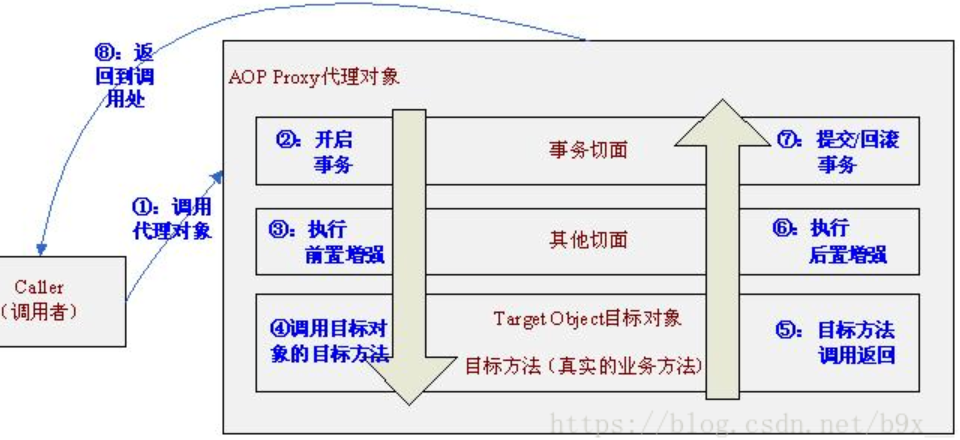


在CGLIB生成的代理类中，完全看不到@Transactional相关的东西，奇怪了。


### 事务传播属性

所谓事务传播行为就是：**多个事务方法相互调用时，事务如何在这些方法间传播。**

即：事务方法B被另一个事务方法A调用时，必须指定事务如何传播，注意，这里的传播是站在B的立场说的。

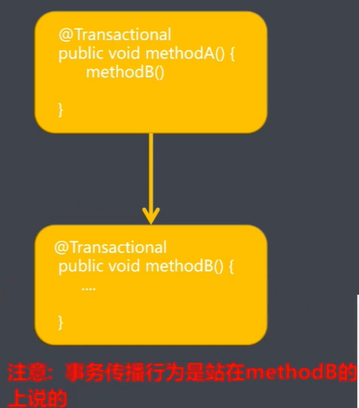

方法A已经有事务了，方法B该如何处理，是加入还是新建一个事务————传播


Spring支持以下7种事务传播行为

Spring事务传播属性:
1.propagation-required: 支持当前事务,如果有就加入当前事务中;如果当前方法没有事务,就新建一个事务;
2.propagation-supports: 支持当前事务,如果有就加入当前事务中;如果当前方法没有事务,就以非事务的方式执行;
3.propagation-mandatory: 支持当前事务,如果有就加入当前事务中;如果当前没有事务,就抛出异常;
4.propagation-requires_new: 新建事务,如果当前存在事务,就把当前事务挂起;如果当前方法没有事务,就新建事务;
5.propagation-not-supported: 以非事务方式执行,如果当前方法存在事务就挂起当前事务;如果当前方法不存在事务,就以非事务方式执行;
6.propagation-never: 以非事务方式执行,如果当前方法存在事务就抛出异常;如果当前方法不存在事务,就以非事务方式执行;
7.propagation-nested: 如果当前方法有事务,则在嵌套事务内执行;如果当前方法没有事务,则与required操作类似;
前六个策略类似于EJB CMT，第七个（PROPAGATION_NESTED）是Spring所提供的一个特殊变量。
它要求事务管理器或者使用JDBC 3.0 Savepoint API提供嵌套事务行为（如Spring的DataSourceTransactionManager）


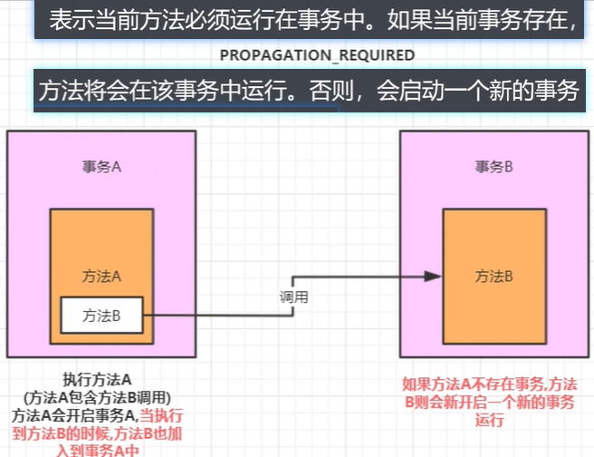

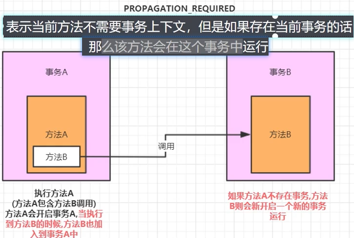

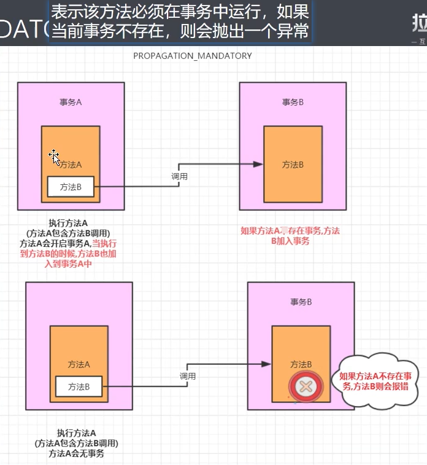

没有外层事务则抛异常

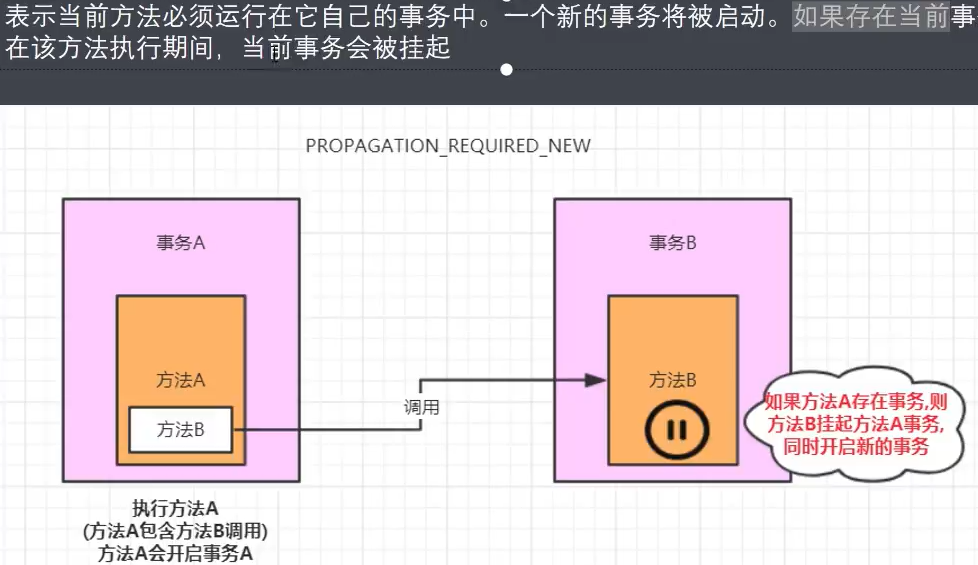

可能会造成死锁：外层事务A对表T进行操作，还没有提交，调用REQUIRE_NEW的事物B，导致事务A被挂起，事务B也对表T中相同的数据进行操作，导致死锁(应该是数据库上来说的，事务A加了行锁，等待事务B执行，事务B却等待A释放行锁，于是相互等待，死锁)


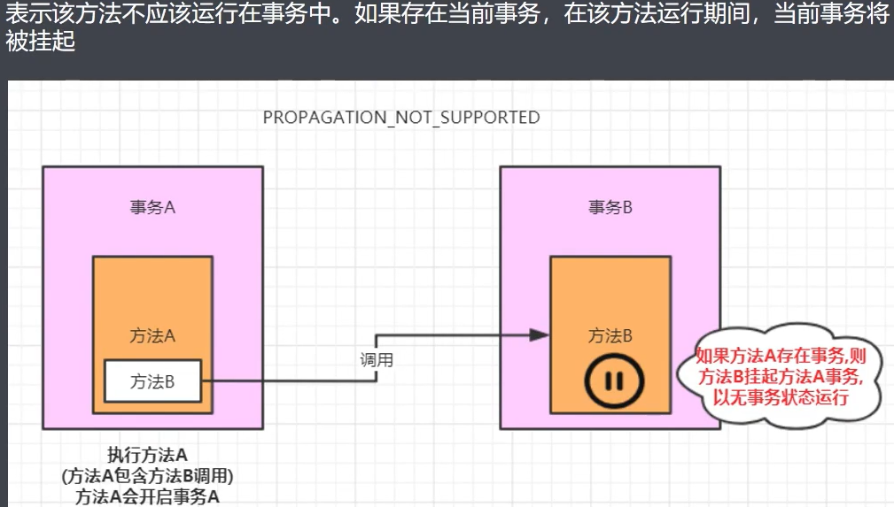

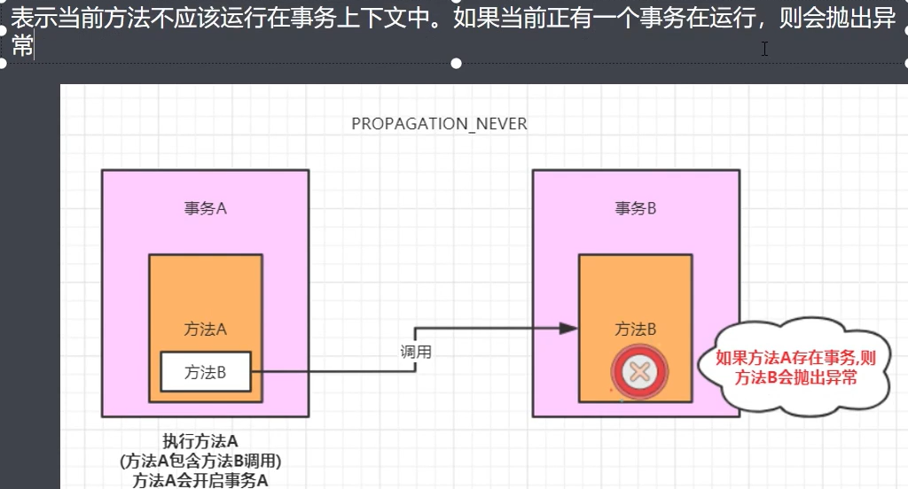

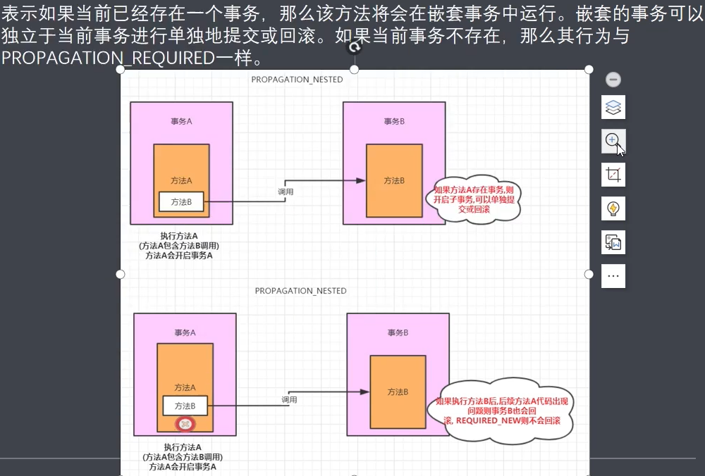

**注意与REQUIRE_NEW的区别，都是嵌套事务，但是如果外围事务抛出异常，REQUIRE_NEW的事物是不会回滚的，而NESTED事务则是会回滚的。即REQUIRE_NEW的话内外事务没有关系，而NESTED则有关系**


传播行为 实现原理：

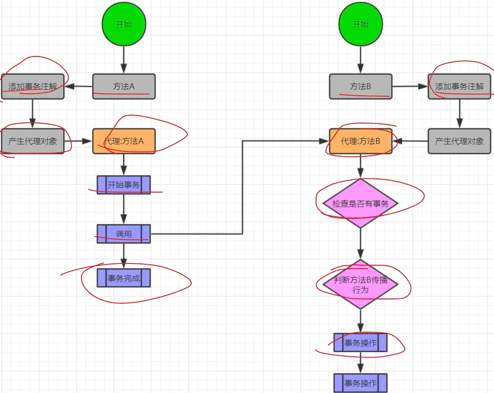


### @EnableTransactionManagement

在单纯的Spring中，我们在一个配置类上加入一个 @EnableTransactionManagement 注解代表**启动事务**。而这个配置类需要实现 **TransactionManagementConfigurer** 事务管理器配置接口。并实现 **annotationDrivenTransactionManager** 方法返回一个包含了 **配置好数据源的 DataSourceTransactionManager** 事务对象。这样就完成了事务配置，就可以在Spring使用事务的回滚或者提交功能了。

而SpringBoot不使用@EnableTransactionManagement开启事务，它引入autoconfigure是会自动开启的。

不只是事务，其他很多东西都是不需要Enable的。原因就是Spring Boot starter。

在spring-boot-autoconfigure中：其spring.factories中声明了很多的autoconfig配置,其中就包含

```properties
org.springframework.boot.autoconfigure.transaction.TransactionAutoConfiguration
```

其中有EnableTransactionManagement的相关配置


```properties
# Initializers
org.springframework.context.ApplicationContextInitializer=\
org.springframework.boot.autoconfigure.SharedMetadataReaderFactoryContextInitializer,\
org.springframework.boot.autoconfigure.logging.ConditionEvaluationReportLoggingListener

# Application Listeners
org.springframework.context.ApplicationListener=\
org.springframework.boot.autoconfigure.BackgroundPreinitializer

# Auto Configuration Import Listeners
org.springframework.boot.autoconfigure.AutoConfigurationImportListener=\
org.springframework.boot.autoconfigure.condition.ConditionEvaluationReportAutoConfigurationImportListener

# Auto Configuration Import Filters
org.springframework.boot.autoconfigure.AutoConfigurationImportFilter=\
org.springframework.boot.autoconfigure.condition.OnBeanCondition,\
org.springframework.boot.autoconfigure.condition.OnClassCondition,\
org.springframework.boot.autoconfigure.condition.OnWebApplicationCondition

# Auto Configure
org.springframework.boot.autoconfigure.EnableAutoConfiguration=\
org.springframework.boot.autoconfigure.admin.SpringApplicationAdminJmxAutoConfiguration,\
org.springframework.boot.autoconfigure.aop.AopAutoConfiguration,\
org.springframework.boot.autoconfigure.amqp.RabbitAutoConfiguration,\
org.springframework.boot.autoconfigure.batch.BatchAutoConfiguration,\
org.springframework.boot.autoconfigure.cache.CacheAutoConfiguration,\
org.springframework.boot.autoconfigure.cassandra.CassandraAutoConfiguration,\
org.springframework.boot.autoconfigure.context.ConfigurationPropertiesAutoConfiguration,\
org.springframework.boot.autoconfigure.context.LifecycleAutoConfiguration,\
org.springframework.boot.autoconfigure.context.MessageSourceAutoConfiguration,\
org.springframework.boot.autoconfigure.context.PropertyPlaceholderAutoConfiguration,\
org.springframework.boot.autoconfigure.couchbase.CouchbaseAutoConfiguration,\
org.springframework.boot.autoconfigure.dao.PersistenceExceptionTranslationAutoConfiguration,\
org.springframework.boot.autoconfigure.data.cassandra.CassandraDataAutoConfiguration,\
org.springframework.boot.autoconfigure.data.cassandra.CassandraReactiveDataAutoConfiguration,\
org.springframework.boot.autoconfigure.data.cassandra.CassandraReactiveRepositoriesAutoConfiguration,\
org.springframework.boot.autoconfigure.data.cassandra.CassandraRepositoriesAutoConfiguration,\
org.springframework.boot.autoconfigure.data.couchbase.CouchbaseDataAutoConfiguration,\
org.springframework.boot.autoconfigure.data.couchbase.CouchbaseReactiveDataAutoConfiguration,\
org.springframework.boot.autoconfigure.data.couchbase.CouchbaseReactiveRepositoriesAutoConfiguration,\
org.springframework.boot.autoconfigure.data.couchbase.CouchbaseRepositoriesAutoConfiguration,\
org.springframework.boot.autoconfigure.data.elasticsearch.ElasticsearchDataAutoConfiguration,\
org.springframework.boot.autoconfigure.data.elasticsearch.ElasticsearchRepositoriesAutoConfiguration,\
org.springframework.boot.autoconfigure.data.elasticsearch.ReactiveElasticsearchRepositoriesAutoConfiguration,\
org.springframework.boot.autoconfigure.data.elasticsearch.ReactiveElasticsearchRestClientAutoConfiguration,\
org.springframework.boot.autoconfigure.data.jdbc.JdbcRepositoriesAutoConfiguration,\
org.springframework.boot.autoconfigure.data.jpa.JpaRepositoriesAutoConfiguration,\
org.springframework.boot.autoconfigure.data.ldap.LdapRepositoriesAutoConfiguration,\
org.springframework.boot.autoconfigure.data.mongo.MongoDataAutoConfiguration,\
org.springframework.boot.autoconfigure.data.mongo.MongoReactiveDataAutoConfiguration,\
org.springframework.boot.autoconfigure.data.mongo.MongoReactiveRepositoriesAutoConfiguration,\
org.springframework.boot.autoconfigure.data.mongo.MongoRepositoriesAutoConfiguration,\
org.springframework.boot.autoconfigure.data.neo4j.Neo4jDataAutoConfiguration,\
org.springframework.boot.autoconfigure.data.neo4j.Neo4jRepositoriesAutoConfiguration,\
org.springframework.boot.autoconfigure.data.solr.SolrRepositoriesAutoConfiguration,\
org.springframework.boot.autoconfigure.data.r2dbc.R2dbcDataAutoConfiguration,\
org.springframework.boot.autoconfigure.data.r2dbc.R2dbcRepositoriesAutoConfiguration,\
org.springframework.boot.autoconfigure.data.r2dbc.R2dbcTransactionManagerAutoConfiguration,\
org.springframework.boot.autoconfigure.data.redis.RedisAutoConfiguration,\
org.springframework.boot.autoconfigure.data.redis.RedisReactiveAutoConfiguration,\
org.springframework.boot.autoconfigure.data.redis.RedisRepositoriesAutoConfiguration,\
org.springframework.boot.autoconfigure.data.rest.RepositoryRestMvcAutoConfiguration,\
org.springframework.boot.autoconfigure.data.web.SpringDataWebAutoConfiguration,\
org.springframework.boot.autoconfigure.elasticsearch.ElasticsearchRestClientAutoConfiguration,\
org.springframework.boot.autoconfigure.flyway.FlywayAutoConfiguration,\
org.springframework.boot.autoconfigure.freemarker.FreeMarkerAutoConfiguration,\
org.springframework.boot.autoconfigure.groovy.template.GroovyTemplateAutoConfiguration,\
org.springframework.boot.autoconfigure.gson.GsonAutoConfiguration,\
org.springframework.boot.autoconfigure.h2.H2ConsoleAutoConfiguration,\
org.springframework.boot.autoconfigure.hateoas.HypermediaAutoConfiguration,\
org.springframework.boot.autoconfigure.hazelcast.HazelcastAutoConfiguration,\
org.springframework.boot.autoconfigure.hazelcast.HazelcastJpaDependencyAutoConfiguration,\
org.springframework.boot.autoconfigure.http.HttpMessageConvertersAutoConfiguration,\
org.springframework.boot.autoconfigure.http.codec.CodecsAutoConfiguration,\
org.springframework.boot.autoconfigure.influx.InfluxDbAutoConfiguration,\
org.springframework.boot.autoconfigure.info.ProjectInfoAutoConfiguration,\
org.springframework.boot.autoconfigure.integration.IntegrationAutoConfiguration,\
org.springframework.boot.autoconfigure.jackson.JacksonAutoConfiguration,\
org.springframework.boot.autoconfigure.jdbc.DataSourceAutoConfiguration,\
org.springframework.boot.autoconfigure.jdbc.JdbcTemplateAutoConfiguration,\
org.springframework.boot.autoconfigure.jdbc.JndiDataSourceAutoConfiguration,\
org.springframework.boot.autoconfigure.jdbc.XADataSourceAutoConfiguration,\
org.springframework.boot.autoconfigure.jdbc.DataSourceTransactionManagerAutoConfiguration,\
org.springframework.boot.autoconfigure.jms.JmsAutoConfiguration,\
org.springframework.boot.autoconfigure.jmx.JmxAutoConfiguration,\
org.springframework.boot.autoconfigure.jms.JndiConnectionFactoryAutoConfiguration,\
org.springframework.boot.autoconfigure.jms.activemq.ActiveMQAutoConfiguration,\
org.springframework.boot.autoconfigure.jms.artemis.ArtemisAutoConfiguration,\
org.springframework.boot.autoconfigure.jersey.JerseyAutoConfiguration,\
org.springframework.boot.autoconfigure.jooq.JooqAutoConfiguration,\
org.springframework.boot.autoconfigure.jsonb.JsonbAutoConfiguration,\
org.springframework.boot.autoconfigure.kafka.KafkaAutoConfiguration,\
org.springframework.boot.autoconfigure.availability.ApplicationAvailabilityAutoConfiguration,\
org.springframework.boot.autoconfigure.ldap.embedded.EmbeddedLdapAutoConfiguration,\
org.springframework.boot.autoconfigure.ldap.LdapAutoConfiguration,\
org.springframework.boot.autoconfigure.liquibase.LiquibaseAutoConfiguration,\
org.springframework.boot.autoconfigure.mail.MailSenderAutoConfiguration,\
org.springframework.boot.autoconfigure.mail.MailSenderValidatorAutoConfiguration,\
org.springframework.boot.autoconfigure.mongo.embedded.EmbeddedMongoAutoConfiguration,\
org.springframework.boot.autoconfigure.mongo.MongoAutoConfiguration,\
org.springframework.boot.autoconfigure.mongo.MongoReactiveAutoConfiguration,\
org.springframework.boot.autoconfigure.mustache.MustacheAutoConfiguration,\
org.springframework.boot.autoconfigure.orm.jpa.HibernateJpaAutoConfiguration,\
org.springframework.boot.autoconfigure.quartz.QuartzAutoConfiguration,\
org.springframework.boot.autoconfigure.r2dbc.R2dbcAutoConfiguration,\
org.springframework.boot.autoconfigure.rsocket.RSocketMessagingAutoConfiguration,\
org.springframework.boot.autoconfigure.rsocket.RSocketRequesterAutoConfiguration,\
org.springframework.boot.autoconfigure.rsocket.RSocketServerAutoConfiguration,\
org.springframework.boot.autoconfigure.rsocket.RSocketStrategiesAutoConfiguration,\
org.springframework.boot.autoconfigure.security.servlet.SecurityAutoConfiguration,\
org.springframework.boot.autoconfigure.security.servlet.UserDetailsServiceAutoConfiguration,\
org.springframework.boot.autoconfigure.security.servlet.SecurityFilterAutoConfiguration,\
org.springframework.boot.autoconfigure.security.reactive.ReactiveSecurityAutoConfiguration,\
org.springframework.boot.autoconfigure.security.reactive.ReactiveUserDetailsServiceAutoConfiguration,\
org.springframework.boot.autoconfigure.security.rsocket.RSocketSecurityAutoConfiguration,\
org.springframework.boot.autoconfigure.security.saml2.Saml2RelyingPartyAutoConfiguration,\
org.springframework.boot.autoconfigure.sendgrid.SendGridAutoConfiguration,\
org.springframework.boot.autoconfigure.session.SessionAutoConfiguration,\
org.springframework.boot.autoconfigure.security.oauth2.client.servlet.OAuth2ClientAutoConfiguration,\
org.springframework.boot.autoconfigure.security.oauth2.client.reactive.ReactiveOAuth2ClientAutoConfiguration,\
org.springframework.boot.autoconfigure.security.oauth2.resource.servlet.OAuth2ResourceServerAutoConfiguration,\
org.springframework.boot.autoconfigure.security.oauth2.resource.reactive.ReactiveOAuth2ResourceServerAutoConfiguration,\
org.springframework.boot.autoconfigure.solr.SolrAutoConfiguration,\
org.springframework.boot.autoconfigure.task.TaskExecutionAutoConfiguration,\
org.springframework.boot.autoconfigure.task.TaskSchedulingAutoConfiguration,\
org.springframework.boot.autoconfigure.thymeleaf.ThymeleafAutoConfiguration,\
org.springframework.boot.autoconfigure.transaction.TransactionAutoConfiguration,\
org.springframework.boot.autoconfigure.transaction.jta.JtaAutoConfiguration,\
org.springframework.boot.autoconfigure.validation.ValidationAutoConfiguration,\
org.springframework.boot.autoconfigure.web.client.RestTemplateAutoConfiguration,\
org.springframework.boot.autoconfigure.web.embedded.EmbeddedWebServerFactoryCustomizerAutoConfiguration,\
org.springframework.boot.autoconfigure.web.reactive.HttpHandlerAutoConfiguration,\
org.springframework.boot.autoconfigure.web.reactive.ReactiveWebServerFactoryAutoConfiguration,\
org.springframework.boot.autoconfigure.web.reactive.WebFluxAutoConfiguration,\
org.springframework.boot.autoconfigure.web.reactive.error.ErrorWebFluxAutoConfiguration,\
org.springframework.boot.autoconfigure.web.reactive.function.client.ClientHttpConnectorAutoConfiguration,\
org.springframework.boot.autoconfigure.web.reactive.function.client.WebClientAutoConfiguration,\
org.springframework.boot.autoconfigure.web.servlet.DispatcherServletAutoConfiguration,\
org.springframework.boot.autoconfigure.web.servlet.ServletWebServerFactoryAutoConfiguration,\
org.springframework.boot.autoconfigure.web.servlet.error.ErrorMvcAutoConfiguration,\
org.springframework.boot.autoconfigure.web.servlet.HttpEncodingAutoConfiguration,\
org.springframework.boot.autoconfigure.web.servlet.MultipartAutoConfiguration,\
org.springframework.boot.autoconfigure.web.servlet.WebMvcAutoConfiguration,\
org.springframework.boot.autoconfigure.websocket.reactive.WebSocketReactiveAutoConfiguration,\
org.springframework.boot.autoconfigure.websocket.servlet.WebSocketServletAutoConfiguration,\
org.springframework.boot.autoconfigure.websocket.servlet.WebSocketMessagingAutoConfiguration,\
org.springframework.boot.autoconfigure.webservices.WebServicesAutoConfiguration,\
org.springframework.boot.autoconfigure.webservices.client.WebServiceTemplateAutoConfiguration

# Failure analyzers
org.springframework.boot.diagnostics.FailureAnalyzer=\
org.springframework.boot.autoconfigure.diagnostics.analyzer.NoSuchBeanDefinitionFailureAnalyzer,\
org.springframework.boot.autoconfigure.flyway.FlywayMigrationScriptMissingFailureAnalyzer,\
org.springframework.boot.autoconfigure.jdbc.DataSourceBeanCreationFailureAnalyzer,\
org.springframework.boot.autoconfigure.jdbc.HikariDriverConfigurationFailureAnalyzer,\
org.springframework.boot.autoconfigure.r2dbc.ConnectionFactoryBeanCreationFailureAnalyzer,\
org.springframework.boot.autoconfigure.session.NonUniqueSessionRepositoryFailureAnalyzer

# Template availability providers
org.springframework.boot.autoconfigure.template.TemplateAvailabilityProvider=\
org.springframework.boot.autoconfigure.freemarker.FreeMarkerTemplateAvailabilityProvider,\
org.springframework.boot.autoconfigure.mustache.MustacheTemplateAvailabilityProvider,\
org.springframework.boot.autoconfigure.groovy.template.GroovyTemplateAvailabilityProvider,\
org.springframework.boot.autoconfigure.thymeleaf.ThymeleafTemplateAvailabilityProvider,\
org.springframework.boot.autoconfigure.web.servlet.JspTemplateAvailabilityProvider
```


https://blog.csdn.net/qq_32370913/article/details/105924209


### 声明式事务失效场景

DB Engine不支持事务

`@Transactional` 所在类非 `spring` 容器的 `bean` 

方法不是 `public` 的 

数据源没有配置事务管理器 

事务的 `propagation` 传播机制设置错误 

`catch` 语句没有抛出异常

 抛出的异常类型错误

 确保业务和事务入口在同一个线程

 自身调用问题

**如果采用spring+spring mvc，则context:component-scan重复扫描问题可能会引起事务失败**

**@Transactional 注解开启配置，必须放到listener里加载，如果放到DispatcherServlet的配置里，事务也是不起作用的。**


#### 非public方法

只有public方法事务才会生效，private、default、protected方法都不生效。

注意：在CGLIB生成的代理类中，private、default、protected方法都有覆盖，但是就是事务不会生效，个人推断的话，如果传入的MethodInterceptor是null，就会直接调用super原方法，而不是走代理。

```java
protected final void protectedMethod() {
    MethodInterceptor var10000 = this.CGLIB$CALLBACK_0;
    if (var10000 == null) {
        CGLIB$BIND_CALLBACKS(this);
        var10000 = this.CGLIB$CALLBACK_0;
    }

    if (var10000 != null) {
        var10000.intercept(this, CGLIB$protectedMethod$1$Method, CGLIB$emptyArgs, CGLIB$protectedMethod$1$Proxy);
    } else {
        super.protectedMethod();
    }
}
```

#### 静态方法

静态方法属于类，代理方式没法增强。

#### 使用事务的Service没有被Spring管理

只有被标记为Bean的对象才会被Spring管理，其中的@Transactional也才会被解析。

#### 非事务调用事务方法

标记@Transactional的方法调用非事务的方法没问题，但是反过来就不行。

#### 检查异常未处理

默认情况下Spring事务只会捕获RUNTIME异常和Error，受检异常默认已经处理干净。

#### 数据库不支持事务

数据库如果不支持事务，spring也没办法

#### 事务管理器

必须要配置事务管理器，事务管理器才是Spring中事务执行的单元。

SpringBoot中，使用

```java
org.springframework.boot.autoconfigure.transaction.TransactionAutoConfiguration
```

自动装配


#### 类内部调用

- **同一类内方法调用，无论被调用的b()方法是否配置了事务，此事务在被调用时都将不生效。**
- 事务方法调用本类中的方法，无论被调用的方法是不是事务的，访问权限怎么样，事务都生效。

#### 父子容器

@Transactional 注解开启配置，必须放到listener里加载，如果放到DispatcherServlet的配置里，事务也是不起作用的容器

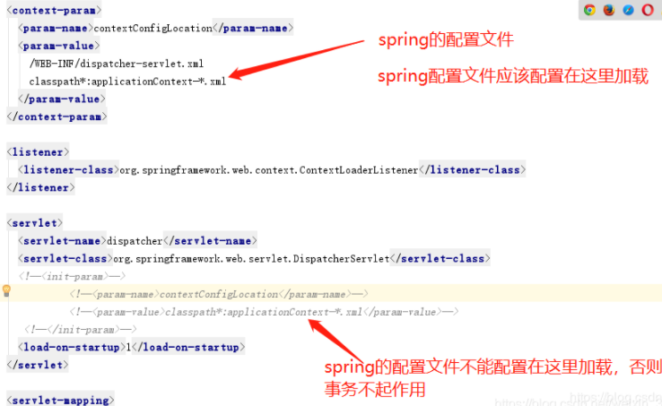

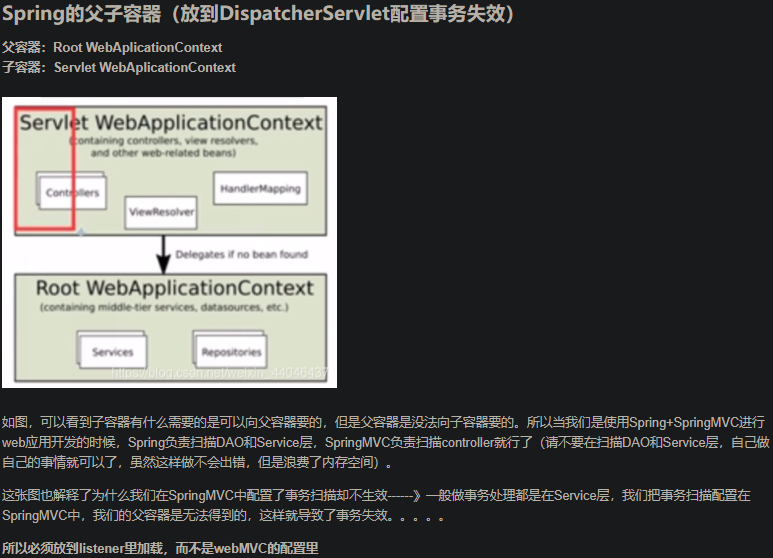

通过exclude-filter 进行黑名单过滤，然后通过include-filter 进行白名单过滤，否则默认排除。


#### 父子容器2：context:component-scan重复扫描


如果采用spring+spring mvc，则context:component-scan重复扫描问题可能会引起事务失败。 

        如果spring和mvc的配置文件中都扫描了service层，那么事务就会失效。
    
       原因：因为按照spring配置文件的加载顺序来讲，先加载springmvc配置文件，再加载spring配置文件，我们的事物一般都在srping配置文件中进行配置，如果此时在加载srpingMVC配置文件的时候，把servlce也给注册了，但是此时事物还没加载，也就导致后面的事物无法成功注入到service中。所以把对service的扫描放在spring配置文件中或是其他配置文件中。
在使用SSM进行开发的时候，一般要求使用Spring配置文件只扫描@Service，@Repository的bean ，而使用SpringMVC配置文件只扫描@Controller。(防止扫描两次bean)

解决bean被扫描两次的问题

```
exclude-filter 配置的不扫描(黑名单)
include-filter 配置的需要扫描(白名单)
use-default-filters 默认为true就是全扫描(false全部不扫描)
```

```
spring配置文件配置：
<!-- use-default-filters="true" 使用默认的过滤器 扫描@controller @service @Reposity @compont等所有注解
<context:exclude-filter> 配置避免扫描controller 
-->
<context:component-scan base-package="包路径" use-default-filters="true">
        <!-- 扫描的时候不扫描Controller-->
        <context:exclude-filter type="annotation" expression="org.springframework.stereotype.Controller"/>
    </context:component-scan>

springmvc配置文件配置：
<!-- use-default-filters="false" 所有都不会扫描 -->
<context:component-scan base-package="com.xgf.springmvc.ajax" use-default-filters="false">
		<!--context:include-filter 只扫描@Controller -->
        <context:include-filter type="annotation" expression="org.springframework.stereotype.Controller"/>
    </context:component-scan>

```

https://blog.csdn.net/u012387539/article/details/112826239

#### innodb_rollback_on_timeout OFF

MySQL 5.6&5.7中默认值为OFF，当InnoDB默认情况下仅回滚事务超时的最后一条语句。如果innodb_rollback_on_timeout值为ON，则事务超时后将导致InnoDB中止并回滚整个事务


#### 出错时跳过错误

(**DECLARE **CONTINUE** HANDLE FOR SQLEXCEPTION**)**

#### 多数据源

### 事务无效分析案例

ODS事务无效

```java
public class ModelMetaController {
    @Autowired
    private TblOdsZeusActionDAO tblOdsZeusActionDAO;
    /**
     *
     * Fetched SqlSession [org.apache.ibatis.session.defaults.DefaultSqlSession@3d05ee6b] from current transaction
     * ==>  Preparing: INSERT INTO tbl_ods_zeus_action ( model_code, model_version, type ) VALUES ( ?, ?, ? )
     * ==> Parameters: 0.9315482676120127(String), v(String), 1(Integer)
     * <==    Updates: 1
     * Releasing transactional SqlSession [org.apache.ibatis.session.defaults.DefaultSqlSession@3d05ee6b]
     *
     * 可以看到，第一个insert是一个独立的事务
     * 抛异常后，后面没有开启的事务不受影响，前面的事务已经提交了
     *
     *
     * */
    @RequestMapping("/tx/test")
    @Transactional(rollbackFor = CommonException.class)
    public void txTest(HttpServletResponse response){
        TblOdsZeusAction a = TblOdsZeusAction.builder().modelCode(Math.random()+"").modelVersion("v")
                .type(1).build();
        tblOdsZeusActionDAO.insert(a);
        if (response != null){
            throw new CommonException("tx test exception");
        }
        TblOdsZeusAction b = TblOdsZeusAction.builder().modelCode(Math.random()+"").modelVersion("v")
                .type(1).build();
        tblOdsZeusActionDAO.insert(b);
    }
}
```

发现SqlSession会重复创建，每次请求数据库都会创建

即同一个事务内SqlSession没有被重用

事务不会生效

不对：

```text
Creating a new SqlSession
Registering transaction synchronization for SqlSession [org.apache.ibatis.session.defaults.DefaultSqlSession@27d9f180]
JDBC Connection [com.ctrip.platform.dal.dao.datasource.jdbc.DalConnection@1aa93470] will be managed by Spring
==> Preparing: INSERT INTO tbl_ods_zeus_action ( model_code, model_version, type ) VALUES ( ?, ?, ? )
==> Parameters: 0.8141717723361667(String), v(String), 1(Integer)
<== Updates: 1
Releasing transactional SqlSession [org.apache.ibatis.session.defaults.DefaultSqlSession@27d9f180]
Fetched SqlSession [org.apache.ibatis.session.defaults.DefaultSqlSession@27d9f180] from current transaction
==> Preparing: INSERT INTO tbl_ods_zeus_action ( model_code, model_version, type ) VALUES ( ?, ?, ? )
==> Parameters: 0.3987128587943757(String), v(String), 1(Integer)
<== Updates: 1
Releasing transactional SqlSession [org.apache.ibatis.session.defaults.DefaultSqlSession@27d9f180]
```

后面的DAO操作 是 Fetched SqlSession

可见没有创建新的Session，同一个事务是使用的是一个Session

那么估计只能是数据源的问题了


- SqlSessionHolder holder = (SqlSessionHolder)TransactionSynchronizationManager.getResource(sessionFactory); 这一句：他从从前线程的threadLocal 中获取sqlSessionHolder。但是在在sqlSession 关闭session 的时候,sqlSessionHolder也是做了判断。如果会话在事务中，就减少引用次数，没有真实关闭session。如果会话不存在事务，则直接关闭session。也就是说，必须开启事务，但这个问题好像只是插入了一下，事务已经执行完成了，下一次插入的时候，由于上一个事务执行完成了， 如果不存在holder或没有被事务锁定，则会创建新的sqlSession，即 Creating a new SqlSession，通过sessionFactory.openSession()方法。如果会话不存在事务，就直接把session关闭了，同时，也减少了引用次数。


### 事务配置

#### 声明式事务配置

#### XML方式

```xml
<!--spring声明式事务配置，声明式事务就是配置一个aop-->
<!--横切逻辑-->
<bean id="transactionManager" class="org.springframework.jdbc.datasource.DataSourceTransactionManager">
    <constructor-arg name="dataSource" ref="dataSource"></constructor-arg>
</bean>
<!--声明式事务的注解驱动-->
<tx:annotation-driven transaction-manager="transactionManager"/>
```

https://blog.csdn.net/u010689440/article/details/108476473


## 其他

### Spring SPI

如何使用

## 问题与解决

### Logging initialized using 'class org.apache.ibatis.logging.stdout.StdOutImpl' adapter

### 一般出现这种错误的几种情况：

1.项目启动连接数据库失败，请先检查下能打开数据库(是检查项目配置文件中的要连接的所有数据库，只要有一个数据库连接不上就卡住了)。我就错在这里。

2.对应的sql语句的id有重复。

3.标签缺少，或者标签有问题

4.中英文切换导致有特殊字符


### SpringWebFlux


### 其他

- mvc： SSH、SpringMVC、SpringBoot
- MVP：model、view、presenter，代表Android
- MVVM：model view view-model， 代表avalon，vue


Servlet：

= service + applet，表示小服务程序java.servlet.Servlet

Struts: 从直接操纵Servlet到应用框架

Struts2: 更加友好的应用框架

### 冯子恺 日报回复

1.首先理解缓存的使用场景，什么场景下适用于缓存

2.理解缓存的选择，必须采用分布式缓存吗？本地缓存可以吗，比如guava的loading cache？

3.理解分布式，分布式锁的概念

4.分布式锁的使用场景，必须使用分布式锁吗？如果不使用会有其他方案满足业务需要吗？

5.技术只是银弹，合适的场景最简单的方案就是最好的


