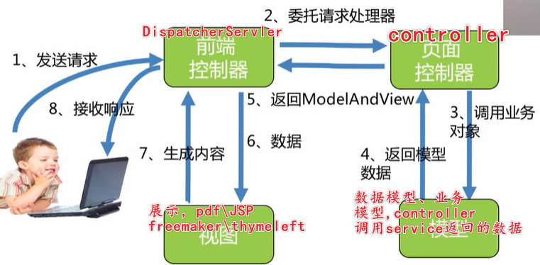
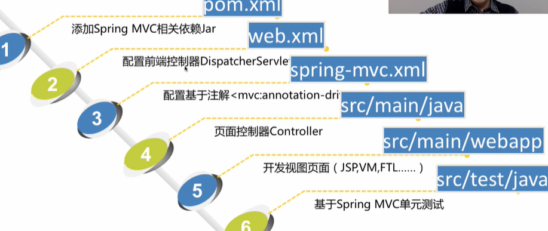
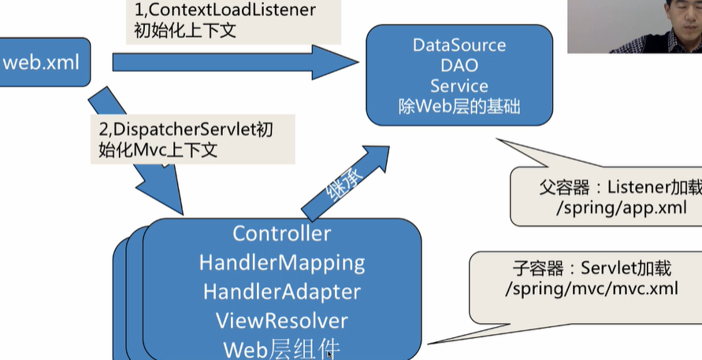
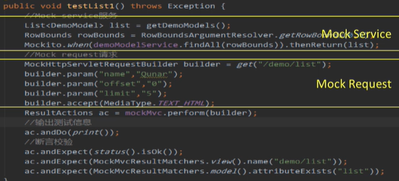
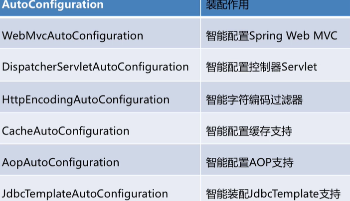
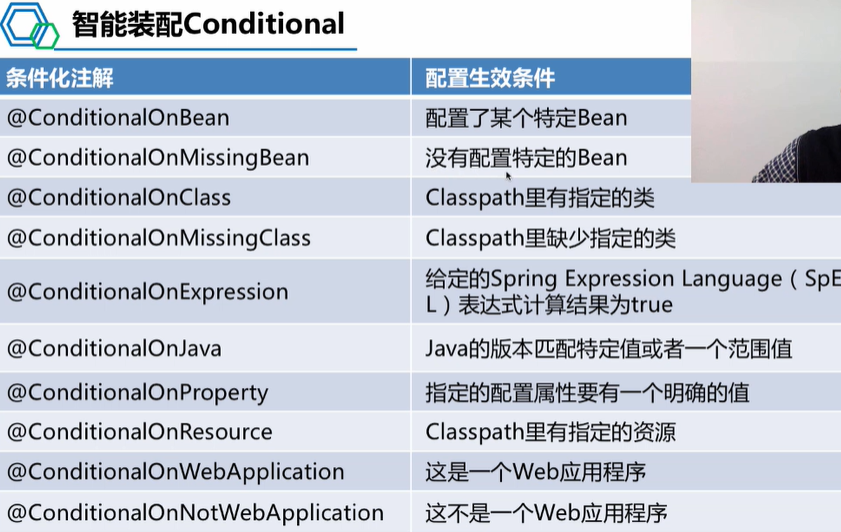

# Spring 

## 课程笔记

xml:

- 配置繁琐
- 代码逻辑割裂


循环依赖： 三级缓存


先官方文档，在源码，Spring的源码结构比较复杂。


factoryBean  &获取


Spring的扩展点：

- BeanFactoryPostProcessor
- BeanPostProcessor: DI是通过它实现的
- initMethod , destoryMethod
- aware
- 

有接口，可以使用JDK代理，但是没有接口只能使用CGLIB。

那些场景下代理不能生成？final，。。。

目前两种代理方式的性能相差不大


织入的几种方式：

- 运行期
- 编译器
- 。。。


切点表达式有那些：

- 注解？
- exec 表达式
- 


@Aspect是  Aspect的，不是Spring的，所以如果要引入到Spring容器中还需要Component


Spring JDBC

JDBC本质是一种协议、规约


Spring事务：在数据库事务上进一步封装，并且引入了新的东西


模板方法 复习下


transManager事务管理器，看源码

事务的传播级别，传播机制

Spring如何维护事务状态，如何维护连接的？？？

> **事务的最大作用范围是连接，其中利用到了ThreadLocal**

private方法事务有效吗

嵌套事务如何实现的

spring事务支持跨线程吗

方法的调用，x call y, 事务有效吗


starter的原理


## 基础

### @Autowired和@Resource

@Autowired功能虽说非常强大，但是也有些不足之处。比如：比如它跟spring强耦合了，如果换成了JFinal等其他框架，功能就会失效。而@Resource是JSR-250提供的，它是Java标准，绝大部分框架都支持。

除此之外，有些场景使用@Autowired无法满足的要求，改成@Resource却能解决问题。接下来，我们重点看看@Autowired和@Resource的区别。

- @Autowired默认按byType自动装配，而@Resource默认byName自动装配。
- @Autowired只包含一个参数：required，表示是否开启自动准入，默认是true。而@Resource包含七个参数，其中最重要的两个参数是：name 和 type。
- @Autowired如果要使用byName，需要使用@Qualifier一起配合。而@Resource如果指定了name，则用byName自动装配，如果指定了type，则用byType自动装配。
- @Autowired能够用在：构造器、方法、参数、成员变量和注解上，而@Resource能用在：类、成员变量和方法上。
- @Autowired是spring定义的注解，而@Resource是JSR-250定义的注解。


## AOP

### 代理

静态代理：

- 容易编码实现
- 容易理解
- 实现代码量大，不可重用

Java动态代理：

- 基于InvocationHandlerProxy实现
- 可重用
- **只能基于接口实现**
- SpringAPO的优先选择

cglib代理

	- **不能代理final类和私有方法**
	- **能够对接口和类进行代理**
	- **通过生成子类的方式创建代理**

### AOP概念

- 连接点： jointpoint, 需要在程序中插入横切关注点的扩展点，spring只支持方法执行连接点。其他还有类初始化、方法执行、字段调用等
- 切入点：pointcut，连接点的集合
- 通知：advice，在连接点上执行的增强行为
- 切面：aspect，横切关注点的模块化
- 目标对象
- APO代理：代理模式创建对象，从而实现在连接点插入通知
- 织入：**weaving，织入是一个过程，是将切面应用到目标对象从而创建出AOP代理对象的过程，**织入可以发生在**编译期、类装载期、运行期**。
- 前置通知
- 后置通知：
  - 返回通知
  - 异常通知
  - 后置通知
- 环绕通知


## MVC

架构：







MVC测试




## SpringBoot

### 特点

- 丰富的starter简化pom配置
- 智能装配autoconfigure
- 可视化运行信息
- 不要求xml配置
- 约定大于配置


springboot插件

spring-boot-maven-plugin


> <scope>provided</scope>


#### AutoConfiguration



@Import




### 监控

运维监控 Starter Actuator

```
http://ip:port/manage
```


### 资源引入

```java
@ImportResource(value = {
        "classpath:applicationContext.xml"
})
```

@ImportResource：导入Spring的配置文件，让配置文件里面的内容生效；


### SpringBoot几个官方依赖

#### spring-boot-devtools

DevTools通过提供自动重启和LiveReload功能，使您更快、更轻松地开发Spring Boot应用程序。除此之外，它还将各种属性设置为更适合本地开发的值。此外，它允许您远程连接到您的应用程序，并仍然使用其大部分功能。在生产中运行时，不要使用DevTools。

```xml
<dependency>
    <groupId>org.springframework.boot</groupId>
    <artifactId>spring-boot-devtools</artifactId>
    <optional>true</optional>
</dependency>
```

**依赖项声明为可选**。这个很重要。这可以**防止DevTools依赖性传递性地应用于依赖于你项目的其他模块**。

功能：

- 自动重启：每当类路径中的文件发生更改时，DevTools会自动重新启动正在运行的应用程序，并应用新的更改。重新启动应用程序的速度比平常快得多，DevTools使用两个类加载器 - base和restart。base类加载器加载不更改的类。你正在使用的类由restart类加载器加载。每当触发重启时，都会重新启动并重新创建restart的类加载器。

  

  在IDE中触发重新启动：只要类路径发生更改，就会触发重新启动。但是，这取决于您的IDE。这意味着，仅仅更改.java文件是不够的。**重要的是您的IDE实际上更新.class了类路径上的文件**：您需要**构建项目**

  

- 权限开发：仅用于开发，而不用于生产。如果您的应用程序检测到您正在生产中运行，则会自动禁用DevTools。部署时有两种模式：**fully packaged artifact完全打包和exploded artifact** ；采取前者打包方式Spring会认为是生产应用；后者认为是开发模式，在Idea等IDE中采取的是后者。

- live reload

- 远程连接


## 异常处理

朴素的异常处理是try-catch，可能造成代码冗余。

Spring有多种方式处理这种问题：

- @ExceptionHandler：统一处理某一类异常，从而能够减少代码重复率和复杂度
- @ControllerAdvice：异常集中处理，更好的使业务逻辑与异常处理剥离开；其是对Controller层进行拦截
- @ResponseStatus：可以将某种异常映射为HTTP状态码

### @ExceptionHandler

```java
@Target({ElementType.METHOD})
@Retention(RetentionPolicy.RUNTIME)
@Documented
public @interface ExceptionHandler {
    Class<? extends Throwable>[] value() default {};
}
```

方法级，value()可以指定异常类

由该注解注释的方法可以具有灵活的输入参数：

- 异常参数：包括一般的异常或特定的异常（即自定义异常），如果注解没有指定异常类，会默认进行映射。
- 请求或响应对象 (Servlet API or Portlet API)： 你可以选择不同的类型，如ServletRequest/HttpServletRequest或PortleRequest/ActionRequest/RenderRequest`。`
- Session对象(Servlet API or Portlet API)： HttpSession或PortletSession。
- WebRequest或NativeWebRequest 
- Locale
- InputStream/Reader 
- OutputStream/Writer 
- `Model`

方法返回值可以为：

- ModelAndView对象
- Model对象
- Map对象
- View对象
- String对象
- 还有@ResponseBody、HttpEntity<?>或ResponseEntity<?>，以及void

```java
@ExceptionHandler()
public String handleExeption2(Exception ex) {
    System.out.println("抛异常了:" + ex);
    ex.printStackTrace();
    String resultStr = "异常：默认";
    return resultStr;
}
```

当我们使用这个@ExceptionHandler注解时，我们需要定义一个异常的处理方法，比如上面的handleExeption2()方法，给这个方法加上@ExceptionHandler注解，这个方法就会处理类中其他方法（被@RequestMapping注解）抛出的异常。

@ExceptionHandler注解中可以添加参数，参数是某个异常类的class，代表这个方法专门处理该类异常

当异常发生时，Spring会选择最接近抛出异常的处理方法。


注解方法的返回值
标识了@ExceptionHandler注解的方法，返回值类型和标识了@RequestMapping的方法是统一的，可参见@RequestMapping的说明，比如默认返回Spring的ModelAndView对象，也可以返回String，这时的String是ModelAndView的路径，而不是字符串本身。

有些情况下我们会给标识了@RequestMapping的方法添加@ResponseBody，比如使用Ajax的场景，直接返回字符串，异常处理类也可以如此操作，添加@ResponseBody注解后，可以直接返回字符串，比如这样：

```java
@ExceptionHandler(NumberFormatException.class)
@ResponseBody
public String handleExeption(Exception ex) {
    System.out.println("抛异常了:" + ex);
    ex.printStackTrace();
    String resultStr = "异常：NumberFormatException";
    return resultStr;
}
```

使用@ExceptionHandler时尽量**不要使用相同的注解参数**。

### @ControllerAdvice

该注解作用对象为TYPE，包括类、接口和枚举等，在运行时有效，并且可以通过Spring扫描为bean组件。其可以包含由@ExceptionHandler、@InitBinder 和@ModelAttribute标注的方法，可以处理多个Controller类，这样所有控制器的异常可以在一个地方进行处理。

```java
@ControllerAdvice
public class ExceptionsHandler {

    @ExceptionHandler(CustomGenericException.class)//可以直接写@ExceptionHandler,不指明异常类，会自动映射
    public ModelAndView customGenericExceptionHnadler(CustomGenericException exception){ //还可以声明接收其他任意参数
        ModelAndView modelAndView = new ModelAndView("generic_error");
        modelAndView.addObject("errCode",exception.getErrCode());
        modelAndView.addObject("errMsg",exception.getErrMsg());
        return modelAndView;
    }

    @ExceptionHandler(Exception.class)//可以直接写@EceptionHandler，IOExeption继承于Exception
    public ModelAndView allExceptionHandler(Exception exception){
        ModelAndView modelAndView = new ModelAndView("generic_error");
        modelAndView.addObject("errMsg", "this is Exception.class");
        return modelAndView;
    }
}
```


## 其他

### Spring SPI

如何使用


### 序列化工具

不推荐fastjson， 使用jackson


### 如何写starter???  


### SpringWebFlux


### 其他

- mvc： SSH、SpringMVC、SpringBoot
- MVP：model、view、presenter，代表Android
- MVVM：model view view-model， 代表avalon，vue


Servlet：

= service + applet，表示小服务程序java.servlet.Servlet

Struts: 从直接操纵Servlet到应用框架

Struts2: 更加友好的应用框架

### 冯子恺 日报回复

1.首先理解缓存的使用场景，什么场景下适用于缓存

2.理解缓存的选择，必须采用分布式缓存吗？本地缓存可以吗，比如guava的loading cache？

3.理解分布式，分布式锁的概念

4.分布式锁的使用场景，必须使用分布式锁吗？如果不使用会有其他方案满足业务需要吗？

5.技术只是银弹，合适的场景最简单的方案就是最好的


