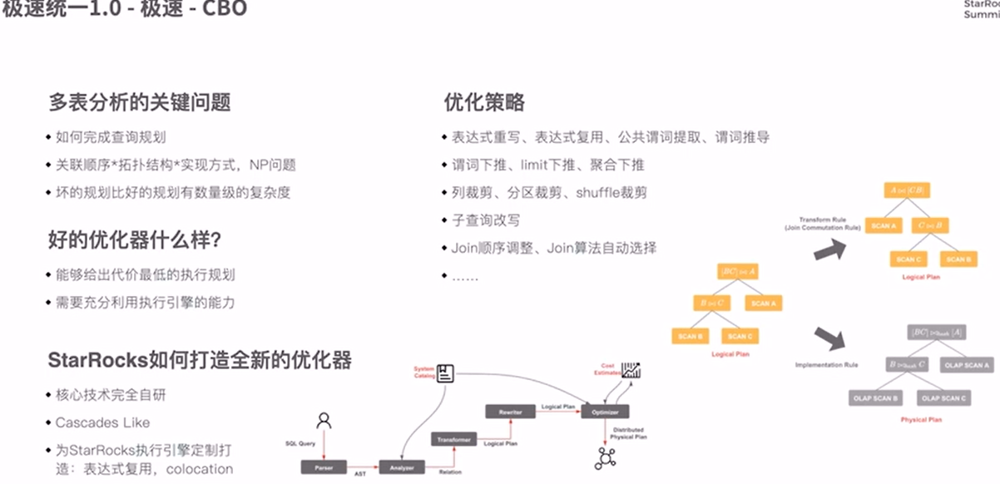
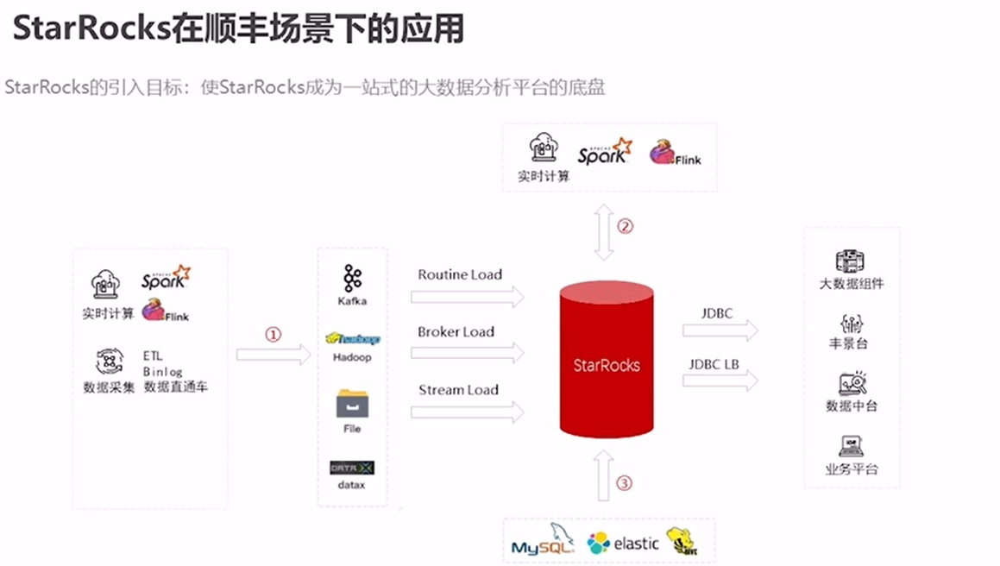

# StarRocks

## Official Docs

### 概述

#### What's StarRocks

- 新一代急速全场景MPP数据库
- StarRocks充分吸收`关系型OLAP数据库`和`分布式存储系统`在大数据时代的优秀研究成果，在业界实践的基础上，进一步改进优化、升级架构，并增添了众多全新功能，形成了全新的企业级产品
- StarRocks致力于构建**极速统一**分析体验，满足企业用户的多种数据分析场景，支持多种数据模型(明细模型、聚合模型、更新模型)，多种导入方式（批量和实时），可整合和接入多种现有系统(Spark、Flink、Hive、 ElasticSearch)。
- 兼容MySQL协议，可使用MySQL客户端和常用BI工具对接StarRocks来进行数据分析
- StarRocks采用`分布式架构`，对数据表进行`水平划分`并以`多副本存储`。集群规模可以灵活伸缩，能够支持10PB级别的数据分析; 支持MPP框架，并行加速计算; 支持多副本，具有`弹性容错`能力
- StarRocks采用`关系模型`，使用严格的数据类型和`列式存储引擎`，通过`编码和压缩技术`，降低读写放大；使用`向量化`执行方式，充分挖掘**多核CPU**的并行计算能力，从而显著提升查询性能

#### 特性

- 架构精简：

## Notes From Share

### online meeting

向量化执行引擎

### Liang Wang

#### BG

MPP-based

Doris -> StarRocks

国内的一个公司，自己拉的一个分支做开发

目标：把数据分析的所有组件全部取代

- 多维分析
- 实时分析
- 高并发查询
- Ad-hoc查询

特点：

- 低成本
- 线性扩展
- 支持云部署
- 高可用
- 高性能查询
- 高加载性能

关键技术：

- 列存
- 向量化

物化视图

准实时

宽表

