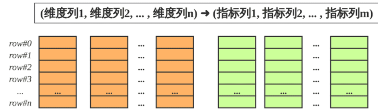
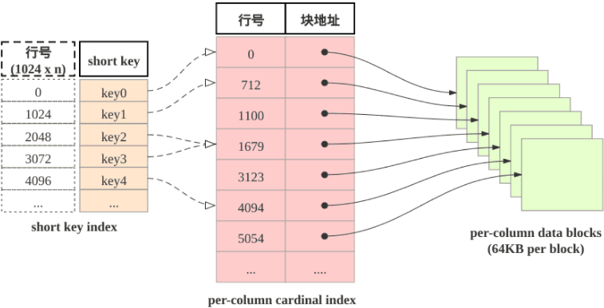
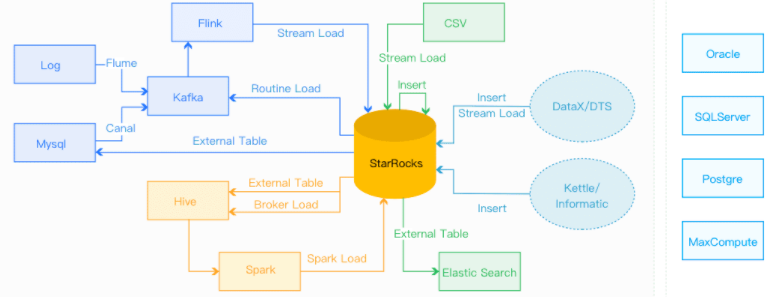
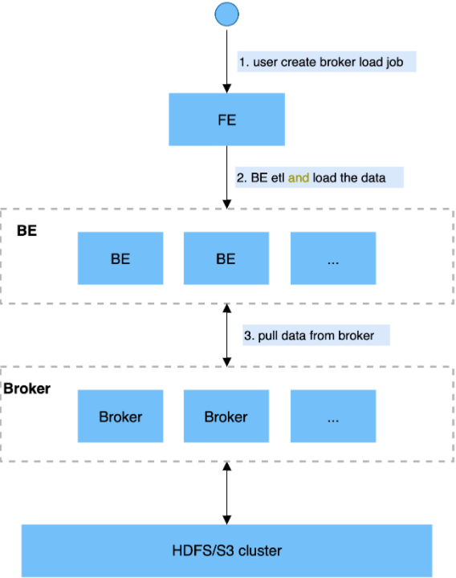

# StarRocks

## Official Docs

### 概述

#### What's StarRocks

- 新一代极速全场景MPP数据库
- StarRocks充分吸收`关系型OLAP数据库`和`分布式存储系统`在大数据时代的优秀研究成果，在业界实践的基础上，进一步改进优化、升级架构，并增添了众多全新功能，形成了全新的企业级产品
- StarRocks致力于构建**极速统一**分析体验，满足企业用户的多种数据分析场景，支持多种数据模型(明细模型、聚合模型、更新模型)，多种导入方式（批量和实时），可整合和接入多种现有系统(Spark、Flink、Hive、 ElasticSearch)。
- 兼容MySQL协议，可使用MySQL客户端和常用BI工具对接StarRocks来进行数据分析
- StarRocks采用`分布式架构`，对数据表进行`水平划分`并以`多副本存储`。集群规模可以灵活伸缩，能够支持10PB级别的数据分析; 支持MPP框架，并行加速计算; 支持多副本，具有`弹性容错`能力
- StarRocks采用`关系模型`，使用严格的数据类型和`列式存储引擎`，通过`编码和压缩技术`，降低读写放大；使用`向量化`执行方式，充分挖掘**多核CPU**的并行计算能力，从而显著提升查询性能

#### 特性

- 架构精简：StarRocks内部通过MPP计算框架完成SQL的具体执行工作。MPP框架本身能够充分的利用多节点的计算能力，整个查询并行执行，从而实现良好的交互式分析体验。 StarRocks集群不需要依赖任何其他组件，易部署、易维护，极简的架构设计，降低了StarRocks系统的复杂度和维护成本，同时也提升了系统的可靠性和扩展性。 管理员只需要专注于StarRocks系统，无需学习和管理任何其他外部系统。

- 全面向量化引擎：StarRocks的计算层全面采用了向量化技术，将所有算子、函数、扫描过滤和导入导出模块进行了系统性优化。通过列式的内存布局、适配CPU的SIMD指令集等手段，充分发挥了现代CPU的并行计算能力，从而实现亚秒级别的多维分析能力。

- 智能查询优化：StarRocks通过`CBO优化器(Cost Based Optimizer)`可以对复杂查询自动优化。无需人工干预，就可以通过统计信息合理估算执行成本，生成更优的执行计划，大大提高了Adhoc和ETL场景的数据分析效率。

- 联邦查询：StarRocks支持使用外表的方式进行联邦查询，当前可以支持Hive、MySQL、Elasticsearch三种类型的外表，用户无需通过数据导入，可以直接进行数据查询加速

- 高效更新：StarRocks支持多种数据模型，其中更新模型可以按照主键进行`upsert`/`delete`操作，通过存储和索引的优化可以在并发更新的同时实现高效的查询优化，更好的服务实时数仓的场景。

- 智能物化视图：StarRocks支持智能的`物化视图`。用户可以通过创建物化视图，预先计算生成预聚合表用于加速聚合类查询请求。StarRocks的物化视图能够在数据导入时自动完成汇聚，与原始表数据保持一致。并且在查询的时候，用户无需指定物化视图，StarRocks能够自动选择最优的物化视图来满足查询请求。

- 标准SQL：StarRocks支持标准的SQL语法，包括聚合、JOIN、排序、窗口函数和自定义函数等功能。StarRocks可以完整支持TPC-H的22个SQL和TPC-DS的99个SQL。此外，StarRocks还兼容MySQL协议语法，可使用现有的各种客户端工具、BI软件访问StarRocks，对StarRocks中的数据进行拖拽式分析。

- 流批一体：StarRocks支持`实时和批量`两种数据导入方式，支持的数据源有Kafka、HDFS、本地文件，支持的数据格式有ORC、Parquet和CSV等，StarRocks可以实时消费Kafka数据来完成数据导入，保证数据不丢不重（exactly once）。StarRocks也可以从本地或者远程（HDFS）批量导入数据。

- 高可用和易扩展：StarRocks的元数据和数据都是多副本存储，并且集群中服务有热备，多实例部署，避免了单点故障。集群具有自愈能力，可弹性恢复，节点的宕机、下线、异常都不会影响StarRocks集群服务的整体稳定性。 StarRocks采用分布式架构，存储容量和计算能力可近乎线性水平扩展。StarRocks单集群的节点规模可扩展到数百节点，数据规模可达到10PB级别。 扩缩容期间无需停服，可以正常提供查询服务。 另外StarRocks中表模式热变更，可通过一条简单SQL命令动态地修改表的定义，例如增加列、减少列、新建物化视图等。同时，处于模式变更中的表也可也正常导入和查询数据。

#### 适用场景

- OLAP多维分析
  - 用户行为分析
  - 用户画像、标签分析、圈人
  - 高维业务指标报表
  - 自助式报表平台
  - 业务问题探查分析
  - 跨主题业务分析
  - 财务报表
  - 系统监控分析
- 实时数据分析
  - 电商大促数据分析
  - 教育行业的直播质量分析
  - 物流行业的运单分析
  - 金融行业绩效分析、指标计算
  - 广告投放分析
  - 管理驾驶舱
  - 探针分析APM（Application Performance Management）
- 高并发查询
  - 广告主报表分析
  - 零售行业渠道人员分析
  - SaaS行业面向用户分析报表
  - Dashbroad多页面分析
- 统一分析
  - 通过使用一套系统解决多维分析、高并发查询、预计算、实时分析、Adhoc查询等场景，降低系统复杂度和多技术栈开发与维护成本。

### 表设计

#### 理解SR表设计

##### 列式存储



StarRocks的表`和关系型数据相同`, 由行和列构成. 每行数据对应用户一条记录, 每列数据有相同数据类型. 所有数据行的列数相同, 可以动态增删列

StarRocks中, 一张表的列可以分为`维度列`(也称为`key列`)和`指标列(value列)`, 维度列用于`分组和排序`, 指标列可通过聚合函数SUM, COUNT, MIN, MAX, REPLACE, HLL_UNION, BITMAP_UNION等累加起来. 因此, `StarRocks的表也可以认为是多维的key到多维指标的映射`。

在StarRocks中, 表中数据`按列存储`, 物理上, 一列数据会经过`分块编码压缩`等操作, 然后持久化于非易失设备, 但在逻辑上, `一列数据可以看成由相同类型的元素构成的数组`.  一行数据的所有列在各自的列数组中保持对齐, 即拥有相同的数组下标, 该下标称之为`序号或者行号`. 该序号是隐式, 不需要存储的, 表中的所有行按照维度列, 做多重排序, 排序后的位置就是该行的行号。

查询时, 如果指定了维度列的等值条件或者范围条件, 并且这些条件中维度列可构成表维度列的前缀, 则可以利用数据的有序性, 使用range-scan快速锁定目标行. 例如: 对于表table1: (event_day, siteid, citycode, username)➜(pv); 当查询条件为event_day > 2020-09-18 and siteid = 2, 则可以使用范围查找; 如果指定条件为citycode = 4 and username in ["Andy", "Boby", "Christian", "StarRocks"], 则无法使用范围查找

##### 稀疏索引

当范围查找时, 如何快速地找到起始的目标行呢? 答案是shortkey index. 如下图所示: shortkey索引为稀疏索引,



表中数据组织有主要由三部分构成:

1. shortkey index表:  表中数据每`1024`行, 构成一个`逻辑block`. 每个逻辑block在shortkey index表中存储`一项索引`, 内容为`表的维度列的前缀`, 并且不超过`36字节`.  shortkey index为`稀疏索引`, `用数据行的维度列的前缀查找索引表`, 可以确定该行数据所在`逻辑块的起始行号`。
2. Per-column data block: 表中`每一列数据按64KB分块存储`,  数据块作为一个单位单独编码压缩, 也作为IO单位, 整体写回设备或者读出。
3. Per-column cardinal index:  表中的每列数据有各自的行号索引表,  列的数据块和行号索引项一一对应, 索引项由数据块的起始行号和数据块的位置和长度信息构成, 用数据行的行号查找行号索引表, 可以获取包含该行号的数据块所在位置, 读取目标数据块后, 可以进一步查找数据。

由此可见, 查找维度列的前缀的查找过程为:  先查找shortkey index, 获得`逻辑块的起始行号`, 查找`维度列的行号索引`, 获得`目标列的数据块`, 读取数据块, 然后解压解码, 从数据块中找到维度列前缀对应的数据项

##### 加速数据处理

1. 预先聚合:  StarRocks支持聚合模型, 维度列取值相同数据行可合并一行, 合并后数据行的维度列取值不变, 指标列的取值为这些数据行的聚合结果, 用户需要给指标列指定聚合函数.  通过预先聚合, 可以加速聚合操作。
2. 分区分桶:  事实上StarRocks的表被划分成tablet, 每个tablet多副本冗余存储在BE上, BE和tablet的数量可以根据计算资源和数据规模而弹性伸缩. 查询时, 多台BE可并行地查找tablet快速获取数据. 此外, tablet的副本可复制和迁移, 增强了数据的可靠性, 避免了数据倾斜. 总之, 分区分桶保证了数据访问的高效性和稳定性。
3. RollUp表索引: shortkey index可加速数据查找, 然后shortkey index依赖维度列排列次序. 如果使用非前缀的维度列构造查找谓词, 则无法使用shortkey index. 用户可以为数据表创建若干RollUp表索引, RollUp表索引的数据组织和存储和数据表相同, 但RollUp表拥有自身的shortkey index. 用户创建RollUp表索引时, 可选择聚合的粒度, 列的数量, 维度列的次序; 使频繁使用的查询条件能够命中相应的RollUp表索引。
4. 列级别的索引技术:  Bloomfilter可快速判断数据块中不含所查找值, ZoneMap通过数据范围快速过滤待查找值, Bitmap索引可快速计算出枚举类型的列满足一定条件的行。

#### 数据模型

目前，StarRocks根据摄入数据和实际存储数据之间的`映射关系`, 其中`明细表对应明细模型（Duplicate Key）`，`聚合表对应聚合模型（Aggregate Key）`，`更新表对应更新模型（Unique Key）和主键模型（Primary Key）`。

- **明细模型：Duplicate Key**
- **聚合模型：Aggregate Key**
- **更新模型：Unique Key**
- **主键模型：Primary Key**


为了描述方便, 我们借鉴关系模式中的主键概念, 称StarRocks表的`维度列的取值`构成数据表的`排序键`, StarRocks的排序键对比传统的主键具有:

- 数据表所有`维度列构成排序键`, 所以后文中提及的排序列, key列本质上都是维度列。
- 排序键`可重复`, 不必满足唯一性约束。
- 数据表的`每一列, 以排序键的顺序, 聚簇存储`。
- 排序键使用`稀疏索引`。


对于摄入(ingest)的`主键重复的多行数据`, 填充于(populate)数据表中时, 按照三种处理方式划分:

- 明细模型:  表中存在主键重复的数据行, 和摄入数据行一一对应, 用户可以召回所摄入的全部历史数据。
- 聚合模型:  表中`不存在主键重复`的数据行, 摄入的主键重复的数据行`合并为一行`, 这些数据行的指标列通过聚合函数合并, 用户可以召回所摄入的全部历史数据的累积结果, 但无法召回全部历史数据。
- 更新模型&主键模型:  聚合模型的特殊情形, 主键满足唯一性约束, 最近导入的数据行, 替换掉其他主键重复的数据行. 相当于在聚合模型中, 为数据表的指标列指定的聚合函数为REPLACE, REPLACE函数返回一组数据中的最新数据。


需要注意:

- 建表语句, 排序列的定义必须出现在指标列定义之前。
- 排序列在建表语句中的出现次序为数据行的多重排序的次序。
- 排序键的稀疏索引(Shortkey Index)会选择排序键的若干前缀列

##### 明细模型

StarRocks建表的`默认模型`是明细模型（Duplicate Key）

一般用明细模型来处理的场景有如下特点：

1. 需要保留原始的数据（例如原始日志，原始操作记录等）来进行分析；
2. 查询方式灵活, 不局限于预先定义的分析方式, 传统的预聚合方式难以命中;
3. 数据`更新不频繁`。导入数据的来源一般为日志数据或者是时序数据,  以追加写为主要特点, 数据产生后就不会发生太多变化。


用户可以`指定数据表的排序列`, 没有明确指定的情况下, 那么StarRocks会为表`选择默认的几个列`作为排序列。这样，在查询中，有相关排序列的过滤条件时，StarRocks能够快速地过滤数据，降低整个查询的时延。

注意：在向StarRocks明细模型表中导入完全相同的两行数据时，StarRocks会认为是两行数据。


数据表默认采用明细模型. 排序列使用shortkey index, 可快速过滤数据. 用户可以考虑将过滤条件中频繁使用的维度列的定义放置其他列的定义之前. 例如用户经常查看某时间范围的某一类事件的数据，可以将事件时间和事件类型作为排序键。


例子：

```sql
CREATE TABLE IF NOT EXISTS detail (
    event_time DATETIME NOT NULL COMMENT "datetime of event",
    event_type INT NOT NULL COMMENT "type of event",
    user_id INT COMMENT "id of user",
    device_code INT COMMENT "device of ",
    channel INT COMMENT ""
)
DUPLICATE KEY(event_time, event_type)
DISTRIBUTED BY HASH(user_id) BUCKETS 8
```

其中`DUPLICATE KEY(event_time, event_type)`说明采用明细模型, 并且指定了`排序键`, 并且`排序列的定义在其他列定义之前`。


注意：

1. 充分利用排序列，在建表时将经常在查询中用于过滤的列放在表的前面，这样能够提升查询速度。
2. 明细模型中, 可以指定部分的维度列为排序键; 而聚合模型和更新模型中, 排序键只能是全体维度列。


##### 聚合模型

在数据分析领域，有很多需要对数据进行统计和汇总操作的场景，就需要使用聚合模型（Aggregate Key）。比如:

- 分析网站或APP访问流量，统计用户的访问总时长、访问总次数;
- 广告厂商为广告主提供的广告点击总量、展示总量、消费统计等;
- 分析电商的全年的交易数据, 获得某指定季度或者月份的, 各人口分类(geographic)的爆款商品。

适合采用聚合模型来分析的场景具有如下特点：

1. 业务方进行的查询为`汇总类查询`，比如sum、count、max等类型的查询；
2. `不需要召回原始的明细数据`；
3. 老数据`不会被频繁更新`，`只会追加新数据`


StarRocks会将指标列按照相同维度列进行聚合。当多条数据具有`相同的维度`时，StarRocks会`把指标进行聚合`。从而能够减少查询时所需要的处理的数据量，进而提升查询的效率。

以下面的原始数据为例：

| Date       | Country | PV   |
| :--------- | :------ | :--- |
| 2020.05.01 | CHN     | 1    |
| 2020.05.01 | CHN     | 2    |
| 2020.05.01 | USA     | 3    |
| 2020.05.01 | USA     | 4    |

在StarRocks聚合模型的表中，存储内容会从四条数据变为两条数据。这样在后续查询处理的时候，处理的数据量就会显著降低：

| Date       | Country | PV   |
| :--------- | :------ | :--- |
| 2020.05.01 | CHN     | 3    |
| 2020.05.01 | USA     | 7    |


在建表时, 只要给指标列的定义`指明聚合函数`, `就会启用聚合模型`; 用户可以使用`AGGREGATE KEY`显示地定义排序建。


以下是一个使用聚合模型创建数据表的例子：

- site_id, date, city_code为排序键; (没有使用DUPLICATE KEY则自动使用前几个字段作为排序键)
- pv为指标列, 使用聚合函数SUM。

```sql
CREATE TABLE IF NOT EXISTS example_db.aggregate_tbl (
    site_id LARGEINT NOT NULL COMMENT "id of site",
    date DATE NOT NULL COMMENT "time of event",
    city_code VARCHAR(20) COMMENT "city_code of user",
    pv BIGINT SUM DEFAULT "0" COMMENT "total page views"
)
DISTRIBUTED BY HASH(site_id) BUCKETS 8;
```


注意：

1. 聚合表中数据会分批次多次导入, `每次导入会形成一个版本`. 相同排序键的数据行聚合有三种触发方式: 1. 数据导入时, 数据落盘前的聚合; 2. 数据落盘后, 后台的多版本异步聚合; 3. 数据查询时, 多版本多路归并聚合。
2. 数据查询时, 指标列采用先聚合后过滤的方式, 把没必有做指标的列存储为维度列。
3. 聚合模型所支持的聚合函数列表请参考《Create Table语句说明》。


##### 更新模型

有些分析场景之下，数据会更新, StarRocks采用更新模型来满足这种需求。比如在电商场景中，定单的状态经常会发生变化，每天的订单更新量可突破上亿。在这种量级的更新场景下进行实时数据分析，如果在明细模型下通过delete+insert的方式，是无法满足频繁更新需求的; 因此, 用户需要使用更新模型来满足数据分析需求。如用户需要更加实时/频繁的更新功能，建议使用主键模型


以下是一些适合更新模型的场景特点：

1. 已经写入的数据有大量的`更新`需求；
2. 需要进行`实时`数据分析。


更新模型中, `排序键满足唯一性约束`, 成为主键。

StarRocks存储内部会给`每一个批次导入数据分配一个版本号`, 同一主键的数据可能有多个版本, 查询时最大(最新)版本的数据胜出

| ID   | value | _version |
| :--- | :---- | :------- |
| 1    | 100   | 1        |
| 1    | 101   | 2        |
| 2    | 100   | 3        |
| 2    | 101   | 4        |
| 2    | 102   | 5        |

具体的示例如上表所示，ID是表的主键，value是表的内容，而__version是StarRocks内部的版本号。其中ID为1的数据有两个导入批次，版本分别为1，2；ID为2的数据有三个批次导入，版本分别为3，4，5。在查询的时候对于ID为1只会返回最新版本2的数据，而对于ID为2只会返回最新版本5的数据，那么用户能够看到的数据如下表所示：

| ID   | value |
| :--- | :---- |
| 1    | 101   |
| 2    | 102   |

通过这种机制，StarRocks可以支持对于频繁更新数据的分析。


在电商订单分析场景中，经常根据订单状态进行的统计分析。因为订单状态经常改变，而create_time和order_id不会改变，并且经常会在查询中作为过滤条件。所以可以将 create_time和order_id 两个列作为这个表的主键（即，在建表时用`UNIQUE KEY`关键字定义），这样既能够满足订单状态的更新需求，又能够在查询中进行快速过滤

以下是一个使用更新模型创建数据表的例子：

- 用`UNIQUE KEY(create_time, order_id)`做主键, 其中create_time, order_id为排序列, 其定义在其他列定义之前出现;
- order_state和total_price为指标列, 其聚合类型为REPLACE。

```sql
CREATE TABLE IF NOT EXISTS detail (
    create_time DATE NOT NULL COMMENT "create time of an order",
    order_id BIGINT NOT NULL COMMENT "id of an order",
    order_state INT COMMENT "state of an order",
    total_price BIGINT COMMENT "price of an order"
)
UNIQUE KEY(create_time, order_id)
DISTRIBUTED BY HASH(order_id) BUCKETS 8
```

注意：

1. 导入数据时需要将所有字段补全才能够完成更新操作，即，上述例子中的create_time、order_id、order_state和total_price四个字段都需必须存在。
2. 对于更新模型的数据读取，需要在查询时完成多版本合并，当版本过多时会导致查询性能降低。所以在向更新模型导入数据时，应该适当降低导入频率，从而提升查询性能。建议在设计导入频率时以满足业务对实时性的要求为准。如果业务对实时性的要求是分钟级别，那么每分钟导入一次更新数据即可，不需要秒级导入。
3. 在查询时，对于value字段的过滤通常在多版本合并之后。将经常过滤字段且不会被修改的字段放在主键上, 能够在合并之前就将数据过滤掉，从而提升查询性能。
4. 因为合并过程需要将所有主键字段进行比较，所以应该避免放置过多的主键字段，以免降低查询性能。如果某个字段只是偶尔会作为查询中的过滤条件存在，不需要放在主键中。

##### 主键模型

相较更新模型，主键模型（Primary Key）可以`更好地支持实时/频繁更新`的功能。该类型的表要求有唯一的主键，支持对表中的行按主键进行更新和删除操作。


TODO

 


### 数据导入

#### 导入总览

SR支持多种数据模型，SR中存储的数据需要安装特定的模型进行组织(表设计)，数据导入是：`将原始数据按照相应的模型进行清洗转换并加载到SR中`。

SR提供多种导入方式，可以按照数据量大小、导入频率等要求选择合适的导入方式：



- `离线数据导入`：
  - 如果数据源是`Hive/HDFS`，推荐采用`Broker Load`导入
  - 如果`数据表很多`，导入麻烦，则可以使用`Hive外表直连查询`，性能会比Broker Load`差`，但是可以`避免数据搬迁`。
  - 如果`单表数据量很大`，或需要做`全局数据字典来精确去重`，可以使用`Spark Load`导入。
- 实时数据导入：`日志、业务数据库binlog`同步到`kafka`后，有限推荐`Routine Load`导入SR，如果导入，如果导入过程中有`多表关联和ETL预处理`，可以使用`Flink处理`以后用`Stream Load`导入SR，有标准的[Flink-connector](https://docs.starrocks.com/zh-cn/main/loading/Flink-starrocks-connector)可以方便Flink任务使用。
- 程序写入StarRocks，推荐使用[Stream Load](https://docs.starrocks.com/zh-cn/main/loading/StreamLoad)，可以参考[例子](https://github.com/StarRocks/demo/tree/master/MiscDemo/stream_load)中有Java/Python的demo。文本文件导入推荐使用 Stream load
- Mysql数据导入，推荐使用[Mysql外表](https://docs.starrocks.com/zh-cn/main/using_starrocks/External_table)，insert into new_table select * from external_table 的方式导入
- 其他数据源导入，推荐使用DataX导入，我们提供了[DataX-starrocks-writer](https://docs.starrocks.com/zh-cn/main/loading/DataX-starrocks-writer)
- StarRocks内部导入，可以在StarRocks内部使用[insert into tablename select](https://docs.starrocks.com/zh-cn/main/loading/InsertInto)的方式导入，可以跟外部调度器配合实现简单的ETL处理。

#### Broker Load

StarRocks支持从Apache HDFS、Amazon S3等外部存储系统导入数据，支持CSV、ORCFile、Parquet等文件格式。数据量在几十GB到上百GB 级别。

在Broker Load模式下，通过部署的`Broker程序`，StarRocks可读取对应数据源（如HDFS, S3）上的数据，利用自身的计算资源对数据进行`预处理和导入`。这是一种`异步`的导入方式，用户需要通过MySQL协议`创建导入`，并通过`查看导入命令检查导入结果`。

- Broker: Broker 为一个独立的无状态进程，封装了文件系统接口，为 StarRocks 提供读取远端存储系统中文件的能力。
- Plan: 导入执行计划，BE会执行导入执行计划将数据导入到StarRocks系统中。


原理：

用户在提交导入任务后，FE 会生成对应的 Plan 并根据目前 BE 的个数和文件的大小，将 Plan 分给多个 BE 执行，每个 BE 执行一部分导入任务。BE 在执行过程中会通过 Broker 拉取数据，在对数据预处理之后将数据导入系统。所有 BE 均完成导入后，由 FE 最终判断导入是否成功。




支持的远程文件系统

- Apache HDFS
- Amazon S3
- 阿里云 OSS
- 腾讯 COS


## Notes From Share

### online meeting


向量化执行引擎


### Liang Wang

#### BG

MPP-based

Doris -> StarRocks

国内的一个公司，自己拉的一个分支做开发


目标：把数据分析的所有组件全部取代

- 多维分析
- 实时分析
- 高并发查询
- Ad-hoc查询

特点：

- 低成本
- 线性扩展
- 支持云部署
- 高可用
- 高性能查询
- 高加载性能


关键技术：

- 列存
- 向量化


物化视图

准实时

宽表


