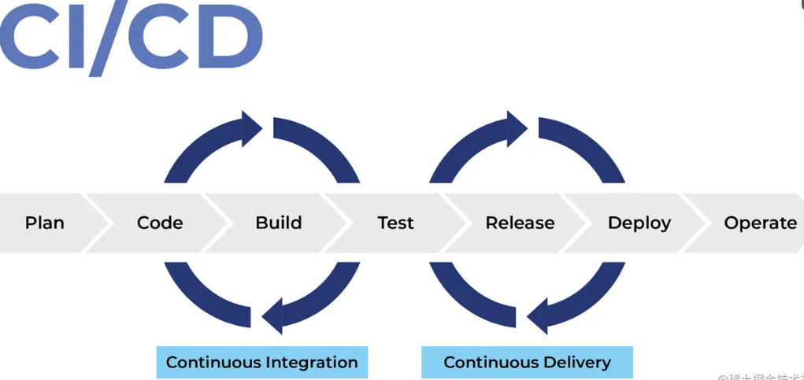
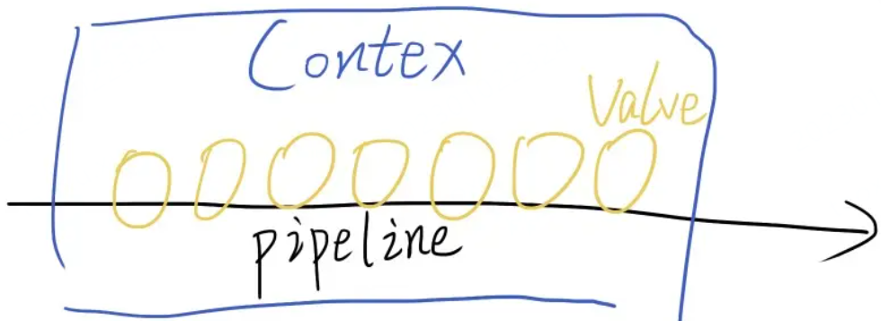
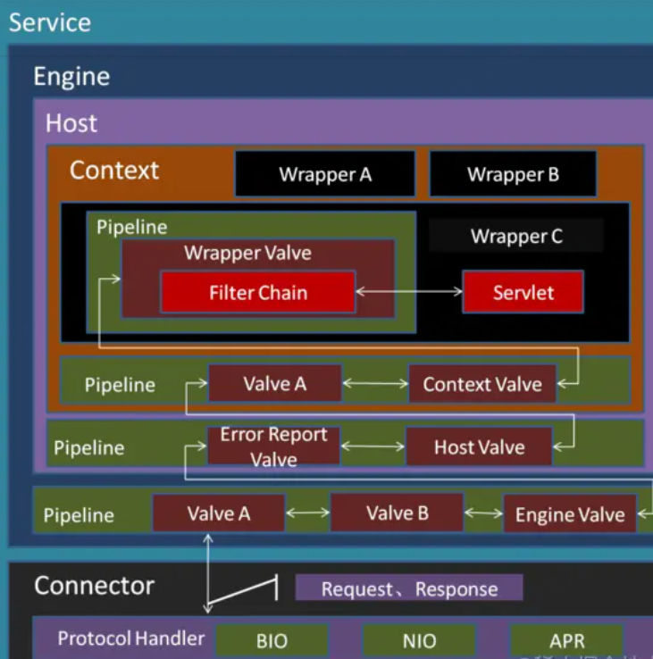
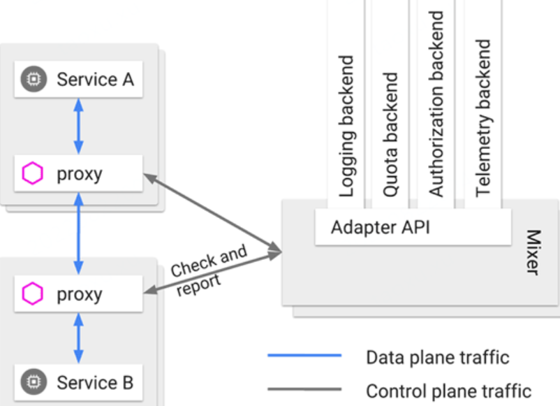
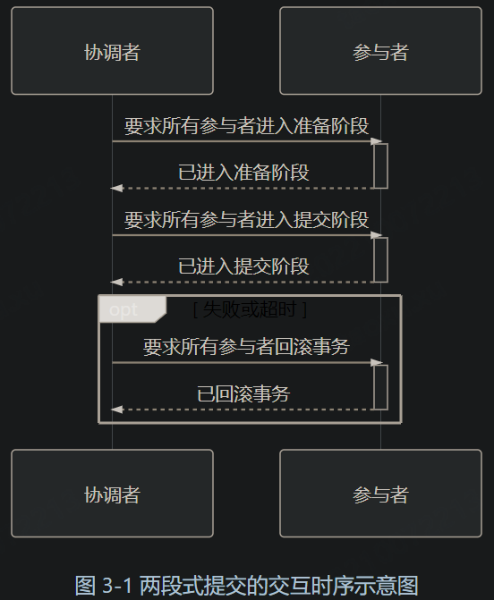
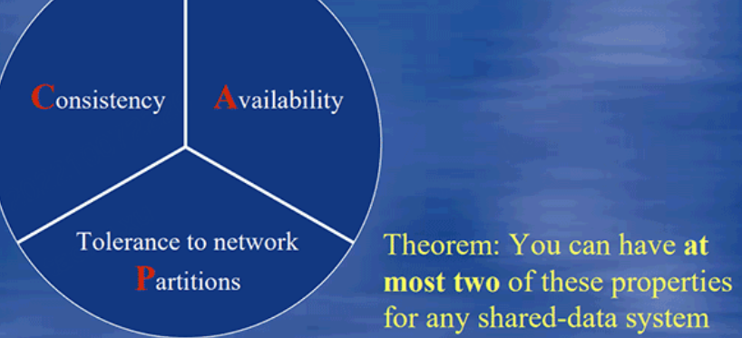

# Architecture Notes

> Learn architecture knowledge

## My Notes

### Design Pattern

##### pipeline

pipeline设计模式

Pipeline设计模式其实很简单，就像是我们常用的CI/CD的Pipeline一样，一个环节做一件事情，最终串联成一个完整的Pipeline



Pipeline设计模式有三个概念：Pipeline、Valve、Context。



一条Pipeline有一个Context，多个Valve。这些Valve是很小的、单元化的，一个Valve只做一件简单的事。前后Valve之间的通信由Context来承载

Context是一个简单的POJO类，存放这条Pipeline里面的数据

```java
public interface Pipeline {
    void init(PipelineConfig config);
    void start();
    Context getContext();
}
public class Context {
    
}
public interface Valve {
    void invoke(Context context);
    void invokeNext(Context context);
    String getValveName();
}
```

Pipeline设计模式的精髓在于它的可配置化。使用Pipeline，如果你想调换Valve的顺序，或者某些业务是不是用某个Valve，都是可以在外部配置的。这样就可以很灵活地适配多样化的业务，针对不同的业务配置不同的处理流程。

仔细看Pipeline，是不是发现它像极了我们Web请求的Filter？我们在`web.xml`通过配置的方式定义使用哪些Filter，最终形成了一个Filter链。它的Context，就是request和response。而是否执行、什么时候执行下一个Filter，是显式调用的：

```
filterChain.doFilter(request, response); 
复制代码
```

Tomcat也广泛使用了Pipeline设计模式



事实上我们可以有很多种方式来实现配置化。你可以放在xml或者yml文件里，可以用Json的形式，放在统一的配置中心或者数据库里。甚至可以像Jenkins一样，写一个groovy的代码来跑Pipeline，这取决于你的实现。

大概长这样：

```json
{
    "scene_a": {
        "valves": [
            "checkOrder",
            "checkPayment",
            "checkDiscount",
            "computeMount",
            "payment",
            "DeductInventory"
        ],
        "config": {
            "sendEmail": true,
            "supportAlipay": true
        }
    }
}
```

如果你的业务相对稳定，业务线多，但变化相对较小。也可以使用Pipeline设计模式，但如果不想做成配置化，也可以直接在代码里写死，显式调用


## 凤凰架构

http://icyfenix.cn/

### 前言

这是一部以“**如何构建一套可靠的分布式大型软件系统**”为叙事主线的开源文档，是一幅帮助开发人员整理现代软件架构各条分支中繁多知识点的技能地图

“Phoenix”这个词东方人不常用，但在西方的软件工程读物——尤其是关于 Agile、DevOps 话题的作品中时常出现。软件工程小说《[The Phoenix Project](https://book.douban.com/subject/20644908/)》讲述了徘徊在死亡边缘的 Phoenix 项目在精益方法下浴火重生的故事；马丁·福勒（Martin Fowler）对《[Continuous Delivery](https://book.douban.com/subject/4327796/)》的诠释里，曾多次提到“[Phoenix Server](https://martinfowler.com/bliki/PhoenixServer.html)”（取其能够“涅槃重生”之意）与“[Snowflake Server](https://martinfowler.com/bliki/SnowflakeServer.html)”（取其“世界上没有相同的两片雪花”之意）的优劣比对。也许是东西方的文化的差异，尽管有“失败是成功之母”这样的谚语，但我们东方人的骨子里更注重的还是一次把事做对做好，尽量别出乱子；而西方人则要“更看得开”一些，把出错看做正常甚至是必须的发展过程，只要出了问题能够兜底使其重回正轨便好。

在软件工程里，任何产品的研发，只要时间尺度足够长，人就总会疏忽犯错，代码就总会携有缺陷，电脑就总会宕机崩溃，网络就总会堵塞中断……如果一项工程需要大量的人员，共同去研发某个大规模的软件产品，并使其分布在网络中大量的服务器节点中同时运行，随着项目规模的增大、运作时间变长，其必然会受到墨菲定律的无情打击。

> 墨菲定律（Murphy's Law）
>
> Anything that can go wrong will go wrong.
> 如果事情可能出错就总会出错。


软件架构风格从大型机（Mainframe），到[原始分布式](https://icyfenix.cn/architecture/architect-history/primitive-distribution.html)（Distributed），到[大型单体](https://icyfenix.cn/architecture/architect-history/monolithic.html)（Monolithic），到[面向服务](https://icyfenix.cn/architecture/architect-history/soa.html)（Service-Oriented），到[微服务](https://icyfenix.cn/architecture/architect-history/microservices.html)（Microservices），到[服务网格](https://icyfenix.cn/architecture/architect-history/post-microservices.html)（Service Mesh），到[无服务](https://icyfenix.cn/architecture/architect-history/serverless.html)（Serverless）

### 服务架构演进

#### 原始分布式时代

> UNIX 的分布式设计哲学
>
> Simplicity of both the interface and the implementation are more important than any other attributes of the system — including correctness, consistency, and completeness
>
> 保持接口与实现的简单性，比系统的任何其他属性，包括准确性、一致性和完整性，都来得更加重要。

可能与绝大多数人心中的认知会有差异，“**使用多个独立的分布式服务共同构建一个更大型系统**”的设想与实际尝试，反而要**比今天大家所了解的大型单体系统出现的时间更早**

#### 单体系统

> 单体架构（Monolithic）
>
> “单体”只是表明系统中主要的过程调用都是进程内调用，不会发生进程间通信，仅此而已。

“单体架构”在整个软件架构演进的历史进程里，是出现时间最早、应用范围最广、使用人数最多、统治历史最长的一种架构风格，但“单体”这个名称，却是在微服务开始流行之后才“事后追认”所形成的概念。此前，并没有多少人将“单体”视作一种架构来看待

从纵向角度来看，笔者从未见过实际生产环境里有哪个大型的现代信息系统是完全不分层的。分层架构（Layered Architecture）已是现在几乎所有信息系统建设中都普遍认可、采用的软件设计方法，无论是单体还是微服务，抑或是其他架构风格，都会对代码进行纵向层次划分，收到的外部请求在各层之间以不同形式的数据结构进行流转传递，触及最末端的数据库后按相反的顺序回馈响应


**从横向角度来看，单体架构也可以支持按照技术、功能、职责等维度，将软件拆分为各种模块，以便重用和管理代码**。**<u>单体系统并不意味着只能有一个整体的程序封装形式</u>**，如果需要，它完全可以由多个 JAR、WAR、DLL、Assembly 或者其他模块格式来构成。即使是**以横向扩展（Scale Horizontally）的角度来衡量，在负载均衡器之后同时部署若干个相同的单体系统副本，以达到分摊流量压力的效果，也是非常常见的需求**。

#### SOA时代

> SOA 架构（Service-Oriented Architecture）
>
> 面向服务的架构是一次具体地、系统性地成功解决分布式服务主要问题的架构模式。

为了**对大型的单体系统进行拆分，让每一个子系统都能独立地部署、运行、更新**，开发者们曾经尝试过多种方案，这里列举以下三种较有代表性的架构模式:

- [烟囱式架构](https://en.wikipedia.org/wiki/Information_silo)（Information Silo Architecture）：信息烟囱又名信息孤岛（Information Island），使用这种架构的系统也被称为孤岛式信息系统或者烟囱式信息系统。它指的是一种完全不与其他相关信息系统进行互操作或者协调工作的设计模式。这样的系统其实并没有什么“架构设计”可言. 

- [微内核架构](https://en.wikipedia.org/wiki/Microkernel)（Microkernel Architecture）：微内核架构也被称为插件式架构（Plug-in Architecture）。既然在烟囱式架构中，没有业务往来关系的系统也可能需要共享人员、组织、权限等一些的公共的主数据，那不妨就将这些主数据，连同其他可能被各子系统使用到的公共服务、数据、资源集中到一块，成为一个被所有业务系统共同依赖的核心（Kernel，也称为 Core System），具体的业务系统以插件模块（Plug-in Modules）的形式存在，这样也可提供可扩展的、灵活的、天然隔离的功能特性，即微内核架构

  

- [事件驱动架构](https://en.wikipedia.org/wiki/Event-driven_architecture)（Event-Driven Architecture）：为了能让子系统互相通信，一种可行的方案是在子系统之间建立一套事件队列管道（Event Queues），来自系统外部的消息将以事件的形式发送至管道中，各个子系统从管道里获取自己感兴趣、能够处理的事件消息，也可以为事件新增或者修改其中的附加信息，甚至可以自己发布一些新的事件到管道队列中去，如此，每一个消息的处理者都是独立的，高度解耦的，但又能与其他处理者（如果存在该消息处理者的话）通过事件管道进行互动

  

- 

软件架构来到 SOA 时代，许多概念、思想都已经能在今天微服务中找到对应的身影了，譬如**服务之间的松散耦合、注册、发现、治理，隔离、编排，**等等。这些在今天微服务中耳熟能详的名词概念，大多数也是在分布式服务刚被提出时就已经可以预见的困难点。SOA 针对这些问题，甚至是针对“软件开发”这件事情本身，都进行了更加系统性、更加具体的探索。

#### 微服务

> 微服务架构（Microservices）
>
> 微服务是一种通过多个小型服务组合来构建单个应用的架构风格，这些服务围绕业务能力而非特定的技术标准来构建。各个服务可以采用不同的编程语言，不同的数据存储技术，运行在不同的进程之中。服务采取轻量级的通信机制和自动化的部署机制实现通信与运维。

微服务”这个技术名词最早在 2005 年就已经被提出，它是由 Peter Rodgers 博士在 2005 年度的云计算博览会（Web Services Edge 2005）上首次使用，当时的说法是“Micro-Web-Service”，指的是一种专注于单一职责的、语言无关的、细粒度 Web 服务（Granular Web Services）。“微服务”一词并不是 Peter Rodgers 直接凭空创造出来的概念，最初的微服务可以说是 SOA 发展时催生的产物，就如同 EJB 推广过程中催生了 Spring 和 Hibernate 那样，这一阶段的微服务是作为一种 SOA 的轻量化的补救方案而被提出的。时至今日，在英文版的维基百科上，仍然将微服务定义为一种 SOA 的变种形式，所以微服务在最初阶段与 SOA、Web Service 这些概念有所牵扯也完全可以理解

微服务真正的崛起是在 2014 年，相信阅读此文的大多数读者，也是从 Martin Fowler 与 James Lewis 合写的文章《[Microservices: A Definition of This New Architectural Term](https://martinfowler.com/articles/microservices.html)》中首次了解到微服务的

微服务的九个核心的业务与技术特征:

- **围绕业务能力构建**（Organized around Business Capability）
- **分散治理**（Decentralized Governance）。
- **通过服务来实现独立自治的组件**（Componentization via Services）
- **产品化思维**（Products not Projects）
- **数据去中心化**（Decentralized Data Management）
- **强终端弱管道**（Smart Endpoint and Dumb Pipe）
- **容错性设计**（Design for Failure）
- **演进式设计**（Evolutionary Design）
- **基础设施自动化**（Infrastructure Automation）

#### 后微服务时代

后微服务时代（Cloud Native）

从软件层面独力应对微服务架构问题，发展到软、硬一体，合力应对架构问题的时代，此即为“后微服务时代”。

虚拟化 容器化

2017 年是容器生态发展历史中具有里程碑意义的一年。在这一年，长期作为 Docker 竞争对手的[RKT 容器](https://coreos.com/rkt/docs/latest/)一派的领导者 CoreOS 宣布放弃自己的容器管理系统 Fleet，未来将会把所有容器管理的功能移至 Kubernetes 之上去实现。在这一年，容器管理领域的独角兽 Rancher Labs 宣布放弃其内置了数年的容器管理系统 Cattle，提出了“All-in-Kubernetes”战略，把 1.x 版本时就能够支持多种容器编排系统的管理工具 Rancher，从 2.0 版本开始“反向升级”为完全绑定于 Kubernetes 这单一种系统。在这一年，Kubernetes 的主要竞争者 Apache Mesos 在 9 月正式宣布了“[Kubernetes on Mesos](https://k8smeetup.github.io/docs/getting-started-guides/mesos/)”集成计划，由竞争关系转为对 Kubernetes 提供支持，使其能够与 Mesos 的其他一级框架（如[HDFS](https://docs.mesosphere.com/latest/usage/service-guides/hdfs/)、[Spark](https://docs.mesosphere.com/latest/usage/service-guides/spark/) 和[Chronos](https://mesos.github.io/chronos/docs/getting-started.html)等）进行集群资源动态共享、分配与隔离。在这一年，Kubernetes 的最大竞争者 Docker Swarm 的母公司 Docker，终于在 10 月被迫宣布 Docker 要同时支持 Swarm 与 Kubernetes 两套容器管理系统，也即在事实上承认了 Kubernetes 的统治地位。这场已经持续了三、四年时间，以 **Docker Swarm、Apache Mesos 与 Kubernetes** 为主要竞争者的“容器编排战争”终于有了明确的结果，Kubernetes 登基加冕是容器发展中一个时代的终章，也将是软件架构发展下一个纪元的开端。

同一个分布式服务的问题在传统 Spring Cloud 中提供的应用层面的解决方案与在 Kubernetes 中提供的基础设施层面的解决方案：

|          | Kubernetes              | Spring Cloud          |
| -------- | ----------------------- | --------------------- |
| 弹性伸缩 | Autoscaling             | N/A                   |
| 服务发现 | KubeDNS / CoreDNS       | Spring Cloud Eureka   |
| 配置中心 | ConfigMap / Secret      | Spring Cloud Config   |
| 服务网关 | Ingress Controller      | Spring Cloud Zuul     |
| 负载均衡 | Load Balancer           | Spring Cloud Ribbon   |
| 服务安全 | RBAC API                | Spring Cloud Security |
| 跟踪监控 | Metrics API / Dashboard | Spring Cloud Turbine  |
| 降级熔断 | N/A                     | Spring Cloud Hystrix  |


但 Kubernetes 仍然没有能够完美解决全部的分布式问题——“不完美”的意思是，仅从功能上看，单纯的 Kubernetes 反而不如之前的 Spring Cloud 方案。这是因为有一些问题处于应用系统与基础设施的边缘，使得完全在基础设施层面中确实很难精细化地处理。举个例子，微服务 A 调用了微服务 B 的两个服务，称为 B1和 B2，假设 B1表现正常但 B2出现了持续的 500 错，那在达到一定阈值之后就应该对 B2进行熔断，以避免产生[雪崩效应](https://en.wikipedia.org/wiki/Snowball_effect)。如果仅在基础设施层面来处理，这会遇到一个两难问题，切断 A 到 B 的网络通路则会影响到 B1的正常调用，不切断的话则持续受 B2的错误影响。

为了解决这一类问题，虚拟化的基础设施很快完成了第二次进化，引入了今天被称为“[服务网格](https://en.wikipedia.org/wiki/Service_mesh)”（Service Mesh）的“**边车代理模式”（Sidecar Proxy）**



这个场景里指的具体含义是由系统自动在服务容器（通常是指 Kubernetes 的 Pod）中注入一个通信代理服务器，相当于那个挎斗，以类似网络安全里中间人攻击的方式进行流量劫持，在应用毫无感知的情况下，悄然接管应用所有对外通信。这个代理除了实现正常的服务间通信外（称为数据平面通信），还接收来自控制器的指令（称为控制平面通信），根据控制平面中的配置，对数据平面通信的内容进行分析处理，以实现熔断、认证、度量、监控、负载均衡等各种附加功能。这样便实现了既不需要在应用层面加入额外的处理代码，也提供了几乎不亚于程序代码的精细管理能力。

上帝的归上帝，凯撒的归凯撒，**业务与技术完全分离**，远程与本地完全透明，也许这就是最好的时代了吧？

#### 无服务时代

无服务架构（**Serverless**）

如果说微服务架构是分布式系统这条路的极致，那无服务架构，也许就是“不分布式”的云端系统这条路的起点。

人们研究分布式架构，最初是由于单台机器的性能无法满足系统的运行需要，尽管在后来架构演进过程中，容错能力、技术异构、职责划分等各方面因素都成为架构需要考虑的问题，但其中获得更好性能的需求在架构设计中依然占很大的比重。对软件研发而言，不去做分布式无疑才是最简单的，如果单台服务器的性能可以是无限的，那架构演进的结果肯定会与今天有很大的差别，分布式也好，容器化也好，微服务也好，恐怕都未必会如期出现

无服务现在还没有一个特别权威的“官方”定义，但它的概念并没有前面各种架构那么复杂，本来无服务也是以“简单”为主要卖点的，它只涉及两块内容：后端设施（Backend）和函数（Function）

- **后端设施**是指数据库、消息队列、日志、存储，等等这一类用于支撑业务逻辑运行，但本身无业务含义的技术组件，这些后端设施都运行在云中，无服务中称其为“后端即服务”（Backend as a Service，BaaS）。
- **函数**是指业务逻辑代码，这里函数的概念与粒度，都已经很接近于程序编码角度的函数了，其区别是无服务中的函数运行在云端，不必考虑算力问题，不必考虑容量规划（从技术角度可以不考虑，从计费的角度你的钱包够不够用还是要掂量一下的），无服务中称其为“函数即服务”（Function as a Service，FaaS）。


### 架构师的视觉

#### 远程服务调用

[远程服务调用](https://en.wikipedia.org/wiki/Remote_procedure_call)（Remote Procedure Call，RPC）在计算机科学中已经存在了超过四十年时间

##### 进程间通信

RPC 出现的最初目的，就是**为了让计算机能够跟调用本地方法一样去调用远程方法**

几个关键：

- 方法参数
- 方法版本
- 指定被调方法
- 返回执行结果

“[进程间通信](https://en.wikipedia.org/wiki/Inter-process_communication)”（Inter-Process Communication，IPC）几种实现：

- **管道**（Pipe）或者**具名管道**（Named Pipe）： ：管道类似于两个进程间的桥梁，可通过管道在进程间传递少量的字符流或字节流。普通管道只用于有亲缘关系进程（由一个进程启动的另外一个进程）间的通信，具名管道摆脱了普通管道没有名字的限制，除具有管道所有的功能外，它还允许无亲缘关系进程间的通信。管道典型的应用就是命令行中的`|`操作符
- **信号**（Signal）：信号用于通知目标进程有某种事件发生，除了用于进程间通信外，进程还可以发送信号给进程自身。信号的典型应用是`kill`命令
- **信号量**（Semaphore）：信号量用于两个进程之间同步协作手段，它相当于操作系统提供的一个特殊变量，程序可以在上面进行`wait()`和`notify()`操作。
- **消息队列**（Message Queue）：以上三种方式只适合传递传递少量信息，POSIX 标准中定义了消息队列用于进程间数据量较多的通信。进程可以向队列添加消息，被赋予读权限的进程则可以从队列消费消息。消息队列克服了信号承载信息量少，管道只能用于无格式字节流以及缓冲区大小受限等缺点，但实时性相对受限。
- **共享内存**（Shared Memory）：允许多个进程访问同一块公共的内存空间，这是效率最高的进程间通信形式。原本每个进程的内存地址空间都是相互隔离的，但操作系统提供了让进程主动创建、映射、分离、控制某一块内存的程序接口。当一块内存被多进程共享时，各个进程往往会与其它通信机制，譬如信号量结合使用，来达到进程间同步及互斥的协调操作
- **套接字接口**（Socket）：消息队列和共享内存只适合单机多进程间的通信，套接字接口是更为普适的进程间通信机制，可用于不同机器之间的进程通信。套接字（Socket）起初是由 UNIX 系统的 BSD 分支开发出来的，现在已经移植到所有主流的操作系统上。出于效率考虑，当仅限于本机进程间通信时，套接字接口是被优化过的，不会经过网络协议栈，不需要打包拆包、计算校验和、维护序号和应答等操作，只是简单地将应用层数据从一个进程拷贝到另一个进程，这种进程间通信方式有个专名的名称：UNIX Domain Socket，又叫做 IPC Socket。

1987 年，在“透明的 RPC 调用”一度成为主流范式的时候，Andrew Tanenbaum 教授曾发表了论文《[A Critique of The Remote Procedure Call Paradigm](https://www.cs.vu.nl/~ast/Publications/Papers/euteco-1988.pdf)》，对这种透明的 RPC 范式提出了一系列质问：

- 两个进程通信，谁作为服务端，谁作为客户端？
- 怎样进行异常处理？异常该如何让调用者获知？
- 服务端出现多线程竞争之后怎么办？
- 如何提高网络利用的效率，譬如连接是否可被多个请求复用以减少开销？是否支持多播？
- 参数、返回值如何表示？应该有怎样的字节序？
- 如何保证网络的可靠性？譬如调用期间某个链接忽然断开了怎么办？
- 发送的请求服务端收不到回复该怎么办？
- ……

最终，到 1994 年至 1997 年间，由 ACM 和 Sun 院士[Peter Deutsch](https://en.wikipedia.org/wiki/L._Peter_Deutsch)、套接字接口发明者[Bill Joy](https://en.wikipedia.org/wiki/Bill_Joy)、Java 之父[James Gosling](https://en.wikipedia.org/wiki/James_Gosling)等一众在 Sun Microsystems 工作的大佬们共同总结了[通过网络进行分布式运算的八宗罪](https://en.wikipedia.org/wiki/Fallacies_of_distributed_computing)（8 Fallacies of Distributed Computing）：

1. The network is reliable —— 网络是可靠的。
2. Latency is zero —— 延迟是不存在的。
3. Bandwidth is infinite —— 带宽是无限的。
4. The network is secure —— 网络是安全的。
5. Topology doesn't change —— 拓扑结构是一成不变的。
6. There is one administrator —— 总会有一个管理员。
7. Transport cost is zero —— 不必考虑传输成本。
8. The network is homogeneous —— 网络是同质化的。

以上这八条反话被认为是程序员在网络编程中经常被忽略的八大问题，潜台词就是如果远程服务调用要弄透明化的话，就必须为这些罪过埋单，这算是给 RPC 是否能等同于 IPC 来实现**暂时**定下了一个具有公信力的结论

#### REST

REST 与 RPC 在思想上差异的核心是抽象的目标不一样，即面向资源的编程思想与面向过程的编程思想两者之间的区别。

而概念上的不同是指 REST 并不是一种远程服务调用协议，甚至可以把定语也去掉，它就不是一种协议。协议都带有一定的规范性和强制性，最起码也该有个规约文档，譬如 JSON-RPC，它哪怕再简单，也要有个《[JSON-RPC Specification](https://www.jsonrpc.org/specification)》来规定协议的格式细节、异常、响应码等信息，但是 REST 并没有定义这些内容，尽管有一些指导原则，但实际上并不受任何强制的约束。常有人批评某个系统接口“设计得不够 RESTful”，其实这句话本身就有些争议，REST 只能说是风格而不是规范、协议，并且能完全达到 REST 所有指导原则的系统也是不多见的

 REST 源于 Roy Thomas Fielding 在 2000 年发表的博士论文：《[Architectural Styles and the Design of Network-based Software Architectures](https://www.ics.uci.edu/~fielding/pubs/dissertation/top.htm)》，此文的确是 REST 的源头，但我们不应该忽略 Fielding 的身份和此前的工作背景，这些信息对理解 REST 的设计思想至关重要。

**超文本（或超媒体，Hypermedia）”是一种“能够对操作进行判断和响应的文本（或声音、图像等）**


- **资源**（Resource）：譬如你现在正在阅读一篇名为《REST 设计风格》的文章，这篇文章的内容本身（你可以将其理解为其蕴含的信息、数据）我们称之为“资源”。无论你是购买的书籍、是在浏览器看的网页、是打印出来看的文稿、是在电脑屏幕上阅读抑或是手机上浏览，尽管呈现的样子各不相同，但其中的信息是不变的，你所阅读的仍是同一份“资源”。
- **表征**（Representation）：当你通过电脑浏览器阅读此文章时，浏览器向服务端发出请求“我需要这个资源的 HTML 格式”，服务端向浏览器返回的这个 HTML 就被称之为“表征”，你可能通过其他方式拿到本文的 PDF、Markdown、RSS 等其他形式的版本，它们也同样是一个资源的多种表征。可见“表征”这个概念是指信息与用户交互时的表示形式，这与我们软件分层架构中常说的“表示层”（Presentation Layer）的语义其实是一致的。
- **状态**（State）：当你读完了这篇文章，想看后面是什么内容时，你向服务器发出请求“给我下一篇文章”。但是“下一篇”是个相对概念，必须依赖“当前你正在阅读的文章是哪一篇”才能正确回应，这类在特定语境中才能产生的上下文信息即被称为“状态”。我们所说的有状态（Stateful）抑或是无状态（Stateless），都是只相对于服务端来说的，服务器要完成“取下一篇”的请求，要么自己记住用户的状态：这个用户现在阅读的是哪一篇文章，这称为有状态；要么客户端来记住状态，在请求的时候明确告诉服务器：我正在阅读某某文章，现在要读它的下一篇，这称为无状态。
- **转移**（Transfer）：无论状态是由服务端还是客户端来提供的，“取下一篇文章”这个行为逻辑必然只能由服务端来提供，因为只有服务端拥有该资源及其表征形式。服务器通过某种方式，把“用户当前阅读的文章”转变成“下一篇文章”，这就被称为“表征状态转移”。


Fielding 认为，一套理想的、完全满足 REST 风格的系统应该满足以下六大原则。

1. **服务端与客户端分离**（Client-Server）
   将用户界面所关注的逻辑和数据存储所关注的逻辑分离开来，有助于提高用户界面的跨平台的可移植性，这一点正越来越受到广大开发者所认可，以前完全基于服务端控制和渲染（如 JSF 这类）框架实际用户已甚少，而在服务端进行界面控制（Controller），通过服务端或者客户端的模版渲染引擎来进行界面渲染的框架（如 Struts、SpringMVC 这类）也受到了颇大的冲击。这一点主要推动力量与 REST 可能关系并不大，前端技术（从 ES 规范，到语言实现，到前端框架等）的近年来的高速发展，使得前端表达能力大幅度加强才是真正的幕后推手。由于前端的日渐强势，现在还流行起由前端代码反过来驱动服务端进行渲染的 SSR（Server-Side Rendering）技术，在 Serverless、SEO 等场景中已经占领了一块领地。
2. **无状态**（Stateless）
   无状态是 REST 的一条核心原则，部分开发者在做服务接口规划时，觉得 REST 风格的服务怎么设计都感觉别扭，很有可能的一种原因是在服务端持有着比较重的状态。REST 希望服务器不要去负责维护状态，每一次从客户端发送的请求中，应包括所有的必要的上下文信息，会话信息也由客户端负责保存维护，服务端依据客户端传递的状态来执行业务处理逻辑，驱动整个应用的状态变迁。客户端承担状态维护职责以后，会产生一些新的问题，譬如身份认证、授权等可信问题，它们都应有针对性的解决方案（这部分内容可参见“[安全架构](http://icyfenix.cn/architect-perspective/general-architecture/system-security)”的内容）。
   但必须承认的现状是，目前大多数的系统都达不到这个要求，往往越复杂、越大型的系统越是如此。服务端无状态可以在分布式计算中获得非常高价值的好处，但大型系统的上下文状态数量完全可能膨胀到让客户端在每次请求时提供变得不切实际的程度，在服务端的内存、会话、数据库或者缓存等地方持有一定的状态成为一种是事实上存在，并将长期存在、被广泛使用的主流的方案。
3. **可缓存**（Cacheability）
   无状态服务虽然提升了系统的可见性、可靠性和可伸缩性，但降低了系统的网络性。“降低网络性”的通俗解释是某个功能如果使用有状态的设计只需要一次（或少量）请求就能完成，使用无状态的设计则可能会需要多次请求，或者在请求中带有额外冗余的信息。为了缓解这个矛盾，REST 希望软件系统能够如同万维网一样，允许客户端和中间的通讯传递者（譬如代理）将部分服务端的应答缓存起来。当然，为了缓存能够正确地运作，服务端的应答中必须明确地或者间接地表明本身是否可以进行缓存、可以缓存多长时间，以避免客户端在将来进行请求的时候得到过时的数据。运作良好的缓存机制可以减少客户端、服务器之间的交互，甚至有些场景中可以完全避免交互，这就进一步提高了性能。
4. **分层系统**（Layered System）
   这里所指的并不是表示层、服务层、持久层这种意义上的分层。而是指客户端一般不需要知道是否直接连接到了最终的服务器，抑或连接到路径上的中间服务器。中间服务器可以通过负载均衡和共享缓存的机制提高系统的可扩展性，这样也便于缓存、伸缩和安全策略的部署。该原则的典型的应用是内容分发网络（Content Distribution Network，CDN）。如果你是通过网站浏览到这篇文章的话，你所发出的请求一般（假设你在中国国境内的话）并不是直接访问位于 GitHub Pages 的源服务器，而是访问了位于国内的 CDN 服务器，但作为用户，你完全不需要感知到这一点。我们将在“[透明多级分流系统](http://icyfenix.cn/architect-perspective/general-architecture/diversion-system)”中讨论如何构建自动的、可缓存的分层系统。
5. **统一接口**（Uniform Interface）
   这是 REST 的另一条核心原则，REST 希望开发者面向资源编程，希望软件系统设计的重点放在抽象系统该有哪些资源上，而不是抽象系统该有哪些行为（服务）上。这条原则你可以类比计算机中对文件管理的操作来理解，管理文件可能会进行创建、修改、删除、移动等操作，这些操作数量是可数的，而且对所有文件都是固定的、统一的。如果面向资源来设计系统，同样会具有类似的操作特征，由于 REST 并没有设计新的协议，所以这些操作都借用了 HTTP 协议中固有的操作命令来完成。
   统一接口也是 REST 最容易陷入争论的地方，基于网络的软件系统，到底是面向资源更好，还是面向服务更合适，这事情哪怕是很长时间里都不会有个定论，也许永远都没有。但是，已经有一个基本清晰的结论是：面向资源编程的抽象程度通常更高。抽象程度高意味着坏处是往往距离人类的思维方式更远，而好处是往往通用程度会更好。用这样的语言去诠释 REST，大概本身就挺抽象的，笔者还是举个例子来说明：譬如，几乎每个系统都有的登录和注销功能，如果你理解成登录对应于 login()服务，注销对应于 logout()服务这样两个独立服务，这是“符合人类思维”的；如果你理解成登录是 PUT Session，注销是 DELETE Session，这样你只需要设计一种“Session 资源”即可满足需求，甚至以后对 Session 的其他需求，如查询登陆用户的信息，就是 GET Session 而已，其他操作如修改用户信息等都可以被这同一套设计囊括在内，这便是“抽象程度更高”带来的好处。
   想要在架构设计中合理恰当地利用统一接口，Fielding 建议系统应能做到每次请求中都包含资源的 ID，所有操作均通过资源 ID 来进行；建议每个资源都应该是自描述的消息；建议通过超文本来驱动应用状态的转移。
6. **按需代码**（[Code-On-Demand](https://en.wikipedia.org/wiki/Code_on_demand)）
   按需代码被 Fielding 列为一条可选原则。它是指任何按照客户端（譬如浏览器）的请求，将可执行的软件程序从服务器发送到客户端的技术，按需代码赋予了客户端无需事先知道所有来自服务端的信息应该如何处理、如何运行的宽容度。举个具体例子，以前的[Java Applet](https://en.wikipedia.org/wiki/Java_applet)技术，今天的[WebAssembly](https://en.wikipedia.org/wiki/WebAssembly)等都属于典型的按需代码，蕴含着具体执行逻辑的代码是存放在服务端，只有当客户端请求了某个 Java Applet 之后，代码才会被传输并在客户端机器中运行，结束后通常也会随即在客户端中被销毁掉。将按需代码列为可选原则的原因并非是它特别难以达到，而更多是出于必要性和性价比的实际考虑。


REST 提出以资源为主体进行服务设计的风格，能为它带来不少好处（自然也有坏处，笔者将在下一节集中谈论 REST 的不足与争议），譬如：

- 降低的服务接口的学习成本。统一接口（Uniform Interface）是 REST 的重要标志，将对资源的标准操作都映射到了标准的 HTTP 方法上去，这些方法对于每个资源的用法都是一致的，语义都是类似的，不需要刻意去学习，更不需要有什么 Interface Description Language 之类的协议存在。

- 资源天然具有集合与层次结构。以方法为中心抽象的接口，由于方法是动词，逻辑上决定了每个接口都是互相独立的；但以资源为中心抽象的接口，由于资源是名词，天然就可以产生集合与层次结构。举个具体例子，你想像一个商城用户中心的接口设计：用户资源会拥有多个不同的下级的资源，譬如若干条短消息资源、一份用户资料资源、一部购物车资源，购物车中又会有自己的下级资源，譬如多本书籍资源。很容易在程序接口中构造出这些资源的集合关系与层次关系，而且是符合人们长期在单机或网络环境中管理数据的直觉的。相信你不需要专门阅读接口说明书，也能轻易推断出获取用户`icyfenix`的购物车中的第`2`本书的 REST 接口应该表示为：

  ```http
  GET /users/icyfenix/cart/2
  ```

- REST 绑定于 HTTP 协议。面向资源编程不是必须构筑在 HTTP 之上，但 REST 是，这是缺点，也是优点。因为 HTTP 本来就是面向资源而设计的网络协议，纯粹只用 HTTP（而不是 SOAP over HTTP 那样在再构筑协议）带来的好处是 RPC 中的 Wire Protocol 问题就无需再多考虑了，REST 将复用 HTTP 协议中已经定义的概念和相关基础支持来解决问题。HTTP 协议已经有效运作了三十年，其相关的技术基础设施已是千锤百炼，无比成熟。而坏处自然是，当你想去考虑那些 HTTP 不提供的特性时，便会彻底地束手无策。

#### 事务处理

事务处理几乎在每一个信息系统中都会涉及，它存在的意义是为了保证系统中所有的数据都是符合期望的，且相互关联的数据之间不会产生矛盾，即数据状态的**一致性**（**C**onsistency）。

按照数据库的经典理论，要达成这个目标，需要三方面共同努力来保障。

- **原子性**（**A**tomic）：在同一项业务处理过程中，事务保证了对多个数据的修改，要么同时成功，要么同时被撤销。
- **隔离性**（**I**solation）：在不同的业务处理过程中，事务保证了各自业务正在读、写的数据互相独立，不会彼此影响。
- **持久性**（**D**urability）：事务应当保证所有成功被提交的数据修改都能够正确地被持久化，不丢失数据。

以上四种属性即事务的“ACID”特性，但笔者对这种说法其实不是太认同，因为这四种特性并不正交，A、I、D 是手段，C 是目的，前者是因，后者是果，弄到一块去完全是为了拼凑个单词缩写。

- 当一个服务只使用一个数据源时，通过 A、I、D 来获得一致性是最经典的做法，也是相对容易的。此时，多个并发事务所读写的数据能够被数据源感知是否存在冲突，并发事务的读写在时间线上的最终顺序是由数据源来确定的，这种事务间一致性被称为“内部一致性”。
- 当一个服务使用到多个不同的数据源，甚至多个不同服务同时涉及多个不同的数据源时，问题就变得相对困难了许多。此时，并发执行甚至是先后执行的多个事务，在时间线上的顺序并不由任何一个数据源来决定，这种涉及多个数据源的事务间一致性被称为“外部一致性”。


**“单个服务使用单个数据源”、“单个服务使用多个数据源”、“多个服务使用单个数据源”以及“多个服务使用多个数据源”**

##### 本地事务

局部事务

本地事务是最基础的一种事务解决方案，只适用于单个服务使用单个数据源的场景

如今研究事务的实现原理，必定会追溯到[ARIES](https://en.wikipedia.org/wiki/Algorithms_for_Recovery_and_Isolation_Exploiting_Semantics)理论（Algorithms for Recovery and Isolation Exploiting Semantics，ARIES），直接翻译过来是“基于语义的恢复与隔离算法”，起这拗口的名字肯定多少也有些想拼凑“ARIES”这单词的目的，跟 ACID 差不多的恶趣味。

###### 实现原子性和持久性

原子性和持久性在事务里是密切相关的两个属性，原子性保证了事务的多个操作要么都生效要么都不生效，不会存在中间状态；持久性保证了一旦事务生效，就不会再因为任何原因而导致其修改的内容被撤销或丢失。

众所周知，数据必须要成功写入磁盘、磁带等持久化存储器后才能拥有持久性，只存储在内存中的数据，一旦遇到应用程序忽然崩溃，或者数据库、操作系统一侧的崩溃，甚至是机器突然断电宕机等情况就会丢失，后文我们将这些意外情况都统称为“崩溃”（Crash）。实现原子性和持久性的最大困难是“**写入磁盘”这个操作并不是原子**的，不仅有“写入”与“未写入”状态，还客观地存在着“正在写”的中间状态。正因为写入中间状态与崩溃都不可能消除，所以如果不做额外保障措施的话，将内存中的数据写入磁盘，并不能保证原子性与持久性。

- **未提交事务，写入后崩溃**：程序还没修改完三个数据，但数据库已经将其中一个或两个数据的变动写入磁盘，此时出现崩溃，一旦重启之后，数据库必须要有办法得知崩溃前发生过一次不完整的购物操作，将已经修改过的数据从磁盘中恢复成没有改过的样子，以保证原子性。
- **已提交事务，写入前崩溃**：程序已经修改完三个数据，但数据库还未将全部三个数据的变动都写入到磁盘，此时出现崩溃，一旦重启之后，数据库必须要有办法得知崩溃前发生过一次完整的购物操作，将还没来得及写入磁盘的那部分数据重新写入，以保证持久性。

由于写入中间状态与崩溃都是无法避免的，为了保证原子性和持久性，就只能在崩溃后采取恢复的补救措施，这种数据恢复操作被称为“崩溃恢复”（Crash Recovery，也有资料称作 Failure Recovery 或 Transaction Recovery）。

为了能够顺利地完成崩溃恢复，在磁盘中写入数据就不能像程序修改内存中变量值那样，直接改变某表某行某列的某个值，而是必须将修改数据这个操作所需的全部信息，包括修改什么数据、数据物理上位于哪个内存页和磁盘块中、从什么值改成什么值，等等，以日志的形式——即仅进行顺序追加的文件写入的形式（这是最高效的写入方式）先记录到磁盘中。只有在日志记录全部都安全落盘，数据库在日志中看到代表事务成功提交的“提交记录”（Commit Record）后，才会根据日志上的信息对真正的数据进行修改，修改完成后，再在日志中加入一条“结束记录”（End Record）表示事务已完成持久化，这种事务实现方法被称为“Commit Logging”（提交日志）。

> 额外知识：Shadow Paging
>
> 通过日志实现事务的原子性和持久性是当今的主流方案，但并不是唯一的选择。除日志外，还有另外一种称为“[Shadow Paging](https://en.wikipedia.org/wiki/Shadow_paging)”（有中文资料翻译为“影子分页”）的事务实现机制，常用的轻量级数据库 SQLite Version 3 采用的事务机制就是 Shadow Paging。
>
> Shadow Paging 的大体思路是对数据的变动会写到硬盘的数据中，但并不是直接就地修改原先的数据，而是先将数据复制一份副本，保留原数据，修改副本数据。在事务过程中，被修改的数据会同时存在两份，一份是修改前的数据，一份是修改后的数据，这也是“影子”（Shadow）这个名字的由来。当事务成功提交，所有数据的修改都成功持久化之后，最后一步是去修改数据的引用指针，将引用从原数据改为新复制出来修改后的副本，最后的“修改指针”这个操作将被认为是原子操作，现代磁盘的写操作可以认为在硬件上保证了不会出现“改了半个值”的现象。所以 Shadow Paging 也可以保证原子性和持久性。Shadow Paging 实现事务要比 Commit Logging 更加简单，但涉及隔离性与并发锁时，Shadow Paging 实现的事务并发能力就相对有限，因此在高性能的数据库中应用不多。
>
> Commit Logging 保障数据持久性、原子性

Commit Logging 保障数据持久性、原子性的原理并不难理解：首先，日志一旦成功写入 Commit Record，那整个事务就是成功的，即使真正修改数据时崩溃了，重启后根据已经写入磁盘的日志信息恢复现场、继续修改数据即可，这保证了持久性；其次，如果日志没有成功写入 Commit Record 就发生崩溃，那整个事务就是失败的，系统重启后会看到一部分没有 Commit Record 的日志，那将这部分日志标记为回滚状态即可，整个事务就像完全没好有发生过一样，这保证了原子性。

Commit Logging 的原理很清晰，也确实有一些数据库就是直接采用 Commit Logging 机制来实现事务的，譬如较具代表性的是阿里的[OceanBase](https://zh.wikipedia.org/wiki/OceanBase)。但是，Commit Logging 存在一个巨大的先天缺陷：所有对数据的真实修改都必须发生在事务提交以后，即日志写入了 Commit Record 之后。在此之前，即使磁盘 I/O 有足够空闲、即使某个事务修改的数据量非常庞大，占用了大量的内存缓冲区，无论有何种理由，都决不允许在事务提交之前就修改磁盘上的数据，这一点是 Commit Logging 成立的前提，却对提升数据库的性能十分不利。为了解决这个问题，前面提到的 ARIES 理论终于可以登场。ARIES 提出了“Write-Ahead Logging”的日志改进方案，所谓“提前写入”（Write-Ahead），就是允许在事务提交之前，提前写入变动数据的意思。

Write-Ahead Logging 先将何时写入变动数据，按照事务提交时点为界，划分为 FORCE 和 STEAL 两类情况。

- **FORCE**：当事务提交后，要求变动数据必须同时完成写入则称为 FORCE，如果不强制变动数据必须同时完成写入则称为 NO-FORCE。现实中绝大多数数据库采用的都是 NO-FORCE 策略，因为只要有了日志，变动数据随时可以持久化，从优化磁盘 I/O 性能考虑，没有必要强制数据写入立即进行。
- **STEAL**：在事务提交前，允许变动数据提前写入则称为 STEAL，不允许则称为 NO-STEAL。从优化磁盘 I/O 性能考虑，允许数据提前写入，有利于利用空闲 I/O 资源，也有利于节省数据库缓存区的内存。

Commit Logging 允许 NO-FORCE，但不允许 STEAL。因为假如事务提交前就有部分变动数据写入磁盘，那一旦事务要回滚，或者发生了崩溃，这些提前写入的变动数据就都成了错误。


##### 全局事务

与本地事务相对的是全局事务（Global Transaction），有一些资料中也将其称为外部事务（External Transaction），在本节里，全局事务被限定为一种适用于**<u>单个服务使用多个数据源场景</u>**的事务解决方案。

1991 年，为了解决分布式事务的一致性问题，[X/Open](https://en.wikipedia.org/wiki/X/Open)组织（后来并入了[The Open Group](https://en.wikipedia.org/wiki/The_Open_Group)）提出了一套名为[X/Open XA](https://en.wikipedia.org/wiki/X/Open_XA)（XA 是 eXtended Architecture 的缩写）的处理事务架构，其核心内容是定义了全局的事务管理器（Transaction Manager，用于协调全局事务）和局部的资源管理器（Resource Manager，用于驱动本地事务）之间的通信接口。XA 接口是双向的，能在一个事务管理器和多个资源管理器（Resource Manager）之间形成通信桥梁，通过协调多个数据源的一致动作，实现全局事务的统一提交或者统一回滚

不过，XA 并不是 Java 的技术规范（XA 提出那时还没有 Java），而是一套语言无关的通用规范，所以 Java 中专门定义了[JSR 907 Java Transaction API](https://www.jcp.org/en/jsr/detail?id=907)，基于 XA 模式在 Java 语言中的实现了全局事务处理的标准，这也就是我们现在所熟知的 JTA。JTA 最主要的两个接口是：

- 事务管理器的接口：`javax.transaction.TransactionManager`。这套接口是给 Java EE 服务器提供容器事务（由容器自动负责事务管理）使用的，还提供了另外一套`javax.transaction.UserTransaction`接口，用于通过程序代码手动开启、提交和回滚事务。
- 满足 XA 规范的资源定义接口：`javax.transaction.xa.XAResource`，任何资源（JDBC、JMS 等等）如果想要支持 JTA，只要实现 XAResource 接口中的方法即可。

XA 将事务提交拆分成为两阶段过程：

- **准备阶段**：又叫作投票阶段，在这一阶段，协调者询问事务的所有参与者是否准备好提交，参与者如果已经准备好提交则回复 Prepared，否则回复 Non-Prepared。

- **提交阶段**：又叫作执行阶段，协调者如果在上一阶段收到所有事务参与者回复的 Prepared 消息，则先自己在本地持久化事务状态为 Commit，在此操作完成后向所有参与者发送 Commit 指令，所有参与者立即执行提交操作；否则，任意一个参与者回复了 Non-Prepared 消息，或任意一个参与者超时未回复，协调者将自己的事务状态持久化为 Abort 之后，向所有参与者发送 Abort 指令，参与者立即执行回滚操作。对于数据库来说，这个阶段的提交操作应是很轻量的，仅仅是持久化一条 Commit Record 而已，通常能够快速完成，只有收到 Abort 指令时，才需要根据回滚日志清理已提交的数据，这可能是相对重负载的操作。

以上这两个过程被称为“[两段式提交](https://zh.wikipedia.org/wiki/二阶段提交)”（2 Phase Commit，2PC）协议



##### 共享事务

与全局事务里讨论的单个服务使用多个数据源正好相反，**共享事务（Share Transaction）是指多个服务共用同一个数据源**

“数据源”与“数据库”的区别：数据源是指提供数据的逻辑设备，不必与物理设备一一对应。在部署应用集群时最常采用的模式是将同一套程序部署到多个中间件服务器上，构成多个副本实例来分担流量压力。它们虽然连接了同一个数据库，但每个节点配有自己的专属的数据源，通常是中间件以 JNDI 的形式开放给程序代码使用。这种情况下，所有副本实例的数据访问都是完全独立的，并没有任何交集，每个节点使用的仍是最简单的本地事务

一种**理论可行**的方案是直接让各个服务共享数据库连接

在日常开发中，上述方案还存在一类更为常见的变种形式：使用消息队列服务器来代替交易服务器。用户、商家、仓库的服务操作业务时，通过消息将所有对数据库的改动传送到消息队列服务器，通过消息的消费者来统一处理，实现由本地事务保障的持久化操作。这被称作“[单个数据库的消息驱动更新](https://www.infoworld.com/article/2077963/distributed-transactions-in-spring--with-and-without-xa.html)”（Message-Driven Update of a Single Database）。

##### 分布式事务

本章中所说的分布式事务（Distributed Transaction）特指多个服务同时访问多个数据源的事务处理机制

###### CAP 与 ACID

CAP 定理（Consistency、Availability、Partition Tolerance Theorem），也称为 Brewer 定理，起源于在 2000 年 7 月，是加州大学伯克利分校的 Eric Brewer 教授于“ACM 分布式计算原理研讨会（PODC）”上提出的一个猜想。



- **一致性**（**C**onsistency）：**代表数据在任何时刻、任何分布式节点中所看到的都是符合预期的**。一致性在分布式研究中是有严肃定义、有多种细分类型的概念，以后讨论分布式共识算法时，我们还会再提到一致性，那种面向副本复制的一致性与这里面向数据库状态的一致性严格来说并不完全等同，具体差别我们将在后续分布式共识算法中再作探讨。
- **可用性**（**A**vailability）：**代表系统不间断地提供服务的能力，理解可用性要先理解与其密切相关两个指标：可靠性（Reliability）和可维护性（Serviceability）**。**可靠性使用平均无故障时间（Mean Time Between Failure，MTBF）来度量；可维护性使用平均可修复时间（Mean Time To Repair，MTTR）来度量**。可用性衡量系统可以正常使用的时间与总时间之比，其表征为：A=MTBF/（MTBF+MTTR），即可用性是由可靠性和可维护性计算得出的比例值，譬如 99.9999%可用，即代表平均年故障修复时间为 32 秒。
- **分区容忍性**（**P**artition Tolerance）：**代表分布式环境中部分节点因网络原因而彼此失联后，即与其他节点形成“网络分区”时，系统仍能正确地提供服务的能力**。


- **如果放弃分区容忍性**（CA without P），意味着我们将假设节点之间通信永远是可靠的。永远可靠的通信在分布式系统中必定不成立的，这不是你想不想的问题，而是只要用到网络来共享数据，分区现象就会始终存在。在现实中，最容易找到放弃分区容忍性的例子便是**传统的关系数据库集群**，这样的集群虽然依然采用由网络连接的多个节点来协同工作，但数据却不是通过网络来实现共享的。以 Oracle 的 RAC 集群为例，它的每一个节点均有自己独立的 SGA、重做日志、回滚日志等部件，但各个节点是通过共享存储中的同一份数据文件和控制文件来获取数据的，**通过共享磁盘的方式来避免出现网络分区**。因而 Oracle RAC 虽然也是由多个实例组成的数据库，但它并不能称作是分布式数据库。
- **如果放弃可用性**（CP without A），意味着我们将假设一旦网络发生分区，节点之间的信息同步时间可以无限制地延长，此时，问题相当于退化到前面“全局事务”中讨论的一个系统使用多个数据源的场景之中，我们可以通过 2PC/3PC 等手段，同时获得分区容忍性和一致性。在现实中，选择放弃可用性的 CP 系统情况一般用于**对数据质量要求很高的场合中，除了 DTP 模型的分布式数据库事务外，著名的 HBase 也是属于 CP 系统**，以 HBase 集群为例，假如某个 RegionServer 宕机了，这个 RegionServer 持有的所有键值范围都将离线，直到数据恢复过程完成为止，这个过程要消耗的时间是无法预先估计的。
- **如果放弃一致性**（AP without C），意味着我们将假设一旦发生分区，节点之间所提供的数据可能不一致。选择放弃一致性的 AP 系统目前是设计分布式系统的主流选择，因为 P 是分布式网络的天然属性，你再不想要也无法丢弃；而 A 通常是建设分布式的目的，如果可用性随着节点数量增加反而降低的话，很多分布式系统可能就失去了存在的价值，除非银行、证券这些涉及金钱交易的服务，宁可中断也不能出错，否则多数系统是不能容忍节点越多可用性反而越低的。目前大多数 NoSQL 库和支持分布式的缓存框架都是 AP 系统，以 Redis 集群为例，如果某个 Redis 节点出现网络分区，那仍不妨碍各个节点以自己本地存储的数据对外提供缓存服务，但这时有可能出现请求分配到不同节点时返回给客户端的是不一致的数据。

读到这里，不知道你是否对“选择放弃一致性的 AP 系统目前是设计分布式系统的主流选择”这个结论感到一丝无奈，本章讨论的话题“事务”原本的目的就是获得“一致性”，而在分布式环境中，“一致性”却不得不成为通常被牺牲、被放弃的那一项属性。但无论如何，我们建设信息系统，终究还是要确保操作结果至少在最终交付的时候是正确的，这句话的意思是允许数据在中间过程出错（不一致），但应该在输出时被修正过来。为此，人们又重新给一致性下了定义，将前面我们在 CAP、ACID 中讨论的一致性称为“[强一致性](https://en.wikipedia.org/wiki/Strong_consistency)”（Strong Consistency），有时也称为“[线性一致性](https://en.wikipedia.org/wiki/Linearizability)”（Linearizability，通常是在讨论[共识算法](http://icyfenix.cn/distribution/consensus/)的场景中），而把牺牲了 C 的 AP 系统又要尽可能获得正确的结果的行为称为追求“弱一致性”。不过，如果单纯只说“弱一致性”那其实就是“不保证一致性”的意思……人类语言这东西真的是博大精深。在弱一致性里，人们又总结出了一种稍微强一点的特例，被称为“[最终一致性](https://en.wikipedia.org/wiki/Eventual_consistency)”（Eventual Consistency），它是指：如果数据在一段时间之内没有被另外的操作所更改，那它最终将会达到与强一致性过程相同的结果，有时候面向最终一致性的算法也被称为“乐观复制算法”。

在本节讨论的主题“分布式事务”中，目标同样也不得不从之前三种事务模式追求的强一致性，降低为追求获得“最终一致性”。由于一致性的定义变动，“事务”一词的含义其实也同样被拓展了，人们把**使用 ACID 的事务称为“刚性事务”**，而把笔者下面将要介绍几种分布式事务的常见做法统称为“**柔性事务**”

###### 可靠性事件队列

**最终一致性**的概念是 eBay 的系统架构师 Dan Pritchett 在 2008 年在 ACM 发表的论文《[Base: An Acid Alternative](https://queue.acm.org/detail.cfm?id=1394128)》中提出的，该论文总结了一种独立于 ACID 获得的强一致性之外的、使用 BASE 来达成一致性目的的途径。BASE 分别是基本可用性（**B**asically **A**vailable）、柔性事务（**S**oft State）和最终一致性（**E**ventually Consistent）的缩写

这种靠着持续重试来保证可靠性的解决方案谈不上是 Dan Pritchett 的首创或者独创，它在计算机的其他领域中已被频繁使用，也有了专门的名字叫作“[最大努力交付](https://en.wikipedia.org/wiki/Best-effort_delivery)”（Best-Effort Delivery），譬如 TCP 协议中未收到 ACK 应答自动重新发包的可靠性保障就属于最大努力交付。而可靠事件队列还有一种更普通的形式，被称为“最大努力一次提交”（Best-Effort 1PC），指的就是将最有可能出错的业务以本地事务的方式完成后，采用不断重试的方式（不限于消息系统）来促使同一个分布式事务中的其他关联业务全部完成

###### TCC事务

TCC 是另一种常见的分布式事务机制，它是“Try-Confirm-Cancel”三个单词的缩写

- **Try**：尝试执行阶段，完成所有业务可执行性的检查（保障一致性），并且预留好全部需用到的业务资源（保障隔离性）。
- **Confirm**：确认执行阶段，不进行任何业务检查，直接使用 Try 阶段准备的资源来完成业务处理。Confirm 阶段可能会重复执行，因此本阶段所执行的操作需要具备幂等性。
- **Cancel**：取消执行阶段，释放 Try 阶段预留的业务资源。Cancel 阶段可能会重复执行，也需要满足幂等性。

###### SAGA 事务


#### 透明多级分流系统

> 奥卡姆剃刀原则
>
> Entities should not be multiplied without necessity
>
> 如无必要，勿增实体

在用户使用信息系统的过程中，请求从浏览器出发，在域名服务器的指引下找到系统的入口，经过网关、负载均衡器、缓存、服务集群等一系列设施，最后触及到末端存储于数据库服务器中的信息，然后逐级返回到用户的浏览器之中。这其中要经过很多技术部件

- 有一些部件位于客户端或网络的边缘，能够迅速响应用户的请求，避免给后方的 I/O 与 CPU 带来压力，典型如本地缓存、内容分发网络、反向代理等。
- 有一些部件的处理能力能够线性拓展，易于伸缩，可以使用较小的代价堆叠机器来获得与用户数量相匹配的并发性能，应尽量作为业务逻辑的主要载体，典型如集群中能够自动扩缩的服务节点。
- 有一些部件稳定服务对系统运行有全局性的影响，要时刻保持着容错备份，维护着高可用性，典型如服务注册中心、配置中心。
- 有一些设施是天生的单点部件，只能依靠升级机器本身的网络、存储和运算性能来提升处理能力，如位于系统入口的路由、网关或者负载均衡器（它们都可以做集群，但一次网络请求中无可避免至少有一个是单点的部件）、位于请求调用链末端的传统关系数据库等，都是典型的容易形成单点部件。


设计原则：

- 第一条原则是尽可能减少单点部件，如果某些单点是无可避免的，则应尽最大限度减少到达单点部件的流量。在系统中往往会有多个部件能够处理、响应用户请求，譬如要获取一张存储在数据库的用户头像图片，浏览器缓存、内容分发网络、反向代理、Web 服务器、文件服务器、数据库都可能提供这张图片。恰如其分地引导请求分流至最合适的组件中，避免绝大多数流量汇集到单点部件（如数据库），同时依然能够在绝大多数时候保证处理结果的准确性，使单点系统在出现故障时自动而迅速地实施补救措施，这便是系统架构中多级分流的意义。
- 另一条更关键的原则是奥卡姆剃刀原则。作为一名架构设计者，你应对多级分流的手段有全面的理解与充分的准备，同时清晰地意识到这些设施并不是越多越好。在实际构建系统时，你应当在有明确需求、真正必要的时候再去考虑部署它们。不是每一个系统都要追求高并发、高可用的，根据系统的用户量、峰值流量和团队本身的技术与运维能力来考虑如何部署这些设施才是合理的做法，在能满足需求的前提下，**最简单的系统就是最好的系统**。

客户端缓存、域名服务器、传输链路、内容分发网络、负载均衡器、服务端缓存，都是为了达成“透明分流”这个目标所采用的工具与手段，高可用架构、高并发则是通过“透明分流”所获得的价值。

##### 客户端缓存

> 客户端缓存（Client Cache）
>
> HTTP 协议的无状态性决定了它必须依靠客户端缓存来解决网络传输效率上的缺陷。

在 HTTP 协议设计之初，便确定了服务端与客户端之间“无状态”（Stateless）的交互原则

无状态并不只有好的一面，由于每次请求都是独立的，服务端不保存此前请求的状态和资源，所以也不可避免地导致其携带有重复的数据，造成网络性能降低。HTTP 协议对此问题的解决方案便是客户端缓存，在 HTTP 从 1.0 到 1.1，再到 2.0 版本的每次演进中，逐步形成了现在被称为“状态缓存”、“强制缓存”（许多资料中简称为“强缓存”）和“协商缓存”的 HTTP 缓存机制。

HTTP 缓存中，状态缓存是指不经过服务器，客户端直接根据缓存信息对目标网站的状态判断，以前只有 301/Moved Permanently（永久重定向）这一种；后来在[RFC6797](https://tools.ietf.org/html/rfc6797)中增加了[HSTS](https://en.wikipedia.org/wiki/HTTP_Strict_Transport_Security)（HTTP Strict Transport Security）机制，用于避免依赖 301/302 跳转 HTTPS 时可能产生的降级中间人劫持（详细可见安全架构中的“[传输](http://icyfenix.cn/architect-perspective/general-architecture/system-security/transport-security.html)”），这也属于另一种状态缓存。由于状态缓存所涉内容只有这么一点，后续我们就只聚焦讨论强制缓存与协商缓存两种机制。

###### 强制缓存

假设在某个时点到来以前，譬如收到响应后的 10 分钟内，资源的内容和状态一定不会被改变，因此客户端可以无须经过任何请求，在该时点前一直持有和使用该资源的本地缓存副本。

根据约定，强制缓存在浏览器的地址输入、页面链接跳转、新开窗口、前进和后退中均可生效，但在用户主动刷新页面时应当自动失效。HTTP 协议中设有以下两类 Header 实现强制缓存。

- **Expires**：Expires 是 HTTP/1.0 协议中开始提供的 Header，后面跟随一个截至时间参数。当服务器返回某个资源时带有该 Header 的话，意味着服务器承诺截止时间之前资源不会发生变动，浏览器可直接缓存该数据，不再重新发请求，缺点：

  - 受限于客户端时间
  - 无法处理私有资源

- **Cache-Control**：Cache-Control 是 HTTP/1.1 协议中定义的强制缓存 Header，它的语义比起 Expires 来说就丰富了很多，如果 Cache-Control 和 Expires 同时存在，并且语义存在冲突（譬如 Expires 与 max-age / s-maxage 冲突）的话，规定必须以 Cache-Control 为准。Cache-Control 的使用示例如下：

  ```http
  HTTP/1.1 200 OK
  Cache-Control: max-age=600
  ```

​	Cache-Control 在客户端的请求 Header 或服务器的响应 Header 中都可以存在，它定义了一系列的参数，且允许自行扩展（即不在标准 RFC 协议中，由浏览器自行支持的参数），其标准的参数主要包括有：

- **max-age**和**s-maxage**：max-age 后面跟随一个以秒为单位的数字，表明相对于请求时间（在 Date Header 中会注明请求时间）多少秒以内缓存是有效的，资源不需要重新从服务器中获取。相对时间避免了 Expires 中采用的绝对时间可能受客户端时钟影响的问题。s-maxage 中的“s”是“Share”的缩写，意味“共享缓存”的有效时间，即允许被 CDN、代理等持有的缓存有效时间，用于提示 CDN 这类服务器应在何时让缓存失效。
- **public**和**private**：指明是否涉及到用户身份的私有资源，如果是 public，则可以被代理、CDN 等缓存，如果是 private，则只能由用户的客户端进行私有缓存。
- **no-cache**和**no-store**：no-cache 指明该资源不应该被缓存，哪怕是同一个会话中对同一个 URL 地址的请求，也必须从服务端获取，令强制缓存完全失效，但此时下一节中的协商缓存机制依然是生效的；no-store 不强制会话中相同 URL 资源的重复获取，但禁止浏览器、CDN 等以任何形式保存该资源。
- **no-transform**：禁止资源被任何形式地修改。譬如，某些 CDN、透明代理支持自动 GZip 压缩图片或文本，以提升网络性能，而 no-transform 就禁止了这样的行为，它要求 Content-Encoding、Content-Range、Content-Type 均不允许进行任何形式的修改。
- **min-fresh**和**only-if-cached**：这两个参数是仅用于客户端的请求 Header。min-fresh 后续跟随一个以秒为单位的数字，用于建议服务器能返回一个不少于该时间的缓存资源（即包含 max-age 且不少于 min-fresh 的数字）。only-if-cached 表示客户端要求不必给它发送资源的具体内容，此时客户端就仅能使用事先缓存的资源来进行响应，若缓存不能命中，就直接返回 503/Service Unavailable 错误。
- **must-revalidate**和**proxy-revalidate**：must-revalidate 表示在资源过期后，一定需要从服务器中进行获取，即超过了 max-age 的时间后，就等同于 no-cache 的行为，proxy-revalidate 用于提示代理、CDN 等设备资源过期后的缓存行为，除对象不同外，语义与 must-revalidate 完全一致

###### 协商缓存


