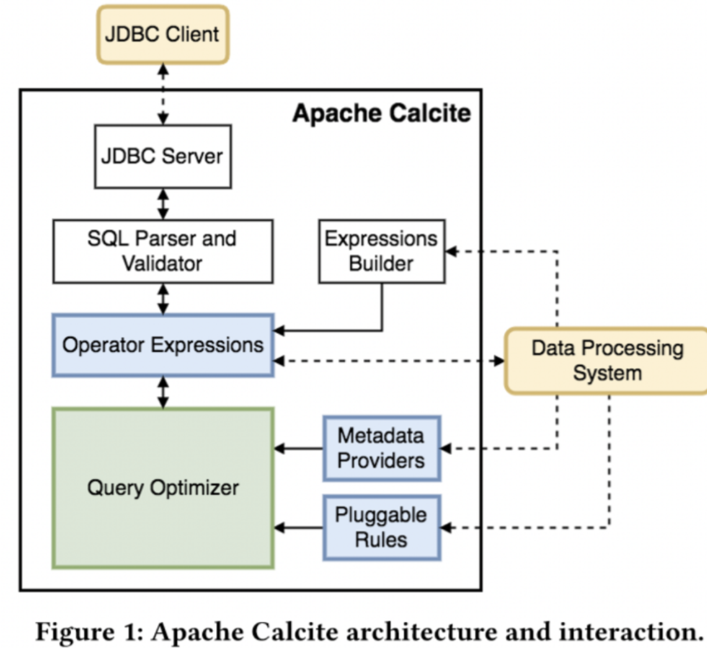

# Calcite Notes

## MyNotes

https://strongduanmu.com/wiki/calcite/adapters.html

### 介绍

独立于存储、计算的SQL解析、校验、优化引擎

 Apache Flink, Apache Drill 等都大量使用了 Calcite

Apache Calcite 是一个动态的[数据管理框架](https://cloud.tencent.com/developer/tools/blog-entry?target=https%3A%2F%2Fwww.oschina.net%2Faction%2FGoToLink%3Furl%3Dhttps%3A%2F%2Fwww.dtstack.com%2F%3Fsrc%3Dszsm)，本身不涉及任何物理存储信息，而是专注在 SQL 解析、基于关系代数的查询优化，通过扩展方式来对接底层存储。

Calcite **提供了 ANSI 标准 SQL 的解析**，以及各种 SQL 方言，针对来自于不同数据源的复杂 SQL，在 Calcite 中会把 SQL 解析成 [SqlNode 语法树结构](https://cloud.tencent.com/developer/tools/blog-entry?target=https%3A%2F%2Fwww.oschina.net%2Faction%2FGoToLink%3Furl%3Dhttps%3A%2F%2Fwww.dtstack.com%2F%3Fsrc%3Dszsm)，然后根据得到的语法树转换成自定义 Node，通过自定义 Node 解析获取到表的字段信息、以及表信息、血缘等相关信息。

默认情况下应该是ANSI 标准 SQL

### 架构

### 连接参数

| 属性                                                         | 描述                                                         |
| :----------------------------------------------------------- | :----------------------------------------------------------- |
| [approximateDecimal](https://calcite.apache.org/javadocAggregate/org/apache/calcite/config/CalciteConnectionProperty.html#APPROXIMATE_DECIMAL) | 是否可以接受 `DECIMAL` 类型聚合函数返回近似结果。            |
| [approximateDistinctCount](https://calcite.apache.org/javadocAggregate/org/apache/calcite/config/CalciteConnectionProperty.html#APPROXIMATE_DISTINCT_COUNT) | 是否可以接受 `COUNT(DISTINCT ...)` 聚合函数返回近似结果。    |
| [approximateTopN](https://calcite.apache.org/javadocAggregate/org/apache/calcite/config/CalciteConnectionProperty.html#APPROXIMATE_TOP_N) | 是否可以接受 Top N 查询（`ORDER BY aggFun() DESC LIMIT n`）返回近似结果。 |
| [caseSensitive](https://calcite.apache.org/javadocAggregate/org/apache/calcite/config/CalciteConnectionProperty.html#CASE_SENSITIVE) | 标识符匹配是否区分大小写。如果未指定，将会使用 `lex` 中的值。 |
| [conformance](https://calcite.apache.org/javadocAggregate/org/apache/calcite/config/CalciteConnectionProperty.html#CONFORMANCE) | SQL 一致性级别。包含如下值：`DEFAULT`（默认值，类似于 `PRAGMATIC_2003`）、`LENIENT`、`MYSQL_5`、`ORACLE_10`、`ORACLE_12`、`PRAGMATIC_99`、`PRAGMATIC_2003`、`STRICT_92`、`STRICT_99`、`STRICT_2003`、`SQL_SERVER_2008`。 |
| [createMaterializations](https://calcite.apache.org/javadocAggregate/org/apache/calcite/config/CalciteConnectionProperty.html#CREATE_MATERIALIZATIONS) | Calcite 是否应该创建物化视图。默认为 false。                 |
| [defaultNullCollation](https://calcite.apache.org/javadocAggregate/org/apache/calcite/config/CalciteConnectionProperty.html#DEFAULT_NULL_COLLATION) | 如果查询中既未指定 `NULLS FIRST` 也未指定 `NULLS LAST`，应该如何对 `NULL` 值进行排序。默认值为 HIGH，对 NULL 值的排序与 Oracle 相同。 |
| [druidFetch](https://calcite.apache.org/javadocAggregate/org/apache/calcite/config/CalciteConnectionProperty.html#DRUID_FETCH) | 执行 SELECT 查询时，Druid 适配器应当一次获取多少行记录。     |
| [forceDecorrelate](https://calcite.apache.org/javadocAggregate/org/apache/calcite/config/CalciteConnectionProperty.html#FORCE_DECORRELATE) | 优化器是否应该尽可能地尝试去除相关子查询。默认为 true。      |
| [fun](https://calcite.apache.org/javadocAggregate/org/apache/calcite/config/CalciteConnectionProperty.html#FUN) | 内置函数和运算符的集合。有效值为 `standard`（默认值）、`oracle`、`spatial`，并且可以使用逗号组合，例如 `oracle,spatial`。 |
| [lex](https://calcite.apache.org/javadocAggregate/org/apache/calcite/config/CalciteConnectionProperty.html#LEX) | 词法分析策略。有效值为 `BIG_QUERY`、`JAVA`、`MYSQL`、`MYSQL_ANSI`、`ORACLE`（默认）、`SQL_SERVER`。 |
| [materializationsEnabled](https://calcite.apache.org/javadocAggregate/org/apache/calcite/config/CalciteConnectionProperty.html#MATERIALIZATIONS_ENABLED) | Calcite 是否应该使用物化视图。默认为 false。                 |
| [model](https://calcite.apache.org/javadocAggregate/org/apache/calcite/config/CalciteConnectionProperty.html#MODEL) | JSON/YAML 模型文件的 URI 或内联的 JSON（例如：`inline:{...}`） 、内联的 YAML（例如： `inline:...`）。 |
| [parserFactory](https://calcite.apache.org/javadocAggregate/org/apache/calcite/config/CalciteConnectionProperty.html#PARSER_FACTORY) | 解析器工厂。实现 [`interface SqlParserImplFactory`](https://calcite.apache.org/javadocAggregate/org/apache/calcite/sql/parser/SqlParserImplFactory.html) 并具有公共默认构造函数或 `INSTANCE` 常量的类的名称。 |
| [quoting](https://calcite.apache.org/javadocAggregate/org/apache/calcite/config/CalciteConnectionProperty.html#QUOTING) | 如何引用标识符。值为 DOUBLE_QUOTE、BACK_TICK、BACK_TICK_BACKSLASH、BRACKET。如果未指定，则使用 `lex` 中的值。 |
| [quotedCasing](https://calcite.apache.org/javadocAggregate/org/apache/calcite/config/CalciteConnectionProperty.html#QUOTED_CASING) | 如果标识符被引用，设置如何存储标识符。值为 UNCHANGED、TO_UPPER、TO_LOWER。如果未指定，则使用 `lex` 中的值。 |
| [schema](https://calcite.apache.org/javadocAggregate/org/apache/calcite/config/CalciteConnectionProperty.html#SCHEMA) | 初始模式的名称。                                             |
| [schemaFactory](https://calcite.apache.org/javadocAggregate/org/apache/calcite/config/CalciteConnectionProperty.html#SCHEMA_FACTORY) | 模式工厂。实现 [`interface SchemaFactory`](https://calcite.apache.org/javadocAggregate/org/apache/calcite/schema/SchemaFactory.html) 并具有公共默认构造函数或 `INSTANCE` 常量的类的名称。如果指定了 `model` 则忽略该参数。 |
| [schemaType](https://calcite.apache.org/javadocAggregate/org/apache/calcite/config/CalciteConnectionProperty.html#SCHEMA_TYPE) | 模式类型。值必须是 `MAP`（默认值）、`JDBC` 或 `CUSTOM`（如果指定了 `schemaFactory` 则隐式设置为 CUSTOM）。如果指定了 `model` 则忽略该参数。 |
| [spark](https://calcite.apache.org/javadocAggregate/org/apache/calcite/config/CalciteConnectionProperty.html#SPARK) | 指定是否应使用 Spark 作为引擎来处理无法推送到源系统的处理。如果为 false（默认值），Calcite 会生成实现 Enumerable 接口的代码。 |
| [timeZone](https://calcite.apache.org/javadocAggregate/org/apache/calcite/config/CalciteConnectionProperty.html#TIME_ZONE) | 时区，例如 `gmt-3`。默认是 JVM 的时区。                      |
| [typeSystem](https://calcite.apache.org/javadocAggregate/org/apache/calcite/config/CalciteConnectionProperty.html#TYPE_SYSTEM) | 类型系统。实现 [`interface RelDataTypeSystem`](https://calcite.apache.org/javadocAggregate/org/apache/calcite/rel/type/RelDataTypeSystem.html) 并具有公共默认构造函数或 `INSTANCE` 常量的类的名称。 |
| [unquotedCasing](https://calcite.apache.org/javadocAggregate/org/apache/calcite/config/CalciteConnectionProperty.html#UNQUOTED_CASING) | 如果标识符未加引号，设置如何存储标识符。值为 `UNCHANGED`、`TO_UPPER`、`TO_LOWER`。如果未指定，则使用 `lex` 中的值。 |
| [typeCoercion](https://calcite.apache.org/javadocAggregate/org/apache/calcite/config/CalciteConnectionProperty.html#TYPE_COERCION) | sql 节点校验时，如果类型不匹配是否进行隐式类型强转，默认为 true。 |

