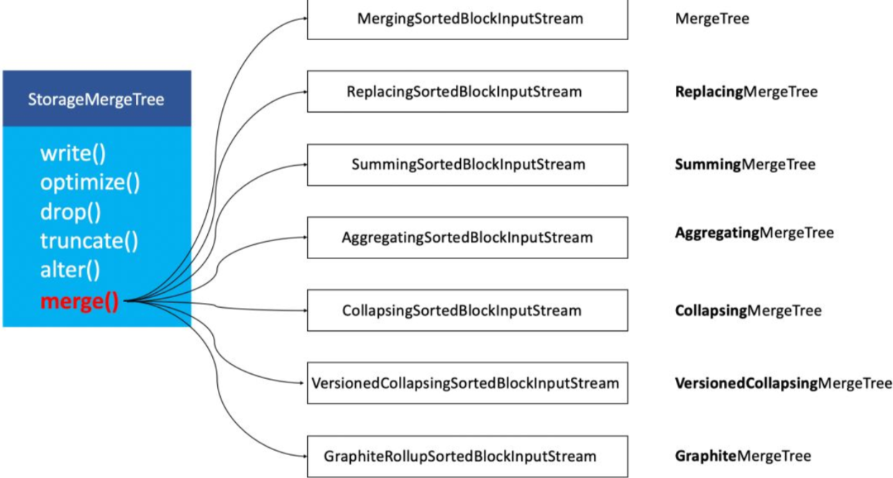

# ClickHouse Notes

## PDF

- [01_尚硅谷大数据技术之ClickHouse入门](_pdf/bigdata\clickhouse/01_尚硅谷大数据技术之ClickHouse入门V1.0.pdf)
- [02_尚硅谷大数据技术之ClickHouse高级](_pdf/bigdata\clickhouse/02_尚硅谷大数据技术之ClickHouse高级V1.0.pdf)
- [03_尚硅谷大数据技术之ClickHouse监控及备份](_pdf/bigdata\clickhouse/03_尚硅谷大数据技术之ClickHouse监控及备份V1.0.pdf)

## Official Docs

### 简介

#### What's CH

CH是一个用于`联机分析OLAP`的 `列式`数据库管理系统`DBMS`

- OLAP
- 列式DB
- DBMS

常见的行式数据库系统有：`MySQL`、`Postgres`和`MS SQL Server`。

常见的列式数据库有： Vertica、 Paraccel (Actian Matrix，Amazon Redshift)、 Sybase IQ、 Exasol、 Infobright、 InfiniDB、 MonetDB (VectorWise， Actian Vector)、 LucidDB、 SAP HANA、 Google Dremel、 Google PowerDrill、 Druid、 kdb+。


OLAP场景特征：

- 读 >> 写
- 数据以相当大的批次(> 1000行)更新，而不是单行更新;或者根本没有更新。
- 对于读取，从数据库中提取相当多的行，但只提取列的一小部分。
- `宽表`，即每个表包含着大量的列
- 查询相对较少(通常每台服务器每秒查询数百次或更少)
- 对于简单查询，允许延迟大约50毫秒
- `列中的数据相对较小`：数字和短字符串(例如，每个URL 60个字节)
- 处理单个查询时需要`高吞吐量`(每台服务器每秒可达数十亿行)
- 事务不是必须的
- 对数据`一致性要求低`
- 每个查询有一个大表。除了他以外，其他的都很小。
- 查询结果明显小于源数据。换句话说，数据经过过滤或聚合，因此结果适合于单个服务器的RAM中

很容易可以看出，OLAP场景与其他通常业务场景(例如,OLTP或K/V)有很大的不同， 因此想要使用OLTP或Key-Value数据库去高效的处理分析查询场景，并不是非常完美的适用方案。例如，使用OLAP数据库去处理分析请求通常要优于使用MongoDB或Redis去处理分析请求。


列式DB为什么更适合OLAP

输入/输出

1. 针对分析类查询，通常只需要读取表的一小部分列。在列式数据库中你可以只读取你需要的数据。例如，如果只需要读取100列中的5列，这将帮助你最少减少20倍的I/O消耗。
2. 由于数据总是打包成批量读取的，所以压缩是非常容易的。同时数据按列分别存储这也更容易压缩。这进一步降低了I/O的体积。
3. 由于I/O的降低，这将帮助更多的数据被系统缓存。

CPU

​	由于执行一个查询需要处理大量的行，因此在整个向量上执行所有操作将比在每一行上执行所有操作更加高效。同时这将有助于实现一个几乎没有调用成本的查询引擎。如果你不这样做，使用任何一个机械硬盘，查询引擎都不可避免的停止CPU进行等待

#### CH特性

- 真正的列式数据库管理系统：除了数据本身，不存在其他额外的数据

- 数据压缩

- 数据的磁盘存储

- 多核并行处理

- 多服务器分布式处理：数据保存在不同的shard上，每一个shard都由一组用于容错的replica组成

- 支持SQL：CH支持一种基于SQL的声明式查询语言

- 向量引擎：按向量(列的一部分)进行处理

- 实时的数据更新：ClickHouse支持在表中定义主键。为了使查询能够快速在主键中进行范围查找，数据总是以增量的方式有序的存储在MergeTree中。因此，数据可以持续不断地高效的写入到表中，并且写入的过程中不会存在任何加锁的行为。(和HBASE类似：更新其实是新增，使用版本来控制)

- 索引

- 按照主键对数据进行排序，ClickHouse在几十毫秒以内完成对数据特定值或范围的查找。

- 适合在线查询，低延迟

- 支持近似计算：提供各种各样在允许牺牲数据精度的情况下对查询进行加速的方法

- Adaptive Join Algorithm：可以自定义多个join表，它更倾向于散列连接算法，如果有多个大表，则使用合并-连接算法

- 支持数据复制和数据完整性：ClickHouse使用异步的多主复制技术。当数据被写入任何一个可用副本后，系统会在后台将数据分发给其他副本，以保证系统在不同副本上保持相同的数据。在大多数情况下ClickHouse能在故障后自动恢复，在一些少数的复杂情况下需要手动恢复。

- 角色访问控制

  

缺点：

- 没有完整事务支持
- 缺少高频率，低延迟的修改或删除已存在数据的能力。仅能用于批量删除或修改数据，但这符合 [GDPR]    (https://gdpr-info.eu/)。
- 稀疏索引使得ClickHouse不适合通过其键检索单行的点查询。

#### 性能

单个大查询

吞吐量可以使用每秒处理的行数或每秒处理的字节数来衡量。如果数据被放置在page cache中，则一个不太复杂的查询在单个服务器上大约能够以2-10GB／s（未压缩）的速度进行处理（对于简单的查询，速度可以达到30GB／s）。如果数据没有在page cache中的话，那么速度将取决于你的磁盘系统和数据的压缩率。例如，如果一个磁盘允许以400MB／s的速度读取数据，并且数据压缩率是3，则数据的处理速度为1.2GB/s。这意味着，如果你是在提取一个10字节的列，那么它的处理速度大约是1-2亿行每秒。

处理短查询的延迟时间

如果一个查询使用主键并且没有太多行(几十万)进行处理，并且没有查询太多的列，那么在数据被page cache缓存的情况下，它的延迟应该小于50毫秒(在最佳的情况下应该小于10毫秒)。 否则，延迟取决于数据的查找次数。如果你当前使用的是HDD，在数据没有加载的情况下，查询所需要的延迟可以通过以下公式计算得知： 查找时间（10 ms） * 查询的列的数量 * 查询的数据块的数量。

处理大量短查询的吞吐量

在相同的情况下，ClickHouse可以在单个服务器上每秒处理数百个查询（在最佳的情况下最多可以处理数千个）。但是由于这不适用于分析型场景。因此我们建议每秒最多查询100次。

数据的写入性能

我们建议每次写入不少于1000行的批量写入，或每秒不超过一个写入请求。当使用tab-separated格式将一份数据写入到MergeTree表中时，写入速度大约为50到200MB/s。如果您写入的数据每行为1Kb，那么写入的速度为50，000到200，000行每秒。如果您的行更小，那么写入速度将更高。为了提高写入性能，您可以使用多个INSERT进行并行写入，这将带来线性的性能提升。

#### 历史

Yandex.Metrica开发

Yandex.Metrica基于用户定义的字段，对实时访问、连接会话，生成实时的统计报表。这种需求往往需要复杂聚合方式，比如对访问用户进行去重。构建报表的数据，是实时接收存储的新数据。

### 快速上手

#### 安装

```xml
sudo apt-get install apt-transport-https ca-certificates dirmngr
sudo apt-key adv --keyserver hkp://keyserver.ubuntu.com:80 --recv E0C56BD4

echo "deb https://repo.clickhouse.com/deb/stable/ main/" | sudo tee \
    /etc/apt/sources.list.d/clickhouse.list
sudo apt-get update

sudo apt-get install -y clickhouse-server clickhouse-client

sudo service clickhouse-server start
// 启动client
clickhouse-client


// 启动Server：
sudo /etc/init.d/clickhouse-server start
```

日志文件将输出在`/var/log/clickhouse-server/`文件夹。

如果服务器没有启动，检查`/etc/clickhouse-server/config.xml`中的配置。

您也可以手动从控制台启动服务器:

```
$ clickhouse-server --config-file=/etc/clickhouse-server/config.xml
```

在这种情况下，日志将被打印到控制台，这在开发过程中很方便。

如果配置文件在当前目录中，则不需要指定`——config-file`参数。默认情况下，它的路径为`./config.xml`。


### 函数

#### 聚合函数

##### uniq

计算参数的不同值的近似数量。

```
uniq(x[, ...])
```

该函数采用可变数量的参数。 参数可以是 `Tuple`, `Array`, `Date`, `DateTime`, `String`, 或数字类型

返回UInt64类型数值


### SQL

### 建表

```sql

CREATE TABLE risk_model.local_test05 on cluster xy
(
    `cid` String COMMENT '用户tc加密的身份证',
    `user_id` String COMMENT '用户的custmoer_id',
    `order_id` String COMMENT '订单id',
    `end_date` Date COMMENT '用户的打分时点',
    `prob` Float64 COMMENT '用户打分概率',
    `label` Int8 COMMENT '用户好坏标签',
    `order_date` Date COMMENT '用户放款时间',
    `amount` Float64 COMMENT '坏账金额/回收金额',
    `total_amount` Float64 COMMENT '放款金额',
    `is_success` UInt8 COMMENT '用户放款/授信是否成功（1：成功；0：失败）',
    `credit_finish_time` DateTime COMMENT '用户授信时间',
    `tpp_code` String COMMENT '用户授信资方',
    `anual_year_rate` Float64 COMMENT '用户定价（年利率）',
    `observation_dfn` String COMMENT '观察样本Y-定义',
    `sample_dimension` String COMMENT '观察样本维度',
    `dt` String,
    `model_name` String COMMENT '模型名称'
)
    ENGINE = ReplicatedReplacingMergeTree('/clickhouse/tables/{shard}/local_test05', '{replica}')
        PARTITION BY (model_name, dt)
        ORDER BY (cid, user_id, end_date, observation_dfn, order_id, sample_dimension)
        SETTINGS storage_policy = 'hdd_in_order', index_granularity = 8192;


CREATE TABLE risk_model.all_test05 on cluster xy
(
    `cid` String COMMENT '用户tc加密的身份证',
    `user_id` String COMMENT '用户的custmoer_id',
    `order_id` String COMMENT '订单id',
    `end_date` Date COMMENT '用户的打分时点',
    `prob` Float64 COMMENT '用户打分概率',
    `label` Int8 COMMENT '用户好坏标签',
    `order_date` Date COMMENT '用户放款时间',
    `amount` Float64 COMMENT '坏账金额/回收金额',
    `total_amount` Float64 COMMENT '放款金额',
    `is_success` UInt8 COMMENT '用户放款/授信是否成功（1：成功；0：失败）',
    `credit_finish_time` DateTime COMMENT '用户授信时间',
    `tpp_code` String COMMENT '用户授信资方',
    `anual_year_rate` Float64 COMMENT '用户定价（年利率）',
    `observation_dfn` String COMMENT '观察样本Y-定义',
    `sample_dimension` String COMMENT '观察样本维度',
    `dt` String,
    `model_name` String COMMENT '模型名称'
)
    ENGINE = Distributed('xy', 'risk_model', 'local_test05', sipHash64(cid))
```


### 从现有表insert/create table

```sql
INSERT INTO company_weibo_old 
(ID, CID, COMPANY_NAME, NAME, ICO, INFO, TAGS, COUNT, FANS, FOLLOW_COUNT, SOURCE_URL, CREATE_TIME, UPDATE_TIME, DELETED, ROW_TYPE, CHULI_DATE)
 SELECT id, cid, company_name, name, ico, info, tags, count, fans, follow_count, source_url, create_time, update_time, deleted, row_type, chuli_date
FROM company_weibo where chuli_date = '2021-11-16 00:00:00'

create table company_weibo_new 
engine=MergeTree() 
order by id 
as
( SELECT id, cid, company_name, name, ico, info, tags, count, fans, follow_count, source_url, create_time, update_time, deleted, row_type, chuli_date
FROM economic_brain_temp.company_weibo where chuli_date = '2021-11-16 00:00:00')

```


## My Notes

### Basic

#### 特点

- 列式数据库
- DBMS：符合标准的SQL语法，具有DDL、DML以及管理功能等
- 多样化引擎：和MySQL类似，`引擎插件化`，包含MergeTree、log、接口和其他四大类，共20多种引擎。
- 高吞吐写入能力：采用`类LSM Tree`结构，数据写入后定期在后台`Compaction`(**压缩**)。通过类 LSM tree 的结构，ClickHouse 在数据导入时全部是顺序 append 写，写入后数据段不可更改，在后台 compaction 时也是多个段 merge sort 后`顺序写`回磁盘。顺序写的特性，充分利用了磁盘的吞吐能力，即便在 HDD 上也有着优异的写入性能。
- 数据分区与线程级并行：将数据分区partition，每个分区在划分为多个 `index granularity(索引粒度)`，然后通过多个CPU分别处理其中的一部分，实现并行计算，提高CPU利用率。
- `不擅长高QPS查询`：单条查询可以利用多CPU，提高速度，但是同时就不利于多条查询并发，因为并发时多个查询会争夺CPU，导致性能反而下降。因此，CH并不擅长高QPS的业务查询。
- 性能：单表性能很好，关联查询性能不佳

#### 数据类型

##### 整型

```sql
固定长度的整型，包括有符号整型或无符号整型。
整型范围（-2n-1~2n-1-1）：
Int8 - [-128 : 127]
Int16 - [-32768 : 32767]
Int32 - [-2147483648 : 2147483647]
Int64 - [-9223372036854775808 : 9223372036854775807]
无符号整型范围（0~2n-1）：
UInt8 - [0 : 255]
UInt16 - [0 : 65535]
UInt32 - [0 : 4294967295]
UInt64 - [0 : 18446744073709551615]
使用场景： 个数、数量、也可以存储型 id。
```

##### 浮点

```sql
Float32 - float
Float64 – double
建议尽可能以整数形式存储数据。例如，将固定精度的数字转换为整数值，如时间用毫秒为单位表示，因为浮点型进行计算时可能引起四舍五入的误差
使用场景：一般数据值比较小，不涉及大量的统计计算，精度要求不高的时候。比如
保存商品的重量
```

##### 布尔

```sql
没有单独的类型来存储布尔值。可以使用 UInt8 类型，取值限制为 0 或 1。
```

##### Decimal

```sql
有符号的浮点数，可在加、减和乘法运算过程中保持精度。对于除法，最低有效数字会
被丢弃（不舍入）
有三种声明：
➢ Decimal32(s)，相当于 Decimal(9-s,s)，有效位数为 1~9
➢ Decimal64(s)，相当于 Decimal(18-s,s)，有效位数为 1~18
➢ Decimal128(s)，相当于 Decimal(38-s,s)，有效位数为 1~38
s 标识小数位
使用场景： 一般金额字段、汇率、利率等字段为了保证小数点精度，都使用 Decimal
进行存储。
```

##### String

```
String
字符串可以任意长度的。它可以包含任意的字节集，包含空字节。
```

FixedString(N)：

```
固定长度 N 的字符串，N 必须是严格的正自然数。当服务端读取长度小于 N 的字符 串时候，通过在字符串末尾添加空字节来达到 N 字节长度。 当服务端读取长度大于 N 的 字符串时候，将返回错误消息。 一般不使用，即使是一些定长的类型数据，因为还是有变化风险
```

##### 枚举

```sql
包括 Enum8 和 Enum16 类型。Enum 保存 'string'= integer 的对应关系。
Enum8 用 'String'= Int8 对描述。
Enum16 用 'String'= Int16 对描述。

创建一个带有一个枚举 Enum8('hello' = 1, 'world' = 2) 类型的列:
CREATE TABLE t_enum
(
 x Enum8('hello' = 1, 'world' = 2)
)
ENGINE = TinyLog;
这个 x 列只能存储类型定义中列出的值：'hello'或'world'
INSERT INTO t_enum VALUES ('hello'), ('world'), ('hello');

如果需要看到对应行的数值，则必须将 Enum 值转换为整数类型:
SELECT CAST(x, 'Int8') FROM t_enum;
```

##### 时间类型

```sql
目前 ClickHouse 有三种时间类型
➢ Date 接受年-月-日的字符串比如 ‘2019-12-16’
➢ Datetime 接受年-月-日 时:分:秒的字符串比如 ‘2019-12-16 20:50:10’
➢ Datetime64 接受年-月-日 时:分:秒.亚秒的字符串比如‘2019-12-16 20:50:10.66’
日期类型，用两个字节存储，表示从 1970-01-01 (无符号) 到当前的日期值
```

##### 数组

```sql
Array(T)：由 T 类型元素组成的数组。
T 可以是任意类型，包含数组类型。 但不推荐使用多维数组，ClickHouse 对多维数组
的支持有限。例如，不能在 MergeTree 表中存储多维数组。

创建数组方式 1，使用 array 函数
 SELECT array(1, 2) AS x, toTypeName(x) ;
创建数组方式 2：使用方括号
SELECT [1, 2] AS x, toTypeName(x);
```


#### 注意

- 数据类型、引擎等都是大小写敏感的

- 单引号、双引号区分

  ```sql
   # 双引号 报错
   insert into tbl01_tinylog(id ,name) values(1, "edw01");
   # 单引号，OK
   insert into tbl01_tinylog(id ,name) values(1, 'edw01');
  ```

- 

### 表引擎

表引擎决定了如何存储表的数据。包括： 

- 数据的`存储方式和位置`，写到哪里以及从哪里读取数据。 

- `支持哪些查询`以及如何支持。 

- `并发`数据访问。 

- `索引`的使用（如果存在）。 

- 是否可以执行`多线程请求`。 

- 数据`复制`参数。 表引擎的使用方式就是必须显式在创建表时定义该表使用的引擎，以及引擎使用的相关参数。

  特别注意：`引擎的名称大小写敏感`

#### TinyLog

以`列文件`的形式保存在磁盘上，`不支持索引`，`没有并发控制`。一般保存少量数据的小表， 生产环境上作用有限。可以用于平时练习测试用

```sql
create table t_tinylog ( id String, name String) engine=TinyLog;

ubuntu :) select * from tbl01_tinylog;
SELECT *
FROM tbl01_tinylog
Query id: 3b25d36f-3de6-4a14-a247-3e7c0d23eecd
┌─id─┬─name──┐
│  1 │ edw01 │
│  2 │ edw03 │
│  1 │ 2     │
│  2 │ 344   │
└────┴───────┘
```

#### Memory

`内存引擎`，数据以`未压缩`的原始形式直接保存在内存当中，服务器重启数据就会消失。 读写操作不会相互阻塞，不支持索引。简单查询下有非常非常高的性能表现（超过 10G/s）。 

一般用到它的地方不多，除了用来测试，就是在需要非常高的性能，同时数据量又不太大（上限大概 1 亿行）的场景。

```sql
CREATE TABLE edwin.tbl02_memory
(
    `id` UInt8,
    `code` String
)
ENGINE = Memory

SELECT * FROM tbl02_memory
┌─id─┬─code─┐
│  1 │ 2    │
└────┴──────┘
┌─id─┬─code─┐
│  1 │ 2    │
│  2 │ 344  │
└────┴──────┘
┌─id─┬─code─┐
│  1 │ 2    │
│  2 │ 344  │
└────┴──────┘
-- 为什么Memory引擎是按insert分批次的？
```

#### MergeTree

ClickHouse 中最强大的表引擎当属` MergeTree（合并树）`引擎及该系列（`*MergeTree`） 中的其他引擎，支持`索引和分区`，地位可以相当于 innodb 之于 Mysql。而且基于 MergeTree， 还衍生除了很多小弟，也是非常有特色的引擎。

```sql
create table t_order_mt(
 id UInt32,
 sku_id String,
 total_amount Decimal(16,2),
 create_time Datetime
) engine = MergeTree                  -- Engin
 partition by toYYYYMMDD(create_time) -- partition
 primary key (id)
 order by (id,sku_id);
 
 insert into t_order_mt values
(101,'sku_001',1000.00,'2020-06-01 12:00:00') ,
(102,'sku_002',2000.00,'2020-06-01 11:00:00'),
(102,'sku_004',2500.00,'2020-06-01 12:00:00'),
(102,'sku_002',2000.00,'2020-06-01 13:00:00'),
(102,'sku_002',12000.00,'2020-06-01 13:00:00'),
(102,'sku_002',600.00,'2020-06-02 12:00:00');
```

##### partition

分区的目的主要是降低扫描的范围，优化查询速度

默认一个分区。

分区目录：MergeTree 是以`列文件+索引文件+表定义文件`组成的，但是如果设定了分区那么这些文件就会保存到不同的`分区目录`中。

并行：分区后，面对涉及`跨分区`的查询统计，ClickHouse 会以分区为单位并行处理

数据写入与分区合并: 任何一个批次的数据写入都会产生一个`临时分区`，不会纳入任何一个已有的分区。写入后的某个时刻（大概 10-15 分钟后），ClickHouse 会`自动执行合并`操作（等不及也可以手动 通过 optimize 执行），把临时分区的数据，合并到已有分区中

```sql
optimize table xxxx final;
```

##### primary key主键

ClickHouse 中的`主键`，和其他数据库不太一样，它只提供了数据的`一级索引`，但是却`不是唯一约束`。这就意味着是可以存在相同 primary key 的数据的

主键的设定主要依据是查询语句中的 where 条件

根据条件通过对主键进行某种形式的二分查找，能够定位到对应的 index granularity,避 免了全表扫描。

`index granularity`： 直接翻译的话就是`索引粒度`，指在`稀疏索引`中`两个相邻索引对应数据的间隔`。ClickHouse 中的 MergeTree 默认是 `8192`。官方不建议修改这个值，除非该列存在 大量重复值，比如在一个分区中几万行才有一个不同数据

稀疏索引：


稀疏索引的好处就是可以`用很少的索引数据，定位更多的数据`，代价就是`只能定位到索引粒度的第一行`，然后再进行进行一点`扫描`。

##### order by

排序键，必填

order by 设定了`分区内的数据按照哪些字段顺序进行有序保存`。

order by 是 MergeTree 中`唯一一个必填项`，甚至比 primary key 还重要，因为当用户不设置主键的情况，很多处理会依照 order by 的字段进行处理

要求：`主键必须是 order by 字段的前缀字段`。

比如 order by 字段是 (id,sku_id) 那么主键必须是 id 或者(id,sku_id)

##### 二级索引

目前在 ClickHouse 的官网上二级索引的功能在 v20.1.2.4 之前是被标注为实验性的，在 这个版本之后默认是开启的。

老版本使用二级索引前需要增加设置 是否允许使用实验性的二级索引（v20.1.2.4 开始，这个参数已被删除，默认开启） 

```sql
set allow_experimental_data_skipping_indices=1;
```

```sql
CREATE TABLE [IF NOT EXISTS] [db.]table_name [ON CLUSTER cluster]
(
    name1 [type1] [DEFAULT|MATERIALIZED|ALIAS expr1] [TTL expr1],
    name2 [type2] [DEFAULT|MATERIALIZED|ALIAS expr2] [TTL expr2],
    ...
    INDEX index_name1 expr1 TYPE type1(...) GRANULARITY value1,
    INDEX index_name2 expr2 TYPE type2(...) GRANULARITY value2
) ENGINE = MergeTree()
ORDER BY expr
[PARTITION BY expr]
[PRIMARY KEY expr]
[SAMPLE BY expr]
[TTL expr [DELETE|TO DISK 'xxx'|TO VOLUME 'xxx'], ...]
[SETTINGS name=value, ...]


create table t_order_mt2(
 id UInt32,
 sku_id String,
 total_amount Decimal(16,2),
 create_time Datetime,
INDEX a total_amount TYPE minmax GRANULARITY 5
) engine =MergeTree
 partition by toYYYYMMDD(create_time)
 primary key (id)
 order by (id, sku_id);
 其中 GRANULARITY N 是设定二级索引对于一级索引粒度的粒度。
```

`二级索引能够为非主键字段的查询发挥作用`

```sql
CREATE TABLE tbl03_mergetree
(
    `id` UInt8,
    `name` String,
    `dt` Date
)
ENGINE = MergeTree
PARTITION BY dt
PRIMARY KEY id
ORDER BY (id, name)

insert into tbl03_mergetree(id,name,dt) values(1,'edw','2022-01-01');
insert into tbl03_mergetree(id,name,dt) values(2,'edw','2022-01-01');
-- 两次insert，分别写入两个临时翻去，查询时两个分区分别显示：
select * from tbl03_mergetree;
┌─id─┬─name─┬─────────dt─┐
│  1 │ edw  │ 2022-01-01 │
└────┴──────┴────────────┘
┌─id─┬─name─┬─────────dt─┐
│  2 │ edw  │ 2022-01-01 │
└────┴──────┴────────────┘
select * from tbl03_mergetree;
-- 手动将临时分区写入目标分区
optimize table tbl03_mergetree final;
-- 再次查询，临时分区已经写入目标分区了
select * from tbl03_mergetree;
┌─id─┬─name─┬─────────dt─┐
│  1 │ edw  │ 2022-01-01 │
│  2 │ edw  │ 2022-01-01 │
└────┴──────┴────────────┘
```


##### 数据TTL

TTL 即 `Time To Live`，MergeTree 提供了可以`管理数据表或者列的生命周期`的功能。

###### 列级TTL

```sql
create table t_order_mt3(
 id UInt32,
 sku_id String,
 total_amount Decimal(16,2) TTL create_time+interval 10 SECOND,
 create_time Datetime
) engine =MergeTree
partition by toYYYYMMDD(create_time)
 primary key (id)
 order by (id, sku_id);
-- 插入数据10秒后，total_amount将会结束生命周期，表现为归零
```

###### 表级TTL

下面的这条语句是数据会在 create_time 之后 10 秒丢失

```sql
alter table t_order_mt3 MODIFY TTL create_time + INTERVAL 10 SECOND;
```

涉及判断的字段必须是 Date 或者 Datetime 类型，推荐使用分区的日期字段

能够使用的时间周期： - SECOND - MINUTE - HOUR - DAY - WEEK - MONTH - QUARTER - YEAR

##### ReplacingMergeTree

ReplacingMergeTree 是 MergeTree 的一个变种，它存储特性完全继承 MergeTree，只是多了一个`去重`的功能。 尽管 MergeTree 可以设置主键，但是 primary key 其实没有唯一约束 的功能。如果你想处理掉重复的数据，可以借助这个 ReplacingMergeTree。

数据的去重只会在合并的过程中出现。合并会在未知的时间在后台进行，所以你无法预 先作出计划。有一些数据可能仍未被处理

去重范围:如果表经过了分区，去重`只会在分区内部`进行去重，不能执行跨分区的去重。所以 ReplacingMergeTree 能力有限， ReplacingMergeTree 适用于在后台清除重复的数据以节省空间，但是它`不保证没有重复的数据`出现。

```sql
create table t_order_rmt(
 id UInt32,
 sku_id String,
 total_amount Decimal(16,2) ,
 create_time Datetime
) engine =ReplacingMergeTree(create_time)
 partition by toYYYYMMDD(create_time)
 primary key (id)
 order by (id, sku_id);
ReplacingMergeTree() 填入的参数为版本字段，重复数据保留版本字段值最大的。
如果不填版本字段，默认按照插入顺序保留最后一条。
```


- 实际上是使用 **order by 字段作为唯一键** 
- 去重不能跨分区 
- 只有同一批插入（新版本）或合并分区时才会进行去重 
- 认定重复的数据保留，版本字段值最大的 
- 如果版本字段相同则按插入顺序保留最后一笔

##### SummingMergeTree

对于不查询明细，只关心以维度进行汇总聚合结果的场景。如果只使用普通的MergeTree 的话，无论是存储空间的开销，还是查询时临时聚合的开销都比较大

ClickHouse 为了这种场景，提供了一种能够“`预聚合`”的引擎 SummingMergeTree

```sql
CREATE TABLE tbl04_summing_merge_tree
(
    `id` Int8,
    `name` String,
    `cnt` Int8
)
ENGINE = SummingMergeTree(cnt)
PARTITION BY name
ORDER BY id

select * from tbl04_summing_merge_tree;
┌─id─┬─name─┬─cnt─┐
│  3 │ edw2 │  -4 │
└────┴──────┴─────┘
┌─id─┬─name─┬─cnt─┐
│  1 │ edw  │  23 │
└────┴──────┴─────┘
┌─id─┬─name─┬─cnt─┐
│  2 │ edw1 │  23 │
└────┴──────┴─────┘
optimize table tbl04_summing_merge_tree final;
-- 临时分区写入后，还是三个分区，select结果一样
```

- 以 SummingMergeTree（）中指定的列作为汇总数据列 
- 可以填写`多列`，必须`数字列`，如果不填，以**所有非维度列且为数字列的字段为汇总数** 据列 
- 以 order by 的列为准，作为维度列 
- 其他的列按插入顺序保留第一行 
- **不在一个分区的数据不会被聚合** 
- 只有在**同一批次插入(新版本)或分片合并时**才会进行聚合

开发建议:设计聚合表的话，唯一键值、流水号可以去掉，所有字段全部是维度、度量或者时间戳。

##### MergeTree汇总

可以使用继承关系来看待MergeTree。通过最基础的**MergeTree**表引擎，向下派生出6个变种表引擎：


在ClickHouse底层具体的实现方法中，上述7种表引擎的区别主要体现在**Merge合并**的逻辑部分:



在具体的实现逻辑部分，7种MergeTree共用一个主体，在触发Merge动作时，调用了各自独有的合并逻辑


还有7种是ReplicatedMergeTree系列：

ReplicatedMergeTree与普通的MergeTree又有什么区别呢?  


图中的虚线框部分是MergeTree的能力边界，而ReplicatedMergeTree在它的基础之上增加了分布式协同的能力。

借助ZooKeeper的消息日志广播，实现了副本实例之间的数据同步功能。

ReplicatedMergeTree系列可以用**组合关系**来理解，如下图所示：


#### OTHER ENGINE


### SQL

大部分标准MySQL语句CH都支持，CH有部分自己的方言

#### Insert

```sql
insert into [table_name] values(…),(….) 
insert into [table_name] select a,b,c from [table_name_2]
```

#### Update/Delete

ClickHouse 提供了 Delete 和 Update 的能力，这类操作被称为 `Mutation `查询，它可以看 做 `Alter `的一种

虽然可以实现修改和删除，但是**和一般的 OLTP 数据库不一样**，Mutation 语句是一种很 “`重`”的操作，而且**不支持事务**

“重”的原因主要是**每次修改或者删除都会导致放弃目标数据的原有分区**，`重建新分区`。 所以`尽量做批量的变更，不要进行频繁小数据的操作`

```sql
ALTER TABLE tbl03_mergetree
    UPDATE name = 'hh' WHERE id = 1

alter table t_order_smt update total_amount=toDecimal32(2000.00,2) where id
=102;
```

Mutation 语句分两步执行，同步执行的部分其实只是进行 新增数据新增分区和并把旧分区打上逻辑上的失效标记。直到触发分区合并的时候，才会删 除旧数据释放磁盘空间，一般不会开放这样的功能给用户，由管理员完成。

#### 查询

- 支持子查询 
- 支持 CTE(Common Table Expression 公用表表达式 with 子句) 
- 支持各种 JOIN，但是 `JOIN 操作无法使用缓存`，所以即使是两次相同的 JOIN 语句， ClickHouse 也会视为两条新 SQL 
- 窗口函数(官方正在测试中...) 
- 不支持自定义函数 UDF 
- GROUP BY 操作增加了 `with rollup\with cube\with total` 用来计算小计和总计


with rollup:从右至左去掉维度进行小计

with cube : 从右至左去掉维度进行小计，再从左至右去掉维度进行小计

with totals: 只计算合计

#### Alter

同 MySQL 的修改字段基本一致

1）新增字段 alter table tableName add column newcolname String after col1; 

2）修改字段类型 alter table tableName modify column newcolname String;

3）删除字段 alter table tableName drop column newcolname;

#### 导出数据

```sql
clickhouse-client --query "select * from t_order_mt where
create_time='2020-06-01 12:00:00'" --format CSVWithNames>
/opt/module/data/rs1.csv
```

### 副本

副本的目的主要是保障数据的高可用性，即使一台 ClickHouse 节点宕机，那么也可以从 其他服务器获得相同的数据。

副本写入流程：


配置：略

### 分片集群

副本虽然能够提高数据的可用性，降低丢失风险，但是每台服务器实际上必须容纳全量 数据，对数据的`横向扩容`没有解决

要解决数据水平切分的问题，需要引入分片的概念。通过**分片把一份完整的数据进行切分，不同的分片分布到不同的节点上**，再通过 `Distributed `表引擎把数据拼接起来一同使用。

**Distributed 表引擎本身不存储数据**，有点类似于 MyCat 之于 MySql，成为一种中间件， 通过分布式逻辑表来写入、分发、路由来操作多台节点不同分片的分布式数据

注意：ClickHouse 的集群是表级别的，实际企业中，大部分做了高可用，**但是没有用分片，避免降低查询性能以及操作集群的复杂性。**


#### 写入

（3 分片 2 副本共 6 个节点）


#### 读取

（3 分片 2 副本共 6 个节点）


配置：

2 个分片，只有第一个分片有副本


```sql
-- local表：
create table st_order_mt on cluster gmall_cluster (
 id UInt32,
 sku_id String,
 total_amount Decimal(16,2),
 create_time Datetime
) engine
=ReplicatedMergeTree('/clickhouse/tables/{shard}/st_order_mt','{replica}')
 partition by toYYYYMMDD(create_time)
 primary key (id)
 order by (id,sku_id);
 
 --  Distribute 分布式表
 create table st_order_mt_all2 on cluster gmall_cluster
(
 id UInt32,
 sku_id String,
 total_amount Decimal(16,2),
 create_time Datetime
)engine = Distributed(gmall_cluster,default, st_order_mt,hiveHash(sku_id));
```

**Distributed（集群名称，库名，本地表名，分片键）**


