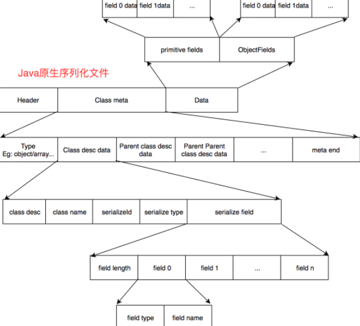
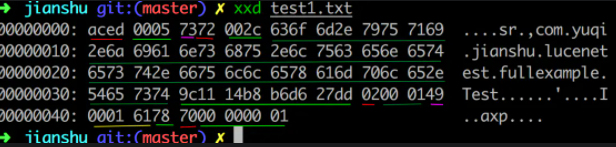
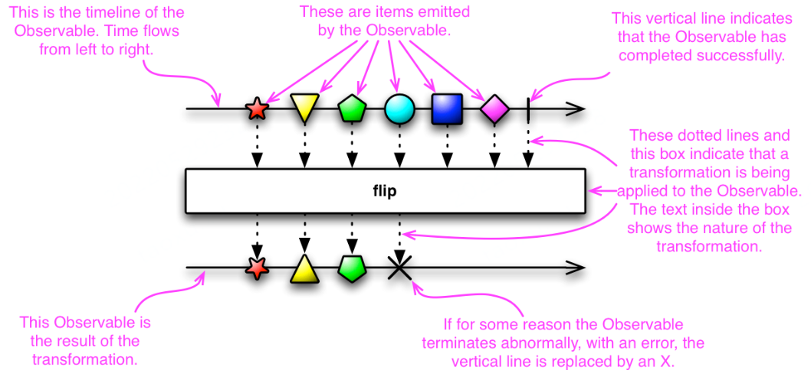

# Common Notes


## Common

### SLB

**SLB（Server Load Balance）服务通过设置虚拟服务地址（IP），将位于同一地域（Region）的多台云服务器（Elastic Compute Service，简称ECS）资源虚拟成一个高性能、高可用的应用服务池；再根据应用指定的方式，将来自客户端的网络请求分发到云服务器池中。**


整个SLB系统由3部分构成：**四层负载均衡，七层负载均衡 和 控制系统**，如下图所示；

- 四层负载均衡，采用开源软件**LVS（linux virtual server）**，并根据云计算需求对其进行了定制化；该技术已经在阿里巴巴内部业务全面上线应用2年多详见第3节；
- **七层负载均**衡，采用开源软件**Tengine**；该技术已经在阿里巴巴内部业务全面上线应用3年多；参见第4节；
- 控制系统，用于 配置和监控 负载均衡系统；


LVS是全球最流行的四层负载均衡开源软件，由章文嵩博士（当前阿里云产品技术负责人）在1998年5月创立，可以实现LINUX平台下的负载均衡。

LVS负载均衡（LVS简介、三种工作模式、十种调度算法）


DR部署

## 序列化

序列化 (Serialization)是将对象的状态信息转换为可以存储或传输的形式的过程。在序列化期间，对象将其当前状态写入到临时或持久性存储区。以后，可以通过从存储区中读取或反序列化对象的状态，重新创建该对象。

- 二进制序列化保持类型保真度，这对于在应用程序的不同调用之间保留对象的状态很有用。例如，通过将对象序列化到剪贴板，可在不同的应用程序之间共享对象。您可以将对象序列化到流、磁盘、内存和网络等等。远程处理使用序列化“通过值”在计算机或应用程序域之间传递对象。

- XML 序列化仅序列化公共属性和字段，且不保持类型保真度。当您要提供或使用数据而不限制使用该数据的应用程序时，这一点是很有用的。由于 XML 是一个开放式标准，因此，对于通过 Web 共享数据而言，这是一个很好的选择。SOAP 同样是一个开放式标准，这使它也成为一个颇具吸引力的选择。

### 二进制序列化


#### JDK

- **无法跨语言**：致命伤害，对于跨进程的服务调用，通常都需要考虑到不同语言的相互调用时候的兼容性。jdk序列化操作时是使用了java语言内部的私有协议，在对其他语言进行反序列化的时候会有严重的阻碍。

- **序列化之后的码流过大**：序列化编码之后产生的字节数组过大，占用的存储内存空间也较高


#### Hessian

支持多种语言

码流也较小，处理数据的性能方面远超于java内置的jdk序列化方式

```java
    public static void main(String[] args) throws IOException {
        long begin = System.currentTimeMillis();
        for (int i = 0; i < 2000; i++) {
            Person person = new Person();
            person.setId(1);
            person.setUsername("idea");
            person.setTel("99562352");
            ByteArrayOutputStream os = new ByteArrayOutputStream();
            HessianOutput ho = new HessianOutput(os);
            ho.writeObject(person);
            byte[] userByte = os.toByteArray();
            ByteArrayInputStream is = new ByteArrayInputStream(userByte);
            //Hessian的反序列化读取对象
            HessianInput hi = new HessianInput(is);
            Person newPerson = (Person) hi.readObject();
        }
        long end = System.currentTimeMillis();
        System.out.println("耗时：" + (end - begin));
    }
```

#### Kryo

Kryo是一种非常成熟的序列化实现，已经在Twitter、Groupon、 Yahoo以及多个著名开源项目（如Hive、Storm）中广泛的使用，它的性能在各个方面都比hessian2要优秀些，因此dubbo后期也开始渐渐引入了使用Kryo进行序列化的方式。

```xml
<dependency>
    <groupId>com.esotericsoftware</groupId>
    <artifactId>kryo-shaded</artifactId>
    <version>3.0.3</version>
</dependency>
```

```java
    public static void main(String[] args) throws FileNotFoundException {
        Kryo kryo=new Kryo();
        Output output = new Output(new FileOutputStream("person.txt"));
        Person person=new Person();
        person.setId(1);
        person.setUsername("idea");
        kryo.writeObject(output, person);
        output.close();
        Input input = new Input(new FileInputStream("person.txt"));
        Person person1 = kryo.readObject(input, Person.class);
        input.close();
        System.out.println(person1.toString());
        assert "idea".equals(person1.getUsername());
    }
```

Kryo不支持没有无参构造函数的对象进行反序列化，因此如果某个对象希望使用Kryo来进行序列化操作的话，需要有相应的无参构造函数才可以。

Kryo不是线程安全

#### Xstream

在使用XStream进行序列化技术的实现过程中，类中的字符串组成了 XML 中的元素内容，而且该对象还不需要实现 Serializable 接口。XStream不关心被序列化/反序列化的类字段的可见性，该对象也不需要有getter/setter方法和默认的构造函数。

```xml
<dependency>
            <groupId>com.thoughtworks.xstream</groupId>
            <artifactId>xstream</artifactId>
            <version>1.4.9</version>
        </dependency>
```


#### Protobuf

google protobuf是一个灵活的、高效的用于序列化数据的协议。相比较XML和JSON格式，protobuf更小、更快、更便捷。google protobuf是跨语言的，并且自带了一个编译器(protoc)，只需要用它进行编译，可以编译成Java、python、C++、C#、Go等代码，然后就可以直接使用，不需要再写其他代码，自带有解析的代码。
protobuf相对于kryo来说具有更加高效的性能和灵活性，能够在实际使用中，当对象序列化之后新增了字段，在反序列化出来的时候依旧可以正常使用。

#### 二进制序列化的原理

所有二进制序列化，就是把值/对象转化为二进制，这个二进制在内存中是byte数组形式，可以持久化到外存，可以传输。二进制反序列化可以得到原来的对象。

反序列化要完成，必须要知道序列化生成的二进制是啥意思，那个字段代表什么意思。于是在序列化时必须要按照某种协议。

可以自定义自己的协议。JDK序列化的协议如下：





```text
aced 固定部分，值为ObjectOutputStream.STREAM_MAGIC
0005 固定部分，值为ObjectOutputStream.STREAM_VERSION
73 值为ObjectStreamConstants.TC_OBJECT
72 值为ObjectStreamConstants.TC_CLASSDESC
002c 类全限名length
接下来35个字节的类全限名
9c11 14b8 b6d6 27dd 序列化id
02 代表序列化类型ObjectStreamConstants.SC_SERIALIZABLE, 详细可以参考ObjectStreamClass#writeNonProxy
0001 代表只有一个可序列化的字段
49 代表字段类型I, 代表是整形，具体可以参考ObjectStreamField#getClassSignature
0001 61为对应字段名， 0001代表列名长充，61即a
78 值为ObjectStreamConstants.TC_ENDBLOCKDATA
70 父类的ClassDesc, ClassDesc值为null, 内容为ObjectStreamConstants.TC_NULL
0000001 为对应的值
```

优化方面：

- 引入高效编码, 如Vint、Bit、delta等编码
- 没有对同一类型的数据进行合并, 比如说将所有int类型的属性放在一起编码比逐个编码效率更高、占用空间更小
- 引入高效的压缩方法


#### 自写序列化框架

简单写一个序列化框架吧。

先定义协议：简单为主，只关心数据

暂时不考虑继承，支持List


- 单纯的基本类型/String的序列化：比如只有一个int值怎么处理？使用一个字节标识一下。比如0标识是基本类型或者String，后面一个字节表示那种类型，再后面两个字节表示长度N，后面N字节表示值。
- 包装对象的序列化
  - NULL怎么办？使用一个字节标识位区分
  - 标识位0：NULL，结束
  - 标识位1：非NULL对象，后面两个字节表示该对象长度

```text
类型(基本类型和其对应的包装类型视为一样，1字节)
  是否为空(1字节)
    0-byte，1字节
    1-short，2字节
    2-int，4字节
    3-long, 8字节
    4-float，4字节
    5-double，8字节
    6-bool,1字节
    7-char,2字节
    8-String
        长度
        字符串值
    9-其他普通对象
    	长度M，若对象为空，则M=0
    	全限定名长度
    	全限定名
    	field长度
    	对象field数据
    		名称长度
    		名称
    		类型	
    		属性值：如果是对象则递归遍历
    8-byte数组：	
    	维度数量N
    	各维度长度
    	数组顺序排列的数据
    10-list：
    	类名长度
    	类名
    	元素数量
    	元素数据，是何种类型就写入何种值
    11-map:
    	类名长度
    	类名
        k-v数量
        k-v数据
    12-set:
    	类名长度
    	类名
        元素数量
        元素数据
```


遇到的问题：

- 自写 IO流
- null的处理，是忽略还是写入？忽略的话会影响反序列化，比如写入一个Integer的null，序列化或得到空二进制数组，无法读取。 所以还是的写入
- 包装类的处理，当做object还是primitive？ 得区分一下。和primitive不区分，在写入时，基本类型分为三部分：类型、是否null、值。如果是否null为true，则没有值

数组：

- ```
  某个维度长度为0怎么办？？？
  某个维度下数组长度不一致： 统一到最大长度，填充默认值，引入脏数据
  未知维度的遍历：DFS
  Object直接复用之前的readObject算了，虽然多了一些冗余数据
  包装类默认值是null
  
  基本类型的数组没法构造！！！ 不能使用基本类型？
  因为基本类型数组和任何包装类型不能强制类型转换，没法动态生成。
  (基本类型和其包装类型定义的数组都是没办法直接转换的)
  包装类对象还可以通过 Array.newInstance构造，基本类型完全不行————java的又一个缺陷
  
  包装类的整形也没法强制转换，Integer 不能强制转化到 Byte
  ```

  


### XML/JSON序列化

#### Jackson

 Jackson可以轻松的将Java对象转换成json对象和xml文档，同样也可以将json、xml转换成Java对象。

基于事件驱动，与GSON相同，先创建一个对应于JSON数据的JavaBean类就可以通过简单的操作解析出所需JSON数据。但和Gson解析不同的是，GSON可按需解析，即创建的JavaBean类不一定完全涵盖所要解析的JSON数据，按需创建属性，但Jackson解析对应的JavaBean必须把Json数据里面的所有key都有所对应，即必须把JSON内的数据所有解析出来，无法按需解析。但Jackson的解析速度和效率都要比GSON高　　　

优势

1、解析效率最高 

2、在数据量大的情况优势尤为明显、占存少

缺点

必须完全解析文档，如果要按需解析的话可以拆分Json来读取，操作和解析方法复杂；

```java
public static void main(String[] args) {
        System.out.println(toJson(new user(1,"张三","男",new Date())));
    }
    public static String toJson(Object obj){
        String re=null;
        //对象映射
        ObjectMapper objectMapper=new ObjectMapper();
        //设置时间格式
        SimpleDateFormat dateFormat=new SimpleDateFormat("yyyy-MM-dd HH:mm:ss");
        objectMapper.setDateFormat(dateFormat);
        try {
            re=objectMapper.writeValueAsString(obj);
        } catch (JsonProcessingException e) {
            e.printStackTrace();
        }
        return re;
    }
```


#### FastJson

FastJson是阿里巴巴公司提供的一个用Java语言编写的高性能功能完善的JSON库，该库涉及的最基本功能就是序列化和反序列化。Fastjson支持java bean的直接序列化,同时也支持集合、Map、日期、Enum和泛型等的序列化。你可以使用com.alibaba.fastjson.JSON这个类进行序列化和反序列化，常用的序列化操作都可以在JSON类上的静态方法直接完成。Fastjson采用独创的算法，将parse的速度提升到极致，号称超过所有Json库。

1、快速FAST（比任何一款都快） 
2、面向对象 
3、功能强大（支持普通JDK类任意java bean Class,Collection,Map,Date或者enum） 
4、零依赖（只需要有JDK即可） 
5、支持注解，全类型序列化

```java
JSON.toJSONString(new user(1, "张三", "男", new Date())
```


fastjson存在很多安全问题，虽然历史版本发现的问题都被修复了，但是为了安全考虑，还是不建议使用。

https://zhuanlan.zhihu.com/p/157211675


#### Gson

 Google提供的用来java对象和JSON数据之间进行映射的JAVA类库，可以将一个JSON字符转成一个java对象，反过来也OK。

1、快速，高效 
2、代码量少 
3、面向对象 
4、数据传输解析方便 

注意事项

1、内部嵌套的类必须是static的，要不然解析会出错； 
2、类里面的属性名必须跟Json字段里面的Key是一模一样的； 
3、内部嵌套的用[]括起来的部分是一个List，所以定义为 public List< B> b，而只用{}嵌套的就定义为 public C c，是不是很简单，而且现在android studio上可以直接用插件生成实体类，那更加方便了

```java
public static void main(String[] args) {
        System.out.println(toJson(new user(1, "张三", "男", new Date())));
    }
    public static String toJson(Object obj){
        String re=null;
            Gson gson=new Gson();
        re= gson.toJson(obj);
        return  re;
    }

//反序列化 gson.formJson()
// List<String> ls = gson.fromJson(aaa,new TypeToken<List<String>>(){}.getType());
```

FastJson和jackson在把对象序列化成json字符串的时候，是通过遍历出该类中的所有getter方法进行的。Gson并不是这么做的，他是通过反射遍历该类中的所有属性，并把其值序列化成json。


### 对比


## AIOps

AIOps(Artificial Intelligence for IT Operations)，即智能运维，是将人工智能的能力与运维相结合，通过机器学习的方法来提升运维效率。

在传统的自动化运维体系中，重复性运维工作的人力成本和效率问题得到了有效解决。但在复杂场景下的故障处理、变更管理、容量管理、服务资源过程中，仍需要人来掌控决策的过程，这阻碍了运维效率的进一步提升。而AI方法的引入，使得机器能够代替人来做出决策，从而让实现完全自动化真正意义上成为可能。


## Expression

### 正则

```sql
\\w+(,\\s*\\w+)*   -- 库表
```

### Corn Expression

Cron表达式是一个具有时间含义的字符串，字符串以5个空格隔开，分为6个域，格式为`X X X X X X`。其中`X`是一个域的占位符。单个域有多个取值时，使用半角逗号`,`隔开取值。每个域可以是确定的取值，也可以是具有逻辑意义的特殊字符。

| 域   | 是否必需 | 取值范围                                                     | 特殊字符      |
| :--- | :------- | :----------------------------------------------------------- | :------------ |
| 秒   | 是       | [0, 59]                                                      | * , - /       |
| 分钟 | 是       | [0, 59]                                                      | * , - /       |
| 小时 | 是       | [0, 23]                                                      | * , - /       |
| 日期 | 是       | [1, 31]                                                      | * , - / ? L W |
| 月份 | 是       | [1, 12]或[JAN, DEC]                                          | * , - /       |
| 星期 | 是       | [1, 7]或[MON, SUN]。若您使用[1, 7]表达方式，`1`代表星期一，`7`代表星期日。 | * , - / ? L # |


| 特殊字符 | 含义                                                         | 示例                                                         |
| :------- | :----------------------------------------------------------- | :----------------------------------------------------------- |
| `*`      | 所有可能的值。                                               | 在月域中，`*`表示每个月；在星期域中，`*`表示星期的每一天。   |
| `,`      | 列出枚举值。                                                 | 在分钟域中，`5,20`表示分别在5分钟和20分钟触发一次。          |
| `-`      | 范围。                                                       | 在分钟域中，`5-20`表示从5分钟到20分钟之间每隔一分钟触发一次。 |
| `/`      | 指定数值的增量。                                             | 在分钟域中，`0/15`表示从第0分钟开始，每15分钟。在分钟域中`3/20`表示从第3分钟开始，每20分钟。 |
| `?`      | 不指定值，仅日期和星期域支持该字符。                         | 当日期或星期域其中之一被指定了值以后，为了避免冲突，需要将另一个域的值设为`?`。 |
| `L`      | 单词Last的首字母，表示最后一天，仅日期和星期域支持该字符。**说明** 指定 `L`字符时，避免指定列表或者范围，否则，会导致逻辑问题。 | 在日期域中，`L`表示某个月的最后一天。在星期域中，`L`表示一个星期的最后一天，也就是星期日（`SUN`）。如果在`L`前有具体的内容，例如，在星期域中的`6L`表示这个月的最后一个星期六。 |
| `W`      | 除周末以外的有效工作日，在离指定日期的最近的有效工作日触发事件。`W`字符寻找最近有效工作日时不会跨过当前月份，连用字符`LW`时表示为指定月份的最后一个工作日。 | 在日期域中`5W`，如果5日是星期六，则将在最近的工作日星期五，即4日触发。如果5日是星期天，则将在最近的工作日星期一，即6日触发；如果5日在星期一到星期五中的一天，则就在5日触发。 |
| `#`      | 确定每个月第几个星期几，仅星期域支持该字符。                 | 在星期域中，`4#2`表示某月的第二个星期四。                    |


| 示例                 | 说明                                                         |
| :------------------- | :----------------------------------------------------------- |
| `0 15 10 ? * *`      | 每天上午10:15执行任务                                        |
| `0 15 10 * * ?`      | 每天上午10:15执行任务                                        |
| `0 0 12 * * ?`       | 每天中午12:00执行任务                                        |
| `0 0 10,14,16 * * ?` | 每天上午10:00点、下午14:00以及下午16:00执行任务              |
| `0 0/30 9-17 * * ?`  | 每天上午09:00到下午17:00时间段内每隔半小时执行任务           |
| `0 * 14 * * ?`       | 每天下午14:00到下午14:59时间段内每隔1分钟执行任务            |
| `0 0-5 14 * * ?`     | 每天下午14:00到下午14:05时间段内每隔1分钟执行任务            |
| `0 0/5 14 * * ?`     | 每天下午14:00到下午14:55时间段内每隔5分钟执行任务            |
| `0 0/5 14,18 * * ?`  | 每天下午14:00到下午14:55、下午18:00到下午18:55时间段内每隔5分钟执行任务 |
| `0 0 12 ? * WED`     | 每个星期三中午12:00执行任务                                  |
| `0 15 10 15 * ?`     | 每月15日上午10:15执行任务                                    |
| `0 15 10 L * ?`      | 每月最后一日上午10:15执行任务                                |
| `0 15 10 ? * 6L`     | 每月最后一个星期六上午10:15执行任务                          |
| `0 15 10 ? * 6#3`    | 每月第三个星期六上午10:15执行任务                            |
| `0 10,44 14 ? 3 WED` | 每年3月的每个星期三下午14:10和14:44执行任务                  |

### OGNL Expression

mybatis 使用ognl表达式


**对象导航图语言**（Object Graph Navigation Language），简称**OGNL**，是应用于[Java](https://baike.baidu.com/item/Java)中的一个[开源](https://baike.baidu.com/item/开源)的表达式语言（Expression Language），它被集成在[Struts2](https://baike.baidu.com/item/Struts2)等框架中，作用是对[数据](https://baike.baidu.com/item/数据)进行访问，它拥有[类型](https://baike.baidu.com/item/类型)转换、访问[对象](https://baike.baidu.com/item/对象)[方法](https://baike.baidu.com/item/方法)、操作[集合](https://baike.baidu.com/item/集合)对象等功能。

OGNL是通常要结合Struts 2的标志一起使用。主要是**#、%和$**这三个符号的使用


## 高并发

### QPS

假如我们一天有10万pv(访问量),
 公式 (100000 * 80%) / (86400*20%) = 4.62 QPS(**峰值时间的每秒请求**)

公式原理：**每天80%的访问集中在20%的时间里，这20%时间叫做峰值时间。**

那我们还可以转一下公式算出我们需要的机器数量

**机器：峰值时间的每秒请求 /   单台的QPS = 机器数量**


每秒查询率QPS是对一个特定的查询服务器在规定时间内所处理流量多少的衡量标准。

每秒查询率

因特网上，经常用每秒查询率来衡量域名系统服务器的机器的性能，其即为QPS。


### TPS

简单来说就是在单位时间能处理的数量,我们都知道简单浏览器过程就是一个请求和响应的过程, 一般来说，在我们无并发的情况下,吞吐量还是响应时间的倒计时. 相反在我们的并发应用下我们这个就成为我们的机器的标准。


## SRE

site reliability engineering

站点可靠性工程

SRE 团队使用软件作为工具，来管理系统、解决问题并实现运维任务自动化

SRE 可以帮助团队在发布新功能和确保用户可靠性之间找到平衡。

标准化和自动化是 SRE 模型的两大重要部分。

DEVOPS是指对企业文化、业务自动化和平台设计等方面进行全方位变革，从而实现迅捷、优质的服务交付，提升企业价值和响应能力。SRE 可视为 DevOps 的实施。

## IaC

”基础设施即代码”(IaC)

基础架构即代码（IaC）是通过代码（而非手动流程）来管理和置备基础架构的方法。

利用 IaC，我们可以创建包含基础架构规范的配置文件，从而便于编辑和分发配置。此外，它还可确保每次置备的环境都完全相同。


## 埋点

除了代码的埋点，业务埋点也很重要。某位不知名互联网人说过：

> 我知道我做的活动会被薅羊毛，但我不知道究竟有多少羊毛被薅了

业务埋点能让你知道。


埋点分析，是网站分析的一种常用的**数据采集方法**。数据埋点分为初级、中级、高级三种方式。数据埋点是一种良好的私有化部署数据采集方式。

- 1、PV访问来量（Page View）
- 2、UV访问数（Unique Visitor）

## Lombok

### Getter Setter

```java
@Target({ElementType.FIELD, ElementType.TYPE})
@Retention(RetentionPolicy.SOURCE)
public @interface Getter {
  // 若getter方法非public的话，可以设置可访问级别
	lombok.AccessLevel value() default lombok.AccessLevel.PUBLIC;
	AnyAnnotation[] onMethod() default {};
  // 是否启用延迟初始化. 当设置为 true 时，会启用延迟初始化，即当首次调用 getter 方法时才进行初始化。
	boolean lazy() default false;
}
```

```java
@Target({ElementType.FIELD, ElementType.TYPE})
@Retention(RetentionPolicy.SOURCE)
public @interface Setter {
  // 若setter方法非public的话，可以设置可访问级别
	lombok.AccessLevel value() default lombok.AccessLevel.PUBLIC;
	AnyAnnotation[] onMethod() default {};
	AnyAnnotation[] onParam() default {};
}
```


### @NoArgsConstructor

`@NoArgsConstructor` 注解可以为指定类，生成默认的构造函数

```java
@Target(ElementType.TYPE)
@Retention(RetentionPolicy.SOURCE)
public @interface NoArgsConstructor {
  // 若设置该属性，将会生成一个私有的构造函数且生成一个staticName指定的静态方法
	String staticName() default "";	
	AnyAnnotation[] onConstructor() default {};
  // 设置生成构造函数的访问级别，默认是public
	AccessLevel access() default lombok.AccessLevel.PUBLIC;
  // 若设置为true，则初始化所有final的字段为0/null/false
	boolean force() default false;
}
```


```java
@NoArgsConstructor(staticName = "getInstance")
public class NoArgsConstructorDemo {
    private long id;
    private String name;
    private int age;
}


public class NoArgsConstructorDemo {
    private long id;
    private String name;
    private int age;

    private NoArgsConstructorDemo() {
    }

    public static NoArgsConstructorDemo getInstance() {
        return new NoArgsConstructorDemo();
    }
}
```

### @AllArgsConstructor

```java
@Target(ElementType.TYPE)
@Retention(RetentionPolicy.SOURCE)
public @interface AllArgsConstructor {
  // 若设置该属性，将会生成一个私有的构造函数且生成一个staticName指定的静态方法
	String staticName() default "";
	AnyAnnotation[] onConstructor() default {};
  // 设置生成构造函数的访问级别，默认是public
	AccessLevel access() default lombok.AccessLevel.PUBLIC;
}
```

### @RequiredArgsConstructor

为指定类必需初始化的成员变量，如 final 成员变量，生成对应的构造函数

```java
@Target(ElementType.TYPE)
@Retention(RetentionPolicy.SOURCE)
public @interface RequiredArgsConstructor {
  // 若设置该属性，将会生成一个私有的构造函数且生成一个staticName指定的静态方法
	String staticName() default "";
	AnyAnnotation[] onConstructor() default {};
  // 设置生成构造函数的访问级别，默认是public
	AccessLevel access() default lombok.AccessLevel.PUBLIC;
}
```

```java
@RequiredArgsConstructor
public class RequiredArgsConstructorDemo {
    private final long id;
    private String name;
    private int age;
}

public class RequiredArgsConstructorDemo {
    private final long id;
    private String name;
    private int age;

    public RequiredArgsConstructorDemo(long id) {
        this.id = id;
    }
}
```

### @EqualsAndHashCode

为指定类生成 equals 和 hashCode 方法

```java
@Target(ElementType.TYPE)
@Retention(RetentionPolicy.SOURCE)
public @interface EqualsAndHashCode {
  // 指定在生成的equals和hashCode方法中需要排除的字段列表
	String[] exclude() default {};
	
  // 显式列出用于identity的字段，一般情况下non-static,non-transient字段会被用于identity
	String[] of() default {};
	
  // 标识在执行字段计算前，是否调用父类的equals和hashCode方法
	boolean callSuper() default false;
	
	boolean doNotUseGetters() default false;
	
	AnyAnnotation[] onParam() default {};
	
	@Deprecated
	@Retention(RetentionPolicy.SOURCE)
	@Target({})
	@interface AnyAnnotation {}
	
	@Target(ElementType.FIELD)
	@Retention(RetentionPolicy.SOURCE)
	public @interface Exclude {}
	
	@Target({ElementType.FIELD, ElementType.METHOD})
	@Retention(RetentionPolicy.SOURCE)
	public @interface Include {
		String replaces() default "";
	}
}
```

### @ToString

指定类生成 toString 方法

```java
@Target(ElementType.TYPE)
@Retention(RetentionPolicy.SOURCE)
public @interface ToString {
  // 打印输出时是否包含字段的名称
	boolean includeFieldNames() default true;
	
  // 列出打印输出时，需要排除的字段列表
	String[] exclude() default {};
	
  // 显式的列出需要打印输出的字段列表
	String[] of() default {};
	
  // 打印输出的结果中是否包含父类的toString方法的返回结果
	boolean callSuper() default false;
	
	boolean doNotUseGetters() default false;
	
	boolean onlyExplicitlyIncluded() default false;
	
	@Target(ElementType.FIELD)
	@Retention(RetentionPolicy.SOURCE)
	public @interface Exclude {}
	
	@Target({ElementType.FIELD, ElementType.METHOD})
	@Retention(RetentionPolicy.SOURCE)
	public @interface Include {
		int rank() default 0;
		String name() default "";
	}
}
```


### @Data

`@Data` 注解与同时使用以下的注解的效果是一样的：

- **@ToString**
- **@Getter**
- **@Setter**
- **@RequiredArgsConstructor**
- **@EqualsAndHashCode**

```java
@Data
public class Test2 {
    private int a;
    private String b;

    public static void main(String[] args) {
    }
}
```

编译后：

```java
public class Test2 {
    private int a;
    private String s;

    public static void main(String[] args) {
    }

    public Test2() {
    }

    public int getA() {
        return this.a;
    }

    public String getS() {
        return this.s;
    }

    public void setA(int a) {
        this.a = a;
    }

    public void setS(String s) {
        this.s = s;
    }

    public boolean equals(Object o) {
        if (o == this) {
            return true;
        } else if (!(o instanceof Test2)) {
            return false;
        } else {
            Test2 other = (Test2)o;
            if (!other.canEqual(this)) {
                return false;
            } else if (this.getA() != other.getA()) {
                return false;
            } else {
                Object this$s = this.getS();
                Object other$s = other.getS();
                if (this$s == null) {
                    if (other$s != null) {
                        return false;
                    }
                } else if (!this$s.equals(other$s)) {
                    return false;
                }

                return true;
            }
        }
    }

    protected boolean canEqual(Object other) {
        return other instanceof Test2;
    }

    public int hashCode() {
        int PRIME = true;
        int result = 1;
        int result = result * 59 + this.getA();
        Object $s = this.getS();
        result = result * 59 + ($s == null ? 43 : $s.hashCode());
        return result;
    }

    public String toString() {
        return "Test2(a=" + this.getA() + ", s=" + this.getS() + ")";
    }
}
```


### @Log

若你将 `@Log` 的变体放在类上（适用于你所使用的日志记录系统的任何一种）；之后，你将拥有一个静态的 final log 字段，然后你就可以使用该字段来输出日志。

##### @Log

```java
private static final java.util.logging.Logger log = java.util.logging.Logger.getLogger(LogExample.class.getName());
```

##### @Log4j

```java
private static final org.apache.log4j.Logger log = org.apache.log4j.Logger.getLogger(LogExample.class);
```

##### @Log4j2

```java
private static final org.apache.logging.log4j.Logger log = org.apache.logging.log4j.LogManager.getLogger(LogExample.class);
```

##### @Slf4j

```java
private static final org.slf4j.Logger log = org.slf4j.LoggerFactory.getLogger(LogExample.class);
```

##### @XSlf4j

```java
private static final org.slf4j.ext.XLogger log = org.slf4j.ext.XLoggerFactory.getXLogger(LogExample.class);
```

##### @CommonsLog

```java
private static final org.apache.commons.logging.Log log = org.apache.commons.logging.LogFactory.getLog(LogExample.class);
```

### @Synchronized

@Synchronized` 是同步方法修饰符的更安全的变体。与 `synchronized` 一样，该注解只能应用在静态和实例方法上。它的操作类似于 `synchronized` 关键字，但是它锁定在不同的对象上。 `synchronized` 关键字应用在实例方法时，锁定的是 this 对象，而应用在静态方法上锁定的是类对象。对于 @Synchronized 注解声明的方法来说，它锁定的是 `\$LOCK` 或 `$lock

```java
@Target(ElementType.METHOD)
@Retention(RetentionPolicy.SOURCE)
public @interface Synchronized {
  // 指定锁定的字段名称
	String value() default "";
}
```

```java
public class SynchronizedDemo {
    private final Object readLock = new Object();

    @Synchronized
    public static void hello() {
        System.out.println("world");
    }

    @Synchronized
    public int answerToLife() {
        return 42;
    }

    @Synchronized("readLock")
    public void foo() {
        System.out.println("bar");
    }
}
public class SynchronizedDemo {
    private static final Object $LOCK = new Object[0];
    private final Object $lock = new Object[0];
    private final Object readLock = new Object();

    public SynchronizedDemo() {
    }

    public static void hello() {
        synchronized($LOCK) {
            System.out.println("world");
        }
    }

    public int answerToLife() {
        synchronized(this.$lock) {
            return 42;
        }
    }

    public void foo() {
        synchronized(this.readLock) {
            System.out.println("bar");
        }
    }
}
```

### @Builder

为指定类实现建造者模式，该注解可以放在类、构造函数或方法上

```java
@Target({TYPE, METHOD, CONSTRUCTOR})
@Retention(SOURCE)
public @interface Builder {
	@Target(FIELD)
	@Retention(SOURCE)
	public @interface Default {}

  // 创建新的builder实例的方法名称
	String builderMethodName() default "builder";
	// 创建Builder注解类对应实例的方法名称
	String buildMethodName() default "build";
	// builder类的名称
	String builderClassName() default "";
	
	boolean toBuilder() default false;
	
	AccessLevel access() default lombok.AccessLevel.PUBLIC;
	
	@Target({FIELD, PARAMETER})
	@Retention(SOURCE)
	public @interface ObtainVia {
		String field() default "";
		String method() default "";
		boolean isStatic() default false;
	}
}
```

```java
@Builder
public class BuilderDemo {
    private final String firstname;
    private final String lastname;
    private final String email;
}

public class BuilderDemo {
    private final String firstname;
    private final String lastname;
    private final String email;

    BuilderDemo(String firstname, String lastname, String email) {
        this.firstname = firstname;
        this.lastname = lastname;
        this.email = email;
    }

    public static BuilderDemo.BuilderDemoBuilder builder() {
        return new BuilderDemo.BuilderDemoBuilder();
    }

    public static class BuilderDemoBuilder {
        private String firstname;
        private String lastname;
        private String email;

        BuilderDemoBuilder() {
        }

        public BuilderDemo.BuilderDemoBuilder firstname(String firstname) {
            this.firstname = firstname;
            return this;
        }

        public BuilderDemo.BuilderDemoBuilder lastname(String lastname) {
            this.lastname = lastname;
            return this;
        }

        public BuilderDemo.BuilderDemoBuilder email(String email) {
            this.email = email;
            return this;
        }

        public BuilderDemo build() {
            return new BuilderDemo(this.firstname, this.lastname, this.email);
        }

        public String toString() {
            return "BuilderDemo.BuilderDemoBuilder(firstname=" + this.firstname + ", lastname=" + this.lastname + ", email=" + this.email + ")";
        }
    }
}
```

可以看到@Builder的本质就是一个静态内部类


### @SneakyThrows

用于自动抛出已检查的异常，而无需在方法中使用 throw 语句显式抛出

```java
@Target({ElementType.METHOD, ElementType.CONSTRUCTOR})
@Retention(RetentionPolicy.SOURCE)
public @interface SneakyThrows {
	// 设置你希望向上抛的异常类
	Class<? extends Throwable>[] value() default java.lang.Throwable.class;
}
```

```java
public class SneakyThrowsDemo {
    @SneakyThrows
    @Override
    protected Object clone() {
        return super.clone();
    }
}
public class SneakyThrowsDemo {
    public SneakyThrowsDemo() {
    }

    protected Object clone() {
        try {
            return super.clone();
        } catch (Throwable var2) {
            throw var2;
        }
    }
}
```

### @NonNull 

在方法或构造函数的参数上使用 `@NonNull` 注解，它将会**为你自动生成非空校验语句**。 

```java
@Target({ElementType.FIELD, ElementType.METHOD, ElementType.PARAMETER, ElementType.LOCAL_VARIABLE, ElementType.TYPE_USE})
@Retention(RetentionPolicy.CLASS)
@Documented
public @interface NonNull {
}
```

```java
public class NonNullDemo {
    @Getter
    @Setter
    @NonNull
    private String name;
}
public class NonNullDemo {
    @NonNull
    private String name;

    public NonNullDemo() {
    }

    @NonNull
    public String getName() {
        return this.name;
    }

    public void setName(@NonNull String name) {
        if (name == null) {
            throw new NullPointerException("name is marked non-null but is null");
        } else {
            this.name = name;
        }
    }
}
```

### @**Clean**

`@Clean` 注解用于**自动管理资源**，用在**局部变量之前**，**在当前变量范围内即将执行完毕退出之前会自动清理资源**，自动生成 `try-finally` 这样的代码来关闭流。

```java 
@Target(ElementType.LOCAL_VARIABLE)
@Retention(RetentionPolicy.SOURCE)
public @interface Cleanup {
  // 设置用于执行资源清理/回收的方法名称，对应方法不能包含任何参数，默认名称为close。
	String value() default "close";
}
```

```java
public class CleanupDemo {
    public static void main(String[] args) throws IOException {
        @Cleanup InputStream in = new FileInputStream(args[0]);
        @Cleanup OutputStream out = new FileOutputStream(args[1]);
        byte[] b = new byte[10000];
        while (true) {
            int r = in.read(b);
            if (r == -1) break;
            out.write(b, 0, r);
        }
    }
}


public class CleanupDemo {
    public CleanupDemo() {
    }

    public static void main(String[] args) throws IOException {
        FileInputStream in = new FileInputStream(args[0]);

        try {
            FileOutputStream out = new FileOutputStream(args[1]);

            try {
                byte[] b = new byte[10000];

                while(true) {
                    int r = in.read(b);
                    if (r == -1) {
                        return;
                    }

                    out.write(b, 0, r);
                }
            } finally {
                if (Collections.singletonList(out).get(0) != null) {
                    out.close();
                }

            }
        } finally {
            if (Collections.singletonList(in).get(0) != null) {
                in.close();
            }
        }
    }
}
```

###  @With

在类的字段上应用 `@With` 注解之后，将会自动生成一个 `withFieldName(newValue)` 的方法，该方法会**基于 newValue 调用相应构造函数，创建一个当前类对应的实例**。

```java 
@Target({ElementType.FIELD, ElementType.TYPE})
@Retention(RetentionPolicy.SOURCE)
public @interface With {
    AccessLevel value() default AccessLevel.PUBLIC;

    With.AnyAnnotation[] onMethod() default {};

    With.AnyAnnotation[] onParam() default {};

    @Deprecated
    @Retention(RetentionPolicy.SOURCE)
    @Target({})
    public @interface AnyAnnotation {
    }
}
```

```java 
public class WithDemo {
    @With(AccessLevel.PROTECTED)
    @NonNull
    private final String name;
    @With
    private final int age;

    public WithDemo(String name, int age) {
        if (name == null) throw new NullPointerException();
        this.name = name;
        this.age = age;
    }
}
public class WithDemo {
    @NonNull
    private final String name;
    private final int age;

    public WithDemo(String name, int age) {
        if (name == null) {
            throw new NullPointerException();
        } else {
            this.name = name;
            this.age = age;
        }
    }

    protected WithDemo withName(@NonNull String name) {
        if (name == null) {
            throw new NullPointerException("name is marked non-null but is null");
        } else {
            return this.name == name ? this : new WithDemo(name, this.age);
        }
    }

    public WithDemo withAge(int age) {
        return this.age == age ? this : new WithDemo(this.name, age);
    }
}
```

### val

val 用在局部变量前面，相当于将变量声明为 final，此外 Lombok 在编译时还会自动进行类型推断。

```java 
public class ValExample {
  public String example() {
    val example = new ArrayList<String>();
    example.add("Hello, World!");
    val foo = example.get(0);
    return foo.toLowerCase();
  }
  
  public void example2() {
    val map = new HashMap<Integer, String>();
    map.put(0, "zero");
    map.put(5, "five");
    for (val entry : map.entrySet()) {
      System.out.printf("%d: %s\n", entry.getKey(), entry.getValue());
    }
  }
}
```

### @Accessor

Accessor的中文含义是存取器，@Accessors用于配置getter和setter方法的生成结果，下面介绍三个属性

- fluent的中文含义是流畅的，设置为true，则getter和setter方法的方法名都是基础属性名，且setter方法返回当前对象。
- chain的中文含义是链式的，设置为true，则setter方法返回当前对象。
- prefix的中文含义是前缀，用于生成getter和setter方法的字段名会忽视指定前缀（遵守驼峰命名）


```java
@Accessors(chain = true)
public class UserInfoInputDto implements Serializable {
```


## 响应式编程

响应式编程， **Reactive Programming (Rx)**

### 概念

在互联网上有着一大堆糟糕的解释与定义。[Wikipedia](https://en.wikipedia.org/wiki/Reactive_programming) 一如既往的空泛与理论化。[Stackoverflow](http://stackoverflow.com/questions/1028250/what-is-functional-reactive-programming) 的权威答案明显不适合初学者。[Reactive Manifesto](http://www.reactivemanifesto.org/) 看起来是你展示给你公司的项目经理或者老板们看的东西。微软的 [Rx terminology](https://rx.codeplex.com/) "Rx = Observables + LINQ + Schedulers" 过于重量级且微软味十足，只会让大部分人困惑。相对于你所使用的 MV* 框架以及钟爱的编程语言，"Reactive" 和 "Propagation of change" 这些术语并没有传达任何有意义的概念。框架的 Views 层当然要对 Models 层作出反应，改变当然会传播。如果没有这些，就没有东西会被渲染了。


<u>**响应式编程是使用异步数据流进行编程**</u>

一方面，这并不是什么新东西。Event buses 或者 Click events 本质上就是异步事件流，你可以监听并处理这些事件。响应式编程的思路大概如下：你可以用包括 Click 和 Hover 事件在内的任何东西创建 Data stream。Stream 廉价且常见，任何东西都可以是一个 Stream：变量、用户输入、属性、Cache、数据结构等等。举个例子，想像一下你的 Twitter feed 就像是 Click events 那样的 Data stream，你可以监听它并相应的作出响应。

在这个基础上，你还有令人惊艳的函数去组合、创建、过滤这些 Streams。这就是函数式魔法的用武之地。Stream 能接受一个，甚至多个 Stream 为输入。你可以融合两个 Stream，也可以从一个 Stream 中过滤出你感兴趣的 Events 以生成一个新的 Stream，还可以把一个 Stream 中的数据值 映射到一个新的 Stream 中。

响应式编程的一个关键概念是事件。事件可以被等待，可以触发过程，也可以触发其它事件

响应式编程提高了代码的抽象层级，所以你可以只关注定义了业务逻辑的那些相互依赖的事件，而非纠缠于大量的实现细节。RP 的代码往往会更加简明。


### RxJava

中文文档 ：http://uprogrammer.cn/rxjava_cn/index.html

demo:https://github.com/nanchen2251/RxJava2Examples


```xml
<dependency>
    <groupId>io.reactivex.rxjava2</groupId>
    <artifactId>rxjava</artifactId>
    <version>2.2.0</version>
</dependency>
```


#### 介绍

ReactiveX是**Reactive Extensions**的缩写，一般简写为Rx，最初是LINQ的一个扩展，由微软的架构师Erik Meijer领导的团队开发，在2012年11月开源，Rx是一个编程模型，目标是提供一致的编程接口，帮助开发者更方便的处理异步数据流，Rx库支持.NET、JavaScript和C++，Rx近几年越来越流行了，现在已经支持几乎全部的流行编程语言了，Rx的大部分语言库由ReactiveX这个组织负责维护，比较流行的有RxJava/RxJS/Rx.NET


微软给的定义是，Rx是一个函数库，让开发者可以利用可观察序列和LINQ风格查询操作符来编写异步和基于事件的程序，使用Rx，开发者可以用Observables表示异步数据流，用LINQ操作符查询异步数据流， 用Schedulers参数化异步数据流的并发处理，Rx可以这样定义：Rx = Observables + LINQ + Schedulers。

ReactiveX.io给的定义是，**<u>Rx是一个使用可观察数据流进行异步编程的编程接口，ReactiveX结合了观察者模式、迭代器模式和函数式编程的精华</u>**。


使用观察者模式

- 创建：Rx可以方便的创建事件流和数据流
- 组合：Rx使用查询式的操作符组合和变换数据流
- 监听：Rx可以订阅任何可观察的数据流并执行操作


简化代码

- **函数式**风格：对可观察数据流使用无副作用的输入输出函数，避免了程序里错综复杂的状态
- **简化代码**：Rx的操作符通通常可以将复杂的难题简化为很少的几行代码
- **异步错误处理**：**传统的try/catch没办法处理异步计算，Rx提供了合适的错误处理机制**
- **轻松使用并发**：Rx的Observables和Schedulers让开发者可以摆脱底层的线程同步和各种并发问题

#### Observables

在ReactiveX中，一个观察者(Observer)订阅一个可观察对象(Observable)。观察者对Observable发射的数据或数据序列作出响应。这种模式可以极大地简化并发操作，因为它创建了一个处于待命状态的观察者哨兵，在未来某个时刻响应Observable的通知，不需要阻塞等待Observable发射数据。




回调方法 (onNext, onCompleted, onError)

根据Observable协议的定义，onNext可能会被调用零次或者很多次，最后会有一次onCompleted或onError调用（不会同时），传递数据给onNext通常被称作发射，onCompleted和onError被称作通知。

```groovy
def myOnNext     = { item -> /* do something useful with item */ };
def myError      = { throwable -> /* react sensibly to a failed call */ };
def myComplete   = { /* clean up after the final response */ };
def myObservable = someMethod(itsParameters);
myObservable.subscribe(myOnNext, myError, myComplete);
// go on about my business
```

对于ReactiveX来说，Observable和Observer仅仅是个开始，它们本身不过是标准观察者模式的一些轻量级扩展，目的是为了更好的处理事件序列。

ReactiveX真正强大的地方在于它的操作符，操作符让你可以变换、组合、操纵和处理Observable发射的数据。

Rx的操作符让你可以用声明式的风格组合异步操作序列，它拥有回调的所有效率优势，同时又避免了典型的异步系统中嵌套回调的缺点。

1. [创建操作](http://uprogrammer.cn/rxjava_cn/operators/Creating-Observables.html) Create, Defer, Empty/Never/Throw, From, Interval, Just, Range, Repeat, Start, Timer
2. [变换操作](http://uprogrammer.cn/rxjava_cn/operators/Transforming-Observables.html) Buffer, FlatMap, GroupBy, Map, Scan和Window
3. [过滤操作](http://uprogrammer.cn/rxjava_cn/operators/Filter-Observables.md) Debounce, Distinct, ElementAt, Filter, First, IgnoreElements, Last, Sample, Skip, SkipLast, Take, TakeLast
4. [组合操作](http://uprogrammer.cn/rxjava_cn/operators/Combining-Observables.html) And/Then/When, CombineLatest, Join, Merge, StartWith, Switch, Zip
5. [错误处理](http://uprogrammer.cn/rxjava_cn/operators/Error-Handling-Observables.md) Catch和Retry
6. [辅助操作](http://uprogrammer.cn/rxjava_cn/operators/Observable-Utility-Operators.html) Delay, Do, Materialize/Dematerialize, ObserveOn, Serialize, Subscribe, SubscribeOn, TimeInterval, Timeout, Timestamp, Using
7. [条件和布尔操作](http://uprogrammer.cn/rxjava_cn/operators/Conditional-Observables.md) All, Amb, Contains, DefaultIfEmpty, SequenceEqual, SkipUntil, SkipWhile, TakeUntil, TakeWhile
8. [算术和集合操作](http://uprogrammer.cn/rxjava_cn/operators/Mathematical-and-Aggregate-Operators.html) Average, Concat, Count, Max, Min, Reduce, Sum
9. [转换操作](http://uprogrammer.cn/rxjava_cn/operators/To.html) To
10. [连接操作](http://uprogrammer.cn/rxjava_cn/operators/Connectable-Observable-Operators.html) Connect, Publish, RefCount, Replay
11. [反压操作](http://uprogrammer.cn/rxjava_cn/topics/Backpressure.html)，用于增加特殊的流程控制策略的操作符


#### Single

RxJava（以及它派生出来的RxGroovy和RxScala）中有一个名为**Single**的Observable变种。

Single类似于Observable，不同的是，它总是只发射一个值，或者一个错误通知，而不是发射一系列的值。

因此，不同于Observable需要三个方法onNext, onError, onCompleted，订阅Single只需要两个方法：

- onSuccess - Single发射单个的值到这个方法
- onError - 如果无法发射需要的值，Single发射一个Throwable对象到这个方法

Single只会调用这两个方法中的一个，而且只会调用一次，调用了任何一个方法之后，订阅关系终止。


Single也可以组合使用多种操作，一些操作符让你可以混合使用Observable和Single：

| 操作符                | 返回值     | 说明                                                         |
| --------------------- | ---------- | ------------------------------------------------------------ |
| compose               | Single     | 创建一个自定义的操作符                                       |
| concat and concatWith | Observable | 连接多个Single和Observable发射的数据                         |
| create                | Single     | 调用观察者的create方法创建一个Single                         |
| error                 | Single     | 返回一个立即给订阅者发射错误通知的Single                     |
| flatMap               | Single     | 返回一个Single，它发射对原Single的数据执行flatMap操作后的结果 |
| flatMapObservable     | Observable | 返回一个Observable，它发射对原Single的数据执行flatMap操作后的结果 |
| from                  | Single     | 将Future转换成Single                                         |
| just                  | Single     | 返回一个发射一个指定值的Single                               |
| map                   | Single     | 返回一个Single，它发射对原Single的数据执行map操作后的结果    |
| merge                 | Single     | 将一个Single(它发射的数据是另一个Single，假设为B)转换成另一个Single(它发射来自另一个Single(B)的数据) |
| merge and mergeWith   | Observable | 合并发射来自多个Single的数据                                 |
| observeOn             | Single     | 指示Single在指定的调度程序上调用订阅者的方法                 |
| onErrorReturn         | Single     | 将一个发射错误通知的Single转换成一个发射指定数据项的Single   |
| subscribeOn           | Single     | 指示Single在指定的调度程序上执行操作                         |
| timeout               | Single     | 它给原有的Single添加超时控制，如果超时了就发射一个错误通知   |
| toSingle              | Single     | 将一个发射单个值的Observable转换为一个Single                 |
| zip and zipWith       | Single     | 将多个Single转换为一个，后者发射的数据是对前者应用一个函数后的结果 |


#### Subject

Subject可以看成是一个桥梁或者代理，在某些ReactiveX实现中（如RxJava），它同时充当了Observer和Observable的角色。因为它是一个Observer，它可以订阅一个或多个Observable；又因为它是一个Observable，它可以转发它收到(Observe)的数据，也可以发射新的数据。


Subject的种类

针对不同的场景一共有四种类型的Subject。他们并不是在所有的实现中全部都存在，而且一些实现使用其它的命名约定（例如，在RxScala中Subject被称作PublishSubject）。


- AsyncSubject
- BehaviorSubject
- PublishSubject
- ReplaySubject


#### Scheduler

如果你想给Observable操作符链添加多线程功能，你可以指定操作符（或者特定的Observable）在特定的调度器(Scheduler)上执行。

某些ReactiveX的Observable操作符有一些变体，它们可以接受一个Scheduler参数。这个参数指定操作符将它们的部分或全部任务放在一个特定的调度器上执行。

使用ObserveOn和SubscribeOn操作符，你可以让Observable在一个特定的调度器上执行，ObserveOn指示一个Observable在一个特定的调度器上调用观察者的onNext, onError和onCompleted方法，SubscribeOn更进一步，它指示Observable将全部的处理过程（包括发射数据和通知）放在特定的调度器上执行。


| 调度器类型                | 效果                                                         |
| ------------------------- | ------------------------------------------------------------ |
| Schedulers.computation( ) | 用于计算任务，如事件循环或和回调处理，不要用于IO操作(IO操作请使用Schedulers.io())；默认线程数等于处理器的数量 |
| Schedulers.from(executor) | 使用指定的Executor作为调度器                                 |
| Schedulers.immediate( )   | 在当前线程立即开始执行任务                                   |
| Schedulers.io( )          | 用于IO密集型任务，如异步阻塞IO操作，这个调度器的线程池会根据需要增长；对于普通的计算任务，请使用Schedulers.computation()；Schedulers.io( )默认是一个CachedThreadScheduler，很像一个有线程缓存的新线程调度器 |
| Schedulers.newThread( )   | 为每个任务创建一个新线程                                     |
| Schedulers.trampoline( )  | 当其它排队的任务完成后，在当前线程排队开始执行               |


#### Operators

##### 创建

- [**`just( )`**](http://uprogrammer.cn/rxjava_cn/operators/Just.html) — 将一个或多个对象转换成发射这个或这些对象的一个Observable
- [**`from( )`**](http://uprogrammer.cn/rxjava_cn/operators/From.html) — 将一个Iterable, 一个Future, 或者一个数组转换成一个Observable
- [**`repeat( )`**](http://uprogrammer.cn/rxjava_cn/operators/Repeat.html) — 创建一个重复发射指定数据或数据序列的Observable
- [**`repeatWhen( )`**](http://uprogrammer.cn/rxjava_cn/operators/Repeat.html) — 创建一个重复发射指定数据或数据序列的Observable，它依赖于另一个Observable发射的数据
- [**`create( )`**](http://uprogrammer.cn/rxjava_cn/operators/Create.html) — 使用一个函数从头创建一个Observable
- [**`defer( )`**](http://uprogrammer.cn/rxjava_cn/operators/Defer.html) — 只有当订阅者订阅才创建Observable；为每个订阅创建一个新的Observable
- [**`range( )`**](http://uprogrammer.cn/rxjava_cn/operators/Range.html) — 创建一个发射指定范围的整数序列的Observable
- [**`interval( )`**](http://uprogrammer.cn/rxjava_cn/operators/Interval.html) — 创建一个按照给定的时间间隔发射整数序列的Observable
- [**`timer( )`**](http://uprogrammer.cn/rxjava_cn/operators/Timer.html) — 创建一个在给定的延时之后发射单个数据的Observable
- [**`empty( )`**](http://uprogrammer.cn/rxjava_cn/operators/Empty.html) — 创建一个什么都不做直接通知完成的Observable
- [**`error( )`**](http://uprogrammer.cn/rxjava_cn/operators/Empty.html) — 创建一个什么都不做直接通知错误的Observable
- [**`never( )`**](http://uprogrammer.cn/rxjava_cn/operators/Empty.html) — 创建一个不发射任何数据的Observable

###### Create

你可以使用`Create`操作符从头开始创建一个Observable，给这个操作符传递一个接受观察者作为参数的函数，编写这个函数让它的行为表现为一个Observable--恰当的调用观察者的onNext，onError和onCompleted方法。

一个形式正确的有限Observable必须尝试调用观察者的onCompleted正好一次或者它的onError正好一次，而且此后不能再调用观察者的任何其它方法。

```java
Observable.create(new Observable.OnSubscribe<Integer>() {
    @Override
    public void call(Subscriber<? super Integer> observer) {
        try {
            if (!observer.isUnsubscribed()) {
                for (int i = 1; i < 5; i++) {
                    observer.onNext(i);
                }
                observer.onCompleted();
            }
        } catch (Exception e) {
            observer.onError(e);
        }
    }
 } ).subscribe(new Subscriber<Integer>() {
        @Override
        public void onNext(Integer item) {
            System.out.println("Next: " + item);
        }

        @Override
        public void onError(Throwable error) {
            System.err.println("Error: " + error.getMessage());
        }

        @Override
        public void onCompleted() {
            System.out.println("Sequence complete.");
        }
    });
```


#### rx.functions


## 部门和组织术语

### BI

BI全称商业智能（Business Intelligence），在传统企业中，它是一套完整的解决方案。将企业的数据有效整合，快速制作出报表以作出决策。涉及数据仓库，ETL，OLAP，权限控制等模块。

商业智能BI在数据架构中处于前端分析的位置，其核心作用是对获取数据的多维度分析、数据的切片、数据的上钻和下钻、cube等。通过ETL数据抽取、转化形成一个完整的数据仓库、然后对数据仓库的数据进行抽取，而后是商业智能的前端分析和展示。


