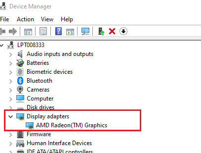

# Computer Notes

## 存储

### 机械硬盘和固态硬盘

硬盘分为：固态硬盘SSD、机械硬盘HDD

SSD采用闪存颗粒存储

HDD采用磁性碟片存储

机械硬盘即是传统普通硬盘，主要由：盘片，磁头，盘片转轴及控制电机，磁头控制器，数据转换器，接口，缓存等几个部分组成。机械硬盘中所有的盘片都装在一个旋转轴上，每张盘片之间是平行的，在每个盘片的存储面上有一个磁头，磁头与盘片之间的距离比头发丝的直径还小，所有的磁头联在一个磁头控制器上，由磁头控制器负责各个磁头的运动。磁头可沿盘片的半径方向运动，加上盘片每分钟几千转的高速旋转，磁头就可以定位在盘片的指定位置上进行数据的读写操作。硬盘作为精密设备，尘埃是其大敌，必须完全密封。

固态硬盘（Solid State Disk或Solid State Drive），也称作电子硬盘或者固态电子盘，是由控制单元和固态存储单元（DRAM或FLASH芯片）组成的硬盘。固态硬盘的接口规范和定义、功能及使用方法上与机械硬盘的相同，在产品外形和尺寸上也与机械硬盘一致。由于固态硬盘没有机械硬盘的旋转介质，因而抗震性极佳。其芯片的工作温度范围很宽（-40~85摄氏度）。目前广泛应用于军事、车载、工控、视频监控、网络监控、网络终端、电力、医疗、航空等、导航设备等领域。目前由于成本较高，还在逐渐普及到DIY市场。

目前个人电脑上不管是台式机还是笔记本用的大多是机械硬盘，如现在流行的 500G，1TB等都是机械硬盘。一些高端或者定制的台式机等也已经开始普遍的出现固态硬盘了，但是容量都还比较小，一般是128G，240G左右。目前主要还是固态硬盘成本还是算比较高的，普及的程度目前也算是一个发力的或者过度的阶段，许多人还是选择双硬盘，SSD固态硬盘用来装系统和程序，一些大文件还是会选择使用HDD机械硬盘来存储，所以固态硬盘的全面使用可能还需要几年的时间来发展。

对比：

1、防震抗摔性：目前的机械硬盘都是磁碟型的，数据储存在磁碟扇区里。而固态硬盘是使用闪存颗粒（即目前内存、MP3、U盘等存储介质）制作而成，所以SSD固态硬盘内部不存在任何机械部件，这样即使在高速移动甚至伴随翻转倾斜的情况下也不会影响到正常使用，而且在发生碰撞和震荡时能够将数据丢失的可能性降到最小。相较机械硬盘，固硬占有绝对优势。

2、数据存储速度：从PConline评测室的评测数据来看，固态硬盘相对机械硬盘性能提升2倍多。

3、功耗：固态硬盘的功耗上也要高于机械硬盘。

4、重量：固态硬盘在重量方面更轻，与常规1.8英寸硬盘相比，重量轻20-30克。

5、噪音：由于固硬属于无机械部件及闪存芯片，所以具有了发热量小、散热快等特点，而且没有机械马达和风扇，工作噪音值为0分贝。机械硬盘就要逊色很多。

6、价格：目前市场上80G Intel固态硬盘，价格为4000元左右。而这个价钱足够买几个容量为1TB的机械硬盘了。

7、容量：固态硬盘目前最大容量仅为256G(目前IBM公司已经开始测试容量为4TB的高速固态硬盘组)，和机械硬盘最大按TB容量衡量相比差距很大。

8、使用寿命：SLC只有10万次的读写寿命，成本低廉的MLC，读写寿命仅有1万次；比起机械硬盘毫无优势可言。

### DOS vs. CMD

有所区别,你在windows操作系统里进的DOS(即输入 CMD 进命令提示符)不是纯DOS,只是为方便某些需求而建立的,而纯DOS本身就是一种操作系统.(两者的区别:比如你可以在纯DOS下删除你的windows系统,但在你所说的"命令提示符"里却不能,因为你不可能"在房子里面拆房子吧?")

dos是磁盘操作系统；命令提示符是dos系统的界面中输入dos命令的提示位置；cmd是xp系统运行其自带dos的命令。

 

1、Windows 命令提示符（cmd.exe）是 Windows NT 下的一个用于运行 Windows 控制面板程序或某些 DOS 程序的shell程序；或在 Windows CE 下只用于运行控制面板程序的外壳程序。

 

2、command.exe是 Windows NT 命令行接口，它不是一个dos窗口；而 cmd.exe 是一个16位的DOS应用程序，它用于支持老的dos应用程序，它一般运行于NTVDM中。但就用户来说，这两个命令有惊人的相似之处，这是因为用户在command.com中输入的命令有很大一部分要送到cmd.exe中运行。

 

3、DOS是英文Disk Operating System的缩写，意思是“磁盘操作系统”。DOS是个人计算机上的一类操作系统。从1981年直到1995年的15年间，DOS在IBM PC 兼容机市场中占有举足轻重的地位。而且，若是把部分以DOS为基础的Microsoft Windows版本，如Windows 95、98和Me等都算进去的话，那么其商业寿命至少可以算到2000年。

 

4、DOS（Disk Operating System）是一个使用得十分广泛的磁盘操作系统。在 Windows 95/98（以及其后发生的 Windows 98与 Me）中，MS-DOS 核心依然存在，只是加上 Windows 当作系统的图型界面。直到纯 32 位版本的 Windows（从 NT 开始；包含了 2000、XP 、vista、win7、win8、win8.1和win10）才完全脱离了DOS的基础。

### Cmd vs. power shell

Windows 7 中开始有了一个PowerShell，实际是增强版的命令行工具。到了 Windows 10，它变成了默认的命令行工具。

 

PowerShell比之前的命令行复杂得多，当然也强悍得多，为了方便，后面我们简称之前的命令行工具还是命令行。命令行使用上和Linux终端差别很多，体验也差很多。但是PowerShell就强多了，而且命令行的命令基本可以直接在PowerShell中使用。

 

## 显示

### 显卡

显示适配器

就是显卡

### 多显示器

配置时发现外接的两个显示器可以显示，但是内容完全一样。

经过查询，发现需要**分线器**，把HDMI一分为二，分别作用于两个显示器。

