# 容器 云远程 微服务

## CN相关技术

- 混沌工程
- 容器化
- K8S
- 可观测性
- 微服务
- DevOps
- serviceMesh
- serviceless
- 边缘计算
- low code
- cloud native
- 中台


## 容器基础

### 发展历程

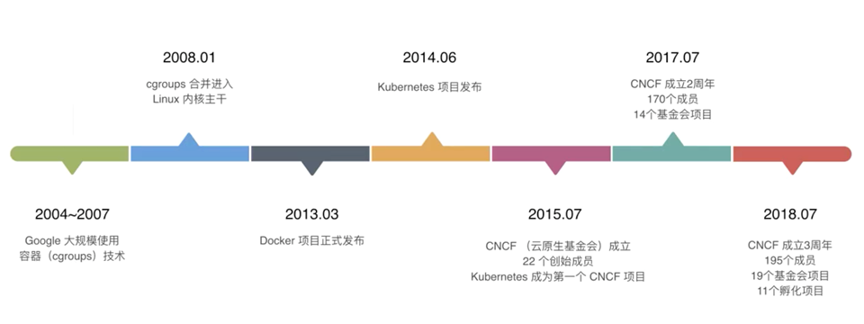


### VM vs. Container

都是虚拟化技术，粒度不同

VM：OS级别的虚拟化

容器：进程级的虚拟化

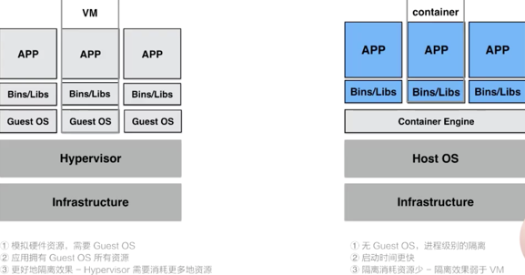


容器：

- 更低的资源消耗
- 更好的系统弹性
- 更快的交付速度
- 更好的系统稳定性
- 更好的系统一致性

### 容器虚拟化的实现原理

容器是一种通过 **namespace** 和 **cgroup** 实现的轻**量级进程级别的虚拟化**，并可以**对应用进程进行隔离**

#### Namespace

Namespace 是操作系统内核在不同进程间实现的一种环境隔离机制

| **Namespace**               | **隔离效果**                                                 |
| --------------------------- | ------------------------------------------------------------ |
| **Mount**                   | 每个容器能看到不同的文件系统层次结构                         |
| **UTS(UNIX  Time-Sharing)** | 每个容器可以有自己的 hostname 和 domainame                   |
| **IPC**                     | 每个容器有其自己的 System V IPC 和 POSIX 消息队列文件系统，因此，只有在同一个 IPC namespace 的进程之间才能互相通信 |
| **PID**                     | 每个 PID namespace 中的进程可以有其独立的 PID, 默认是 1      |
| **Network**                 | 每个容器用有其独立的网络设备，IP 地址，IP 路由表，/proc/net 目录，端口号等等。这也使得一个 host 上多个容器内的同一个应用都绑定到各自容器的 80 端口上 |
| **User**                    | 在  user namespace 中的进程的用户和组 ID 可以和在 host 上不同； 每个 container 可以有不同的  user 和 group id |

#### Cgroups

Linux Control Group， 是Linux内核的一个功能，用来限制，控制与分离一个进程组群的资源（如CPU、内存、磁盘输入输出等）

CGoup 子系统:

1. cpu: 主要限制进程的 cpu 使用率。

2. cpuacct: 可以统计 cgroups 中的进程的 cpu 使用报告。

3. cpuset: 可以为 cgroups 中的进程分配单独的 cpu 节点或者内存节点。

4. memory: 可以限制进程的 memory 使用量。

5. blkio: 可以限制进程的块设备 io。

6. devices: 可以控制进程能够访问某些设备。

7. net_cls: 可以标记 cgroups 中进程的网络数据包，然后可以使用 tc 模块（traffic control）对数据包进行控制。

8. freezer: 可以挂起或者恢复 cgroups 中的进程。


#### LCX

 Linux Containers

LXC Linux Container容器是一种**内核虚拟化技术**，可以提供**轻量级的虚拟化**，以便隔离进程和资源. Docker 最初就是基于 lxc 实现的容器化功能


### 镜像

**镜像**由多个只读层组成

**容器**存储上的主要差别就在于容器多了一个读写层

所有的image都起始于一个基础镜像层，新的层加在其基础上

镜像分层-多容器**共用一个 base 镜像**，节省磁盘空间；提升分发速度


当前image的分层策略：

- 应用，如war
- 自定义软件，如tomcat
- 中间件，如jdk
- OS， 如centos


## Docker

口号：

- **Build, Ship and Run** 搭建、发送、运行
- **Build once，Run anywhere**


- An **image** is a read-only template with instructions for creating a container

- A d**ockerfile** is a simple text file that consists of instructions to build Docker images

- A **container** is a runnable instance of an image

- A container **registry** stores container images


### 命令

#### docker image

```bash
docker image ls
docker image rm imagename
docker image build -t image-name:tag
docker image inspect # 查看镜像分层
docker image push # 推送镜像

// . 表示当前目录 -f 参数指定 Dockerfile 文件 -t 表示 制作的镜像:tag
docker image build -f Dockerfile -t edw/scratch-cms-backend:1.0.0 .


```


#### docker container

```bash
docker container run
参数： -it: 进入容器内部，并连接到shell

docker container stop # 优雅关闭，发送SIFTERM信号，10秒后还没有停止再发送SIGKILL强行关闭

docker container rm  # 直接kill，删除，不建议，先stop
docker rm

docker container ls  
docker ps 

docker container start
docker start


# 进入容器，并使用bash交互
docker exec -it  36080e8c431c bash


docker container --help
Commands:
  attach      Attach local standard input, output, and error streams to a running container
  commit      Create a new image from a container's changes
  cp          Copy files/folders between a container and the local filesystem
  create      Create a new container
  diff        Inspect changes to files or directories on a container's filesystem
  exec        Run a command in a running container
  export      Export a container's filesystem as a tar archive
  inspect     Display detailed information on one or more containers
  kill        Kill one or more running containers
  logs        Fetch the logs of a container
  ls          List containers
  pause       Pause all processes within one or more containers
  port        List port mappings or a specific mapping for the container
  prune       Remove all stopped containers
  rename      Rename a container
  restart     Restart one or more containers
  rm          Remove one or more containers
  run         Run a command in a new container
  start       Start one or more stopped containers
  stats       Display a live stream of container(s) resource usage statistics
  stop        Stop one or more running containers
  top         Display the running processes of a container
  unpause     Unpause all processes within one or more containers
  update      Update configuration of one or more containers
  wait        Block until one or more containers stop, then print their exit codes
```


#### docker system

```bash
docker system info
```


#### docker history

```dockerfile
docker history imageName

```


#### docker run

```bash
docker run -d -e TZ="Asia/Shanghai" \
-p 2182:2182 \
-v /usr/local/zookeeper/data:/data \
-v /usr/local/zookeeper/conf/zoo.cfg:/conf/zoo.cfg \ (如果在配置中指定 data 目录，则上面一行不用)
--name zookeeper \
--restart always zookeeper

-e TZ="Asia/Shanghai" # 指定上海时区
-d # 表示在一直在后台运行容器
-p 2181:2181 # 对端口进行映射，将本地 2181 端口映射到容器内部的 2181 端口
--name # 设置创建的容器名称
-v # 将本地目录(文件)挂载到容器指定目录；
--restart always #始终重新启动 zookeeper

```

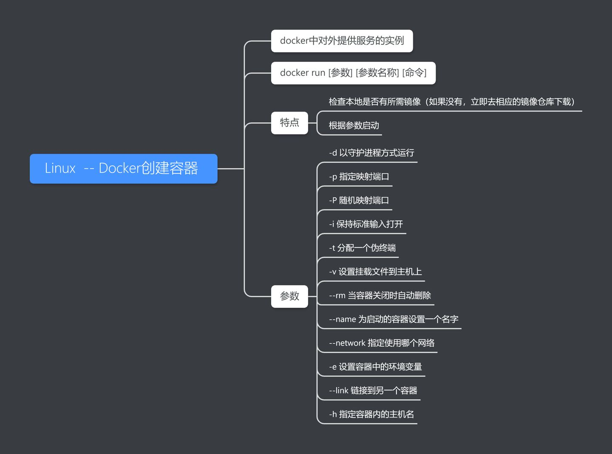

#### 进入容器的几种方式

sudo docker exec -it 775c7c9ee1e1 /bin/bash  

https://www.cnblogs.com/xhyan/p/6593075.html


`docker exec {containerID} env`

查看容器中生效的环境变量


#### docker inspect 

docker inspect container_name

查看容器信息


#### docker cp

docker cp file Container:path


#### docker exec

关于-i、-t参数

可以看出只用-i时，由于没有分配伪终端，看起来像pipe执行一样。但是执行结果、命令
返回值都可以正确获取。

使用-it时，则和我们平常操作console界面类似。而且也不会像attach方式因为退出，导致
整个容器退出。
这种方式可以替代ssh或者nsenter、nsinit方式，在容器内进行操作。

如果只使用-t参数，则可以看到一个console窗口，但是执行命令会发现由于没有获得stdin
的输出，无法看到命令执行情况。


#### docker attach

Docker attach可以**attach到一个已经运行的容器的stdin**，然后进行命令执行的动作。
但是需要注意的是，**如果从这个stdin中exit，会导致容器的停止。**


#### docker commit

从容器创建一个新的镜像。

- **-a :**提交的镜像作者；

  

- **-c :**使用Dockerfile指令来创建镜像；

  

- **-m :**提交时的说明文字；

  

- **-p :**在commit时，将容器暂停。


### 配置

####  config.v2.json

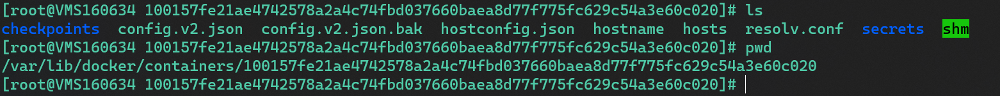


#### 改变容器配置的几种方式

1. 创建新的镜像： 根据容器创建新镜像： docker commit
2. 编辑配置： /var/lib/docker/containers/container-id/config.v2.json
   1. 需要stop容器
   2. **只能编辑Ports、NetworkSettings**
3. 编辑dockerfile： docker-compose -f dockerfile.yml up -d 
   1. 也是产生新镜像？
4. 修改docker volumes


### docker compose

编排

默认配置yml: docker-compose.yml


demo:

```yml
version: "3"  # 版本，必须，第一行
services:  # 定义不同的服务
  redis:
    image: redis:alpine
    ports:
      - "6379"  # 宿主机 和 容器内服务的端口映射
    networks:
      - frontend  # 可以连接的网络
    deploy:
      replicas: 2
      update_config:
        parallelism: 2
        delay: 10s
      restart_policy:
        condition: on-failure

  db:
    image: postgres:9.4
    volumes:
      - db-data:/var/lib/postgresql/data
    networks:
      - backend
    deploy:
      placement:
        constraints: [node.role == manager]

  vote:
    image: dockersamples/examplevotingapp_vote:before
    ports:
      - 5000:80
    networks:
      - frontend
    depends_on:
      - redis
    deploy:
      replicas: 2
      update_config:
        parallelism: 2
      restart_policy:
        condition: on-failure

  result:
    image: dockersamples/examplevotingapp_result:before
    ports:
      - 5001:80
    networks:
      - backend
    depends_on:
      - db
    deploy:
      replicas: 1
      update_config:
        parallelism: 2
        delay: 10s
      restart_policy:
        condition: on-failure

  worker:
    image: dockersamples/examplevotingapp_worker
    networks:
      - frontend
      - backend
    deploy:
      mode: replicated
      replicas: 1
      labels: [APP=VOTING]
      restart_policy:
        condition: on-failure
        delay: 10s
        max_attempts: 3
        window: 120s
      placement:
        constraints: [node.role == manager]

  visualizer:
    image: dockersamples/visualizer:stable
    ports:
      - "8080:8080"
    stop_grace_period: 1m30s
    volumes:
      - "/var/run/docker.sock:/var/run/docker.sock"
    deploy:
      placement:
        constraints: [node.role == manager]

networks:  # 网络，默认情况下会创建 bridge网络
  frontend:
  backend:

volumes:   # 指引docker创建新的卷
  db-data:
```


默认查找名为docker-compose的yml或者yaml文件，如果自定义名称，需要使用-f指定：

```bash
docker-compose -f a.yml up -d
# -d:后台

docker-compose stop
docker-compose start
docker-compose restart
```


### Dockerfile

```dockfile
FROM alpine: 以 alpine 镜像作为当前镜像基础
LABLE maintainer="a":指定维护者a
RUN apk add --update nodejs nodejs-npm :安装 nodejs\npm
COPY . /src : 复制应用代码到镜像中
WORKDIR /src : 设置工作目录
RUN npm install : 运行构建命令
EXPOSE 8080 :暴露的端口
ENTRYPOINT ["node", "./app.js"] ：入口程序，运行应用
```


### WSL Docker

守护进程问题：

管理员启动WSL

```shell

sudo cgroupfs-mount
sudo service docker start

```


启动问题：

Cannot connect to the Docker daemon at unix:///var/run/docker.sock. Is the docker daemon running?

居然是因为镜像源问题：

cd /etc/docker

vim deamon.json

```
{
 "registry-mirrors": ["https://registry.docker-cn.com"]
}
```

注意：阿里镜像源不对，需要自己配置仓库

如果配置不对启动不起来


Vmmem占用过多资源问题

重启LxssManager:

```shell
net stop LxssManager
net sta LxssManager
```


### Docker Desktop

安装后

可以弃用WSL，而不是使用Hyper-V

然后可以查看 wsl -l -v

```sql
  NAME                   STATE           VERSION
* Ubuntu-20.04           Running         2
  docker-desktop         Stopped         2
  docker-desktop-data    Stopped         2
```

转移docker-desktop-data

注: 默认安装在C盘, 使用docker会产生很多资源占用, 建议将 **docker-desktop-data** 转移到其他盘

关闭要转移的子系统
终止所有子系统

wsl --shutdown

终止指定的子系统, 如 docker-desktop-data

wsl --terminate docker-desktop-data

将子系统导出为tar包
wsl --export docker-desktop-data F:/WSL/docker-desktop-data/docker-desktop.tar

使用wsl命令注销并删除子系统
wsl --unregister docker-desktop-data

重新导入子系统到指定目录
wsl --import docker-desktop-data F:/WSL/docker-desktop-data F:/WSL/docker-desktop-data/docker-desktop.tar

删除tar包
del F:/WSL/docker-desktop-data/docker-desktop.tar


### 常见应用

#### mysql

```jsx
 docker run -p 3306:3306 --name mysql57 -v ~/mysql/data:/var/lib/mysql -e MYSQL_ROOT_PASSWORD=root  -d mysql:5.7
//创建容器时，最后mysql:5.6表示mysql镜像的版本，可以写，表示指定该版本；如果不写也可以，docker会自动在本地检测有没有最新的，如果没有会自动去docker hub上去下载。
```


#### Hadoop

```sql
单机镜像：
docker pull sequenceiq/hadoop-docker:2.7.1

docker run -it sequenceiq/hadoop-docker:2.7.1 /etc/bootstrap.sh -bash

```

如果执行start-all.sh的时候发现JPS一下namenode没有启动

每次开机都得重新格式化一下namenode才可以

问题就出在tmp文件，默认的tmp文件每次重新开机会被清空，与此同时namenode的格式化信息就会丢失

```bash
hadoop namenode -format
```


搭建集群：

https://zhuanlan.zhihu.com/p/242658224

```sql
docker pull registry.cn-hangzhou.aliyuncs.com/hadoop_test/hadoop_base

# 创建网络
docker network create --driver=bridge --subnet=172.19.0.0/16  hadoop
# 启动容器
docker run -it --network hadoop -h Master -d --restart always --name Master -p 9870:9870 -p 8088:8088 -p 10000:10000 registry.cn-hangzhou.aliyuncs.com/hadoop_test/hadoop_base bash

docker run -it --network hadoop -h Slave1 -d --restart always --name Slave1 registry.cn-hangzhou.aliyuncs.com/hadoop_test/hadoop_base bash

docker run -it --network hadoop -h Slave2 -d --restart always --name Slave2 registry.cn-hangzhou.aliyuncs.com/hadoop_test/hadoop_base bash


都修改host vim /etc/hosts
172.20.0.4	Master
172.20.0.3	Slave1
172.20.0.2	Slave2

#进入Master容器
docker exec -it Master bash
#进入后格式化hdfs
root@Master:/# hadoop namenode -format

启动全部，包含hdfs和yarn
root@Master:/usr/local/hadoop/sbin# ./start-all.sh


可以看到服务起来了，本地范围宿主机ip的8088及9870端口可以看到监控信息:
http://localhost:8088/cluster

```


#### Hive

https://zhuanlan.zhihu.com/p/242658224

下载 [hive-3.1.2](https://link.zhihu.com/?target=http%3A//mirror.bit.edu.cn/apache/hive/hive-3.1.2/)

解压

```bash
# 拷贝安装包进Master容器
docker cp apache-hive-3.1.2-bin.tar.gz Master:/usr/local
# 进入容器
docker exec -it Master bash
cd /usr/local/
# 解压安装包
tar xvf apache-hive-3.1.2-bin.tar.gz
```

注意 docker cp的使用


```bash
root@Master:/usr/local/apache-hive-3.1.2-bin/conf# cp hive-default.xml.template hive-site.xml
root@Master:/usr/local/apache-hive-3.1.2-bin/conf# vim hive-site.xml
```

在前面添加：

```json
 <property>
    <name>system:java.io.tmpdir</name>
    <value>/tmp/hive/java</value>
  </property>
  <property>
    <name>system:user.name</name>
    <value>${user.name}</value>
  </property>
```

配置hive环境

```bash
vim /etc/profile

#文本最后添加
export HIVE_HOME="/usr/local/apache-hive-3.1.2-bin"
export PATH=$PATH:$HIVE_HOME/bin 

```

```bash
source /etc/profile
```

mysql作为元数据

```bash
#拉取镜像
docker pull mysql:8:0.18
#建立容器
docker run --name mysql_hive -p 4306:3306 --net hadoop --ip 172.19.0.5 -v /root/mysql:/var/lib/mysql -e MYSQL_ROOT_PASSWORD=abc123456 -d mysql:8.0.18
#进入容器
docker exec -it mysql_hive bash
#进入myslq
mysql -uroot -p
#密码上面建立容器时候已经设置abc123456
#建立hive数据库
create database hive;
#修改远程连接权限
ALTER USER 'root'@'%' IDENTIFIED WITH mysql_native_password BY 'abc123456';
```


查看mysql暴露的IP：

 docker inspect mysql

```
 "Networks": {
                "bridge": {
                    "IPAMConfig": null,
                    "Links": null,
                    "Aliases": null,
                    "NetworkID": "f7bdc1a8051f477f2bfe27dd5d9946a3d4d47b162d2a749b0e3640403beb770b",
                    "EndpointID": "ae79145a346e7cf373161fe190abd05fd9a4a4c59065eae61e3ecf2b32a74349",
                    "Gateway": "172.17.0.1",
                    "IPAddress": "172.17.0.2",
                    "IPPrefixLen": 16,
                    "IPv6Gateway": "",
                    "GlobalIPv6Address": "",
                    "GlobalIPv6PrefixLen": 0,
                    "MacAddress": "02:42:ac:11:00:02",
                    "DriverOpts": null
                }
            }
           
```

注意使用 Gateway 地址


使用该地址配置hive-site.xml

```
 #还请注意hive配置文件里面使用&amp;作为分隔，高版本myssql需要SSL验证，在这里设置关闭
  <property>
        <name>javax.jdo.option.ConnectionUserName</name>
        <value>root</value>
    </property>
    <property>
        <name>javax.jdo.option.ConnectionPassword</name>
        <value>abc123456</value>
    </property>
    <property>
        <name>javax.jdo.option.ConnectionURL</name>
        <value>jdbc:mysql://172.19.0.5:3306/hive?createDatabaseIfNotExist=true&amp;useSSL=false</value>
    </property>
    <property>
        <name>javax.jdo.option.ConnectionDriverName</name>
        <value>com.mysql.jdbc.Driver</value>
    </property>
    <property>
        <name>hive.metastore.schema.verification</name>
    <value>false</value>
    <property>
```

这里的驱动也要上传一下：

```bash
#前面已经跟hive安装包一起上传到容器/usr/local目录
root@Master:/usr/local# cp mysql-connector-java-5.1.49.jar /usr/local/apache-hive-3.1.2-bin/lib
```

修改lib下的jar包：

```bash
#slf4j这个包hadoop及hive两边只能有一个，这里删掉hive这边
root@Master:/usr/local/apache-hive-3.1.2-bin/lib# rm log4j-slf4j-impl-2.10.0.jar

#guava这个包hadoop及hive两边只删掉版本低的那个，把版本高的复制过去，这里删掉hive，复制hadoop的过去
root@Master:/usr/local/hadoop/share/hadoop/common/lib# cp guava-27.0-jre.jar /usr/local/apache-hive-3.1.2-bin/lib
root@Master:/usr/local/hadoop/share/hadoop/common/lib# rm /usr/local/apache-hive-3.1.2-bin/lib/guava-19.0.jar

#把文件hive-site.xml第3225行的特殊字符删除
root@Master: vim /usr/local/apache-hive-3.1.2-bin/conf/hive-site.xml
```


配置Hive环境变量

cp hive-env.sh.template hive-env.sh

```
# Set HADOOP_HOME to point to a specific hadoop install directory
export HADOOP_HOME=/usr/local/hadoop

# Hive Configuration Directory can be controlled by:
export HIVE_CONF_DIR=/usr/local/apache-hive-3.1.2-bin/conf
```

source hive-env.sh


初始化元数据：

```bash
root@Master:/usr/local/apache-hive-3.1.2-bin/bin# schematool -initSchema -dbType mysql

Metastore connection URL:        jdbc:mysql://172.19.0.5:3306/hive?createDatabaseIfNotExist=true&useSSL=false
Metastore Connection Driver :    com.mysql.jdbc.Driver
Metastore connection User:       root
Starting metastore schema initialization to 3.1.0
Initialization script hive-schema-3.1.0.mysql.sql
Initialization script completed
schemaTool completed
```


然后 进入hive交互页面

如果hive启动不了，检查hadoop是否正确启动，特别是其中的NameNode，每次启动都要format一下

#### Spark

docker-compose部署

```
docker pull singularities/spark

vim docker-compose.yml:
version: "2"
 
services:
  master:
    image: singularities/spark
    command: start-spark master
    hostname: master
    ports:
      - "6066:6066"
      - "7070:7070"
      - "8080:8080"
      - "50070:50070"
  worker:
    image: singularities/spark
    command: start-spark worker master
    environment:
      SPARK_WORKER_CORES: 1
      SPARK_WORKER_MEMORY: 2g
    links:
      - master
      
      
 docker-compose up -d

```

docker-compose up之后就启动了

`docker-compose ps`可以查看启动的容器：

```bash
edwinxu@LPT008333:~/spark$ docker-compose ps
     Name                 Command            State                           Ports
-----------------------------------------------------------------------------------------------------------
spark_master_1   start-spark master          Up      10020/tcp, 13562/tcp, 14000/tcp, 19888/tcp, 50010/tcp,
                                                     50020/tcp,
                                                     0.0.0.0:50070->50070/tcp,:::50070->50070/tcp,
                                                     50075/tcp, 50090/tcp, 50470/tcp, 50475/tcp,
                                                     0.0.0.0:6066->6066/tcp,:::6066->6066/tcp,
                                                     0.0.0.0:7070->7070/tcp,:::7070->7070/tcp, 7077/tcp,
                                                     8020/tcp, 0.0.0.0:8080->8080/tcp,:::8080->8080/tcp,
                                                     8081/tcp, 9000/tcp
spark_worker_1   start-spark worker master   Up      10020/tcp, 13562/tcp, 14000/tcp, 19888/tcp, 50010/tcp,
                                                     50020/tcp, 50070/tcp, 50075/tcp, 50090/tcp, 50470/tcp,
                                                     50475/tcp, 6066/tcp, 7077/tcp, 8020/tcp, 8080/tcp,
                                                     8081/tcp, 9000/tcp
```

进入端口可以查看控制台：

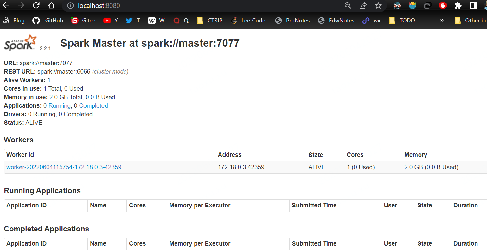

注意：不需要在/usr/local/spark/sbin下面 执行start-all.sh进行启动？

hadoop verion， spark-sql等命令可以直接使用


不需要进入master，在spark目录下可以进入shell、提交任务等

usr/local


https://www.cnblogs.com/hongdada/p/9475406.html


#### redis

https://blog.csdn.net/weixin_45821811/article/details/116211724

```sql
docker run --restart=always \
--log-opt max-size=100m \
--log-opt \
max-file=2 \
-p 6379:6379 \
--name myredis \
-v /home/edwinxu/redis/myredis.conf:/etc/redis/redis.conf \
-v /home/edwinxu/redis/data:/data \
-d redis redis-server /etc/redis/redis.conf  \
--appendonly yes  


–restart=always 总是开机启动
–log是日志方面的
-p 6379:6379 将6379端口挂载出去
–name 给这个容器取一个名字
-v 数据卷挂载
/home/redis/myredis/myredis.conf:/etc/redis/redis.conf 这里是将 liunx 路径下的myredis.conf 和redis下的redis.conf 挂载在一起。
/home/redis/myredis/data:/data 这个同上
-d redis 表示后台启动redis
redis-server /etc/redis/redis.conf 以配置文件启动redis，加载容器内的conf文件，最终找到的是挂载的目录 /etc/redis/redis.conf 也就是liunx下的/home/redis/myredis/myredis.conf
–appendonly yes 开启redis 持久化
–requirepass 000415 设置密码 （如果你是通过docker 容器内部连接的话，就随意，可设可不设。但是如果想向外开放的话，一定要设置

```


> docker logs --since 30m myredis

此处 --since 30m 是查看此容器30分钟之内的日志情况。


进入cli:

> docker exec -it myredis redis-cli

这个命令提示太牛逼了

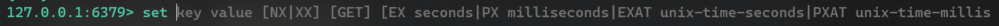

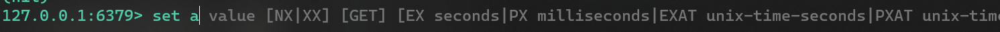


## K8S

### 概述

Google开发

Kubernetes： 源于希腊语，“舵手”的意思。ubernete 8个字母，缩写为 k8s 

**自动化的容器编排平台**

三个特点：

- 部署
- 弹性
- 管理

核心功能：

- 服务发现与负载均衡
- 容器自动装箱
- 自动容器恢复
- 自动发布与回滚
- 配置与密文管理
- 批量执行
- 水平伸缩

解决的问题：

| **Tasks**              | **Explanation**                                              |
| ---------------------- | ------------------------------------------------------------ |
| Scheduling             | Automatically  provision container instances.                |
| Affinity/anti-affinity | Provision  containers nearby or far apart from each other, helping availability and  performance. |
| Health  monitoring     | Automatically  detect and correct failures.                  |
| Failover               | Automatically  reprovision failed instance to healthy machines. |
| Scaling                | Automatically  add or remove container instance to meet demand. |
| Networking             | Manage  a networking overlay for container communication.    |
| Service  Discovery     | Enable  containers to locate each other.                     |
| Rolling  Upgrades      | Coordinate  incremental upgrades with zero downtime deployment. Automatically roll back  problematic changes. |

### 架构

一个K8S系统通常称为一个K8S集群，这个集群包含两个部分：

- 一个Master节点：主节点，负责管理和控制
- 一群Node节点：计算节点，负责工作负载

#### Master

Master节点包括

- API Server：整个系统的对外接口，供客户端和其它组件调用
- Scheduler：对集群内部的资源进行调度
- Controller manager：负责管理控制器
- etcd

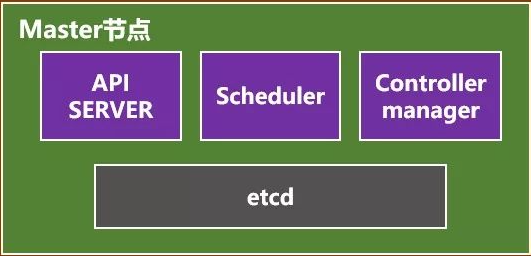


#### Node

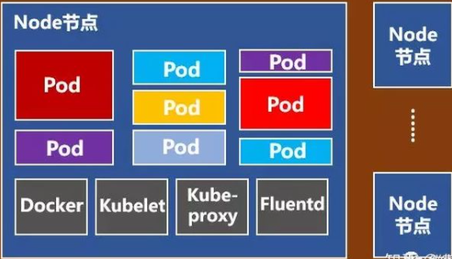

Node节点包括

- Docker
- **kubelet**，主要负责监视指派到它所在Node上的Pod，包括创建、修改、监控、删除等。
- kube-proxy，主要负责为Pod对象提供代理。
- Fluentd，主要负责日志收集、存储与查询。
- kube-dns（可选）
- **Pod**

Pod是Kubernetes最基本的操作单元。一个Pod代表着集群中运行的一个进程，它内部封装了一个或多个紧密相关的容器。除了Pod之外，K8S还有一个**Service**的概念，一个Service可以看作一组提供相同服务的Pod的对外访问接口。


## 云原生

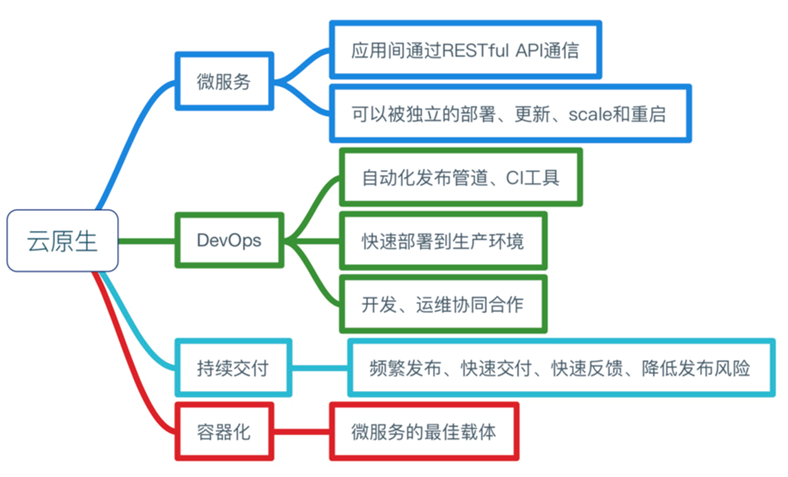


## 文章阅读

### 容器网络工作原理

https://mp.weixin.qq.com/s/rGqfJLnwdaxyvQ-5p0m5jQ

`容器只是隔离并受限的 Linux 进程`

单主机容器网络问题:

- 如何`虚拟化网络资源`，让容器认为自己拥有独占网络？
- 如何让容器们和平共处，之间不会互相干扰，并且能够互相通信？
- 从容器内部如何访问外部世界（比如，互联网）？
- 从外部世界如何访问某台机器上的容器呢（比如，端口发布）？


**单主机容器网络是已知的 Linux 功能的简单组合**：

- 网络`命名空间（namespace）`
- `虚拟 Ethernet`设备（veth）
- 虚拟网络交换机（`网桥`）
- IP路由和网络地址翻译（`NAT`）

**network 命名空间隔离容器**:

Linux 网络栈包括哪些部分？显然，是一系列网络设备。还有别的吗？可能还包括一系列的路由规则。并且不要忘记，netfilter hook，包括由iptables规则定义的。

用于容器隔离的一个 Linux 命名空间是网络命名空间（network namespace）。从 man ip-netns 可以看到，“网络命名空间是网络栈逻辑上的另一个副本，它有自己的路由，防火墙规则和网络设备。

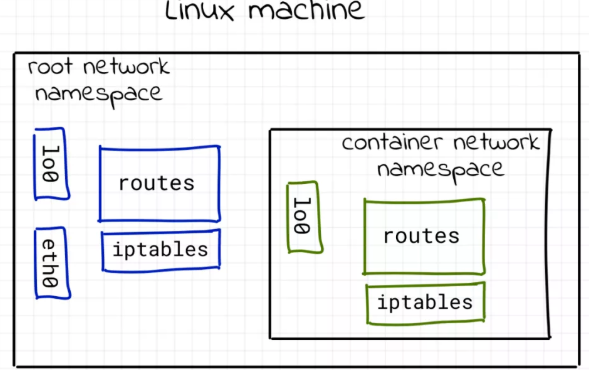


**使用虚拟的 Ethernet 设备（veth）将容器连接到主机上**:

**使用虚拟网络 switch（网桥）连接容器**


