# Data Infrastructure 数据基础架构

## 基于Binlog实时流的数据基础架构

https://mp.weixin.qq.com/s/QYibhkZsBbpvfxYPdMcqOQ

### 概述

携程金融，集团风控和金融业务，需要在携程DC构建统一的金融数据中心，实现多地多机房的数据融合，满足离线和在线需求。这涉及到数千张MySQL表到离线数仓、实时数仓、在线缓存的同步。

由于跨地域、实时性、准确性、完整性要求高，集团内二次开发的DataX（业界常用的离线同步方案）无法支持。以mysql-hive同步为例，DataX通过直连MySQL批量拉取数据，存在以下问题：

- 性能瓶颈：随着业务规模增加，数据规模增大，影响mysql-hive表的产出时间，进而影响数仓下游任务。对于一些需要mysql-hive小时级镜像的场景更加不满足
- 影响线上业务：离线批量拉取数据，可能导致**慢查询**，影响业务库的线上服务。
- 无法保证幂等：线上库在实时更新，对于一些对时点要求非常高的场景(如离线对账)无法接受
- 缺乏对DELETE的支持：业务库做了DELETE操作后，只有整表全量拉取，才能在hive镜像中体现。

### 方案架构概述

基于上述BG，设计了一套 基于**binlog实时流的数据基础层构建方案**。

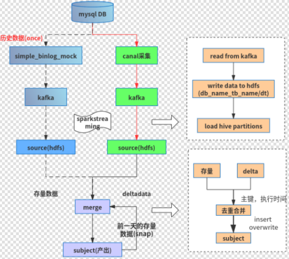


webUI做binlog采集的配置，以及mysql->hive，mysql→实时数仓，mysql→在线缓存的镜像配置工作。

canal负责binlog采集 ，写入kafka ；其中kafka在多地部署，并通过专线实现topic的实时同步。

spark-streaming 负责将binlog写入HDFS

merge 离线调度的ETL作业，负责将HDFS增量和 snap 合并成新的 snap

mirror 负责将binlog事件更新到实时数仓、在线缓存。

基础服务：包括历史数据的重放，数据校验，全链路监控，明文检测等功能。

### 详细介绍

以mysql-hive镜像为例

#### binlog采集

对canal做了二次开发，主要是将Raw Binlog -> Simple Binlog

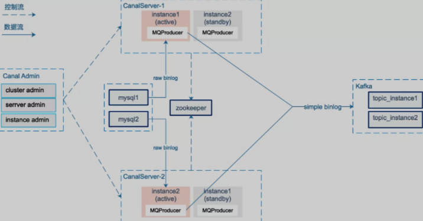

采用canal-admin图形化地管理binlog的采集，采集粒度是mysql instance级别

Canal Server会向canalAdmin 拉取所属集群下的所有mysql instance 列表，针对每个mysql instance采集任务，canal server通过在zookeeper创建临时节点的方式实现HA，并通过zookeeper实现binlog position的共享

canal 1.1.1版本引入MQProducer 原生支持kafka消息投递 , 图中instance active 从mysql 获取实时的增量raw binlog数据，在MQProducer 环节进行raw binlog → simple binlog的消息转换，发送至kafka。我们按照instance 创建了对应的kafka topic，而非每个database 一个topic , 主要考虑到同一个mysql instance 下有多个database，过多的topic (partition) 导致kafka随机IO增加，影响吞吐。发送Kafka时以schemaName+tableName作为partitionKey，结合producer的参数控制，保证同一个表的binlog消息按顺序写入kafka。

从保证数据的顺序性、容灾等方面考虑，我们设计了一个轻量级的SimpleBinlog消息格式

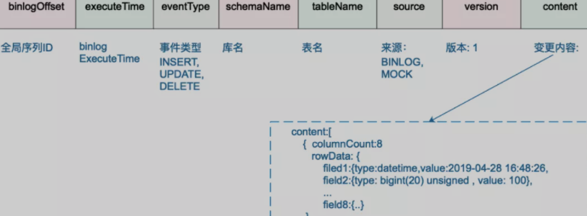

- binlogOffset：全局序列ID，由${timestamp}\${seq} 组成，该字段用于**全局排序**，方便Hive做**row_number** 取出最新镜像，其中seq是**同一个时间戳**下自增的数字，长度为6。
- executeTime：binlog 的执行时间。
- eventType：事件类型：INSERT，UPDATE，DELETE。
- schemaName：库名，在后续的spark-streaming，mirror 处理时，可以根据分库的规则，只提取出前缀，比如(ordercenter_001 → ordercenter) 以屏蔽分库问题。
- tableName：表名，在后续的spark-streaming，mirror 处理时，可以根据分表规则，只提取出前缀，比如(orderinfo_001 → orderinfo ) 以屏蔽分表问题。
- source：用于区分simple binlog的来源，实时采集的binlog 为 **BINLOG**， 重放的历史数据为 **MOCK** 。
- version：版本
- content：本次变更的内容，**INSERT**，**UPDATE** 取afterColumnList，**DELETE** 取beforeColumnList。

Q： 事件类型只有三种，如果alter table，如删除一列，是那种事件？

#### 历史数据重放

有两个场景需要我们采集历史数据：

- 首次做 mysql-hive镜像，需要从mysql加载历史数据
- 系统故障，需要从mysql恢复数据


有两种方案：

1）从mysql 批量拉取历史数据，上传到HDFS 。需要考虑批量拉取的数据与 binlog 采集产出的mysql-hive镜像的格式差异，比如去重主键的选择，排序字段的选择等问题。

2）流式方式， 批量从mysql 拉取历史数据，转换为simple binlog消息流写入kafka，同实时采集的simple binlog流复用后续的处理流程。在合并产生mysql-hive镜像表时，需要确保这部分数据不会覆盖实时采集的simple binlog数据。

我们选用了更简单易维护的方案2，并开发了一个binlog-mock 服务，可以根据用户给出的库、表（前缀）以及条件，按批次（比如每次select 10000行）从mysql查询数据，组装成simple_binlog消息发送kafka。

#### **Write2HDFS** 

我们采用spark-streaming 将kafka消息持久化到HDFS，每5分钟一个批次，一个批次的数据处理完成（持久化到HDFS）后再提交consumer offset，保证消息被at-least-once处理；同时也考虑了分库分表问题、数据倾斜问题：

**屏蔽分库分表**：以订单表为例，mysql数据存储在ordercenter_00 ... ordercenter_99 100个库，每个库下面又有orderinfo_00...orderinfo_99 100张表，库前缀schemaNamePrefix=ordercenter,表前缀tableNamePrefix=orderinfo，统一映射到tableName=、\${schemaNamePrefix}_${tableNamePrefix}里; 根据binlog executeTime字段生成对应的分区dt，确保同一个库表同一天的数据落到同一个分区目录里: base_path/ods_binlog_source.db/${database_prefix}_${table_prefix}/dt={binlogDt}/binlog-{timestamp}-{rdd.id}

**防止数据倾斜**: 系统上线初期经常出现数据倾斜问题，排查发现某些时间段个别表由于业务跑批等产生的binlog量特别大，一张表一个批次的数据需要写入同一个HDFS文件，单个HDFS文件的写入速度成为瓶颈。因此增加了一个环节（Step2），过滤出当前批次里的“大表"，将这些大表的数据分散写入多个HDFS文件里。 

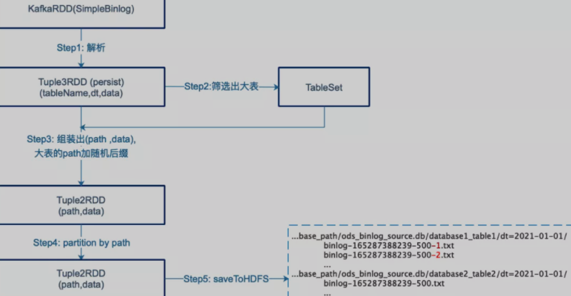

#### 生成镜像

数据就绪检查

全链路对延迟进行监控，在merge前，先对数据就绪状态进行检查

检查的方式是，所有延迟的累计和，要小于正是merge的时间，保证T-1的数据全部落入HDFS


Merge：

hdfs上simple binlog就绪或，下一步对相应的MySQL业务表数据进行还原，merge流程：

1. 加载T-1分区的simple binlog数据

   通过 MSCK REPAIR PARTITION加载T-1分区数据。(第一次做mysql-hive镜像时，历史数据重放的simple-binlog也会落入T-1分区)

2. 检查Schema，并抽取T-1增量

   

3. 判断业务库是否发生了归档操作，以决定后续合并时是否忽略DELETE事件

4. 对增量DELTA数据和当前快照snap T-2 进行合并去重，得到最新的 snap T-1

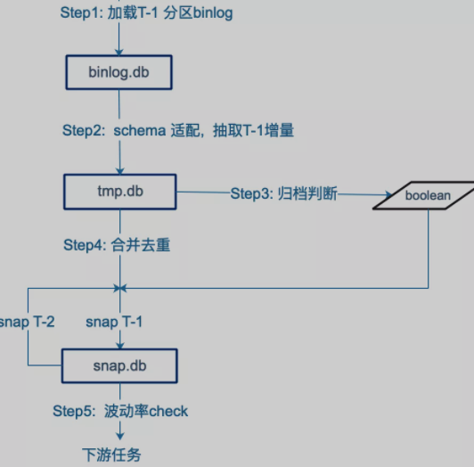

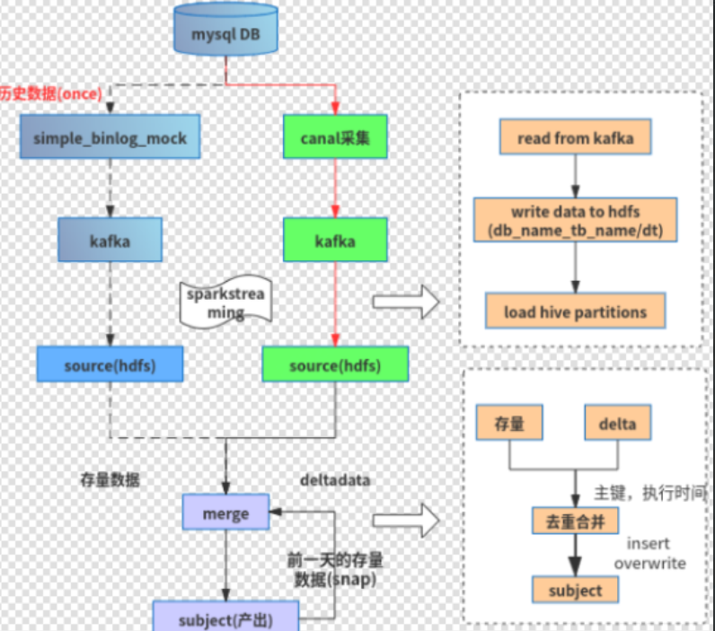

最后需要check，这里使用的是**最后7天**的数据进行hive-mysql比对


### Source/Transform/Snap

#### source

source存储的是SimpleBinlog

```sql
-- ods_fin_basic_source  
create table cfodsservicedb_tbl_model_sub_feature(
version bigint COMMENT 'souce层消息格式版本号',
content string COMMENT '变更消息内容',
field_size int COMMENT '字段个数',
type string COMMENT 'binlog消息变更类型',
update_time string COMMENT 'binlog执行时间',
schema string COMMENT '变更数据对应的schema',
table string COMMENT '变更数据对应的table',
binlog_process_time string COMMENT 'binlog解析处理时间',
binlog_file string COMMENT 'binlog对应的binlog文件名',
offset bigint COMMENT 'binlog对应的偏移量')
COMMENT 'cfodsservicedb_tbl_model_sub_feature, 原始的binlog'
PARTITIONED BY (dt string COMMENT '按天分区')
ROW FORMAT SERDE 'org.apache.hadoop.hive.serde2.lazy.LazySimpleSerDe'
STORED AS textfile
TBLPROPERTIES ('metadata.partition.life'='-1');
```


| 字段名称            | 字段值                                                       |
| :------------------ | :----------------------------------------------------------- |
| version             | 1                                                            |
| content             | {"file_version":"MTY0NTYwNjg5NzAwMA==","new_feature_dim_column":"","model_version":"djM=","create_time":"MjAyMi0wMi0yNCAxNDoxMTozOA==","feature_alias":"eDk=","feature_dim_column":"cXVuYXJfaWQ=","replaced":"MA==","default_value":"LTk5OS4w","public_index":"MQ==","feature_table":"dG1wX3Jpc2tfbW9kZWwuYWRtX3Jza19mZWF0dXJlX2NxZl9jaWRfYWxsX2Zpbl9jYXNoX2lubG9hbl9zbmFwX3ZfYXR0ZW50aW9uX3BrZ19wcm9i","new_feature_field":"","replace_operator":"","update_time":"MjAyMi0wMi0yNCAxNDoxMTozOA==","model_code":"Y2lkX2JjYXJkX2lubG9hbl9tYW5hZ2U=","zeus_job_id":"NzcyMjM2LDc3MjIzOQ==","sub_model_code":"QQ==","sample_dim_column":"cXVuYXJfaWQ=","feature_field":"YXR0ZW50aW9uX2FwcF9zY29yZQ==","new_feature_table":"","feature_index":"Njc=","id":"MjUwOTg=","feature_code":"","datachange_lasttime":"MjAyMi0wMy0xMSAwNjowMDoxMC4xOTk="} |
| field_size          | 23                                                           |
| type                | UPDATE                                                       |
| update_time         | 1646949610603000000                                          |
| schema              | cfodsservicedb                                               |
| table               | tbl_model_sub_feature                                        |
| binlog_process_time | 1646949797444000000                                          |
| binlog_file         | null                                                         |
| offset              | 1646949610603000000                                          |

source层完全是SimpleBinlog格式，内容加密过了

#### transform

```sql
-- fin_basic_transform
CREATE TABLE cfodsservicedb_tbl_model_sub_feature(
sc_operate_type string COMMENT '操作类型',
sc_operate_time string COMMENT '操作时间',
offset bigint  COMMENT 'binlog消息的偏移量',
binlog_process_time string COMMENT 'binlog处理时间',
    
id bigint comment '主键',
model_code string comment '模型编号',
model_version string comment '模型版本',
sub_model_code string comment '子模型编号，A、B、C...',
file_version string comment '预测文件版本（用于管理不断自迭代的模型文件）',
feature_code string comment '特征编码',
feature_alias string comment '特征别名',
default_value double comment '缺省值',
feature_dim_column string comment '指定特征查询使用的特征维度字段，需在样本表中提供对应的数据',
feature_index tinyint comment '特征导入序号',
create_time timestamp comment '创建时间',
update_time timestamp comment '更新时间',
datachange_lasttime timestamp comment '更新时间',
public_index int comment '是否在指标库中的指标，1是0否, 默认1',
feature_table string comment '非public指标的特征表',
feature_field string comment '非public指标的特征字段',
zeus_job_id string comment '特征中feature_table所依赖的Zeus JOB ID，多个ID以逗号分隔，这些JOB对该表都有写任务'
 )
COMMENT '子模型对应的特征列表'
PARTITIONED BY (dt string COMMENT '日期分区')
STORED AS ORC;
```

| 字段名称            | 字段值                                      |
| :------------------ | :------------------------------------------ |
| sc_operate_type     | INSERT                                      |
| sc_operate_time     | 1642054315031000080                         |
| offset              | 1642054315031000080                         |
| binlog_process_time | 1642054697832000002                         |
| id                  | 23746                                       |
| model_code          | txu6_test                                   |
| model_version       | push-test                                   |
| sub_model_code      | A                                           |
| file_version        | 1642054277837                               |
| feature_code        | person_idno_payinfo_cid_real_pay_fail_count |

- transform层已经是从source解析处数据了，
- 注意：只是按原样解析出数据，没有去重或者做其他操作。因此每条数据还有类型、offset
- 仍然是分区表

#### transform snap

```sql
-- fin_basic_transform
CREATE TABLE cfodsservicedb_tbl_model_sub_feature_snap(
sc_operate_time string COMMENT '操作时间',
offset bigint  COMMENT 'binlog消息的偏移量',
binlog_process_time string COMMENT 'binlog处理时间',
id bigint comment '主键',
model_code string comment '模型编号',
model_version string comment '模型版本',
sub_model_code string comment '子模型编号，A、B、C...',
file_version string comment '预测文件版本（用于管理不断自迭代的模型文件）',
feature_code string comment '特征编码',
feature_alias string comment '特征别名',
default_value double comment '缺省值',
feature_dim_column string comment '指定特征查询使用的特征维度字段，需在样本表中提供对应的数据',
feature_index tinyint comment '特征导入序号',
create_time timestamp comment '创建时间',
update_time timestamp comment '更新时间',
datachange_lasttime timestamp comment '更新时间',
public_index int comment '是否在指标库中的指标，1是0否, 默认1',
feature_table string comment '非public指标的特征表',
feature_field string comment '非public指标的特征字段',
zeus_job_id string comment '特征中feature_table所依赖的Zeus JOB ID，多个ID以逗号分隔，这些JOB对该表都有写任务'
 )
COMMENT '子模型对应的特征列表' STORED AS ORC;
```

| 字段名称            | 字段值                                                       |
| :------------------ | :----------------------------------------------------------- |
| sc_operate_time     | 1645770928057000000                                          |
| offset              | 1645770928057000000                                          |
| binlog_process_time | 1645778465677000000                                          |
| id                  | 2491                                                         |
| model_code          | c_pbna_ious_activate_propensity_score_model                  |
| model_version       | response_model_v1                                            |
| sub_model_code      | A                                                            |
| file_version        | 1637756619482                                                |
| feature_code        | tmp_dw_temp.c_precredit_but_not_activate_customers_v2_online_features_rsk_feature_idcode_cq_hotel_snap_htl_suc_weekend_trip_count_ratio |
| feature_alias       | X1                                                           |

- trans层的snap表，非分区表
- TODO
- 增量snap


#### subject

产出层

目前有三种表：

- **拉链表(his)**
- **快照表(snap)**
- **分区表(part)**
- 分区快照表(part_snap).如果是单纯的同步数据，最后一个类型是没有的,可以忽略


| 类型       | 表名                    | 字段                                                         | 依据                       |
| :--------- | :---------------------- | :----------------------------------------------------------- | :------------------------- |
| 分区快照表 | 数据库名_表名_part_snap | 暂时没什么要求，一般出现在应用层                             | 快速回滚以及问题定位       |
| 分区表     | 数据库名_表名_part      | 字段保持和mysql中表字典一致即可                              | 数据不会更新               |
| 快照表     | 数据库名_表名_snap      | 为了兼容将拉链表改为快照表,不影响下游任务依赖,字段仍然和拉链表一致 | 只需要最新数据             |
| 拉链表     | 数据库名_表名_his       | **link_begin_date, link_end_date,** [ mysql数据库字段名]     | 需要保留最新数据及历史数据 |


### Check


#### 波动率

波动率 = 昨日删除量 / 过去7日未删除量平均值


### merge check代码

data_load_new.py

例行job：

```bash
download[hdfs:///user/xfjr_risk/ods_dw_common/data_load_new.py data_load_new.py]
download[hdfs:///user/xfjr_risk/ods_dw_common/env.conf env.conf]
download[hdfs:///user/xfjr_risk/ods_dw_common/Common.py Common.py]
download[hdfs:///zeus/hdfs-upload-dir/hdfs_copy-1.0-SNAPSHOT.jar-20180130-192222.jar hdfs_copy-1.0-SNAPSHOT.jar]

python data_load_new.py -c cfodsservicedb_tbl_model_sub_file -r ctip 
# -t 1 -b 2021-12-07 -e 2021-12-08 
# -t 0 ：默认是0，表示只同步昨天的分区， 1表示自定义分区，通过-b 和-e指定时间段
# -b begin -e end 前开后闭,如2021-12-07 -e 2021-12-08表示7号的分区
# -m 解决删数

if [ $? -ne 0 ];then
echo "----------------------log------------------------"
cat logs/cfodsservicedb_tbl_model_sub_file.log
exit 1
fi

```

点击 开始mock后 需要等待15分钟，才能在Zeus上手动运行

#### 参数说明

| 参数 | 长参               | 说明                                                         |
| ---- | ------------------ | ------------------------------------------------------------ |
| -s   | --step             | 运行阶段(默认a):<br />[0]运行transform和subject,<br />[1]transform,<br />[2]subject,<br />[3]check,<br />[4]chain,<br />[5]complement,<br />[6]zipper_check,<br />[ts]运行transform分区表到subject,<br />[a]merge和check,<br />[fa]重新开始运行[a] |
| -t   | --type             | 运行方式(默认2): <br />[1]指定日期加载 <br />[2]例行数据加载 |
| -T   | --subject-type     | subject层表类型(默认2): <br />[1]拉链表 <br />[2]快照表 <br />[3]分区表 <br />[4]合并当天数据的定时快照表 <br />[5]全量分区表 |
| -c   | --table_name       | 例行的数据表                                                 |
| -p   | --partition        | Partition: 如20150702                                        |
| -b   | --date_begin       | 开始分区                                                     |
| -e   | --date_end         | 结束分区                                                     |
| -d   | --diff-range       | 数据校验允许出现的差值                                       |
| -D   | --diff_rate        | 数据校验允许出现的最大误差波动率,默认为**0.3**               |
| -l   | --columns_range    | hive比mysql多的字段个数，默认为0                             |
| -v   | --volatility_range | 数据校验允许出现的波动率差值，默认为-1.0??????               |
| -o   | --operation_type   | 数据校验类型，默认为0                                        |
| -n   | --count_day        | 数据校验天数，默认为7天                                      |
| -r   | --req_channel      | 请求qunar,ctrip端，默认为qunar                               |
| -y   | --encrypt_address  | 是否加密，以及那个字段需要加密，默认是不加密unencrypt        |
| -i   | --init_chain       | 拉链表初始化及按天补数逻辑                                   |
| -f   | --flash_check      | 每日例行时，check的数据条数都是缓存好的，需要重新刷新的，设置此参数为True |
| -g   | --delete_check     | 每日例行时，校验delete波动率，如果delete操作数量异常，且未配置是否屏蔽归档操作，则阻断执行.默认10 |
| -m   | --delete_number    | 每日例行时，校验delete操作数量，如果delete操作数量异常，且未配置是否屏蔽归档操作，则阻断执行 |
| -u   | --user_owner       | 请求hive账号，默认为xfjr_risk                                |
| -x   | --divide_table     | 分表老表同时存在，如，老表：user，分区user_001，处理方式(默认ignore): [ignore]不做处理 [old]只处理老表 [new]只处理分表 |


### merge check流程

通过日志案例说明：

```bash
获得表配置OK
修复表分区 [OK]

exec 
hive -database fin_basic_data -S -e "
select max(check_finish_status) from ods_hive_check_count_record 
where dt='2022-04-17' and job_name='cffindebtdb_repay_plan_sync' " 
当天没有执行的merge流程或最近的一次check流程执行成功了或强制重新执行
# 这一步应该是检查当天是否执行过merge/check
# 插入记录
开始插入hive表 cffindebtdb_repay_plan_sync[partition='2022-04-16']...
exec hive -database fin_basic_transform -e "
                    add jar hdfs://ns/user/xfjr_risk/hive-udf.jar;
                    create temporary function base64_decode as 'com.qunar.bizdata.udf.security.DecodeBase64';
                    insert into table cffindebtdb_repay_plan_sync partition(dt='2022-04-16')
                    
# 下面是配置信息
删除操作的数量上限为 ： 200
删除操作的校验阈值为 ： 10.0
忽略删除开关配置状态:0
# 统计T-1删除数量，可以看到这里使用2000-01-01时间作为标记，这是约定的业务规范
统计昨天删除操作sql 
                hive -database fin_basic_transform -S -e "
                select 
                count(1) as del_count
                ,count(if(to_date(update_time)='2000-01-01',1,null)) as fix_del_count
                from cffindebtdb_repay_plan_sync 
                where dt ='2022-04-16' and sc_operate_type ='DELETE'" 
                
# 然后统计删除量及波动率
没有配置忽略删除，开始校验binlog删除操作波动。
统计前6天没有发生delete总条数操作sql 
                hive -database ods_fin_basic_source -S -e "
                select count(*) from cffindebtdb_repay_plan_sync 
                where dt >='2022-04-10' and dt < '2022-04-16' and type !='DELETE' " 
2022-04-16分区DELETE条数为： 10738735 , pre_6d的没有发生delete总条数为： 351446785
binlog删除波动率为： 0.183334751234
binlog有大量删除操作，且没有设置忽略删除开关，确认是否有归档操作！！!
获取最大删除时间操作sql 
                    hive -database fin_basic_transform -S -e "
                    select max(create_time) from cffindebtdb_repay_plan_sync 
                    where dt ='2022-04-16' and sc_operate_type = 'DELETE'" 
binlog发生删除最近的时间:2022-03-16 04:30:49
业务发生归档操作

# 然后对增量数据使用窗口函数 row_unmber，通过指定去重主键和binlog处理时间，进行去重，并写入临时表---distinct表
exec hive -database tmp_fin_basic_temp -e "drop table if exists cffindebtdb_repay_plan_sync_snap_distinct;
                create table cffindebtdb_repay_plan_sync_snap_distinct as
select sc_operate_type, sc_operate_time, offset, binlog_process_time, schema_name, table_name,id,custom_id,product_no,tpp_code,loan_provide_no,org_channel,serial_no,oper_source,init_status,user_param,user_req_num,user_status,user_finish_time,user_sync_finish_time,channel_param,channel_req_num,channel_status,channel_finish_time,channel_sync_finish_time,error_code,error_msg,create_time,update_time

                from (
select sc_operate_type, sc_operate_time, offset, binlog_process_time, schema_name, table_name,id,custom_id,product_no,tpp_code,loan_provide_no,org_channel,serial_no,oper_source,init_status,user_param,user_req_num,user_status,user_finish_time,user_sync_finish_time,channel_param,channel_req_num,channel_status,channel_finish_time,channel_sync_finish_time,error_code,error_msg,create_time,update_time, row_number()

                        over (partition by table_name,id order by sc_operate_time desc, binlog_process_time desc) row_number
                    from fin_basic_transform.cffindebtdb_repay_plan_sync where dt = '2022-04-16') temp where row_number = 1" 
 
# 
exec hive -database tmp_fin_basic_ods -e "drop table IF EXISTS tmp_cffindebtdb_repay_plan_sync_snap_20220417;
                set hive.exec.compress.output=true;
                set mapreduce.output.fileoutputformat.compress.codec=org.apache.hadoop.io.compress.BZip2Codec;
                create table tmp_cffindebtdb_repay_plan_sync_snap_20220417 as select * from fin_basic_transform.cffindebtdb_repay_plan_sync_snap" 
备份历史表cffindebtdb_repay_plan_sync_snap [OK]
删除2天前备份历史表...
删除2天前历史备份表完成 cffindebtdb_repay_plan_sync_snap
忽略删除开关配置状态:1

# trans snap表和distinct表union，并去重，写入trans snap表
exec hive -database fin_basic_transform -e "
                add jar hdfs://ns/user/xfjr_risk/hive-udf.jar;
                create temporary function is_null as 'com.qunar.bizdata.udf.string.IsNull';
                set mapreduce.map.memory.mb=8192;
                set mapred.child.map.java.opts=-Xmx7168M;
                set mapreduce.map.java.opts=-Xmx7168M;
                insert overwrite table fin_basic_transform.cffindebtdb_repay_plan_sync_snap 
                select
                    sc_operate_time,
                    offset,
                    binlog_process_time,
schema_name, table_name,id,custom_id,product_no,tpp_code,loan_provide_no,org_channel,serial_no,oper_source,init_status,user_param,user_req_num,user_status,user_finish_time,user_sync_finish_time,channel_param,channel_req_num,channel_status,channel_finish_time,channel_sync_finish_time,error_code,error_msg,create_time,update_time

                from
                    (select
                        sc_operate_type,
                        sc_operate_time,
                        offset,
                        binlog_process_time,
tmp.schema_name,tmp.table_name,tmp.id,tmp.custom_id,tmp.product_no,tmp.tpp_code,tmp.loan_provide_no,tmp.org_channel,tmp.serial_no,tmp.oper_source,tmp.init_status,tmp.user_param,tmp.user_req_num,tmp.user_status,tmp.user_finish_time,tmp.user_sync_finish_time,tmp.channel_param,tmp.channel_req_num,tmp.channel_status,tmp.channel_finish_time,tmp.channel_sync_finish_time,tmp.error_code,tmp.error_msg,tmp.create_time,tmp.update_time,

                        row_number() over(partition by tmp.table_name,tmp.id order by sc_operate_time desc, binlog_process_time desc) row_number
                    from
                        (select
                        # 原trans snap的类型指定为 insert
                            'INSERT' as sc_operate_type,
                            sc_operate_time,
                            offset,
                            binlog_process_time,
schema_name, table_name,id,custom_id,product_no,tpp_code,loan_provide_no,org_channel,serial_no,oper_source,init_status,user_param,user_req_num,user_status,user_finish_time,user_sync_finish_time,channel_param,channel_req_num,channel_status,channel_finish_time,channel_sync_finish_time,error_code,error_msg,create_time,update_time

                        from fin_basic_transform.cffindebtdb_repay_plan_sync_snap
                        union all  # union all
                        select
                            sc_operate_type,
                            sc_operate_time,
                            offset,
                            binlog_process_time,
schema_name, table_name,id,custom_id,product_no,tpp_code,loan_provide_no,org_channel,serial_no,oper_source,init_status,user_param,user_req_num,user_status,user_finish_time,user_sync_finish_time,channel_param,channel_req_num,channel_status,channel_finish_time,channel_sync_finish_time,error_code,error_msg,create_time,update_time

                        from tmp_fin_basic_temp.cffindebtdb_repay_plan_sync_snap_distinct
                        ) tmp
                    ) t_1
                where row_number = 1 and sc_operate_type != 'UN_DELETE'" 


# 写入subject snap表
创建transform_snapshot表 [OK]
exec hive -database fin_basic_data -e "
                set mapreduce.map.memory.mb=8192;
                set mapred.child.map.java.opts=-Xmx7168M;
                set mapreduce.map.java.opts=-Xmx7168M;
                insert overwrite table fin_basic_data.cffindebtdb_repay_plan_sync_snap
select id,custom_id,product_no,tpp_code,loan_provide_no,org_channel,serial_no,oper_source,init_status,user_param,user_req_num,user_status,user_finish_time,user_sync_finish_time,channel_param,channel_req_num,channel_status,channel_finish_time,channel_sync_finish_time,error_code,error_msg,create_time,update_time
                from fin_basic_transform.cffindebtdb_repay_plan_sync_snap" 


创建snapshot表 [OK]

# check
获得表check数据OK
# 从mysql获取数据：7日内数据量
count_per_day:{u'2022-04-11': 6422050.0, u'2022-04-10': 6094082.0, u'2022-04-13': 6370943.0, u'2022-04-12': 6397724.0, u'2022-04-15': 6492674.0, u'2022-04-14': 6361656.0, u'2022-04-16': 6391854.0}
check数据刷新时间：2022-04-17 00:23:59
odsService check结果生产时间：2022-04-17
Mysql字段个数检查:mysql [23], hive [23] <br> mysql字段：<br> channel_finish_time,channel_param,channel_req_num,channel_status,channel_sync_finish_time,create_time,custom_id,error_code,error_msg,id,init_status,loan_provide_no,oper_source,org_channel,product_no,serial_no,tpp_code,update_time,user_finish_time,user_param,user_req_num,user_status,user_sync_finish_time <br> hive字段：<br> id,custom_id,product_no,tpp_code,loan_provide_no,org_channel,serial_no,oper_source,init_status,user_param,user_req_num,user_status,user_finish_time,user_sync_finish_time,channel_param,channel_req_num,channel_status,channel_finish_time,channel_sync_finish_time,error_code,error_msg,create_time,update_time

字段校验通过
# hive七日内数据量
exec 
            hive -database fin_basic_data -S -e "
            select to_date(create_time) as per_day, count(1)
                    from cffindebtdb_repay_plan_sync_snap
                    where to_date(create_time)<'2022-04-17' and to_date(create_time)>='2022-04-10'
                    group by to_date(create_time)
                    order by per_day desc limit 50" 

# check并将结果写入ods_hive_check_count_record
【检查一致cffindebtdb_repay_plan_sync_snap,diff_count[0],数据波动率(1.00555846463) ,mysql [44530983.0], hive [44530983.0], 误差设置 [0]】[2022-04-16]
exec hive -database fin_basic_data -e "
        insert into table ods_hive_check_count_record partition(dt='2022-04-17')
        select 'cffindebtdb_repay_plan_sync','fin_basic_data.cffindebtdb_repay_plan_sync_snap','cffindebtdb.repay_plan_sync','44530983.0','44530983.0','0','{"diff_dict": {"2022-04-11": 0.0, "2022-04-10": 0.0, "2022-04-13": 0.0, "2022-04-12": 0.0, "2022-04-15": 0.0, "2022-04-14": 0.0, "2022-04-16": 0.0}, "max_diff_percent": 0, "sub_lines": ["2022-04-16\t6391854", "2022-04-15\t6492674", "2022-04-14\t6361656", "2022-04-13\t6370943", "2022-04-12\t6397724", "2022-04-11\t6422050", "2022-04-10\t6094082"], "diff_day_count": 0, "ck_lines": ["2022-04-11\t6422050.0", "2022-04-10\t6094082.0", "2022-04-13\t6370943.0", "2022-04-12\t6397724.0", "2022-04-15\t6492674.0", "2022-04-14\t6361656.0", "2022-04-16\t6391854.0"], "last_diff_value": 0.0}','0','check success','【检查一致cffindebtdb_repay_plan_sync_snap,diff_count[0],数据波动率(1.00555846463) ,mysql [44530983.0], hive [44530983.0], 误差设置 [0]】[2022-04-16]','1650131249','create_time','16501312491';"
        
 
```


### 版本变动与优化

- 之前merge和check是两个任务，目前是一个zeus任务
- 


## 相关工具和技术

### DataX

#### 概述

DataX 是一个**异构数据源离线同步工具**，致力于实现包括关系型数据库(MySQL、Oracle等)、HDFS、Hive、ODPS、HBase、FTP等各种**异构数据源**之间稳定高效的数据同步功能。

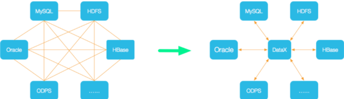

这是中介者模式 Mediator （调停者模式）

(中介者模式和门面facade模式有区别，中介者模式是内部组件的交互中介，而facade模式是外部访问系统的统一接口)

DataX的几个特点：

- 处理异构数据：不同结构的数据源
- 离线任务：是离线的
- 同步：不同数据的同步

https://github.com/alibaba/DataX

DataX已经更新到3.0

#### 框架设计

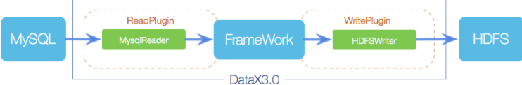

DataX采用**FrameWork + plugin**的设计，将数据源读取和写入抽象成为Reader/Writer插件，纳入整个同步框架中：

- Reader： Reader是数据读取/采集模块，负责采集数据源的数据，将数据发送给Framework
- Writer：数据写入模块，负责不断向Framework读数据，将数据写入到目标DB
- Framework：用于连接W、R，作为两者的数据传输通道，并处理缓冲、流控、并发、数据转换等核心技术问题。

#### DataX3.0插件体系

| 类型               | 数据源                          | Reader(读) | Writer(写) |
| :----------------- | :------------------------------ | :--------- | :--------- |
| RDBMS 关系型数据库 | MySQL                           | √          | √          |
|                    | Oracle                          | √          | √          |
|                    | SqlServer                       | √          | √          |
|                    | PostgreSQL                      | √          | √          |
|                    | 达梦                            | √          | √          |
|                    | 通用RDBMS(支持所有关系型数据库) | √          | √          |
| 阿里云数仓数据存储 | ODPS                            | √          | √          |
|                    | ADS                             |            | √          |
|                    | OSS                             | √          | √          |
|                    | OCS                             | √          | √          |
| NoSQL数据存储      | OTS                             | √          | √          |
|                    | Hbase0.94                       | √          | √          |
|                    | Hbase1.1                        | √          | √          |
|                    | MongoDB                         | √          | √          |
| 无结构化数据存储   | TxtFile                         | √          | √          |
|                    | FTP                             | √          | √          |
|                    | HDFS                            | √          | √          |

#### DataX3.0核心架构

DataX 3.0 开源版本支持单机多线程模式完成同步作业运行，本小节按一个DataX作业生命周期的时序图，从整体架构设计非常简要说明DataX各个模块相互关系

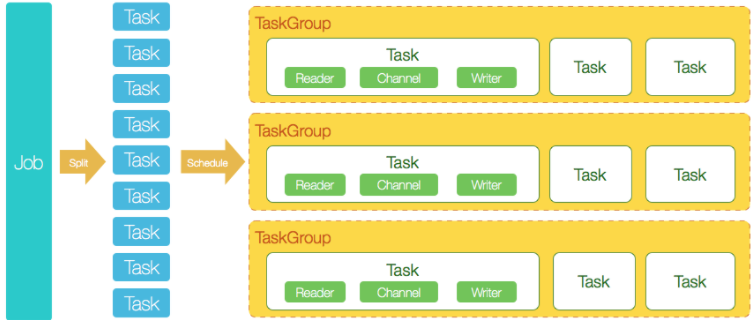

1. DataX完成单个数据同步的作业，我们称之为Job，DataX接受到一个Job之后，将启动一个进程来完成整个作业同步过程。DataX Job模块是单个作业的中枢管理节点，承担了数据清理、子任务切分(将单一作业计算转化为多个子Task)、TaskGroup管理等功能。
2. DataXJob启动后，会根据不同的源端切分策略，将Job切分成多个小的Task(子任务)，以便于并发执行。Task便是DataX作业的最小单元，每一个Task都会负责一部分数据的同步工作。
3. 切分多个Task之后，DataX Job会调用Scheduler模块，根据配置的并发数据量，将拆分成的Task重新组合，组装成TaskGroup(任务组)。每一个TaskGroup负责以一定的并发运行完毕分配好的所有Task，默认单个任务组的并发数量为5。
4. 每一个Task都由TaskGroup负责启动，Task启动后，会固定启动Reader—>Channel—>Writer的线程来完成任务同步工作。
5. DataX作业运行起来之后， Job监控并等待多个TaskGroup模块任务完成，等待所有TaskGroup任务完成后Job成功退出。否则，异常退出，进程退出值非0

举例来说，用户提交了一个DataX作业，并且配置了20个并发，目的是将一个100张分表的mysql数据同步到odps里面。 DataX的调度决策思路是：

1. DataXJob根据分库分表切分成了100个Task。
2. 根据20个并发，DataX计算共需要分配4个TaskGroup。
3. 4个TaskGroup平分切分好的100个Task，每一个TaskGroup负责以5个并发共计运行25个Task。

#### 优点

- 数据质量监控
- 数据转换
- 速度控制：控制速度，防止对原来的DB造成过大压力
- 同步性能
- 容错机制：
  - 线程内部重试
  - 线程级别重试


### Canal

https://github.com/alibaba/canal/wiki

#### 背景

早期，阿里巴巴B2B公司因为存在杭州和美国双机房部署，存在跨机房同步的业务需求。不过早期的数据库同步业务，主要是基于trigger的方式获取增量变更，不过从2010年开始，阿里系公司开始逐步的尝试基于数据库的日志解析，获取增量变更进行同步，由此衍生出了 **增量订阅&消费** 的业务，从此开启了一段新纪元

基于 日志增量订阅 & 消费支持 的业务:

- 数据库镜像
- 数据库实时备份
- 多级索引
- search build
- 业务cache刷新
- 价格变化等重要业务消息

Canal **基于数据库增量日志解析，提供增量数据订阅和消费**，目前主要支持MySQL

**canal [kə'næl]**，译意为水道/管道/沟渠，主要用途是基于 MySQL 数据库增量日志解析，提供增量数据订阅和消费

#### MySQL主备复制原理


复制分为三步：

- master将改变记录到binary log(这些记录叫做**二进制日志事件**，binary log events，可以通过 **show binlog events** 查看)
- slave将master的binary log events拷贝到中继日志(relay log)中
- slave重做中继日志中的事件，将改变反应到它自己的数据


#### 工作原理

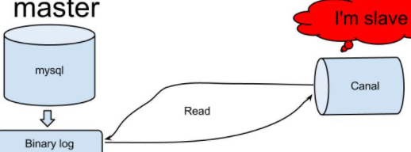

canal模拟MySQL slave交互协议，伪装成slave，想mysql master发送dump协议，master收到dump请求，开始推送binlog给slave，canal得到binlog流，解析得到binlog对象。

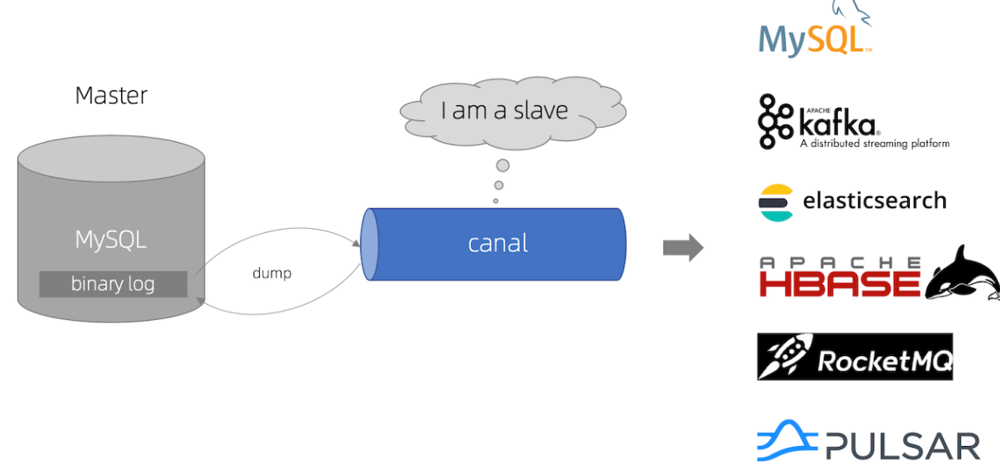


#### canal安装

```shell
# download
[root@master1 canal]#wget https://github.com/alibaba/canal/releases/download/v1.0.23/canal.deployer-1.0.23.tar.gz
[root@master1 canal]#mkdir /root/canal
[root@master1 canal]#tar zxvf canal.deployer-1.0.23.tar.gz  -C /root/canal

# create canan user of mysql
mysql> CREATE USER 'canal'@'localhost' IDENTIFIED BY 'canal';
Query OK, 0 rows affected (0.00 sec)
mysql> GRANT ALL PRIVILEGES ON *.* TO 'canal'@'localhost' WITH GRANT OPTION;
Query OK, 0 rows affected (0.01 sec)
mysql> CREATE USER 'canal'@'%' IDENTIFIED BY 'canal';
Query OK, 0 rows affected (0.00 sec)
mysql> GRANT ALL PRIVILEGES ON *.* TO 'canal'@'%' WITH GRANT OPTION;
Query OK, 0 rows affected (0.00 sec)
mysql> flush privileges;
Query OK, 0 rows affected (0.00 sec)

# 修改canal配置文件(如果是访问本机，并且用户密码都为canal则不需要修改配置文件)
[root@master1 canal]# vi /root/canal/conf/example/instance.properties
#################################################
## mysql serverId
canal.instance.mysql.slaveId = 1234
# position info
canal.instance.master.address = 127.0.0.1:3306
canal.instance.master.journal.name =
canal.instance.master.position =
canal.instance.master.timestamp =
#canal.instance.standby.address =
#canal.instance.standby.journal.name =
#canal.instance.standby.position =
#canal.instance.standby.timestamp =
# username/password
#修改这两项
canal.instance.dbUsername = canal
canal.instance.dbPassword = canal
canal.instance.defaultDatabaseName =
canal.instance.connectionCharset = UTF-8
# table regex
canal.instance.filter.regex = .*\\..*
# table black regex
canal.instance.filter.black.regex =
#################################################

# start canal
[root@master1 canal]# sh /root/canal/bin/startup.sh
# stop canal
[root@master1 canal]# sh /root/canal/bin/stop.sh

# log path:
[root@master1 canal]# cat /root/canal/logs/canal/canal.log
[root@master1 canal]# cat /root/canal/logs/example/example.log

```

#### canal 读取binlog

编写程序，访问cancel，读取库表的binlog


```xml
        <dependency>
            <groupId>com.alibaba.otter</groupId>
            <artifactId>canal.client</artifactId>
            <version>1.0.12</version>
        </dependency>
```

```java
package com.chainfin.canal;

import java.net.InetSocketAddress;
import java.util.List;

import com.alibaba.otter.canal.client.CanalConnector;
import com.alibaba.otter.canal.client.CanalConnectors;
import com.alibaba.otter.canal.protocol.CanalEntry.Column;
import com.alibaba.otter.canal.protocol.CanalEntry.Entry;
import com.alibaba.otter.canal.protocol.CanalEntry.EntryType;
import com.alibaba.otter.canal.protocol.CanalEntry.EventType;
import com.alibaba.otter.canal.protocol.CanalEntry.RowChange;
import com.alibaba.otter.canal.protocol.CanalEntry.RowData;
import com.alibaba.otter.canal.protocol.Message;

/**
 * 
 * @author jinxiaoxin
 *
 */
public class ClientSample {
    public static void main(String[] args) {
        // 创建链接
        CanalConnector connector = CanalConnectors.newSingleConnector(
                new InetSocketAddress("10.105.10.121", 11111), "example", "",
                "");// AddressUtils.getHostIp(),
        int batchSize = 1000;
        int emptyCount = 0;
        try {
            connector.connect();
            connector.subscribe("test\\..*");// .*代表database，..*代表table
            connector.rollback();//
            int totalEmptyCount = 120;
            while (emptyCount < totalEmptyCount) {
                Message message = connector.getWithoutAck(batchSize); // 获取指定数量的数据
                long batchId = message.getId();
                int size = message.getEntries().size();
                if (batchId == -1 || size == 0) {
                    emptyCount++;
                    // System.out.println("empty count : " + emptyCount);
                    try {
                        Thread.sleep(1000);
                    } catch (InterruptedException e) {
                    }
                } else {
                    emptyCount = 0;
                    // System.out.printf("message[batchId=%s,size=%s] \n",
                    // batchId, size);
                    printEntry(message.getEntries());
                }
                connector.ack(batchId); // 提交确认
                // connector.rollback(batchId); // 处理失败, 回滚数据
            }
            System.out.println("empty too many times, exit");
        } finally {
            connector.disconnect();
        }
    }

    private static void printEntry(List<Entry> entrys) {
        for (Entry entry : entrys) {
            if (entry.getEntryType() == EntryType.TRANSACTIONBEGIN
                    || entry.getEntryType() == EntryType.TRANSACTIONEND) {
                continue;
            }
            RowChange rowChage = null;
            try {
                rowChage = RowChange.parseFrom(entry.getStoreValue());
            } catch (Exception e) {
                throw new RuntimeException(
                        "ERROR ## parser of eromanga-event has an error,data:"
                                + entry.toString(), e);
            }
            EventType eventType = rowChage.getEventType();
            System.out.println(String.format("================> binlog[%s:%s] ,name[%s,%s] , eventType : %s",
                                    entry.getHeader().getLogfileName(), entry
                                            .getHeader().getLogfileOffset(),
                                    entry.getHeader().getSchemaName(), entry
                                            .getHeader().getTableName(),
                                    eventType));
            for (RowData rowData : rowChage.getRowDatasList()) {
                if (eventType == EventType.DELETE) {
                    printColumn(rowData.getBeforeColumnsList());
                } else if (eventType == EventType.INSERT) {
                    printColumn(rowData.getAfterColumnsList());
                } else {
                    System.out.println("-------> before");
                    printColumn(rowData.getBeforeColumnsList());
                    System.out.println("-------> after");
                    printColumn(rowData.getAfterColumnsList());
                }
            }
        }
    }

    private static void printColumn(List<Column> columns) {
        for (Column column : columns) {
            System.out.println(column.getName() + " : " + column.getValue()
                    + "    update=" + column.getUpdated());
        }
    }
}

```

canal集群...


