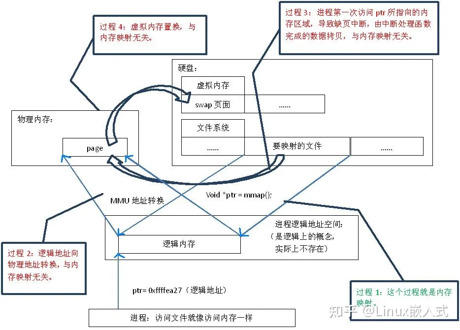
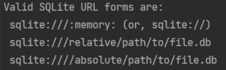

# DatabaseNotes


## LMDB

Lightning Memory-Mapped Database，就是非常快的内存映射型数据库，LMDB使用内存映射文件，可以提供更好的输入/输出性能，对于用于神经网络的大型数据集( 比如 [ImageNet](https://link.zhihu.com/?target=http%3A//image-net.org/) )，可以将其存储在 LMDB 中。

LMDB属于key-value数据库，而不是关系型数据库( 比如 MySQL )，LMDB提供 key-value 存储，其中每个键值对都是我们数据集中的一个样本。LMDB的主要作用是提供数据管理，可以将各种各样的原始数据转换为统一的key-value存储。

LMDB is a **Btree-based** database management library modeled loosely on the BerkeleyDB API, but much simplified. The entire database is exposed in a memory map, and all data fetches return data directly from the mapped memory, so no malloc's or memcpy's occur during data fetches. As such, the library is extremely simple because it requires no page caching layer of its own, and it is extremely high performance and memory-efficient. It is also fully transactional with full ACID semantics, and when the memory map is read-only, the database integrity cannot be corrupted by stray pointer writes from application code.

- 基于B树
- 内存映射：IO开销小、读写快，高效快速
- KV


### 内存映射(Memory Map)





首先，“映射”这个词，就和数学课上说的“一一映射”是一个意思，就是建立一种一一对应关系，在这里主要是只 硬盘上文件 的位置与进程 逻辑地址空间 中一块大小相同的区域之间的一一对应，如图1中过程1所示。这种对应关系纯属是逻辑上的概念，物理上是不存在的，原因是进程的逻辑地址空间本身就是不存在的。在内存映射的过程中，并没有实际的数据拷贝，文件没有被载入内存，只是逻辑上被放入了内存，具体到代码，就是建立并初始化了相关的数据结构（struct address_space），这个过程有系统调用mmap()实现，所以建立内存映射的效率很高

内存映射文件的作用是使一个磁盘文件与存储空间中的一个缓冲区建立映射关系，然后当从缓冲区中取数据，就相当于读文件中的相应字节；而将数据存入缓冲区，就相当于写文件中的相应字节。这样就可以不使用read和write直接执行I/O了。

为了使用这个功能，应首先告诉内核将一个给定的文件映射到一个存储区域中。可以使用mmap来实现：

```c
#include <sys/mman.h>
void *mmap(void *start, size_t length, int prot, int flags, int fd, off_t offset);
```


## 内存数据库

H2

HSQLDB

apache derby

sqlite


### SQLite

```xml
<dependency>
    <groupId>org.xerial</groupId>
    <artifactId>sqlite-jdbc</artifactId>
    <version>3.16.1</version>
</dependency>
```

配置文件如下：

```plaintext
driverClassName=org.sqlite.JDBC
url=jdbc:sqlite:memory:myDb
username=sa
password=sa
```


sqlite有两种存储模式：

- filesystem：jdbc:sqlite:D:\tmp\sqlite.db
- memory：

```
    <bean id="h2DataSource" class="org.apache.tomcat.jdbc.pool.DataSource">
        <property name="driverClassName" value="org.sqlite.JDBC"/>
        <property name="url" value="jdbc:sqlite:memory:cfodsservicedb"/>
        <property name="username" value=""/>
        <property name="password" value=""/>
    </bean>
```


sqlite虽然名字为内存数据库，但是filesystem模式就是文件数据库，还是基于磁盘

它并不是为内存数据库应用而设计的，本质还是文件数据库

内存模式只是将数据库存储文件放入内存空间，但并不考虑最有效管理你的内存空间，其它临时文件也要使用内存，事务回滚日志一样要生成，只是使用了内存空间。它的作用应该偏向于临时性的用途。


**SQLite更适合取代本地的文件存储。SQLite也适合给每天几十万点击量的网站提供数据支持。**

SQLite 致力于为单个应用程序和设备提供本地数据存储。强调经济性、效率、可靠性、独立性和简单性

SQLite竞争对手不是client/server数据库，而是本地的文件存储 fopen()。


**SQLite，是一款轻型的数据库，是遵守ACID的关系型数据库管理系统，它包含在一个相对小的C库中**


- 支持ACID事务
- 零配置 – 无需安装和管理配置
- 储存在单一磁盘文件中的一个完整的数据库
- 数据库文件可以在不同字节顺序的机器间自由的共享
- 支持数据库大小至2TB
- 足够小, 大致13万行C代码, 4.43M
- 比一些流行的数据库在大部分普通数据库操作要快
- 简单, 轻松的API
- 包含TCL绑定, 同时通过Wrapper支持其他语言的绑定
- 良好注释的源代码, 并且有着90%以上的测试覆盖率
- 独立: 没有额外依赖
- 源码完全的开源, 你可以用于任何用途, 包括出售它
- 支持多种开发语言，C, C++, PHP, Perl, Java, C#,Python, Ruby等


**数据类型**

Sqlite是一个动态类型系统，sqlite中，值的数据类型跟值本身相关，而不是与它的容器相关。Sqlite的动态类型系统和其他数据库的更为一般的静态类型系统相兼容，但同时，sqlite中的动态类型允许它能做到一些传统刚性类型数据库所不可能做到的事。为了使sqlite和其他数据库间的兼容性最大化，sqlite支持列上“类型亲缘性”的观点，列的类型近似指的是存储在列上数据的推荐类型。这里必须记住一点，这个类型是被推荐，而不是必须的。任何列仍然能存储任意类型的数据。只是一些列，给予选择的话，将会相比于其他的一些类型优选选择一些存储类型，这个列优先选择的存储类型被称为它的“近似”。

决定字段亲缘性的规则，字段的亲缘性是根据该字段在声明时被定义的类型来决定的，具体的规则可以参照以下列表。需要注意的是以下列表的顺序，即如果某一字段类型同时符合两种亲缘性，那么排在前面的规则将先产生作用。

- 如果类型字符串中包含"INT"，那么该字段的亲缘类型是INTEGER。
- 如果类型字符串中包含"CHAR"、"CLOB"或"TEXT"，那么该字段的亲缘类型是TEXT，如VARCHAR。
- 如果类型字符串中包含"BLOB"，那么该字段的亲缘类型是NONE。
- 如果类型字符串中包含"REAL"、"FLOA"或"DOUB"，那么该字段的亲缘类型是REAL。
- 其余情况下，字段的亲缘类型为NUMERIC

| 数据类型                                                     | 亲缘类型 | 应用规则 |
| ------------------------------------------------------------ | -------- | -------- |
| INTINTEGERTINYINTSMALLINTMEDIUMINTBIGINTUNSIGNED BIG INTINT2INT8 | INTEGER  | 1        |
| CHARACTER(20)VARCHAR(255)VARYING CHARACTER(255)NCHAR(55)NATIVE CHARACTER(70)NVARCHAR(100)TEXTCLOB | TEXT     | 2        |
| BLOBno datatype specified                                    | NONE     | 3        |
| REALDOUBLEDOUBLE PRECISIONFLOAT                              | REAL     | 4        |
| NUMERICDECIMAL(10,5)BOOLEANDATEDATETIME                      | NUMERI   | 5        |

SQLite 没有单独的 Boolean 存储类。相反，布尔值被存储为整数 0（false）和 1（true）

SQLite 没有一个单独的用于存储日期和/或时间的存储类，但 SQLite 能够把日期和时间存储为 TEXT、REAL 或 INTEGER 值。


**综合情况对比H2 database兼容的数据库更多并且支持服务器模式，SQLite的性能要好于H2，但并发性不如，另外SQLite一般使用C的API接口访问，而H2支持JDBC。并且都可以大多数主流平台上，对于C\C++\C#应用而言，使用SQLite是更好的选择。对于Java应用，H2是不错的选择。**


三种驱动：

SQLite Wrapper by Christian

http://www.ch-werner.de/javasqlite/

这个驱动其实是在本地C/C++的SQLite上用JDBC实现进行了包装。大小100+K。

优点：体积小；速度快

缺点：依赖本地SQLite驱动

 

SQLite Zentus Driver

http://www.zentus.com/sqlitejdbc/

这个驱动是SQLite数据库的纯Java实现，仅需要这个驱动就可以操作SQLite数据库文件。大小2.6M。

优点：无其他依赖

缺点：速度稍慢（纯Java实现）

 

SQLite Xerial Driver

http://www.xerial.org/trac/Xerial/wiki/SQLiteJDBC

这个驱动扩展了Zentus版本，**并且在jar中加入了Windows、Linux、Mac OS X三种本地SQLite驱动库**，使四种驱动并存于jar包中。其目的在于在不同的操作系统中自动使用不同的本地驱动（在这三种以外的系统中则使用纯Java实现的驱动），既保证无其他依赖，又保证速度最快。但是因为包含这么多版本的驱动，所以就比较大，大小有3M。

优点：速度快；无其他依赖

缺点：体积大


内存模式：

:memory:

在创建内存数据库时，只能用文件名":memory:"


**它并不是为内存数据库应用而设计的，本质还是文件数据库**。它的数据库存储文件有将近一半的空间是空置的，这是它的B树存储决定的，（2020 勘误：对于固定长度记录，页面使用率最大化，对于非自增计数键的索引，页面一般会保留20～60％的空间，方便插入）请参看[上一篇SQLite存储格式](http://www.cnblogs.com/bbqzsl/p/5943586.html)。**内存模式只是将数据库存储文件放入内存空间**，**<u>但并不考虑最有效管理你的内存空间</u>**，其它临时文件也要使用内存，事务回滚日志一样要生成，只是使用了内存空间。它的作用应该偏向于临时性的用途。


连接方式：




### H2

H2是一个使用 Java 编写的数据库，有内嵌式和服务两种运行模式。

内嵌式： 主要有两种
内存模式：不会落地持久化，关闭连接后数据就清空；"jdbc:h2:mem:MyDb"
文件模式：将数据持久化到文件中；jdbc:h2:file:./Mydb（保存到当前目录下的Mydb.mv.db中）

H2是一个用Java开发的嵌入式数据库，它本身只是一个类库，可以直接嵌入到应用项目中


- 纯Java编写，不受平台的限制；
- 只有一个jar文件，适合作为嵌入式数据库使用；
- h2提供了一个十分方便的web控制台用于操作和管理数据库内容；
- 功能完整，支持标准SQL和JDBC。麻雀虽小五脏俱全；
- 支持内嵌模式、服务器模式和集群。
- 支持全文检索，提供了内置全文检索和使用 Apache Luncene 的全文索引
- 支持磁盘和内存数据库，支持只读数据库，支持临时表
- 支持事务（读提交和序列化事务隔离），支持2阶段提交
- 支持多连接，支持表级锁
- 使用基于成本的优化机制，对于复杂查询使用零遗传算法进行管理
- 支持可滑动可更新的结果集，支持大型结果集、支持结果集排序，支持方法返回结果集
- 支持数据库加密(使用AES或XTEA进行加密)，支持SHA-256密码加密，提供加密函数，支持SSL

场景：

- H2最大的用途在于可以同应用程序打包在一起发布，这样可以非常方便地存储少量结构化数据。
- 它的另一个用途是用于单元测试。启动速度快，而且可以关闭持久化功能，每一个用例执行完随即还原到初始状态。
- **<u>H2的第三个用处是作为缓存，作为NoSQL的一个补充。当某些场景下数据模型必须为关系型，可以拿它当Memcached使，作为后端MySQL/Oracle的一个缓冲层，缓存一些不经常变化但需要频繁访问的数据，比如字典表、权限表。不过这样系统架构就会比较复杂了。</u>**
- 另外由于 H2 文件体积非常小，安装、启动非常简单，且支持全文检索等高级特性，因此在一些简单场景下使用 H2 也能够快速建立起应用。

| 整数（INT）布尔型（BOOLEAN）微整数（TINYINT）小整数（SMALLINT）大整数（BIGINT）标识符（IDENTITY）货币数（DECIMAL） | 双精度实数（DOUBLE）实数（REAL）时间（TIME）日期（DATE）时间戳（TIMESTAMP）二进制（BINARY）其他类型（OTHER） | 可变字符串（VARCHAR）不区分大小写可变字符串（VARCHAR_IGNORECASE）字符（CHAR）二进制大对象（BLOB）文本大对象（CLOB）通用唯一标识符（UUID）数组（ARRAY） |
| ------------------------------------------------------------ | ------------------------------------------------------------ | ------------------------------------------------------------ |
|                                                              |                                                              |                                                              |

**运行模式**

- 内嵌模式（Embedded Mode）：内嵌模式下，应用和数据库同在一个JVM中，通过JDBC进行连接。可持久化，但同时只能一个客户端连接。内嵌模式性能会比较好。如果使用H2数据库的内存模式，那么我们创建的数据库和表都只是保存在内存中，一旦服务器重启，那么内存中的数据库和表就不存在了。
- 服务器模式（Server Mode）：使用服务器模式和内嵌模式一样，只不过它可以跑在另一个进程里。
- 混合模式：第一个应用以内嵌模式启动它，对于后面的应用来说它是服务器模式跑着的。混合模式是内嵌模式和服务器模式的组合。第一个应用通过内嵌模式与数据库建立连接，同时也作为一个服务器启动，于是另外的应用（运行在不同的进程或是虚拟机上）可以同时访问同样的数据。第一个应用的本地连接与嵌入式模式的连接性能一样的快，而其它连接理论上会略慢。


jdbc:h2:file:~/.h2/DBName;AUTO_SERVER=TRUE

```java
DB_CLOSE_DELAY：要求最后一个正在连接的连接断开后，不要关闭数据库
MODE=MySQL：兼容模式，H2兼容多种数据库，该值可以为：DB2、Derby、HSQLDB、MSSQLServer、MySQL、Oracle、PostgreSQL
AUTO_RECONNECT=TRUE：连接丢失后自动重新连接
AUTO_SERVER=TRUE：启动自动混合模式，允许开启多个连接，该参数不支持在内存中运行模式
TRACE_LEVEL_SYSTEM_OUT、TRACE_LEVEL_FILE：输出跟踪日志到控制台或文件， 取值0为OFF，1为ERROR（默认值），2为INFO，3为DEBUG
SET TRACE_MAX_FILE_SIZE mb：设置跟踪日志文件的大小，默认为16M
```


## 


