# Elastic Search Notes


## Official Docs

https://learnku.com/docs/elasticsearch73/7.3/data-in-documents-and-indices/6446

### 简介

ES是分布式文档存储中间件

不会将信息存储为列信息，而是存储已经虚拟化为JSON文档的复杂数据结构

文档被存储时，会建立索引，并且近乎实时被搜索

ES使用的数据结构：倒排索引， 支持快速全文搜索

在倒排索引中列出了所有文档中出现的每一个唯一单词并分别标识了每一个单词在哪一个文档中。

索引是文档的优化集合，每个文档索引都是字段的集合，这些字段包含了数据的减值对，ES为每一个字段中的所有数据建立倒排索引，每个索引字段都有专门的优化数据结构，如文本字段在倒排索引中，数值和地理字段存储在BKD树中。

ES会自动检测数据类型，并映射到相应的数据类型中。当然也可以自定义动态映射规则Mapping


## MyNotes

### Api

```bash
# 查看所有index：_cat/indices?v
http://cf-data-dr-ods-service-application-es-service.es.k8s.cloud.qa.nt.ctripcorp.com/_cat/indices?v

# 查看某索引下存的信息，查询的信息为索引结构信息
http://cf-data-dr-ods-service-application-es-service.es.k8s.cloud.qa.nt.ctripcorp.com/hive_metadata?pretty

/_search           查询集群上所有的索引
/index1/_search    查询索引1
/index1,index2/_search    查询索引2
/index*/_search     查询index开头的索引

"http://localhost:9200/index/_search?q=firstname:aganliang"
 

```


https://blog.csdn.net/weixin_43990804/article/details/111934190?ops_request_misc=%257B%2522request%255Fid%2522%253A%2522165462335516781685339439%2522%252C%2522scm%2522%253A%252220140713.130102334..%2522%257D&request_id=165462335516781685339439&biz_id=0&utm_medium=distribute.pc_search_result.none-task-blog-2~all~sobaiduend~default-3-111934190-null-null.142^v11^pc_search_result_control_group,157^v13^new_style1&utm_term=es+api&spm=1018.2226.3001.4187

### **settings和mappings**

　settings是修改分片和副本数的。

　mappings是修改字段和类型的。

**Mapping**,就是对索引库中索引的字段名称及其数据类型进行定义，**类似于mysql中的表结构信息**。不过es的mapping比数据库灵活很多，它可以动态识别字段。一般不需要指定mapping都可以，因为es会自动根据数据格式识别它的类型，**如果你**需要对某些字段添加特殊属性（如：定义使用其它分词器、是否分词、是否存储等），**就必须手动添加mapping**。

我们在es中添加索引数据时不需要指定数据类型，es中有自动影射机制，字符串映射为string，数字映射为long。通过mappings可以指定数据类型是否存储等属性。


## Notes From Videos

https://www.bilibili.com/video/BV1hh411D7sb?from=search&seid=9458704020050646099&spm_id_from=333.337.0.0


非结构化数据：维度广，数据量大

### 概述

#### ES

ES是一个分布式的，Rest风格的搜索和数据分析引擎。

即：开源的 高扩展的 分布式 全文搜索引擎

ES 是 Elastic Stack技术栈的核心

可以近乎实时存储、检索数据

扩展性好，可以扩展到上百台服务器，处理PB级别的数据

#### 全文搜索引擎

传统RMDBS对全文检索支持很差，原因：

- 全表遍历
- 索引维护
- upsert索引更新

#### ES和Solr

Lucene 是Apache 基金会的一个子项目，提供一个简单却强大的API，能够做全文索引和搜索，在java中Lucene是一个成熟的免费开源的工具。

不过Lucene知识一个提供全文搜索功能的工具包和类库，还需要搜索引擎软件/应用服务框架，主流有两款：

- ES
- Solr

都是基于Lucene的，开源独立部署启动

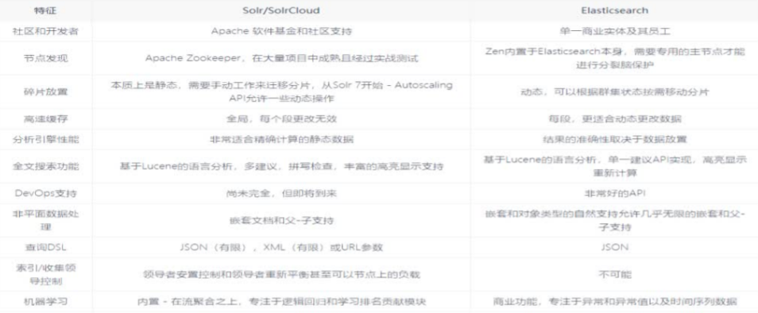


ES吸引力更强，易于安装，轻巧

ES在开源日志管理中使用广泛

ES更适合监控和指标


#### ES的使用

GitHub-放弃了Solr：使用ES搜索20TB数据

wiki

百度

ali

### ES 入门

#### install

https://www.elastic.co/cn/

下载解压

- bin 
- config
- jdk: 内置jdk目录
- lib 类库
- logs
- modules
- plugin 插件

./bin/elasticsearch.sh启动

9300：ES集群间组件的通信端口

9200：浏览器访问端口


ES是使用java开发的，7.8版本需要JDK7.8以上，默认安装带有jdk环境，如果系统配置了JAVA_HOME，使用系统默认的jdk

启动不了，可能是空间不足，修改 config/jvm.options 配置jvm参数 Xmx Xms

#### 数据格式

ES是**面向文档型数据库**

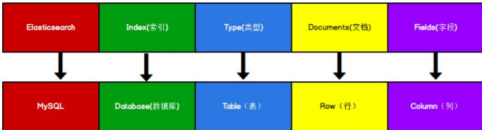

ES中，index可以看做库，Types则相当于表，Documents则相当于表的行。

ES6中一个index只能包含一个type

ES7中type的概念已经被删除了

### REST API

#### 创建索引

对比关系型数据库，创建索引就是创建数据库

http://127.0.0.1/myindex 就是创建索引，名字为myindex

注意不能重复创建

#### 查看所有

不同版本的REST API有所差别，需要具体去看

#### 映射

有了index库，就相当于有了database

接下来需要建立索引库中的映射，类似与database中的表结构table

创建表需要设置字段名称类型长度约束等，索引库也是一样的，这是映射

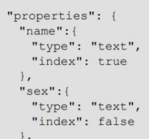

映射数据说明：

- 字段名

- type： 类型

- index：是否索引，默认true 

  - true：字段设置为索引，可以用来搜索
  - false，字段非索引

- store：是否将数据进行独立存储，默认为false，

  

ES支持的类型：

- **String 分两种**
  - **text 可分词**
  - **keyword 不可分词，数据库会作为完整的字段进行匹配**
- **Numerical 数值类型，两类**
  - **基本数据类型：long,interger,short,byte,double,float,half_float**
  - **浮点数的高精度类型：scaled_float**
- **Date 日期**
- **Array 数组**
- **Object 对象**

### JAVA API

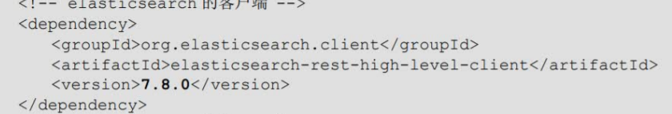

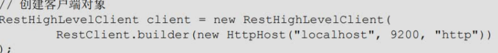

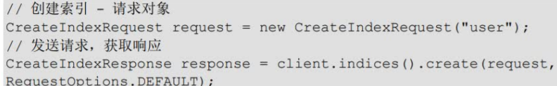

GetIndexRequest

DeleteIndexRequest

IndexRequest

UpdateRequest

GetRequest

SearchRequest

### ES 环境

单机与集群，PROD都是集群，以实现高可用

ES Cluster

ES集群中，所有节点共同拥有整个数据，并一起提供索引和搜索功能。

一个ES集群有一个unique的名字，默认是elasticsearch，一个节点只能通过这个特定的名字来加入集群。

一个节点也有一个名字，默认情况下，这个节点的名字是随机的Manvel漫画角色的名字。

一个节点在启动时，会加入配置的集群(根据集群名字)


集群部署：

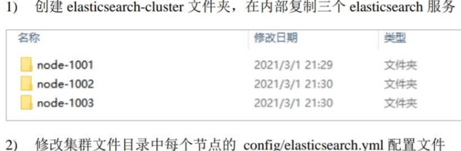

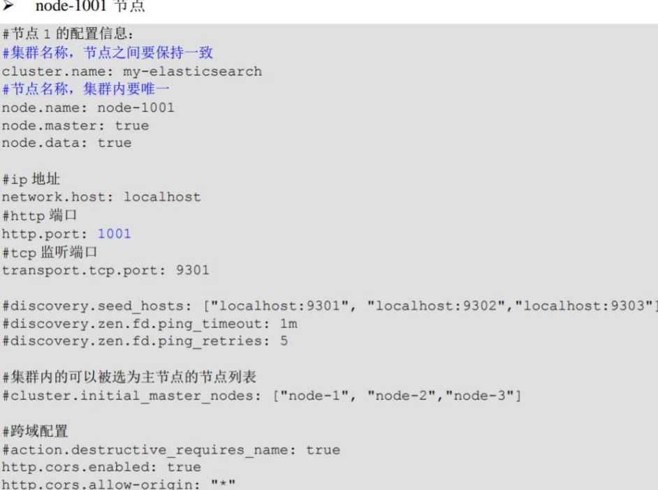

删除每个节点下data目录

分布启动

启动后每个节点自动加入集群

### ES进阶

#### index

一个索引就是一个拥有相似特征的文档的集合。

一个索引由一个名字来标识，注意必须全部是小写字母

对索引进行增删查改都会用到这个名字

ES索引的精髓：一切设计都是为了提高搜索的性能

Type

同一个索引中，可以定义多种类型(v<=5)

一个类型是索引的一个**逻辑上的 分类/分区**

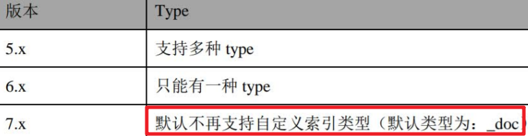

#### Document

一个文档是一个可以被索引的基础信息单元，也就是一条数据

JSON格式

在一个index/type中，可以存储任意多的文档

#### 字段Field

文档的属性字段

#### 映射Mapping

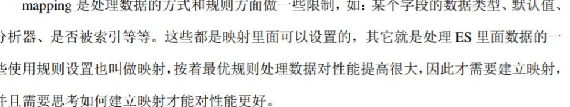

#### 分片Shards

ES数据会被分成很多份，分在多个节点存储——分片，分片的作用：

- 允许你水平分割，扩展内容容量
- 允许在分片上进行分布式的并行的操作，提高性能和吞吐量

创建索引的时候可以指定分片数量

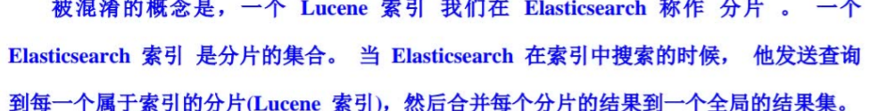

#### 副本 Replicas

ES可以创建分片的一份或多份拷贝

副本的意义：

- 高可用，防止数据丢失
- 扩展搜索性能/吞吐量，因为搜索可以在所有的副本上并行进行

副本的数量可以在创建索引的时候指定，也可以在后期更改

注意**分片不能修改**

有副本后每个分片分为主分片和副分片

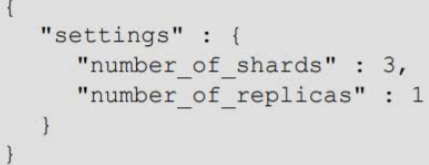


### 系统架构

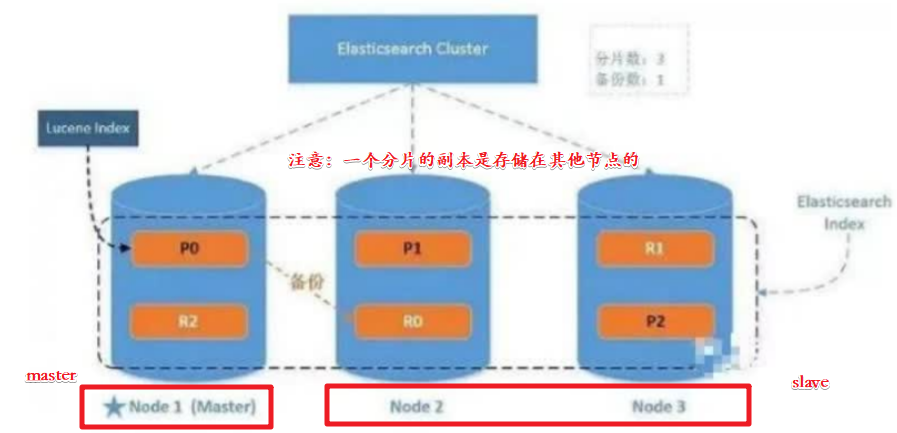

集群中有一个主节点

它负责管理集群范围内的所有变更，例如增加、删除索引、删除增加节点

主节点不会涉及文档级别的变更和搜素，所有主节点不会是瓶颈

请求可以发送到任何节点，包括主节点，每个节点都知道任何文档所处的位置，并且能够将我们的请求直接转发到存储我们所需文档的节点。

#### 分布式集群

#### 路由计算


根据上述公式计算一个文档被存储的分片

#### 写流程

新建、索引、删除、请求都是写操作，必须在主分片上面完成后才能被复制到相关的副本

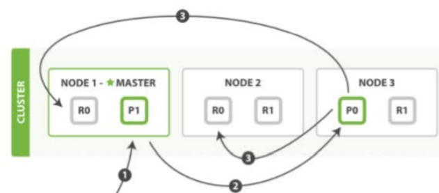

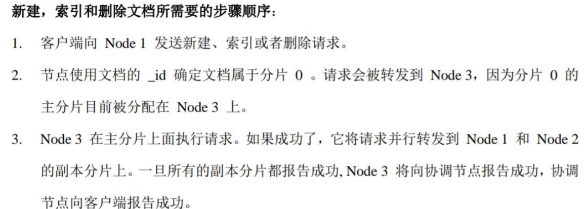

#### 读流程

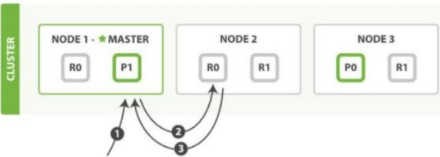

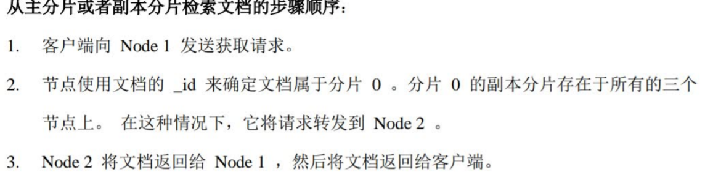

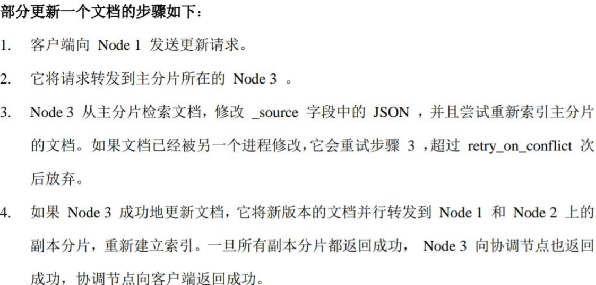


### 分片原理

#### 倒排索引

- 正向索引 forward index

  将搜索的内容都对应一个ID，形成KV对，通过ID查询内容
  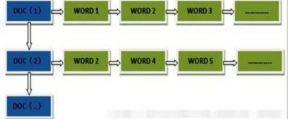

  不过对于大量数据，难以满足实时性要求，因为K会过于多，

- 反向索引 inverted index 即倒排索引

  将搜索的关键词映射到文件ID，每个关键词都对应一系列的文件

  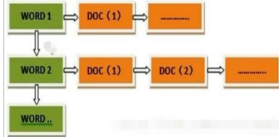

  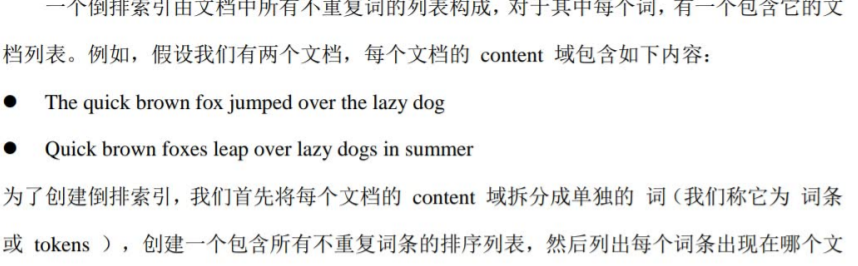

  我们如果想搜索对应的文档，只需要去对应的文档中查找

倒排索引的关键字形成过程中，必须要进行分词和标准化

#### 文档搜索

早期的全文索引会为整个文档建立一个很大的倒排索引，并写入磁盘

一旦新的索引就绪，旧的就会被替换，类似COW

不变性的好处：

- 不需要锁
- 性能提升

#### 动态更新索引

如何在不变性的前提下实现 倒排index 的更新？

-- 用更多的索引

通过增加新的补充索引 来 反映就近的修改，而不是直接重写整个倒排index，每一个倒排都会被查询到，从最早的开始查询完后再对结果进行合并


后面再看吧

主要是原理


