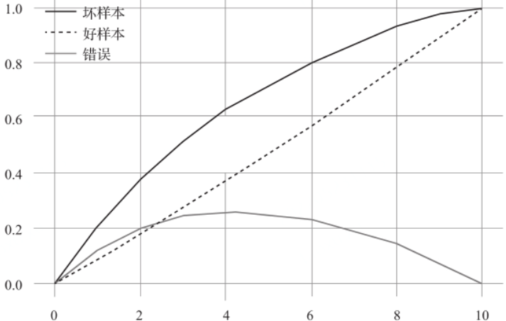

# 金融风控学习笔记

## 基础概念

### 金融风控

#### 金融风控

什么是风控？ ——风控其实是包含风险管理和风险控制


什么是风控模型？

  ——从借贷的角度来看，平台要评估借贷者的**个人征信和还款能力**从而保证投资者的收益

  ——从投资者的角度，要保证平台的资金安全，从而保证自己的投资或者本金获得合理的收益和保护

  ——从资金的角度来看，风控模型是为了评估用户**还款能力和还款意愿**，**反欺诈反作弊**，防止用户薅羊毛和保证平台安全等功能

  ——从行业的角度，互联网风控模型体现在消费金融/供应链金融/信用借贷/P2P/大数据征信/被调行业 等方面


什么是风控评分？

  ——狭义的风控评分（线上贷款），分为三个阶段，它通过用户提交的数据，对用户的资质进行审核，最终得到一个评分卡的分数


**金融的核心是风控，**

**风控的核心是评分+规则，**

**评分的依据是数据，规则的依据是实践，**

**所以说，优秀的风控除了掌握必备的业务技能，对数据的敏感度，以及实战经验更是尤为重要**


#### OOT

一般情况下，样本分三部分。训练集，验证集，测试集。

OOT 是验时间窗的验证样本，与训练集，测试集无交集。上线前的话可以先留出一部分作为OOT样本作为上线前的验证。

**OOT**（OUT OF TIME）时间外数据，训练风控模型都是需要定表现期，观察期的；使用观察期内的数据进行建模；拿OOT只是为了验证模型是否好坏，以及是否稳定；

**关于不用测试集：**

之前有跟同事讨论过，建模的时候需要用到训练集、测试集、OOT；那么能不能把测试集去掉，直接使用OOT来进行验证；

结论是最好还是要测试集，原因如下：为了防止训练出来的模型过拟合，我们在训练完之后会用测试集的数据进行验证，然后可以根据在测试集上面的表现，对模型进行优化调参；而OOT只是单纯的验证模型在未来的时间内的表现，如果利用OOT来进行调参的话，那么就会涉及到数据泄露的问题；


### 评分卡模型

#### 基本概念

#### 观察期、观察点、表现期

https://maimai.cn/article/detail?fid=1498556938&efid=J8-R_zBv4PwCmHBfpnEf9Q

观察期： 代表的是决策时已知的信息，位于时间轴左侧，主要是用来生成用户特征的时间区间，即用来确定X变量 ；观察期的长短因模型和管理需要而异，如申请评分模型一般在6个月以上，行为评分模型的观察期一般在12 ~ 24个月。

观察点： 不是一个具体的时间点，而是一个时间段，表示的是客户申请贷款的时间，用来搜集那些用来建模的客户样本 ，在该时间段申请的客户会是我们用来建模的样本。

> a.观察点的设计：
>
> 观察点的设计有额外的讲究，其中涉及到一个Mob的概念。
>
> 所谓Mob，全称month on book，等于观察点减去贷款发放时间。
>
> 观察点的设计在于贷款发放时间往后推Mob期，Mob的长短关系到模型的观察期以及观察期生成的时间切片变量。
>
> b.观察期过长或过短的影响：
>
> \- 一个过长的观察期，可能会导致客户不在你的mob内，大批样本无法进入模型
>
> \- 一个过短的观察期，则会导致样本无法生成足够多有效的时间切片变量
>
> c.时间切片变量：
>
> \- 时间区段的行为变量，例如过去3个月平均消费金额、过去6个月消费平均次数等
>
>   2、违约和不确定的定义、确定评分范围、样本分组
>
> 变量选择，通过统计学的方法，筛选出对违约状态影响最显著的指标。

表现期： 用来**定义用户是否好坏的时间区段**，即**用来确定<u>Y标签</u>**，其代表的是**决策时未知的但对决策效果非常重要而需要预测的信息**；表现期的长短因模型和管理需要而异，如申请评分模型一般在12 ~ 18个月，行为评分模型的观察期一般在6 ~ 12个月。一般最常用的是定义为坏样本的指标有：**M3+逾期**、M3以内逾期中定义为失联、欺诈、身份盗用等情况，这些需要看自身业务情况而定。


对于开发信用评分模型来说，首先需要明确用哪些数据来建模，以及好坏客户的定义。因此需要明确观察期与表现期的概念


观察期： 代表的是决策时已知的信息，位于时间轴左侧，主要是用来生成用户特征的时间区间，即用来确定X变量 ；观察期的长短因模型和管理需要而异，如申请评分模型一般在6个月以上，行为评分模型的观察期一般在12 ~ 24个月。
观察点： 不是一个具体的时间点，而是一个时间段，表示的是客户申请贷款的时间，用来搜集那些用来建模的客户样本 ，在该时间段申请的客户会是我们用来建模的样本。
表现期： 用来定义用户是否好坏的时间区段，即用来确定Y标签，其代表的是决策时未知的但对决策效果非常重要而需要预测的信息；表现期的长短因模型和管理需要而异，如申请评分模型一般在12 ~ 18个月，行为评分模型的观察期一般在6 ~ 12个月。

表现期是对观察点上账户/客户表现进行监控的时间周期。这些账户根据截止到表现点的表现被分类成“好”和“坏”。表现期需要有足够的长度，不能够太短，从而保证样本群体分类的稳定性，使账户/客户的行为充分表现出来。但也不能够过于长，即使可获得很长时间的历史数据，还需要在完整性和数据质量之间保持平衡。


表现点

截止到此时间点账户被分类成好账户和坏账户。

**阶段总结，表现期和表现点是定义y变量的时期。**


#### y定义

目标定义看似简单，其实在建模的过程中担当着非常重要的角色。有时候模型效果不理想，很大一部分原因是目标定的不合理。

何为目标（即所谓的y值），在风控模型的门类中一般就是指某个客户或账户是否逾期（通常以0，1）来区分。我们在建立风险模型的时候，不能简单地将逾期客户定为1，未逾期客户定义为0。这需要结合时间点、逾期程度来判断。


风控模型定义y变量的时候，要保证表现期足够，业务不同表现期定义也不同。以信用卡业务为例，一般表现期为一年或一年半。**<u>风险表现一般都是滞后的</u>**，不经过足够的时间是看不出来的。

其次，坏客户的逾期程度也需要有定义。目的就是让坏人彻底坏，好人真的好。如果坏人不够坏，比如定义逾期1天以上就算坏人的话，是跟好人区分不开的。因为很多人可能是忘记还款了，提醒一下就会还款。


我们设置的好坏客户定义可以这样，如下例：

坏：表现期内发生逾期60天及以上的逾期客户

好：表现期内未发生逾期的客户


#### A卡流程

逾期期数(M) ：指实际还款日与应还款日之间的逾期天数，并按区间划分后的逾期状态。M取自Month on Book的第一个单词。（注：不同机构所定义的区间划分可能存在差异） M0：当前未逾期（或用C表示，取自Current） M1：逾期1-30日 M2：逾期31-60日 M3：逾期61-90日 M4：逾期91-120日 M5：逾期121-150日 M6：逾期151-180日 M7+：逾期180日以上

观察点：样本层面的时间窗口。 用于构建样本集的时间点（如2010年10月申请贷款的用户），不同环节定义不同，比较抽象，这里举例说明：如果是申请模型，观察点定义为用户申贷时间，取19年1-12月所有的申贷订单作为构建样本集；如果是贷中行为模型，观察点定义为某个具体日期，如取19年6月15日在贷、没有发生逾期的申贷订单构建样本集。

观察期：特征层面的时间窗口。构造特征的相对时间窗口，例如用户申请贷款订前12个月内（2009年10月截至到2010年10月申请贷款前的数据都可以用， 可以有用户平均消费金额、次数、贷款次数等数据特征）。设定观察期是为了每个样本的特征对齐，长度一般根据数据决定。一个需要注意的点是，只能用此次*申请前*的特征数据，不然就会数据泄露（时间穿越，用未来预测过去的现象）。

表现期：标签层面的时间窗口。定义好坏标签Y的时间窗口，信贷风险具有天然的滞后性，因为用户借款后一个月（第一期）才开始还钱，有得可能还了好几期才发生逾期。

http://www.17bigdata.com/%E4%B8%80%E6%96%87%E6%A2%B3%E7%90%86%E9%87%91%E8%9E%8D%E9%A3%8E%E6%8E%A7%E5%BB%BA%E6%A8%A1%E5%85%A8%E6%B5%81%E7%A8%8Bpython/


**确定建模的样本量及标签，也就是模型从多少的数据样本中学习如何分辨其中的好、坏标签样本。如果样本量稀少、标签定义有问题，那学习的结果可想而知也会是差的。**


根据巴塞尔协议的指导，一般逾期超过90天（M4+）的客户，即定义为坏客户。更为通用的，可以使用“滚动率”分析方法（Roll Rate Analysis）确定多少天算是“坏”，基本方法是统计分析出逾期M期的客户多大概率会逾期M+1期（同样的，我们不太可能等着所有客户都逾期一年才最终确定他就是坏客户。一来时间成本太高，二来这数据样本会少的可怜）。如下示例，我们通过滚动率分析各期逾期的变坏概率。当前未逾期（M0）下个月保持未逾期的概率99.71%；当前逾期M1，下个月继续逾期概率为54.34%；当前M2下个月继续逾期概率就高达*90.04%*。我们可以看出M2是个比较明显的变坏拐点，可以以M2+作为坏样本的定义。


【表现期】借贷申请的时间点（即：观察点）之后要在多久的时间暴露表现下，才能比较彻底的确定客户是否逾期。比如：借贷后观察了一个客户借贷后60天的那几个分期的表现都是按时还款，就可以判断他是好/坏客户？

这也就是确定表现期，常用的分析方法是Vintage分析（Vintage在信贷领域不仅可以用它来评估客户好坏充分暴露所需的时间，即成熟期，还可以用它分析不同时期风控策略的差异等），通过分析历史累计坏用户暴露增加的趋势，来确定至少要多少期可以比较全面的暴露出大部分的坏客户。如下示例的坏定义是M4+，我们可以看出各期的M4+坏客户经过9或者10个月左右的表现，基本上可以都暴露出来，后面坏客户的总量就比较平稳了。这里我们就可以将表现期定位9或者10个月~


确定了坏的定义以及需要的表现期，我们就可以确定样本的标签，最终划定的建模样本：

- 好用户：表现期（如9个月）内无逾期的用户样本。
- 坏用户：表现期（如9个月）内逾期（如M2+）的用户样本。
- 灰用户：表现期内有过逾期行为，但不到坏定义（如M2+）的样本。注：实践中经常会把只逾期3天内的用户也归为好用户。


比如现在的时间是2022-10月底，表现期9个月的话，就可以取2022-01月份及之前申请的样本（这也称为 观察点），打上好坏标签，建模


#### 评分卡模型

评分卡模型是最常用的金融风控模型，它主要是**根据客户的各种属性和行为数据**，利用信用评分模型，决定

- **（1）是否授信**
- **（2）授信的额度和利率**
- **（3）用户违约的概率等等信息，从而减少在交易当中存在的风险。**

在金融业务中，有三个阶段，分别是贷前，贷中，贷后，评分卡模型可以用在这三个阶段进行不同的决策。

**（1）贷前:** 称为申请评分卡（Application score card），一般简写为A卡，主要是根据用户的基本信用和基础行为来预测用户是否为目标用户，拖欠贷款的风险，可以有效排除非目标用户，以及没有偿还能力的用户。

**（2）贷中:** 称为行为评分卡（Behavior score card），一般简写为B卡，根据用户在贷款过程中的行为，如是否拖欠贷款，是否贷款分期归还等等去调整用户的信用评级，授信额度，去预测用户未来的表现，如拖欠款项概率等。

**（3）贷后：**称为催收评分卡（collection score card），一般简写为C卡，通过对用户在贷款后的行为来预测用户拖欠款项的概率，从而针对不同的人群设置不同的催收策略。


说完了评分卡的应用背景，再来介绍评分卡的具体形式。在数据库中，对应用户的基本信息，行为信息，贷款信息都有相应的特征。用户在每一个特征中的取值都是确定的。根据训练好的模型，可以计算出用户的整体抗风险能力，再转换为一个分数。![[公式]](https://www.zhihu.com/equation?tex=score+%3D+A-BX), 其中的 ![[公式]](https://www.zhihu.com/equation?tex=X) 可以理解为根据特征计算出的该用户的抗风险能力。

**通过上述分析，我们需要解决的问题有两个**：

- 如何计算出用户的抗风险能力。
- 如何求出 ![[公式]](https://www.zhihu.com/equation?tex=A%2CB) 这两个系数。

可能有人会说第一个问题太过宽松，随意定义一个公式都可以实现对用户抗风险能力的解释。但是在金融风控领域，建模之前有两个值得注意的点：（1）模型的可解释性，金融行业的特殊性不允许模型牺牲可解释性。（2）模型的稳定性，当存在着异常值时，模型必须有足够的稳定性。针对这两个前提，我们有如下的解决办法。

**而解决这两个问题的办法有：**

- **将所有的特征值转变为离散特征**，以此来减少异常值对模型的影响，同时也使得数据的小幅波动不会影响模型，符合金融的稳定。因此需要**对特征值进行分箱处理。同时使用WOE（weight of evidence）来对用户抗风险能力做一个映射**。（注：在下文中将详细解释WOE的原理）
- 使用logistic回归作为模型，具备一定的可解释性。


#### 评分卡模型建模流程


可以看出评分卡的建模流程与传统的机器学习相同。在这里主要介绍特征工程中数据分箱和WOE的计算原理。

#### 数据分箱

**<u>数据分箱的含义就是把连续数据离散化</u>**，数据分箱有两类：**有监督和无监督分箱**

**一般在建立分类模型时，需要对连续变量[离散](https://so.csdn.net/so/search?q=离散&spm=1001.2101.3001.7020)化**，特征离散化后，**模型会更稳定，降低了模型过拟合的风险**。比如在建立申请评分卡模型时用logsitic作为基模型就需要对连续变量进行离散化，**离散化通常采用分箱法**。


1. 离散特征的增加和减少都很容易，易于模型的快速迭代；
2. 稀疏向量内积乘法运算速度快，计算结果方便存储，容易扩展；
3. 离散化后的特征对异常数据有很强的鲁棒性：比如一个特征是年龄>30是1，否则0。如果特征没有离散化，一个异常数据“年龄300岁”会给模型造成很大的干扰；
4. 逻辑回归属于广义线性模型，表达能力受限；单变量离散化为N个后，每个变量有单独的权重，相当于为模型引入了非线性，能够提升模型表达能力，加大拟合；
5. 离散化后可以进行特征交叉，由M+N个变量变为M*N个变量，进一步引入非线性，提升表达能力；
6. 特征离散化后，模型会更稳定，比如如果对用户年龄离散化，20-30作为一个区间，不会因为一个用户年龄长了一岁就变成一个完全不同的人。当然处于区间相邻处的样本会刚好相反，所以怎么划分区间是门学问；
7. 特征离散化以后，起到了简化了逻辑回归模型的作用，降低了模型过拟合的风险。
8. 可以将缺失作为独立的一类带入模型。
9. 将所有变量变换到相似的尺度上。


##### 无监督分箱

等频法：等频法属于自动分箱，每个箱内的样本数量是相同的，假设有10000个样本，设置频数为100，则按照数值排序后，就会分成100个箱子

```python
import pandas as pd
import numpy as np
sales = pd.Series(np.random.randint(100,size=10000))
pd.qcut(sales,q=100,duplicates="drop")##duplicates关键词是当有相同的数据被分到不同的箱中时，会把多余的箱删除掉，如果不加该关键词，就会报错
```


等距法：等距法同样属于自动分箱，可以理解为每个箱子中的数据极差是相同的。等距法在python中的实现如下所示。

```text
print(pd.cut(sales,20))##等距，就是区间的距离是一致的
```


自定义法：通常在业务中，会根据经验，对分箱规则做出定义。这里的经验既可以是专业人员的多年经验，也可以是在前期的数据探索性分析中得出的结论。自定义法在python中的实现如下所示。

```text
sales = pd.Series(np.random.randint(100,size=10000))
pd.cut(sales,[0,3,6,18,50,60,100])
```


聚类法：分箱其实就是一个聚类的应用，我们希望**具有相同特征的数据点能够被放置在同一个箱子中**，因此**可以通过聚类的方式找到具有相同属性的类别**。聚类分箱就是用python中的**k-means函数**进行划分

```python
#聚类分箱
from sklearn.cluster import KMeans
num_clusters = 3 
km_cluster = KMeans(n_clusters=num_clusters, max_iter=300, n_init=40,init='k-means++',n_jobs=-1)  #返回各自文本的所被分配到的类索引 
result = km_cluster.fit_predict(np.array(sales).reshape(-1,1))
pd.DataFrame({'Data':np.array(sales),"Categories":result})
```

##### 有监督分箱

上述是无监督的分箱，**不需要用到label信息**。从理论上来说，有监督的分箱会比无监督的分箱更合理。

- **split分箱：**该分箱方法与决策树划分节点相类似，切分点的选择标准为熵，gini指数，IV值。该分箱方法采用二分法，每一次以熵/gini指数/IV值选择一个节点进行两个part的划分。直到划分出设定的箱子数目或者设定的最小熵/gini指数/IV值。（*写到这里笔者有个问题，分箱的时候是要求每一个箱内都有bad和good的样本的，如果以熵为目标的话，最优化的结果会不会导致某些箱中只有bad或者good*）
- **merge分箱：**该分箱方法与split不同，split是自顶向下，merge是自底向上。可以理解为层次聚类。merge分箱可以使用等频/等距分箱后的结果作为基准，计算相邻区间的卡方值。

![[公式]](https://www.zhihu.com/equation?tex=%5Cchi%5E2+%3D+%5Csum_%7Bi%3D1%7D%5EN%5Csum_%7Bj%3D1%7D%5EK%5Cfrac%7B%28A_%7Bij%7D-E_%7Bij%7D%29%5E2%7D%7BE_%7Bij%7D%7D)

其中 ![[公式]](https://www.zhihu.com/equation?tex=A_%7Bij%7D) 代表第 ![[公式]](https://www.zhihu.com/equation?tex=i) 个区间第 ![[公式]](https://www.zhihu.com/equation?tex=j) 类的实例数量， ![[公式]](https://www.zhihu.com/equation?tex=E_%7Bij%7D) 代表合并后第 ![[公式]](https://www.zhihu.com/equation?tex=i) 个区间第 ![[公式]](https://www.zhihu.com/equation?tex=j) 类的期望数量，![[公式]](https://www.zhihu.com/equation?tex=E_%7Bij%7D%3D%5Cfrac%7BN_i%7D%7BN%7D%5Ctimes+C_j)，其中 ![[公式]](https://www.zhihu.com/equation?tex=N_i) 代表合并前区间的样本数， ![[公式]](https://www.zhihu.com/equation?tex=N) 代表合并后区间的样本数， ![[公式]](https://www.zhihu.com/equation?tex=C_j+) 代表合并后第 ![[公式]](https://www.zhihu.com/equation?tex=j) 类的实例数量。

每一次迭代都将卡方值最小的两个区间合并，直到分箱数量达到要求，停止迭代。


**总结一下，分箱给模型带来的好处有以下几点：**

1. **使得模型的鲁棒性更高，对缺失值和异常值不敏感。**
2. **降低模型过拟合的风险。**
3. **离散化后，特征的改变，数据分布的小变动不会对模型有较大的影响**
4. **将评分映射到不同的分区中使得模型的可解释性更强。**


#### **权重证据（Weight of Evidence）**

在经过了分箱处理后，所有的变量都变成了离散型，通常的做法是将这些离散型的变量进行热编码的转换，但是这样处理一是使得数据所需内存变大，二是降低了模型的可解释性，因此我们需要另外一种编码方式。WOE正是一种特殊的编码方式，它将划分出的区间转变为具有实际意义的数字。

![[公式]](https://www.zhihu.com/equation?tex=woe_i+%3D+ln%28%5Cfrac%7BBad_i%2FBad_t%7D%7BGood_i%2FGood_t%7D%29)

下角标 ![[公式]](https://www.zhihu.com/equation?tex=i) 代表某个特征的第 ![[公式]](https://www.zhihu.com/equation?tex=i) 个区间， ![[公式]](https://www.zhihu.com/equation?tex=Bad_i) 代表该区间内风险较高的人数， ![[公式]](https://www.zhihu.com/equation?tex=Good_i) 代表在该区间内风险较低的人数， ![[公式]](https://www.zhihu.com/equation?tex=Bad_t) 代表样本内所有风险较高的人数， ![[公式]](https://www.zhihu.com/equation?tex=Good_t) 代表样本内所有风险较低的人数。

可以说，**Woe其实是这个区间中好坏客户的占比与整体好坏样本占比的差异。**

**可以这样理解，如果在一个分箱中，好坏用户之比与整体情况相差不大，甚至是相反的，那么对数函数内的值会小于1，则woe就是一个负数；如果在一个分箱中，好坏用户的比例与整体情况相一致，甚至还有加剧整体比例的作用，那么对数函数内的值就会大于1，则woe就是一个比较大的数，而woe的值也会变大。**


**得出结论：woe可以反映出该变量区分风险的能力，如果woe越大，那么该分箱就越能反应用户的抗风险情况。**


#### IV值

**IV是信息价值，即information value**的简称，是评分卡中最常见的筛选变量的方法。**一个特征的IV值越高，则该特征的预测能力越强。**


下角标 ![[公式]](https://www.zhihu.com/equation?tex=i) 代表某个特征的第 ![[公式]](https://www.zhihu.com/equation?tex=i) 个区间，该变量的IV值等于各个区间的IV值相加。从上述公式中可以看出IV值其实是WOE的加权组合，那么为什么不直接采用WOE值而要去用IV值来代表特征的预测能力呢？笔者觉得虽然WOE也可以反映特征重要性，但是毕竟只能反应倍数的信息，无法反应实际差距的信息，以 ![[公式]](https://www.zhihu.com/equation?tex=+%28%5Cfrac%7BBad_i%7D%7BBad_T%7D-%5Cfrac%7BGood_i%7D%7BGood_T%7D%29) 作为WOE的权重，有效的中和了由倍数值带来的过大结果的不确定性。

IV值主要是用在评分卡中的变量特征重要性度量


#### **评分卡模型的转换**

评分卡模型最常使用的是**logistic回归模型**，模型公式如下：


#### KS

模型变量、参数都已经确定以后，如何评价模型的效果呢？--ks

最常用的模型评价指标就是KS值。


KS(Kolmogorov-Smirnov)值衡量的是**好坏样本累计分部之间的差值**。**好坏样本累计差异越大，KS指标越大，那么模型的 <u>风险区分能力</u> 越强。**

KS的计算步骤如下：

1、按照模型的结果对每个账户进行打分

2、所有账户按照评分排序，从小到大分为10组（或20组）

3、计算每个评分区间的好坏账户数。

4、计算每个评分区间的累计好账户数占总好账户数比率(good%)和累计坏账户数占总坏账户数比率(bad%)。

5、计算每个评分区间累计坏账户占比与累计好账户占比差的绝对值（累计bad%-累计good%），然后对这些绝对值取最大值即得此评分模型的K-S值。


如上图所示，模型的KS值为65.57。按照KS值的算法，分组分的越多，KS值越大，最大的时候是将每一个账户当作一个分组。

模型的KS值有一些行业内的规范，一般要达到20以上才是一个可用的模型，但就效果来讲，KS值是越高越好。然而，过高又使人怀疑是否有使用未来变量的嫌疑，着实需要注意。


#### ROC 

https://mp.weixin.qq.com/s/4ORX_brlFxwDbogILz6Nbw

#### AUC

Roc曲线下的面积，介于0.1和1之间。Auc作为数值可以直观的评价分类器的好坏，值越大越好。


#### 稳定性评估 PSI

模型开发验证结束后，需要定期监控模型的稳定性。因为随着时间的推移，**应用模型的人群可能会发生变化**

比如<u>**建模时的人群样本是工作白领人群，之后学生人群的占比提升，这就会导致模型不能对新人群进行很好的区分，需要更新模型**</u>。

技术上有一个指标可以用来**<u>检测人群的偏移度</u>**——PSI(Population Stability Index)。人群评分分布和评分卡所有涉及变量都可以计算出PSI用来判断人群迁移的情况。


经常用稳定性群体指数（Population Stability Index）PSI，PSI的计算公式如下：


其中， ![[公式]](https://www.zhihu.com/equation?tex=A+) 表示训练评分卡时所用到的样本， ![[公式]](https://www.zhihu.com/equation?tex=E) 表示当前的样本。我们用同一个模型对两个样本进行打分，再进行等宽分箱，让每一个箱中的信用评分差都相同，计算每个箱中的样本占整体样本的占比，把训练时所用到的样本作为实际样本占比，这样就能计算每一个区间的 ![[公式]](https://www.zhihu.com/equation?tex=PSI_i) ,最后将所有PSI相加即可。

- PSI 处于0-0.1范围内时，稳定性较好，用户数据分布没有变化
- PSI处于0.1-0.25范围内时，稍微有不稳定，用户发生变化，需要继续监控变化
- PSI大于0.25时，模型是不稳定的，需要进行特征分析或者调整模型


PSI 计算步骤：

假设我们要比较样本A与样本B中某一变量Y的分布，首先按照同一标准将Y分为几个区间（通常分为10段），计算样本A和样本B中每个区间的占比。在每个区间段上，将两个样本的各自占比相除再取对数，然后乘以各自占比之差，最后将各个区间段的计算值相加，得到最终PSI。


最终计算的PSI指标中，若PSI<0.1 样本分布有微小变化，模型基本可以不做调整。若PSI 在0.1~0.2之间，样本分布有变化，根据实际情况调整评分切点或调整模型。若PSI>0.2，样本分布有显著变化，必须调整模型


#### 为什么IV\KS\PSI只在风控算法领域

为什么IV、PSI、KS这几项模型和特征指标几乎只在风控算法领域有使用？

这些指标更多被风控场景青睐，取决于当前**[数字化风控](https://www.zhihu.com/search?q=数字化风控&search_source=Entity&hybrid_search_source=Entity&hybrid_search_extra={"sourceType"%3A"answer"%2C"sourceId"%3A2339356759})的业务需求**，以及常用**风控模型的输出形式**

先说如今[数字化智能风控](https://www.zhihu.com/search?q=数字化智能风控&search_source=Entity&hybrid_search_source=Entity&hybrid_search_extra={"sourceType"%3A"answer"%2C"sourceId"%3A2339356759})的业务需求。老风控人一定都知道，**风控说到底最依赖的就是数据**，数据质量佳，覆盖率高，风控水平一定不会太差

数据和特征决定了机器学习的上限，而模型和算法只是逼近这个上限而已。

业内大多数金融机构的要求并没有很高。使用[集成模型](https://www.zhihu.com/search?q=集成模型&search_source=Entity&hybrid_search_source=Entity&hybrid_search_extra={"sourceType"%3A"answer"%2C"sourceId"%3A2339356759})训练的预测效果优于逻辑回归，但为了追求**鲁棒性**，也会选择更稳定的逻辑回归

**刚刚提到了对鲁棒性的要求，一方面选择采用更简单稳定的逻辑回归，另一方面也不宜引入过多的变量特征，那么就要求引用的特征都尽量覆盖较高的信息量。**

基于以上信息，我们发现信贷风控场景主要有以下需求：

- **特征：重要性高，数量不宜过多**
- **模型：表现稳定**

##### IV

**先分析第一个需求：特征重要性高，数量不宜过多**

一般来说，信贷评分卡模型所用的特征不会超过20个，大都在10-15个之间，所以要精益求精

既然对入模特征有这样的要求，筛选特征这一步就要小心谨慎了，

业内目前最常用的就是通过计算每个**<u>特征的IV值来评估其重要性</u>**

WOE的结果可以体现变量X和目标y之间的关系，如果计算下来，坏样本率和WOE值呈比较明显的相关关系，说明这是个**有用**的变量。那么这个”有用“的程度怎么衡量的，就需要进一步计算该变量的IV值了。

**针对风控场景所使用的逻辑回归建模方式，通过IV值来选变量是最稳定的筛选方法。**

##### PSI

**分析第二个需求：模型表现稳定**

PSI（Population Stability Index）指标可以反映**”验证样本“在各分数段的分布与”建模样本“分布的稳定性。**

也就是说，我**们可以通过PSI指标的大小来看，当时用于[建模](https://www.zhihu.com/search?q=建模&search_source=Entity&hybrid_search_source=Entity&hybrid_search_extra={"sourceType"%3A"answer"%2C"sourceId"%3A2339356759})的样本与如今实际业务中的样本是否发生了变化，如果指标结果偏大，说明客群有变化**，模型可能需要[迭代优化](https://www.zhihu.com/search?q=迭代优化&search_source=Entity&hybrid_search_source=Entity&hybrid_search_extra={"sourceType"%3A"answer"%2C"sourceId"%3A2339356759})。

PSI的计算公式为：

**PSI = SUM( (Actual% - Expected%）\* ln(Actual%/ Expected%) )**


**KS值表示的是好样本与坏样本累计分布之间的差值**

在风控场景，上面的式子可以理解为：KS=max{|累计坏人占比-累计好人占比|}


## 英文

| Delinquent                   | 拖欠债务的                                     |
| ---------------------------- | ---------------------------------------------- |
| Serious Delinquent in 2 year | 2年内发生严重逾期,其中”严重“定义为逾期超过90天 |
|                              |                                                |
|                              |                                                |


## 实践

### 评分卡建模全流程

- https://mp.weixin.qq.com/s/HHu2ZCE-a8syy5fCQp1eSQ
- https://www.kaggle.com/code/orange90/credit-scorecard-example/notebook


#### 评分卡分类

在金融风控领域，无人不晓的应该是评分卡（scorecard)， 无论信用卡还是贷款，都有”前中后“三个阶段。根据风控时间点的”前中后”，一般风评分卡可以分为下面三类:

- A卡（Application score card）。目的在于预测**申请时**（申请信用卡、申请贷款）对申请人进行量化评估。
  - 预筛选、客户授信
- B卡（Behavior score card）。目的在于预测**使用时**点（获得贷款、信用卡的使用期间）未来一定时间内逾期的概率。
  - 风险预警
  - 额度调整
- C卡（Collection score card）。目的在于预测**已经逾期**并进入催收阶段后未来一定时间内还款的概率。
  - 深度挖掘、催收策略

美国fico公司算是评分卡的始祖，始于 20世纪六十年代。Fico的评分卡的示例如下（这是个贷前评分卡，也就是A卡）：


可以看到，这里有三个因素，第一个是年龄AGE，第二个是收入段INCOME，第三个是住宅HOME是租的还是买的。当总分超过600分，就给与授信额度。这种评分卡，操作简单，就算是个小学生都能算出风险值。


风控模型根据设定的y变量与可获得的x变量不同，大致可以分为三类：即A卡，B卡，C卡。今天就让我们聊聊三者的区别。

1、A卡（**Application score card**）

A卡即申请评分模型，此类风控模型的目的在于预测申请时点（申请信用卡、申请贷款）未来一定时间内逾期的概率。Y变量的设定观察点为申请时点，定义为表现期内是否逾期。X变量一般只有客户填写的申请书信息，加上外部查询的数据与征信报告。

2、B卡（Behavior score card）

B卡即行为评分模型，此类风控模型的目的在于预测使用时点（获得贷款、信用卡的使用期间）未来一定时间内逾期的概率。Y变量设定观察点为使用期间的某一时点，定义为表现期内是否逾期。由于行为评分模型的观察点在获得贷款或信用卡之后，这段时间内是可以获取到贷款或信用卡的使用还款行为数据的。另外使用过程中同样可以查询外部数据和征信报告的变化，这些行为数据衍生成x变量后，模型的效果会大大提升。

3、C卡（Collection score card）

C卡即催收评分模型，此类风控模型的目的在于预测进入催收阶段后未来一定时间内还款的概率。Y变量设定的观察点为进入催收阶段的时点，定义为表现期内是否还款。催收评分模型有一个特有的数据，那就是催收的行为。比如打过几次电话，是否约定还款等等，这些催收行为x变量会影响催收模型的效果。

总结来说，三类风控模型差异最大的还是在能获取到什么数据衍生x变量


#### 评分卡优缺点

评分卡的好处还是很明显的：

- 易于使用。业务人员在操作时，只需要按照评分卡每样打分然后算个总分就能操作，不需要接受太多专业训练
- 直观透明。客户和审核人员都能知道看到结果，以及结果是如何产生的。
- 应用范围广。我们最熟悉的，莫过于支付宝的芝麻信用分，又或者知乎盐值（虽然知乎盐值不是评估金融风险的，但也算是评分卡的应用之一）

但是，随着信贷业务规模不断扩大，对风控工作准确率的要求也逐渐提升。这时候静态评分卡的弱点就暴露了：

- 利润的信息维度不高。简单是优点，但在日益增长的数据前，就变成缺点。有着大量数据资源却使用有限，造成数据资源的浪费。
- 当信息维度高时，评分卡建模会变得非常困难。（你看，本文的评分卡只涉及十个特征，就这么长一篇了）
- 某些不重要的特征，在另一些时刻会变得重要。例如在疫情期间，和收入相关的特征重要度会上升。

当然，以上的缺点主要限于**静态评分卡**，就算拿纸打勾计算分数那种，例如上面那个FICO的评分卡。有些积分，由于背后支撑的模型可以动态调整相关参数的权重，这时候就生成一个**<u>动态评分卡</u>**。但这种情况可以看成对机器学习模型做的可解释性解析。

#### 评分卡构建

那么评分卡是如何构建的呢？一般包含下面六个步骤

1. 数据探究。研究数据都包含哪些信息。
2. 样本选取。选取一定时间周期内该平台上的信贷样本数据，划分训练集和测试集。
3. 变量选取。也就是特征筛选。需要一定的业务理解。一般这部分费时较久
4. 逻辑回归。根据筛选后的特征，构建逻辑回归模型。
5. 评分卡转换。根据一定的公式转换。
6. 验证并上线。验证评分卡效果，并上线持续监测

我们用的数据是每个搞风控的人都熟悉的“**Give Me Some Credit**"数据集。本节会按照列出的六个步骤带你领略评分卡实际构建过程。

**数据集地址**：https://link.zhihu.com/?target=https%3A//www.kaggle.com/c/GiveMeSomeCredit/overview

**最终示例代码**：https://link.zhihu.com/?target=https%3A//www.kaggle.com/orange90/credit-scorecard-example

##### 数据探究


##### 样本选取

将连续的数据分为训练集和测试集

##### 变量选取

评分卡里叫变量，在建模时，我们叫特征。但在评分卡里，我们需要对变量进行**分箱（binning)**

分箱策略，值比较多的用pandas.qcut，值比较少的用pandas.cut。qcut和cut的区别是，qcut是根据这些值的频率来选择箱子的间隔，以实现尽量每个分箱里的样本一样多。而cut是手动给定分箱阈值。

在做**特征筛选**时，我们怎么判断哪些特征有用，哪些特征没啥用呢？特征筛选有多种方法，其中一种是，我们可以计算**IV**（Information Value)来判断特征对结果的重要度。


在业界实践中，我们把IV<0.02的看作无效特征，0.02<0.1的为弱效果特征，>0.5为强特征

##### 逻辑回归

虽然用神经网络或者xgboost等模型效果更好，但多数情况下**，银行做评分卡时还是喜欢用逻辑回归**，因为：

1. **模型直观，可解释性强**，易于理解，变量系数可以与业内知识做交叉验证，更容易让人信服。
2. **易于发现问题**。当模型效果衰减的时候，logistic模型能更好的查找原因。


我们来看模型的AUC。业内的经验是，0.80以上就算是可以投入产品线使用的模型。

##### 评分卡转换

模型训练好后，我们需要把对**每个变量的每个分箱（也就是数值段）转换成具体的分值**。在讲计算过程前，先来讲点前置知识。

评分卡中不直接用客户**违约率p**，而是用**违约概率与正常概率的比值**，称为Odds，即


**评分卡会把odds映射成score。为啥不用p直接映射**，而用odds？听我道来。


咦，是不是有点思路了？这不就是我们刚才提到的odds吗？现在你懂了吧，因为计算odds可以和逻辑回归无缝结合。所以上面还可以变成

$$ln(odds)=\theta^Tx  \tag{5 $$


其中A与B是常数，B前面取负号的原因，是让**违约概率越低，得分越高**。因为实际业务里，分数也高风险越低，当然你也可以设计个风险越低分数越低的评分卡，但风控里还是默认高分高信用低风险。


##### 验证并上线

我们写个函数把原始特征的值转换成评分卡里的值。函数名是calculate_score_with_card，也就是下图里的最后一个函数，其他三个函数是辅助函数。


最后上线后，我们要需要设计个策略，告诉审核员，哪些分数的客户直接拒绝，那些分数的客户可以直接接受，哪些分数的客户需要人工审核。策略大概如下表所示


# 信用评分模型技术与应用

## C1·信用评分模型在消费信贷管理中的应用

### 消费信贷

消费者凭借信用先取得商品使用权，然后按期归还贷款以购买商品。

分类：

- 短期赊销
- 购买住房 分期付款：首付，以住房为抵押，向银行贷款
- 信用卡
- 分期


## C2·信用评分卡数据基础

数据量：

1. 好坏样本量，比例
2. 数据历史长短：
   1. 观察期：收集历史信息、特征信息
   2. 表现期：收集所要预测的信用表现信息，从而提炼风险表现、收益表现的时间段，表现期代表的是决策时未知但是但是对决策非常有用的而需要预测的信息。


数据来源：

- 信用局数据， 我国：人行
  - 公共记录：税收、法院
  - 银行记录
  - 水电
  - 贷款
- 行业共享数据
  - 消费信贷金融公司 收集的数据
- 银行内部数据

## C4·数据挖掘和信用评分

数据挖掘：从大量的有噪声的、纷繁复杂的数据中，提炼和发现蕴藏其中的，人们事前不知道的，有价值的信息


常用技术：

- 对数据进行描述、总结的技术
- 对变量进行binning和信息转换
- 主成分分析
- 因子分析
- 变量类聚分析
- 类聚分析
- 逻辑回归模型
- 神经网络
- 判别分析
- 决策树
- 共性过滤分析
- 多元回归
- 基因算法
- RFM
- 存活分析
- 时间系列分析


### 数据描述、总结

常用方法：

- 频率
- 均值
- 中位数
- 方差
- 极大值
- 极小值
- 分位数
- 相关系数


分箱：

- 连续型变量
- 类别型

好处：

1. 挖掘蕴藏的非线性关系
2. 挖掘 非单调关系
3. 处理缺失值和异常值
4. 可解释性


主成分分析、因子分析、变量类聚分析：

都是用来减少变量数据的统计技术


#### 逻辑回归模型

主要用于二元性目标变量，即因变量Y的值只能是0或者1 

逻辑回归的自变量X可以是连续型，也可以是类别型


逻辑回归和一般线性回归的区别： 逻辑回归Y变量是二元性，线性回归则是连续型


## C5·信用评分模型开发流程

信用评分模型：利用数据挖掘和统计分析技术，服务于信贷管理的先进技术。

关键流程：样本选择、预测变量提炼、表现变量界定、评分卡、模型效果检验

### 模型的样本

随机样本：随机抽样

分类抽样：加权

样本代表性：能代表总体

充分性：样本太大，加载、训练模型慢，样本小，达不到统计显著性

样本时效性：观察期一般越近越好，单也取决于数据的易获得性和表现期的长短。 表现期用来定义表现变量，即好坏，属于要预测的’未来‘

排除性：排除特殊样本，如未成年


### 模型的变量

信用评分模型的变量：表现变量/因变量/Y，预测变量/自变量/X


表现变量的界定：怎么定义坏？

- 和公司政策一致
- 考虑表现期长短
- 考虑期中表现和期终表现
- 定义要简明


### 模型分组(客群分组)

分组segment：把总体数据分为多个组，组内数据具有同质性，组间不同质

实际就是分客群，把有相同特点的客户分为一组，提高模型预测能力

如：可分为 学生、低端客户、高端客户


### 模型制定/建模

分析单个变量的预测能力：IV

减少变量数量：特征筛选，提高可解释性

选择模型算法


### 模型的检验

如何评估模型预测能力？

在开发阶段：

- 样本内检验
- 样本外检验：验证集

模型检验报告：

- 交换曲线
- KS
- 区分度


#### 交换曲线

坐标图：纵坐标累计坏用户占比，横坐标累计好用户占比

如果预测能力越强，则越往左上靠，即更快区分出坏用户


#### KS

KS= 好坏用户累计分布比例的差值最大值

KS越大，区分能力越强


#### 分区度

横坐标 模型分，纵坐标好、坏占比

如果坏集中在低分，好集中在高分，而且重叠小，则预测能力强


#### 拟合度曲线：

按模型分分箱，纵坐标=实际坏账率 和 预测坏账率


## C6·信用局评分模型的开发

信用局评分模型：利用信用局手机的消费者信用记录为数据来源发展的、预测消费者未来信用表现的评分模型。

我公司：即人行特征

美国的通用性信用局评分模型是 FICO评分


## C7·市场营销评分模型

### 市场反应评分模型

预测用户接受银行信用卡/放贷 概率


## C8·申请风险评分卡模型

预测信贷申请人在申请贷款后 严重拖欠或者坏账 的概率

### 申请风险评分卡的效益

**80%左右的信贷风险来自信贷审批环节，一旦消费者获取信贷，后续的管理只能控制20%的风险**


### 开发

表现期的作用：在表现期，有相对充分的时间内表现其信用状况


## C9·行为评分模型

通过用户历史的表现信息，预测其未来表现

由于行为评分使用功能的数据是开户/授信/用信后一定时期的行为数据，完全数据金融公司内部的数据，不依赖于人行信用数据-----内部模型

行为评分主要包含：

1. 行为风险评分
2. 行为收益评分
3. 行为流失倾向评分

### 行为风险评分

表现期一般6-12月

观察期一般12-24

排除：

1. 严重拖欠、坏账，如果已经确定坏了，那没必要预测
2. 授信时间过短，表现期太短，没有足够行为信息
3. 已故
4. 销号
5. 冻结。。。


客群划分：

可以按拖欠状况划分，如 0期拖欠、1期拖欠、2期拖欠


### 行为收益评分

预测未来用户带来的收益


## C11·欺诈风险评分模型

欺诈：伪造、欺诈、被盗、被窃取


# 智能风控：评分卡建模原理、方法与风控策略构建

INTELLIGENT RISK MANAGEMENT: CreditScoring Techniques and Risk Strategy张伟　著

## 一些概念

### 信贷（Credit）

是货币持有者将约定数额的资金按约定的利率暂时借出，借款者在约定期限内，按约定的条件还本付息的信用活动。


https://wiki.mbalib.com/wiki/%E4%BF%A1%E8%B4%B7


## TODO

其他书籍：

《信用风险评分卡研究》《互联网金融时代消费信贷评分建模与应用》


https://blog.csdn.net/sscc_learning/article/details/78591210


## 内容简介

系统**讲解评分卡建模的智能风控著作**，从业务与技术、理论与实践、传统风控与智能风控等角度透彻讲解评分卡建模的原理、流程、方法及其风控策略构建。


本书内容分为六部分。

第1部分（第1章）介绍评分卡建模基础知识，包括**评分卡模型**的概念和定义、评分卡建模全流程、评分卡模型的评价等。

第二部分（第2章）介绍银行零售信贷领域产品特征和业务流程，以及信用风险和欺诈风险概念，介绍评分卡的应用场景和业务基础知识。

第三部分（第3~11章）系统介绍评分卡建模的全流程，覆盖**<u>需求理解、数据理解、特征工程、模型设计、模型开发、模型验证、模型部署、模型监控、模型优化</u>**等模型全生命周期各环节。

第四部分（第12~14章）总结了评分卡建模的关键问题及其解决方案，包括拒绝推断、模型可解释性等，以及模型开发过程中诸如分布不均衡、模型性能下降、模型迭代漂移等问题。

第五部分（第15章）介绍了当前业界除评分卡外使用频率最高的高维机器学习技术，比较了传统评分卡模型和高维机器学习模型，并重点介绍了XGBoost和LightGBM模型。

第六部分（第16章）以贷前自动化审批场景为例，介绍基于评分的自动化审批策略构建，帮助读者理解评分卡模型在风险策略设计中的应用。


推荐语：

信用评分卡已走过了半个多世纪的发展历程，随着金融科技的浪潮在国内推陈出新，达到了世界领先的高度。本书恰好是该领域中国经验的全面总结，充满了细致的思考和程序化解决方案，能够为从业者提供重要参考。


李志勇　西南财经大学金融学院信用管理系教授

随着**互联网金融**的蓬勃发展，**数据驱动的智能风控技术**引起了越来越多的重视，其中评分建模技术因其稳定性和成熟性优势，依然是业界主流的方法之一。本书作者基于十余年的一线智能风控建模经验，对该领域进行了全面且系统性的阐述，是一本值得案头参考的图书


章鹏　蚂蚁集团资深算法专家、智能风控总监

本书全面讲解了互联网零售业务新形态下信贷风险评分模型构建的全流程，包括业务需求理解、内外部数据、特征工程、模型设计、模型开发、模型验证、模型部署、模型监控、模型优化以及风控策略体系构建。本书干货满满、全面系统、指导性强，值得反复阅读。


闵薇　eBay支付风控资深算法专家

本书从业务理解和数据理解出发，详细介绍了评分卡模型设计、开发、验证、部署、监控、优化等全流程，以及拒绝推断和模型可解释性等技术，同时汇总并解答了在建模过程中遇到的各种问题。


周立烽　曾任腾讯系微盟风控总监、信雅达泛泰CRO

本书聚焦**信贷业务本质**，清晰地定义了信贷风险管理的核心问题，结构严谨、条理清晰地为读者展示了全链路的风险模型与风控策略设计方案。除了对信贷业务的离线分析建模进行详细介绍外，本书对模型的结构化部署和系统性的工程实践经验也进行了详细介绍，是一本不可多得的评分建模实战宝典。


赞誉

本书提供了**模型设计、开发、验证、部署、监控、优化**的完整解决方案，更对模型可解释性、模型优化思路以及业务策略决策进行了深入讲解，细节之处能引起风控从业者的共鸣。

## 序

### 序1

“这是最好的时代，也是最坏的时代。”

伴随着中国金融改革的持续深化，在**政策引导、需求拉动、技术推动、银行内驱**等多方面因素的共同作用下，国内**银行零售信贷特别是消费金融**行业蓬勃发展。具体来说，在政策引导方面，国家大力支持和推进**普惠金融**及消费金融发展，不断规范互联网金融行业发展，陆续出台了一系列**面向银行零售信贷**（特别是互联网金融）的行业政策和法律法规，发布了一系列金融科技的行业技术标准和规范。在需求拉动方面，随着新生代人群逐渐成为社会消费主力军，社会信用消费理念和信用消费习惯不断深入，移动互联网线上消费逐渐成为常态，国内消费金融需求空间和发展潜力巨大。在技术推动方面，近些年金融科技技术特别是移动互联网、大数据、人工智能等技术在金融行业得到了广泛应用，为金融行业风控、营销、运营方面带来了深层次的变革，极大地提升了金融服务的效率。在银行内驱方面，各大银行和互联网机构陆续将零售业务作为发展重点，积极布局消费金融业务，积极进行业务转型，纷纷将金融科技赋能能力作为银行数字化转型的核心竞争力

我们需要看到事情的另一面——近些年来，互联网金融不规范发展带来的社会问题不容忽视，金融科技标准和应用安全问题也亟待规范，金融科技核心技术的基础理论研究和应用研究仍然面临挑战，金融机构本身对金融科技的应用能力有待进一步提升。金融机构**业务转型、金融科技赋能、数字化转型**虽取得了一定的阶段性成果，但未来面临的问题和风险也需要积极应对，而应对这些机遇和挑战的其中一个很重要的手段是金融科技的应用。

金融业务发展的核心在于风险管理，其中**信用评分技术**是风险计量的关键技术，发展至今已六十余年，在金融业得到广泛和深入的应用，已成为金融风险管理和分析人员必备的核心技能。**信用评分是以个人或企业信息为基础的一项分类工作，它广泛应用于个人信贷、信用卡、消费金融、对公信贷等业务场景。**

**传统信用评分主要是以统计方法为基础**，近年来越来越**依赖机器学习**的方法，并且伴随着大数据和另类数据的应用焕发出新的生命力。除信用评分模型之外，还要专门建立**反欺诈模型**，以及**面向营销端的评分模型**等。

**评分模型**是一个复杂的系统性工程，包含了**从源数据的收集与使用、模型的构建与开发、模型有效性的度量与验证、模型工程化上线实施以及模型风险管理等方面**。此外，近些年来伴随着智能风控理念的深化，**传统评分技术和智能风控技术相结合**已逐渐成为风控分析人员技能的标配。

### 序2

我国**消费金融业务**自**2015**年步入快车道以来，在**之后的5年间一直保持约20%的年均增速**。**2020**年中国消费信贷市场迎来转折之年。**市场面临低利率环境下利润空间收窄、市场竞争加剧以及不良资产快速增长**三大挑战。消费信贷市场将告别高增长，逐步**转向规范化的成熟经营模式。**

在新的市场环境下，金融科技全面赋能消费金融价值链，将成为**银行、消费金融公司、互联网小贷**等**消费信贷机构**未来5年的核心竞争力之一。以**大数据、人工智能、区块链**等为代表的新一代信息技术将广泛应用于消费金融全价值链，赋能金融机构优化客户经营、提高运营效率、加强风险管控能力。以风控应用为例，人工智能、大数据等技术将进一步应用于**客户身份识别、反欺诈、风险监控及预警等信贷全流程**的各个环节。智能风控作为金融科技的核心能力，经过最近几年的发展，虽然在概念上已经被广泛接受，但在具体实践中仍然困难重重。其中最根本的原因是智能风控是一项系统工程，不仅技术是必要的基础，对**业务流程、体制机制、监管政策、商业模式**等的深入理解也是不可或缺的。只有将技术理论与应用场景相结合，有的放矢地进行实施，才能创造出最大的商业价值

### 序3

随着**零售信贷跑马圈**地时代的终结以及国家对数据监管力度的加强，数据成为了有限资源。对数据的精耕细作才是大数据时代的精髓这一理念终于被中国金融业界普遍接受，而评分模型和各类机器学习模型的使用，就是对数据进行精耕细作的终极模式之一。

在过去的20年里，国内金融界从对模型并没有什么概念，到现在将模型应用于各种场景，甚至不断追求使用各种新奇高级复杂的模型，似乎只有拿“机器学习”“深度学习”等词语来做噱头才有人愿意关注，忘记了**基于逻辑回归的评分卡模型**本来就是机器学习方法的一种。


### 前言

近些年来，智能风控技术在金融风险管理中的应用越来越广泛。**智能风控利用金融大数据、机器学习、深度学习、强化学习、时序数据分析、异常检测、社交网络分析、图深度学习、知识图谱、自然语言处理、文本挖掘等智能分析建模技术，以及分布式计算、实时流式计算、实时决策引擎、设备行为分析等数据工程技术**，赋能金融风控管理，极大地提升了风险决策的准确性和效率。而评分卡模型作为智能风控技术的基础部分，以其良好的可解释性和稳定性广泛应用于金融领域。系统地掌握评分卡建模技术是很有必要的，既有助于直接进行量化建模，为金融风控提供决策支持，又有助于加深对风险建模的理解和认识，提升风险建模能力。


本书专属代码托管GitHub：https://github.com/jackzhang83/ScoreCard。知乎：https://www.zhihu.com/people/boypet。


## 第一章·评分卡建模理论基础

评分卡模型在金融行业特别是**银行零售信贷风控**中的应用非常广泛

### 评分卡建模常见面试问题

业务和技术两方面


### 关于模型的系统性理解

模型是什么?

**模型是对现实事物或事物运动规律的抽象**。**模型可以是概念性的思维模型**，例如管理学领域的PESTEL模型、SWOT模型、BOSTON矩阵、GE矩阵等，它们提供了思维的范式。**模型也可以是刻画事物运动规律的量化模型**，例如数学、物理、化学、计算机和工程科学中各类理论公式，经济学领域生产供给模型，以及金融学领域的风险计量、资产定价等各种理论。模型是向人们提供世界运动规律的范式（公式）

### 与建模密切相关的4个领域

与建模密切相关的领域包括统计分析、数据挖掘、机器学习和数据分析，它们对应了不同类型的工作岗位，例如风险建模分析师、数据挖掘工程师、数据分析师、数据运营专员、数据工程师等。本节将重点介绍这几个领域的定义、特征以及相互之间的联系和区别。

#### 机器学习

机器学习是一门人工智能科学，研究如何在经验学习中改善具体算法的性能。机器学习的核心是通过算法来学习和提取数据中的隐含规律，随着数据丰富程度和学习次数的增加，学习的目标函数的效果会持续提升。机器学习算法体系包括监督学习、非监督学习、半监督学习、强化学习等


目前机器学习领域使用最普遍的scikit-learn库将机器学习算法分为聚类、分类、回归和维度削减

#### 数据挖掘

**数据挖掘是从<u>大量、不完全、有噪声、模糊、随机</u>的数据中提取隐含在其中，人们事先不知道但又有用的信息和知识的过程**。

数据挖掘的关键词是“隐含”“事先不知道”“有用的”。如果一个模型规律是已知的、预定义的且确定的，仅仅是通过数据来校准，则不属于数据挖掘范畴。

数据挖掘的对象按信息存储格式可分为：

- 1）结构化数据，通常以二维表方式存储数据，如关系数据库、面向对象数据库、数据仓库；
- 2）半结构化数据，以**标记语言存储**的数据，如XML、JSON、HTML等存储的数据；
- 3）非结构化数据，如图像、语音、文本等。

数据挖掘包括聚类分群、分类识别、回归预测、关联分析、异常检测、时间序列等，而基础数据的处理等数据工程工作和可视化、最优化、预定义模型等则不属于数据挖掘。数据挖掘的范围如


#### 数据分析

数据分析是一个相对宽泛的概念，我们分别从狭义和广义的角度进行介绍。

- 狭义角度：基于数据，按照特定分析思路和框架，**提取有价值的信息**。狭义的数据分析可以基于建模、基于指标计算，也可以基于数据可视化报表。
- 广义角度：还包含数据工程和数据处理，例如定义数据模型、数据架构、数据处理，写SQL计算指标等。

通常来说，数据分析仅指“分析”，不含“处理”，也不含“工程”，数据分析的核心本质是从数据到信息、从信息到决策的过程。

数据分析的思维方式有两种，下面分别进行介绍。

- （1）**自下而上的数据驱动**。获得数据后，从数据出发，分析并挖掘有用的信息，用于辅助决策。

- （2）**自上而下的问题或目标驱动**。在业务上发现特定问题或制订特定业务目标，需要通过数据挖掘背后原因，支持决策依据，形成行动方案。


数据分析与数据运营的联系和区别

数据分析和数据运营都是通过数据来支撑业务需求的。数据分析相比于数据运营是一个更大范围的概念，倾向于强调分析技术的方法属性，关注分析过程以及分析所带来的价值，例如辅助决策。

数据运营关注具体的行动执行和运营过程，更强调业务属性，面向特定业务场景中具体的运营问题，例如用户运营、产品运营、流量运营、内容运营等。


#### 统计分析

统计分析属于传统学科，与概率论和数理统计密不可分，通常数据都是带有随机因素的，通过数据揭示事物规律。统计实验设计也属于该范畴。

统计分析按照层次可以分为：1）描述性统计，揭示数据分布规律以及数据的统计可视化；2）诊断分析性统计，包括参数估计、假设检验、回归模型、逻辑回归、相关分析、主成分分析等。

统计思维通常基于特定假设（而后还需要进行假设检验），例如样本独立同分布、服从正态分布等。统计分析适合小数据量问题的分析，是统计机器学习的理论基础。

### 评分模型与评分卡模型

**评分模型**: **通过量化建模输出的具备一定的<u>预测性和排序性</u>的评分被称为评分模型。**评分模型**最终输出一个评分**，**但不一定输出评分卡**，例如基于LightGBM的评分模型预测的违约概率（Probability of Default，PD）和异常检测中的LOF指标评分，二者都不能输出评分卡，但可以输出最终评分，且评分具有预测性和排序性。

**评分卡模型**: 评分卡模型可以**通过量化建模产出评分卡，评分卡给出各评分维度的分值。**评分卡模型按建模方式分为**专家评分卡模型和数据驱动评分卡模型**两种

#### 评分卡模型的分类

评分卡模型本身是通用的工具，结合不同的应用场景，会有不同的模型考虑因素，按照不同的标准有不同的分类

评分卡模型主要**分类维度**如下。

- <u>**1）应用阶段：贷前、贷中、贷后、催收等。**</u>
- <u>**2）业务场景：信贷风险管理、营销管理、客户运营等。**</u>
- <u>**3）开发方式：专家评分卡模型、数据驱动评分卡模型。**</u>

不同应用场景的评分卡模型用途如:


其中申请评分卡、行为评分卡、催收评分卡、欺诈评分卡分别被简称为A卡（**Application** Score Card）、B卡（**Behavior** Score Card）、C卡（**Collection Score** Card）和F卡（**Fraud** Score Card）。

- **申请评分卡：A卡**
- **行为评分卡：B卡**
- **催收评分卡：C卡**
- **欺诈评分卡：F卡**

表1-2中对于应用场景和用途的分类是列举式的，并非严格意义的分类，因为分类讲究MECE（Mutually Exclusive，Collectively Exhaustive，不重不漏），所以评分卡模型的应用场景和用途非常多，很难有一个严格的划分方法。

#### 评分卡模型的适用性


图1-3（信贷产品标准化程度）所示是对于银行信贷领域，按照产品和业务标准化程度，从最难标准化的对公贷款，到最容易标准化的信用卡业务的排序。


因为评分卡建模对数据量有较高要求，所以它更适用于以下3个方向。

- 1）较标准化的业务，例如个人贷款。
- 2）有充分的业务量和数据量，这样才可以训练出有效的模型，例如信用卡业务量较大，积累了丰富的数据。
- 3）对运营效能和实时性有较高要求的业务，例如在线消费贷实时审批等。

#### 评分卡模型的价值

下面对评分卡模型和专家规则进行比较。相对而言，评分卡模型在客观性、一致性、效率产能、知识经验可传承性、统一管理控制方面具有优势，具体比较结果如表1-3所示。


#### 评分卡模型的应用

评分卡模型在金融领域应用广泛，表1-4所示是评分卡模型在信贷风险管理、营销管理、客户管理、运营管理中的应用。


### 评分卡建模全流程

评分卡建模涉及多个环节，覆盖评分卡模型全生命周期：


### 对评分卡模型的评价

对评分卡模型的评价分为技术性评价和业务性评价两个角度：


## 第2章·零售信贷业务基础和风险管理

与其他领域的预测建模相比，金融风险建模有其特殊性，要求风险建模分析师对金融业务，特别是金融风险有深入的理解，包括但不限于对产品特征、信贷政策、业务流程、风险特征等的理解

### 银行零售信贷产品

银行零售信贷业务的分类如下。

- 1）从参与机构来看，包括传统商业银行、商业银行信用卡中心、持牌消费金融机构、汽车金融公司，以及近几年出现的互联网金融信贷机构。既包括提供资金的资金端机构，也包括**贷超、导流和助贷类**机构。
- 2）从产品形态来看，除了传统的**个人贷款和信用卡**外，也包括**消费金融贷款、虚拟信用卡和信用卡代偿**等形态。
- 3）从业务渠道来看，既包括自建传统线下渠道，也包括自建线上渠道，以及合作商户、电商导流、贷超导流等合作渠道。
- 4）从信用方式来看，既包括**传统抵/质押**，也包括纯信用类产品（信用消费贷款、信用卡等），而且随着业务线上化和银行数字化转型的推进，信用类产品占比将会越来越大。

零售信贷产品主要包括**个人贷款（含消费贷）和信用卡**

#### 个人贷款

个人贷款面向的是**符合贷款条件的自然人**，用于生活消费或生产经营的各类贷款，包括**房贷、车贷、个人消费贷、个人经营贷**，以及信用卡业务中大额分期业务等。

个人贷款的主要特征是贷款品种多、贷款用途广、贷款便利、还款方式灵活。

个人贷款产品可以从不同维度进行分类：


个人贷款各类产品详情：


个人贷款产品要素：


个人贷款产品业务流程：


逾期催收属于贷后管理，但因为具有特殊性，一般单列出来。逾期催收是指借款人未能按照合同约定的还款计划履行还款义务时，银行通过**短信、电话、信函、上门、委外、诉讼等方式对欠款进行催缴**。催收是重运营的工作，工作重点在于优化催收资源配置，提高催收效率。

#### 信用卡

**信用卡是记录持卡人账户信息，具备授信额度和透支功能，并为持卡人提供相关银行服务的各类介质，具有消费支付、分期付款、转账结算、存取现金等全部或部分功能。**

经过几十年的发展，信用卡产品已经很成熟，并衍生出多种产品形态，特别是在20世纪80年代信用卡引入中国后，衍生出了很多具有中国特色的产品形态。

信用卡产品种类:


信用卡产品要素：


信用卡业务包括消费、循环、取现、分期等多种形态：


信用卡交易结构：


信用卡收益来源：


### 信用与信用风险

信用是指**按照约定履行承诺或义务而取得的信任**。**信用风险又称违约风险**，是指借款人、证券发行人或交易对方因主观或客观原因，不愿或无力履行合同条件而构成违约，致使银行、投资者或交易对方遭受损失的可能性。

对于银行零售信贷业务，信用风险主要来自**<u>还款意愿不足和还款能力不足</u>**两方面，对信用评价也主要是通过这两方面进行的。

#### 信用风险识别

个人客户的信用风险主要通过分析客户的还款能力和还款意愿两方面进行识别

还款能力受借款人**当前收入、资产状况、负债状况、未来收入、收入稳定性**等多方面因素影响，不是仅由当前收入高低决定的。

借款人的**道德品质和违约成本**是决定借款人还款意愿的首要因素

#### 信用风险评估

信用风险评估方法主要包括**<u>专家判断法和信用评分模型</u>法**

##### 专家判断法

专家判断法是指银行信贷决策由银行内经过长期训练的具有丰富经验的信贷人员所掌握，并由他们做出是否贷款的决定

常用的专家判断法有5C要素法、5P要素法等。

5C指借款人**道德品质（character）、还款能力（capacity）、资本（capital）、担保（collateral）、环境（condition）**。

5P因素，即**个人因素（personalfactor）、资金用途因素（purpose factor）、还款来源因素（payment factor）、债权保障因素（protection factor）、前景因素（pers-pective factor）**。

##### 信用评分模型法

信用评分模型诞生于20世纪五六十年代，由美国FICO（费埃哲）最早提出，并使用至今，是商业银行个人授信业务核心且先进的管理技术，被广泛应用在信用卡生命周期管理、购车贷款管理、住房贷款管理等领域，在风险管理、市场营销、客户关系管理等方面都发挥着重要作用。

信用评分模型运用先进的数据挖掘技术和统计分析方法，通过对借款人的人口特征、信用历史记录、行为记录、交易记录等大量数据进行系统分析，挖掘数据中蕴含的行为模式、信用特征，捕捉历史信息和未来信用表现之间的关系，开发出具有较强预测力的模型，以信用评分来综合评估借款人未来的信用表现。

风险评分种类很多，其中常见且业内应用较为广泛的主要是申请评分卡（A卡）、行为评分卡（B卡）、催收评分卡（C卡）和欺诈评分卡（F卡）

#### 征信

信用风险的核心来源是信息不对称，而征信就是让专业、独立的第三方机构为企业或个人建立信用档案，依法采集、客观记录其信用信息，并依法对外提供信用信息服务的一种活动，它为专业化的授信机构提供了信用信息共享平台。

征信机构

我国的征信数据库：


### 欺诈与欺诈风险

欺诈是行为人**故意制造假象或隐瞒事实真相并可能使他人误解、上当的行为**。欺诈的本质是虚假或隐瞒。欺诈风险是指因欺诈行为带来的可能的潜在的损失。

#### 欺诈风险的分类


## 第3章·业务需求理解

## 第4章·数据基础决定模型效果上限

模型效果和质量的影响因素包括数据的质和量、特征工程质量、模型设计方案等，其中数据的质和量无疑是最具决定性和基础性作用的

### 数据的系统性认识

#### 数据基本特征

度量特性反映了数据的业务含义，按照度量特性，数据可以分为定类型、定序型、定距型和定比型4类。

- 1）**定类型指无序的数据**，例如性别。
- 2）**定序型指有序的数据**，例如学历。
- 3）**定距型指有刻度单位的数据**，虽然不能进行乘和除操作，但是可以相减以计算距离或差异，例如温度、年龄。
- 4）**定比型数据可以进行各种数值型操作**，特别是相比操作，例如金额、比例。


也分为三大类，区间型、序数型、分类型

更简单的数据分类方式是分为**连续型和离散型**或者数值型和分类型

#### 常见数据问题

数据PIT（Point In Time，时点）问题是建模过程中常见但是很容易被忽视的问题。对于离线建模，通常基于历史数据建模，所有数据都必须回溯到历史时点，使用历史时点的数据。这就要求银行在做数据存储时保留变更（修改和删除）的轨迹历史信息，而不是仅保留当前的最新状态信息，仅保留当前最新状态信息不能实现历史数据和状态的回溯。

数据可回溯是指可以回到历史时点得到当时时点的数据。离线建模经常遇到数据不可回溯问题

 热数据与冷数据

## 第5章·利用特征工程提取有效的风险特征

数据和特征决定了模型性能的上限

### 特征工程概述

特征工程是分析和建模的关键环节，直接决定了模型的质量和效果

#### 特征与特征工程

特征是一个客体或一类客体特性的抽象结果。特征是用来描述概念的，任一客体或一类客体都具有众多特性，根据客体共有的特性抽象出的某一概念就是特征。

特征抽象的过程也是人类认识客观世界的关键环节，不同的“类属”具有的特征属性集不同，即不同的“类属”适用的字段变量不同。

**认识客观世界事物并形成概念，有两个关键步骤，一是特征定义，二是特征度量。特征定义越明确、越清晰，度量越准确，对客观世界的认识就越深刻、越接近本质，对实体的识别就越**

在建模实践中，“特征”也被称为“变量”“字段”等，工程技术人员多用“特征”，而业务人员或数据分析人员则习惯用“变量”“字段”。

特征工程的工作是从数据中提取出能更好地进行对象识别的特征，从而提高机器学习性能。特征工程的主要作用是“信息的提炼、萃取、蒸馏”

#### 数据处理与特征工程流程


特征工程理论体系如图：


#### 特征预处理与转换

通常在给定的数据表中，变量特征可能会存在一定问题：

错误值：错误值：由于数据采集时录入错误，后续计算加工错误，或信息系统的原因，导致数据有误。

缺失值

异常值：因为真实数据中存在异常值，或者因数据采集录入、计算错误带来的异常值，对于有些模型例如线性回归，异常值会有杠杆效应，对模型带来不利影响，需要在建模前做必要的处理。

分类变量

完整性

非结构化数据


#### 特征清洗与预处理

错误值：

因为真实数据中存在异常值，或者因数据采集录入、计算错误带来的异常值，对于有些模型例如线性回归，异常值会有杠杆效应，对模型带来不利影响，需要在建模前做必要的处理。

对于已经发现的数据错误，如果有明确定义标准的即判断数据正确和错误标准是明确的，则直接按照正确的逻辑重新计算正确值予以更正


异常值

对于异常值很难有明确的定义，一般认为对于定距型变量和定比型变量，在置信区间上下限1%和99%分位点之外的为异常值，通过分布统计来发现。使用异常检测算法可以识别异常值。回溯数据质量调查，对于有明确更正逻辑的异常值按照正确的逻辑进行处理。也可以通过分箱值转换，实现模型对极值的适应性，降低极值的杠杆效应。建议选择极端值适应模型，如决策树、XGBoost等模型。删除异常值的记录行，必须经过统计分析确保删除的记录行是随机的，这种做法比较激进。


#### 特征编码

特征编码是将原始特征按照特定编码方式进行重编码。常见的重编码方式如下。

1）分类型变量：某些算法模型不能直接支持分类型变量，需要重编码为数值型变量，例如对于定类型分类变量，可以采用OneHot编码、Dummy编码等方式。对于定序型分类变量，可以采用LabelEncoder编码等。

2）文本型变量：文本不能直接进入模型，通常需要先分词并向量化，再进行重编码，例如词袋模型OneHot编码或者Word2Vec词嵌入，将文本转化为词向量。3）特征增强：通过重编码提升变量的稳定性和预测力，例如通过变量分箱，可以平滑变量，增强变量稳定性，进而再通过WOE映射将分箱映射为对应的WOE值，一方面实现对缺失值和异常值的适应，另一方面增强逻辑回归中与目标变量的线性相关性，提升模型效果。

4）二值化：有时候我们并不关心具体数值，只关心“是/否”或者“好/坏”，此时通过二值化编码将数量特征映射为0/1取值。二值化的本质是一种特殊的分箱（即将变量取值分两个箱）。

#### 特征转换

特征转换是通过指定映射函数将特征映射为新的取值。进行特征转换的目的是改变特征的统计分布。在现实生活中，数据（特别是数值型变量）的分布大多呈现中间高两头低的形态(或者长尾分布)，而且不少统计模型都对变量的分布形态有要求（例如服从正态分布），此时需要通过特征转换来改变特征分布形态。

常见特征转换映射包括指定变换（例如对数变换、平方根变换、sigmoid变换、probit变换等）和Box-Cox变换（即通过统计检验将数据尽力映射到接近正态分布）。


#### 特征提取与生成

特征提取与生成是从已有的字段变量，生成新的特征，而不是在原有变量的基础上做简单变换，通常需要进行数据聚合以及多变量的组合计算。


工程化自动化衍生：

- 基于特征组合
- 基于预定义算子
- 基于预测模型
- 

#### 特征评价、选择与降维

特征选择和降维主要有三类方法：过滤法（Filtering）、嵌入法（Embedded）、包装法（Wrapped）

## 第6章·评分卡模型设计

### 模型设计概述

#### 定义

多数情况下我们构建的是预测类模型，需要重点确定如下问题。

- 1）需要做几个模型，一般可按客户、产品或数据可用性进行模型细分。
- 2）**样本如何提取**。
- 3）**Y变量如何定义**。
- 4）**模型原型如何选择**（如**评分卡、决策树、XGBoost、LightGBM**）。

#### 主要工作

评分卡模型开发基于宽表，宽表的核心构成要素包括

- **<u>样本（行）</u>**
- **<u>特征（列）</u>**
- **<u>Y变量（列）</u>**

其中“特征”在第5章已经详细介绍过，模型设计主要关注“样本”和“Y变量”，即样本范围的确定和Y变量的定义，并不需要关注特征变量本身。

评分卡模型设计涉及的工作环节如表6-1所示。


### 排除规则与样本范围

确定样本范围，即未来模型上线后需要用模型打分的样本范围，不在此范围的样本均属于排除样本

排除规则按照实施阶段分为**观察期排除和表现期排除**。

1）观察期排除是未来模型上线后在打分时点即可确定的不需要用模型打分的样本，包括产品排除、特殊客群排除、政策准入排除等。

2）表现期排除是未来模型上线后仍需要使用模型打分但不参与模型训练的样本，即对于模型训练过程而言，诸如表现期不足、灰度表现等样本不需要参与模型训练。

不同的评分卡模型（A卡、B卡、C卡、F卡、营销评分、收益评分、流失评分等）的排除规则不同，在制定排除规则时，需要对建模目的和目标有准确的理解。

.......

### 模型细分

模型细分实现了**对不同的群体分开建模**，可以有效提升风险区分能力。

### 表现期定义与Vintage分析

对于表现期长度的确定，业界有两种常见的做法：固定宽度窗口表现期、非固定宽度窗口表现期。这两种做法都有一定的合理性。1）采用固定宽度窗口表现期是因为要求Y变量的同质性，即只有所有贷款都基于相同宽度的窗口，其逾期表现才具有可比性、同质性和公平性，同时预测违约概率的业务含义才是明确的（因为违约概率本身就是内含表现期的，孤立地说违约概率而不明确表现期是无意义的）。2）采用非固定宽度窗口表现期是因为在某些情况下，各种期限、各种还款方式的产品混合在一起建模，此时如果采用固定宽度窗口，对于期限较长的到期还款，在表现期内因为未到到期还款时间，所以没有表现。具体采用哪种做法，需要结合具体产品特性确定。多数情况下，都是采用固定宽度窗口表现期。

为确定表现期长度，通常采用Vintage分析（也称成熟期分析）

### 滚动率

信贷业务关注信贷资产恶化，重点计算本月逾期到下月逾期的转化情况，以本月Mn逾期状态样本为分母、次月各逾期状态为分子，计算出的比例即滚动率。滚动率是一个矩阵，行是本月逾期状态，列是次月逾期状态，由于本月逾期Mn，下月逾期只可能是Mn+1, …, M0，所以次对角线下方才有数据。

### 观察期的定义与选择

观察期用于**确定观察点范围，即选择样本的时间范围，所有观察点的并集所覆盖的时间窗口称为观察期**。


### 建模方式和模型原型选择

基于数据驱动的评分卡适用于建模样本量充足的情况，通过机器学习（常用逻辑回归、决策树、神经网络等模型）进行训练和拟合，得到最终评分卡模型。

## 第7章·评分卡模型开发

### 概述

评分卡模型开发输入的是模型设计得到的宽表，模型开发的流程如


### 样本分区

样本分区是指将建模样本拆分成训练集、验证集、样本外测试集、时间外测试集的过程。


### 样本抽样

当好坏不均衡或者整体样本量太大时，需要进行样本抽样

一般需要按好、坏样本进行分层抽样。多数情况下，坏样本数量有限，通常可以考虑全抽，并按照坏样本占比1%、2%、5%、10%、20%的比例抽取好样本，或者按照固定数量如5000或10 000抽取好样本。

### 变量预筛选

在进行变量分箱前，应先基于特征分析，分别从业务角度和数据角度对原始变量进行初步筛选，得到候选变量长清单。进行变量预筛选的目的是将质量较差或可解释性差的特征去掉，减轻变量分箱的工作量，将主要精力集中在优质变量上。

### 变量分箱

在长名单的基础上依次进行细分箱，再进行分箱合并完成粗分箱，使得粗分箱后变量具有较好的WOE单调性和业务可解释性。变量分箱被视作评分卡模型最经典的操作，可以**提升模型的稳定性和可解释性**。

**变量分箱是对变量进行离散化的一种操作，是将取值划分或归并为若干分组（称之为“箱”）**。对于连续性变量，分箱是找出切分点后将全部取值范围切分为若干个互不相交的区间。对于分类型变量，分箱是将离散取值做组合后分成若干个组。

变量分箱能提升变量预测力，即IV值

变量分箱包含如下两个步骤。

1）**细分箱**：先初步细分箱，细分箱可以分得比较细，数量也比较多，这样便于后续进行粗分箱合并。对于连续型变量，通常采用等样本量分10等份，对于分类型变量，通常每个取值一个细分箱，然后计算细分箱WOE报告。

2）**粗分箱**：依据细分箱的WOE报告，结合业务上对该变量的理解，以及分箱合并规则，对细分箱进行手工合并，合并的目标是尽量使得分箱WOE趋势单调（或者与业务理解一致），最后生成粗分箱WOE报告。

### 使用逻辑回归进行模型拟合

经过多轮变量筛选之后，剩余的变量比较少了，此时可以开始建立逻辑回归模型，包括多重共线性检验和逻辑回归两部分，因为有些变量不能通过这两个步骤的检验，所以最终入模变量会进一步减少。

在进行逻辑回归之前，需要先进行多重共线性检验，如果变量有较强的多重共线性，会影响逻辑回归模型的迭代收敛和模型稳定性。多重共线性通过方差膨胀因子（VIF）来体现，变量间的多重共线性越强，则变量的VIF值越高，评分卡建模希望VIF尽可能小。


在Python中，主要通过两种方式（即**<u>scikit-learn和statsmodels</u>**）实现逻辑回归建模，完成变量筛选，并确定最终入模变量，得到模型拟合结果。

### 模型验证

完成逻辑回归训练后，需要进行模型验证，并出具模型验证报告，内容主要包括**<u>排序性、区分能力、稳定性、分值集中度、分值分布、离散度</u>**等。


排序性

排序性是评分卡模型最重要的性能，通常将样本按评分等样本量分10个组，按评分降序排列（注意：一般采用降序排列而不是升序排列，这是因为通过降序排列计算的累积坏账率可以表示以此评分Cutoff作为审批通过的决策分数，审批通过率和通过坏账率）。


区分能力

区分能力指标主要包括**KS值和AUC值**，同时需要绘制训练集和测试集的**KS曲线和ROC曲线**。


稳定性

评分稳定性主要看逐月评分分布的PSI指标


离散度用于衡量评分卡模型将好样本和坏样本分开的能力


### 评分标尺

**逻辑回归模型预测的是概率（违约概率估计）**，而最终使用的是非常简单直观的**评分**，因此需要依据评分卡原理，将预**测概率值标准化为分数值**，同时**得到评分值表**（即每个变量的每个取值各得多少分）。**评分校准是通过线性转换将评分与模型<u>预测违约率PD</u>、优势比建立映射转换关系。**


概率 -> 评分表

### 模型导出PMML并测试

本节介绍通过评分标尺将逻辑回归模型转换为评分表。评分卡模型上线有如下两种方式。

1）规则式部署：将评分表以规则引擎或脚本硬编码方式部署到业务系统。

2）模型文件部署：使用标准化的PMML模型标准，将模型导出为PMML格式文件。

### 评分卡建模专用Python包

目前评分卡建模技术比较成熟，除了可以使用Python程序（基于scikit-learn包和stat-smodels包）开发外，也可以使用基于Python的评分卡建模专用工具包，业界最常用的评分卡建模工具包是scorecardpy和toad，除此之外还有一个可视化交互式开发工具RiskModeler。


### 评分卡建模实例

#### 使用scorecardpy

本示例使用germancredit数据集，下载地址为http://archive.ics.uci.edu/ml/machine-learning-databases/statlog/german/


## 第8章·评分卡模型验证

在评分模型的开发过程中、上线投产前及上线后的使用过程中，都需要对模型进行验证，以评估模型的性能，确保模型结果的正确性、准确性和有效性

### 模型性能的技术性评价指标

#### 分类模型

分类问题即目标变量是类别变量，模型是用来预测样本的标签，下文仅讨论二分类问题。

**通常分类问题所建立的模型，例如逻辑回归、分类决策树、神经网络等，预测结果都是一个概率值**。**评分卡模型使用逻辑回归模型**，首先得到的是一个**介于0到1的违约概率值**，**对于每一个打分样本，使用评分卡模型预测其PD概率值。设定一个<u>切分阈值（Cutoff）</u>后，当PD高于Cutoff，则预测y=1，否则，预测y=0，从而实现了二分类，样本就可以识别为不同的类别。**


混淆矩阵是给定一个Cutoff阈值后预测标签和实际标签交叉分布形成的矩阵


模型性能曲线：


#### ks曲线

KS曲线用于衡量模型的区分能力。将样本数据按评分升序排列，曲线横轴坐标是从低分到高分累计样本量分位点（注：KS曲线可以有多种口径，此处为最常见的一种），纵轴两条曲线分别是累计坏占比和累计好占比（即好样本和坏样本的CDF累计概率函数），如图8-2所示。累计坏占比和累计好占比两条曲线的差值所绘制的曲线就是KS曲线，其中累计坏占比分布曲线是上凸的形状，累计好占比分布是下凹的形状，因此KS曲线的单调性趋势是先增加后减少的，最大值即总体KS值。



KS曲线的业务含义：我们允许模型犯错误，即将好样本错误地识别为坏样本（导致误拒），KS指标关注的是允许犯少量错误，以换取最大限度识别出坏样本，即在审批拒绝样本中，正确拦截的坏样本占全部坏样本的比例，减去误拒的好样本占全部好样本的比例。


## 第9章·评分卡模型部署

模型部署环节也是模型生命周期的核心环节，必须确保部署过程没有错误，确保模型服务正常运行，确保模型计算结果正确。模型上线、部署过程中如果出现问题，会引起决策错误，从而带来决策风险，特别是如果缺乏一套有效的模型监控体系，就无法及时发现模型计算结果错误，从而导致业务损失


### 标准化部署方案

**标准化部署是直接基于机器学习模型产出的<u>标准化模型描述文件</u>。客户端发起模型执行请求，服务端负责对标准化模型描述文件进行解释并执行，然后返回模型计算结果给客户端。**

机器学习领域主要的标准化模型描述文件包括**<u>PMML、PKL、PB、ONNX</u>**等

#### PMML

PMML（Predictive Model Markup Language）是一种利用XML文件描述和存储数据挖掘模型的标准语言。它依托XML本身特有的数据分层思想和应用模式，实现了数据挖掘中模型的可移植性。PMML已经被W3C接受，任何软件栈都可以调用PMML存储的模型。PMML主要用于跨平台的机器学习模型部署。

PMML的主要优点如下。1）通用性：PMML是一种跨平台的语言，适用于绝大多数操作系统和应用平台。2）规范性：PMML是一种规范化的模型描述语言，有了它，系统就可以在不同的数据挖掘工具之间，以及数据挖掘工具和其他应用系统之间交换挖掘模型。3）异构性：XML本身具有异构性，可以对来自不同数据库和应用系统中的数据进行整合。PMML建立在XML的基础上，可以和各种异构数据库进行数据交换，便于模型和数据之间的相互协作。4）独立性：PMML使得数据挖掘模型独立于数据挖掘工具和具体的数据，并成为数据挖掘工具外部一种存储模型的有效方式。5）易用性：PMML建立的模型本身就是XML文档，可以通过常用的文本编辑器或XML文档编辑器进行处理。

MML也有如下不足之处。1）PMML为了满足跨平台要求，牺牲了很多平台独有的优化功能，很多时候用算法库自带的保存模型的API得到的模型文件，要比生成的PMML模型文件小很多。同时PMML文件的加载速度也比算法库默认的模型文件的加载速度慢很多。2）对于大规模的集成学习或深度学习模型，比如XGBoost、随机森林，或者TensorFlow训练的深度学习模型，生成的PMML文件大小很容易就达到GB级，这时使用PMML文件加载和预测推理的速度可能会非常慢，建议为模型建立一个专有的环境。

#### PKL

PKL文件是Python文件序列化的文件格式，在Pyhon中多类对象都可以被序列化永久保存为磁盘文件，包括数据对象、模型对象等。保存和加载PKL文件可以使用pickle包或者joblib包，具体方法将在9.4.2节详细讲解。PKL文件仅适用于Python环境，不具有跨平台的可迁移性。

#### PB

TensorFlow深度学习框架通过TensorFlow Serving方式提供模型在线运行支持，所用的模型文件标准是PB。

#### ONNX模型标准

开放神经网络交换（Open Neural Network eXchange，ONNX）是一套表示深度神经网络模型的开放格式，由微软和Facebook于2017年推出，然后迅速得到各大厂商和框架的支持，并在几年的发展后成为表示深度学习模型的实际标准。有了ONNX-ML格式标准，系统可以支持传统非神经网络机器学习模型。ONNX大有一统整个AI模型交换标准的趋势。


各类模型文件的解释执行方法


## 第10章·评分卡模型监控

模型监控是一个体系化工程，包括以下内容。1）性能监控：目标是判断模型评分结果是否正确以及是否仍然有效，包括前端监控和后端监控。2）数据和特征监控：目标是确保输入模型的数据是正确的。3）服务监控：目标是判断评分服务是否正常运行，即执行正确。


## 第11章·评分卡模型优化


## 第13章·评分卡模型的可解释性

金融行业各类模型，特别是风险模型，有其特殊性，模型的可解释性非常重要，如果模型不具有可解释性，就意味着不清楚模型的内在评分逻辑，自然缺乏模型风险可控性。

模型解释是对模型如何做出预测结果的解释，而模型可解释的程度就是模型能被理解的程度。模型可解释性越好，就越容易理解模型所做预测的原因。易于解释的模型被称为白盒模型，难以解释的模型被称为黑盒模型，而模型可解释性研究的对象主要就是黑盒模型。

## 第15章·从传统评分卡模型到高维机器学习模型

模型的选择和使用需要考虑如下因素。1）业务场景：对于传统信贷业务场景，风险特征轮廓明显，风险特征稳定，如果数据量不是特别大，建议优先考虑传统评分卡模型。2）数据条件：在数据量不是特别大，以传统信贷和风险数据为主的情况下，优先考虑传统评分卡模型。如果数据量比较丰富，且使用大量另类数据，可以考虑高维机器学习模型。3）模型要求：在对模型稳定性、可解释性要求较高，应对监管要求，开发、部署和维护资源有限的情况下，优先考虑传统评分卡模型。


### 高维机器学习模型XGBoost

XGBoost（eXtreme Gradient Boosting，极端梯度提升）经常被用在一些数据挖掘比赛中，以取得极好的预测效果。XGBoost算法是GBDT（Gradient Boosting DecisionTree）的改进，既可以用于分类问题，也可以用于回归问题。

### 高维机器学习模型LightGBM

LightGBM算法模型由微软团队提出，对XGBoost模型性能进行了优化。


## 关键词

金融风险管理

智能风控

信用风险

传统风控

数据基础、特征衍生、模型设计、模型开发、模型验证、模型部署、模型监控、模型优化

消费信贷

客户身份识别、反欺诈、风险监控及预警

零售信贷

基于逻辑回归的评分卡模型

“传统风控+智能风控”双引擎驱动

传统商业银行、商业银行信用卡中心、持牌消费金融机构、汽车金融

贷超、导流和助贷类机构

抵/质押

授信额度

预测违约率PD：**违约概率（probability of default, PD）**


