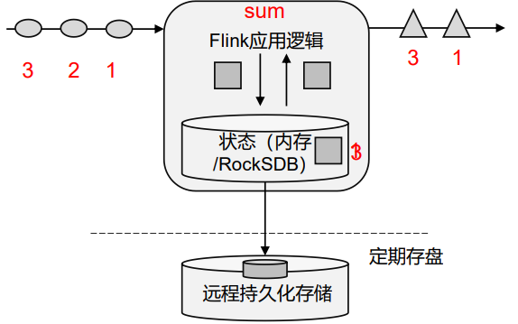

# Flink Notes


## MyNotes

1. https://flink.apache.org/
2. https://nightlies.apache.org/flink/flink-docs-master/zh/docs/deployment/resource-providers/standalone/kubernetes/#kubernetes-%E4%B8%8A%E8%BF%90%E8%A1%8C-standalone-%E9%9B%86%E7%BE%A4%E6%8C%87%E5%8D%97

### 概述

Apache Flink 是一个框架和**分布式处理引擎**，用于对**无界和有界数据流**进行**状态计算**


#### 特点

##### 事件驱动

事件驱动型应用是一类具有状态的应用，它从一个或多个事件流提取数据，并根据到来的事件触发计算、状态更新或其他外部动作。比较典型的就是以kafka 为代表的消息队列几乎都是事件驱动型应用。


##### 流批世界观

- 批：有界、持久、大量，适合需要访问全套记录才能完成的计算工作，一般用于离线统计
- 流：无解、实时，无需针对整个数据集执行操作，而是对通过系统传输的每个数据项执行操作，一般用于实时统计。

spark世界观中：一切都是由批次构成的：

- 离线数据：大批次
- 实时数据：一系列无限的小批次

在flink世界观中：一切都是流构成的

- 离线数据：有界限的流，有开始和结束。有界流的处理成为批处理
- 实时数据：无限的流，有开始无结束，源源不断

这种流的世界观，最大好处就是 **具有极低的延迟**

##### 分层api


最底层级的抽象仅仅提供了有状态流，它将通过过程函数（Process Function）被嵌入到 DataStream API 中。底层过程函数（Process Function）与DataStreamAPI 相集成，使其可以对某些特定的操作进行底层的抽象，它允许用户可以自由地处理来自一个或多个数据流的事件，并使用一致的容错的状态。除此之外，用户可以注册事件时间并处理时间回调，从而使程序可以处理复杂的计算

一般是是针对核心API（Core APIs）进行编程，比如 DataStream API（有界或无界流数据）以及 DataSet API（有界数据集）：转换（transformations），连接（joins），聚合（aggregations），窗口操作（windows）等

Table API 是以表为中心的声明式编程，其中表可能会动态变化（在表达流数据时）。Table API 遵循（扩展的）关系模型：表有二维数据结构（schema）（类似于关系数据库中的表），同时 API 提供可比较的操作，例如 select、project、join、group-by、aggregate 等。Table API 程序声明式地定义了什么逻辑操作应该执行，而不是准确地确定这些操作代码的看上去如何。

Flink 提 供 的 最高 层 级 的 抽 象 是 SQL 。 这 一 层抽 象 在 语法与表达能力上与Table API 类似，但是是以 SQL 查询表达式的形式表现程序。SQL 抽象与Table API 交互密切，同时 SQL 查询可以直接在 Table API 定义的表上执行

Flink 几大模块  

- Flink Table & SQL(还没开发完)  
- Flink Gelly(图计算)  
- Flink CEP(复杂事件处理)

### 部署

#### 配置说明

```yaml
# The port to which the REST client connects to. If rest.bind-port has
# not been specified, then the server will bind to this port as well.
# 这个端口似乎不是前端界面端口？ 是API端口？设置了访问不通，而是从下面的range端口的第一个访问的
rest.port: 8686

# The address to which the REST client will connect to
# 注意，这里默认是localhost，只能本机访问，需要改为0.0.0.0
rest.address: 0.0.0.0

# Port range for the REST and web server to bind to.
rest.bind-port: 8500-8590
```

如果有问题，请查询启动日志


#### 线上地址：

http://flink.cf.ctripcorp.com/#/overview


### 快速上手

Flink 程序支持 java 和 scala 两种语言

Flink本身是流批一体的，批量的数据本身也是流。从1.12开始，DataStreamAPI即流批一体，批处理的DataSetAPI没什么用了


批处理：相对静态

流计算：动态，顺序处理


## 极客-Flink核心技术与实战

### 第一章·Apache Flink介绍

#### 课程介绍

流计算主要技术：

1. Apache **STORM**
2. **Spark Streaming**
3. Apache Flink: **低延时、数据一致、高吞吐**

学习关键点：

1. 了解数据处理过程的基本模式：
   - 数据输入 Source
   - 数据处理 Transformation
   - 数据输出 Sink
2. 对真实数据的理解。流处理只是一种挖掘手段
3. 对流计算架构的理解
   - 有状态计算？
   - 数据一致性保障？

课程特点：原理+实践

课程设计：基本概念->开发与实践-核心原理->完整项目实践


#### 流处理技术概览

大数据技术发展：


大数据处理计算模式：


流计算与批计算对比

| item     | 流计算                                   | 批计算                                     |
| -------- | ---------------------------------------- | ------------------------------------------ |
| 时效性   | 实时、低延迟                             | 非实时、高延迟                             |
| 数据特征 | 动态、无边界                             | 静态数据                                   |
| 应用场景 | 实时场景，高实时要求：实时推荐、业务监控 | 实时要求不高，离线计算：数据分析、离线报表 |
| 运行方式 | 计算任务持续进行                         | 计算任务一次性完成                         |

流式计算将成为主流？

1. 实时性要求、低延迟要求
2. 流式技术的成熟
3. 批计算的计算和存储成本
4. **批计算本身就是一种特殊的流计算**，批和流相辅相成

流计算应用场景：

1. 数据实时采集、实时监控
2. 金融股市
3. 实时推荐

流计算框架和产品：

1. 商业产品：IBM InfoSphere Stream
2. 开源：
   - Storm：Twitter v1流处理系统
   - Heron: Twitter v2
   - Apache **Storm**: 基于Record级别处理数据的流处理引擎，延迟低
   - **Samza**: 和Kafka紧密绑定的流处理框架
   - **Spark** Streaming: Spark核心API的一个扩展，高吞吐，具备容错机制
   - Flink：针对流数据、批数据的分布式处理引擎，同时支持原生流处理
   - Apache **Kafka**：为处理实时数据提供一个统一、高通量、低等待的平台，消息中间

主流流式框架-Apache STORM：

1. 最早使用的流处理框架，社区成熟
2. 支持原生流处理，即单事件来处理流数据--**所有记录一个一个处理**
3. 延迟性低-毫秒级
4. 消息保障能力低：**At-least-once**, 不会丢失，可能重复
5. 吞吐较低

主流流式框架-Spark Streaming:

1. 属于Spark API的扩展
2. **以固定时间间隔处理一段段的批处理作业--微批处理**
3. 延迟高-秒级，**exactly-once**：消息不重复不丢失
4. 高吞吐


主流流式框架-Flink:

1. 真正的流处理框架--DateFlow Model
2. 延迟低--毫秒级，exactly-once
3. 高吞吐
4. 原生流处理支持：数据一条一条处理


Why Flink？

1. **低延迟：毫秒级**
2. **高吞吐：每秒千万级**
3. **准确性：exactly-once**
4. 易用性：SQL/Table API/DataSteream API

框架对比：


#### Flink发展历史与应用场景

发展历史：

1. 10-14年柏林几所大学联合发起项目Stratosphere
2. 14年成为Apache Top Level Project，更名Flink
3. 本课程使用的版本是 1.11(2020年12月发布)


应用场景：

1. 实时监控

   - 用户行为预警、APP crash预警、服务器攻击预警
   - 对用户行为或者相关事件进行实时监测和分析，基于风控规则预警：**实时监控平台、信用卡欺诈实时检测**

2. 实时报表：

   - 实时活动大屏
   - 对外数据产品
   - 数据化运营

3. 流数据分析：

   - 实时计算相关指标、及时反馈
   - 内容实时投放、实时推荐

4. 实时数据仓库

   1. 实时清洗、归并、结构化

   2. 数仓补充和优化

      


 #### Flink核心特性

1. 统一数据**处理组件栈**，处理不同类型数据：Batch、Stream、ML、Graph

   

2. 支持事件事件(Event Time), 接入事件(Ingestion Time), 处理事件(Process Time)

   

3. 基于轻量级分布式快照实现的容错

   

4. 支持有状态计算

   - Support for very lart state大状态
   - querable state支持
   - 灵活的state-backend:HDFS,MEM,RocksDB

5. 支持高度灵活的窗口操作：窗口计算

   

6. 带反压的连续流模型

   - 下游算子处理过不来的时候，会反馈给上游节点，进行协调

7. 基于JVM实现独立的内存管理

8. 应用可以超出主内存大小限制，且承受更少的垃圾收集开销

9. 对象序列化二进制存储

### 第二章·Flink部署与应用

#### Flink集群架构

1. 主从架构：Master-Worker
2. JobManager：管理节点，每个集群至少一个，管理整个集群计算资源，job管理与调度执行、checkpoint协调
3. TaskManager：每个集群多个，负责计算资源提供
4. Client：本地执行应用main方法解析JobGraph对象，并将JobGraph提交的JM运行，同时监控job执行状态。


JM：


1. JobGraph -> Execution Graph
2. RPC通信：Actor， TM和JM、和Client通信
3. ResourceManager：资源管理


TM：


Client：


JobGraph：


#### Flink集群运行模式

按如下3个条件：

1. 集群与作业生命周期是否一致
1. 资源隔离程度
2. main方法执行在client还是JM上

分为三种部署模式：


**Session Mode**：

先启动一个集群，保持一个会话，在这个会话中通过客 户端提交作业。集群启动时所有资源就都已经确定，所以所有提交的作业会竞争集群中的资源。作业**共享JM和TM**，**所有job都在一个RUNTIME中**

适合于**单个规模小、执行时间短的大量作业**


Cons: 无资源资格，伸缩性差


Pre-Job Mode：

会话模式因为资源共享会导致很多问题，所以为了更好地隔离资源，我们可以考虑为每个提交的 作业启动一个集群(Runtime)，这就是所谓的单作业（Per-Job）模式

**每个job独享JM、TM，即独享一个RUNTIME**


是实际应用的首选模式

Flink本身无法直接这样运行，所以单作业模式一般需要借助一些资源管理框架 来启动集群，比如YARN、Kubernetes（K8S）


session和pre-job模式的缺点：

Client压力大，需要下载资源、依赖，提交到JM，网络带宽要求很大


Application Mode：

不要客户端了，直接把应用提交到JobManger上运行。而这也就代表着，我们需要为 每一个提交的应用单独启动一个JobManager，也就是创建一个集群。这个JobManager只为执行这一个应用而存在， 执行结束之后JobManager也就关闭了，这就是所谓的应用模式。


#### Flink集群资源管理器支持

目前支持的资源管理器部署集群：

1. Standalone
2. Hadoop YARN
3. Apache Mesos
4. docker
5. k8s


on yarn国内主流，on k8s未来趋势

**Native** 是指可以通过底层的资源调度管理器，实现弹性扩缩容

Native模式部署：在ClusterManagement上启动session集群的时候，只启动JM，不启动TM。当提交job时，动态启动TM、动态申请资源

#### Standalone原理讲解与实操演示

独立集群模式，特点：

1. **分布式**多台物理主机部署
2. **不依赖与资源管理框架**
3. 仅支持session模式
4. 支持HA
5. 测试、学习


Standalone可以使用单机部署、多机部署


单机部署：

1. 下载：https://www.apache.org/dyn/closer.lua/flink/flink-1.17.1/flink-1.17.1-bin-scala_2.12.tgz
1. https://archive.apache.org/dist/flink/flink-1.17.1/
2. 安装1.8java, 配置java环境变量 JAVA_HOME (如果老的机器java是1.7的，把原来的/bin/java rename掉，然后重新source一下/etc/profile)
3. 

注意：目前最新版本是1.17.1，windows支持的最高版本是1.9.3

#### Flink On Yarn部署


#### Fkink on K8s


#### Flink高可用


### 第三章·DataStream API

#### 分布式流处理模型DataFlow

最先有Google一篇DataFlow的论文提出


并发：拆分为算子处理


#### DataStream API


批处理：

```java
    public static void main(String[] args) throws Exception {
        // 0.文件地址
        final String filepath = WordCount.class.getClassLoader().getResource("wordcount.txt").getPath();
        // 1.创建执行环境
        ExecutionEnvironment env = ExecutionEnvironment.getExecutionEnvironment();
        // 2.读取文件-Source
        DataSource<String> ds = env.readTextFile(filepath);
        // 3.转换、分组、求和
        AggregateOperator<Tuple2<String, Long>> sum = ds.flatMap(new FlatMapFunction<String, Tuple2<String, Long>>() {
                    @Override
                    public void flatMap(String line, Collector<Tuple2<String, Long>> out) {
                        String[] words = line.trim().split("\\s+");
                        for (String word : words) {
                            out.collect(Tuple2.of(word, 1L));
                        }
                    }
                })
                .groupBy(0)
                .sum(1);
        // 4.打印：(K, Cnt)
        sum.print();
    }
```

流处理：

```java
    public static void main(String[] args) throws Exception {
        final String filepath = BatchWordCount.class.getClassLoader().getResource("wordcount.txt").getPath();

        // 1.创建流式执行环境
        StreamExecutionEnvironment env = StreamExecutionEnvironment.getExecutionEnvironment();
        // 2.读取环境
        DataStream<String> ds = env.readTextFile(filepath);
        SingleOutputStreamOperator<Tuple2<String, Long>> sum = ds.flatMap(new FlatMapFunction<String, Tuple2<String, Long>>() {
                    @Override
                    public void flatMap(String line, Collector<Tuple2<String, Long>> out) throws Exception {
                        for (String word : line.trim().split("\\s+")) {
                            out.collect(Tuple2.of(word, 1L));
                        }
                    }
                })
                .keyBy(data->data.f0)
                .sum(1);
        sum.print();

        // 执行
        env.execute();
    }
```

区别：

1. 执行环境不同
2. 数据对象不同
3. 操作不同
4. 流处理需要手动执行


数据源：


主要转换操作：


DataStream转换：


#### Flink时间概念

- 事件时间：事件发生的时间，事件在其设备上发生的时间，Flink基于事件时间处理
- 处理时间


## 尚硅谷大数据之Flink

### Flink概述

#### Flink是什么

核心目标：**数据流上的有状态计算**

Flink：用于对 **无界和有界** 数据进行 **有状态计算** 的分布式处理引擎


有界与无界流：

1. 无界数据流：
   - 流 **有开始，无结束**
   - 不断产生数据
   - 必须持续处理，不能等数据全部到达后处理，数据是无限的
2. 有界数据流：
   - 流 **有开始和结束**
   - 可以再**摄取所有数据后再计算**
   - 数据可以被**排序**，因此**不需要有序摄取**
   - 有界流处理通常称为--**批处理**


有状态流处理：

把流处理需要的 **额外数据保存成一个状态**，然后针对这条数据进行处理，并更新状态。



1. 状态在内存中：速度快，但是可靠性差
2. 状态在分布式系统中：可靠性高，速度慢

#### Flink特点

1. 高吞吐低延迟：每秒百万级事件，毫秒延迟
2. 结果准确性：提供事件时间、处理时间予以。对于乱序事件流，事件语义仍能提供一致且准备的结果
3. exactly-once的状态一致性保证
4. 高可用

#### Flink vs. Spark Streaming

spark以批处理为根本：

1. 数据模型: 采用RDD模型，Spark Streaming的Dstream实际上是一组组小批数据RDD集合---**微批处理**
2. 运行时架构：**spark是批计算，将DAG划分为不同的stage，一个完成后才可以计算下一个**


Flink以流处理为根本：

1. 数据模型: 基础数据模型是**数据流**，以及**事件序列**
2. 运行时架构：标准的 **流执行模式**，一个时间在一个节点处理完成后可以直接发往下一个节点处理

|          | Flink              | Spark Streaming                    |
| -------- | ------------------ | ---------------------------------- |
| 计算模型 | 流                 | **微批**                           |
| 时间语义 | 事件时间，处理时间 | 处理时间                           |
| 窗口     | 多、灵活           | 少，不灵活--窗口必须是批次的整数倍 |
| 状态     | 有                 | 无                                 |
| 流式SQL  | 有                 | 无                                 |

#### Flink分层API


- 越顶层越抽象，表达含义越简明，使用越方便 

- 越底层越具体，表达能力越丰富，使用越灵活

4层：

1. 有状态流处理：通过**底层API（处理函数）**，对最原始数据加工处理。底层API与DataStream API相集成，可以处理复杂的计算。 
2. DataStream API（流处理）和DataSet API（批处理）封装了底层处理函数，提供了通用的模块，比如转换（transformations，包括 map、flatmap等），连接（joins），聚合（aggregations），窗口（windows）操作等。注意：**Flink1.12以后，DataStream API已经实现 真正的流批一体，所以DataSet API已经过时**。 
3. Table API 是**以表为中心的声明式编程**，其中表可能会动态变化。Table API遵循关系模型：表有二维数据结构，类似于关系数据库 中的表；同时API提供可比较的操作，例如select、project、join、group-by、aggregate等。我们可以在表与 DataStream/DataSet 之间无缝 切换，以允许程序将 Table API 与 DataStream 以及 DataSet 混合使用。 
4. SQL这一层在语法与表达能力上与 Table API 类似，但是是以SQL查询表达式的形式表现程序。SQL抽象与Table API交互密切，同 时SQL查询可以直接在Table API定义的表上执行。

### Flink部署

#### 部署模式

##### session模式

先启动一个集群，保持一个回话，回话中通过客户端提交作业。

集群启动时所有的资源都已经确定，job竞争资源。

##### 单作业模式PreJob

为了资源隔离：每个提交的作业启动一个集群，作业完毕时关闭集群释放资源。必须要借助资源调度框架

##### 应用模式

client解析、下载资源后提交给TM，网络带宽压力大---不要client了，直接把job提交到JM，也就是创建一个集群。


三上三种部署模式是抽象的，需要结合资源管理平台，才会有具体的部署模式：

1. Standalone
   1. session模式：
      1. 不依赖资源调度平台
      2. 使用 start-cluster.sh启动
   2. 单作业模式
      1. Flink 的 Standalone 集群并不支持单作业模式部署，需要资源调度平台
   3. 应用模式：
      1. 不提前创建集群，因此不能使用 start-cluster.sh启动
      2. 使用standalone-job.sh创建JM，taskmanager.sh启动TM
2. YARN模式：客户端把应用提交给Yarn的ResourceManager，RM向NodeManager申请容器，容器中会部署JM、TM实例，从而启动集群。会根据作业需要的Slot数量分配TaskManager资源
   1. session模式
   2. pre-job模式
   3. application模式
3. K8S运行模式

| 部署模式\资源调度平台 | Standalone | YARN | K8S  |
| --------------------- | ---------- | ---- | ---- |
| session               |            |      |      |
| pre-job               |            |      |      |
| application           |            |      |      |

### Flink运行时架构

#### 系统架构

—Standalone会话模式为例


JobManager：任务管理、调度核心，是控制应用执行的主进程，每个应用都应该被唯一的JobManager所控制执行。JobManager包含三部分：

1. JobMaster：负责处理单独的作业(JOB)，所以**JobMaster和Job一一对应**（早期Flink没有JobMaster的概念，之前Manager概念范围较小，实际就是现在所说的Master）。Master会先接收到应用，然后吧JobGraph转换成一个物理层面的数据流图---执行图ExecutionGraph，它包含了所有可以并发执行的任务，Master向resourceManger发出请求，申请资源，申请到后会分发到taskManager上。运行过程中，Master会负责所有的中央协调，比如checkpoints的协调。
2. 资源管理器RM：负责资源的分配和管理，flink集群中只有一个，资源即：taskmanager的任务槽Task Slots。**slot是flink中的资源调配单元**，包含一组CPU和内存资源，每一个任务Task都需要分配到一个slot上执行。
3. 分发器Dispatcher：提供一个rest接口，用来提交应用，为每一个Job启动一个新的JobMaster。Dispatcher也会启动一个web UI，展示和监控执行的信息

任务管理器TaskManager：

是flink中的 **工作进程**，负责数据流的计算。每个TM都包含一定数量的slots，slot数量决定TM并行处理的任务数。

#### 核心概念

##### 并行度Parallelism

一个算子operator可以被复制到多个节点---子任务subtask---并行计算

算子的子任务个数--并行度

包含并行子任务的数据就————并行数据流，它需要多个分区(stream partition)来分配并行任务

流程序的并行度，可以认为是所有算子中最大的并行度


设置方式：

1. 算子或者执行环境的setParallelism()方式，局部和全局设置
2. 提交时通过参数设置：flink run -p 2
3. 配置文件默认并行度：parallelism.default: 2

##### 算子链 operator chain

算子间数据传输有多种，取决于算子类型：

1. **一对一/直通(one-to-one, forwarding)**:数据流维护着分区、元素顺序，前后算子以及子算子都维持着一对一的关系，类似与**spark中的窄依赖**
2. 重分区Redistributing：数据流的分区会发生改变，每个子任务，会根据策略，将数据发送到不同的下游目标。类似 **spark中的shuffle**


合并算子链：

**并行度相同的一对一 算子操作，可以链接在一起，形成一个大任务，在同一个线程中执行** ————算子链


算子链的好处：减少线程之间的切换和基于缓存区的数据交 换，在减少时延的同时提升吞吐量

Flink默认按照原则进行合并，可以手动禁掉：.disableChaining()

##### 任务槽Task Slots

Task Slots：

Flink中，每一个TM都是一个JVM进程，可以启动多个线程执行子任务subtask，因此子任务之间相互竞争资源

TM上每个任务运行占用的资源做出明确的划分----任务槽slots

加入一个TM有三个slot，那么它将管理的内存平均分为三份，每个slot独自占据一份，执行时不会和其他子任务竞争


设置：flink-config中：taskmanager.numberOfTaskSlots: 8

默认是1

注意：slot仅仅隔离内存，不隔离CPU，因此一般配置WieCPU核心数


任务和任务槽的共享:


默认情况下，Flink 是允许子任务共享 slot 的。如果我们保持 sink 任务并行度为 1 不变， 而作业提交时设置全局并行度为 6，那么前两个任务节点就会各自有 6个并行子任务，整个流 处理程序则有 13 个子任务。如上图所示，只要属于同一个作业，那么对于不同任务节点（算 子）的并行子任务，就可以放到同一个 slot 上执行。所以对于第一个任务节点 source→map， 它的 6 个并行子任务必须分到不同的 slot 上，而第二个任务节点 keyBy/window/apply 的并行 子任务却可以和第一个任务节点共享 slot。

默认开始，可以设置).slotSharingGroup("1")实现独自slot

##### 任务槽和并行度关系

任务槽：静态概念，指TM具有的并发执行能力

并行度：动态概念，指TM实际使用的并发能力


举例说明：假设一共有3个TaskManager，每一个TaskManager中的slot数量设置为3个， 那么一共有 9 个 task slot，表示集群最多能并行执行 9 个同一算子的子任务。 而我们定义 word count 程序的处理操作是四个转换算子： source→ flatmap→ reduce→ sink 当所有算子并行度相同时，容易看出 source 和 flatmap 可以合并算子链，于是最终有三个 任务节点。


整个流处理程序的并行度，就应该是所有算子并行度 中最大的那个，这代表了运行程序需要的 slot 数量

#### 作业提交流程

##### Standalone session模式


##### 逻辑流图/作业图/执行图/物理流图

**逻辑流图Stream Graph --> 作业图JobGraph --> 执行图ExecutionGraph --> 物理图PhysicalGraph**

 


1. 逻辑流图StreamGraph：用户根据DatastreamAPI编写代码生成的最初DAG图，是程序的逻辑拓扑结构
2. 作业图JobGraph：逻辑流图经过优化后生成的就是作业图，session模式下client生成后提交给JM。作业图确定了当前作业中所有任务的划分。主要优化：**合并算子链**
3. 执行图ExecutionGraph：做了并行优化，拆分成子任务，明确了任务间数据传输方式。是一个重要的数据结构
4. 物理图PhysicalGraph：JM将执行图分发给TM，TM根据执行图部署任务，最终的物理执行过程也就是物理图。这里物理层面的，不是具体的数据结构。

##### YARN应用模式提交作业流程


### DataStreamAPI

flink核心层API，一个flink程序其实就是对DataStream的各种转换。代码基本都由以下几部分构成：


##### 执行环境 Execution Env

flink程序可以在各种上下文环境中运行：本地JVM、远程集群

不同的环境、代码提交方式，运行的过程不同，因此在提交作业执行计算时，必须先获取当前flink的运行环境，从而建立起与flink框架之间的联系。

###### 创建执行环境

StreamExecutionEnvironment类 --基础类，静态方法创建env:

1. getExecutionEnvironment: 最简单高效，自动判断环境，创建本地或者集群env
2. createLocalEnvironment：创建本地环境
3. createRemoteEnvironment：创建远程环境

 ###### 执行模型exec mode

从1.12开始，官方推荐直接使用DataStreamAPI，如果做批处理，将直接模型设置为BATCH，从而不建议使用DataSetAPI

DataStreamAPI支持的三种执行模型：

1. 流执行Streaming：用于持续处理无界数据流，默认模式
2. 批处理模型Batch：批处理任务
   1. flink run -Dexecution.runtime-mode=BATCH
   2. env.setRuntimeMode(RuntimeExecutionMode.BATCH)
3. 自动模型AutoMatic: 自动根据输入数据源是否有界判断

###### 触发程序执行

flink是 **事件驱动** 的，只有等到数据来了，才会触发真正的计算—————延迟执行、懒执行

因此我们需要显式调用execute()方法，触发程序开始执行，完毕后返回JobExecutionResult

##### 源算子Source

读取数据源的算子--源算子(Source operation)，即输入端

1.12之前使用addSource，之后使用env.fromSource

```java
public class FromCollection {
    public static void main(String[] args) throws Exception {
        StreamExecutionEnvironment env  = StreamExecutionEnvironment.getExecutionEnvironment();
        // env.setParallelism(1);
        // 并行度默认为processor数量
        log.info("并行度:{}", env.getParallelism());

        List<Student> students = DataSourceUtil.getStudents(10);

        DataStreamSource<Student> source = env.fromCollection(students);
        source.print();

        env.execute();
    }
}
```

1.7支持datagen模块，模拟数据生成


##### Flink支持的数据类型

Flink 使用“类型信息”（TypeInformation）来统一表示数据类型。TypeInformation 类是 Flink 中所有类型描述符的基类。它涵盖了类型的一些基本属性，并为每个数据类型生成特定 的序列化器、反序列化器和比较器

Flink支持的类型：

1. 基本类型：Java基本类、包装类、Void、String、Date、BigDecimal 和 BigInteger。
2. 数组类型：基本类型数组、对象数组
3. 复合数据类型
   - 元组 Tuple：1-26个字段，Tuple0-Tuple25
   - 行类型ROW
   - POJO，要求：
     - public类
     - 无参构造
     - 可序列化
4. 辅助类型：Option, Either, List, Map
5. 泛型类型：如果没有按照POJO类定义，视为泛型，黑盒，无法获取属性，使用Kryo序列化

##### 转换算子 Transformation

将一个或多个 DataStream 转换为 新的 DataStream。

###### 基本转换算子Map/filter/flatMap

flatMap 操作又称为扁平映射，主要是将数据流中的整体（一般是集合类型）拆分成一个 一个的个体使用

消费一个元素，可以产生 0 到多个元素

###### 聚合算子

要把所有数据聚在一起进 行汇总合并——这就是所谓的“聚合”（Aggregation）

在 Flink 中，要做聚合，需要先进行分区； 这个操作就是通过 keyBy 来完成的

keyBy是聚合前必须要用到的一个算子。keyBy通过指定键（key），可以将一条流从逻辑 上划分成不同的分区（partitions）。这里所说的分区，其实就是并行处理的子任务。

在内部，是通过计算 **key 的哈希值（hash code）**，对分区数进行取模运算来实现的。所以 这里 key 如果是 POJO 的话，必须要重写 hashCode()方法。

还可以传入Lambda表达式或者实现一个键选择 器（KeySelector），用于说明从数据中提取 key 的逻辑

keyBy 得到的结果将不再是 DataStream，而是会将 DataStream 转换为 KeyedStream。KeyedStream 可以认为是“分区流”或者“键控流”

###### 简单聚合（sum/min/max/minBy/maxBy）

基于KeyedStream可以做聚合

minBy()：与 min()类似，在输入流上针对指定字段求最小值。不同的是，min()只计 算指定字段的最小值，其他字段会保留最初第一个数据的值；而 minBy()则会返回 包含字段最小值的整条数据 

>  stream.keyBy(e -> e.id).max("vc"); 

个聚合算子，会为每一个 key 保存一个聚合的值，在 Flink 中我们把它叫作“状态” （state）。所以每当有一个新的数据输入，算子就会更新保存的聚合结果，并发送一个带有更 新后聚合值的事件到下游算子。对于无界流来说，这些状态是永远不会被清除的，所以我们 使用聚合算子，应该只用在含有有限个 key 的数据流上


###### 归约聚合（reduce）

**reduce 可以对已有的数据进行归约处理，把每一个新输入的数据和当前已经归约出来的 值，再做一个聚合计算**

reduce操作也会将 KeyedStream转换为 DataStream。它不会改变流的元素数据类型，所以 输出类型和输入类型是一样的。

从ReduceFunction可以看到，两个状态进行合并。可以实现max的功能

```
SingleOutputStreamOperator<Student> reduce = ks.reduce(new ReduceFunction<Student>() {
            @Override
            public Student reduce(Student student, Student t1) throws Exception {
                return student.getAge() > t1.getAge() ? student : t1;
            }
        });
```

reduce 同简单聚合算子一样，也要针对每一个 key 保存状态。因为状态不会清空，所以 我们需要将 reduce 算子作用在一个有限 key 的流上。

##### UDF

用户自定义函数（user-defined function，UDF）--自定义算子

用户自定义函数分为：函数类、匿名函数、富函数类。

###### 函数类 Function Classes

即实现各类抽象类、接口，如实现FilterFunction

使用匿名函数同样的效果，or方法引用

###### 富函数类Rich Function Classes

所有的 Flink 函数类都有其 Rich 版 本

一般是抽象类：RichMapFunction、 RichFilterFunction、RichReduceFunction 等

区别：**富函数类可以获取运行环境的上下文，并拥有一些生命 周期方法，所以可以实现更复杂的功能**

生命周期：

- open()：算子创建，在map等实际方法创建之前会被调用
- close

注意：一个并行子任务只会调用一次，而map等实际工作函数会调用多次

##### 物理分区算子

Physical Partitioning

常见的物理分区策略有：**随机分配（Random）、轮询分配（Round-Robin）、重缩放 （Rescale）和广播（Broadcast）**。

- 随机分区Shuffle：重分区方式就是直接“洗牌”。通过调用 DataStream 的.shuffle()方法，将数据随 机地分配到下游算子的并行任务中去

- 轮询：Round-Robin负载均衡算法，rebalance()

- 重缩放：rescale,当调用 rescale()方法时，其实底层也是使用 RoundRobin算法进行轮询，但是只会将数据轮询发送到下游并行任务的一部分中。rescale的做法是 分成小团体，发牌人只给自己团体内的所有人轮流发牌

  

- 广播broadcase: 将数据广播到下游算子，stream.boardcase()

- 全局分区global：通过调用.global()方法，会将所 有的输入流数据都发送到下游算子的第一个并行子任务中去。这就相当于强行让下游任务并 行度变成了 1，所以使用这个操作需要非常谨慎，可能对程序造成很大的压力

- 自定义分区Custom: 实现Partitioner定义分区逻辑，stream调用partitionCustom()使用

##### 分流

一个流拆分为多个流

简单分流：filter

```java
SingleOutputStreamOperator<Student> f1 = ds.filter(stu -> stu.getAge() < 10);
SingleOutputStreamOperator<Student> f2 = ds.filter(stu -> stu.getAge() > 10);
```

当需要分出多个流的时候，这种写法非常是复制流然后过滤，非常低效。因此：


**使用侧输出流：**

定义多个流输出标签OutputTag，在处理流的时候根据逻辑分到多个流：

```java
// 定义OutPutTag
OutputTag<Student> ot1 = new OutputTag<>("ot1", Types.POJO(Student.class));
OutputTag<Student> ot2 = new OutputTag<>("ot2", Types.POJO(Student.class));

// 分流
SingleOutputStreamOperator<Student> splitStreams  = ds.process(new ProcessFunction<Student, Student>() {
    @Override
    public void processElement(Student value, ProcessFunction<Student, Student>.Context ctx, Collector<Student> out) throws Exception {
        if (value.getAge() > 10) {
            ctx.output(ot1, value);
        } else {
            ctx.output(ot2, value);
        }
    }
});

// 取出流
SideOutputDataStream<Student> ot1Stream = splitStreams.getSideOutput(ot1);
SideOutputDataStream<Student> ot2Stream = splitStreams.getSideOutput(ot2);

```


##### 合流

###### union

合流，要求类型一致

> s1.union(s2, s3...)

###### connet

支持不同类型的流合并


首先基于一条 DataStream 调用.connect()方法，传入另外一条 DataStream作为参数，将两条流连接起来，得到一个ConnectedStreams；然后再调用同处理方 法得到 DataStream。这里可以的调用的同处理方法有.map()/.flatMap()，以及.process()方法

注意：**一次只能连接两条流**

```java
        DataStreamSource<Student> ds1 = env.fromCollection(DataSourceUtil.getStudents(100));
        DataStreamSource<Integer> ds2 = env.fromElements(1, 2, 3, 5);

        ConnectedStreams<Student, Integer> cs = ds1.connect(ds2);

        // process必须使用OutputTag
        OutputTag<Student> stu = new OutputTag<Student>("stu", Types.POJO(Student.class));
        SingleOutputStreamOperator<Student> out = cs.process(new CoProcessFunction<Student, Integer, Student>() {
            @Override
            public void processElement1(Student value, CoProcessFunction<Student, Integer, Student>.Context ctx, Collector<Student> out) throws Exception {
                ctx.output(stu, value);
            }

            @Override
            public void processElement2(Integer value, CoProcessFunction<Student, Integer, Student>.Context ctx, Collector<Student> out) throws Exception {
                ctx.output(stu, Student.builder().age(value).build());
            }
        });
        out.print();
```

CoProcess

ConnectedStreams 也可以直接调用.keyBy()进行按键分区的操作，得到的 还是一个 ConnectedStreams：


##### 输出算子Sink

###### 连接到外部系统

向外部写入数据的方法：addSink

Flink1.12 以前，Sink 算子的创建是通过调用 DataStream 的.addSink()方法实现的

> stream.addSink(new SinkFunction(…));
>
> // invoke() 方法

Flink1.12 开始，同样重构了 Sink 架构

> stream.sinkTo(…)

的 print 方法其 实就是一种 Sink，它表示将数据流写入标准控制台打印输出


像 Kafka 之类流式系统，Flink 提供了完美对接，source/sink 两端都能连 接，可读可写；而对于 Elasticsearch、JDBC 等数据存储系统，则只提供了输出写入的 sink 连 接器

除 Flink 官方之外，**Apache Bahir** 框架，也实现了一些其他第三方系统与 Flink 的连接 器。


###### 输出到文件

Flink 专门提供了一个流式文件系统的连接器：FileSink，为批处理和流处理提供了一个 统一的 Sink，它可以将分区文件写入 Flink 支持的文件系统。 FileSink 支持行编码（Row-encoded）和批量编码（Bulk-encoded）格式。这两种不同的 方式都有各自的构建器（builder），可以直接调用 FileSink 的静态方法： 

- 行编码： FileSink.forRowFormat（basePath，rowEncoder）。 
- 批量编码： FileSink.forBulkFormat（basePath，bulkWriterFactory）。

```xml
<dependency>
<groupId>org.apache.flink</groupId>
<artifactId>flink-connector-files</artifactId>
<version>1.17.1</version>
</dependency>
```

```java
public static void main(String[] args) throws Exception {
    StreamExecutionEnvironment env = StreamExecutionEnvironment.getExecutionEnvironment();
    env.setParallelism(2);

    DataStreamSource<Student> ds = env.fromCollection(DataSourceUtil.getStudents(100));

    // 必须开启 checkpoint，否则一直都是 .inprogress
    env.enableCheckpointing(2000, CheckpointingMode.EXACTLY_ONCE);

    FileSink<String> fileSink = FileSink.<String>forRowFormat(new Path("D:\\tmp\\flink-out"), new SimpleStringEncoder<>("utf-8"))
            // 输出文件的一些配置： 文件名的前缀、后缀
            .withOutputFileConfig(
                    OutputFileConfig.builder()
                            .withPartPrefix("edw-")
                            .withPartSuffix(".log")
                            .build()
            )
            .build();
    ds.map(Student::toString).sinkTo(fileSink).setParallelism(2);

    env.execute();
}
```

### Flink时间和窗口

在批处理统计中，我们可以等待一批数据都到齐后，统一处理。但是在实时处理统计中， 我们是来一条就得处理一条，那么我们怎么统计最近一段时间内的数据呢---窗口

所谓的“窗口”，一般就是划定的一段时间范围，也就是“时间窗”；对在这范围内的数 据进行处理，就是所谓的窗口计算。所以窗口和时间往往是分不开的

#### 窗口window

##### 窗口概念

Flink是流式计算，为了实现窗口计算，一种方式是将无限数据切割成有限的数据块处理--window


窗口并不是静态准备好的，而是**动态创建**——当有落在这个窗口区间范围 的数据达到时，才创建对应的窗口。

##### 类型

按驱动类型：


按窗口分配数据的规则：**滚动窗口（Tumbling Window）、 滑动窗口（Sliding Window）、会话窗口（Session Window），以及全局窗口（Global Window）**


##### 窗口API概览

按键分区（Keyed）和非按键分区（Non-Keyed）

在定义窗口操作之前，首先需要确定，到底是基于按键分区（Keyed）的数据流 KeyedStream 来开窗，还是直接在没有按键分区的 DataStream 上开窗。也就是说，在调用窗 口算子之前，是否有 **keyBy** 操作

1.按键分区窗口（Keyed Windows

- 经过按键分区 keyBy 操作后，数据流会按照 key 被分为多条逻辑流（logical streams），这 就是 KeyedStream

- 基于 KeyedStream进行窗口操作时，窗口计算会在多个并行子任务上同时 执行。

- 相同 key 的数据会被发送到同一个并行子任务，而窗口操作会基于每个 key 进行单独 的处理。所以可以认为，每个 key 上都定义了一组窗口，各自独立地进行统计计算。

> stream.keyBy(...) .window(...)

2.非按键分区（Non-Keyed Windows）

无keyBy，不会拆分逻辑流，窗口在一个任务上进行(并行度=1)

> stream.windowAll(...)

注意：对于非按键分区的窗口操作，手动调大窗口算子的并行度也是无效的，**windowAll 本身就是一个非并行的操作**


代码调用：窗口操作主要有两个部分：窗口分配器（Window Assigners）和窗口函数（Window Functions）。

> stream.keyBy() .window() .aggregate()
>
> 其 中.window()方 法 需 要 传 入 一 个 窗 口 分 配 器 ， 它 指 明 了 窗 口 的 类 型 ； 而 后 面 的.aggregate()方法传入一个窗口函数作为参数，它用来定义窗口具体的处理逻辑。窗口分配 器有各种形式，而窗口函数的调用方法也不只.aggregate()一种，

##### 窗口分配器

Assigners: 定义数据应该被分配到哪个窗口，即指定窗口类型

窗口分配器最通用的定义方式，就是调用.window()方法。这个方法需要传入一个 WindowAssigner 作为参数，返回 WindowedStream。如果是非按键分区窗口，那么直接调 用.windowAll()方法，同样传入一个 WindowAssigner，返回的是 AllWindowedStream

###### 时间窗口

分为滚动、滑动和会话三种：


滚动处理时间窗口：

由类 TumblingProcessingTimeWindows 提供

> stream.keyBy(...) .window(TumblingProcessingTimeWindows.of(Time.seconds(5))).aggregate(...)

.of()还有一个重载方法，可以传入两个 Time 类型的参数：size 和 offset。第一个参 数当然还是窗口大小，第二个参数则表示窗口起始点的偏移量


滑动处理时间窗口:

窗口分配器由类 SlidingProcessingTimeWindows 提供，同样需要调用它的静态方法.of()。

> stream.keyBy(...) .window(SlidingProcessingTimeWindows.of(Time.seconds(10) ， Time.seconds(5))) .aggregate(...)

参数：size 和 slide，前者表示滑动窗口的大小， 后者表示滑动窗口的滑动步长


处理时间会话窗口:

窗口分配器由类 ProcessingTimeSessionWindows 提供，需要调用它的静态方法.withGap() 或者.withDynamicGap()。

> stream.keyBy(...) .window(ProcessingTimeSessionWindows.withGap(Time.seconds(10 ))) .aggregate(...)

这里.withGap()方法需要传入一个 Time类型的参数 size，表示会话的超时时间，也就是最 小间隔 session gap。我们这里创建了静态会话超时时间为 10 秒的会话窗口。


滚动事件时间窗口:

窗口分配器由类 TumblingEventTimeWindows 提供，用法与滚动处理事件窗口完全一致

> stream.keyBy(...) .window(TumblingEventTimeWindows.of(Time.seconds(5))) .aggregate(...)

滑动事件时间窗口:

窗口分配器由类 SlidingEventTimeWindows 提供，用法与滑动处理事件窗口完全一致。 

>  stream.keyBy(...) .window(SlidingEventTimeWindows.of(Time.seconds(10) ， Time.seconds(5))) .aggregate(...)


事件时间会话窗口 窗口分配器由类 EventTimeSessionWindows 提供，用法与处理事件会话窗口完全一致。 

> stream.keyBy(...) .window(EventTimeSessionWindows.withGap(Time.seconds(10))) .aggregate(...)

###### 计数窗口

计数窗口概念非常简单，本身底层是基于全局窗口（Global Window）实现的。Flink 为 我们提供了非常方便的接口：直接调用**.countWindow()**方法。根据分配规则的不同，又可以 分为滚动计数窗口和滑动计数窗口两类


滚动计数窗口：滚动计数窗口只需要传入一个长整型的参数 size，表示窗口的大小

> stream.keyBy(...) .countWindow(10)
>
> 我们定义了一个长度为 10 的滚动计数窗口，当窗口中元素数量达到 10 的时候，就会触 发计算执行并关闭窗口。


滑动计数窗口：与滚动计数窗口类似，不过需要在.countWindow()调用时传入两个参数：size 和 slide，前 者表示窗口大小，后者表示滑动步长

> stream.keyBy(...) .countWindow(10，3)
>
> 我们定义了一个长度为 10、滑动步长为 3 的滑动计数窗口。每个窗口统计 10个数据，每 隔 3 个数据就统计输出一次结果。


全局窗口: 计数窗口的底层实现，一般在需要自定义窗口时使用。它的定义同样是直接 调用.window()，分配器由 GlobalWindows 类提供

> stream.keyBy(...) .window(GlobalWindows.create());


##### 窗口函数

分配器定义数据属于哪个窗口，窗口函数定义数据收集之后的处理方式


根据处理的方式可以分为两类： 增量聚合函数和全窗口函数

###### 增量聚合函数

窗口将数据收集起来，最基本的处理操作当然就是进行聚合。我们可以每来一个数据就 在之前结果上聚合一次，这就是“增量聚合”

典型的增量聚合函数有两个：**ReduceFunction 和 AggregateFunction**


ReduceFunction：

```java
public class StreamUtil {

    /**
     * {@link cn.edw.flink.java.socket.FlinkServerSocket start it}
     */
    public static SingleOutputStreamOperator<String> socketTextStream(StreamExecutionEnvironment env, int parallelism) {
        // TODO From Socket是按换行符判断的？ SocketServer没有换行的的时候不会触发运算
        DataStreamSource<String> ds = env.socketTextStream("localhost", 8888);
        ds.setParallelism(parallelism);
        return ds.flatMap(new FlatMapFunction<String, String>() {
                    @Override
                    public void flatMap(String s, Collector<String> out) throws Exception {
                        for (String str : s.split(",| +")) {
                            out.collect(str);
                        }
                    }
                })
                .filter(new FilterFunction<String>() {
                    @Override
                    public boolean filter(String s) throws Exception {
                        return StringUtils.isNotBlank(s);
                    }
                });
    }
}
```


```java
/**
 * @author txu6
 * @date 2023/09/02
 */
@Slf4j
public class WindowReduceFunc {
    public static void main(String[] args) throws Exception {
        StreamExecutionEnvironment env = StreamExecutionEnvironment.getExecutionEnvironment();

        // 取首字母
        SingleOutputStreamOperator<Tuple2<String, Long>> stream = StreamUtil.socketTextStream(env, 1)
                .map(new MapFunction<String, Tuple2<String, Long>>() {
                    @Override
                    public Tuple2<String, Long> map(String s) throws Exception {
                        return Tuple2.of(s.substring(0, 1), 1L);
                    }
                });

        // 每N秒计数
        stream.keyBy(data -> data.f0)
                .window(TumblingProcessingTimeWindows.of(Time.seconds(10L)))
                .reduce(new ReduceFunction<Tuple2<String, Long>>() {
                    @Override
                    public Tuple2<String, Long> reduce(Tuple2<String, Long> t2, Tuple2<String, Long> t1) throws Exception {
                        return Tuple2.of(t2.f0, t2.f1 + t2.f1);
                    }
                })
                .print();

        env.execute();
    }
}
```

###### 聚合算子

ReduceFunction限制：聚合 状态的类型、输出结果的类型都必须和输入数据类型一样

 aggregate 就突破了这个限制，可以定义更加灵活的窗口聚合操作。 这个方法需要传入一个 AggregateFunction 的实现类作为参数

AggregateFunction 可以看作是 ReduceFunction 的通用版本，这里有三种类型：**输入类型 （IN）、累加器类型（ACC）和输出类型（OUT）**。输入类型 IN 就是输入流中元素的数据类 型；累加器类型 ACC 则是我们进行聚合的中间状态类型；而输出类型当然就是最终计算结果 的类型

接口中有四个方法：

- createAccumulator()：创建一个累加器，这就是为聚合创建了一个初始状态，每个聚 合任务只会调用一次。
- add()：将输入的元素添加到累加器中。 
- getResult()：从累加器中提取聚合的输出结果。 
- merge()：合并两个累加器，并将合并后的状态作为一个累加器返回。

工作原理是：**首先调用 createAccumulator()为任务初 始化一个状态（累加器）；而后每来一个数据就调用一次 add()方法，对数据进行聚合，得到 的结果保存在状态中；等到了窗口需要输出时，再调用 getResult()方法得到计算结果**。很明 显，与 ReduceFunction 相同，AggregateFunction 也是增量式的聚合；而由于输入、中间状态、 输出的类型可以不同，使得应用更加灵活方便


P91


## 官方文档

https://flink.apachecn.org/#/docs/1.7-SNAPSHOT/2

Apache Flink是一个用于分布式流和批处理数据处理的开源平台。Flink的核心是流数据流引擎，为数据流上的分布式计算提供数据分发，通信和容错。Flink在流引擎之上构建批处理，覆盖本机迭代支持，托管内存和程序优化。

### 基本概念

#### 数据流编程模型

Flink提供不同级别的抽象来开发 流/批处理 应用程序


