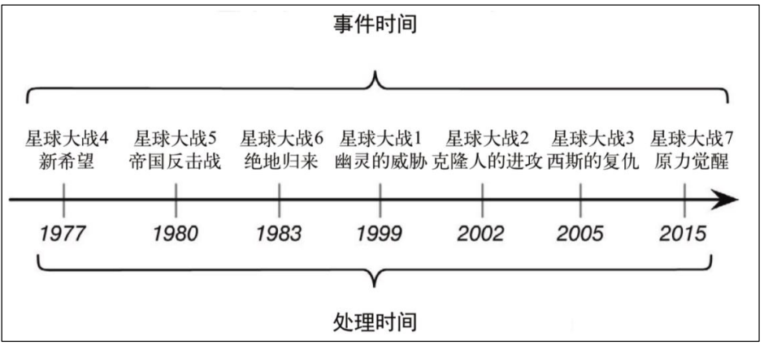
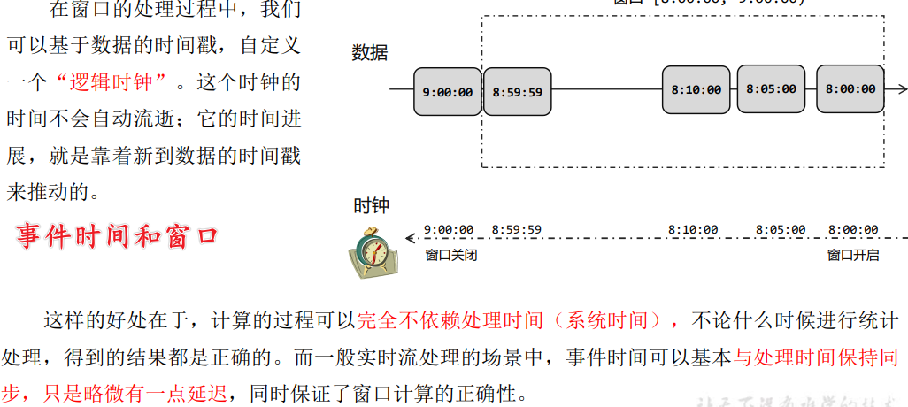
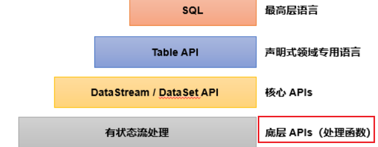

# Flink Notes


## MyNotes

1. https://flink.apache.org/
2. https://nightlies.apache.org/flink/flink-docs-master/zh/docs/deployment/resource-providers/standalone/kubernetes/#kubernetes-%E4%B8%8A%E8%BF%90%E8%A1%8C-standalone-%E9%9B%86%E7%BE%A4%E6%8C%87%E5%8D%97

### 概述

Apache Flink 是一个框架和**分布式处理引擎**，用于对**无界和有界数据流**进行**状态计算**


#### 特点

##### 事件驱动

事件驱动型应用是一类具有状态的应用，它从一个或多个事件流提取数据，并根据到来的事件触发计算、状态更新或其他外部动作。比较典型的就是以kafka 为代表的消息队列几乎都是事件驱动型应用。


##### 流批世界观

- 批：有界、持久、大量，适合需要访问全套记录才能完成的计算工作，一般用于离线统计
- 流：无解、实时，无需针对整个数据集执行操作，而是对通过系统传输的每个数据项执行操作，一般用于实时统计。

spark世界观中：一切都是由批次构成的：

- 离线数据：大批次
- 实时数据：一系列无限的小批次

在flink世界观中：一切都是流构成的

- 离线数据：有界限的流，有开始和结束。有界流的处理成为批处理
- 实时数据：无限的流，有开始无结束，源源不断

这种流的世界观，最大好处就是 **具有极低的延迟**

##### 分层api


最底层级的抽象仅仅提供了有状态流，它将通过过程函数（Process Function）被嵌入到 DataStream API 中。底层过程函数（Process Function）与DataStreamAPI 相集成，使其可以对某些特定的操作进行底层的抽象，它允许用户可以自由地处理来自一个或多个数据流的事件，并使用一致的容错的状态。除此之外，用户可以注册事件时间并处理时间回调，从而使程序可以处理复杂的计算

一般是是针对核心API（Core APIs）进行编程，比如 DataStream API（有界或无界流数据）以及 DataSet API（有界数据集）：转换（transformations），连接（joins），聚合（aggregations），窗口操作（windows）等

Table API 是以表为中心的声明式编程，其中表可能会动态变化（在表达流数据时）。Table API 遵循（扩展的）关系模型：表有二维数据结构（schema）（类似于关系数据库中的表），同时 API 提供可比较的操作，例如 select、project、join、group-by、aggregate 等。Table API 程序声明式地定义了什么逻辑操作应该执行，而不是准确地确定这些操作代码的看上去如何。

Flink 提 供 的 最高 层 级 的 抽 象 是 SQL 。 这 一 层抽 象 在 语法与表达能力上与Table API 类似，但是是以 SQL 查询表达式的形式表现程序。SQL 抽象与Table API 交互密切，同时 SQL 查询可以直接在 Table API 定义的表上执行

Flink 几大模块  

- Flink Table & SQL(还没开发完)  
- Flink Gelly(图计算)  
- Flink CEP(复杂事件处理)

### 部署

#### 配置说明

```yaml
# The port to which the REST client connects to. If rest.bind-port has
# not been specified, then the server will bind to this port as well.
# 这个端口似乎不是前端界面端口？ 是API端口？设置了访问不通，而是从下面的range端口的第一个访问的
rest.port: 8686

# The address to which the REST client will connect to
# 注意，这里默认是localhost，只能本机访问，需要改为0.0.0.0
rest.address: 0.0.0.0

# Port range for the REST and web server to bind to.
rest.bind-port: 8500-8590
```

如果有问题，请查询启动日志


#### 线上地址：

http://flink.cf.ctripcorp.com/#/overview


### 快速上手

Flink 程序支持 java 和 scala 两种语言

Flink本身是流批一体的，批量的数据本身也是流。从1.12开始，DataStreamAPI即流批一体，批处理的DataSetAPI没什么用了


批处理：相对静态

流计算：动态，顺序处理


## 极客-Flink核心技术与实战

### 第一章·Apache Flink介绍

#### 课程介绍

流计算主要技术：

1. Apache **STORM**
2. **Spark Streaming**
3. Apache Flink: **低延时、数据一致、高吞吐**

学习关键点：

1. 了解数据处理过程的基本模式：
   - 数据输入 Source
   - 数据处理 Transformation
   - 数据输出 Sink
2. 对真实数据的理解。流处理只是一种挖掘手段
3. 对流计算架构的理解
   - 有状态计算？
   - 数据一致性保障？

课程特点：原理+实践

课程设计：基本概念->开发与实践-核心原理->完整项目实践


#### 流处理技术概览

大数据技术发展：


大数据处理计算模式：


流计算与批计算对比

| item     | 流计算                                   | 批计算                                     |
| -------- | ---------------------------------------- | ------------------------------------------ |
| 时效性   | 实时、低延迟                             | 非实时、高延迟                             |
| 数据特征 | 动态、无边界                             | 静态数据                                   |
| 应用场景 | 实时场景，高实时要求：实时推荐、业务监控 | 实时要求不高，离线计算：数据分析、离线报表 |
| 运行方式 | 计算任务持续进行                         | 计算任务一次性完成                         |

流式计算将成为主流？

1. 实时性要求、低延迟要求
2. 流式技术的成熟
3. 批计算的计算和存储成本
4. **批计算本身就是一种特殊的流计算**，批和流相辅相成

流计算应用场景：

1. 数据实时采集、实时监控
2. 金融股市
3. 实时推荐

流计算框架和产品：

1. 商业产品：IBM InfoSphere Stream
2. 开源：
   - Storm：Twitter v1流处理系统
   - Heron: Twitter v2
   - Apache **Storm**: 基于Record级别处理数据的流处理引擎，延迟低
   - **Samza**: 和Kafka紧密绑定的流处理框架
   - **Spark** Streaming: Spark核心API的一个扩展，高吞吐，具备容错机制
   - Flink：针对流数据、批数据的分布式处理引擎，同时支持原生流处理
   - Apache **Kafka**：为处理实时数据提供一个统一、高通量、低等待的平台，消息中间

主流流式框架-Apache STORM：

1. 最早使用的流处理框架，社区成熟
2. 支持原生流处理，即单事件来处理流数据--**所有记录一个一个处理**
3. 延迟性低-毫秒级
4. 消息保障能力低：**At-least-once**, 不会丢失，可能重复
5. 吞吐较低

主流流式框架-Spark Streaming:

1. 属于Spark API的扩展
2. **以固定时间间隔处理一段段的批处理作业--微批处理**
3. 延迟高-秒级，**exactly-once**：消息不重复不丢失
4. 高吞吐


主流流式框架-Flink:

1. 真正的流处理框架--DateFlow Model
2. 延迟低--毫秒级，exactly-once
3. 高吞吐
4. 原生流处理支持：数据一条一条处理


Why Flink？

1. **低延迟：毫秒级**
2. **高吞吐：每秒千万级**
3. **准确性：exactly-once**
4. 易用性：SQL/Table API/DataSteream API

框架对比：


#### Flink发展历史与应用场景

发展历史：

1. 10-14年柏林几所大学联合发起项目Stratosphere
2. 14年成为Apache Top Level Project，更名Flink
3. 本课程使用的版本是 1.11(2020年12月发布)


应用场景：

1. 实时监控

   - 用户行为预警、APP crash预警、服务器攻击预警
   - 对用户行为或者相关事件进行实时监测和分析，基于风控规则预警：**实时监控平台、信用卡欺诈实时检测**

2. 实时报表：

   - 实时活动大屏
   - 对外数据产品
   - 数据化运营

3. 流数据分析：

   - 实时计算相关指标、及时反馈
   - 内容实时投放、实时推荐

4. 实时数据仓库

   1. 实时清洗、归并、结构化

   2. 数仓补充和优化

      


 #### Flink核心特性

1. 统一数据**处理组件栈**，处理不同类型数据：Batch、Stream、ML、Graph

   

2. 支持事件事件(Event Time), 接入事件(Ingestion Time), 处理事件(Process Time)

   

3. 基于轻量级分布式快照实现的容错

   

4. 支持有状态计算

   - Support for very lart state大状态
   - querable state支持
   - 灵活的state-backend:HDFS,MEM,RocksDB

5. 支持高度灵活的窗口操作：窗口计算

   

6. 带反压的连续流模型

   - 下游算子处理过不来的时候，会反馈给上游节点，进行协调

7. 基于JVM实现独立的内存管理

8. 应用可以超出主内存大小限制，且承受更少的垃圾收集开销

9. 对象序列化二进制存储

### 第二章·Flink部署与应用

#### Flink集群架构

1. 主从架构：Master-Worker
2. JobManager：管理节点，每个集群至少一个，管理整个集群计算资源，job管理与调度执行、checkpoint协调
3. TaskManager：每个集群多个，负责计算资源提供
4. Client：本地执行应用main方法解析JobGraph对象，并将JobGraph提交的JM运行，同时监控job执行状态。


JM：


1. JobGraph -> Execution Graph
2. RPC通信：Actor， TM和JM、和Client通信
3. ResourceManager：资源管理


TM：


Client：


JobGraph：


#### Flink集群运行模式

按如下3个条件：

1. 集群与作业生命周期是否一致
1. 资源隔离程度
2. main方法执行在client还是JM上

分为三种部署模式：


**Session Mode**：

先启动一个集群，保持一个会话，在这个会话中通过客 户端提交作业。集群启动时所有资源就都已经确定，所以所有提交的作业会竞争集群中的资源。作业**共享JM和TM**，**所有job都在一个RUNTIME中**

适合于**单个规模小、执行时间短的大量作业**


Cons: 无资源资格，伸缩性差


Pre-Job Mode：

会话模式因为资源共享会导致很多问题，所以为了更好地隔离资源，我们可以考虑为每个提交的 作业启动一个集群(Runtime)，这就是所谓的单作业（Per-Job）模式

**每个job独享JM、TM，即独享一个RUNTIME**


是实际应用的首选模式

Flink本身无法直接这样运行，所以单作业模式一般需要借助一些资源管理框架 来启动集群，比如YARN、Kubernetes（K8S）


session和pre-job模式的缺点：

Client压力大，需要下载资源、依赖，提交到JM，网络带宽要求很大


Application Mode：

不要客户端了，直接把应用提交到JobManger上运行。而这也就代表着，我们需要为 每一个提交的应用单独启动一个JobManager，也就是创建一个集群。这个JobManager只为执行这一个应用而存在， 执行结束之后JobManager也就关闭了，这就是所谓的应用模式。


#### Flink集群资源管理器支持

目前支持的资源管理器部署集群：

1. Standalone
2. Hadoop YARN
3. Apache Mesos
4. docker
5. k8s


on yarn国内主流，on k8s未来趋势

**Native** 是指可以通过底层的资源调度管理器，实现弹性扩缩容

Native模式部署：在ClusterManagement上启动session集群的时候，只启动JM，不启动TM。当提交job时，动态启动TM、动态申请资源

#### Standalone原理讲解与实操演示

独立集群模式，特点：

1. **分布式**多台物理主机部署
2. **不依赖与资源管理框架**
3. 仅支持session模式
4. 支持HA
5. 测试、学习


Standalone可以使用单机部署、多机部署


单机部署：

1. 下载：https://www.apache.org/dyn/closer.lua/flink/flink-1.17.1/flink-1.17.1-bin-scala_2.12.tgz
1. https://archive.apache.org/dist/flink/flink-1.17.1/
2. 安装1.8java, 配置java环境变量 JAVA_HOME (如果老的机器java是1.7的，把原来的/bin/java rename掉，然后重新source一下/etc/profile)
3. 

注意：目前最新版本是1.17.1，windows支持的最高版本是1.9.3

#### Flink On Yarn部署


#### Fkink on K8s


#### Flink高可用


### 第三章·DataStream API

#### 分布式流处理模型DataFlow

最先有Google一篇DataFlow的论文提出


并发：拆分为算子处理


#### DataStream API


批处理：

```java
    public static void main(String[] args) throws Exception {
        // 0.文件地址
        final String filepath = WordCount.class.getClassLoader().getResource("wordcount.txt").getPath();
        // 1.创建执行环境
        ExecutionEnvironment env = ExecutionEnvironment.getExecutionEnvironment();
        // 2.读取文件-Source
        DataSource<String> ds = env.readTextFile(filepath);
        // 3.转换、分组、求和
        AggregateOperator<Tuple2<String, Long>> sum = ds.flatMap(new FlatMapFunction<String, Tuple2<String, Long>>() {
                    @Override
                    public void flatMap(String line, Collector<Tuple2<String, Long>> out) {
                        String[] words = line.trim().split("\\s+");
                        for (String word : words) {
                            out.collect(Tuple2.of(word, 1L));
                        }
                    }
                })
                .groupBy(0)
                .sum(1);
        // 4.打印：(K, Cnt)
        sum.print();
    }
```

流处理：

```java
    public static void main(String[] args) throws Exception {
        final String filepath = BatchWordCount.class.getClassLoader().getResource("wordcount.txt").getPath();

        // 1.创建流式执行环境
        StreamExecutionEnvironment env = StreamExecutionEnvironment.getExecutionEnvironment();
        // 2.读取环境
        DataStream<String> ds = env.readTextFile(filepath);
        SingleOutputStreamOperator<Tuple2<String, Long>> sum = ds.flatMap(new FlatMapFunction<String, Tuple2<String, Long>>() {
                    @Override
                    public void flatMap(String line, Collector<Tuple2<String, Long>> out) throws Exception {
                        for (String word : line.trim().split("\\s+")) {
                            out.collect(Tuple2.of(word, 1L));
                        }
                    }
                })
                .keyBy(data->data.f0)
                .sum(1);
        sum.print();

        // 执行
        env.execute();
    }
```

区别：

1. 执行环境不同
2. 数据对象不同
3. 操作不同
4. 流处理需要手动执行


数据源：


主要转换操作：


DataStream转换：


#### Flink时间概念

- 事件时间：事件发生的时间，事件在其设备上发生的时间，Flink基于事件时间处理
- 处理时间


## 尚硅谷大数据之Flink

### Flink概述

#### Flink是什么

核心目标：**数据流上的有状态计算**

Flink：用于对 **无界和有界** 数据进行 **有状态计算** 的分布式处理引擎


有界与无界流：

1. 无界数据流：
   - 流 **有开始，无结束**
   - 不断产生数据
   - 必须持续处理，不能等数据全部到达后处理，数据是无限的
2. 有界数据流：
   - 流 **有开始和结束**
   - 可以再**摄取所有数据后再计算**
   - 数据可以被**排序**，因此**不需要有序摄取**
   - 有界流处理通常称为--**批处理**


有状态流处理：

把流处理需要的 **额外数据保存成一个状态**，然后针对这条数据进行处理，并更新状态。


1. 状态在内存中：速度快，但是可靠性差
2. 状态在分布式系统中：可靠性高，速度慢

#### Flink特点

1. 高吞吐低延迟：每秒百万级事件，毫秒延迟
2. 结果准确性：提供事件时间、处理时间予以。对于乱序事件流，事件语义仍能提供一致且准备的结果
3. exactly-once的状态一致性保证
4. 高可用

#### Flink vs. Spark Streaming

spark以批处理为根本：

1. 数据模型: 采用RDD模型，Spark Streaming的Dstream实际上是一组组小批数据RDD集合---**微批处理**
2. 运行时架构：**spark是批计算，将DAG划分为不同的stage，一个完成后才可以计算下一个**


Flink以流处理为根本：

1. 数据模型: 基础数据模型是**数据流**，以及**事件序列**
2. 运行时架构：标准的 **流执行模式**，一个时间在一个节点处理完成后可以直接发往下一个节点处理

|          | Flink              | Spark Streaming                    |
| -------- | ------------------ | ---------------------------------- |
| 计算模型 | 流                 | **微批**                           |
| 时间语义 | 事件时间，处理时间 | 处理时间                           |
| 窗口     | 多、灵活           | 少，不灵活--窗口必须是批次的整数倍 |
| 状态     | 有                 | 无                                 |
| 流式SQL  | 有                 | 无                                 |

#### Flink分层API


- 越顶层越抽象，表达含义越简明，使用越方便 

- 越底层越具体，表达能力越丰富，使用越灵活

4层：

1. 有状态流处理：通过**底层API（处理函数）**，对最原始数据加工处理。底层API与DataStream API相集成，可以处理复杂的计算。 
2. DataStream API（流处理）和DataSet API（批处理）封装了底层处理函数，提供了通用的模块，比如转换（transformations，包括 map、flatmap等），连接（joins），聚合（aggregations），窗口（windows）操作等。注意：**Flink1.12以后，DataStream API已经实现 真正的流批一体，所以DataSet API已经过时**。 
3. Table API 是**以表为中心的声明式编程**，其中表可能会动态变化。Table API遵循关系模型：表有二维数据结构，类似于关系数据库 中的表；同时API提供可比较的操作，例如select、project、join、group-by、aggregate等。我们可以在表与 DataStream/DataSet 之间无缝 切换，以允许程序将 Table API 与 DataStream 以及 DataSet 混合使用。 
4. SQL这一层在语法与表达能力上与 Table API 类似，但是是以SQL查询表达式的形式表现程序。SQL抽象与Table API交互密切，同 时SQL查询可以直接在Table API定义的表上执行。

### Flink部署

#### 部署模式

##### session模式

先启动一个集群，保持一个回话，回话中通过客户端提交作业。

集群启动时所有的资源都已经确定，job竞争资源。

##### 单作业模式PreJob

为了资源隔离：每个提交的作业启动一个集群，作业完毕时关闭集群释放资源。必须要借助资源调度框架

##### 应用模式

client解析、下载资源后提交给TM，网络带宽压力大---不要client了，直接把job提交到JM，也就是创建一个集群。


三上三种部署模式是抽象的，需要结合资源管理平台，才会有具体的部署模式：

1. Standalone
   1. session模式：
      1. 不依赖资源调度平台
      2. 使用 start-cluster.sh启动
   2. 单作业模式
      1. Flink 的 Standalone 集群并不支持单作业模式部署，需要资源调度平台
   3. 应用模式：
      1. 不提前创建集群，因此不能使用 start-cluster.sh启动
      2. 使用standalone-job.sh创建JM，taskmanager.sh启动TM
2. YARN模式：客户端把应用提交给Yarn的ResourceManager，RM向NodeManager申请容器，容器中会部署JM、TM实例，从而启动集群。会根据作业需要的Slot数量分配TaskManager资源
   1. session模式
   2. pre-job模式
   3. application模式
3. K8S运行模式

| 部署模式\资源调度平台 | Standalone | YARN | K8S  |
| --------------------- | ---------- | ---- | ---- |
| session               |            |      |      |
| pre-job               |            |      |      |
| application           |            |      |      |

### Flink运行时架构

#### 系统架构

—Standalone会话模式为例


JobManager：任务管理、调度核心，是控制应用执行的主进程，每个应用都应该被唯一的JobManager所控制执行。JobManager包含三部分：

1. JobMaster：负责处理单独的作业(JOB)，所以**JobMaster和Job一一对应**（早期Flink没有JobMaster的概念，之前Manager概念范围较小，实际就是现在所说的Master）。Master会先接收到应用，然后吧JobGraph转换成一个物理层面的数据流图---执行图ExecutionGraph，它包含了所有可以并发执行的任务，Master向resourceManger发出请求，申请资源，申请到后会分发到taskManager上。运行过程中，Master会负责所有的中央协调，比如checkpoints的协调。
2. 资源管理器RM：负责资源的分配和管理，flink集群中只有一个，资源即：taskmanager的任务槽Task Slots。**slot是flink中的资源调配单元**，包含一组CPU和内存资源，每一个任务Task都需要分配到一个slot上执行。
3. 分发器Dispatcher：提供一个rest接口，用来提交应用，为每一个Job启动一个新的JobMaster。Dispatcher也会启动一个web UI，展示和监控执行的信息

任务管理器TaskManager：

是flink中的 **工作进程**，负责数据流的计算。每个TM都包含一定数量的slots，slot数量决定TM并行处理的任务数。

#### 核心概念

##### 并行度Parallelism

一个算子operator可以被复制到多个节点---子任务subtask---并行计算

算子的子任务个数--并行度

包含并行子任务的数据就————并行数据流，它需要多个分区(stream partition)来分配并行任务

流程序的并行度，可以认为是所有算子中最大的并行度


设置方式：

1. 算子或者执行环境的setParallelism()方式，局部和全局设置
2. 提交时通过参数设置：flink run -p 2
3. 配置文件默认并行度：parallelism.default: 2

##### 算子链 operator chain

算子间数据传输有多种，取决于算子类型：

1. **一对一/直通(one-to-one, forwarding)**:数据流维护着分区、元素顺序，前后算子以及子算子都维持着一对一的关系，类似与**spark中的窄依赖**
2. 重分区Redistributing：数据流的分区会发生改变，每个子任务，会根据策略，将数据发送到不同的下游目标。类似 **spark中的shuffle**


合并算子链：

**并行度相同的一对一 算子操作，可以链接在一起，形成一个大任务，在同一个线程中执行** ————算子链


算子链的好处：减少线程之间的切换和基于缓存区的数据交 换，在减少时延的同时提升吞吐量

Flink默认按照原则进行合并，可以手动禁掉：.disableChaining()

##### 任务槽Task Slots

Task Slots：

Flink中，每一个TM都是一个JVM进程，可以启动多个线程执行子任务subtask，因此子任务之间相互竞争资源

TM上每个任务运行占用的资源做出明确的划分----任务槽slots

加入一个TM有三个slot，那么它将管理的内存平均分为三份，每个slot独自占据一份，执行时不会和其他子任务竞争


设置：flink-config中：taskmanager.numberOfTaskSlots: 8

默认是1

注意：slot仅仅隔离内存，不隔离CPU，因此一般配置WieCPU核心数


任务和任务槽的共享:


默认情况下，Flink 是允许子任务共享 slot 的。如果我们保持 sink 任务并行度为 1 不变， 而作业提交时设置全局并行度为 6，那么前两个任务节点就会各自有 6个并行子任务，整个流 处理程序则有 13 个子任务。如上图所示，只要属于同一个作业，那么对于不同任务节点（算 子）的并行子任务，就可以放到同一个 slot 上执行。所以对于第一个任务节点 source→map， 它的 6 个并行子任务必须分到不同的 slot 上，而第二个任务节点 keyBy/window/apply 的并行 子任务却可以和第一个任务节点共享 slot。

默认开始，可以设置).slotSharingGroup("1")实现独自slot

##### 任务槽和并行度关系

任务槽：静态概念，指TM具有的并发执行能力

并行度：动态概念，指TM实际使用的并发能力


举例说明：假设一共有3个TaskManager，每一个TaskManager中的slot数量设置为3个， 那么一共有 9 个 task slot，表示集群最多能并行执行 9 个同一算子的子任务。 而我们定义 word count 程序的处理操作是四个转换算子： source→ flatmap→ reduce→ sink 当所有算子并行度相同时，容易看出 source 和 flatmap 可以合并算子链，于是最终有三个 任务节点。


整个流处理程序的并行度，就应该是所有算子并行度 中最大的那个，这代表了运行程序需要的 slot 数量

#### 作业提交流程

##### Standalone session模式


##### 逻辑流图/作业图/执行图/物理流图

**逻辑流图Stream Graph --> 作业图JobGraph --> 执行图ExecutionGraph --> 物理图PhysicalGraph**

 


1. 逻辑流图StreamGraph：用户根据DatastreamAPI编写代码生成的最初DAG图，是程序的逻辑拓扑结构
2. 作业图JobGraph：逻辑流图经过优化后生成的就是作业图，session模式下client生成后提交给JM。作业图确定了当前作业中所有任务的划分。主要优化：**合并算子链**
3. 执行图ExecutionGraph：做了并行优化，拆分成子任务，明确了任务间数据传输方式。是一个重要的数据结构
4. 物理图PhysicalGraph：JM将执行图分发给TM，TM根据执行图部署任务，最终的物理执行过程也就是物理图。这里物理层面的，不是具体的数据结构。

##### YARN应用模式提交作业流程


### DataStreamAPI

flink核心层API，一个flink程序其实就是对DataStream的各种转换。代码基本都由以下几部分构成：


##### 执行环境 Execution Env

flink程序可以在各种上下文环境中运行：本地JVM、远程集群

不同的环境、代码提交方式，运行的过程不同，因此在提交作业执行计算时，必须先获取当前flink的运行环境，从而建立起与flink框架之间的联系。

###### 创建执行环境

StreamExecutionEnvironment类 --基础类，静态方法创建env:

1. getExecutionEnvironment: 最简单高效，自动判断环境，创建本地或者集群env
2. createLocalEnvironment：创建本地环境
3. createRemoteEnvironment：创建远程环境

 ###### 执行模型exec mode

从1.12开始，官方推荐直接使用DataStreamAPI，如果做批处理，将直接模型设置为BATCH，从而不建议使用DataSetAPI

DataStreamAPI支持的三种执行模型：

1. 流执行Streaming：用于持续处理无界数据流，默认模式
2. 批处理模型Batch：批处理任务
   1. flink run -Dexecution.runtime-mode=BATCH
   2. env.setRuntimeMode(RuntimeExecutionMode.BATCH)
3. 自动模型AutoMatic: 自动根据输入数据源是否有界判断

###### 触发程序执行

flink是 **事件驱动** 的，只有等到数据来了，才会触发真正的计算—————延迟执行、懒执行

因此我们需要显式调用execute()方法，触发程序开始执行，完毕后返回JobExecutionResult

##### 源算子Source

读取数据源的算子--源算子(Source operation)，即输入端

1.12之前使用addSource，之后使用env.fromSource

```java
public class FromCollection {
    public static void main(String[] args) throws Exception {
        StreamExecutionEnvironment env  = StreamExecutionEnvironment.getExecutionEnvironment();
        // env.setParallelism(1);
        // 并行度默认为processor数量
        log.info("并行度:{}", env.getParallelism());

        List<Student> students = DataSourceUtil.getStudents(10);

        DataStreamSource<Student> source = env.fromCollection(students);
        source.print();

        env.execute();
    }
}
```

1.7支持datagen模块，模拟数据生成


##### Flink支持的数据类型

Flink 使用“类型信息”（TypeInformation）来统一表示数据类型。TypeInformation 类是 Flink 中所有类型描述符的基类。它涵盖了类型的一些基本属性，并为每个数据类型生成特定 的序列化器、反序列化器和比较器

Flink支持的类型：

1. 基本类型：Java基本类、包装类、Void、String、Date、BigDecimal 和 BigInteger。
2. 数组类型：基本类型数组、对象数组
3. 复合数据类型
   - 元组 Tuple：1-26个字段，Tuple0-Tuple25
   - 行类型ROW
   - POJO，要求：
     - public类
     - 无参构造
     - 可序列化
4. 辅助类型：Option, Either, List, Map
5. 泛型类型：如果没有按照POJO类定义，视为泛型，黑盒，无法获取属性，使用Kryo序列化

##### 转换算子 Transformation

将一个或多个 DataStream 转换为 新的 DataStream。

###### 基本转换算子Map/filter/flatMap

flatMap 操作又称为扁平映射，主要是将数据流中的整体（一般是集合类型）拆分成一个 一个的个体使用

消费一个元素，可以产生 0 到多个元素

###### 聚合算子

要把所有数据聚在一起进 行汇总合并——这就是所谓的“聚合”（Aggregation）

在 Flink 中，要做聚合，需要先进行分区； 这个操作就是通过 keyBy 来完成的

keyBy是聚合前必须要用到的一个算子。keyBy通过指定键（key），可以将一条流从逻辑 上划分成不同的分区（partitions）。这里所说的分区，其实就是并行处理的子任务。

在内部，是通过计算 **key 的哈希值（hash code）**，对分区数进行取模运算来实现的。所以 这里 key 如果是 POJO 的话，必须要重写 hashCode()方法。

还可以传入Lambda表达式或者实现一个键选择 器（KeySelector），用于说明从数据中提取 key 的逻辑

keyBy 得到的结果将不再是 DataStream，而是会将 DataStream 转换为 KeyedStream。KeyedStream 可以认为是“分区流”或者“键控流”

###### 简单聚合（sum/min/max/minBy/maxBy）

基于KeyedStream可以做聚合

minBy()：与 min()类似，在输入流上针对指定字段求最小值。不同的是，min()只计 算指定字段的最小值，其他字段会保留最初第一个数据的值；而 minBy()则会返回 包含字段最小值的整条数据 

>  stream.keyBy(e -> e.id).max("vc"); 

个聚合算子，会为每一个 key 保存一个聚合的值，在 Flink 中我们把它叫作“状态” （state）。所以每当有一个新的数据输入，算子就会更新保存的聚合结果，并发送一个带有更 新后聚合值的事件到下游算子。对于无界流来说，这些状态是永远不会被清除的，所以我们 使用聚合算子，应该只用在含有有限个 key 的数据流上


###### 归约聚合（reduce）

**reduce 可以对已有的数据进行归约处理，把每一个新输入的数据和当前已经归约出来的 值，再做一个聚合计算**

reduce操作也会将 KeyedStream转换为 DataStream。它不会改变流的元素数据类型，所以 输出类型和输入类型是一样的。

从ReduceFunction可以看到，两个状态进行合并。可以实现max的功能

```
SingleOutputStreamOperator<Student> reduce = ks.reduce(new ReduceFunction<Student>() {
            @Override
            public Student reduce(Student student, Student t1) throws Exception {
                return student.getAge() > t1.getAge() ? student : t1;
            }
        });
```

reduce 同简单聚合算子一样，也要针对每一个 key 保存状态。因为状态不会清空，所以 我们需要将 reduce 算子作用在一个有限 key 的流上。

##### UDF

用户自定义函数（user-defined function，UDF）--自定义算子

用户自定义函数分为：函数类、匿名函数、富函数类。

###### 函数类 Function Classes

即实现各类抽象类、接口，如实现FilterFunction

使用匿名函数同样的效果，or方法引用

###### 富函数类Rich Function Classes

所有的 Flink 函数类都有其 Rich 版 本

一般是抽象类：RichMapFunction、 RichFilterFunction、RichReduceFunction 等

区别：**富函数类可以获取运行环境的上下文，并拥有一些生命 周期方法，所以可以实现更复杂的功能**

生命周期：

- open()：算子创建，在map等实际方法创建之前会被调用
- close

注意：一个并行子任务只会调用一次，而map等实际工作函数会调用多次

##### 物理分区算子

Physical Partitioning

常见的物理分区策略有：**随机分配（Random）、轮询分配（Round-Robin）、重缩放 （Rescale）和广播（Broadcast）**。

- 随机分区Shuffle：重分区方式就是直接“洗牌”。通过调用 DataStream 的.shuffle()方法，将数据随 机地分配到下游算子的并行任务中去

- 轮询：Round-Robin负载均衡算法，rebalance()

- 重缩放：rescale,当调用 rescale()方法时，其实底层也是使用 RoundRobin算法进行轮询，但是只会将数据轮询发送到下游并行任务的一部分中。rescale的做法是 分成小团体，发牌人只给自己团体内的所有人轮流发牌

  

- 广播broadcase: 将数据广播到下游算子，stream.boardcase()

- 全局分区global：通过调用.global()方法，会将所 有的输入流数据都发送到下游算子的第一个并行子任务中去。这就相当于强行让下游任务并 行度变成了 1，所以使用这个操作需要非常谨慎，可能对程序造成很大的压力

- 自定义分区Custom: 实现Partitioner定义分区逻辑，stream调用partitionCustom()使用

##### 分流

一个流拆分为多个流

简单分流：filter

```java
SingleOutputStreamOperator<Student> f1 = ds.filter(stu -> stu.getAge() < 10);
SingleOutputStreamOperator<Student> f2 = ds.filter(stu -> stu.getAge() > 10);
```

当需要分出多个流的时候，这种写法非常是复制流然后过滤，非常低效。因此：


**使用侧输出流：**

定义多个流输出标签OutputTag，在处理流的时候根据逻辑分到多个流：

```java
// 定义OutPutTag
OutputTag<Student> ot1 = new OutputTag<>("ot1", Types.POJO(Student.class));
OutputTag<Student> ot2 = new OutputTag<>("ot2", Types.POJO(Student.class));

// 分流
SingleOutputStreamOperator<Student> splitStreams  = ds.process(new ProcessFunction<Student, Student>() {
    @Override
    public void processElement(Student value, ProcessFunction<Student, Student>.Context ctx, Collector<Student> out) throws Exception {
        if (value.getAge() > 10) {
            ctx.output(ot1, value);
        } else {
            ctx.output(ot2, value);
        }
    }
});

// 取出流
SideOutputDataStream<Student> ot1Stream = splitStreams.getSideOutput(ot1);
SideOutputDataStream<Student> ot2Stream = splitStreams.getSideOutput(ot2);

```


##### 合流

###### union

合流，要求类型一致

> s1.union(s2, s3...)

###### connet

支持不同类型的流合并


首先基于一条 DataStream 调用.connect()方法，传入另外一条 DataStream作为参数，将两条流连接起来，得到一个ConnectedStreams；然后再调用同处理方 法得到 DataStream。这里可以的调用的同处理方法有.map()/.flatMap()，以及.process()方法

注意：**一次只能连接两条流**

```java
        DataStreamSource<Student> ds1 = env.fromCollection(DataSourceUtil.getStudents(100));
        DataStreamSource<Integer> ds2 = env.fromElements(1, 2, 3, 5);

        ConnectedStreams<Student, Integer> cs = ds1.connect(ds2);

        // process必须使用OutputTag
        OutputTag<Student> stu = new OutputTag<Student>("stu", Types.POJO(Student.class));
        SingleOutputStreamOperator<Student> out = cs.process(new CoProcessFunction<Student, Integer, Student>() {
            @Override
            public void processElement1(Student value, CoProcessFunction<Student, Integer, Student>.Context ctx, Collector<Student> out) throws Exception {
                ctx.output(stu, value);
            }

            @Override
            public void processElement2(Integer value, CoProcessFunction<Student, Integer, Student>.Context ctx, Collector<Student> out) throws Exception {
                ctx.output(stu, Student.builder().age(value).build());
            }
        });
        out.print();
```

CoProcess

ConnectedStreams 也可以直接调用.keyBy()进行按键分区的操作，得到的 还是一个 ConnectedStreams：


##### 输出算子Sink

###### 连接到外部系统

向外部写入数据的方法：addSink

Flink1.12 以前，Sink 算子的创建是通过调用 DataStream 的.addSink()方法实现的

> stream.addSink(new SinkFunction(…));
>
> // invoke() 方法

Flink1.12 开始，同样重构了 Sink 架构

> stream.sinkTo(…)

的 print 方法其 实就是一种 Sink，它表示将数据流写入标准控制台打印输出


像 Kafka 之类流式系统，Flink 提供了完美对接，source/sink 两端都能连 接，可读可写；而对于 Elasticsearch、JDBC 等数据存储系统，则只提供了输出写入的 sink 连 接器

除 Flink 官方之外，**Apache Bahir** 框架，也实现了一些其他第三方系统与 Flink 的连接 器。


###### 输出到文件

Flink 专门提供了一个流式文件系统的连接器：FileSink，为批处理和流处理提供了一个 统一的 Sink，它可以将分区文件写入 Flink 支持的文件系统。 FileSink 支持行编码（Row-encoded）和批量编码（Bulk-encoded）格式。这两种不同的 方式都有各自的构建器（builder），可以直接调用 FileSink 的静态方法： 

- 行编码： FileSink.forRowFormat（basePath，rowEncoder）。 
- 批量编码： FileSink.forBulkFormat（basePath，bulkWriterFactory）。

```xml
<dependency>
<groupId>org.apache.flink</groupId>
<artifactId>flink-connector-files</artifactId>
<version>1.17.1</version>
</dependency>
```

```java
public static void main(String[] args) throws Exception {
    StreamExecutionEnvironment env = StreamExecutionEnvironment.getExecutionEnvironment();
    env.setParallelism(2);

    DataStreamSource<Student> ds = env.fromCollection(DataSourceUtil.getStudents(100));

    // 必须开启 checkpoint，否则一直都是 .inprogress
    env.enableCheckpointing(2000, CheckpointingMode.EXACTLY_ONCE);

    FileSink<String> fileSink = FileSink.<String>forRowFormat(new Path("D:\\tmp\\flink-out"), new SimpleStringEncoder<>("utf-8"))
            // 输出文件的一些配置： 文件名的前缀、后缀
            .withOutputFileConfig(
                    OutputFileConfig.builder()
                            .withPartPrefix("edw-")
                            .withPartSuffix(".log")
                            .build()
            )
            .build();
    ds.map(Student::toString).sinkTo(fileSink).setParallelism(2);

    env.execute();
}
```

### Flink时间和窗口

在批处理统计中，我们可以等待一批数据都到齐后，统一处理。但是在实时处理统计中， 我们是来一条就得处理一条，那么我们怎么统计最近一段时间内的数据呢---窗口

所谓的“窗口”，一般就是划定的一段时间范围，也就是“时间窗”；对在这范围内的数 据进行处理，就是所谓的窗口计算。所以窗口和时间往往是分不开的

#### 窗口window

##### 窗口概念

Flink是流式计算，为了实现窗口计算，一种方式是将无限数据切割成有限的数据块处理--window


窗口并不是静态准备好的，而是**动态创建**——当有落在这个窗口区间范围 的数据达到时，才创建对应的窗口。

##### 类型

按驱动类型：


按窗口分配数据的规则：**滚动窗口（Tumbling Window）、 滑动窗口（Sliding Window）、会话窗口（Session Window），以及全局窗口（Global Window）**


##### 窗口API概览

按键分区（Keyed）和非按键分区（Non-Keyed）

在定义窗口操作之前，首先需要确定，到底是基于按键分区（Keyed）的数据流 KeyedStream 来开窗，还是直接在没有按键分区的 DataStream 上开窗。也就是说，在调用窗 口算子之前，是否有 **keyBy** 操作

1.按键分区窗口（Keyed Windows

- 经过按键分区 keyBy 操作后，数据流会按照 key 被分为多条逻辑流（logical streams），这 就是 KeyedStream

- 基于 KeyedStream进行窗口操作时，窗口计算会在多个并行子任务上同时 执行。

- 相同 key 的数据会被发送到同一个并行子任务，而窗口操作会基于每个 key 进行单独 的处理。所以可以认为，每个 key 上都定义了一组窗口，各自独立地进行统计计算。

> stream.keyBy(...) .window(...)

2.非按键分区（Non-Keyed Windows）

无keyBy，不会拆分逻辑流，窗口在一个任务上进行(并行度=1)

> stream.windowAll(...)

注意：对于非按键分区的窗口操作，手动调大窗口算子的并行度也是无效的，**windowAll 本身就是一个非并行的操作**


代码调用：窗口操作主要有两个部分：窗口分配器（Window Assigners）和窗口函数（Window Functions）。

> stream.keyBy() .window() .aggregate()
>
> 其 中.window()方 法 需 要 传 入 一 个 窗 口 分 配 器 ， 它 指 明 了 窗 口 的 类 型 ； 而 后 面 的.aggregate()方法传入一个窗口函数作为参数，它用来定义窗口具体的处理逻辑。窗口分配 器有各种形式，而窗口函数的调用方法也不只.aggregate()一种，

##### 窗口分配器

Assigners: 定义数据应该被分配到哪个窗口，即指定窗口类型

窗口分配器最通用的定义方式，就是调用.window()方法。这个方法需要传入一个 WindowAssigner 作为参数，返回 WindowedStream。如果是非按键分区窗口，那么直接调 用.windowAll()方法，同样传入一个 WindowAssigner，返回的是 AllWindowedStream

###### 时间窗口

分为滚动、滑动和会话三种：


滚动处理时间窗口：

由类 TumblingProcessingTimeWindows 提供

> stream.keyBy(...) .window(TumblingProcessingTimeWindows.of(Time.seconds(5))).aggregate(...)

.of()还有一个重载方法，可以传入两个 Time 类型的参数：size 和 offset。第一个参 数当然还是窗口大小，第二个参数则表示窗口起始点的偏移量


滑动处理时间窗口:

窗口分配器由类 SlidingProcessingTimeWindows 提供，同样需要调用它的静态方法.of()。

> stream.keyBy(...) .window(SlidingProcessingTimeWindows.of(Time.seconds(10) ， Time.seconds(5))) .aggregate(...)

参数：size 和 slide，前者表示滑动窗口的大小， 后者表示滑动窗口的滑动步长


处理时间会话窗口:

窗口分配器由类 ProcessingTimeSessionWindows 提供，需要调用它的静态方法.withGap() 或者.withDynamicGap()。

> stream.keyBy(...) .window(ProcessingTimeSessionWindows.withGap(Time.seconds(10 ))) .aggregate(...)

这里.withGap()方法需要传入一个 Time类型的参数 size，表示会话的超时时间，也就是最 小间隔 session gap。我们这里创建了静态会话超时时间为 10 秒的会话窗口。


滚动事件时间窗口:

窗口分配器由类 TumblingEventTimeWindows 提供，用法与滚动处理事件窗口完全一致

> stream.keyBy(...) .window(TumblingEventTimeWindows.of(Time.seconds(5))) .aggregate(...)

滑动事件时间窗口:

窗口分配器由类 SlidingEventTimeWindows 提供，用法与滑动处理事件窗口完全一致。 

>  stream.keyBy(...) .window(SlidingEventTimeWindows.of(Time.seconds(10) ， Time.seconds(5))) .aggregate(...)


事件时间会话窗口 窗口分配器由类 EventTimeSessionWindows 提供，用法与处理事件会话窗口完全一致。 

> stream.keyBy(...) .window(EventTimeSessionWindows.withGap(Time.seconds(10))) .aggregate(...)

###### 计数窗口

计数窗口概念非常简单，本身底层是基于全局窗口（Global Window）实现的。Flink 为 我们提供了非常方便的接口：直接调用**.countWindow()**方法。根据分配规则的不同，又可以 分为滚动计数窗口和滑动计数窗口两类


滚动计数窗口：滚动计数窗口只需要传入一个长整型的参数 size，表示窗口的大小

> stream.keyBy(...) .countWindow(10)
>
> 我们定义了一个长度为 10 的滚动计数窗口，当窗口中元素数量达到 10 的时候，就会触 发计算执行并关闭窗口。


滑动计数窗口：与滚动计数窗口类似，不过需要在.countWindow()调用时传入两个参数：size 和 slide，前 者表示窗口大小，后者表示滑动步长

> stream.keyBy(...) .countWindow(10，3)
>
> 我们定义了一个长度为 10、滑动步长为 3 的滑动计数窗口。每个窗口统计 10个数据，每 隔 3 个数据就统计输出一次结果。


全局窗口: 计数窗口的底层实现，一般在需要自定义窗口时使用。它的定义同样是直接 调用.window()，分配器由 GlobalWindows 类提供

> stream.keyBy(...) .window(GlobalWindows.create());


##### 窗口函数

分配器定义数据属于哪个窗口，窗口函数定义数据收集之后的处理方式


根据处理的方式可以分为两类： 增量聚合函数和全窗口函数

###### 增量聚合函数

窗口将数据收集起来，最基本的处理操作当然就是进行聚合。我们可以每来一个数据就 在之前结果上聚合一次，这就是“增量聚合”

典型的增量聚合函数有两个：**ReduceFunction 和 AggregateFunction**


ReduceFunction：

```java
public class StreamUtil {

    /**
     * {@link cn.edw.flink.java.socket.FlinkServerSocket start it}
     */
    public static SingleOutputStreamOperator<String> socketTextStream(StreamExecutionEnvironment env, int parallelism) {
        // TODO From Socket是按换行符判断的？ SocketServer没有换行的的时候不会触发运算
        DataStreamSource<String> ds = env.socketTextStream("localhost", 8888);
        ds.setParallelism(parallelism);
        return ds.flatMap(new FlatMapFunction<String, String>() {
                    @Override
                    public void flatMap(String s, Collector<String> out) throws Exception {
                        for (String str : s.split(",| +")) {
                            out.collect(str);
                        }
                    }
                })
                .filter(new FilterFunction<String>() {
                    @Override
                    public boolean filter(String s) throws Exception {
                        return StringUtils.isNotBlank(s);
                    }
                });
    }
}
```


```java
/**
 * @author txu6
 * @date 2023/09/02
 */
@Slf4j
public class WindowReduceFunc {
    public static void main(String[] args) throws Exception {
        StreamExecutionEnvironment env = StreamExecutionEnvironment.getExecutionEnvironment();

        // 取首字母
        SingleOutputStreamOperator<Tuple2<String, Long>> stream = StreamUtil.socketTextStream(env, 1)
                .map(new MapFunction<String, Tuple2<String, Long>>() {
                    @Override
                    public Tuple2<String, Long> map(String s) throws Exception {
                        return Tuple2.of(s.substring(0, 1), 1L);
                    }
                });

        // 每N秒计数
        stream.keyBy(data -> data.f0)
                .window(TumblingProcessingTimeWindows.of(Time.seconds(10L)))
                .reduce(new ReduceFunction<Tuple2<String, Long>>() {
                    @Override
                    public Tuple2<String, Long> reduce(Tuple2<String, Long> t2, Tuple2<String, Long> t1) throws Exception {
                        return Tuple2.of(t2.f0, t2.f1 + t2.f1);
                    }
                })
                .print();

        env.execute();
    }
}
```

###### 聚合算子

ReduceFunction限制：聚合 状态的类型、输出结果的类型都必须和输入数据类型一样

 aggregate 就突破了这个限制，可以定义更加灵活的窗口聚合操作。 这个方法需要传入一个 AggregateFunction 的实现类作为参数

AggregateFunction 可以看作是 ReduceFunction 的通用版本，这里有三种类型：**输入类型 （IN）、累加器类型（ACC）和输出类型（OUT）**。输入类型 IN 就是输入流中元素的数据类 型；累加器类型 ACC 则是我们进行聚合的中间状态类型；而输出类型当然就是最终计算结果 的类型

接口中有四个方法：

- createAccumulator()：创建一个累加器，这就是为聚合创建了一个初始状态，每个聚 合任务只会调用一次。
- add()：将输入的元素添加到累加器中。 
- getResult()：从累加器中提取聚合的输出结果。 
- merge()：合并两个累加器，并将合并后的状态作为一个累加器返回。

工作原理是：**首先调用 createAccumulator()为任务初 始化一个状态（累加器）；而后每来一个数据就调用一次 add()方法，对数据进行聚合，得到 的结果保存在状态中；等到了窗口需要输出时，再调用 getResult()方法得到计算结果**。很明 显，与 ReduceFunction 相同，AggregateFunction 也是增量式的聚合；而由于输入、中间状态、 输出的类型可以不同，使得应用更加灵活方便

```java
public class WindowAggrFunc {
    public static void main(String[] args) throws Exception {
        StreamExecutionEnvironment env = StreamExecutionEnvironment.getExecutionEnvironment();

        SingleOutputStreamOperator<String> ds = StreamUtil.socketTextStream(env, 1);

        ds.map(new MapFunction<String, Tuple2<String, Integer>>() {
                    @Override
                    public Tuple2<String, Integer> map(String s) throws Exception {
                        return Tuple2.of((int) (s.charAt(0)) / 2 + "", 1);
                    }
                })
                .keyBy(data -> data.f0)
                .window(TumblingProcessingTimeWindows.of(Time.seconds(10)))
                .aggregate(new AggregateFunction<Tuple2<String, Integer>, List<String>, Integer>() {
                    @Override
                    public List<String> createAccumulator() {
                        return Lists.newArrayList();
                    }

                    @Override
                    public List<String> add(Tuple2<String, Integer> stringIntegerTuple2, List<String> stringList) {
                        stringList.add(stringIntegerTuple2.f0);
                        return stringList;
                    }

                    @Override
                    public Integer getResult(List<String> stringList) {
                        return stringList.stream().mapToInt(Integer::parseInt).sum();
                    }

                    @Override
                    public List<String> merge(List<String> stringList, List<String> acc1) {
                        acc1.addAll(stringList);
                        return acc1;
                    }
                })
                .print();

        env.execute();
    }
}
```

Flink 也为窗口的聚合提供了一系列预定义的简单聚合方法，可以直接基于 WindowedStream 调用。主要包括.sum()/max()/maxBy()/min()/minBy()，与 KeyedStream 的简单 聚合非常相似。它们的底层，其实都是通过 AggregateFunction 来实现的

###### 全窗口函数

Full Window

有些场景下，我们要做的计算必须基于全部的数据才有效，这时做增量聚合就没什么意 义了；另外，输出的结果有可能要包含上下文中的一些信息（比如窗口的起始时间），这是增 量聚合函数做不到的

全窗口函数需要先收集窗口中的数据，并在内部缓存起来，等到窗口 要输出结果的时候再取出数据进行计算。 在 Flink 中，全窗口函数也有两种：WindowFunction 和 ProcessWindowFunction


窗口函数（WindowFunction）：

WindowFunction 字面上就是“窗口函数”，它其实是老版本的通用窗口函数接口

> stream .keyBy().window() 
>
> .apply(new MyWindowFunction());
>
> 这个类中可以获取到包含窗口所有数据的可迭代集合（Iterable），还可以拿到窗口 （Window）本身的信息

不过 WindowFunction 能提供的上下文信息较少，也没有更高级的功能。事实上，它的作 用可以被 ProcessWindowFunction 全覆盖，所以之后可能会逐渐弃用。


处理窗口函数:

**ProcessWindowFunction** 是 Window API 中**最底层**的通用窗口函数接口，可以拿到所有上下文：**窗口信息、时间信息(处理时间、时间水位线watermark)**

```java
public class WindowFullFunc {
    public static void main(String[] args) throws Exception {
        StreamExecutionEnvironment env = StreamExecutionEnvironment.getExecutionEnvironment();

        SingleOutputStreamOperator<String> ds = StreamUtil.socketTextStream(env, 1);

        ds.map(new MapFunction<String, Tuple2<String, Integer>>() {
                    @Override
                    public Tuple2<String, Integer> map(String s) throws Exception {
                        return Tuple2.of((int) (s.charAt(0)) / 2 + "", 1);
                    }
                })
                .keyBy(data -> data.f0)
                .window(TumblingProcessingTimeWindows.of(Time.seconds(10)))
                .process(new ProcessWindowFunction<Tuple2<String, Integer>, String, String, TimeWindow>() {
                    @Override
                    public void process(String s, ProcessWindowFunction<Tuple2<String, Integer>, String, String, TimeWindow>.Context context, Iterable<Tuple2<String, Integer>> elements, Collector<String> out) throws Exception {
                        long windowStartTs = context.window().getStart();
                        long windowEndTs = context.window().getEnd();
                        String windowStart = DateFormatUtils.format(windowStartTs, "yyyy-MM-dd HH:mm:ss.SSS");
                        String windowEnd = DateFormatUtils.format(windowEndTs, "yyyy-MM-dd HH:mm:ss.SSS");
                        long count = elements.spliterator().estimateSize();
                        out.collect("key=" + s + "的窗口[" + windowStart + "," + windowEnd + ")包含" + count + "条数据===>" + elements.toString());
                    }
                })
                .print();

        env.execute();
    }
}
```


在实际应用中，我们往往希望兼具这两者的优点

在调用 WindowedStream 的.reduce()和.aggregate()方法时，只是简单地直接传入 了一个 ReduceFunction 或 AggregateFunction 进行增量聚合。除此之外，其实还可以传入第二 个参数：一个全窗口函数，可以是 WindowFunction 或者 ProcessWindowFunction

```java
// ReduceFunction 与 WindowFunction 结合
public <R> SingleOutputStreamOperator<R> reduce(
 ReduceFunction<T> reduceFunction，WindowFunction<T，R，K，W>
function)
// ReduceFunction 与 ProcessWindowFunction 结合
public <R> SingleOutputStreamOperator<R> reduce(
 ReduceFunction<T> reduceFunction，ProcessWindowFunction<T，R，
K，W> function)
// AggregateFunction 与 WindowFunction 结合
public <ACC，V，R> SingleOutputStreamOperator<R> aggregate(
 AggregateFunction<T，ACC，V> aggFunction，WindowFunction<V，R，
K，W> windowFunction)
// AggregateFunction 与 ProcessWindowFunction 结合
public <ACC，V，R> SingleOutputStreamOperator<R> aggregate(
 AggregateFunction<T，ACC，V> aggFunction,
 ProcessWindowFunction<V，R，K，W> windowFunction)
```

的处理机制是：基于第一个参数（增量聚合函数）来处理窗口数据，每来一个 数据就做一次聚合；等到窗口需要触发计算时，则调用第二个参数（全窗口函数）的处理逻 辑输出结果。需要注意的是，这里的全窗口函数就不再缓存所有数据了，而是直接将增量聚 合函数的结果拿来当作了 Iterable 类型的输入

```java
/**
 * 增量聚合 Aggregate + 全窗口 process
 * 1、增量聚合函数处理数据： 来一条计算一条
 * 2、窗口触发时， 增量聚合的结果（只有一条） 传递给 全窗口函数
 * 3、经过全窗口函数的处理包装后，输出
 *
 * 结合两者的优点：
 * 1、增量聚合： 来一条计算一条，存储中间的计算结果，占用的空间少
 * 2、全窗口函数： 可以通过 上下文 实现灵活的功能
 */
```


Q: 数据全部缓存不会有问题吗？

##### 其他API

除了分配器和窗口函数，还有其他 API：

###### 触发器Trigger

触发器主要是用来控制窗口什么时候触发计算

```java
stream.keyBy(...)
 .window(...)
 .trigger(new MyTrigger())
```

###### 移除器Evictor

移除器主要用来定义移除某些数据的逻辑

```java
stream.keyBy(...)
 .window(...)
    .evictor(new MyEvictor())
```

#### 时间语义

##### Flink时间语义




在实际应用中，**事件时间**语义会更为常见。一般情况下，**业务日志数据中都会记录数据 生成的时间戳（timestamp），它就可以作为事件时间**的判断基础

在 Flink 中，由于处理时间比较简单，**早期版本默认的时间语义是处理时间**；而考虑到事 件时间在实际应用中更为广泛，从 Flink1.12版本开始，Flink已经**将事件时间作为默认的时间** 语义了。

#### 水位线Watermark



##### 水位线

Watermark：**<u>用来衡量事件时间进展的标记</u>**

具体实现上，水位线可以看作一条特殊的数据记录，它是插入到数据流中的一个标记点， 主要内容就是一个时间戳，用来指示当前的事件时间。而它插入流中的位置，就应该是在某 个数据到来之后；这样就可以从这个数据中提取时间戳，作为当前水位线的时间戳了。


(时间是从原始数据中提取出来的)


水位线特征：

- 水位线是**插入到数据流中的一个标记**，可以认为是一个特殊的数据 
- 水位线主要的内容是一个时间戳，用来**表示当前事件时间的进展** 
- 水位线是**基于数据的时间戳**生成的 
- 水位线的时间戳必须**单调递增**，以确保任务的事件时间时钟一直向前推进 
- 水位线可以通过设置**延迟**，来保证正确处理乱序数据 
- 一个水位线Watermark(t)，表示在当前流中事件时间已经达到了时间戳t，这代表t之前的所 有数据都到齐了，之后流中不会出现时间戳t’ ≤ t的数据 
- 水位线是Flink流处理中保证结果正确性的核心机制，它往往会跟窗口一起配合，完成对乱序 数据的正确处理。


##### 工作原理

在Flink中，**窗口其实并不是一个“框”，应该把窗口理解成一个“桶”**。在Flink中，窗口可以把 流切割成有限大小的多个“存储桶”（bucket)；每个数据都会分发到对应的桶中，当到达窗口结束时间时，就对每 个桶中收集的数据进行计算处理。

为了明确数据划分到哪一个窗口，定义窗口都是包含起始时间、不包含结束时间的，用数学符号表示就 是一个左闭右开的区间，例如0~10秒的窗口可以表示为[0, 10)，这里单位为秒。

**动态创建**——当有落在这个窗口区间范围 的数据达到时，才创建对应的窗口

##### 生成水位线

###### 总体原则

完美的水位线是“绝对正确”的，也就是一个水位线一旦出现，就表示这个时间之前的 数据已经全部到齐、之后再也不会出现了。不过如果要**保证绝对正确，就必须等足够长的时 间，这会带来更高的延迟**。

如果我们希望处理得更快、实时性更强，那么可以将水位线延迟设得低一些。这种情况 下，可能很多迟到数据会在水位线之后才到达，就会导致窗口遗漏数据，计算结果不准确。 当然，如果我们对准确性完全不考虑、一味地追求处理速度，可以直接使用处理时间语义， 这在理论上可以得到最低的延迟。 

所以 Flink 中的水位线，其实是**<u>流处理中对低延迟和结果正确性的一个权衡机制</u>**，而且把 控制的权力交给了程序员，我们可以在代码中定义水位线的生成策略。

###### 生成策略

DataStream API 中 ， 有 一 个 单 独 用 于 生 成 水 位 线 的 方 法：.**assignTimestampsAndWatermarks**()，它主要用来为流中的数据分配时间戳，并生成水位 线来指示事件时间

WatermarkStrategy 是一个接口，该接口中包含了一个“时间戳分配器”TimestampAssigner 和 一个“水位线生成器”WatermarkGenerator

```java
public interface WatermarkStrategy<T>
 extends TimestampAssignerSupplier<T>,
 WatermarkGeneratorSupplier<T>{
 // 负责从流中数据元素的某个字段中提取时间戳，并分配给元素。时间戳的分配是生
成水位线的基础。
 @Override
 TimestampAssigner<T>
createTimestampAssigner(TimestampAssignerSupplier.Context context);
 // 主要负责按照既定的方式，基于时间戳生成水位线
 @Override
 WatermarkGenerator<T>
createWatermarkGenerator(WatermarkGeneratorSupplier.Context
context);
}

```

##### 内置水位线

有序流：时间戳单调增长，所以永远不会出现迟到数据的问题

直接调用 WatermarkStrategy.forMonotonousTimestamps()

```java
public class AssginWaterMark {
    public static void main(String[] args) throws Exception {
        StreamExecutionEnvironment env = StreamExecutionEnvironment.getExecutionEnvironment();

        SingleOutputStreamOperator<String> ds = StreamUtil.socketTextStream(env, 1);

        WatermarkStrategy<String> watermarkStrategy = WatermarkStrategy.<String>forMonotonousTimestamps()
                .withTimestampAssigner(new TimestampAssignerSupplier<String>() {
                    @Override
                    public TimestampAssigner<String> createTimestampAssigner(Context context) {
                        return new TimestampAssigner<String>() {
                            @Override
                            public long extractTimestamp(String element, long recordTimestamp) {
                                return 1000*System.currentTimeMillis() - 10 * 1000;
                            }
                        };
                    }
                });
        ds.assignTimestampsAndWatermarks(watermarkStrategy)
                .keyBy(new KeySelector<String, String>() {
                    @Override
                    public String getKey(String s) throws Exception {
                        return s.substring(0,1);
                    }
                })
                // 使用时间时间窗口分配器
                .window(TumblingProcessingTimeWindows.of(Time.seconds(2)))
                .process(new ProcessWindowFunction<String, String, String, TimeWindow>() {
                    @Override
                    public void process(String s, ProcessWindowFunction<String, String, String, TimeWindow>.Context context, Iterable<String> elements, Collector<String> out) throws Exception {
                        out.collect(s + ":" +elements);
                    }
                })
                .print();

        env.execute();
    }
}
```


乱序流: **需要等待迟到数据到齐，所以必须设置一个固定量的延迟时间**

这时生成 水位线的时间戳，就是当前数据流中最大的时间戳减去延迟的结果，相当于把表调慢，当前 时钟会滞后于数据的最大时间戳。调用 WatermarkStrategy. forBoundedOutOfOrderness()

 maxOutOfOrderness 参数，表示“最大乱序程度”，它表示 数据流中乱序数据时间戳的最大差值；如果我们能确定乱序程度，那么设置对应时间长度的 延迟，就可以等到所有的乱序数据了

##### 自定义watermark

实现WatermarkStrategy

周期性水位线生成器（Periodic Generator）:

通过 onEvent()观察判断输入的事件，而在 onPeriodicEmit()里发出水 位线


断点式水位线生成器（Punctuated Generator）：

断点式生成器会不停地检测 onEvent()中的事件，当发现带有水位线信息的事件时，就立 即发出水位线。我们把发射水位线的逻辑写在 onEvent 方法当中即可


在数据源中发送水位线：

可以在自定义的数据源中抽取事件时间，然后发送水位线。这里要注意的是，在 自定义数据源中发送了水位线以后，就不能再在程序中使用 assignTimestampsAndWatermarks 方 法 来 生 成 水 位 线：

```java
env.fromSource(
kafkaSource,
WatermarkStrategy.forBoundedOutOfOrderness(Duration.ofSeconds(3)),
"kafkasource"
)
```


##### 水位线的传递


在流处理中，上游任务处理完水位线、时钟改变之后，要把当前的水位线再次发出，广 播给所有的下游子任务。而当一个任务接收到多个上游并行任务传递来的水位线时，应该以 **最小**的那个作为当前任务的事件时钟。

水位线在上下游任务之间的传递，非常巧妙地避免了分布式系统中没有统一时钟的问题， 每个任务都以“处理完之前所有数据”为标准来确定自己的时钟。


##### 迟到数据的处理

1.之前提到的设置延迟时间，推迟event time时间线

2.设置窗口延迟关闭

每来一条迟到数据，就触发一次这条数据所在窗口计算(增量计算)。直到 wartermark 超过了窗口结束时间+推迟时间，此时窗口会真正关闭

```java
.window(TumblingEventTimeWindows.of(Time.seconds(5)))
.allowedLateness(Time.seconds(3))
```

3.使用侧流接收迟到的数据

```java
.windowAll(TumblingEventTimeWindows.of(Time.seconds(5)))
.allowedLateness(Time.seconds(3)) // 推迟 3s 关窗
.sideOutputLateData(lateWS) // // 关窗后的迟到数据，放入侧输出流
```


#### 基于时间的合流—双流Join

根据某个 key 合并两条流，与关系型数据库中表的 join 操作非常相近。事实 上，Flink 中两条流的 connect 操作，就可以通过 keyBy 指定键进行分组后合并

connect 支持处理函数, 也提供相关的join算子

##### 窗口join

Flink 为基于一段时间的双流合并专门提供了一个窗口联结算子，可以定义时间窗口，并 将两条流中共享一个公共键（key）的数据放在窗口中进行配对处理

首先需要调用DataStream的.join()方法来合并两条流，得到一 个 JoinedStreams；接着通过.where()和.equalTo()方法指定两条流中联结的 key；然后通 过.window()开窗口，并调用.apply()传入联结窗口函数进行处理计算

```java
stream1.join(stream2)
 .where(<KeySelector>)
 .equalTo(<KeySelector>)
 .window(<WindowAssigner>)
 .apply(<JoinFunction>) // 注意这里只能调用.apply(),没有其他替代方法
```

.where()的参数是键选择器（KeySelector），用来指定第一条流中的 key； 而.equalTo()传入的 KeySelector 则指定了第二条流中的 key。两者相同的元素，如果在同一窗 口中，就可以匹配起来，并通过一个“联结函数”（JoinFunction）进行处理

```java
public class WindowJoin {
    public static void main(String[] args) throws Exception {
        StreamExecutionEnvironment env = StreamExecutionEnvironment.getExecutionEnvironment();

        SingleOutputStreamOperator<String> ds1  = StreamUtil.socketTextStream(env, 1);
        SingleOutputStreamOperator<String> ds2  = StreamUtil.socketTextStream(env, 1);

        ds1.join(ds2)
                .where(f->f)
                .equalTo(f->f)
                .window(TumblingProcessingTimeWindows.of(Time.seconds(10)))
                .apply(new FlatJoinFunction<String, String, String>() {
                    @Override
                    public void join(String first, String second, Collector<String> out) throws Exception {
                        out.collect(String.format("[%s, %s]", first, second));
                    }
                })
                .print();

        env.execute();
    }
}
```

##### 间隔联结Interval Join

在有些场景下，我们要处理的时间间隔可能并不是固定的。这时显然不应该用滚动窗口 或滑动窗口来处理——因为匹配的两个数据有可能刚好“卡在”窗口边缘两侧，于是窗口内 就都没有匹配了

Flink 提供了一种叫作“间隔联结”（interval join）的合流操作。 顾名思义，间隔联结的思路就是针对一条流的每个数据，开辟出其时间戳前后的一段时间间 隔，看这期间是否有来自另一条流的数据匹配。

间隔联结具体的定义方式是，我们给定两个时间点，分别叫作间隔的“上界” （upperBound）和“下界”（lowerBound）；于是对于一条流（不妨叫作 A）中的任意一个数 据元素 a，就可以开辟一段时间间隔：[a.timestamp + lowerBound, a.timestamp + upperBound], 即以 a 的时间戳为中心，下至下界点、上至上界点的一个闭区间：我们就把这段时间作为可 以匹配另一条流数据的“窗口”范围。所以对于另一条流（不妨叫B）中的数据元素b，如果 它的时间戳落在了这个区间范围内，a 和 b 就可以成功配对，进而进行计算输出结果。所以匹 配的条件为： a.timestamp + lowerBound <= b.timestamp <= a.timestamp + upperBound

这里需要注意，做间隔联结的两条流 A 和 B，也必须基于相同的 key；下界 lowerBound 应该小于等于上界 upperBound，两者都可正可负；间隔联结目前只支持事件时间语义


```java
// 间隔联结在代码中，是基于 KeyedStream 的联结（join）操作
stream1
 .keyBy(<KeySelector>)
 .intervalJoin(stream2.keyBy(<KeySelector>))
 .between(Time.milliseconds(-2), Time.milliseconds(1))
 .process (new ProcessJoinFunction<Integer, Integer, String(){
 @Override
     public void processElement(Integer left, Integer right,
    Context ctx, Collector<String> out) {
     out.collect(left + "," + right);
     }
 });
```

### C7·处理函数

之前介绍的都是DataStream API

在 Flink 更底层，我们可以不定义任何具体的算子（比如 map，filter，或者 window），而 **只是提炼出一个统一的“处理”（process）**操作——它是所有转换算子的一个概括性的表达， 可以自定义处理逻辑，所以这一层接口就被叫作“处理函数”（**process function）**。



#### 基本处理函数

ProcessFunction

##### 功能介绍

处理函数提供了一个**“定时服务”（TimerService）**，我 们可以通过它访问流中的**事件（event）、时间戳（timestamp）、水位线（watermark）**，甚至可 以注册“定时事件”。而且处理函数继承了 AbstractRichFunction 抽象类，所以拥有富函数类 的所有特性，同样可以访问状态（state）和其他运行时信息。此外，处理函数还可以直接将 数据输出到侧输出流（side output）中。所以，处理函数是最为灵活的处理方法，可以实现各 种自定义的业务逻辑

##### ProcessFunction

抽象类 ProcessFunction 继承了 AbstractRichFunction

```java
public abstract class ProcessFunction<I, O> extends
AbstractRichFunction {
 ...
 public abstract void processElement(I value, Context ctx,
Collector<O> out) throws Exception;
 public void onTimer(long timestamp, OnTimerContext ctx,
Collector<O> out) throws Exception {}
 ...
}
```

两个方法：一个是必须要实现的抽象方法.processElement()；另一个是非 抽象方法.onTimer()。


processElement:

定义了处理的核心逻辑。这个方法对于流中的**每个元素都会调用一次**，

参数包括三个：输入数据值 value，上下文 ctx，以及“收集器”（Collector）out

- value：当前流中的输入元素，也就是正在处理的数据，类型与流中数据类型一致。 
- ctx：类型是 ProcessFunction中定义的内部抽象类 Context，表示当前运行的上下文， 可以获取到当前的时间戳，并提供了用于查询时间和注册定时器的“定时服务” （TimerService），以及可以将数据发送到“侧输出流”（side output）的方法.output()。
- out：“收集器”（类型为 Collector），用于返回输出数据。使用方式与 flatMap 算子中 的收集器完全一样，直接调用 out.collect()方法就可以向下游发出一个数据。这个方 法可以多次调用，也可以不调用。

ProcessFunction 可以轻松实现 flatMap、map、filter 这样 的基本转换功能；而通过富函数提供的获取上下文方法.getRuntimeContext()，也可以自定义 状态（state）进行处理，这也就能实现聚合操作的功能


onTimer:

这个方法只有在注册好的**定时器触发**的时候才会调用，而定时器是通过“**定时服务” TimerService** 来注册的。打个比方，注册定<u>时器（timer）就是设了一个闹钟，到了设定时间 就会响</u>；而.onTimer()中定义的，就是闹钟响的时候要做的事。所以它本质上是一个基于时间 的“回调”（callback）方法，通过时间的进展来触发；**在事件时间语义下就是由水位线 （watermark）来触发**

定时方法.onTimer()也有三个参数：时间戳（timestamp），上下文（ctx），以及收集器 （out）。这里的 timestamp 是指设定好的触发时间，事件时间语义下当然就是水位线了。另外 这里同样有上下文和收集器，所以也可以调用定时服务（TimerService），以及任意输出处理 之后的数据

既然有.onTimer()方法做定时触发，我们用 ProcessFunction 也可以自定义数据按照时间分 组 、 定 时 触 发 计 算 输 出 结 果 ； 这 其 实 就 实 现 了 窗 口 （window） 的 功 能 。 所 以 说 **<u>ProcessFunction 其实可以实现一切功能</u>**

注：在 Flink 中，只有“按键分区流”KeyedStream 才支持设置定时器的操作

##### 处理器分类

对于不 同类型的流(Keyed, Windowed)，其实都可以直接调用.process()方法进行自定义处理,Flink 提供了 8 个不同的处理函数

1. ProcessFunction: 最基本的处理函数，基于 DataStream 直接调用.process()时作为参数传入。
2. KeyedProcessFunction: Keyed流
3. ProcessWindowFunction： Windowed流
4. ProcessAllWindowFunction：AllWindowedStream
5. CoProcessFunction： 合并（connect）两条流之后的处理函数，基于 ConnectedStreams
6. ProcessJoinFunction：间隔连接（interval join）两条流之后的处理函数，基于 IntervalJoined 调用.process()时作 为参数传入
7. BroadcastProcessFunction：广播连接流处理函数，基于 BroadcastConnectedStream 调用.process()时作为参数传入。这 里的“广播连接流”BroadcastConnectedStream，是一个未 keyBy 的普通 DataStream 与一个广 播流（BroadcastStream）做连接（conncet）之后的产物
8. KeyedBroadcastProcessFunction： BroadcastConnectedStream，是一个 KeyedStream 与广播流（BroadcastStream）做连接之后的产物。

##### KeyedProcessFunction

只有在 KeyedStream中才支持使用 TimerService设置定时器的操作


定时器（Timer）和定时服务（TimerService）：

在.onTimer()方法中可以实现定时处理的逻辑，而它能触发的前提，就是之前曾经注册过 定时器、并且现在已经到了触发时间

ProcessFunction 的上下文（Context） 中提供了.timerService()方法，可以直接返回一个 TimerService 对象

TimerService：

```java
// 六个方法可以分成两大类：基于处理时间和基于事件时间
// 对应的操作主要有三个：获取当前时间，注册定时器，以及删除定时器

// 获取当前的处理时间
long currentProcessingTime();
// 获取当前的水位线（事件时间）
long currentWatermark();
// 注册处理时间定时器，当处理时间超过 time 时触发
void registerProcessingTimeTimer(long time);
// 注册事件时间定时器，当水位线超过 time 时触发
void registerEventTimeTimer(long time);
// 删除触发时间为 time 的处理时间定时器
void deleteProcessingTimeTimer(long time);
// 删除触发时间为 time 的处理时间定时器
void deleteEventTimeTimer(long time);
```


TimerService 会以键（key）和时间戳为标准，对定时器进行去重；也就是说**对于每个key 和时间戳，最多只有一个定时器，如果注册了多次，onTimer()方法也将只被调用一次**

```java
@Slf4j
public class TimerAndTimeService {
    public static void main(String[] args) throws Exception {
        LocalStreamEnvironment env = StreamExecutionEnvironment.createLocalEnvironment();

        SingleOutputStreamOperator<String> stream = StreamUtil.socketTextStream(env, 1);

        stream.keyBy(new KeySelector<String, String>() {
                    @Override
                    public String getKey(String value) throws Exception {
                        return value.substring(0, 1);
                    }
                })
                .process(new KeyedProcessFunction<String, String, String>() {
                    @Override
                    public void processElement(String value, KeyedProcessFunction<String, String, String>.Context ctx, Collector<String> out) throws Exception {
                        TimerService timerService = ctx.timerService();
                        long processingTime = timerService.currentProcessingTime();
                        timerService.registerProcessingTimeTimer(processingTime - 1);
                        log.info("{} 注册了处理时间定时器: {}", value, processingTime - 1);
                        out.collect(value + "-" + processingTime);
                    }

                    @Override
                    public void onTimer(long timestamp, KeyedProcessFunction<String, String, String>.OnTimerContext ctx, Collector<String> out) throws Exception {
                        super.onTimer(timestamp, ctx, out);
                        log.info("Invoked onTimer");
                    }
                })
                .print();

        env.execute();
    }
}
```

##### WindowedProcessFunc

ProcessWindowFunction

```java
public abstract class ProcessWindowFunction<IN, OUT, KEY, W extends
Window> extends AbstractRichFunction {
 ...
 public abstract void process(
 KEY key, Context context, Iterable<IN> elements,
Collector<OUT> out) throws Exception;
 public void clear(Context context) throws Exception {}
 public abstract class Context implements java.io.Serializable
{...}
}

⚫ IN：input，数据流中窗口任务的输入数据类型。
⚫ OUT：output，窗口任务进行计算之后的输出数据类型。
⚫ KEY：数据中键 key 的类型。
⚫ W：窗口的类型，是 Window 的子类型。一般情况下我们定义时间窗口，W 就是
TimeWindow。
    
 process()中可以拿到所有元素
```

通过ctx，.window() 直接获取到当前的窗口对象，也可以通过.windowState()和.globalState()获取到当前自定义的 窗口状态和全局状态

ProcessWindowFunction 中除了.process()方法外，并没有.onTimer()方法， 而是多出了一个.clear()方法。从名字就可以看出，这主要是方便我们进行窗口的清理工作。 如果我们自定义了窗口状态，那么必须在.clear()方法中进行显式地清除，避免内存溢出

至于另一种窗口处理函数 ProcessAllWindowFunction，它的用法非常类似。区别在于它基 于的是 AllWindowedStream，相当于对没有 keyBy 的数据流直接开窗并调用.process()

```java
@Slf4j
@AllArgsConstructor
@Builder
public class TopN {

    private int n;


    /**
     * 方式1：ProcessAllWindowFunction
     */
    public void topN1() throws Exception {
        StreamExecutionEnvironment env = StreamExecutionEnvironment.getExecutionEnvironment();
        SingleOutputStreamOperator<String> stream = StreamUtil.socketTextStream(env, 1);
        final int N = n;

        // 生产中并不能使用AllWindowedStream，因为并行度是1,
        stream.map((MapFunction<String, String>) value -> value.substring(0, 1))
                .windowAll(TumblingProcessingTimeWindows.of(Time.seconds(10)))
                .process(new ProcessAllWindowFunction<String, String, TimeWindow>() {
                    @Override
                    public void process(ProcessAllWindowFunction<String, String, TimeWindow>.Context context, Iterable<String> elements, Collector<String> out) throws Exception {
                        ArrayList<String> list = (ArrayList<String>) elements;
                        List<List<String>> lists = list.stream().collect(Collectors.groupingBy(x -> x)).values().stream().sorted((o1, o2) -> o2.size() - o1.size())
                                .collect(Collectors.toList());
                        String topn = lists.subList(0, Math.min(lists.size(), N)).stream().map(s -> s.get(0) + ":" + s.size()).collect(Collectors.joining(", "));
                        out.collect(topn);
                    }
                })
                .print();

        env.execute();
    }


    /**
     * KeyedProcessFunction TODO 有点难度，P145
     */
    public void topN2() throws Exception {
        StreamExecutionEnvironment env = StreamExecutionEnvironment.getExecutionEnvironment();
        SingleOutputStreamOperator<String> stream = StreamUtil.socketTextStream(env, 1);
        final int N = n;

        stream.map((MapFunction<String, String>) value -> value.substring(0, 1))
                .map(new MapFunction<String, Tuple2<String, Integer>>() {
                    @Override
                    public Tuple2<String, Integer> map(String value) throws Exception {
                        return Tuple2.of(value, 1);
                    }
                })
                .keyBy(data -> data.f0)
                .window(TumblingProcessingTimeWindows.of(Time.seconds(10)))
                .aggregate(new AggregateFunction<Tuple2<String, Integer>, String, String>() {
                    @Override
                    public String createAccumulator() {
                        return null;
                    }

                    @Override
                    public String add(Tuple2<String, Integer> value, String accumulator) {
                        return null;
                    }

                    @Override
                    public String getResult(String accumulator) {
                        return null;
                    }

                    @Override
                    public String merge(String a, String b) {
                        return null;
                    }
                })
                .print();

        env.execute();

    }

    public static void main(String[] args) throws Exception {
        TopN topN = TopN.builder().n(3).build();
        // topN.topN1();
        topN.topN2();
    }
}
```


#### 侧输出流Side Output

处理函数还有另外一个特有功能，就是将自定义的数据放入“侧输出流”（side output） 输出。窗口迟到数据放到侧输出流就是此功能

只要在处理函数的.processElement()或者.onTimer()方法中，调用上下文 的.output()方法就可以了

```java
DataStream<Integer> stream = env.fromSource(...);
OutputTag<String> outputTag = new OutputTag<String>("side-output")
{};
SingleOutputStreamOperator<Long> longStream = stream.process(new
ProcessFunction<Integer, Long>() {
 @Override
 public void processElement( Integer value, Context ctx,
Collector<Integer> out) throws Exception {
 // 转换成 Long，输出到主流中
 out.collect(Long.valueOf(value));

 // 转换成 String，输出到侧输出流中
 ctx.output(outputTag, "side-output: " + String.valueOf(value));
 }
});
```

### C8-状态管理

#### Flink中的状态

##### 有状态算子


##### 状态分类

托管状态（Managed State）和原始状态（Raw State）

- 托管状态就 是由 Flink 统一管理的，状态的存储访问、故障恢复和重组等一系列问题都由 Flink 实现，我们只要调接口就可以；通常我们采用 Flink 托管状态来实现需求

- 原始状态则是自定义的，相当于就是开辟了一块内存，需要我们自 己管理，实现状态的序列化和故障恢复。

算子状态（Operator State）和按键分区状态（Keyed State）：

Flink 中，一个算子任务会按照并行度分为多个并行子任务执行，而不同的子任务会占据不同的任务槽（task slot）。由于不同的 slot 在计算资源上是物理隔离的，所以 **Flink 能管理的状态在并行任务间是无法共享的，每个状态只能针对当前子任务的实例有效**。 而很多有状态的操作（比如聚合、窗口）都是要先做 keyBy 进行按键分区的。按键分区 之后，**任务所进行的所有计算都应该只针对当前 key 有效，所以状态也应该按照 key 彼此隔离**。

基于这样的想法，我们又可以将托管状态分为两类：算子状态和按键分区状态。


另外，也可以通过富函数类（**Rich Function**）来自定义 Keyed State，所以只要提供了富 函数类接口的算子，也都可以使用 Keyed State。所以即使是 map、filter 这样无状态的基本转 换算子，我们也可以通过富函数类给它们“追加”Keyed State。比如 RichMapFunction、 RichFilterFunction。在富函数中，我们可以调用.getRuntimeContext()获取当前的运行时上下文 （RuntimeContext），进而获取到访问状态的句柄；这种富函数中自定义的状态也是 Keyed State。**<u>从这个角度讲，Flink 中所有的算子都可以是有状态的</u>**。

无论是 Keyed State 还是 Operator State，它们都是在本地实例上维护的，也就是说每个并 行子任务维护着对应的状态，算子的子任务之间状态不共享

##### KeyedState

以 key 为作用范围进行隔离

Keyed State必须基于 KeyedStream。没有进行keyBy分区的DataStream， 即使转换算子实现了对应的富函数类，也不能通过运行时上下文访问 Keyed State。

###### 值状态ValueState

状态中只保存一个“值”（value）。ValueState本身是一个接口:

```java
public interface ValueState<T> extends State {
 T value() throws IOException;
 void update(T value) throws IOException;
}
```

为了让运行时上下文清楚到底是哪个状态，我们还需要创建一个“状态 描述器”（**StateDescriptor**）来提供状态的基本信息。

ValueState 的状态描述器:

```java
public ValueStateDescriptor(String name, Class<T> typeClass) {
 super(name, typeClass, null);
}
```

```java
public class ValueStateTest {
    public static void main(String[] args) throws Exception {

        StreamExecutionEnvironment env = StreamExecutionEnvironment.getExecutionEnvironment();
        SingleOutputStreamOperator<String> stream = StreamUtil.socketTextStream(env, 1);

        // 输入字符串流，按首字母分组，每组中如果字符串长度和上一条一样，则输出
        stream.keyBy(new KeySelector<String, String>() {
                    @Override
                    public String getKey(String value) throws Exception {
                        return value.substring(0, 1);
                    }
                })
                .process(new KeyedProcessFunction<String, String, String>() {
                    ValueState<String> last;

                    @Override
                    public void processElement(String value, KeyedProcessFunction<String, String, String>.Context ctx, Collector<String> out) throws Exception {
                        // 取上一次的状态，和当前值对比
                        String lastVal = last.value();
                        if (lastVal != null && lastVal.length() == value.length()) {
                            out.collect(String.format("%s 与上一条字符串长度 %s 一样: %s", value, lastVal, value.length()));
                        }
                        // 更新状态
                        last.update(value);
                    }

                    @Override
                    public void open(Configuration parameters) throws Exception {
                        super.open(parameters);
                        // 初始化状态
                        last = getRuntimeContext().getState(new ValueStateDescriptor<String>("last", Types.STRING));
                    }
                })
                .print();

        env.execute();
    }
}
```

###### 列表状态ListState

将需要保存的数据，以列表（List）的形式组织起来

ListState的状态描述器就叫作 ListStateDescriptor

###### Map状态MapState

把一些键值对（key-value）作为状态整体保存起来

###### 归约状态RedecingState

类似于值状态（Value），不过需要对添加进来的所有数据进行归约，将归约聚合之后的 值作为状态保存下来。ReducingState这个接口调用的方法类似于 ListState，只不过它保存 的只是一个聚合值，所以调用.add()方法时，不是在状态列表里添加元素，而是直接把新数据 和之前的状态进行归约，并用得到的结果更新状态。

归约逻辑的定义，是在归约状态描述器（ReducingStateDescriptor）中，通过传入一个归 约函数（ReduceFunction）来实现的。

```java
public ReducingStateDescriptor(
 String name, ReduceFunction<T> reduceFunction, Class<T>
typeClass) {...}
```

###### 聚合状态AggreateingState

与归约状态非常类似，聚合状态也是一个值，用来保存添加进来的所有数据的聚合结果。 与 ReducingState 不同的是，它的聚合逻辑是由在描述器中传入一个更加一般化的聚合函数 （AggregateFunction）来定义的；这也就是之前我们讲过的 AggregateFunction，里面通过一 个累加器（Accumulator）来表示状态，所以**聚合的状态类型可以跟添加进来的数据类型完全不同**，使用更加灵活。

##### 状态生存时间TTL 

很多状态会随着时间的推移逐渐增长，如果不加以限制，最终就会导致 存储空间的耗尽

一个优化的思路是直接在代码中调用.clear()方法去清除状态，但是有时候 我们的逻辑要求不能直接清除

这时就需要配置一个状态的“生存时间”（time-to-live，TTL

状态失效其实也不必要立即删除，在使用是判断并处理即可，因此创建时给状态附加一个属性 失效时间 = 创建时间 + TTL

之后如果有对状态的访 问和修改，我们可以再对失效时间进行更新；

配置状态的 TTL 时，需要创建一个 StateTtlConfig 配置对象，然后调用状态描述器 的.enableTimeToLive()方法启动 TTL 功能。

```java
StateTtlConfig ttlConfig = StateTtlConfig
 .newBuilder(Time.seconds(10))
 .setUpdateType(StateTtlConfig.UpdateType.OnCreateAndWrite)
 .setStateVisibility(StateTtlConfig.StateVisibility.NeverReturnE
xpired)
 .build();
ValueStateDescriptor<String> stateDescriptor = new
ValueStateDescriptor<>("my state", String.class);
stateDescriptor.enableTimeToLive(ttlConfig);
```

- .newBuilder():构造器, 传入time
- setUpdateType：设置更新类型。更新类型指定了什么时候更新状态失效时间。**OnCreateAndWrite** 表示只有创建状态和更改状态（写操作）时更新失效时间。另一种类型**OnReadAndWrite**则表 示无论读写操作都会更新失效时间，也就是只要对状态进行了访问，就表明它是活跃的，从 而延长生存时间。这个配置默认为 OnCreateAndWrite。
- setStateVisibility：设置状态的可见性。所谓的“状态可见性”，是指因为**清除操作并不是实时的**，所以当状 态过期之后还有可能继续存在，这时如果对它进行访问，能否正常读取到就是一个问题。
  - NeverReturnExpired 是默认行为，表示从不返回过期值，也就是只要过期就认为它已经被清除了
  - ReturnExpireDefNotCleanedUp，就是如果过期状态还存在，就返回它的值。

除此之外，TTL 配置还可以设置在保存检查点（checkpoint）时触发清除操作，或者配置 增 量的清理 （incremental cleanup），还 可以针对 RocksDB 状态后 端使 用压缩过 滤器 （compaction filter）进行后台清理。这里需要注意，**<u>目前的 TTL 设置只支持处理时间。</u>**

##### 算子状态

算子状态（Operator State）就是一个算子并行实例上定义的状态，作用范围被限定为当 前算子任务。算子状态跟数据的 key 无关，所以不同 key 的数据只要被分发到同一个并行子 任务，就会访问到同一个 Operator State。

当算子的并行度发生变化时，算子状态也支持在并行的算子任务实例之间做重组分配。 根据状态的类型不同，重组分配的方案也会不同。 算 子 状 态 也 支 持 不 同 的 结 构 类 型 ， 主 要 有 三 种 ：ListState、UnionListState 和 BroadcastState。

###### 列表状态ListState

与 Keyed State 中的列表状态的区别是：在算子状态的上下文中，不会按键（key）分别 处理状态，所以每一个并行子任务上只会保留一个“列表”（list），也就是当前并行子任务上 所有状态项的集合

与 Keyed State 中的列表状态的区别是：在算子状态的上下文中，不会按键（key）分别 处理状态，所以每一个并行子任务上只会保留一个“列表”（list），也就是当前并行子任务上 所有状态项的集合。列表中的状态项就是可以重新分配的最细粒度，彼此之间完全独立。

当算子并行度进行缩放调整时，算子的列表状态中的所有元素项会被统一收集起来，相 当于把多个分区的列表合并成了一个“大列表”，然后再均匀地分配给所有并行任务。这种 “均匀分配”的具体方法就是“轮询”（round-robin）

算子状态中不会存在“键组”（key group）这样的结构，所以为了方便重组分配，就把它 直接定义成了“列表”（list）。这也就解释了，为什么算子状态中没有最简单的值状态 （ValueState）

###### 联合列表状态

与 ListState 类似，联合列表状态也会将状态表示为一个列表。它与常规列表状态的区别 在于，算子并行度进行缩放调整时对于状态的分配方式不同

UnionListState 的重点就在于“联合”（union）。在并行度调整时，常规列表状态是轮询分 配状态项，而联合列表状态的算子则会直接广播状态的完整列表

联合重组”（union redistribution）

如果列表中状态项数量太多，为 资源和效率考虑一般不建议使用联合重组的方式

###### 广播状态

BroadcastState

有时我们希望算子并行子任务都保持同一份“全局”状态，用来做统一的配置和规则设 定。这时所有分区的所有数据都会访问到同一个状态，状态就像被“广播”到所有分区一样， 这种特殊的算子状态，就叫作广播状态（BroadcastState）。

因为广播状态在每个并行子任务上的实例都一样，所以在并行度调整的时候就比较简单， 只要复制一份到新的并行任务就可以实现扩展；而对于并行度缩小的情况，可以将多余的并 行子任务连同状态直接砍掉——因为状态都是复制出来的，并不会丢失

#### 状态后端State Backends

在 Flink 中，状态的存储、访问以及维护，都是由一个可插拔的组件决定的，这个组件就 叫作状态后端（state backend）。状态后端主要负责**管理本地状态的存储方式和位置**。

##### 分类

哈希表状态后端HashMapStateBackend：

系统默认的状态后端

把状态存放在内存里。

具体实现上，哈希表状态后端在内部会**直接把状态当作对象（objects），保存在 Taskmanager 的 JVM 堆上**。普通的状态，以及窗口中收 集的数据和触发器，都会以键值对的形式存储起来，所以底层是一个哈希表（HashMap）


内嵌 RocksDB 状态后端 EmbeddedRocksDBStateBackend：

RocksDB 是一种内嵌的 key-value 存储介质，可以把数据持久化到本地硬盘。配置 EmbeddedRocksDBStateBackend 后，会将处理中的数据全部放入 RocksDB 数据库中， RocksDB 默认存储在 TaskManager 的本地数据目录里

RocksDB 的状态数据被存储为序列化的字节数组，读写操作需要序列化/反序列化，因此 状态的访问性能要差一些

EmbeddedRocksDBStateBackend 始终执行的是异步快照，所以不会因为保存检查点而阻 塞数据的处理；而且它还提供了增量式保存检查点的机制，这在很多情况下可以大大提升保 存效率


HashMap 和 RocksDB 两种状态后端最大的区别，就在于本地状态存放在哪里

- HashMapStateBackend内存计算，快，但是可能会耗尽内存
- RocksDB: 硬盘存储，适合大量数据，性能稍低，读写速度比内存要慢一个数量级

##### 配置

在不做配置的时候，应用程序使用的默认状态后端是由集群配置文件flink-conf.yaml中指 定的，配置的键名称为 state.backend

```shell
# 默认状态后端
state.backend: hashmap
state.backend: rocksdb

# 存放检查点的文件路径
state.checkpoints.dir: hdfs://hadoop102:8020/flink/checkpoints
```

为每个作业（Per-job/Application）单独配置状态后端:

```java
env.setStateBackend(new HashMapStateBackend());

IDE 中rocksdb需要依赖（ Flink发行版中自带）：
<dependency>
 <groupId>org.apache.flink</groupId>
 <artifactId>flink-statebackend-rocksdb</artifactId>
 <version>${flink.version}</version>
</dependency>
```


### C9-容错机制

Flink 中，有一套完整的容错机制来**保证故障后的恢复**，其中最重要的就是检查点。

#### 检查点Checkpoint

在流处理中，我们可以用**存档读档**的思路，就是**<u>将之前某个时间点所有的状态保存下来</u>**，这份“存档”就是所 谓的“检查点”（checkpoint）。


遇到故障重启的时候，我们可以从检查点中“读档”，恢复出之前的状态，这样就可以回到当时保存的一刻接 着处理数据了。

这里所谓的“检查”，其实是针对故障恢复的结果而言的：故障恢复之后继续处理的结果，应该与发生故障前 完全一致，我们需要“检查”结果的正确性。所以，有时又会把checkpoint叫做“**一致性检查点**”。

##### 检查点的保存

周期性的触发保存: 

“随时存档”是最理想的，但是过于频繁耗费资源，影响性能

所以在 Flink 中，检查点的保存是周期性触发的，间隔时间可以进 行设置。


保存的时间点：

**<u>我们应该在所有任务（算子）都恰好处理完一个相同的输入数据的时候，将它们的状态保存下来</u>**

这样做可以实现一个数据被所有任务（算子）完整地处理完，状态得到了保存。

如果出现故障，我们恢复到之前保存的状态，故障时正在处理的所有数据都需要重新处 理；我们只需要让源（source）任务向数据源重新提交偏移量、请求重放数据就可以了

而且**外部数据源能够重置偏移量**； kafka 就是满足这些要求的一个最好的例子


##### 检查点算法

**Flink 中，采用了基于 Chandy-Lamport 算法的分布式快照，可以在不暂停整体流处理的前提下，将状态备份保存到检查点**

###### 检查点分界线Barrier

借鉴水位线的设计，在数据流中插入一个特殊的数据结构，专门用来表示触发检查点保 存的时间点。收到保存检查点的指令后，Source 任务可以在当前数据流中插入这个结构；之 后的所有任务只要遇到它就开始对状态做持久化快照保存

这种特殊的数据形式，把一条流上的数据按照不同的检查点分隔开，所以就叫做**检查点 的“分界线”（Checkpoint Barrier）**


分布式快照算法（Barrier 对齐的精准一次：

**watermark 指示的是“之前的数据全部到齐了”，而 barrier 指示的是“之前所有数据的状 态更改保存入当前检查点”**：它们都是一个“截止时间”的标志。所以在处理多个分区的传递 时，也要以是否还会有数据到来作为一个判断标准。

Flink使用了 Chandy-Lamport算法的一种变体，被称为“**异步分界线快照**” 算法。算法的核心就是两个原则：

- 当上游任务向多个并行下游任务发送 barrier 时，需要广播出去； 
- 而当多个上游任务向同一个下游任务传递分界线时，需要在下游任务执行“分界线对齐” 操作，也就是需要等到所有并行分区的 barrier 都到齐，才可以开始状态的保存。


分布式快照算法（Barrier 对齐的至少一次）：

TODO

##### 检查点配置

检查点的作用是为了故障恢复，我们不能因为保存检查点占据了大量时间、导致数据处 理性能明显降低。为了**<u>兼顾容错性和处理性能</u>**，我们可以在代码中对检查点进行各种配置


启用检查点

默认情况下，Flink 程序是**<u>禁用检查点</u>**的。如果想要为 Flink 应用开启自动保存快照的功 能，需要在代码中显式地调用执行环境的.enableCheckpointing()

```java
// 每隔 1 秒启动一次检查点保存
env.enableCheckpointing(1000); //周期性保存检查点的间隔时间,默认的间隔周期为 500 毫秒
```


检查点存储:

默认情况下，检查点存 储在JobManager的堆内存中

也提供了在其他存储位置进 行保存的接口---setCheckpointStorage

Flink 主要提供了两种 CheckpointStorage：作业管理器的堆内存 和文件系统

```java
// 配置存储检查点到 JobManager 堆内存
env.getCheckpointConfig().setCheckpointStorage(new
JobManagerCheckpointStorage());
// 配置存储检查点到文件系统
env.getCheckpointConfig().setCheckpointStorage(new
FileSystemCheckpointStorage("hdfs://namenode:40010/flink/checkpoint
s"));
```

对于实际生产应用，我们一般会将 CheckpointStorage 配置为高可用的分布式文件系统 （HDFS，S3 等）


高级配置：

| 检查点模式（CheckpointingMode）                        | 设置检查点一致性的保证级别，有“精确一次”（exactly-once）和“至少一次”（at-leastonce）两个选项。默认级别为 exactly-once，而对于大多数低延迟的流处理程序，at-least-once 就够用了，而且处理效率会更高 |
| ------------------------------------------------------ | ------------------------------------------------------------ |
| 超时时间（checkpointTimeout）                          | 用于指定检查点保存的超时时间，超时没完成就会被丢弃掉。传入一个长整型毫秒数作 为参数，表示超时时间。 |
| 最小间隔时间（minPauseBetweenCheckpoints）             | 用于指定在上一个检查点完成之后，检查点协调器最快等多久可以出发保存下一个检查 点的指令。这就意味着即使已经达到了周期触发的时间点，只要距离上一个检查点完成的间 隔不够，就依然不能开启下一次检查点的保存。这就为正常处理数据留下了充足的间隙。当 指定这个参数时，实际并发为 1。 |
| 最大并发检查点数量（maxConcurrentCheckpoints）         | 用于指定运行中的检查点最多可以有多少个。由于每个任务的处理进度不同，完全可能 出现后面的任务还没完成前一个检查点的保存、前面任务已经开始保存下一个检查点了。这 个参数就是限制同时进行的最大数量。 |
| 开启外部持久化存储（enableExternalizedCheckpoints）    | 用于开启检查点的外部持久化，而且默认在作业失败的时候不会自动清理，如果想释放 空间需要自己手工清理。里面传入的参数 ExternalizedCheckpointCleanup 指定了当作业取消的 时候外部的检查点该如何清理。<br />DELETE_ON_CANCELLATION：在作业取消的时候会自动删除外部检查点，但是如果 是作业失败退出，则会保留检查点。<br />RETAIN_ON_CANCELLATION：作业取消的时候也会保留外部检查点。 |
| 检查点连续失败次数（tolerableCheckpointFailureNumber） | 用于指定检查点连续失败的次数，当达到这个次数，作业就失败退出。默认为 0，这意 味着不能容忍检查点失败，并且作业将在第一次报告检查点失败时失败 |
| 非对齐检查点（enableUnalignedCheckpoints）             | 不再执行检查点的分界线对齐操作，启用之后可以大大减少产生背压时的检查点保存时 间。这个设置要求检查点模式（CheckpointingMode）必须为 exctly-once，并且最大并发的检 查点个数为 1。 |
| 对齐检查点超时时间（alignedCheckpointTimeout）         | 该参数只有在启用非对齐检查点的时候有效。参数默认是 0，表示一开始就直接用非对 齐检查点。如果设置大于 0，一开始会使用对齐的检查点，当对齐时间超过该参数设定的时 间，则会自动切换成非对齐检查点。 |


通用增量 checkpoint (changelog)：

在 1.15 之前，只有 RocksDB 支持增量快照。不同于产生一个包含所有数据的全量备份， 增量快照中只包含自上一次快照完成之后被修改的记录，因此可以显著减少快照完成的耗时。


最终检查点：

如果数据源是有界的，就可能出现部分 Task 已经处理完所有数据，变成 finished 状态， 不继续工作。从 Flink 1.14 开始，这些 finished 状态的 Task，也可以继续执行检查点。自 1.15 起默认启用此功能，并且可以通过功能标志禁用它：

```java
Configuration config = new Configuration();
config.set(ExecutionCheckpointingOptions.ENABLE_CHECKPOINTS_AFTER_T
ASKS_FINISH, false);
StreamExecutionEnvironment env =
StreamExecutionEnvironment.getExecutionEnvironment(config);
```

#### 保存点Savepoint

镜像保存功能——保存点（savepoint）

也是一个存盘的备份，它的原理和算法与检查点完全相同，只是 多了一些额外的元数据


特点：手动调用，手动存盘

##### 用途

保存点可以当作一个强大的运维工具来使用。我们可以在需要的时候创建一个保存点， 然后停止应用，做一些处理调整之后再从保存点重启。它适用的具体场景有： 

- 版本管理和归档存储 
- 更新 Flink 版本 
- 更新应用程序 
- 调整并行度
- 暂停应用程序

需要注意的是，保存点能够在程序更改的时候依然兼容，前提是状态的拓扑结构和数据 类型不变。我们知道保存点中状态都是以算子 ID-状态名称这样的 key-value 组织起来的，算 子 ID 可以在代码中直接调用 SingleOutputStreamOperator 的.uid()方法来进行指定：

```java
DataStream<String> stream = env
 .addSource(new StatefulSource()).uid("source-id")
 .map(new StatefulMapper()).uid("mapper-id")
 .print();
```

对于没有设置 ID 的算子，Flink 默认会自动进行设置，所以在重新启动应用后可能会导 致 ID 不同而无法兼容以前的状态。所以为了方便后续的维护，强烈建议在程序中为每一个算 子手动指定 ID


##### 使用

要在命令行中为运行的作业创建一个保存点镜像，只需要执行： 

>  bin/flink savepoint :jobId [:targetDirectory]

从保存点重启:

> bin/flink run -s :savepointPath [:runArgs]


#### 状态一致性

##### 一致性

一致性其实就是结果的正确性，一般从数据丢失、数据重复来评估

流式计算本身就是一个一个来的，所以正常处理的过程中结果肯定是正确的；但在发生 故障、需要恢复状态进行回滚时就需要更多的保障机制了。我们通过检查点的保存来保证状 态恢复后结果的正确，所以主要讨论的就是“状态的一致性”

- **最多一次（At-Most-Once）** 

- **至少一次（At-Least-Once）** 

- **精确一次（Exactly-Once）**

##### 端到端状态一致性

检查点可以保证 Flink 内部状态的一致性，而且可以做到精确一次。那是不 是说，只要开启了检查点，发生故障进行恢复，结果就不会有任何问题呢？

没那么简单。在实际应用中，一般要保证从用户的角度看来，最终消费的数据是正确的

完整的流处理应用，应该包括了数据源、流处理器和外部存储系统三个部分。这个 完整应用的一致性，就叫做“**端到端（end-to-end）的状态一致性**”，它取决于三个组件中**最 弱**的那一环

- 能否达到 a**t-least-once 一致性级别，主要看数据源能够重放数据**
- 能否达到 exactly-once 级别，流处理器内部、数据源、外部存储都要有相应的保证机制

##### 端到端精确一次

End-To-End Exactly-Once

Flink内部通过checkpoint能做到exactly-once，关键点就在于输入的数据源端和输出的外部存储端


###### 输入端保证

对于不能重放的数据源(eg:socket)，只能做到at-most-once，相当于没有保障

因此source应该对数据进行持久化保存，并且可以重设数据的读取位置————Kafka

###### 输出端保证

数据有可能重复写入外部系统

因为检查点保存之后，继续到来的数据也会一一处理，任务的状态也会更新，最终通过 Sink 任务将计算结果输出到外部系统；只是状态改变还没有存到下一个检查点中。这时如果 出现故障，这些数据都会重新来一遍，就计算了两次。我们知道对 Flink 内部状态来说，重复 计算的动作是没有影响的，因为状态已经回滚，最终改变只会发生一次；但对于外部系统来 说，已经写入的结果就是泼出去的水，已经无法收回了，再次执行写入就会把同一个数据写 入两次。

为了实现端到端 exactly-once，我们还需要对外部存储系统、以及 Sink连接器有额外的要 求：

1. 幂等（Idempotent）写入
2. 事务（Transactional）写入：而利用事务就可以实现对已 写入数据的撤回

事务写入的基本思想就是： 用一个事务来进行数据向外部系统的写入，这个事务是与检查点绑定在一起的。当 Sink 任务 遇到 barrier 时，开始保存状态的同时就开启一个事务，接下来所有数据的写入都在这个事务 中；待到当前检查点保存完毕时，将事务提交，所有写入的数据就真正可用了。如果中间过 程出现故障，状态会回退到上一个检查点，而当前事务没有正常关闭（因为当前检查点没有 保存完），所以也会回滚，写入到外部的数据就被撤销

两种事务写入实现：

1. 预写日志（write-ahead-log，WAL）
2. 两阶段提交（two-phase-commit，2PC）：分成两个阶段：先做“预提交”，等检查点完成之后再正式提交。 这种提交方式是真正基于事务的，它需要外部系统提供事务支持

###### Flink&Kafka

Kafka 可以说与 Flink 是天作之合


### C10-FlinkSQL

Table API 和 SQL 是最上层的 API，在 Flink 中这两种 API 被集成在一起，SQL 执行的对 象也是 Flink 中的表（Table），所以我们一般会认为它们是一体的

Flink 是批流统一的处理框 架，无论是批处理（DataSet API）还是流处理（DataStream API），在上层应用中都可以直接 使用 Table API 或者 SQL 来实现；这两种 API 对于一张表执行相同的查询操作，得到的结果是完全一样的

> 需要说明的是，Table API 和 SQL 最初并不完善，在 Flink 1.9 版本合并阿里巴巴内部版本 Blink 之后发生了非常大的改变，此后也一直处在快速开发和完善的过程中，直到 Flink 1.12 版本才基本上做到了功能上的完善。而即使是在目前最新的 1.17版本中，Table API和 SQL也 依然不算稳定，接口用法还在不停调整和更新。所以这部分希望大家重在理解原理和基本用 法，具体的 API 调用可以随时关注官网的更新变化

SQL API 是基于 SQL 标准的 Apache **Calcite** 框架实现的，可通过纯 SQL 来开发和运行一 个 Flink 任务

#### sql-client准备

sql-client.sh启动，进入Flink SQL

常用配置：

```sql
结果显示模式
#默认 table，还可以设置为 tableau、changelog
SET sql-client.execution.result-mode=tableau;

执行环境
SET execution.runtime-mode=streaming; #默认 streaming，也可以设置 batch

默认并行度
SET parallelism.default=1;

设置状态 TTL
SET table.exec.state.ttl=1000;

通过 sql 文件初始化
（1）创建 sql 文件
vim conf/sql-client-init.sql
SET sql-client.execution.result-mode=tableau;
CREATE DATABASE mydatabase;
（2）启动时，指定 sql 文件
/opt/module/flink-1.17.0/bin/sql-client.sh embedded -s yarn-session
-i conf/sql-client-init.sql

```

#### 流处理中的表


可以看到，其实**<u>关系型表和 SQL，主要就是针对批处理设计的</u>**，这和流处理有着天生的 隔阂

##### 动态表

流处理面对的数据是连续不断的，这导致了**流处理中的“表”跟我们熟悉的关系型数据库中的表完全不同**；而基于表执行的查询操作，也就有了新的含义

当流中有新数据到来，初始的表中会插入一行；而基于这个表定义的 SQL 查询，就应该 在之前的基础上更新结果。这样得到的表就会不断地动态变化，被称为**“动态表”（Dynamic Tables）**

我们所熟悉的表一般用来做批处理，**面向的是固定的数据集，可以认为是“静态表”**；而 动态表则完全不同，它里面的数据会随时间变化

##### 持续查询

Continuous Query

动态表可以像静态的批处理表一样进行查询操作。由于数据在不断变化，因此基于它定 义的 SQL 查询也不可能执行一次就得到最终结果。这样一来，我们**对动态表的查询也就永远不会停止**，一直在随着新数据的到来而继续执行。这样的查询就被称作**“持续查询”**

对动态表定义的查询操作，都是持续查询；而持续查询的结果也会是 一个动态表。

每次数据到来都会触发查询操作，因此可以认为一次查询面对的数据集，就是当前 输入动态表中收到的所有数据。这相当于是对输入动态表做了一个“快照”（snapshot），当作 有限数据集进行批处理


持续查询的步骤如下： 

（1）流（stream）被转换为动态表（dynamic table）； 

（2）对动态表进行持续查询（continuous query），生成新的动态表； 

（3）生成的动态表被转换成流

##### 将流转换成动态表

如果把流看作一张表，那么流中每个数据的到来，都应该看作是对表的一次插入（Insert） 操作，会在表的末尾添加一行数据。因为流是连续不断的，而且之前的输出结果无法改变、 只能在后面追加；所以我们其实是**通过一个只有插入操作（insert-only）的更新日志 （changelog）流，来构建一个表**

##### SQL持续查询

更新查询Update

```java
Table urlCountTable = tableEnv.sqlQuery("SELECT user, COUNT(url) as
cnt FROM EventTable GROUP BY user");
```

当原始动态表不停地插入新的数据时，查询得到的 urlCountTable 会持续地进行更改。

查询结果会不断变化：原始数据upsert

--更新查询UpdateQuery

更新查询得到的 结果表如果想要转换成 DataStream，必须调用 toChangelogStream()方法


追加查询Append

如果原始数据只有插入，对简单查询，则持续查询的结果只有新增---追加查询:它定义的结果表的更新日志 （changelog）流中只有 INSERT 操作

```java
Table aliceVisitTable = tableEnv.sqlQuery("SELECT url, user FROM
EventTable WHERE user = 'Cary'");
```

结果表 result 如果转换成 DataStream，可以直接调用 toDataStream()方法。


##### 将动态表转换为流

动态表也可以通过插入（Insert）、更新（Update）和删除 （Delete）操作，进行持续的更改。将动态表转换为流或将其写入外部系统时，就需要对这 些更改操作进行编码，通过发送编码消息的方式告诉外部系统要执行的操作。在 Flink 中， Table API 和 SQL 支持三种编码方式：


仅追加（Append-only）流：仅通过插入（Insert）更改来修改的动态表，可以直接转换为“仅追加”流。这个流中发 出的数据，其实就是动态表中新增的每一行


撤回（Retract）流：

撤回流是包含两类消息的流，添加（add）消息和撤回（retract）消息。 具体的编码规则是：INSERT 插入操作编码为 add 消息；DELETE 删除操作编码为 retract 消息；而 UPDATE 更新操作则编码为被更改行的 retract 消息，和更新后行（新行）的 add 消 息。这样，我们可以通过编码后的消息指明所有的增删改操作，一个动态表就可以转换为撤 回流了。


更新插入（Upsert）流：

只包含两种类型的消息：更新插入（upsert）消息和删除（delete）消息

插入操作和 UPDATE 更新操作，统一被编码为 upsert 消息；而 DELETE 删除操作则被编码为 delete 消息


在代码里将动态表转换为 DataStream 时，只支持仅追加（append-only） 和撤回（retract）流，我们调用 toChangelogStream()得到的其实就是撤回流。而连接到外部系 统时，则可以支持不同的编码方法，这取决于外部系统本身的特性

#### 时间属性

基于时间的操作（比如时间窗口），需要定义相关的时间语义和时间数据来源的信息。在 Table API 和 SQL 中，会给表单独提供一个逻辑上的时间字段，专门用来在表处理程序中指示 时间

所以所谓的时间属性（time attributes），其实就是每个表模式结构（schema）的一部分。 它可以在创建表的 DDL里直接定义为一个字段，也可以在 DataStream转换成表时定义。一旦 定义了时间属性，它就可以作为一个普通字段引用，并且可以在基于时间的操作中使用。 时间属性的数据类型必须为 TIMESTAMP，它的行为类似于常规时间戳，可以直接访问 并且进行计算

按照时间语义的不同，可以把时间属性的定义分成事件时间（event time）和处理时间 （processing time）两种情况。

##### 事件时间

事件时间属性可以在创建表 DDL 中定义，增加一个字段，通过 WATERMARK 语句来定 义事件时间属性。

```sql
CREATE TABLE EventTable(
 user STRING,
 url STRING,
 ts TIMESTAMP(3),
 WATERMARK FOR ts AS ts - INTERVAL '5' SECOND
) WITH (
 ...
);
```

这里我们把 ts 字段定义为事件时间属性，而且基于 ts 设置了 5 秒的水位线延迟。 时间戳类型必须是 TIMESTAMP 或者 TIMESTAMP_LTZ 类型。但是时间戳一般都是秒或 者是毫秒（BIGINT 类型），这种情况可以通过如下方式转换 ts BIGINT, time_ltz AS TO_TIMESTAMP_LTZ(ts, 3),

##### 处理时间

在定义处理时间属性时，必须要额外声明一个字段，专门用来保存当前的处理时间。 在创建表的 DDL（CREATE TABLE 语句）中，可以增加一个额外的字段，通过调用系统 内置的 PROCTIME()函数来指定当前的处理时间属性

```sql
CREATE TABLE EventTable(
 user STRING,
 url STRING,
 ts AS PROCTIME()
) WITH (
 ...
);
```


#### DDL

Data Definition Language

P202


P200


## 官方文档

https://flink.apachecn.org/#/docs/1.7-SNAPSHOT/2

Apache Flink是一个用于分布式流和批处理数据处理的开源平台。Flink的核心是流数据流引擎，为数据流上的分布式计算提供数据分发，通信和容错。Flink在流引擎之上构建批处理，覆盖本机迭代支持，托管内存和程序优化。

### 基本概念

#### 数据流编程模型

Flink提供不同级别的抽象来开发 流/批处理 应用程序


