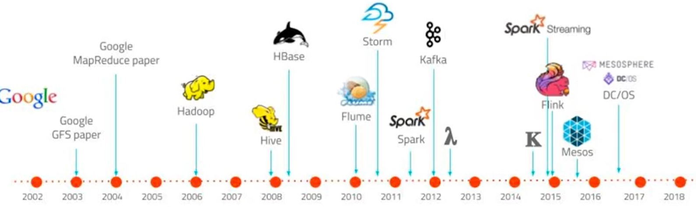

# Flink Notes


## MyNotes

1. https://flink.apache.org/
2. https://nightlies.apache.org/flink/flink-docs-master/zh/docs/deployment/resource-providers/standalone/kubernetes/#kubernetes-%E4%B8%8A%E8%BF%90%E8%A1%8C-standalone-%E9%9B%86%E7%BE%A4%E6%8C%87%E5%8D%97

### 概述

Apache Flink 是一个框架和**分布式处理引擎**，用于对**无界和有界数据流**进行**状态计算**


#### 特点

##### 事件驱动

事件驱动型应用是一类具有状态的应用，它从一个或多个事件流提取数据，并根据到来的事件触发计算、状态更新或其他外部动作。比较典型的就是以kafka 为代表的消息队列几乎都是事件驱动型应用。


##### 流批世界观

- 批：有界、持久、大量，适合需要访问全套记录才能完成的计算工作，一般用于离线统计
- 流：无解、实时，无需针对整个数据集执行操作，而是对通过系统传输的每个数据项执行操作，一般用于实时统计。

spark世界观中：一切都是由批次构成的：

- 离线数据：大批次
- 实时数据：一系列无限的小批次

在flink世界观中：一切都是流构成的

- 离线数据：有界限的流，有开始和结束。有界流的处理成为批处理
- 实时数据：无限的流，有开始无结束，源源不断

这种流的世界观，最大好处就是 **具有极低的延迟**

##### 分层api


最底层级的抽象仅仅提供了有状态流，它将通过过程函数（Process Function）被嵌入到 DataStream API 中。底层过程函数（Process Function）与DataStreamAPI 相集成，使其可以对某些特定的操作进行底层的抽象，它允许用户可以自由地处理来自一个或多个数据流的事件，并使用一致的容错的状态。除此之外，用户可以注册事件时间并处理时间回调，从而使程序可以处理复杂的计算

一般是是针对核心API（Core APIs）进行编程，比如 DataStream API（有界或无界流数据）以及 DataSet API（有界数据集）：转换（transformations），连接（joins），聚合（aggregations），窗口操作（windows）等

Table API 是以表为中心的声明式编程，其中表可能会动态变化（在表达流数据时）。Table API 遵循（扩展的）关系模型：表有二维数据结构（schema）（类似于关系数据库中的表），同时 API 提供可比较的操作，例如 select、project、join、group-by、aggregate 等。Table API 程序声明式地定义了什么逻辑操作应该执行，而不是准确地确定这些操作代码的看上去如何。

Flink 提 供 的 最高 层 级 的 抽 象 是 SQL 。 这 一 层抽 象 在 语法与表达能力上与Table API 类似，但是是以 SQL 查询表达式的形式表现程序。SQL 抽象与Table API 交互密切，同时 SQL 查询可以直接在 Table API 定义的表上执行

Flink 几大模块  

- Flink Table & SQL(还没开发完)  
- Flink Gelly(图计算)  
- Flink CEP(复杂事件处理)

### 快速上手

Flink 程序支持 java 和 scala 两种语言

Flink本身是流批一体的，批量的数据本身也是流。从1.12开始，DataStreamAPI即流批一体，批处理的DataSetAPI没什么用了


批处理：相对静态

流计算：动态，顺序处理


## 极客-Flink核心技术与实战

### 第一章·Apache Flink介绍

#### 课程介绍

流计算主要技术：

1. Apache **STORM**
2. **Spark Streaming**
3. Apache Flink: **低延时、数据一致、高吞吐**

学习关键点：

1. 了解数据处理过程的基本模式：
   - 数据输入 Source
   - 数据处理 Transformation
   - 数据输出 Sink
2. 对真实数据的理解。流处理只是一种挖掘手段
3. 对流计算架构的理解
   - 有状态计算？
   - 数据一致性保障？

课程特点：原理+实践

课程设计：基本概念->开发与实践-核心原理->完整项目实践


#### 流处理技术概览

大数据技术发展：



大数据处理计算模式：


流计算与批计算对比

| item     | 流计算                                   | 批计算                                     |
| -------- | ---------------------------------------- | ------------------------------------------ |
| 时效性   | 实时、低延迟                             | 非实时、高延迟                             |
| 数据特征 | 动态、无边界                             | 静态数据                                   |
| 应用场景 | 实时场景，高实时要求：实时推荐、业务监控 | 实时要求不高，离线计算：数据分析、离线报表 |
| 运行方式 | 计算任务持续进行                         | 计算任务一次性完成                         |

流式计算将成为主流？

1. 实时性要求、低延迟要求
2. 流式技术的成熟
3. 批计算的计算和存储成本
4. **批计算本身就是一种特殊的流计算**，批和流相辅相成

流计算应用场景：

1. 数据实时采集、实时监控
2. 金融股市
3. 实时推荐

流计算框架和产品：

1. 商业产品：IBM InfoSphere Stream
2. 开源：
   - Storm：Twitter v1流处理系统
   - Heron: Twitter v2
   - Apache **Storm**: 基于Record级别处理数据的流处理引擎，延迟低
   - **Samza**: 和Kafka紧密绑定的流处理框架
   - **Spark** Streaming: Spark核心API的一个扩展，高吞吐，具备容错机制
   - Flink：针对流数据、批数据的分布式处理引擎，同时支持原生流处理
   - Apache **Kafka**：为处理实时数据提供一个统一、高通量、低等待的平台，消息中间

主流流式框架-Apache STORM：

1. 最早使用的流处理框架，社区成熟
2. 支持原生流处理，即单事件来处理流数据--**所有记录一个一个处理**
3. 延迟性低-毫秒级
4. 消息保障能力低：**At-least-once**, 不会丢失，可能重复
5. 吞吐较低

主流流式框架-Spark Streaming:

1. 属于Spark API的扩展
2. **以固定时间间隔处理一段段的批处理作业--微批处理**
3. 延迟高-秒级，**exactly-once**：消息不重复不丢失
4. 高吞吐


主流流式框架-Flink:

1. 真正的流处理框架--DateFlow Model
2. 延迟低--毫秒级，exactly-once
3. 高吞吐
4. 原生流处理支持：数据一条一条处理


Why Flink？

1. **低延迟：毫秒级**
2. **高吞吐：每秒千万级**
3. **准确性：exactly-once**
4. 易用性：SQL/Table API/DataSteream API

框架对比：


#### Flink发展历史与应用场景

发展历史：

1. 10-14年柏林几所大学联合发起项目Stratosphere
2. 14年成为Apache Top Level Project，更名Flink
3. 本课程使用的版本是 1.11(2020年12月发布)


应用场景：

1. 实时监控

   - 用户行为预警、APP crash预警、服务器攻击预警
   - 对用户行为或者相关事件进行实时监测和分析，基于风控规则预警：**实时监控平台、信用卡欺诈实时检测**

2. 实时报表：

   - 实时活动大屏
   - 对外数据产品
   - 数据化运营

3. 流数据分析：

   - 实时计算相关指标、及时反馈
   - 内容实时投放、实时推荐

4. 实时数据仓库

   1. 实时清洗、归并、结构化

   2. 数仓补充和优化

      


 #### Flink核心特性

1. 统一数据**处理组件栈**，处理不同类型数据：Batch、Stream、ML、Graph

   

2. 支持事件事件(Event Time), 接入事件(Ingestion Time), 处理事件(Process Time)

   

3. 基于轻量级分布式快照实现的容错

   

4. 支持有状态计算

   - Support for very lart state大状态
   - querable state支持
   - 灵活的state-backend:HDFS,MEM,RocksDB

5. 支持高度灵活的窗口操作：窗口计算

   

6. 带反压的连续流模型

   - 下游算子处理过不来的时候，会反馈给上游节点，进行协调

7. 基于JVM实现独立的内存管理

8. 应用可以超出主内存大小限制，且承受更少的垃圾收集开销

9. 对象序列化二进制存储

### 第二章·Flink部署与应用

#### Flink集群架构

1. 主从架构：Master-Worker
2. JobManager：管理节点，每个集群至少一个，管理整个集群计算资源，job管理与调度执行、checkpoint协调
3. TaskManager：每个集群多个，负责计算资源提供
4. Client：本地执行应用main方法解析JobGraph对象，并将JobGraph提交的JM运行，同时监控job执行状态。


JM：


1. JobGraph -> Execution Graph
2. RPC通信：Actor， TM和JM、和Client通信
3. ResourceManager：资源管理


TM：


Client：


JobGraph：


#### Flink集群运行模式

按如下3个条件：

1. 集群与作业生命周期是否一致
1. 资源隔离程度
2. main方法执行在client还是JM上

分为三种部署模式：


**Session Mode**：

先启动一个集群，保持一个会话，在这个会话中通过客 户端提交作业。集群启动时所有资源就都已经确定，所以所有提交的作业会竞争集群中的资源。作业**共享JM和TM**，**所有job都在一个RUNTIME中**

适合于**单个规模小、执行时间短的大量作业**


Cons: 无资源资格，伸缩性差


Pre-Job Mode：

会话模式因为资源共享会导致很多问题，所以为了更好地隔离资源，我们可以考虑为每个提交的 作业启动一个集群(Runtime)，这就是所谓的单作业（Per-Job）模式

**每个job独享JM、TM，即独享一个RUNTIME**


是实际应用的首选模式

Flink本身无法直接这样运行，所以单作业模式一般需要借助一些资源管理框架 来启动集群，比如YARN、Kubernetes（K8S）


session和pre-job模式的缺点：

Client压力大，需要下载资源、依赖，提交到JM，网络带宽要求很大


Application Mode：

不要客户端了，直接把应用提交到JobManger上运行。而这也就代表着，我们需要为 每一个提交的应用单独启动一个JobManager，也就是创建一个集群。这个JobManager只为执行这一个应用而存在， 执行结束之后JobManager也就关闭了，这就是所谓的应用模式。


#### Flink集群资源管理器支持

目前支持的资源管理器部署集群：

1. Standalone
2. Hadoop YARN
3. Apache Mesos
4. docker
5. k8s


on yarn国内主流，on k8s未来趋势

**Native** 是指可以通过底层的资源调度管理器，实现弹性扩缩容

Native模式部署：在ClusterManagement上启动session集群的时候，只启动JM，不启动TM。当提交job时，动态启动TM、动态申请资源

#### Standalone原理讲解与实操演示

独立集群模式，特点：

1. **分布式**多台物理主机部署
2. **不依赖与资源管理框架**
3. 仅支持session模式
4. 支持HA
5. 测试、学习


Standalone可以使用单机部署、多机部署


单机部署：

1. 下载：https://www.apache.org/dyn/closer.lua/flink/flink-1.17.1/flink-1.17.1-bin-scala_2.12.tgz
1. https://archive.apache.org/dist/flink/flink-1.17.1/
2. 安装1.8java, 配置java环境变量 JAVA_HOME (如果老的机器java是1.7的，把原来的/bin/java rename掉，然后重新source一下/etc/profile)
3. 

注意：目前最新版本是1.17.1，windows支持的最高版本是1.9.3

#### Flink On Yarn部署


#### Fkink on K8s


#### Flink高可用


### 第三章·DataStream API

#### 分布式流处理模型DataFlow

最先有Google一篇DataFlow的论文提出


并发：拆分为算子处理


#### DataStream API


批处理：

```java
    public static void main(String[] args) throws Exception {
        // 0.文件地址
        final String filepath = WordCount.class.getClassLoader().getResource("wordcount.txt").getPath();
        // 1.创建执行环境
        ExecutionEnvironment env = ExecutionEnvironment.getExecutionEnvironment();
        // 2.读取文件-Source
        DataSource<String> ds = env.readTextFile(filepath);
        // 3.转换、分组、求和
        AggregateOperator<Tuple2<String, Long>> sum = ds.flatMap(new FlatMapFunction<String, Tuple2<String, Long>>() {
                    @Override
                    public void flatMap(String line, Collector<Tuple2<String, Long>> out) {
                        String[] words = line.trim().split("\\s+");
                        for (String word : words) {
                            out.collect(Tuple2.of(word, 1L));
                        }
                    }
                })
                .groupBy(0)
                .sum(1);
        // 4.打印：(K, Cnt)
        sum.print();
    }
```

流处理：

```java
    public static void main(String[] args) throws Exception {
        final String filepath = BatchWordCount.class.getClassLoader().getResource("wordcount.txt").getPath();

        // 1.创建流式执行环境
        StreamExecutionEnvironment env = StreamExecutionEnvironment.getExecutionEnvironment();
        // 2.读取环境
        DataStream<String> ds = env.readTextFile(filepath);
        SingleOutputStreamOperator<Tuple2<String, Long>> sum = ds.flatMap(new FlatMapFunction<String, Tuple2<String, Long>>() {
                    @Override
                    public void flatMap(String line, Collector<Tuple2<String, Long>> out) throws Exception {
                        for (String word : line.trim().split("\\s+")) {
                            out.collect(Tuple2.of(word, 1L));
                        }
                    }
                })
                .keyBy(data->data.f0)
                .sum(1);
        sum.print();

        // 执行
        env.execute();
    }
```

区别：

1. 执行环境不同
2. 数据对象不同
3. 操作不同
4. 流处理需要手动执行


数据源：


主要转换操作：


DataStream转换：


#### Flink时间概念

- 事件时间：事件发生的时间，事件在其设备上发生的时间，Flink基于事件时间处理
- 处理时间


## 尚硅谷大数据之Flink

### Flink概述

#### Flink是什么

核心目标：**数据流上的有状态计算**

Flink：用于对 **无界和有界** 数据进行 **有状态计算** 的分布式处理引擎


有界与无界流：

1. 无界数据流：
   - 流 **有开始，无结束**
   - 不断产生数据
   - 必须持续处理，不能等数据全部到达后处理，数据是无限的
2. 有界数据流：
   - 流 **有开始和结束**
   - 可以再**摄取所有数据后再计算**
   - 数据可以被**排序**，因此**不需要有序摄取**
   - 有界流处理通常称为--**批处理**


有状态流处理：

把流处理需要的 **额外数据保存成一个状态**，然后针对这条数据进行处理，并更新状态。


1. 状态在内存中：速度快，但是可靠性差
2. 状态在分布式系统中：可靠性高，速度慢

#### Flink特点

1. 高吞吐低延迟：每秒百万级事件，毫秒延迟
2. 结果准确性：提供事件时间、处理时间予以。对于乱序事件流，事件语义仍能提供一致且准备的结果
3. exactly-once的状态一致性保证
4. 高可用

#### Flink vs. Spark Streaming

spark以批处理为根本：

1. 数据模型: 采用RDD模型，Spark Streaming的Dstream实际上是一组组小批数据RDD集合---**微批处理**
2. 运行时架构：**spark是批计算，将DAG划分为不同的stage，一个完成后才可以计算下一个**


Flink以流处理为根本：

1. 数据模型: 基础数据模型是**数据流**，以及**事件序列**
2. 运行时架构：标准的 **流执行模式**，一个时间在一个节点处理完成后可以直接发往下一个节点处理

|          | Flink              | Spark Streaming                    |
| -------- | ------------------ | ---------------------------------- |
| 计算模型 | 流                 | **微批**                           |
| 时间语义 | 事件时间，处理时间 | 处理时间                           |
| 窗口     | 多、灵活           | 少，不灵活--窗口必须是批次的整数倍 |
| 状态     | 有                 | 无                                 |
| 流式SQL  | 有                 | 无                                 |

#### Flink分层API


- 越顶层越抽象，表达含义越简明，使用越方便 

- 越底层越具体，表达能力越丰富，使用越灵活

4层：

1. 有状态流处理：通过**底层API（处理函数）**，对最原始数据加工处理。底层API与DataStream API相集成，可以处理复杂的计算。 
2. DataStream API（流处理）和DataSet API（批处理）封装了底层处理函数，提供了通用的模块，比如转换（transformations，包括 map、flatmap等），连接（joins），聚合（aggregations），窗口（windows）操作等。注意：**Flink1.12以后，DataStream API已经实现 真正的流批一体，所以DataSet API已经过时**。 
3. Table API 是**以表为中心的声明式编程**，其中表可能会动态变化。Table API遵循关系模型：表有二维数据结构，类似于关系数据库 中的表；同时API提供可比较的操作，例如select、project、join、group-by、aggregate等。我们可以在表与 DataStream/DataSet 之间无缝 切换，以允许程序将 Table API 与 DataStream 以及 DataSet 混合使用。 
4. SQL这一层在语法与表达能力上与 Table API 类似，但是是以SQL查询表达式的形式表现程序。SQL抽象与Table API交互密切，同 时SQL查询可以直接在Table API定义的表上执行。

### Flink部署

#### 部署模式

##### session模式

先启动一个集群，保持一个回话，回话中通过客户端提交作业。

集群启动时所有的资源都已经确定，job竞争资源。

##### 单作业模式PreJob

为了资源隔离：每个提交的作业启动一个集群，作业完毕时关闭集群释放资源。必须要借助资源调度框架

##### 应用模式

client解析、下载资源后提交给TM，网络带宽压力大---不要client了，直接把job提交到JM，也就是创建一个集群。


三上三种部署模式是抽象的，需要结合资源管理平台，才会有具体的部署模式：

1. Standalone
   1. session模式：
      1. 不依赖资源调度平台
      2. 使用 start-cluster.sh启动
   2. 单作业模式
      1. Flink 的 Standalone 集群并不支持单作业模式部署，需要资源调度平台
   3. 应用模式：
      1. 不提前创建集群，因此不能使用 start-cluster.sh启动
      2. 使用standalone-job.sh创建JM，taskmanager.sh启动TM
2. YARN模式：客户端把应用提交给Yarn的ResourceManager，RM向NodeManager申请容器，容器中会部署JM、TM实例，从而启动集群。会根据作业需要的Slot数量分配TaskManager资源
   1. session模式
   2. pre-job模式
   3. application模式
3. K8S运行模式

| 部署模式\资源调度平台 | Standalone | YARN | K8S  |
| --------------------- | ---------- | ---- | ---- |
| session               |            |      |      |
| pre-job               |            |      |      |
| application           |            |      |      |

### Flink运行时架构

#### 系统架构

—Standalone会话模式为例


JobManager：任务管理、调度核心，是控制应用执行的主进程，每个应用都应该被唯一的JobManager所控制执行。JobManager包含三部分：

1. JobMaster：负责处理单独的作业(JOB)，所以**JobMaster和Job一一对应**（早期Flink没有JobMaster的概念，之前Manager概念范围较小，实际就是现在所说的Master）。Master会先接收到应用，然后吧JobGraph转换成一个物理层面的数据流图---执行图ExecutionGraph，它包含了所有可以并发执行的任务，Master向resourceManger发出请求，申请资源，申请到后会分发到taskManager上。运行过程中，Master会负责所有的中央协调，比如checkpoints的协调。
2. 资源管理器RM：负责资源的分配和管理，flink集群中只有一个，资源即：taskmanager的任务槽Task Slots。**slot是flink中的资源调配单元**，包含一组CPU和内存资源，每一个任务Task都需要分配到一个slot上执行。
3. 分发器Dispatcher：提供一个rest接口，用来提交应用，为每一个Job启动一个新的JobMaster。Dispatcher也会启动一个web UI，展示和监控执行的信息

任务管理器TaskManager：

是flink中的 **工作进程**，负责数据流的计算。每个TM都包含一定数量的slots，slot数量决定TM并行处理的任务数。

#### 核心概念

##### 并行度Parallelism

一个算子operator可以被复制到多个节点---子任务subtask---并行计算

算子的子任务个数--并行度

包含并行子任务的数据就————并行数据流，它需要多个分区(stream partition)来分配并行任务

流程序的并行度，可以认为是所有算子中最大的并行度


设置方式：

1. 算子或者执行环境的setParallelism()方式，局部和全局设置
2. 提交时通过参数设置：flink run -p 2
3. 配置文件默认并行度：parallelism.default: 2

##### 算子链 operator chain

算子间数据传输有多种，取决于算子类型：

1. **一对一/直通(one-to-one, forwarding)**:数据流维护着分区、元素顺序，前后算子以及子算子都维持着一对一的关系，类似与**spark中的窄依赖**
2. 重分区Redistributing：数据流的分区会发生改变，每个子任务，会根据策略，将数据发送到不同的下游目标。类似 **spark中的shuffle**


合并算子链：

**并行度相同的一对一 算子操作，可以链接在一起，形成一个大任务，在同一个线程中执行** ————算子链


算子链的好处：减少线程之间的切换和基于缓存区的数据交 换，在减少时延的同时提升吞吐量

Flink默认按照原则进行合并，可以手动禁掉：.disableChaining()

##### 任务槽Task Slots

Task Slots：

Flink中，每一个TM都是一个JVM进程，可以启动多个线程执行子任务subtask，因此子任务之间相互竞争资源

TM上每个任务运行占用的资源做出明确的划分----任务槽slots

加入一个TM有三个slot，那么它将管理的内存平均分为三份，每个slot独自占据一份，执行时不会和其他子任务竞争


设置：flink-config中：taskmanager.numberOfTaskSlots: 8

默认是1

注意：slot仅仅隔离内存，不隔离CPU，因此一般配置WieCPU核心数


## 官方文档

https://flink.apachecn.org/#/docs/1.7-SNAPSHOT/2

Apache Flink是一个用于分布式流和批处理数据处理的开源平台。Flink的核心是流数据流引擎，为数据流上的分布式计算提供数据分发，通信和容错。Flink在流引擎之上构建批处理，覆盖本机迭代支持，托管内存和程序优化。

### 基本概念

#### 数据流编程模型

Flink提供不同级别的抽象来开发 流/批处理 应用程序


