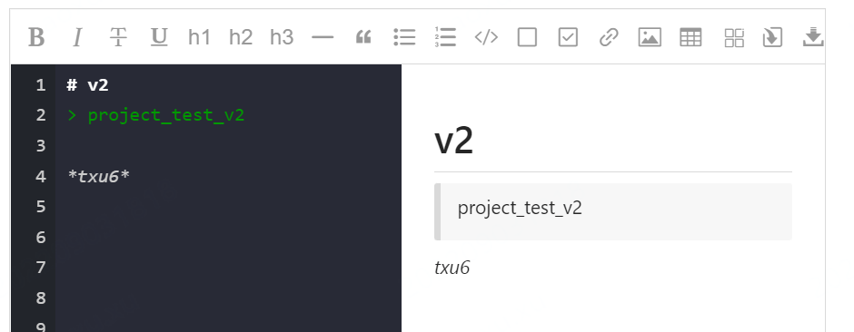

# FrontEnd Notes

## CSS

### Style

#### word-break

```css
style="word-break: break-word"
```

单词内换行

#### 获取屏幕高度

calc()函数用于动态计算长度值。

需要注意的是，运算符前后都需要保留一个空格，例如：width: calc(100% - 10px)；

任何长度值都可以使用calc()函数进行计算；

calc()函数支持 "+", "-", "*", "/" 运算；

calc()函数使用标准的数学运算优先级规则；

所以，只需设置div的高度height为calc(100vh)即可,100vh = 视窗高度的100%

```
div {
width: 100%;
height: calc(100vh);
}
```


#### vh

vh，是指[CSS](https://baike.baidu.com/item/CSS/5457?fromModule=lemma_inlink)中相对长度单位，表示相对[视口](https://baike.baidu.com/item/视口?fromModule=lemma_inlink)高度（Viewport Height），1vh = 1% * [视口](https://baike.baidu.com/item/视口?fromModule=lemma_inlink)高度。


## Vue

### 绑定与深克隆

使用v-model绑定一个对象时，如果要更新对象，尽量全局更新，而不是对该对象的一个个属性逐个更新

### 生命周期

#### activated

说到activated不得不提到[keep-alive](https://cn.vuejs.org/v2/api/#keep-alive)，你切换出去又切出来会调用到它。（你可以理解为生命周期钩子函数，用法也一样）

**activated**：是组件被激活后的钩子函数，`每次回到页面都会执行`

1.这里有个关键词是实例，也就是说如果你用了$refs，你就得注意了。
2.mounted先执行，首次进入时候两个一起执行


### v-model

Vue中绑定千万不要加this

```html
<el-input type="textarea" v-model="this.hiveMetaRemark"></el-input>
// 这样一定会报错
// 不要加this.
 <el-input type="textarea" v-model="hiveMetaRemark"></el-input>
```

### 引入html与传值

```
<!-- https://blog.csdn.net/qq_41038929/article/details/120568082 -->
```

### 修改依赖库

https://blog.csdn.net/xxitcef/article/details/117378817

思想：把源码复制到另一个地方，改动后打包，直接改dist下的则不用打包，然后复制到node_modules

### ref

ref 是组件的属性，用来辅助开发者在**不依赖 jQuery 的情况**下，**获取 DOM 元素或组件**的引用。

每个 vue 的组件实例上，都包含一个 **`$refs` 对象**，里面存储着对应的 DOM 元素或组件的引用。**默认情况下，组件的 $refs 指向一个空对象。**

```
<h3 ref="myh3">MyRef</h3>
<button @click="getRef">获取 $refs 引用</button>
​
methods: {
    getRef () {
        // 通过 this.$refs 引用的名称 可以获取到 DOM 元素的引用
        console.log(this.$refs.myh3)
        // 操作 DOM 元素，把文本颜色改为红色
        this.$refs.myh3.style.color = 'red'
    }
}
```


```
<counter ref="counterRef"></counter>
<button @click="getRef">获取 $refs 引用</button>
​
methods: {
    getRef () {
        // 通过 this.$refs 引用的名称 可以引用组件实例
        console.log(this.$refs.counterRef)
        // 引用到组件的实例之后，就可以调用组件上的 methods 方法
        this.$refs.counterRef.add()
    }
}
```

注意：使用 $refs 获得的是原生的 DOM 对象时，可以对其进行原生对象的操作。

```
<input type="text" v-if="flag" ref="ipt" placeholder="v-if">
<button @click="showinput" v-else>输入框</button>
​
showinput() {
  this.flag = true;
  this.$refs.ipt.focus();
}
```

以上代码并不能使得文本框获取焦点，会报错。因为当 v-if 改为 true 时，更新的 DOM 元素还没有更新完成，所以不能立马获取到该元素。得等下一个周期才可以获取到，也就是说点击第二次的时候，文本框才会获取焦点。

这时我们可以使用 `this.$nextTick(cb)` 方法，**此方法会其中的回调函数 cb 推迟到下一个 DOM 更新周期之后执行。** 这样一来回调函数中就可以操作到最新的 DOM 元素。

```
<input type="text" v-if="flag" ref="ipt" placeholder="v-if">
<button @click="showinput" v-else>输入框</button>
​
showinput() {
  this.flag = !this.flag;
  this.$nextTick(() => {
    if (this.$refs.ipt) {
        this.$refs.ipt.focus()
    }
  });
}
```


## JS

### 三点运算符

三个点（...）真名叫扩展运算符，是在ES6中新增加的内容，它可以在函数调用/数组构造时，将数组表达式或者string在语法层面展开；还可以在构造字面量对象时将对象表达式按照key-value的方式展开

说白了就是把衣服脱了，不管是大括号（[]）、花括号（{}），统统不在话下，**全部脱掉脱掉！**

```javascript
// 数组
var number = [1,2,3,4,5,6]
console.log(...number) //1 2 3 4 5 6
//对象
var man = {name:'chuichui',height:176}
console.log({...man}) / {name:'chuichui',height:176}
```

注意，只能脱一层。

可以用来实现浅克隆.

```javascript
const form = { ...this.form }

form.meta = { ...this.form.meta }
form.model = { ...this.form.model } // 手动深克隆
```

当我们想把数组中的元素迭代为函数参数时，用它！

### Clone

#### `Object.assign()` Method

浅拷贝，简单快速，ES6

`Object.assign(target, source1, soure2, ...)` method. This method copies all enumerable own properties of one or more source objects to a target object, and returns the target object:

```javascript
const moreFruits = Object.assign({}, fruits);
```

#### Spread Operator

The spread operator (`...`)

ES6 浅拷贝

和Object.assign()类似

```javascript
const moreFruits = { ...fruits };
```

#### JSON Methods

If your object only contains primitive types, and doesn't include nested or external objects, arrays, `Date` objects, functions, and so on, you can easily create a deep clone of the object by using [JSON methods] (https://attacomsian.com/blog/json-parse-stringify): `JSON.stringify()` and `JSON.parse()`:

#### Lodash's `cloneDeep()` Method

[Lodash] (https://lodash.com/docs/4.17.15#cloneDeep) provides the `cloneDeep()` method that recursively copies everything in the original object to the new object. It works for all data types, including functions, nested objects, arrays, and symbols.

```javascript
const _ = require('lodash');

const obj = {
    name: 'John Doe',
    age: 45,
    address: {
        city: 'Berlin',
        country: 'DE'
    },
    job: undefined,
    credits: Infinity
};

const cloned = _.cloneDeep(obj);

console.log(cloned);
```

### delete

 **`delete` 操作符**用于删除对象的某个属性；如果没有指向这个属性的引用，那它最终会被释放。

```javascript
const Employee = {
  firstname: 'John',
  lastname: 'Doe'
};

console.log(Employee.firstname);
// expected output: "John"

delete Employee.firstname;

console.log(Employee.firstname);
// expected output: undefined
```

 *expression* 的计算结果应该是某个属性的引用，例如：

```javascript
delete object.property
delete object['property']
```

对于所有情况都是`true`，除非属性是一个[`自身的`][`不可配置`]的属性，在这种情况下，非严格模式返回 `false`。

注意：

- 如果你试图删除的属性不存在，那么delete将不会起任何作用，但仍会返回true

- 如果对象的原型链上有一个与待删除属性同名的属性，那么删除属性之后，对象会使用原型链上的那个属性（也就是说，delete操作只会在自身的属性上起作用）

- 任何使用 

  `var`

   声明的属性不能从全局作用域或函数的作用域中删除。

  - 这样的话，delete操作不能删除任何在全局作用域中的函数（无论这个函数是来自于函数声明或函数表达式）
  - 除了在全局作用域中的函数不能被删除，在对象(object)中的函数是能够用delete操作删除的。

- 任何用[`let`]或[`const`]声明的属性不能够从它被声明的作用域中删除。

- 不可设置的(Non-configurable)属性不能被移除。这意味着像[`Math`], [`Array`], [`Object`]内置对象的属性以及使用[`Object.defineProperty()`]方法设置为不可设置的属性不能被删除。

### if

null、undefined、0都会被判false


0：注意


## ElementUI

### vue修改elementui行内样式

比如el-autocomplete的宽度自适应

关于修改element内置样式
首先自定义class，列如：<div class="main">element的内容</div>
第1种.main >>> .el-bottom{}
第2种 .main /deep/ .el-bottom{}
第3种 .main ::v-deep .el-bottom{} 在使用vue-admin-element中/deep/无效时
要修改element的行内样式-----用以上方法加!important


```sql
  .hive-suggest /deep/ .el-autocomplete-suggestion{
    width: auto!important;
  }
```

### el-col内元素居中

```css
style={ 

    position: relative;

    top:50%;

    transform:translateY(-50%);

}


<el-col :span="2">
    <el-button size="mini" type="success" circle style="line-height: 100%; position: relative;left: 50%; transform:translateX(-50%);">vs</el-button>
</el-col>
```

### 修改样式：穿透样式

```css
<style lang="scss" scoped>
 .el-textarea /deep/ .el-textarea__inner{
  background: #000;
}
```


## Webpack

### webpackJsonp 

vue打包上线项目报错webpackJsonp is not defined

在[vue]单页面项目出现该问题是由于使用了CommonsChunkPlugin这个插件。
场景： 本地调试是没有问题，但是打包上线就会出现 `Uncaught ReferenceError: webpackJsonp is not defined`

原因：这是因为**公共文件必须在自己引用的js文件之前引用**。

方案：
文件位置 build/[webpack](https://so.csdn.net/so/search?from=pc_blog_highlight&q=webpack).prod.conf.js
添加代码：

```java
  chunks: ['manifest', 'vendor', 'app'],
```


```html
new HtmlWebpackPlugin({
  filename: 'index.html',
  template: 'index.html',
  inject: true,
  favicon: resolveApp('favicon.ico'),
  minify: {
    removeComments: true,
    collapseWhitespace: true,
    removeRedundantAttributes: true,
    useShortDoctype: true,
    removeEmptyAttributes: true,
    removeStyleLinkTypeAttributes: true,
    keepClosingSlash: true,
    minifyJS: true,
    minifyCSS: true,
    minifyURLs: true
  },
  path: config.build.assetsPublicPath + config.build.assetsSubDirectory,
  // necessary to consistently work with multiple chunks via CommonsChunkPlugin

	// 解决打包公用代码没用添加进去
    chunks: ['manifest', 'vendor', 'app'],

  chunksSortMode: 'dependency'
}),
```

### 打包问题

#### 打包ERROR in static

> blog.csdn.net/u013868665/article/details/90412024

你最后哪个js文件报错，在build文件夹中的webpack.base.conf.js文件中，把jsloader下面最后的路径保留到那个文件夹。

比如：你最后报错的文件为 xxx/aa/b.js ，那么 应该把最后一行代码加上“,resolve('node_modules/xxx/aa')”


```
{
 
test: /\.js$/,
 
loader: 'babel-loader',
 
include: [resolve('src'), resolve('test'),resolve('node_modules/xxx/aa')]
 
},
```


## Node.js

### node-gyp

gyp:generate your project

gyp是一种根据c++源代码编译的工具，node-gyp就是为node编译c++扩展的时候使用的编译工具。


## 组件库

### Lodash

https://www.lodashjs.com/

Lodash 是一个一致性、模块化、高性能的 JavaScript 实用工具库


### Markdown

#### vue-markdown

https://github.com/Edwin-Xu/vue-markdown

md-编辑器, 很强




### 全屏

#### screenfull 

npm install screenfull --save

https://blog.csdn.net/qq_44774831/article/details/116144320

#### vue-fullscreen


https://blog.csdn.net/m0_60336681/article/details/120726564

```sql
 npm install vue-fullscreen --save
 
import fullscreen from 'vue-fullscreen'

  Vue.use(fullscreen)


<template>
  <div>
    
    <fullscreen :fullscreen.sync="fullscreen">
      
      //fullscreen组件内包裹的内容，即为全屏显示的内容     
    </fullscreen>

    <button @click="toggle">点击全屏</button>
  
  </div>
</template>

<script>
  export default{
    data(){
      return{
        fullscreen:false

      }
    },
    methods: {
      toggle(){
        this.fullscreen=!this.fullscreen
      }
    }
  }
</script>

<style lang="scss">
</style>

```


