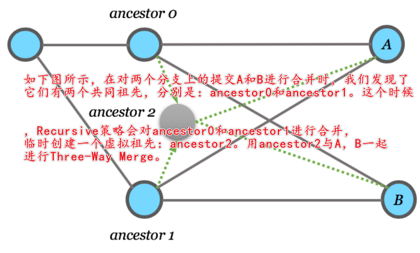
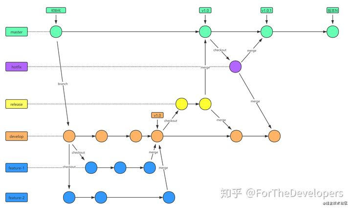

# Git Notes

## 多用户

https://blog.csdn.net/yuanlaijike/article/details/95650625

```bash
git config --global --list
```

清除：

```bash
git config --global --unset user.username 
git config --global --unset user.email
```


生成公钥秘钥

```bahs
ssh-keygen -t rsa -C '1603837506@qq.com' -f id_rsa_github
ssh-keygen -t rsa -C 'taoxu.xu@qunar.com' -f id_rsa_gitlab
ssh-keygen -t rsa -C 'taoxu.xu@qunarservers.com' -f id_rsa_git_ctrip_qunarservers
ssh-keygen -t rsa -C 'txu6@trip.com' -f id_rsa_gitlab_
```

把公钥设置到对于git远程仓库的SSH中心

把私钥添加到本地仓库

```bash
$ ssh-add ./id_rsa_github
Identity added: ./id_rsa_github (“1603837506@qq.com”)
taoxu.xu@QFD-xutao MINGW64 ~/.ssh
$ ssh-add ./id_rsa_gitlab
Identity added: ./id_rsa_gitlab (“taoxu.xu@qunar.com”)
ssh-add ./id_rsa_gitlab_ctrip

# 或者使用绝对地址
ssh-add /c/Users/taoxu.xu/.ssh/id_rsa_gitlab
ssh-add /c/Users/taoxu.xu/.ssh/id_rsa_github
```

> 若出现Could not open a connection to your authentication agent.
>
> 使用  ssh-agent bash 配置代理:
>
> `ssh-agent`是用于管理`SSH private keys`的, 目的就是对解密的私钥进行高速缓存。`ssh-add`提示并将用户的使用的私钥添加到由`ssh-agent`维护的列表中；`git`拉取代码的时候，直接使用这里的ssh私钥和远端库中的公钥做认证，不用手动再输入密码。

验证sshadd:

```bash
$ ssh-add -l
3072 SHA256:Y20e04Gpv0EsIoNYCUKXopA0u8O3VK5TyepULXZ+WyY “1603837506@qq.com” (RSA)
3072 SHA256:fhzHh6avXCD0D9+sdPpQ+nOrxS2jhpMAV7yxFgs6A6o “taoxu.xu@qunar.com” (RSA)
```

管理秘钥：需要在本地创建一个密钥配置文件，通过该文件，实现**根据仓库的 remote 链接地址自动选择合适的私钥**。

编辑 `~/.ssh` 目录下的 `config` 文件，如果没有，请创建。

```bash
Host gitlab.corp.qunar.com
HostName gitlab.corp.qunar.com
User taoxu.xu
PreferredAuthentications publickey
IdentityFile ~/.ssh/id_rsa_gitlab


Host github.com
HostName github.com
User Edwin-Xu
PreferredAuthentications publickey
IdentityFile ~/.ssh/id_rsa_github
```

> - **Host**：仓库网站的别名，随意取
> - **HostName**：仓库网站的域名（PS：IP 地址应该也可以）
> - **User**：仓库网站上的用户名
> - **IdentityFile**：私钥的绝对路径
>
>  Host 就是可以替代 HostName 来使用的别名，比如我 github 上某个仓库的 clone 地址为：
>
> ```shell
> git@github.com:jitwxs/express.git
> ```
>
> 那么使用 Host 后就是：
>
> ```shell
> git@github:jitwxs/express.git
> ```

用 `ssh -T` 命令检测下配置的 Host 是否是连通

```bash
$ ssh -T git@github.com
Hi Edwin-Xu! You've successfully authenticated, but GitHub does not provide shell access.

taoxu.xu@QFD-xutao MINGW64 ~/.ssh
$ ssh -T git@gitlab.corp.qunar.com
Welcome to GitLab, 许涛!
```


连是连上了，但是ssh-add仅限于当前bash，当打开新的bash时失效。

于是取巧：在

 git 的安装目录的 bash.bashrc 文件，末尾添加：

```sql
eval "$(ssh-agent -s)"
ssh-add /c/Users/taoxu.xu/.ssh/id_rsa_gitlab
ssh-add /c/Users/taoxu.xu/.ssh/id_rsa_github
ssh-add /c/Users/taoxu.xu/.ssh/id_rsa_gitlab_ctrip
```

每次新打开就会自动执行


-------------

```bash
git config --local user.name "Edwin-Xu"
git config --local user.email "1603837506@qq.com"

git config --local user.name "taoxu.xu"
git config --local user.email "taoxu.xu@qunar.com"
```

```bash
git config --global user.name "许涛"
git config --global user.email "taoxu.xu@qunar.com"

git config --global user.name "Edwin-Xu"
git config --global user.email "1603837506@qq.com"
```

## 常见命令

### git commit --amend

有时你提交过代码之后，发现一个地方改错了，你下次提交时**不想保留上一次的记录**；或者你上一次的commit message的描述有误，这时候你可以使用接下来的这个命令：git commit --amend。

- --amend只能修改最近的一次 commit

- 该操作会改变你原来的commit id：最近的那一次 commit物件的 SHA1 被新的 SHA1 值替代，因为对于 `commit 物件` 来说它的内容发生了改变

- commit 的时间并未被修改，因为时间作者信息是由 `tree物件` 储存，文件、文件目录结构啥都没变，tree物件不可能变化
- commit 不只是改变message，而是有实际的提交的

### git log 

```bash
# 图形化查看git log
git log --graph --oneline --all
```

### git merge

```bash
# 撤销合并
git merge --abort
```

### git rm

```shell
git rm --cached file
```

is used to untrack files in a Git branch. This command will remove the `file` from the staging area and *also* will remove the file from the repository next time you commit.

和

```
git update-index --assume-unchanged <file>
```

有区别


## Git分支类型

### master

- master 为产品主分支，该分支为只读唯一分支，也是用于部署生产环境的分支，需确保master分支的稳定性。
- master 分支一般由release分支或hotfix分支合并，任何情况下都不应该直接修改master分支代码。
- 产品的功能全部实现后，最终在master分支对外发布，另外所有在master分支的推送应该打标签（tag）做记录，方便追溯。
- master 分支不可删除。

### develop

- develop 为主开发分支，基于master分支创建，始终保持最新完成功能的代码以及bug修复后的代码。
- develop 分支为只读唯一分支，只能从其他分支合并，不可以直接在该分支做功能开发或bug修复。
- 一般开发新功能时，feature分支都是基于develop分支下创建的。
- develop 分支包含所有要发布到下一个release的代码。
- feature功能分支完成后, 开发人员需合并到develop分支(不推送远程)，需先将develop分支合并到feature，解决完冲突后再合并到develop分支。
- 当所有新功能开发完成后，开发人员并自测完成后，此时从develop拉取release分支，进行提测。
- release或hotfix 分支上线完成后, 开发人员需合并到develop分支并推送远程。
- develop 分支不可删。

### freture

- feature 分支通常为新功能或新特性开发分支，以develop分支为基础创建feature分支。
- 分支命名: feature/ 开头的为新特性或新功能分支，建议的命名规则: feature/user_createtime_feature，例如：feature/ftd_20201018_alipay，含义为：开发人员ftd在2020年10月18日时创建了一个支付宝支付的功能分支。
- 新特性或新功能开发完成后，开发人员需合到develop分支。
- feature 分支可同时存在多个，用于团队中多个功能同时开发。
- feature 分支属于临时分支，功能完成后可选删除。

### release

- release 分支为预上线分支，基于本次上线所有的feature分支合并到develop分支之后，从develop分支创建。
- 分支命名: release/ 开头的为预上线分支，建议的命名规则: release/version_publishtime，例如：release/v2.1.1_20201018，含义为：版本号v2.1.1计划于2020年10月18日时发布。
- release 分支主要用于提交给测试人员进行功能测试。发布提测阶段，会以release分支代码为基准进行提测。测试过程中发现的bug在本分支进行修复，上线完成后需合并到develop/master分支并推送远程。
- release 分支属于临时分支，产品上线后可选删除。

当有一组feature开发完成后，首先开发人员会各自将最新功能代码合并到develop分支。进入提测阶段时，开发组长在develop分支上创建release分支。 如果在测试过程中发现bug需要修复，则直接由开发者在release分支修复并提交。当测试完成后，开发组长将release分支合并到master和develop分支，此时master为最新可发布代码，用作产品发布上线

### hotfix

- hotfix 分支为线上bug修复分支或叫补丁分支，主要用于对线上的版本进行bug修复。
- 分支命名: hotfix/ 开头的为修复分支，它的命名规则与 feature 分支类似，建议的命名规则: hotfix/user_createtime_hotfix，例如：hotfix/ftd_20201018_alipaybugfix，含义为：开发人员ftd在2020年10月18日时创建了一个支付宝支付bug修复的分支。
- hotfix 分支用于线上出现紧急问题时，需要及时修复，以master分支为基线，创建hotfix分支。当问题修复完成后，需要合并到master分支和develop分支并推送远程。
- 所有hotfix分支的修改会进入到下一个release。
- hotfix 分支属于临时分支，bug修复上线后可选删除。

## 分支合并策略

$ git merge 要合并进来的分支名 --strategy=合并策略

$ git merge origin/master -s resolve

可以指定的合并策略有：

- resolve：
- recursive
- octopus
- ours
- subtree

默认情况下，Git在合并分支时会自动选择最合适的Merge策略，我们也可以通过参数`-s`显式指定策略。不同的策略会对合并的方式与结果产生不同的影响

### recursive

Recursive策略是Git在对两个分支进行合并时所采用的默认策略

只适用于两个分支之间的合并。此，对于超过两个分支的合并，需要反复地进行两两合并，才能最终完成所有分支的合并（这也是Recursive名字的由来）

本质上，Recursive就是一种Three-Way Merge。它的特点在于，如果Git在寻找共同祖先时，在参与合并的两个分支上找到了不只一个满足条件的共同祖先，它会先对共同祖先进行合并，建立临时快照。然后，把临时产生的“虚拟祖先”作为合并依据，再对分支进行合并。



Criss-Cross现象：https://morningspace.github.io/tech/git-merge-stories-2/


### Ours和Theirs参数

在处理合并时，和其他某些Merge策略一样，Recursive策略通常会尽量自动完成合并。**如果在合并过程中发现冲突，Git会在被合并的文件里插入冲突标记（merge conflict markers），并标记当前文件存在冲突，然后交由人工来处理。**

不过，我们也可以通过指定参数告诉Git，当发生冲突时自动选择或丢弃其中一个分支上的修改。比如，假设我们要把分支B合并到分支A。如果指定参数`-Xours`，则表明丢弃分支B上的修改，保留当前分支A上的内容；指定参数`-Xtheirs`则刚好相反。

这里要注意的是，这两个参数只在发生冲突时起作用。而正常情况下，即没有发生冲突时，Git还是会帮我们自动完成合并的

```bash
git merge -Xours -m c9 feature1
git merge -Xtheirs -m c9 feature1
```

### Resolve策略

和Recursive策略类似，Resolve策略是另一种解决两个分支间合并问题的策略，同样也是采用的Three-Way Merge算法。关于它的介绍，网络上资料不多。只知道它是在Recursive策略出现之前，Git合并时所采用的默认策略。和Recursive策略不同的是，它在处理Criss-Cross情况时，会在多个满足条件的共同祖先里选取其中一个作为合并的基础（称为Merge Base）。在某些情况下，如果使用Recursive策略作为默认策略进行合并时遇到了问题，也可以尝试选择Resolve策略。

### Ours策略

前面提到了，如果在使用Recursive策略时指定`-Xours`参数，那么当发生冲突时，Git会选择丢弃来自被合并分支的修改，而保留被当前分支上的原有修改。这种情况只在有冲突时才会发生，如果没有冲突，Git还是会帮我们自动完成合并的。

与之不同的是，Ours策略无论有没有冲突发生，都会毫不犹豫的丢弃来自被合并分支的修改，完整保留当前分支上的修改。所以，对于Ours策略而言，实质上根本就没有做任何真正意义上的合并，或者说做的是假合并（fake merge）。不过，从提交历史上看，Git依然会创建一个新的合并提交（merge commit），并让它的parent分别指向参与合并的两个分支上的提交记录

所以一定要区分两种形式：

- -Xours:表示在冲突时选择冲突部分的选择
- -s ours：加合并，全部选择自己的


## **Git日志规范**

**「目前，社区有多种 Commit message 的写法规范。来自Angular 规范是目前使用最广的写法，比较合理和系统化。建议使用如下：」**

```text
# EN
<type>(<scope>): <subject>
<BLANK LINE>
<body>
<BLANK LINE>
<footer>

# CN
<类型>[可选的作用域]: <描述>
[可选的正文]
[可选的脚注]
```

- type: 本次 commit 的类型，诸如 bugfix、docs、style 等，类型说明参见下方。
- scope: 本次 commit 影响的范围，比如数据层、控制层、视图层等等，视项目不同而不同。
- subject: 简明扼要的阐述下本次 commit 的主旨，是 commit 目的的简短描述，建议不超过50个字符。
- body: 在主体内容中我们需要把本次 commit 详细的描述一下，比如此次变更的动机，详细的修改方法或其他需要额外重点说明的内容。
- footer: 描述下与之关联的 issue 或 break change

### **Type的类别说明：**

```text
# 主要type
feat: 增加新功能
fix: 修复bug
 
# 特殊type
docs: 只改动了文档相关的内容
style: 不影响代码含义的改动，例如去掉空格、改变缩进、增删分号
build: 构造工具的或者外部依赖的改动，例如webpack，npm
refactor: 代码重构时使用
revert: 执行git revert打印的message
 
# 暂不使用type
test: 添加测试或者修改现有测试
perf: 提高性能的改动
ci: 与CI（持续集成服务）有关的改动
chore: 不修改src或者test的其余修改，例如构建过程或辅助工具的变动
```

eg:

```text
# fix：修复支付宝支付bug
#
# 1，修复支付完成后未查询支付状态问题
# 2，增加定时任务保证支付状态完整
#
# link：http://github.com/ftd/shopmall/issue001
```

## git 工作流




git log: commit

git reflog: 所有操作，如clone

git fetch 拉去远程仓库到本地仓库


git merge 是两个分支相交，产生一个新的分支

git rebase 是线性的，没有分支。找到两个分支的第一个父节点，把该父节点后的一个分支应用到另一个分支的后面


## 其他

### .gitignore

不追踪(untracked)这些文件

忽略文件原则

1. 忽略操作系统自动生成的文件，比如缩略图等；
2. 忽略编译生成的中间文件、可执行文件等，也就是如果一个文件是通过另一个文件自动生成的，那自动生成的文件就没必要放进版本库，比如Java编译产生的*.class*文件；
3. 忽略你自己的带有敏感信息的配置文件，比如存放口令的配置文件。


语法规范（熟悉正则很容易理解）

- 空行或是以#开头的行即注释行将被忽略；
- 以斜杠 “/” 结尾表示目录；
- 以星号 “*” 通配多个字符；
- 以问号 “?” 通配单个字符
- 以方括号 “[]” 包含单个字符的匹配列表；
- 以叹号 “!” 表示不忽略(跟踪)匹配到的文件或目录；
- 可以在前面添加斜杠 “/” 来避免递归,下面的例子中可以很明白的看出来与下一条的区别。


```bash
# 忽略 .a 文件
*.a

# 但否定忽略 lib.a, 尽管已经在前面忽略了 .a 文件
!lib.a

# 仅在当前目录下忽略 TODO 文件， 但不包括子目录下的 subdir/TODO
/TODO

# 忽略 build/ 文件夹下的所有文件
build/

# 忽略 doc/notes.txt, 不包括 doc/server/arch.txt
doc/*.txt

# 忽略所有的 .pdf 文件 在 doc/ directory 下的
doc/**/*.pdf
```

注意：

`/A` 和 `A/`是有很大区别的：

- `/A`是目录A下的文件
- `/A`是目录A下所有文件，包含所有子目录


