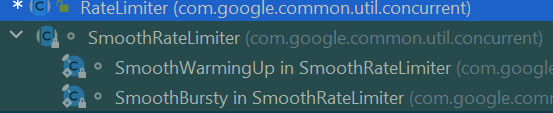
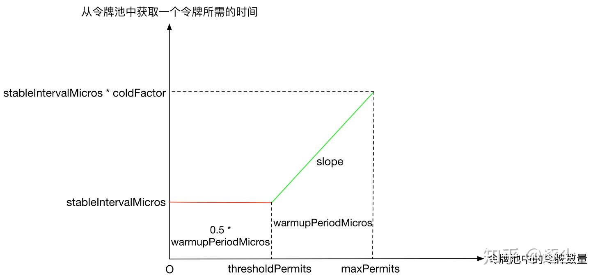

# Guava

三点建议:

1. 调试

2. 结构化思维

3. 交流


set via CAS


什么时候开启多个线程来执行？

> 是否需要占用CPU？
>
> io密集型 CPU密集型
>
> CPU密集的单CPU下线程少比较好，没有切换开销。
>
> io密集的多线程比较好


设计锁需要考虑的因素

- 粒度：重量级 轻量级
- 使用场景：读写锁、CountDownLatch、CyclicBarrier
- 公平性：公平、非公平
- 开销/性能/并发/阻塞
- 


## 数值处理

### Ints

Ints用于补充Integer和Arrays中对Int类型的操作


### Objects & MoreObjects

```java
Objects.requireNonNull(args);
System.out.println(Objects.equals(new Integer(0), new Integer(0)));
System.out.println(Objects.deepEquals(new Integer(0), new Integer(0)));


// 返回第一个不为null的
System.out.println(MoreObjects.firstNonNull(null, 1));
```


### Optional

### 函数式编程

Guava也提供Function和Predictate

```java
public static <F, T> List<T> transform(
    List<F> fromList, Function<? super F, ? extends T> function) {
```

```java
public static <T> @Nullable T find(
    Iterable<? extends T> iterable, Predicate<? super T> predicate, @Nullable T defaultValue) 
```

过度使用函数式编程会导致代码冗长混乱可读性差


什么使用需要使用函数式编程？

- 代码行减少
- 为了提高效率，转换集合的结果需要使用懒视图，而不是明确计算的结果


## 字符串处理

### Strings

String工具类

- isNullOrEmpty
- nullToEmpty
- emptyToNull
- padStart(str, num, 'c'): 往str前面添加字符c，使总长度是num
- padEdnd
- repeat
- commonPrefix
- commonSuffix

### Joiner

```java
System.out.println(Joiner.on("||").useForNull("NULL").join(list));
```

### Splitter

**Splitter用于将字符串按照某个separator分割为list或者map**


Splitter MapSplitter

Immutable ThreadSafe

trimResults omitEmptyStrings

```java
String str  = ",1,2,3,4,";
final Iterable<String> split = Splitter.on(",").split(str);
split.forEach(System.out::println);

System.out.println("===========");
Splitter.on(",").trimResults().omitEmptyStrings().split(str).forEach(System.out::println);

str = "a=1&b=2&c=3";
final Map<String, String> map = Splitter.on("&").withKeyValueSeparator("=").split(str);

map.forEach((s, s2) -> System.out.println(s +" > "+s2));
```


### intern

1 String中的intern方法有什么作用？ 
2 对比一下Guava的**Interners**。


## 异常处理

### Throwables

```java
// 获取异常链
public static List<Throwable> getCausalChain(Throwable throwable) 
// 获取最原始的异常
public static Throwable getRootCause(Throwable throwable) {
// 类似 SneakyThrows, 包装为RuntimeExecption 返回
public static RuntimeException propagate(Throwable throwable) {


```


## 容器

###  工具类

- **Lists **

- **Sets **

- **Maps**
- **Iterables**
- 


### 容器

asList 、asMap等返回的视图，会影响到原数据 

#### Multiset


#### MultiMap

ListMultiMap

SetMultiMAp

HashMultiMAp

TreeMultiMap


#### BiMap

#### RangeMap RangeSet


写个例子证明SimpleDateFormat不是线程安全的


## IO

### java io


### guava io

更高层的抽象

更方便的工具类


ByteStreams & CharStreams


Files Resources

源 与 汇：Source and Sink


## concurrent

### Uninterruptibles

#### sleepUninterruptibly

不响应中断的sleep

```java
public static void sleepUninterruptibly(long sleepFor, TimeUnit unit) {
    boolean interrupted = false;
    try {
      // 将sleepFor转换为对应纳秒级别的数值
      long remainingNanos = unit.toNanos(sleepFor);
      long end = System.nanoTime() + remainingNanos;
      while (true) {
        try {
          // TimeUnit.sleep() treats negative timeouts just like zero.
          // sleep对应的纳秒时间
          NANOSECONDS.sleep(remainingNanos);
          return;
        } catch (InterruptedException e) {
          interrupted = true;
          remainingNanos = end - System.nanoTime();
        }
      }
    } finally {
      if (interrupted) {
        Thread.currentThread().interrupt();
      }
    }
  }
```

这里使用NANOSECONDS.sleep(remainingNanos)的写法代替sleep(xxxx)主要是更方便理解，将时间的单位显示表述出来。该改法同时也对sleep期间被中断的异常做了捕获，并计算出剩余需要sleep的时间，然后继续等待，直到耗尽所有时间。所以这个方法可以描述为不可中断的sleep。其意义是为了支持上层限流对于请求的控制。


## Cache

缓存分为本**地缓存与分布式缓存**。本地缓存为了保证[线程安全]问题，一般使用`ConcurrentMap`的方式保存在内存之中，而常见的分布式缓存则有`Redis`，`MongoDB`等。

- 一致性：本地缓存由于数据存储于内存之中，每个实例都有自己的副本，可能会存在**不一致**的情况；**分布式缓存**则可有效避免这种情况
- 开销：本地缓存会**占用JVM内存**，会影响GC及系统性能；分布式缓存的开销则在于**网络时延和对象序列化**，故主要影响**调用时延**
- 适用场景：本地缓存适用于**数据量较小或变动较少**的数据；分布式缓存则适用于**一致性要求较高**及**数量量大**的场景(可弹性扩容)
  

Guava Cache 是Google Fuava中的一个内存缓存模块，用于将数据缓存到JVM内存中。

- 提供了get、put封装操作，能够集成数据源 ；
- 线程安全的缓存，与ConcurrentMap相似，但前者增加了更多的元素失效策略，后者只能显示的移除元素；
- Guava Cache提供了多种基本的缓存回收方式
- 监控缓存加载/命中情况
  

```sql
CacheBuilder.newBuilder()
		// 设置并发级别为cpu核心数，默认为4
	.concurrencyLevel(Runtime.getRuntime().availableProcessors()) 
	.initialCapacity(100)
	.maximumSize(1000)
		.build();

```

我们在构建缓存时可以为缓存设置一个合理大小初始容量，由于Guava的缓存使用了分离锁的机制，扩容的代价非常昂贵。所以合理的初始容量能够减少缓存容器的扩容次数。

Guava Cache可以在构建缓存对象时指定缓存所能够存储的最大记录数量。当Cache中的记录数量达到最大值后再调用put方法向其中添加对象，Guava会先从当前缓存的对象记录中选择一条删除掉，腾出空间后再将新的对象存储到Cache中。


缓存清除策略

- 基于存活时间的清除策略
  - expireAfterWrite 写缓存后多久过期
  - expireAfterAccess 读写缓存后多久过期
    存活时间策略可以单独设置或组合配置
- 基于容量的清除策略
  通过CacheBuilder.maximumSize(long)方法可以设置Cache的最大容量数，当缓存数量达到或接近该最大值时，Cache将清除掉那些最近最少使用的缓存

- 基于权重的清除 策略
  使用CacheBuilder.weigher(Weigher)指定一个权重函数，并且用CacheBuilder.maximumWeight(long)指定最大总重。如每一项缓存所占据的内存空间大小都不一样，可以看作它们有不同的“权重”（weights）,作为执行清除策略时优化回收的对象

- 显式清除

  - 清除单个key：`Cache.invalidate(key)`

  - 批量清除key：`Cache.invalidateAll(keys)`

  - 清除所有缓存项：`Cache.invalidateAll()`

- 基于引用的清除策略
  在构建Cache实例过程中，通过设置使用弱引用的键、或弱引用的值、或软引用的值，从而使JVM在GC时顺带实现缓存的清除
  CacheBuilder.weakKeys()：使用弱引用存储键。当键没有其它（强或软）引用时，缓存项可以被垃圾回收
  CacheBuilder.weakValues()：使用弱引用存储值。当值没有其它（强或软）引用时，缓存项可以被垃圾回收
  CacheBuilder.softValues()：使用软引用存储值。软引用只有在响应内存需要时，才按照全局最近最少使用的顺序回收。考虑到使用软引用的性能影响，我们通常建议使用更有性能预测性的缓存大小限定. 垃圾回收仅依赖`==`恒等式，使用弱引用键的缓存用而不是`equals()`，即同一对象引用。

### LoadingCache

使用自定义`ClassLoader`加载数据，置入内存中。从`LoadingCache`中获取数据时，若数据存在则直接返回；若数据不存在，则根据`ClassLoader`的`load`方法加载数据至内存，然后返回该数据

我们有很多场景使用了guava loading Cache , 默认的CacheLoader的loader是同步的，当从cache 获取数据时，可能会等待 后台的load操作完成 才返回，会影响用户体验。 所以 很多场景推荐使用 CacheLoader.asyncReloading ( new CacheLoader ,  Executors.newSingleThreadExecutor())   


## QPS

### RateLimiter

限流算法有

- 固定窗口
- 滑动窗口
- 漏斗
- 令牌桶算法

RateLimiter就是最后一种

基于guava-29.0版本。

RateLimiter是一个基于令牌桶算法实现的限流器，常用于控制网站的QPS。与Semaphore不同，Semaphore控制的是某一时刻的访问量，RateLimiter控制的是某一时间间隔的访问量。



RateLimiter是一个抽象类。

SmoothRateLimiter是RateLimiter的子类，也是一个抽象类。

**SmoothBursty**和**SmoothWarmingUp**是定义在SmoothRateLimiter里的两个静态内部类，是SmoothRateLimiter的真正实现类。

先来说一下RateLimiter的一个重要设计原则——**透支未来令牌**(应对突发流量)

如果说令牌池中的令牌数量为x，某个请求需要获取的令牌数量是y，只要x>0，即使y>x，该请求也能立即获取令牌成功。但是当前请求会对下一个请求产生影响，即会透支未来的令牌，使得下一个请求需要等待额外的时间。

举个例子，假设一个RateLimiter的QPS设定值是1，如果某个请求一次性获取10个令牌，该请求能够立即获取令牌成功，但是下一个请求获取令牌时，就需要额外等待10s时间。

```java
RateLimiter rateLimiter = RateLimiter.create(1);
System.out.println(rateLimiter.acquire(10));
System.out.println(rateLimiter.acquire(1));
//0.0
//9.997982
```

```java
RateLimiter rateLimiter = RateLimiter.create(2);
System.out.println(rateLimiter.acquire(10));
System.out.println(rateLimiter.acquire(2));
//0.0
//4.99839  ? 为什么是5秒
```


#### SmoothBursty和SmoothWarmingUp

SmoothBursty初始化的时候令牌池中的令牌数量为0，而SmoothWarmingUp初始化的时候令牌数量为**maxPermits**


SmoothBursty从令牌池中获取令牌不需要等待，而SmoothWarmingUp从令牌池中获取令牌需要等待一段时间，该时间长短和令牌池中的令牌数量有关系，具体见下图：



上图中slope表示绿色实线的斜率，其计算方式如下：

```text
slope = (stableIntervalMicros * coldFactor - stableIntervalMicros) / (maxPermits - thresholdPermits)
```

上图中横坐标是令牌池中的令牌数量，纵坐标是从令牌池中获取一个令牌所需的时间，因此红色实线对应的矩形面积、绿色实线对应的梯形面积的单位都是时间。

因此预热时间warmupPeriodMicros的定义如下（梯形面积）：

从满状态的令牌池中取出(maxPermits - thresholdPermits)个令牌所需花费的时间。

至于为什么矩阵面积是梯形面积的0.5倍，在后续SmoothWarmingUp的代码实现里我们会看到。

假设当前令牌池中有x个令牌，

当x介于thresholdPermits和maxPermits之间时，SmoothWarmingUp从令牌池中获取一个令牌，需要等待的时间为：

```text
stableIntervalMicros + (x - thresholdPermits) * slope
```

当x介于0和thresholdPermits之间时，SmoothWarmingUp从令牌池中获取一个令牌，需要等待的时间为：

```text
stableIntervalMicros
```

上述情况发生在令牌池中令牌数量大于0，且前一个请求没有透支令牌时。如果前一个请求透支了令牌，**还需要加上额外的等待时间**。


**SmoothWarmingUp当前请求获取令牌的等待时间是<u>由下一个请求承担的</u>**

```java
RateLimiter r = RateLimiter.create(2, 3, TimeUnit.SECONDS);
while (true) {
    System.out.println(String.format("Get 10 tokens spend %f s", r.acquire(10)));
    System.out.println(String.format("Get 10 tokens spend %f s", r.acquire(10)));
    System.out.println(String.format("Get 10 tokens spend %f s", r.acquire(10)));
    System.out.println(String.format("Get 10 tokens spend %f s", r.acquire(10)));
    System.out.println("end");
}

Get 10 tokens spend 0.000000 s
Get 10 tokens spend 6.498113 s
Get 10 tokens spend 4.995956 s
Get 10 tokens spend 4.996605 s
end
Get 10 tokens spend 4.994804 s
Get 10 tokens spend 4.999365 s
Get 10 tokens spend 4.996274 s
Get 10 tokens spend 4.999943 s
end
```

在这个例子中，我们新建了一个SmoothWarmingUp，其QPS是2，预热时间是3s。

- 第一次获取10个令牌时，无需等待额外的时间，因为无论是透支令牌产生的额外等待时间还是SmoothWarmingUp从令牌池中取令牌产生的额外等待时间，都由**下一个请求来承担**。

此时：

```text
thresholdPermits = 3.0
storedPermits = 6.0
stableIntervalMicros = 0.5s
```

透支令牌产生的额外等待时间是：

```text
(10 - storedPermits) * stableIntervalMicros = 2s
```

SmoothWarmingUp从令牌池中取令牌产生的额外等待时间是：

```text
warmupPeriodMicros + warmupPeriodMicros * 0.5 = 4.5s
```

因此第一次请求对下一个请求造成的影响是使得下一个请求需要等待6.5s。

- 第二次获取10个令牌时，等待了6.5s，和我们分析的结果相同，这6.5s是第一个请求造成的影响，而第二次请求造成的额外等待时间，由第三次请求来承担。

此时：

```text
storedPermits = 0.0
```

透支令牌产生的额外等待时间是：

```text
(10 - storedPermits) * stableIntervalMicros = 5s
```

由于此时令牌池中的令牌数量为0，因此从令牌池中取令牌的额外等待时间是0。

因此第二次请求对下一个请求造成的影响是使得下一个请求需要等待5s。

- 第三次获取10个令牌时，等待了5s，和我们的分析结果相同，这5s是第二个请求造成的影响。而第三次请求对第四次请求造成的影响、第四次请求对第五次请求造成的影响，均和第二次请求对第三次请求造成的影响相同，不再分析。


为什么SmoothWarmingUp需要这样设计？

SmoothWarmingUp适用于**资源需要预热**的场景。假设业务在稳定状态下，可以承受的最大QPS是1000。如果线程池是冷的，让系统立即达到1000QPS会拖垮系统，需要有一个预热升温的过程。表现在SmoothWarmingUp中，从令牌池中获取令牌是需要等待时间的，该等待时间随着越来越多的令牌被消耗会逐渐缩短，直至一个稳定的等待时间。


#### RateLimiter 代码分析

##### RateLimiter抽象类

RateLimiter中只有两个属性：

```java
private final SleepingStopwatch stopwatch;
private volatile Object mutexDoNotUseDirectly;
// mutexDoNotUseDirectly是一个锁对象，用于线程同步。
```

stopwatch是一个SleepingStopwatch类型的对象。SleepingStopwatch是定义在RateLimiter中的一个静态抽象类，是对Stopwatch是一层封装，并且提供了一个静态工厂方法

```java
public static SleepingStopwatch createFromSystemTimer() {
    return new SleepingStopwatch() {
        final Stopwatch stopwatch = Stopwatch.createStarted();

        @Override
        protected long readMicros() {
            return stopwatch.elapsed(MICROSECONDS);
        }

        @Override
        protected void sleepMicrosUninterruptibly(long micros) {
            if (micros > 0) {
            	Uninterruptibles.sleepUninterruptibly(micros, MICROSECONDS);
            }
        }
    };
}
```

我们知道，java.lang.System提供了一个native方法nanoTime返回以纳秒为单位的时间戳：

```java
public static native long nanoTime();
```

StopWatch的作用就是对nanoTime方法的一层抽象封装，只提供计算时间相对值（相对于StopWatch对象被创建时刻的时间）的功能:

```java
Stopwatch stopwatch = Stopwatch.createStarted();
doSomething();
stopwatch.stop(); // optional
Duration duration = stopwatch.elapsed();
log.info("time: " + stopwatch); // formatted string like "12.3 ms"
```

SleepingStopwatch可以简单理解为一个计时器，其记录的值是相对于RateLimiter被创建时刻的时间戳，单位是毫秒。同时，由方法sleepMicrosUninterruptibly可以看到，**SleepingStopwatch还提供了不响应InterruptedException的sleep功能**。


RateLimiter中以静态工厂方法的形式来构造我们所需要的RateLimiter对象。

如果想获取一个SmoothBursty类型的对象，可以调用只带一个参数的create方法：

```java
public static RateLimiter create(double permitsPerSecond) {
    return create(permitsPerSecond, SleepingStopwatch.createFromSystemTimer());
}

static RateLimiter create(double permitsPerSecond, SleepingStopwatch stopwatch) {
    RateLimiter rateLimiter = new SmoothBursty(stopwatch, 1.0);
    rateLimiter.setRate(permitsPerSecond);
    return rateLimiter;
}
```

如果想获取一个SmoothWarmingUp类型的对象，在create方法里需要传入额外的参数指定预热时间：

```java
public static RateLimiter create(double permitsPerSecond, Duration warmupPeriod) {
    return create(permitsPerSecond, toNanosSaturated(warmupPeriod), TimeUnit.NANOSECONDS);
}

public static RateLimiter create(double permitsPerSecond, long warmupPeriod, TimeUnit unit) {
    checkArgument(warmupPeriod >= 0, "warmupPeriod must not be negative: %s", warmupPeriod);
    return create(permitsPerSecond, warmupPeriod, unit, 3.0, SleepingStopwatch.createFromSystemTimer());
}

static RateLimiter create(double permitsPerSecond, long warmupPeriod, TimeUnit unit, double coldFactor, SleepingStopwatch stopwatch) {
    RateLimiter rateLimiter = new SmoothWarmingUp(stopwatch, warmupPeriod, unit, coldFactor);
    rateLimiter.setRate(permitsPerSecond);
    return rateLimiter;
}
```

注意上述代码中coldFactor被写死为3.0。

##### 获取令牌的方法

RateLimiter提供了两个方法用以获取令牌：acquire和tryAcquire，其中acquire的返回值是获取令牌成功需要等待的时间，tryAcquire的返回值是获取令牌是否成功。acquire方法和tryAcquire方法都可以传入需要获取的令牌数量，如果不传，默认需要获取的令牌数量为1。

先来看看acquire方法的实现：

```java
public double acquire() {
    return acquire(1);
}

public double acquire(int permits) {
    // reserve 方法的返回值表示何时能获取令牌
    long microsToWait = reserve(permits);
    // sleep 一段时间，直到能够获取令牌，因此如果不能获取到令牌，acquire 方法会阻塞当前线程
    stopwatch.sleepMicrosUninterruptibly(microsToWait);
    return 1.0 * microsToWait / SECONDS.toMicros(1L);
}

final long reserve(int permits) {
    // permits 必须大于 0
    checkPermits(permits);
    // synchronized 同步锁，用于解决并发问题
    synchronized (mutex()) {
        return reserveAndGetWaitLength(permits, stopwatch.readMicros());
    } 
}

final long reserveAndGetWaitLength(int permits, long nowMicros) {
    long momentAvailable = reserveEarliestAvailable(permits, nowMicros);
    // 如果当前时间已经大于等于了能获取到令牌的时间，需要等待的时间为0
    return max(momentAvailable - nowMicros, 0);
}

/**
 * 这是一个抽象方法，在 SmoothRateLimiter 中实现，返回能获得 permits 个令牌的时间戳。
 * 对于 SmoothBursty 而言，只需考虑前一个请求透支令牌的影响。
 * 对于 SmoothWarmingUp 而言，还需考虑获取令牌的等待时间。
 */
abstract long reserveEarliestAvailable(int permits, long nowMicros);
```

再来看看tryAcquire方法的实现：(如果不能立即获取，直接返回false，否则和acquire一样)

```java
public boolean tryAcquire() {
    // 默认传入的超时时间是 0
    return tryAcquire(1, 0, MICROSECONDS);
}

public boolean tryAcquire(int permits, long timeout, TimeUnit unit) {
    long timeoutMicros = max(unit.toMicros(timeout), 0);
    checkPermits(permits);
    long microsToWait;
    synchronized (mutex()) {
        long nowMicros = stopwatch.readMicros();
        // 由于传入的超时时间 timeoutMicros 是 0，所以不会阻塞
        if (!canAcquire(nowMicros, timeoutMicros)) {
            return false;
        } else {
            // 和 acquire 共用的是同一个方法
            microsToWait = reserveAndGetWaitLength(permits, nowMicros);
        }
    }
    stopwatch.sleepMicrosUninterruptibly(microsToWait);
    return true;
}

private boolean canAcquire(long nowMicros, long timeoutMicros) {
    return queryEarliestAvailable(nowMicros) - timeoutMicros <= nowMicros;
}

/**
 * 这是一个抽象方法，在 SmoothRateLimiter 中实现，用于记录前一个请求由于透支令牌对当前请求的影响。
 * 即只有在当前时间戳大于该方法的返回值时，才能够消除前一个请求对当前请求的影响，才能正常获取令牌。
 */
abstract long queryEarliestAvailable(long nowMicros);
```

#### 抽象类SmoothRateLimiter

抽象类SmoothRateLimiter继承自RateLimiter，包含有下述4个属性：

```java
// 当前令牌池中缓存的令牌数量
double storedPermits;
// 令牌池中能够缓存的最大令牌数量
double maxPermits;
// 产生一个令牌的时间
double stableIntervalMicros;
// 只有当前时间戳大于等于 nextFreeTicketMicros 时，才能从令牌池中获取令牌
private long nextFreeTicketMicros = 0L;
```


设置QPS的方法

doSetRate是定义在RateLimiter里的一个抽象方法，由子类SmoothRateLimiter来实现。

```java
/**
 * 该方法只是更新了 storedPermits、stableIntervalMicros 和 nextFreeTicketMicros 这
 * 三个参数，真正的实现在子类 SmoothBursty 和 SmoothWarmingUp 的 doSetRate 方法中
 */
final void doSetRate(double permitsPerSecond, long nowMicros) {
    // 根据当前时间戳更新 storedPermits 和 nextFreeTicketMicros
    resync(nowMicros);
    // 根据传入的 QPS 值计算 stableIntervalMicros
    double stableIntervalMicros = SECONDS.toMicros(1L) / permitsPerSecond;
    this.stableIntervalMicros = stableIntervalMicros;
    doSetRate(permitsPerSecond, stableIntervalMicros);
}

/**
 * 根据当前时间戳 nowMicros 更新 storedPermits 和 nextFreeTicketMicros
 */
void resync(long nowMicros) {
    if (nowMicros > nextFreeTicketMicros) {
        // 如果是从 doSetRate 方法里调用的，对于 SmoothBursty 而言，stableIntervalMicros 还
        // 没有被初始化，因此返回的结果是 0.0，此时 newPermits 值为无穷大，下一行代码会将 storedPermits 
        // 设置成 maxPermits。
        double newPermits = (nowMicros - nextFreeTicketMicros) / coolDownIntervalMicros();
        storedPermits = min(maxPermits, storedPermits + newPermits);
        nextFreeTicketMicros = nowMicros;
    }
}

/**
 * 在子类 SmoothWarmingUp 和 SmoothBursty 中实现。
 * 对于 SmoothBursty 而言，返回结果是 stableIntervalMicros。
 * 对于 SmoothWarmingUp 而言，返回的结果是 warmupPeriodMicros / maxPermits，
 * 根据 coldFactor 和 前文 SmoothWarmingUp 的那张分析图可知，该值和 stableIntervalMicros 相同。
 * 
 * 为什么该方法名里有 coolDown 呢？
 * 在 SmoothWarmingUp 中有预热的概念，随着令牌池中的令牌数目减少，令牌池越来越热。
 * 看一下 coolDownIntervalMicros 的调用点：resync 方法，可以看到 coolDownIntervalMicros
 * 用于计算在某一段时间内令牌池中新增的令牌数量。
 * 既然令牌池中令牌数量减少叫预热，那令牌池中令牌数量增多叫降温就不足为奇了。
 */
abstract double coolDownIntervalMicros();

/**
 * 在子类 SmoothWarmingUp 和 SmoothBursty 中实现。
 */
abstract void doSetRate(double permitsPerSecond, double stableIntervalMicros);
```


reserveEarliestAvailable和queryEarliestAvailable方法

这两个方法在前文acquire和tryAcquire的实现里有用到。reserveEarliestAvailable返回能获得 permits 个令牌的时间戳。queryEarliestAvailable用于记录前一个请求由于透支令牌对当前请求的影响。

```java
final long reserveEarliestAvailable(int requiredPermits, long nowMicros) {
    resync(nowMicros);
    // 返回值是 nextFreeTicketMicros
    long returnValue = nextFreeTicketMicros;
    // 从令牌缓存池中获取到的令牌数量
    double storedPermitsToSpend = min(requiredPermits, this.storedPermits);
    // 除了令牌缓存池中的令牌外，还需额外生产的令牌数量（即透支的令牌数量）
    double freshPermits = requiredPermits - storedPermitsToSpend;
    // waitMicros = 从令牌缓存池中获取 storedPermitsToSpend 个令牌所需花费的时间 + 生产 freshPermits 个新令牌所需的时间
    long waitMicros = storedPermitsToWaitTime(this.storedPermits, storedPermitsToSpend) + (long) (freshPermits * stableIntervalMicros);
    // 更新 nextFreeTicketMicros
    this.nextFreeTicketMicros = LongMath.saturatedAdd(nextFreeTicketMicros, waitMicros);
    // 更新 storedPermits
    this.storedPermits -= storedPermitsToSpend;
    return returnValue;
}

/**
 * 在子类 SmoothWarmingUp 和 SmoothBursty 中实现。特别地，对于 SmoothBursty，从令牌池中获取令牌不需要等待时间，因此返回值是 0。
 */
abstract long storedPermitsToWaitTime(double storedPermits, double permitsToTake);

final long queryEarliestAvailable(long nowMicros) {
    return nextFreeTicketMicros;
}
```

#### 实现类SmoothBursty

在SmoothRateLimiter中设置QPS时，调用到的真正设置QPS的地方是SmoothBursty和SmoothWarmingUp中的doSetRate方法：

```java
void doSetRate(double permitsPerSecond, double stableIntervalMicros) {
    double oldMaxPermits = this.maxPermits;
    maxPermits = maxBurstSeconds * permitsPerSecond;
    // 如果原先的最大令牌数目 oldMaxPermits 是无穷大，不按比例变化，而是直接将令牌缓存池中的令牌数置为 maxPermits
    if (oldMaxPermits == Double.POSITIVE_INFINITY) {
        storedPermits = maxPermits;
    } else {
        // 如果原先的最大令牌数目 oldMaxPermits 是 0，即首次设置 QPS 值时，此时无需等比例放大，直接将 storedPermits 置 0。
        // 否则，由于产生令牌的速率发生了改变导致了令牌缓存池中能够缓存的最大令牌数量发生了变化，需要对令牌缓存池中已缓存的令牌数量进行等比例的缩放。
        // 可以看到，初始化时，SmoothBursty 中的 storedPermits 为 0.0，令牌池中没有任何令牌。
        storedPermits = (oldMaxPermits == 0.0) ? 0.0 : storedPermits * maxPermits / oldMaxPermits;
    }
}
```

从令牌池中获取一个令牌所需的时间在storedPermitsToWaitTime方法中计算。对于 SmoothBursty，从令牌池中获取令牌不需要等待时间，因此返回值是 0：

```java
long storedPermitsToWaitTime(double storedPermits, double permitsToTake) {
    return 0L;
}
```

生产令牌的时间间隔在coolDownIntervalMicros方法中计算：

```java
double coolDownIntervalMicros() {
    return stableIntervalMicros;
}
```

#### 具体实现类SmoothWarmingUp

和SmoothBursty一样，也对应有doSetRate、storedPermitsToWaitTime和coolDownIntervalMicros这三个方法。

```java
void doSetRate(double permitsPerSecond, double stableIntervalMicros) {
    double oldMaxPermits = maxPermits;
    double coldIntervalMicros = stableIntervalMicros * coldFactor;
    // 矩形面积公式，这里 0.5 * warmupPeriodMicros 就写死了 0 到 thresholdPermits 范围
    // 内的矩形面积是 thresholdPermits 到 maxPermits 范围内的梯形面积的 0.5 倍
    thresholdPermits = 0.5 * warmupPeriodMicros / stableIntervalMicros;
    // 梯形面积公式
    maxPermits = thresholdPermits + 2.0 * warmupPeriodMicros / (stableIntervalMicros + coldIntervalMicros);
    // 计算斜率
    slope = (coldIntervalMicros - stableIntervalMicros) / (maxPermits - thresholdPermits);
    if (oldMaxPermits == Double.POSITIVE_INFINITY) {
        storedPermits = 0.0;
    } else {
        // 可以看到，初始化时，SmoothWarmingUp 中的令牌数量就是 masPermits
        storedPermits = (oldMaxPermits == 0.0) ? maxPermits : storedPermits * maxPermits / oldMaxPermits;
    }
}

long storedPermitsToWaitTime(double storedPermits, double permitsToTake) {
    double availablePermitsAboveThreshold = storedPermits - thresholdPermits;
    long micros = 0;
    if (availablePermitsAboveThreshold > 0.0) {
        // 在梯形中获得的令牌数量
        double permitsAboveThresholdToTake = min(availablePermitsAboveThreshold, permitsToTake);
        // length = 上底 + 下底
        double length = permitsToTime(availablePermitsAboveThreshold) + permitsToTime(availablePermitsAboveThreshold - permitsAboveThresholdToTake);
        // 梯形面积公式
        micros = (long) (permitsAboveThresholdToTake * length / 2.0);
        // permitsAboveThresholdToTake 个令牌数已经在梯形区域获取
        permitsToTake -= permitsAboveThresholdToTake;
    }
    // 加上矩形中的面积
    micros += (stableIntervalMicros * permitsToTake);
    return micros;
}
  
/**
 * 对于梯形，根据令牌池中的令牌数 permits 计算获取一个令牌所需的时间
 */
private double permitsToTime(double permits) {
    return stableIntervalMicros + permits * slope;
}

/**
 * warmupPeriodMicros / maxPermits = stableIntervalMicros，即生产令牌的时间间隔
 */
double coolDownIntervalMicros() {
    return warmupPeriodMicros / maxPermits;
}
```


#### 总结

RareLimiter中的令牌来源有两个：

- 一是令牌池。SmoothBursty从令牌池中获取令牌是不需要额外等待时间的，而SmoothWarmingUp从令牌池中获取令牌是需要额外等待时间的。

- 二是透支未来令牌。这一点，SmoothBursty和SmoothWarmingUp均相同。

当前请求的额外等待时间由下一个请求来承担。

https://zhuanlan.zhihu.com/p/205266820

