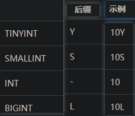
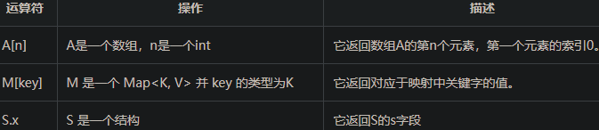
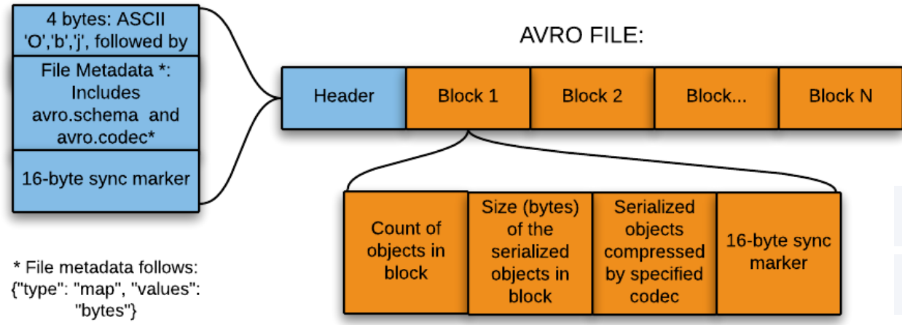
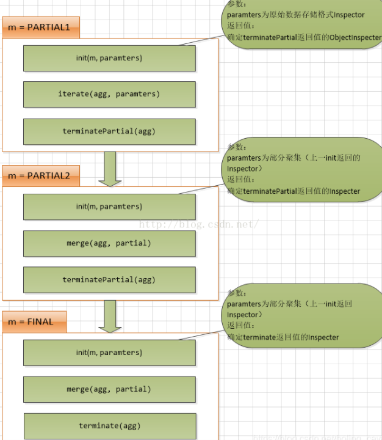

# Hive Notes

[尚硅谷笔记](_pdf/bigdata\hive/尚硅谷大数据技术之Hive.pdf)

官方wiki：https://cwiki.apache.org/confluence/display/Hive/LanguageManual+Select


## Hive基础

Manual Book

https://cwiki.apache.org/confluence/display/Hive/LanguageManual+UDF

### 简介

hive是一个数据仓库工具，用来在Hadoop中处理 **结构化数据**。

hive结构在Hadoop之上，总归为大数据，使查询和分析更加方便

提供简单的SQL，可以将SQL语句转化为MapReduce任务执行

Hadoop是用于处理大数据的框架，分为MapReduce和hdfs两个主要模块

Hadoop生态系统包含用于协助Hadoop的不同子项目工具模块，如Sqoop\Pig\Hive：

- Sqoop: 用来在hdfs和rdbms之间来回导入和导出数据
- Pig：用来开发MapReduce操作的脚本程序语言的平台
- Hive：用来开发SQL类型脚本用于做MapReduce操作


hive是一个**数据仓库基础工具**，用来在Hadoop中处理结构化数据

Facebook开发，转由Apache孵化


特点:

- 存储架构在一个数据库中并处理数据到hdfs
- 转为联机事务处理（OLTP）设计
- 提供SQL类型语言查询：HiveQL or HQL
- 快速可扩展

### 架构


- 用户接口/界面：Hive是一个数据仓库基础工具软件，可以创建用户和HDFS之间互动。用户界面，Hive支持是Hive的Web UI，Hive命令行，HiveHD洞察（在Windows服务器）。
- 元存储：Hive选择各自的数据库服务器，用以储存表，数据库，列模式或元数据表，它们的数据类型和HDFS映射。
- HQL处理引擎：HiveQL类似于SQL的查询上Metastore模式信息。这是传统的方式进行MapReduce程序的替代品之一。相反，使用Java编写的MapReduce程序，可以编写为MapReduce工作，并处理它的查询。
- 执行引擎：HiveQL处理引擎和MapReduce的结合部分是由Hive执行引擎。执行引擎处理查询并产生结果和MapReduce的结果一样。它采用MapReduce方法。
- HDFS/HBASE: Hadoop的分布式文件系统或者HBASE数据存储技术是用于将数据存储到文件系统。


### 工作原理


### 安装

依赖于：

- java
- Hadoop

下载hive：apache-hive-0.14.0-bin.tar.gz

配置

Apache Derby


#### hive元数据配置到mysql

将 MySQL 的 JDBC 驱动拷贝到 Hive 的 lib 目录下

hive-site.xml配置

### 命令

#### 常用交互命令

```sql
usage: hive
-d,--define <key=value> Variable subsitution to apply to hive
 commands. e.g. -d A=B or --define A=B
 --database <databasename> Specify the database to use
-e <quoted-query-string> SQL from command line
-f <filename> SQL from files
-H,--help Print help information
 --hiveconf <property=value> Use value for given property
 --hivevar <key=value> Variable subsitution to apply to hive
 commands. e.g. --hivevar A=B
-i <filename> Initialization SQL file
-S,--silent Silent mode in interactive shell
-v,--verbose Verbose mode (echo executed SQL to the
console)
```


```sql
“-e”不进入 hive 的交互窗口执行 sql 语句

“-f”执行脚本中 sql 语句

hive(default)>exit; 

hive(default)>quit;

查看在 hive 中输入的所有历史命令:查看. hivehistory 文件


```


### 数据类型

基本数据类型：


smallint ，不是smalint


注意：

- DATE是日期，不是DATETIME，不像mysql一样和timestamp类似，date完全只是日期。
- CHAR是定长字符串！不是字符


集合数据类型：


Varchar vs. String

1.Hive-0.12.0版本引入了VARCHAR类型，VARCHAR类型使用长度指示器（1到65355）创建，长度指示器定义了在字符串中允许的最大字符数量。如果一个字符串值转换为或者被赋予一个varchar值，其长度超过了长度指示器则该字符串值会自动被截断。

2.STRING存储变长的文本，对长度没有限制。理论上将STRING可以存储的大小为2GB，但是存储特别大的对象时效率可能受到影响，可以考虑使用Sqoop提供的大对象支持。

二、两者主要区别：

1.VARCHAR与STRING类似，但是STRING存储变长的文本，对长度没有限制；varchar长度上只允许在1-65355之间。

2.还没有通用的UDF可以直接用于VARCHAR类型，可以使用String UDF代替，VARCHAR将会转换为String再传递给UDF。


hive有四种数据类型：

#### 列类型

用作hive的列类型，包含：

1.整形

整型数据可以指定使用整型数据类型，INT。当数据范围超过INT的范围，需要使用BIGINT，如果数据范围比INT小，使用SMALLINT。 TINYINT比SMALLINT小。



2.字符串

字符串类型的数据类型可以使用单引号('')或双引号(“”)来指定。它包含两个数据类型：VARCHAR和CHAR。Hive遵循C-类型的转义字符。

- varchar: 1~65535
- char: 255


3.时间戳

它支持传统的UNIX时间戳可选纳秒的精度。它支持的java.sql.Timestamp格式“YYYY-MM-DD HH:MM:SS.fffffffff”和格式“YYYY-MM-DD HH:MM:ss.ffffffffff”。

4.日期

DATE值在年/月/日的格式形式描述 {{YYYY-MM-DD}}.

5.小数

在Hive 小数类型与Java大十进制格式相同。它是用于表示不可改变任意精度。语法和示例如下：

```
DECIMAL(precision, scale)
decimal(10,0)
```

6.联合类型

联合是异类的数据类型的集合。可以使用联合创建的一个实例

```text
UNIONTYPE<int, double, array<string>, struct<a:int,b:string>>

{0:1} 
{1:2.0} 
{2:["three","four"]} 
{3:{"a":5,"b":"five"}} 
{2:["six","seven"]} 
{3:{"a":8,"b":"eight"}} 
{0:9} 
{1:10.0}
```

#### 文字

浮点

浮点类型是有小数点的数字

十进制

十进制数据类型是只不过浮点值范围比DOUBLE数据类型更大。十进制类型的范围大约是 -10-308 到 10308.

#### Null

缺失值

注意：

NULL和其他值比较得到NULL

```
select NULL = NULL
select 1 = NULL 
select NULL = 2
select NULL = 's'
// 都是 NULL
```


#### 复杂类型

数组

ARRAY<data_type>

映射

 MAP<primitive_type, data_type>

结构体

STRUCT<col_name : data_type [COMMENT col_comment], ...>

#### double vs. decimal

- 使用double运算时可能会导致**精度丢失**，如对精度要求较高，建议全都换成decimal类型之后再做操作

- 两个declimal计算不会造成精度丢失
- **double和decimal计算可能造成精度缺失**

```sql
select cast('0.00407' as decimal(18,6))*2500  -- 10.175
select cast('0.00407' as decimal(18,6))*cast(2500 as decimal(18,2))  -- 10.175
select cast('0.00407' as decimal(18,6))*cast(2500 as double)  -- 10.174999999999999 

explain select 200;  -- 返回值类型：int 
explain select 200.00;  -- 返回值类型：double 
explain select 200*200.00 -- 返回值类型：double
explain select 200*cast(200.00 as decimal(18,2)) -- 返回值类型：decimal 
explain select 200.00*cast(200.00 as decimal(18,2)) -- 返回值类型：double 
```

hive将字符串默认转换成double类型进行计算

```sql
-- '0.00407' 是double，2500 是int类，结果是double类
explain select '0.00407'*2500  -->10.1749999999 
-- hive将字符串 ‘0.0407’ 转换成 double类型，最终输出值是： 10.1749999999
```


插入复杂类型：

```sql
INSERT INTO test_set SELECT 2,'xiaohua',array('basketball','read'),str_to_map('xiaoming:no,xiaohong:no'),named_struct('math',90,'english',90)


insert overwrite table dw_temp.adm_feature_compare_01 PARTITION(dt='2022-03-10')  
values ('1','11','111','1111','1.1','1.11','1.111','dim1','dim2','2022-01-01 00:00:00','2022-01-01 00:00:00',array(1,2,3),str_to_map('x:1,y:2'),named_struct('age',1,'city','bj','district','chaoyang'));

insert overwrite table dw_temp.adm_feature_compare_02 PARTITION(dt='2022-03-10')  
values ('2','22','222','2222','2.2','2.22','2.222','dim1','dim2','2032-01-01 00:00:00','2032-01-01 00:00:00',array(1,2,3,4),str_to_map('x:1,y:2,z:3'),named_struct('age',2,'city','bj','district','haidian'));


```


#### binary

- For binary, it will store base64 encoded value.


### 库操作

创建库：

CREATE DATABASE|SCHEMA [IF NOT EXISTS] <database name>

JDBC方式：

```java
public class HiveCreateDb {
   private static String driverName = "org.apache.hadoop.hive.jdbc.HiveDriver";
   
   public static void main(String[] args) throws SQLException {
      // Register driver and create driver instance
   
      Class.forName(driverName);
      // get connection
      
      Connection con = DriverManager.getConnection("jdbc:hive://localhost:10000/default", "", "");
      Statement stmt = con.createStatement();
      
      stmt.executeQuery("CREATE DATABASE userdb");
      System.out.println(“Database userdb created successfully.”);
      
      con.close();
   }
}
```

删除库：

DROP (DATABASE|SCHEMA) [IF EXISTS] database_name  [RESTRICT|CASCADE];


```java
public class HiveDropDb {
   private static String driverName = "org.apache.hadoop.hive.jdbc.HiveDriver";
   
   public static void main(String[] args) throws SQLException {
   
      // Register driver and create driver instance
      Class.forName(driverName);
      
      // get connection
      Connection con = DriverManager.getConnection("jdbc:hive://localhost:10000/default", "", "");
      Statement stmt = con.createStatement();
      stmt.executeQuery("DROP DATABASE userdb");
      
      System.out.println(“Drop userdb database successful.”);
      
      con.close();
   }
}
```

### 表操作

创建表：

```sql
CREATE [TEMPORARY] [EXTERNAL] TABLE [IF NOT EXISTS] [db_name.] table_name

[(col_name data_type [COMMENT col_comment], ...)]
[COMMENT table_comment]
[ROW FORMAT row_format]
[STORED AS file_format]

hive> CREATE TABLE IF NOT EXISTS employee ( eid int, name String,
> salary String, destination String)
> COMMENT ‘Employee details’
> ROW FORMAT DELIMITED
> FIELDS TERMINATED BY ‘\t’
> LINES TERMINATED BY ‘\n’
> STORED AS TEXTFILE;
```

修改表

```java
ALTER TABLE name RENAME TO new_name
ALTER TABLE name ADD COLUMNS (col_spec[, col_spec ...])
ALTER TABLE name DROP [COLUMN] column_name
ALTER TABLE name CHANGE column_name new_name new_type
ALTER TABLE name REPLACE COLUMNS (col_spec[, col_spec ...])
```

重命名表

ALTER TABLE employee RENAME TO emp;

修改列

hive> ALTER TABLE employee CHANGE name ename String; hive> ALTER TABLE employee CHANGE salary salary Double;

删除表：

DROP TABLE [IF EXISTS] table_name;

### 数据操作

插入数据 **LOAD DATA**

一般来说，在SQL创建表后，我们就可以使用INSERT语句插入数据。但在Hive中，可以使用LOAD DATA语句插入数据。

将数据插入到Hive，最好是使用LOAD DATA来存储大量记录。有两种方法用来加载数据：一种是从本地文件系统，第二种是从Hadoop文件系统。

```sql
LOAD DATA [LOCAL] INPATH 'filepath' [OVERWRITE] INTO TABLE tablename 
[PARTITION (partcol1=val1, partcol2=val2 ...)]
```

LOCAL是标识符指定本地路径。它是可选的。

OVERWRITE 是可选的，覆盖表中的数据。

PARTITION 这是可选的

eg: 

sample.txt:

```text
1201  Gopal       45000    Technical manager
1202  Manisha     45000    Proof reader
1203  Masthanvali 40000    Technical writer
1204  Kiran       40000    Hr Admin
1205  Kranthi     30000    Op Admin

hive> LOAD DATA LOCAL INPATH '/home/user/sample.txt'
> OVERWRITE INTO TABLE employee;
```

JDBC:

```java
public class HiveLoadData {

   private static String driverName = "org.apache.hadoop.hive.jdbc.HiveDriver";
   
   public static void main(String[] args) throws SQLException {
   
      // Register driver and create driver instance
      Class.forName(driverName);
      
      // get connection
      Connection con = DriverManager.getConnection("jdbc:hive://localhost:10000/userdb", "", "");
      
      // create statement
      Statement stmt = con.createStatement();
      
      // execute statement
      stmt.executeQuery("LOAD DATA LOCAL INPATH '/home/user/sample.txt'" + "OVERWRITE INTO TABLE employee;");
      System.out.println("Load Data into employee successful");
      
      con.close();
   }
}
```

### 分区

Hive组织表到分区。它是将一个表到基于分区列，如日期，城市和部门的值相关方式。使用分区，很容易对数据进行部分查询。

​	表或分区是细分成桶，以提供额外的结构，可以使用更高效的查询的数据。桶的工作是基于表的一些列的散列函数值。

​	例如，一个名为Tab1表包含雇员数据，如 id, name, dept 和yoj (即加盟年份)。假设需要检索所有在2012年加入，查询搜索整个表所需的信息员工的详细信息。但是，如果用年份分区雇员数据并将其存储在一个单独的文件，它减少了查询处理时间

可以通过添加分区表改变所述表。假设我们有一个表叫employee ，拥有如 Id, Name, Salary, Designation, Dept, 和 yoj等字段。

```sql
ALTER TABLE table_name ADD [IF NOT EXISTS] PARTITION partition_spec
[LOCATION 'location1'] partition_spec [LOCATION 'location2'] ...;

partition_spec:
: (p_column = p_col_value, p_column = p_col_value, ...)//原文出自【易百教程】，商业转载请联系作者获得授权，非商业请保留原文链接：https://www.yiibai.com/hive/hive_partitioning.html#article-start

hive> ALTER TABLE employee
> ADD PARTITION (year=’2013’)
> location '/2012/part2012';
```

重命名分区

ALTER TABLE table_name PARTITION partition_spec RENAME TO PARTITION partition_spec;

删除分区

ALTER TABLE table_name DROP [IF EXISTS] PARTITION partition_spec, PARTITION partition_spec,...;


数据库分区的主要目的是为了在特定的SQL操作中减少数据读写的总量以缩减响应时间，主要包括两种分区形式：**水平分区与垂直分区**。水平分区是对表进行行分区。而垂直分区是对列进行分区，一般是通过对表的垂直划分来减少目标表的宽度，常用的是水平分区

hive建立分区语法：       


```sql
create external table if not exists tablename(
    a string,
    b string)
 partitioned by (year string, month string)
 row format delimited fields terminated by ',';
```

hive通常有三种方式对包含分区字段的表进行数据插入：

​    1）静态插入数据：要求插入数据时指定与建表时相同的分区字段，如：

```sql
insert overwrite table tablename （year='2017', month='03'） select a, b from tablename2;
```

 2）动静混合分区插入：要求指定部分分区字段的值，如：

```sql
insert overwrite table tablename （year='2017', month） select a, b from tablename2;
```

3）动态分区插入：只指定分区字段，不用指定值，如：

```sql
insert overwrite table tablename （year, month） select a, b from tablename2;
```


数据插入之insert into 和 insert overwrite
        hive是基于Hadoop的一个数据仓库工具，可以将结构化的数据文件映射为一张数据库表，并提供简单的sql查询功能，可以将sql语句转换为MapReduce任务进行运行。通常hive包括以下四种数据导入方式：

（1）、从本地文件系统中导入数据到Hive表；

（2）、从HDFS上导入数据到Hive表；

（3）、在创建表的时候通过从别的表中查询出相应的记录并插入到所创建的表中；

（4）、从别的表中查询出相应的数据并导入到Hive表中。

```sql
      insert into table tablename1 select a, b, c from tablename2;
      insert overwrite table tablename1 select a, b, c from tablename2;
```

 insert into 与 insert overwrite 都可以向hive表中插入数据，但是insert into直接追加到表中数据的尾部，而insert overwrite会重写数据，既先进行删除，再写入。如果存在分区的情况，insert overwrite会只重写当前分区数据。


```sql
// 当前分区新增写入
insert into tableName partition(year='2021',month='10') values ('1001','350001'),('1002','350002');
 
// overwrite删当前分区数据写入新数据
insert overwrite table tableName partition(year='2021',month='10') values ('1002','350002'),('1004','350004');
 
// 当前分区新增写入
insert into tableName partition(year='2021',month='10') select a, b from tableName2;
 
// overwrite删当前分区数据写入新数据
insert overwrite table tableName (year='2021',month='10') select a, b from tableName2;
```


- 在反复对同一个分区执行`insert overwrite`操作时，您通过`desc`命令查看到的数据分区Size会不同。这是因为从同一个表的同一个分区`select`出来再`insert overwrite`回相同分区时，文件切分逻辑发生变化，从而导致数据的Size发生变化。数据的总长度在`insert overwrite`前后是不变的，您不必担心存储计费会产生问题。


### 内置运算符

HIVE有四种内置运算符

#### 关系运算符

- =
- !=
- <
- <=
- \> 
- \>=
- IS NULL
- IS NOT NULL
- LIKE
- A RLIKE B：A或B任一个为null，true，否则看是否匹配正则表达式
- REGEXP: 等同于

#### 算术运算符

- +
- \-
- *
- /
- %
- &
- |
- ^
- ~

同java

#### 逻辑运算符

- and &&
- or ||
- not !

#### 复杂运算符



### 内置函数


#### **coalesce**

COALESCE是一个函数， (expression_1, expression_2, ...,expression_n)依次参考各参数表达式，遇到非null值即停止并返回该值。如果所有的表达式都是空值，最终将返回一个空值。使用COALESCE在于大部分包含空值的表达式最终将返回空值。

```sql
select coalesce(success_cnt, 1) from tableA
```

当success_cnt 为**null**值的时候，将返回1，否则将返回success_cnt的真实值。

### 视图和索引

```sql
CREATE VIEW [IF NOT EXISTS] view_name [(column_name [COMMENT column_comment], ...) ]
[COMMENT table_comment]
AS SELECT ...

DROP VIEW view_name

CREATE INDEX index_name
ON TABLE base_table_name (col_name, ...)
AS 'index.handler.class.name'
[WITH DEFERRED REBUILD]
[IDXPROPERTIES (property_name=property_value, ...)]
[IN TABLE index_table_name]
[PARTITIONED BY (col_name, ...)]
[
   [ ROW FORMAT ...] STORED AS ...
   | STORED BY ...
]
[LOCATION hdfs_path]
[TBLPROPERTIES (...)]


DROP INDEX <index_name> ON <table_name>
```

### 查询

```sql
SELECT [ALL | DISTINCT] select_expr, select_expr, ... 
FROM table_reference 
[WHERE where_condition] 
[GROUP BY col_list] 
[HAVING having_condition] 
[CLUSTER BY col_list | [DISTRIBUTE BY col_list] [SORT BY col_list]] 
[LIMIT number];
```

大体同SQL

#### count

```sql
// 原生的count有几种形式：
// 1.count(字面量)：count(*) count(1) count('s')
// 2.count(字段):count(col01)
// 3.count(表达式) count(col01>2):  注意：表达式不支持子查询等高级用法,不过支持case等这些
// 4.count(distinct 字段) count()
// select count(distinct case when a>1 then a else NULL end)  from t1
```


#### Avg

```
1	1	1	1	1.0	1.0
2	2	2	2	2.0	NULL
3	3	3	3	3.0	NULL
-1	-1	454545	-1	-1.0	NULL
100	100	100	100	100.0	NULL
1	2	12	15244	1242.0	NULL
0	-10000	1	-10000	-10000.0	NULL
NULL	NULL	NULL	1	1.0	1.0

// 最后一列，只有两个1.0，其余NULL

select sum(doubleVal), avg(doubleVal) from udaf02;
2.0	1.0

所以avg计数也是跳过 NULL的

avg = 非NULL和/非NULL数

```


### 数据导出


如果需要把hive数据传输到其他地方，导出hive数据有几种方式：

1. textfile 临时表：将ORC数据先转成textfile格式，然后下载hdfs文件进行传输
2. insert overwrite local directory 

```sql
insert overwrite local directory './a'
row format delimited
fields terminated by ','
select * from tmp_dw_temp.txu6_hive_to_fate_03 where year != '';
```


### 配置

#### 正则表达式

```shell
set hive.support.quoted.identifiers=none 
SELECT `(id|100name)?+.+` from st;
```

#### 剔除部分字段

这是HIVE中查询语句的一个小技巧，一个表有很多字段，我们想要除个别字段外的剩余所有字段，全部列出来不方便且不美观，实际上hive语句可以解决这个问题。

选择tableName表中除了name、id、pwd之外的所有字段：

set hive.support.quoted.identifiers=None;
select `(name|id|pwd)?+.+` from tableName;

## My Hive Notes

### 管理

#### Hadoop可视化界面

http://ubuntu:50070


### SERDE 

Serde是 Serializer/Deserializer的简写。hive使用Serde进行行对象的序列与反序列化。

```java
SerDe is a short name for "Serializer and Deserializer."
Hive uses SerDe (and FileFormat) to read and write table rows.
HDFS files --> InputFileFormat --> <key, value> --> Deserializer --> Row object
Row object --> Serializer --> <key, value> --> OutputFileFormat --> HDFS files
```

序列化是对象转换为字节序列的过程。
 序列化是字节序列恢复为对象的过程。
 对象的序列化主要有两种用途：对象的持久化，即把对象转换成字节序列后保存到文件中；对象数据的网络传送。
 除了上面两点， hive的序列化的作用还包括：Hive的反序列化是对key/value反序列化成hive table的每个列的值。Hive可以方便的将数据加载到表中而不需要对数据进行转换，这样在处理海量数据时可以节省大量的时间。

SerDe说明hive如何去处理一条记录，包括Serialize/Deserilize两个功能， Serialize把hive使用的java object转换成能写入hdfs的字节序列，或者其他系统能识别的流文件。Deserilize把字符串或者二进制流转换成hive能识别的java object对象。比如：select语句会用到Serialize对象， 把hdfs数据解析出来；insert语句会使用Deserilize，数据写入hdfs系统，需要把数据序列化。

你可以创建表时使用用户**自定义的Serde或者native Serde**， **如果 ROW FORMAT没有指定或者指定了 ROW FORMAT DELIMITED就会使用native Serde。**hive已经实现了许多自定义的Serde，之前我们在介绍stored时也涉及到：

- Avro (Hive 0.9.1 and later)
- ORC (Hive 0.11 and later)
- RegEx
- Thrift
- Parquet (Hive 0.13 and later)
- CSV (Hive 0.14 and later)
- JsonSerDe (Hive 0.12 and later)


```sql
hive> show create table tbl06;
OK
CREATE TABLE `tbl06`(
  `id` int)
ROW FORMAT SERDE 
  'org.apache.hadoop.hive.serde2.lazy.LazySimpleSerDe' # 看我这里默认使用的是LazySimpleSerDe
STORED AS INPUTFORMAT 
  'org.apache.hadoop.mapred.TextInputFormat' 
OUTPUTFORMAT 
  'org.apache.hadoop.hive.ql.io.HiveIgnoreKeyTextOutputFormat'
LOCATION
  'hdfs://ubuntu:9000/user/hive/warehouse/tbl06'
TBLPROPERTIES (
  'COLUMN_STATS_ACCURATE'='true', 
  'numFiles'='2', 
  'numRows'='4', 
  'rawDataSize'='4', 
  'totalSize'='8', 
  'transient_lastDdlTime'='1638623697')
Time taken: 0.107 seconds, Fetched: 17 row(s)
```


#### RegEx

```csharp
ROW FORMAT SERDE
'org.apache.hadoop.hive.serde2.RegexSerDe'
WITH SERDEPROPERTIES 
(
"input.regex" = "<regex>"
)
STORED AS TEXTFILE;
```

使用正则来序列化行数据:

```php
CREATE TABLE apachelog (
  host STRING,
  identity STRING,
  user STRING,
  time STRING,
  request STRING,
  status STRING,
  size STRING,
  referer STRING,
  agent STRING)
ROW FORMAT SERDE 'org.apache.hadoop.hive.serde2.RegexSerDe'
WITH SERDEPROPERTIES (
  "input.regex" = "([^]*) ([^]*) ([^]*) (-|\\[^\\]*\\]) ([^ \"]*|\"[^\"]*\") (-|[0-9]*) (-|[0-9]*)(?: ([^ \"]*|\".*\") ([^ \"]*|\".*\"))?"
)
STORED AS TEXTFILE;
```

#### Json

```php
ROW FORMAT SERDE 
'org.apache.hive.hcatalog.data.JsonSerDe' 
STORED AS TEXTFILE


ADD JAR /usr/lib/hive-hcatalog/lib/hive-hcatalog-core.jar;

CREATE TABLE my_table(a string, b bigint, ...)
ROW FORMAT SERDE 'org.apache.hive.hcatalog.data.JsonSerDe'
STORED AS TEXTFILE;
```

### DDL

#### create

```sql
CREATE [EXTERNAL] TABLE [IF NOT EXISTS] table_name
[(col_name data_type [COMMENT col_comment], ...)]
[COMMENT table_comment]
[PARTITIONED BY (col_name data_type [COMMENT col_comment], ...)]
[CLUSTERED BY (col_name, col_name, ...)
[SORTED BY (col_name [ASC|DESC], ...)] INTO num_buckets BUCKETS]
[ROW FORMAT row_format]
[STORED AS file_format]
[LOCATION hdfs_path]
[TBLPROPERTIES (property_name=property_value, ...)]
[AS select_statement]
```

（1）CREATE TABLE 创建一个指定名字的表。如果相同名字的表已经存在，则抛出异常； 用户可以用 IF NOT EXISTS 选项来忽略这个异常

（2）EXTERNAL 关键字可以让用户创建一个外部表，在建表的同时可以指定一个指向实 际数据的路径（LOCATION），在删除表的时候，内部表的元数据和数据会被一起删除，而外 部表只删除元数据，不删除数据。 （3）COMMENT：为表和列添加注释。 （4）PARTITIONED BY 创建分区表 （5）CLUSTERED BY 创建分桶表 （6）SORTED BY 不常用，对桶中的一个或多个列另外排序 （7）ROW FORMAT DELIMITED [FIELDS TERMINATED BY char] [COLLECTION ITEMS TERMINATED BY char] [MAP KEYS TERMINATED BY char] [LINES TERMINATED BY char] | SERDE serde_name [WITH SERDEPROPERTIES (property_name=property_value, property_name=property_value, ...)] 用户在建表的时候可以自定义 SerDe 或者使用自带的 SerDe。如果没有指定 ROW FORMAT 或者 ROW FORMAT DELIMITED，将会使用自带的 SerDe。在建表的时候，用户还需 要为表指定列，用户在指定表的列的同时也会指定自定义的 SerDe，Hive 通过 SerDe 确定表 的具体的列的数据。 SerDe 是 Serialize/Deserilize 的简称， hive 使用 Serde 进行行对象的序列与反序列化。 （8）STORED AS 指定存储文件类型 常用的存储文件类型：SEQUENCEFILE（二进制序列文件）、TEXTFILE（文本）、RCFILE（列 式存储格式文件） 如果文件数据是纯文本，可以使用STORED AS TEXTFILE。如果数据需要压缩，使用 STORED AS SEQUENCEFILE。 （9）LOCATION ：指定表在 HDFS 上的存储位置。 （10）AS：后跟查询语句，根据查询结果创建表。 （11）LIKE 允许用户复制现有的表结构，但是不复制数据

#### create as

```sql
1.创建一个分区表
CREATE TABLE T_DEDUCT_SIGN_D(
  id bigint COMMENT '主键ID',
  sign_no string COMMENT '签约协议号',
  bp_no string COMMENT '商户号'
  )COMMENT '代扣签约表'
PARTITIONED BY (
  statis_date string COMMENT '时间分区')
STORED AS RCFILE
 
2.往分区表里导入数据
3.使用create table as....创建表
 create table t_T_DEDUCT_SIGN_D_copy 
 as 
 select * from T_DEDUCT_SIGN_D where statis_date is not null
4.查看源表和目标表的结构进行对比
 
查看源表T_DEDUCT_SIGN_D结构：分区表+RCfiLE存储格式
hive (fdm_sor)> show create table T_DEDUCT_SIGN_D;
CREATE TABLE `T_DEDUCT_SIGN_D`(
  `id` bigint COMMENT '主键ID', 
  `sign_no` string COMMENT '签约协议号', 
  `bp_no` string COMMENT '商户号')
COMMENT '代扣签约表'
PARTITIONED BY ( 
  `statis_date` string COMMENT '时间分区')
ROW FORMAT SERDE 
  'org.apache.hadoop.hive.serde2.columnar.LazyBinaryColumnarSerDe' 
STORED AS INPUTFORMAT 
  'org.apache.hadoop.hive.ql.io.RCFileInputFormat' 
OUTPUTFORMAT 
  'org.apache.hadoop.hive.ql.io.RCFileOutputFormat'
LOCATION
  'hdfs://SuningHadoop2/user/finance/hive/warehouse/fdm_sor.db/t_deduct_sign_d'
TBLPROPERTIES (
  'transient_lastDdlTime'='1546417837')
 
查看目标表结果：t_T_DEDUCT_SIGN_D_copy  变成了非分区表+TEXTFILE存储格式+多了字段
hive (fdm_sor)> show create table  t_T_DEDUCT_SIGN_D_copy;
OK
CREATE TABLE `t_T_DEDUCT_SIGN_D_copy`(
  `id` bigint, 
  `sign_no` string, 
  `bp_no` string, 
  `statis_date` string)
ROW FORMAT SERDE 
  'org.apache.hadoop.hive.serde2.lazy.LazySimpleSerDe' 
STORED AS INPUTFORMAT 
  'org.apache.hadoop.mapred.TextInputFormat' 
OUTPUTFORMAT 
  'org.apache.hadoop.hive.ql.io.HiveIgnoreKeyTextOutputFormat'
LOCATION
  'hdfs://SuningHadoop2/user/finance/hive/warehouse/fdm_sor.db/t_t_deduct_sign_d_copy'
TBLPROPERTIES (
  'transient_lastDdlTime'='1546418132')
```

CTAS 建表注意：

- 建的表都是非分区表，不管源表是不是分区表。当然建表后可以添加分区成为分区表。源表是分区表时，其分区字段作为新表的普通字段
- 新建表的格式默认是textfile
- 使用CTAS创建的表不能是外部表
- 不能是分桶表


#### load

 load data [local] inpath '数据的 path' [overwrite] into table student [partition (partcol1=val1,…)]; 

（1）load data:表示加载数据 

（2）local:表示从本地加载数据到 hive 表；否则从 HDFS 加载数据到 hive 表 

（3）inpath:表示加载数据的路径  可以是目录

（4）overwrite:表示覆盖表中已有数据，否则表示追加 

（5）into table:表示加载到哪张表 

（6）student:表示具体的表

（7）partition:表示上传到指定分区


```sql
create table udaf02(byteVal tinyint, shortVal smallint, intVal int, longVal bigint, floatVal float, doubleVal double) row format delimited fields terminated by ',' stored as textfile;

load data local inpath '/home/edwinxu/Desktop/EdwinXu/workspace/hive/udaf/files/udaf01.txt' overwrite into table udaf02;

```


```sql
# 创建textfile格式的表
# 注意最后指定分隔符 和 textfile格式
CREATE TABLE if not exists tmp_scorecard_training(
  `id` int COMMENT 'incr id',
  `SeriousDlqin2yrs` int COMMENT 'label',
  `RevolvingUtilizationOfUnsecuredLines` float ,
  `age` int ,
  `NumberOfTime60_89DaysPastDueNotWorse` int,
  `NumberOfDependents` int
  )
COMMENT 'score card training data'
row format delimited fields terminated by ','
STORED AS textfile;

# load data
# 注意：从当前shell路径load不行，应该从hdfs上导入
load data inpath '/user/xfjr_bizdata/txu6/ml/scorecard/cs-training.csv' into table tmp_dw_temp.tmp_scorecard_training;

# 导入后可以overwrite到另外一张 ORC 表
```


**load 内幕**

1）被加载的文件从本地(put)或从hdfs mv （当是内部表时）到hive表的目录下

2）和直接put 文件到hive表目录是不一样的，**load 会改元数据TABLE_PARAMS中的numFiles字段，不会改numRows字段**。

3）和insert 数据也是不一样的，**insert则元数据都会改，load 只改了一部分元数据**，导致 select count时会启动mr进行统计。


#### insert

insert into：以追加数据的方式插入到表或分区，原有数据不会删除 insert overwrite：会覆盖表中已存在的数据 


注意：**<u>insert 不支持插入部分字段</u>**

```sql
use fin_basic_data; 
insert into table tmp_psi_test_05(tc_phone)
select tc_phone from tmp_psi_test_05
-- ERROR 错误，不支持插入部分字段，如果是分区表则可以
```


#### order by

全局排序

只有一个 Reducer

asc  desc

#### sort by

对于大规模的数据集 order by 的效率非常低。在很多情况下，并不需要全局排 序，此时可以使用 sort by。 Sort by 为每个 reducer 产生一个排序文件。每个 Reducer 内部进行排序，对全局结果集 来说不是排序。

设置 reduce 个数 

hive (default)> set mapreduce.job.reduces=3;

#### Distribute By

Distribute By： 在有些情况下，我们需要控制某个特定行应该到哪个 reducer，通常是为 了进行后续的聚集操作。distribute by 子句可以做这件事。distribute by 类似 MR 中 partition （自定义分区），进行分区，结合 sort by 使用。 对于 distribute by 进行测试，一定要分配多 reduce 进行处理，否则无法看到 distribute by 的效果

```sql
hive (default)> set mapreduce.job.reduces=3;
hive (default)> insert overwrite local directory
'/opt/module/data/distribute-result' select * from emp distribute by
deptno sort by empno desc;
先按照部门编号分区，再按照员工编号降序排序。
```

distribute by 的分区规则是**根据分区字段的 hash 码与 reduce 的个数进行模除后， 余数相同的分到一个区**。 

➢ Hive 要求 DISTRIBUTE BY 语句要写在 SORT BY 语句之前。

 select * from tbl01 distribute by id sort by name;

#### Cluster by

**当 distribute by 和 sorts by 字段相同时，可以使用 cluster by 方式。** cluster by 除了具有 distribute by 的功能外还兼具 sort by 的功能。**但是排序只能是升序 排序**，不能指定排序规则为 ASC 或者 DESC。 

（1）以下两种写法等价 

hive (default)> select * from emp cluster by deptno; 

hive (default)> select * from emp distribute by deptno sort by deptno; 

注意：按照部门编号分区，不一定就是固定死的数值，可以是 20 号和 30 号部门分到一 个分区里面去


#### Alter table

修改列的名称，后面一定要加上数据类型：
ALTER TABLE test_col_change CHANGE a a1 INT; 将 a 列的名字改为 a1.

注意：对列的改变只会修改Hive 的元数据，而不会改变实际数据。用户应该确定保证元数据定义和实际数据结构的一致性。

类型变更也有限制，任何类型都可以转为String


##### drop partition

alter table  tmp_dw_temp.txu6_drop_part_test drop if exists partition(dt='2022-11-16')

会删除该分区目录下的文件已经该目录

(偶尔删除目录失败 TODO)

和truncate partition不同

drop不会保留分区元数据


#### 逗号分隔符

```
CREATE  TABLE IF NOT EXISTS `test_01`(
 name STRING,address STRING,gender STRING
 )
ROW FORMAT DELIMITED FIELDS TERMINATED BY ',' STORED AS TEXTFILE;

```

里我们使用的是Text文件格式和逗号分隔符，假使我们新增的数据某个字段中出现逗号，会出现什么结果？

按逗号逐个匹配？ 

插入是使用双引号包括？

导出时会怎样？


### 分区表和分桶表

#### 分区表

分区表对应HDFS上独立的一个目录，该目录是该分区下所有的数据文件

Hive中分区就是分目录，把一个大的数据集根据业务需要分割成小的数据 集

在查询时通过 WHERE 子句中的表达式选择查询所需要的指定的分区，这样的查询效率 会提高很多

```sql
create table tbl02 (id int, name string) partitioned by (age int);
insert into tbl02 partition(age=1) values(1,"edw");
# insert/load数据时一定要指定分区
```

注意：分区字段不能是表中已经存在的数据，可以将分区字段看作表的伪列

```sql
hive> dfs -ls /user/hive/warehouse/test01.db/tbl02;
Found 2 items
drwxr-xr-x   - edwinxu supergroup          0 2021-12-05 00:31 /user/hive/warehouse/test01.db/tbl02/age=1
drwxr-xr-x   - edwinxu supergroup          0 2021-12-05 00:32 /user/hive/warehouse/test01.db/tbl02/age=2
hive> dfs -ls /user/hive/warehouse/test01.db/tbl02/age=1;
Found 2 items
-rwxr-xr-x   1 edwinxu supergroup          6 2021-12-05 00:30 /user/hive/warehouse/test01.db/tbl02/age=1/000000_0
-rwxr-xr-x   1 edwinxu supergroup          6 2021-12-05 00:31 /user/hive/warehouse/test01.db/tbl02/age=1/000000_0_copy_1

```


```sql
# 增加分区
alter table dept_partition add partition(day='20200404');
alter table dept_partition add partition(day='20200405')
partition(day='20200406');
# delete
alter table dept_partition drop partition (day='20200406');

# 查看分区
show partitions table_name;
# 查看分区表结构
desc formatted dept_partition;

hive> desc formatted tbl02;
OK
# col_name            	data_type           	comment             
	 	 
id                  	int                 	                    
name                	string              	                    
	 	 
# Partition Information	 	 
# col_name            	data_type           	comment             
	 	 
age                 	int                 	                    
	 	 
# Detailed Table Information	 	 
Database:           	test01              	 
Owner:              	edwinxu             	 
CreateTime:         	Sun Dec 05 00:27:29 PST 2021	 
LastAccessTime:     	UNKNOWN             	 
Protect Mode:       	None                	 
Retention:          	0                   	 
Location:           	hdfs://ubuntu:9000/user/hive/warehouse/test01.db/tbl02	 
Table Type:         	MANAGED_TABLE       	 
Table Parameters:	 	 
	transient_lastDdlTime	1638692849          
	 	 
# Storage Information	 	 
SerDe Library:      	org.apache.hadoop.hive.serde2.lazy.LazySimpleSerDe	 
InputFormat:        	org.apache.hadoop.mapred.TextInputFormat	 
OutputFormat:       	org.apache.hadoop.hive.ql.io.HiveIgnoreKeyTextOutputFormat	 
Compressed:         	No                  	 
Num Buckets:        	-1                  	 
Bucket Columns:     	[]                  	 
Sort Columns:       	[]                  	 
Storage Desc Params:	 	 
	serialization.format	1               

```

#### 二级分区

如果一个分区数据量也过大：二级分区

```sql
 create table tbl03 (id int) partitioned by (age int,name string);
```

#### 分桶

分区提供一个隔离数据和优化查询的便利方式。不过，并非所有的数据集都可形成合理 的分区。对于一张表或者分区，Hive 可以进一步组织成桶，也就是更为细粒度的数据范围 划分。

**分桶是将数据集分解成更容易管理的若干部分的另一个技术。 分区针对的是数据的存储路径；分桶针对的是数据文件**

```sql
 create table tbl04(id int, age int) clustered by (id) into 4 buckets;
 
 # 查看buckets数量
  desc formatted stu_buck;
  Num Buckets: 4 
```

Hive 的分桶采用对分桶字段的值进行哈希，然后除以桶的个数求余的方 式决定该条记录存放在哪个桶当中

注意：分区是非表字段，分桶是表字段

reduce 的个数设置为-1,让 Job 自行决定需要用多少个 reduce 或者将 reduce 的个 数设置为大于等于分桶表的桶数


#### 抽样查询

对于非常大的数据集，有时用户需要使用的是一个具有代表性的查询结果而不是全部结 果。Hive 可以通过对表进行抽样来满足这个需求。 语法: 

TABLESAMPLE(BUCKET x OUT OF y)

#### 修复分区

> MSCK REPAIR TABLE

msck == **Hive's MetaStore Consistency checK**  hive的元数据一致性检查

`MSCK REPAIR TABLE`命令主要是用来解决**通过hdfs dfs -put或者hdfs api写入hive分区表的数据在hive中无法被查询到的问题**。

我们知道hive有个服务叫metastore，这个服务主要是存储一些元数据信息，比如数据库名，表名或者表的分区等等信息。如果**不是通过hive的insert等插入语句，很多分区信息在metastore中是没有的**，如果插入分区数据量很多的话，你用 `ALTER TABLE table_name ADD PARTITION` 一个个分区添加十分麻烦。这时候`MSCK REPAIR TABLE`就派上用场了。只需要运行`MSCK REPAIR TABLE`命令，hive就会去检测这个表在hdfs上的文件，把没有写入metastore的分区信息写入metastore

DEMO:

```sql
# 我们先创建一个分区表，然后往其中的一个分区插入一条数据，在查看分区信息
CREATE TABLE repair_test (col_a STRING) PARTITIONED BY (par STRING);
INSERT INTO TABLE repair_test PARTITION(par="partition_1") VALUES ("test");
SHOW PARTITIONS repair_test;
# par=partition_1

# 通过hdfs的put命令手动创建一个数据
[ericsson@h3cnamenode1 pcc]$ echo "123123" > test.txt
[ericsson@h3cnamenode1 pcc]$ hdfs dfs -mkdir -p /user/hive/warehouse/test.db/repair_test/par=partition_2/
[ericsson@h3cnamenode1 pcc]$ hdfs dfs -put -f test.txt /user/hive/warehouse/test.db/repair_test/par=partition_2/
[ericsson@h3cnamenode1 pcc]$ hdfs dfs -ls -R /user/hive/warehouse/test.db/repair_test

# 这时候我们查询分区信息，发现partition_2这个分区并没有加入到hive中
show partitions repair_test;
# par=partition_1

# 运行MSCK REPAIR TABLE 命令, 再查询分区信息,可以看到通过put命令放入的分区已经可以查询了
MSCK REPAIR TABLE repair_test;
# | test               | partition_1      |
# | 123123             | partition_2      |
```

用hdfs dfs -rmr 删除hive分区表的hdfs文件, MSCK REPAIR TABLE 是无法修复的，在高版本才支持。


MSCK REPAIR PARTITION


load data inpath into table 这种方式写入的数据也是需要repair的，否则无法使用。注意，前提是导入的是ORC数据，导入的是CSV的话也是无法使用的。 必须先导入textfile的临时表。


### 存储格式

HIve的文件存储格式有四种：**TEXTFILE 、SEQUENCEFILE、ORC、PARQUET，前面两种是行式存储，后面两种是<u>列式存储</u>**

如果为**textfile的文件格式，直接load就OK，不需要走MapReduce**；如果是其他的类型就需要走MapReduce了，因为其他的类型都涉及到了文件的压缩，这需要借助MapReduce的压缩方式来实现。


比对三种主流的文件存储格式TEXTFILE 、ORC、PARQUET

压缩比：**ORC >  Parquet >  textFile（textfile没有进行压缩）**

查询速度：三者几乎一致


#### Textfile


#### ORC

ORC（OptimizedRC File）存储源自于RC（RecordColumnar File）这种存储格式，RC是一种列式存储引擎，对schema演化（修改schema需要重新生成数据）支持较差，而ORC是对RC改进，但它仍对schema演化支持较差，主要是在压缩编码，查询性能方面做了优化。RC/ORC最初是在Hive中得到使用，最后发展势头不错，独立成一个单独的项目。Hive 1.x版本对事务和update操作的支持，便是基于ORC实现的（其他存储格式暂不支持）。ORC发展到今天，已经具备一些非常高级的feature，比如支持update操作，支持ACID，支持struct，array复杂类型。你可以使用复杂类型构建一个类似于parquet的嵌套式数据架构，但当层数非常多时，写起来非常麻烦和复杂，而parquet提供的schema表达方式更容易表示出多级嵌套的数据类型。

- 用于(在列中存储数据):用于数据存储是包含大量读取操作的优化分析工作负载
- 高压缩率(ZLIB)
- 支持Hive(datetime、小数和结构等复杂类型,列表,地图,和联盟)
- 元数据使用协议缓冲区存储,允许添加和删除字段
- HiveQL兼容
- 支持序列化


#### Avro

1. 基于行的(存储数据行):基于行的[数据库](https://cloud.tencent.com/solution/database?from=20065&from_column=20065)是最适合**write-heavy**事务性工作负载
2. 支持序列化
3. 快速二进制格式
4. 支持块压缩和可分离
5. 支持schema更新
6. 存储模式的头文件数据是自描述



#### Parquet

源自于google Dremel系统，Parquet相当于Google Dremel中的[数据存储](https://cloud.tencent.com/product/cdcs?from=20065&from_column=20065)引擎，而Apache顶级开源项目Drill正是Dremel的开源实现。

Apache Parquet 最初的设计动机是存储嵌套式数据，比如Protocolbuffer，thrift，json等，将这类数据存储成列式格式，以方便对其高效压缩和编码，且使用更少的IO操作取出需要的数据，这也是Parquet相比于ORC的优势，它能够透明地将Protobuf和thrift类型的数据进行列式存储，在Protobuf和thrift被广泛使用的今天，与parquet进行集成，是一件非容易和自然的事情。 除了上述优势外，相比于ORC, Parquet没有太多其他可圈可点的地方，比如它不支持update操作（数据写成后不可修改），不支持ACID等。

- 基于列(在列中存储数据):用于数据存储是包含大量读取操作的优化分析工作负载
- 与Snappy的压缩压缩率高(75%)
- 只需要列将获取/读(减少磁盘I / O)
- 可以使用Avro API和Avro读写模式
- 支持谓词下推(减少磁盘I / O的成本)


### 函数

#### NVL

NVL( value，default_value)

#### CASE WHEN THEN ELSE END

case sex when '男' then 1 else 0 end) 

#### 行转列

CONCAT(string A/col, string B/col…)：返回输入字符串连接后的结果，支持任意个输入字 符串;

CONCAT_WS(separator, str1, str2,...)：它是一个特殊形式的 CONCAT()。第一个参数剩余参 数间的分隔符。

CONCAT_WS must be "string or array

COLLECT_SET(col)：函数只接受基本数据类型，它的主要作用是将某字段的值进行去重 汇总，产生 Array 类型字段

#### 列转行

EXPLODE(col)：将 hive 一列中复杂的 Array 或者 Map 结构拆分成多行。 

LATERAL VIEW 用法：LATERAL VIEW udtf(expression) tableAlias AS columnAlias 解释：用于和 split, explode 等 UDTF 一起使用，它能够将一列数据拆成多行数据，在此 基础上可以对拆分后的数据进行聚合

```sql
ELECT
movie,
category_name
FROM
movie_info
lateral VIEW
explode(split(category,",")) movie_info_tmp AS category_name;
```

#### 窗口函数

窗口函数可以让明细和结果共存，在sql中有一类函数叫做聚合函数,例如sum()、avg()、max()等等,这类函数可以将多行数据按照规则聚集为一行,一般来讲聚集后的行数是要少于聚集前的行数的，但是有时我们想要<strong>既显示聚集前的数据,又要显示聚集后的数据</strong>,这时我们便引入了窗口函数，<strong>窗口函数是SQL语句最后执行的函数</strong>而且仅位于Order by字句之前**，因此可以把SQL结果集想象成输入数据**

##### row_number()

其实关于排序我们前面也介绍过order by,sort by 等排序的方式[Hive语法之常见排序方式](https://link.zhihu.com/?target=https%3A//blog.csdn.net/king14bhhb/article/details/112093373),为什么还有窗口函数进行排序的，因为前面的order by,sort by 等虽然可以排序但是不能给我们返回排序的值(名次)，如果你用过mysql 的话，这个时候你就知道写存储过程或者使用自定义变量来完成这个功能，row number 也是一样的道理，可以按照我们自定义的排序规则，返回对应的排序先后顺序的值

所以我们认为row_number是窗口排序函数，但是**hive 也没有提供非窗口的排序函数**，但是我们前面说过了**如果没有窗口的定义中没有partition by 那就是将整个数据输入当成一个窗口**，那么这种情况下我们也可以使用窗口排序函数完成全局排序

```sql
-- 每个部门的员工按照工资降序排序
select
    *,row_number() over(partition by dept order by salary desc) as rn
from
 	ods_num_window;
 -- partition by 其实是定义了子窗口
 -- 注意row_number() over
 
-- 全部的员工按照工资降序排序
select
    *,row_number() over(order by salary desc) as rn
from
    ods_num_window;
```


##### rank() 

row_number中，相同的值排名是不一样的，不能并列。

但是rank()可以让相同值的排名并列

注意：rank()的并列是不会影响计数的，比如两个值并列排名第一，则下一个直接排名第3了，而不是2

##### dense_rank()

rank()的并列是不会影响计数的

dense_rank()则不是，N个并列第一，后面M个仍是排第二，而不是跳过


对比：

- rank() 排序相同时会重复，总数不会变(会有间隙跳跃，数据不连续)

- dense_rank() 排序相同时会重复，总数会减少(不会有间隙，数据连续的)

- row_number() 会根据顺序计算，不会重复不会减少

##### 使用场景

Row_number 函数常用的三种场景

- Top-N

- 计算连续

  TODO https://zhuanlan.zhihu.com/p/342682617

- 分组抽样

  TODO https://zhuanlan.zhihu.com/p/342682617

 


### 执行计划

explain

查看是否会生成MR任务

#### Fetch抓取

Fetch 抓取是指，Hive 中对某些情况的查询可以不必使用 MapReduce 计算。例如：SELECT * FROM employees;在这种情况下，Hive 可以简单地读取 employee 对应的存储目录下的文件， 然后输出查询结果到控制台。

在 hive-default.xml.template 文件中 hive.fetch.task.conversion 默认是 more，老版本 hive 默认是 minimal，该属性修改为 more 以后，在全局查找、字段查找、limit 查找等都不走 mapreduce。

eg:

把 hive.fetch.task.conversion 设置成 none，然后执行查询语句，都会执行 mapreduce 程序。


### 命令行

#### 参数


- -S: silent 模式，不输入hive执行的日志以及其他无关信息，只输出结果


### 锁

hive存在两种锁，共享锁 Shared (S)和[互斥锁](https://so.csdn.net/so/search?q=互斥锁&spm=1001.2101.3001.7020) Exclusive (X），
其中只触发s锁的操作可以并发的执行，只要有一个操作对表或者分区出发了x锁，则该表或者分区不能并发的执行作业。


一个表或分区被加上了互斥锁（Exclusive Lock），这通常意味着该资源正在被修改或写入，以确保数据的一致性和完整性。互斥锁会阻止其他查询或修改操作并发执行，直到锁被释放。


### 其他

#### 严格模式

在一个分区表执行hive，除非where语句中包含分区字段过滤条件来显示数据范围，否则不允许执行。换句话说，
就是用户不允许扫描所有的分区。进行这个限制的原因是，通常分区表都拥有非常大的数据集，而且数据增加迅速。

如下语句报错：

select t4.id,t4.order_type from all_order.wm_order_too t4


### HQL

```sql
# set 参数
set a = 1
# 参看参数
set a

# struct
create table tbl02(id bigint, person struct<name:string, age :int>);
# map
create table tbl03(id bigint, params map<int, string>);
# array
create table tbl04(id bigint, list array<String>);
# 注意：复合类型都是<>，而不是括号
create table tbl05(arr array<string>, map map<key:int,value:string>, obj struct<name:string, age：int>)


> show create table tbl05;
OK
CREATE TABLE `tbl05`(
  `id` bigint, 
  `name` string, 
  `params` map<int,string>, 
  `arr` array<string>, 
  `child` struct<name:string,age:int>)
ROW FORMAT SERDE 
  'org.apache.hadoop.hive.serde2.lazy.LazySimpleSerDe' 
STORED AS INPUTFORMAT 
  'org.apache.hadoop.mapred.TextInputFormat' 
OUTPUTFORMAT 
  'org.apache.hadoop.hive.ql.io.HiveIgnoreKeyTextOutputFormat'
LOCATION
  'hdfs://ubuntu:9000/user/hive/warehouse/tbl05'
TBLPROPERTIES (
  'transient_lastDdlTime'='1638108731')
Time taken: 0.085 seconds, Fetched: 16 row(s)

# 字段解释
- row format serde


create table test(
name string,
friends array<string>,
children map<string, int>,
address struct<street:string, city:string>
)
row format delimited fields terminated by ','
collection items terminated by '_'
map keys terminated by ':'
lines terminated by '\n';

row format delimited fields terminated by ',' -- 列分隔符
collection items terminated by '_' --MAP STRUCT 和 ARRAY 的分隔符(数据分割符号)
map keys terminated by ':' -- MAP 中的 key 与 value 的分隔符
lines terminated by '\n'; -- 行分隔符


# 导入文件数据到hive
load data local inpath '/opt/module/hive/datas/test.txt' into table test;


# 三种复合类型的访问
# 数组 arr[1], map: map[‘key’], struct: obj.field


```


### Tez 引擎

Tez 是一个 Hive 的运行引擎，性能优于 MR。

Tez 可以将多个有依赖的作业转换为一个作业，这样只需写一次 HDFS，且中间节点较少， 从而大大提升作业的计算性能


### UDF 

UDF：user-defined function 用户自定义函数

三类：

- **UDF**（User-Defined-Function） **一进一出** 
- **UDAF**（User-Defined Aggregation Function） 聚集函数，**多进一出** 类似于：count/max/min
- **UDTF**（**User-Defined Table-Generating** Functions） **一进多出** 如 **lateral view explode()**


编程步骤： 

（1）继承 Hive 提供的类 org.apache.hadoop.hive.ql.udf.generic.GenericUDF org.apache.hadoop.hive.ql.udf.generic.GenericUDTF; 

（2）实现类中的抽象方法

（3）在 hive 的命令行窗口创建函数 添加 jar创建 function 

```java
add jar jarPath
create [temporary] function [dbname.] function_name AS class_name; 
```

（4）在 hive 的命令行窗口删除函数 drop [temporary] function [if exists] [dbname.]function_name;


TODO 还是要看 官方示例：

```java
org.apache.hadoop.hive.ql.udf.generic.GenericUDAFAverage
```

实践：

```sql
add jar /home/edwinxu/Desktop/EdwinXu/workspace/hive/udaf/zeus-hive-udf-1.0-SNAPSHOT.jar;

create temporary function sum as 'com.qunar.bizdata.udaf.boolfilter.SumWhere';

create temporary function avg as 'com.qunar.bizdata.udaf.boolfilter.AvgWhere';

create temporary function count as 'com.qunar.bizdata.udaf.boolfilter.CountWhere';

create temporary function max as 'com.qunar.bizdata.udaf.boolfilter.MaxWhere';

create temporary function min as 'com.qunar.bizdata.udaf.boolfilter.MinWhere';


create temporary function avg_s as 'com.qunar.bizdata.udaf.boolfilter.SimpleAvgWhere';

create temporary function count_s as 'com.qunar.bizdata.udaf.boolfilter.SimpleCountWhere';

create temporary function max_s as 'com.qunar.bizdata.udaf.boolfilter.SimpleMaxWhere';

create temporary function min_s as 'com.qunar.bizdata.udaf.boolfilter.SimpleMinWhere';


select 
count(true), count_s(true),
sum(intVal, true),
avg(intVal, true), avg_s(intVal, true),
max(intVal, true), max_s(intVal, true),
min(intVal, true), min_s(intVal, true)
from udaf02;

select 
count(true) = count_s(true),
sum(intVal, true),
avg(intVal, true) = avg_s(intVal, true),
max(intVal, true) = max_s(intVal, true),
min(intVal, true) = min_s(intVal, true)
from udaf02;

select 
count(true), count_s(true),count(true) = count_s(true),
sum(intVal, true),
avg(intVal, true), avg_s(intVal, true),avg(intVal, true) = avg_s(intVal, true),
max(intVal, true), max_s(intVal, true),max(intVal, true) = max_s(intVal, true),
min(intVal, true), min_s(intVal, true),min(intVal, true) = min_s(intVal, true)
from udaf02;


select 
count(purchase_amount > 10) = count_s(purchase_amount > 10),
sum(purchase_amount, purchase_amount > 10),
avg(purchase_amount, purchase_amount > 10) = avg_s(cast(purchase_amount as double), purchase_amount > 10),
max(purchase_amount, purchase_amount > 10) = max_s(cast (purchase_amount as double), purchase_amount > 10),
min(purchase_amount, purchase_amount > 10) = min_s(cast (purchase_amount as double), purchase_amount > 10)
from fin_basic_data.q_pay_center_qunarpay_purchaseorder_snap


class Scratch {
    private static final Scanner sc = new Scanner(System.in);

    public static void main(String[] args) {
        System.out.println(generateTestSql());
    }

    public static String generateTestSql(){
        String col = sc.nextLine();
        String condition = sc.nextLine();

        String sql = "select \n" +
                "count(true), count_s(true),\n" +
                "sum(intVal, true),\n" +
                "avg(intVal, true), avg_s(intVal, true),\n" +
                "max(intVal, true), max_s(intVal, true),\n" +
                "min(intVal, true), min_s(intVal, true)\n" +
                "from udaf02;";
        return sql.replace("intVal", col)
            .replace("true", condition);
    }
}


select 
count(true) = count_s(true),
sum(id, true),
avg(id, true) = avg_s(id, true),
max(id, true) = max_s(id, true),
min(id, true) = min_s(id, true)
from fin_basic_data.q_xj_credit_pay_credit_proxy_user_credit_record_snap;
```


http://beekeeperdata.com/posts/hadoop/2015/08/17/hive-udaf-tutorial.html


#### UDF

```java
public class DecryptKvValue extends UDF {
    /**
     * 盐
     */
    private static final String SALT = "vXiTwOuU";

    Text result = new Text();

    /**
     * 解密
     *
     * @param secretKey key
     * @param kvValue   待解密的val
     * @return {@link String}
     */
    public Text evaluate(String kvValue, String secretKey) {
        try {
            Preconditions.checkNotNull(secretKey, "kv_key cannot be null");
            Preconditions.checkNotNull(kvValue, "kv_value cannot be null");
            // kv_value base64解码
            byte[] decode = Base64.decode(kvValue);

            // 3des秘钥 = kv_key base64解码值 + 盐
            String key = Base64.decodeString(secretKey) + SALT;

            // 3des解码
            SecurityAlgorithms securityAlgorithms = SecurityAlgorithms.findAlgorithm("3DES");
            byte[] decryptValue = securityAlgorithms.decryptStrKey(decode, key);
            result.set(new String(decryptValue));
            return result;
        } catch (Exception e) {
            e.printStackTrace();
            // 解码失败，通通返回null
            return null;
        }
    }

    public static void main(String[] args) throws Exception {
//        String kvVal = "VcoIhJK8KPtOYOEHgIWNOveQ7dkFRv5V1bZxUm25L/2s5o8Fe4kL5h958Fu5xHKhPIhNnTa1Ya3L2CCcEtwCeIGmQ3r5hi/ZDw1kvo4mdTVbjK1W9qJ6zh/psaneJcE2Ip8V1zHG6H/OfwzTPc8geUX8Slg1FuPwFmI73eo1pchTnNiZCjPsD308RA+1h4WF8cJdvpSyuxwx15cjfO/W6TVsvyMR7Oznk8W9/l35UmLrSplHCc8ToA30H7NmSocMum/WcZEDDpMXIPavw/kzQeku6bv4Jf/AuDcgyp/QMK01bL8jEezs58Ut/R8L2LPgVPQUjXzuYl8sVoavlL/A1ZGasaAZBjwaz8V5MT0/RPjCCm1yMjphtg6QxtlE5zqce8rwBosClFB+Jd56bjKxyhh6d0brcp6lI79ESOzn+CeMJiod8fsa3utKmUcJzxOglxji3xOhDfVU9BSNfO5iX/K3ZVPvCzLQ60qZRwnPE6CR6HGYrDvbSureEpYvaIjlP8dLBTIth6RqIc6Rtbb6WWBBvb2n16y9Y0uiEZqOged2mVfDxMj/9mlk+sGcKq9p81/X1aubjun13RppuOR92c3BYQt7QdlhCSYNFcCOyXCigXzlErmME/p33GveHI2DkVbGmwqWkg1rqmSFp4IoIWOLBtu//e9duvi8JN4tAqg=" ;
//        String kvSecKey = "Nlh3YW9lcHd0aHc9";
//        DecryptKvValue decryptKvValue = new DecryptKvValue();
//        System.out.println(decryptKvValue.evaluate( kvVal, kvSecKey));

        String name = "xutao1";
        byte[] bytes = name.getBytes();
        // fastjson序列化：转化为 "eHV0YW8x"，注意带""
        String jsonString = JSON.toJSONString(bytes);
        System.out.println(jsonString);
        String encodeString = Base64.encodeString(name);
        System.out.println(encodeString);
        byte[] decode = Base64.decode(encodeString);
        for (int i = 0; i < decode.length; i++) {
            System.out.println(Integer.toHexString(decode[i]));
        }
    }
}
```


#### GenericUDF

```java
public class DecryptKvValueGeneric extends GenericUDF {
    private static final String SALT = "vXiTwOuU";

    StringObjectInspector kvValue;
    StringObjectInspector secretKey;
    @Override
    public ObjectInspector initialize(ObjectInspector[] arguments) throws UDFArgumentException {
        if (arguments.length != 2) {
            throw new UDFArgumentLengthException("Only takes 2 arguments: String kvValue, String secretKey");
        }
        // 2. 检查该条记录是否传过来正确的参数类型
        ObjectInspector a = arguments[0];
        ObjectInspector b = arguments[1];
        if (!(a instanceof StringObjectInspector) || !(b instanceof StringObjectInspector)) {
            throw new UDFArgumentException("Arguments must be a string");
        }
        this.kvValue = (StringObjectInspector) a;
        this.secretKey = (StringObjectInspector) b;

        return PrimitiveObjectInspectorFactory.javaStringObjectInspector;
    }

    @Override
    public Object evaluate(DeferredObject[] arguments) throws HiveException {
        String value = kvValue.getPrimitiveJavaObject(arguments[0].get());
        String key = secretKey.getPrimitiveJavaObject(arguments[1].get());
        if (StringUtils.isBlank(key) || StringUtils.isBlank(value)){
            return null;
        }
        try {
            // kv_value base64解码
            byte[] decode = Base64.decode(value);

            // 3des秘钥 = kv_key base64解码值 + 盐
            String desSecretKey = Base64.decodeString(key) + SALT;

            // 3des解码
            SecurityAlgorithms securityAlgorithms = SecurityAlgorithms.findAlgorithm("3DES");
            byte[] decryptValue = securityAlgorithms.decryptStrKey(decode, desSecretKey);
            return new String(decryptValue);
        } catch (Exception e) {
            log.error("Decrypt failed, kvValue: {}, secretKey: {}.", value, key, e);
            return null;
        }
    }

    @Override
    public String getDisplayString(String[] strings) {
        return "decrypt_kv_value";
    }
}

```


### UDAF

user define aggr function聚合函数

#### 实现原理

UDAF是Hive中用户自定义的聚集函数，Hive内置UDAF函数包括有sum()与count（），**UDAF实现有简单与通用两种方式**，简单UDAF因为使用Java反射导致性能损失，而且有些特性不能使用，已经被弃用了


用户自定义聚合函数（UDAF）接受从零行到多行的零个到多个列，然后返回单一值，如sum()、count()。要实现UDAF，我们需要实现下面的类：

```java
org.apache.hadoop.hive.ql.udf.generic.AbstractGenericUDAFResolver
org.apache.hadoop.hive.ql.udf.generic.GenericUDAFEvaluator
```

```AbstractGenericUDAFResolver```检查输入参数，并且指定使用哪个resolver。在```AbstractGenericUDAFResolver```里，只需要实现一个方法：

```java
public GenericUDAFEvaluator getEvaluator(TypeInfo[] parameters) throws SemanticException;  
```

但是，主要的逻辑处理还是在Evaluator中。我们需要继承```GenericUDAFEvaluator```，并且实现下面几个方法：

```java
// 一定要先搞清楚原理，不要还没懂就瞎写

/**
     * 初始化
     *
     * @param m          聚合模式
     * @param parameters 上一个阶段传过来的参数，可以在这里校验参数：
     *                   在 PARTIAL1 和 COMPLETE 模式，代表原始数据
     *                   在 PARTIAL2 和 FINAL 模式，代表部分聚合结果
     * @return 该阶段最终的返回值类型(所以要根据mode返回不同的返回值，比如复合对象需要使用结构体ObjectInspectorFactory.getStandardStructObjectInspector)
     * 在 PARTIAL1 和 PARTIAL2 模式，代表 terminatePartial() 的返回值类型
     * 在 FINAL 和 COMPLETE 模式，代表 terminate() 的返回值类型
     */
public  ObjectInspector init(Mode m, ObjectInspector[] parameters) throws HiveException;  
  
// 获取一个新的 Buffer，用于保存中间计算结果
abstract AggregationBuffer getNewAggregationBuffer() throws HiveException;  
  
// 重置 Buffer，在 Hive 程序执行时，可能会复用 Buffer 实例 
public void reset(AggregationBuffer agg) throws HiveException;  
  
// 读取原始数据，计算部分聚合结果
public void iterate(AggregationBuffer agg, Object[] parameters) throws HiveException;  
  

// 返回部分聚合数据的持久化对象。因为调用这个方法时，说明已经是map或者combine的结束了，必须将数据持久化以后交给reduce进行处理。只支持JAVA原始数据类型及其封装类型、HADOOP Writable类型、List、Map，不能返回自定义的类，即使实现了Serializable也不行，否则会出现问题或者错误的结果。
// mapper结束要返回的结果，还有combine结束返回的结果
    /**
     * 输出部分聚合结果
     *
     * @param agg 保存的中间结果
     * @return 部分聚合结果，不一定是一个简单的值，可能是一个复杂的结构体(这个返回值类型是在init()中指定的)
     */
public Object terminatePartial(AggregationBuffer agg) throws HiveException;  
  
// 把两个部分数据聚合起来  
// 将terminatePartial返回的部分聚合数据进行合并，需要使用到对应的OI
    /**
     * 合并部分聚合结果
     * 输入：部分聚合结果
     * 输出：部分聚合结果
     *
     * @param agg     当前聚合中间结果类
     * @param partial 其他部分聚合结果值
     */
public void merge(AggregationBuffer agg, Object partial) throws HiveException;  
  
// 输出全局聚合结果
// reducer返回结果，或者是只有mapper，没有reducer时，在mapper端返回结果。
public Object terminate(AggregationBuffer agg) throws HiveException;  
```


UDAF的四个阶段，定义在GenericUDAFEvaluator的Mode枚举中：

- **COMPLETE**：如果mapreduce只有map而没有reduce，就会进入这个阶段；出现这个阶段，表示MapReduce中只用Mapper没有Reducer，所以Mapper端直接输出结果了。从原始数据到完全聚合，会调用**iterate()和terminate()**。
- **PARTIAL1**：正常mapreduce的map阶段； Mapper阶段。从**原始数据到部分聚合，会调用iterate()和terminatePartial()。**
- **PARTIAL2**：正常mapreduce的combiner阶段； Combiner阶段，**在Mapper端合并Mapper的结果数据**。从部分聚合到部分聚合，会调用**merge()和terminatePartial()**。
- **FINAL**：正常mapreduce的reduce阶段；Reducer阶段。从部分聚合数据到完全聚合，会调用merge()和terminate()。


每个阶段被调用的方法

- 开发UDAF时，要继承抽象类GenericUDAFEvaluator，里面有多个抽象方法，在不同的阶段，会调用到这些方法中的一个或多个





#### 两种实现Simple Generic

Hive的UDAF分为两种：

- **Simple**。即继承`org.apache.hadoop.hive.ql.exec.UDAF`类，并在派生类中以静态内部类的方式实现`org.apache.hadoop.hive.ql.exec.UDAFEvaluator`接口。这种方式简单直接，但是**在使用过程中需要依赖JAVA反射机制，因此性能相对较低**。在Hive源码包`org.apache.hadoop.hive.contrib.udaf.example`中包含几个示例。可以直接参阅。但是这些接口已经被注解为**Deprecated**，建议不要使用这种方式开发新的UDAF函数。
- **Generic**。这是Hive社区推荐的新的写法，以抽象类代替原有的接口。新的抽象类`org.apache.hadoop.hive.ql.udf.generic.AbstractGenericUDAFResolver`替代老的**UDAF**接口，新的抽象类`org.apache.hadoop.hive.ql.udf.generic.GenericUDAFEvaluator`替代老的**UDAFEvaluator**接口


- `AbstractGenericUDAFResolver`：该抽象类实现了`GenericUDAFResolver2`的接口。UDAF主类须继承该抽象类，其主要作用是实现参数类型检查和操作符重载。可以为同一个函数实现不同入参的版本。
- `org.apache.hadoop.hive.ql.udf.generic.GenericUDAFEvaluator`：该抽象类为UDAF具体的逻辑处理，包括几个必须实现的抽象方法，这几个方法负责完成UDAF所需要处理的逻辑。


#### 案例

公司重写了sum、avg等常用聚合函数，为什么？hive不是默认提供有吗

原来，hive提供的是sum(x)这种一个参数的，而公司封装的是sum(x, condition)这种格式的，通过condition条件来过滤数据，而不是在where中写条件


```java
// https://juejin.cn/post/6948063953876418590

package com.qunar.bizdata.udaf.boolfilter;

import org.apache.hadoop.hive.ql.exec.Description;
import org.apache.hadoop.hive.ql.exec.UDFArgumentTypeException;
import org.apache.hadoop.hive.ql.metadata.HiveException;
import org.apache.hadoop.hive.ql.parse.SemanticException;
import org.apache.hadoop.hive.ql.udf.generic.AbstractGenericUDAFResolver;
import org.apache.hadoop.hive.ql.udf.generic.GenericUDAFEvaluator;
import org.apache.hadoop.hive.serde2.io.DoubleWritable;
import org.apache.hadoop.hive.serde2.lazybinary.LazyBinaryStruct;
import org.apache.hadoop.hive.serde2.objectinspector.ObjectInspector;
import org.apache.hadoop.hive.serde2.objectinspector.ObjectInspectorFactory;
import org.apache.hadoop.hive.serde2.objectinspector.PrimitiveObjectInspector;
import org.apache.hadoop.hive.serde2.objectinspector.primitive.BooleanObjectInspector;
import org.apache.hadoop.hive.serde2.objectinspector.primitive.PrimitiveObjectInspectorFactory;
import org.apache.hadoop.hive.serde2.objectinspector.primitive.PrimitiveObjectInspectorUtils;
import org.apache.hadoop.hive.serde2.typeinfo.PrimitiveTypeInfo;
import org.apache.hadoop.hive.serde2.typeinfo.TypeInfo;
import org.apache.hadoop.io.LongWritable;
import org.apache.hadoop.util.StringUtils;
import org.slf4j.Logger;
import org.slf4j.LoggerFactory;

import java.util.Arrays;
import java.util.LinkedList;
import java.util.List;

/**
 * UDAF agv()
 *
 * @author taoxu.xu
 * @date 12/29/2021 6:15 PM
 */
@Description(name = "avg", value = "_FUNC_(x, boolean) - Returns the average of a set of numbers if true")
public class AvgWhere extends AbstractGenericUDAFResolver {

    private static final Logger LOG = LoggerFactory.getLogger(AvgWhere.class);

    /**
     * 获取UDAFResolver的Evaluator
     *
     * @param parameters params
     * @return Evaluator
     * @throws SemanticException se
     */
    @Override
    public GenericUDAFEvaluator getEvaluator(TypeInfo[] parameters) throws SemanticException {
        // 参数只有2个
        if (parameters.length != 2) {
            throw new UDFArgumentTypeException(parameters.length - 1, "Exactly two argument is expected.");
        } else if (parameters[0].getCategory() != ObjectInspector.Category.PRIMITIVE) {
            throw new UDFArgumentTypeException(0, "Only primitive type arguments are accepted but " + parameters[0].getTypeName() + " is passed.");
        } else if (!"boolean".equals(parameters[1].getTypeName())) {
            throw new UDFArgumentTypeException(1, "Only boolean type arguments are accepted but " + parameters[1].getTypeName() + " is passed.");
        } else {
            switch (((PrimitiveTypeInfo) parameters[0]).getPrimitiveCategory()) {
                case BYTE:
                case SHORT:
                case INT:
                case LONG:
                case FLOAT:
                case DOUBLE:
                case DECIMAL:
                case CHAR:
                case TIMESTAMP:
                case DATE:
                    return new AvgWhereEvaluator();
                case BOOLEAN:
                case STRING:
                case VARCHAR:
                default:
                    throw new UDFArgumentTypeException(0,
                            "Only numeric or string type arguments are accepted but "
                                    + parameters[0].getTypeName() + " is passed.");
            }
        }
    }

    /**
     * AVG的真正执行Evaluator
     */
    public static class AvgWhereEvaluator extends GenericUDAFEvaluator {

        /**
         * 过滤条件 OI
         */
        private BooleanObjectInspector filterOI;

        /**
         * 输入 OI
         */
        private PrimitiveObjectInspector inputOI;

        /**
         * 最终结果
         */
        private DoubleWritable result;

        /**
         * 是否已经打印警告日志
         */
        boolean warned = false;

        public AvgWhereEvaluator() {
        }

        /**
         * 初始化
         *
         * @param m          mode
         * @param parameters params
         * @return terminatePartial()返回值的OI
         * @throws HiveException he
         */
        @Override
        public ObjectInspector init(Mode m, ObjectInspector[] parameters) throws HiveException {
            super.init(m, parameters);
            result = new DoubleWritable(0.0D);
            this.inputOI = (PrimitiveObjectInspector) parameters[0];
            // model = PARTIAL1, 即正常的MR
            if (m == Mode.PARTIAL1) {
                this.filterOI = (BooleanObjectInspector) parameters[1];
            }

            if (m == Mode.PARTIAL1 || m == Mode.PARTIAL2) {
                // 在 PARTIAL1 和 PARTIAL2 模式，代表 terminatePartial() 的返回值类型
                // terminatePartial() 返回的是部分聚合结果，这时候需要传递 sum 和 count，所以返回类型是结构体
                List<ObjectInspector> structFieldObjectInspectors = new LinkedList<>();
                structFieldObjectInspectors.add(PrimitiveObjectInspectorFactory.writableDoubleObjectInspector);
                structFieldObjectInspectors.add(PrimitiveObjectInspectorFactory.writableLongObjectInspector);
                return ObjectInspectorFactory.getStandardStructObjectInspector(
                        Arrays.asList("sum", "count"),
                        structFieldObjectInspectors
                );
            } else {
                // 在 FINAL 和 COMPLETE 模式，代表 terminate() 的返回值类型
                // 该函数最终返回一个 double 类型的数据，所以这里的返回类型是 double
                return PrimitiveObjectInspectorFactory.writableDoubleObjectInspector;
            }

        }

        /**
         * 获取获取存放中间结果的对象
         *
         * @return 中间结果
         * @throws HiveException he
         */
        @Override
        public AggregationBuffer getNewAggregationBuffer() throws HiveException {
            AvgAgg result = new AvgAgg();
            this.reset(result);
            return result;
        }

        /**
         * 重置
         *
         * @param agg aggregation
         * @throws HiveException he
         */
        @Override
        public void reset(AggregationBuffer agg) throws HiveException {
            AvgAgg myAgg = (AvgAgg) agg;
            myAgg.empty = true;
            myAgg.sum = 0.0D;
            myAgg.count = 0L;
        }

        /**
         * 迭代处理
         *
         * @param agg        中间结果
         * @param parameters 当前处理的值
         * @throws HiveException he
         */
        @Override
        public void iterate(AggregationBuffer agg, Object[] parameters) throws HiveException {
            assert parameters.length == 2;
            try {
                if (parameters[1] != null && filterOI.get(parameters[1])) {
                    AvgAgg myAgg = (AvgAgg) agg;

                    if (parameters[0] != null) {
                        myAgg.empty = false;
                        myAgg.sum += PrimitiveObjectInspectorUtils.getDouble(parameters[0], this.inputOI);
                    }
                    // 注意官方是不是计总数的，需要跳过NULL行。但是这里我们自己定义为计算总数
                    myAgg.count++;
                }
            } catch (NumberFormatException var4) {
                if (!this.warned) {
                    this.warned = true;
                    LOG.warn(this.getClass().getSimpleName() + " " + StringUtils.stringifyException(var4));
                    LOG.warn(this.getClass().getSimpleName() + " ignoring similar exceptions.");
                }
            }
        }

        /**
         * 聚合一部分
         *
         * @param agg agg
         * @return 一部分map的结果聚合
         * @throws HiveException he
         */
        @Override
        public Object terminatePartial(AggregationBuffer agg) throws HiveException {
            AvgAgg myAgg = (AvgAgg) agg;

            // 传递中间结果时，必须传递 总和、总数
            // 这里需要返回一个数组，表示结构体
            return new Object[]{
                    new DoubleWritable(myAgg.sum),
                    new LongWritable(myAgg.count)
            };
        }

        /**
         * 合并两个结果
         *
         * @param agg     agg
         * @param partial 一个结果
         * @throws HiveException he
         */
        @Override
        public void merge(AggregationBuffer agg, Object partial) throws HiveException {
            AvgAgg myAgg = (AvgAgg) agg;
            if (partial != null) {
                myAgg.empty = false;

                // 传递过来的结构体为 LazyBinaryStruct 类型，需要从中提取数据
                myAgg.sum += ((DoubleWritable) ((LazyBinaryStruct) partial).getField(0)).get();
                myAgg.count += ((LongWritable) ((LazyBinaryStruct) partial).getField(1)).get();
            }
        }

        /**
         * @param agg agg
         * @return 最终结果
         * @throws HiveException he
         */
        @Override
        public Object terminate(AggregationBuffer agg) throws HiveException {
            AvgAgg myAgg = (AvgAgg) agg;
            if (myAgg.empty) {
                return new DoubleWritable(0.0D);
            } else {
                // 除数不会为0
                result.set(myAgg.sum / myAgg.count);
                return result;
            }
        }

        /**
         * Evaluator使用到的聚合计算实体。 通过 {@link AggregationType} 注解指定聚合所使用的中间结果类型
         */
        @AggregationType(estimable = true)
        public static class AvgAgg extends AbstractAggregationBuffer {

            /**
             * 是否空
             */
            boolean empty;

            /**
             * 总数
             */
            double sum;

            /**
             * 总量
             */
            long count;

            AvgAgg() {
            }

            /**
             * @return
             */
            @Override
            public int estimate() {
                return 12;
            }
        }
    }
}
```


#### 深入分析

Serde

Serde实现数据**序列化和反序列化**, 并提供一个**辅助类ObjectInspector**帮助使用者访问需要序列化或者反序列化的对象。

Serde层构建在数据存储和执行引擎之间，实现数据存储+中间数据存储和执行引擎的解耦。

```java
public abstract class AbstractSerDe implements SerDe {
    public abstract void initialize(Configuration paramConfiguration, Properties paramProperties) throws SerDeException;

    public abstract Class<? extends Writable> getSerializedClass();
	// 序列化
    public abstract Writable serialize(Object paramObject, ObjectInspector paramObjectInspector) throws SerDeException;
	// Status
    public abstract SerDeStats getSerDeStats();
	// 反序列化
    public abstract Object deserialize(Writable paramWritable) throws SerDeException;
	// 获取 ObjectInspector
    public abstract ObjectInspector getObjectInspector() throws SerDeException;
}
```


##### ObjectInspector

```java
public abstract interface ObjectInspector extends Cloneable {
    // 类型名
    public abstract String getTypeName();
	// 分类
    public abstract Category getCategory();

    public static enum Category {
        PRIMITIVE, LIST, MAP, STRUCT, UNION;
    }
}
```


###### PrimitiveObjectInspector

基本类型，和java基本类型没什么关系，这里范围很广


```java
public abstract interface PrimitiveObjectInspector extends ObjectInspector {
    public abstract PrimitiveTypeInfo getTypeInfo();

    public abstract PrimitiveCategory getPrimitiveCategory();

    public abstract Class<?> getPrimitiveWritableClass();

    public abstract Object getPrimitiveWritableObject(Object paramObject);

    public abstract Class<?> getJavaPrimitiveClass();

    public abstract Object getPrimitiveJavaObject(Object paramObject);

    public abstract Object copyObject(Object paramObject);

    public abstract boolean preferWritable();

    public abstract int precision();

    public abstract int scale();

    // 基本的类型
    public static enum PrimitiveCategory {
        VOID, BOOLEAN, BYTE, SHORT, INT, LONG, FLOAT, DOUBLE, STRING, DATE, TIMESTAMP, BINARY, DECIMAL, VARCHAR, CHAR, UNKNOWN;
    }
}
```


###### ListObjectInspector

```java
public abstract interface ListObjectInspector extends ObjectInspector {
    public abstract ObjectInspector getListElementObjectInspector();//获取list中element的类型

    public abstract Object getListElement(Object paramObject, int paramInt);

    public abstract int getListLength(Object paramObject);

    public abstract List<?> getList(Object paramObject);
}
```

StandardListObjectInspector是一个标准实现

###### MapObjectInspector

###### StructObjectInspector

StructObjectInspector是一个抽象类。

```java
public abstract class StructObjectInspector implements ObjectInspector {
    public abstract List<? extends StructField> getAllStructFieldRefs();

    public abstract StructField getStructFieldRef(String paramString);

    public abstract Object getStructFieldData(Object paramObject, StructField paramStructField);

    public abstract List<Object> getStructFieldsDataAsList(Object paramObject);

    public boolean isSettable() {
        return false;
    }

    public String toString() {
        StringBuilder sb = new StringBuilder();
        List fields = getAllStructFieldRefs();
        sb.append(super.getClass().getName());
        sb.append("<");
        for (int i = 0; i < fields.size(); ++i) {
            if (i > 0) {
                sb.append(",");
            }
            sb.append(((StructField) fields.get(i)).getFieldObjectInspector().toString());
        }
        sb.append(">");
        return sb.toString();
    }
}
```

标准实现：StandardStructObjectInspector

 包含一个静态类MyField，继承StructField。定义了fieldname 和fieldcoment 以及fieldobjectInspector等属性。

```java
protected static class MyField implements StructField {
        protected int fieldID;
        protected String fieldName;
        protected ObjectInspector fieldObjectInspector;
        protected String fieldComment;

        protected MyField() {
        }

        public MyField(int fieldID, String fieldName, ObjectInspector fieldObjectInspector) {
            this.fieldID = fieldID;
            this.fieldName = fieldName.toLowerCase();
            this.fieldObjectInspector = fieldObjectInspector;
        }

        public MyField(int fieldID, String fieldName, ObjectInspector fieldObjectInspector, String fieldComment) {
            this(fieldID, fieldName, fieldObjectInspector);
            this.fieldComment = fieldComment;
        }
    }
```

StandardStructObjectInspector中定义了一个list对象，来存储field。`protected List<MyField> fields;`

```java
// 通过init方法来初始化
protected void init(List<StructField> fields);
    
// 获取某一个fieldname对应的fieldcomment
public Object getStructFieldData(Object data, StructField fieldRef)


```


工具类ObjectInspectorUtils


##### AggregationBuffer

`AggregationBuffer` 允许我们保存中间结果，通过定义我们的buffer，我们可以处理任何格式的数据

Terminate()函数返回AggregationBuffer中的内容，这里产生了最终结果。


### 事务和ACID

Hive 0.13 引入了事务和 **ACID** 表，0.14 开始支持 INSERT、UPDATE、DELETE 语句，Hive 2.0.0 则又新增了 Streaming Mutation API，用以通过编程的方式批量更新 Hive 表中的记录。目前，ACID 表必须使用 ORC 文件格式进行存储，且须按主键进行分桶（Bucket）。


## Problems

### Access denied

Access denied for user 'root'@'localhost' (using password: YES)

先通过mysql查看：

```sql
select user,host,password from user;
```

然后看hive配置：hive-site.xml

```xml
<?xml version="1.0" encoding="UTF-8" standalone="no"?>
<?xml-stylesheet type="text/xsl" href="configuration.xsl"?>
<configuration>
  <property>
    <name>javax.jdo.option.ConnectionURL</name>
    <value>jdbc:mysql://127.0.0.1:3306/hive?createDatabaseIfNotExist=true</value>
    <description>JDBC connect string for a JDBC metastore</description>
  </property>
  <property>
    <name>javax.jdo.option.ConnectionDriverName</name>
    <value>com.mysql.jdbc.Driver</value>
    <description>Driver class name for a JDBC metastore</description>
  </property>
  <property>
    <name>javax.jdo.option.ConnectionUserName</name>
    <value>root</value>
    <description>username to use against metastore database</description>
  </property>
  <property>
    <name>javax.jdo.option.ConnectionPassword</name>
    <value>root</value>
    <description>password to use against metastore database</description>
  </property>
</configuration>

```

配置了用户名和密码

这时候需要噶MySQL对应的用户名和hive配置的改为一样。


比如该mysql的：

```sql
mysql> set password for 'root'@'localhost' =password('root');
mysql> grant all privileges on *.* to root@'%'identified by 'root';
mysql>flush privileges; 
```

即可


### NaN

- 当分母为0时，得到NaN，而不是异常


### = 和 !=

在Hive中，等号（=）是用于比较两个值是否相等的比较运算符。Hive的等号实现原理如下：

1. 数据类型匹配：首先，Hive会检查两个值的数据类型是否匹配。**如果数据类型不匹配，Hive会尝试进行隐式类型转换，将其中一个值转换为与另一个值相同的数据类型**。如果无法进行隐式类型转换，则比较操作将返回false。
2. 值比较：一旦数据类型匹配，Hive会比较两个值的内容是否相等。对于数值类型，Hive会直接比较数值的大小；对于字符串类型，Hive会比较字符串的字符序列是否完全相同；对于其他复杂类型（如数组、结构体等），Hive会递归地比较其内部的元素或字段。

需要注意的是，Hive中的等号比较是基于值的比较，而不是基于引用的比较。这意味着，即使两个对象引用不同，但它们的值相等，等号比较仍然会返回true。


>>>>>>> 1ee3b06c195afd2bae348612f45d8ffcca3561b2


