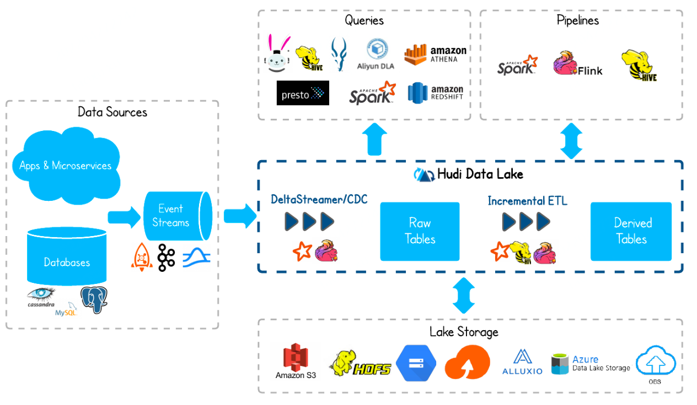

# Hudi Notes

- file:///D:/Programming/ProgrammingNotes/docs/_pdf/hudi/%E5%B0%9A%E7%A1%85%E8%B0%B7%E5%A4%A7%E6%95%B0%E6%8D%AE%E6%8A%80%E6%9C%AF%E4%B9%8BHudi.pdf
- https://hudi.apache.org/cn/docs/overview

## Basic Concepts

### 数据湖

数据湖是一种在系统或存储库中以自然格式存储数据的方法，它有助于以各种模式和结构形式配置数据，通常是对象块或文件。数据湖的主要思想是对企业中的所有数据进行统一存储，从原始数据（源系统数据的精确副本）转换为用于报告、可视化、分析和机器学习等各种任务的目标数据。数据湖中的数据包括结构化数据（关系数据库数据），半结构化数据（CSV、XML、JSON等），非结构化数据（电子邮件，文档，PDF）和二进制数据（图像、音频、视频），从而形成一个容纳所有形式数据的集中式数据存储。

数据湖从本质上来讲，是一种企业数据架构方法，物理实现上则是一个数据存储平台，用来集中化存储企业内海量的、多来源，多种类的数据，并支持对数据进行快速加工和分析。从实现方式来看，目前Hadoop是最常用的部署数据湖的技术，但并不意味着数据湖就是指Hadoop集群。为了应对不同业务需求的特点，MPP数据库+Hadoop集群+传统数据仓库这种“混搭”架构的数据湖也越来越多出现在企业信息化建设规划中。

**数据湖的就是原始数据保存区**. 虽然这个概念国内谈的少，但**绝大部分互联网公司都已经有了**。国内一般把整个HDFS叫做数据仓库（广义），即存放所有数据的地方，而国外一般叫数据湖（data lake）

计算引擎之下、底层存储之上的一个中间层。核心特点是将事务能力带到了大数据领域。

数据湖三剑客：

- Apache Hudi--Uber
- Delta Lake--Databricks
- Apache Iceberg--Netflix

#### Why 数据湖

COW ROM

### 概要

Apache Hudi，Hudi是**Hadoop Updates Delete and Incrementals**的简写，它是由Uber开发并开源的Data Lakes解决方案。

(Incrementals:渐进映像)

Hudi在Hadoop体系架构中的位置:

流批一体

