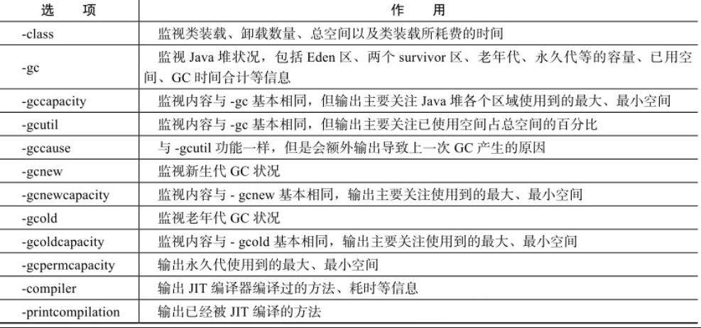

# JVM notes


# MyNotes


# 深入理解Java虚拟机

《深入理解Java虚拟机》JVM高级特性和最佳实践

周志明- 第三版

## C0-前言

本书一共分为五个部分：**走近Java、自动内存管理、虚拟机执行子系统、程序编译与代码优化、 高效并发**。

本书介绍的Java虚拟机并不局限于某一个特定发行商或者某一款特定虚拟机，只是由于 OracleJDK/OpenJDK在市场占有率上的绝对优势，其中的HotSpot虚拟机不可避免地成为本书主要分 析、讲解的对象

JDK从1.5版本开始，其官方的正式文档与宣传材料中的发行版本号启用了JDK 5、6、7……的新 命名方式；从2018年3月发布的JDK 10起，JDK的开发版本号（如java-version）也放弃了以前1.x的命 名形式，改为按发布的日期时间命名


## C1-走进java

第一部分：走进java

### 技术体系

从广义上讲，Kotlin、Clojure、JRuby、Groovy等运行于Java虚拟机上的编程语言及其相关的程序 都属于Java技术体系中的一员

可以把**Java程序设计语言、Java虚拟机、Java类库**这三部分统称为**JDK**（Java Development Kit），JDK是用于支持Java程序开发的最小环境


- Java ME（Micro Edition）：支持Java程序运行在移动终端（手机、PDA）上的平台，对Java API 有所精简，并加入了移动终端的针对性支持，这条产品线在JDK 6以前被称为J2ME。有一点读者请勿 混淆，现在在智能手机上非常流行的、主要使用Java语言开发程序的Android并不属于Java ME。 
- ·Java SE（Standard Edition）：支持面向桌面级应用（如Windows下的应用程序）的Java平台，提 供了完整的Java核心API，这条产品线在JDK 6以前被称为J2SE。 
- ·Java EE（Enterprise Edition）：支持使用多层架构的企业应用（如ERP、MIS、CRM应用）的 Java平台，除了提供Java SE API外，还对其做了大量有针对性的扩充[4]，并提供了相关的部署支持， 这条产品线在JDK 6以前被称为J2EE，在JDK 10以后被Oracle放弃，捐献给Eclipse基金会管理，此后被 称为Jakarta EE

### 发展史

1991年4月，由James Gosling博士领导的绿色计划（Green Project）开始启动，此计划最初的目标 是开发一种能够在各种消费性电子产品（如机顶盒、冰箱、收音机等）上运行的程序架构。这个计划 的产品就是Java语言的前身：Oak（得名于James Gosling办公室外的一棵橡树）。Oak当时在消费品市 场上并不算成功，但随着1995年互联网潮流的兴起，Oak迅速找到了最适合自己发展的市场定位并蜕 变成为Java语言。


Java没有分裂，JDK 9总算是带着 Jigsaw最终发布了，除了Jigsaw外，JDK 9还增强了若干工具（JS Shell、JLink、JHSDB等），整顿了 HotSpot各个模块各自为战的日志系统，支持HTTP 2客户单API等91个JEP。

JDK 9发布后，Oracle随即宣布Java将会以持续交付的形式和更加敏捷的研发节奏向前推进，以后 **JDK将会在每年的3月和9月各发布一个大版本**，目的就是为避免众多功能特性被集中捆绑到一个 JDK版本上而引发交付风险。这次改革确实从根源上解决了跳票问题，但也为Java的用户和发行商带 来了颇大的压力，不仅程序员感慨“Java新版本还没开始用就已经过时了”，Oracle自己对着一堆JDK版 本分支也在挠头，不知道该如何维护更新，该如何提供技术支持

Oracle的解决方案是顺理成章地终 结掉“每个JDK版本最少维护三年”的优良传统，从此以后，**每六个JDK大版本中才会被划出一个长期 支持（Long Term Support，LTS）版**，只有LTS版的JDK能够获得为期三年的支持和更新，普通版的 JDK就只有短短六个月的生命周期。**JDK 8和JDK 11会是LTS版**，再下一个就到2021年发布的**JDK 17** 了。


按常理说Java刚给Oracle赚了88亿美金，该颇为受宠才对，可Oracle是典型只谈利益不讲情怀的公 司，InfoWorld披露的一封Oracle高管邮件表明[13]，Java体系中被认为无法盈利也没有太多战略前景的 部分会逐渐被“按计划报废”（Planned Obsolescence）。这事的第一刀落下是在2018年3月，O**racle正式 宣告Java EE成为历史名词**。虽然Java SE、Java EE和Java ME三条产品线里确实只有Java SE称得上成 功，但Java EE毕竟无比辉煌过，现在其中还持有着JDBC、JMS、Servlet等使用极为广泛的基础组件， 然而Oracle仍选择把它“扫地出门”，所有权直接赠送给Eclipse基金会，唯一的条件是以后不准再使 用“Java”这个商标[14]，所以取而代之的将是Jakarta EE。


随着JDK 11发布，Oracle同时调整了JDK的授权许可证，里面包含了好几个动作。首先，**Oracle从JDK 11起把以前的商业特性[16]全部开源给OpenJDK，这样OpenJDK 11和OracleJDK 11的代码和功 能，在本质上就是完全相同的**（官方原文是Essentially Identical）[17]。然后，**Oracle宣布以后将会同时 发行两个JDK：一个是以GPLv2+CE协议下由Oracle发行的OpenJDK（本书后面章节称其为Oracle OpenJDK），另一个是在新的OTN协议下发行的传统的OracleJDK**，这两个JDK共享绝大部分源码， 在功能上是几乎一样的[18]，核心差异是前者可以免费在开发、测试或生产环境中使用，但是只有半 年时间的更新支持；后者个人依然可以免费使用，但若在生产环境中商用就必须付费，可以有三年时 间的更新支持。如果说由此能得出“Java要收费”的结论，那是纯属标题党，最多只能说Oracle在迫使商 业用户要么不断升级JDK的版本，要么就去购买商业支持


**2019年2月，在JDK 12发布前夕，Oracle果然如之前宣布那样在六个月之后就放弃了对上一个版本 OpenJDK的维护，RedHat同时从Oracle手上接过OpenJDK 8和OpenJDK 11的管理权利和维护职责** [20]。Oracle不愿意在旧版本上继续耗费资源，而RedHat或者说它背后的IBM又乐意扩大自己在Java社 区的影响力，这是一笔双赢的交易。RedHat代替Oracle成为JDK历史版本的维护者，应该有利于Java的 持续稳定，但从技术发展角度来看，这并不能为Oracle领导Java社区的局面带来根本性的改变，毕竟要 添加新的或实验性的功能，仅会针对Java的最新版本，而不会在旧版本上动手


java: sum => oracle => openjdk + oraclejdk

### java虚拟机家族

#### Sun Classic/Exact VM

世界上第一款商用Java虚拟机

#### Sun HotSpot VM

最初并非由Sun公司开发，而是由一家名为“Longview Technologies”的小公司设计的

HotSpot VM既继承了Sun之前两款商用虚拟机的优点（如前面提到的**准确式内存管理**），也有许多自己新的技术优势，如它名称中的**<u>HotSpot指的就是它的热点代码探测技术</u>**

**HotSpot VM的热点代码探测能力可以通过执行计数器找出最具有编译价值的代码**,然后通知JIT编译器以方法为单位进行编译。如果一个方法被频繁调用，或方法中有效循环次数很多，将会分别触发标准编译和OSR（栈上替换）编译动作。**通过编译器与解释器恰当地协同工作**，可以在最优化的**程序响应时间与最佳执行性能中取得平衡**，而且无须等待本地代码输出才能执行程序，即时编译的时间压力也相对减小，这样有助于引入更多的代码优化技术，输出质量更高的本地代码。

### 展望Java技术的未来

- 模块化：java 9中发布

- 混合语言

  

  

- 多核并行：早在JDK 1.5就已经引入java.util.concurrent包实现了一个粗粒度的并发框架。而JDK 1.7中加入的j**ava.util.concurrent.forkjoin**包则是对这个框架的一次重要扩充。Fork/Join模式是处理并行编程的一个经典方法

  函数式编程的一个重要优点就是这样的程序天然地适合并行运行，这对Java语言在多核时代继续保持主流语言的地位有很大帮助(函数式编程：不可变性)

- 丰富语法

- 64位虚拟机：Java程序运行在64位虚拟机上需要付出比较大的额外代价：占用更多内存、性能不如32位。 JDK 1.6 Update 14之后，提供了普通对象指针压缩功能（-XX:+ **UseCompressedOops**，这个参数不建议显式设置，建议维持默认由虚拟机的Ergonomics机制自动开启），在执行代码时，动态植入压缩指令以节省内存消耗，但是开启压缩指针会增加执行代码数量

## C2-Java内存区域与内存溢出异常

第二部分 自动内存管理机制

Java与C++之间有一堵由**内存动态分配和垃圾收集技术**所围成的“高墙”，墙外面的人想进去，墙里面的人却想出来。

### 运行时数据区域

Java虚拟机所管理的内存将会包括以下几个运行时数据区域


#### 程序计数器

**程序计数器（Program Counter Register）是一块较小的内存空间**，它可以看作是**当前线程所执行的字节码的<u>行号指示器</u>**。在虚拟机的概念模型里（仅是概念模型，各种虚拟机可能会通过一些更高效的方式去实现），字节码解释器工作时就是通过改变这个计数器的值来选取下一条需要执行的字节码指令，分支、循环、跳转、异常处理、线程恢复等基础功能都需要依赖这个计数器来完成。

每条线程都需要有一个独立的程序计数器，各条线程之间计数器互不影响，独立存储，我们称这类内存区域为“线程私有”的内存。

如果线程正在执行的是一个Java方法，这个计数器记录的是正在执行的虚拟机字节码指令的地址；如果正在执行的是Native方法，这个计数器值则为空（Undefined）。此内存区域是唯一一个在Java虚拟机规范中没有规定任何OutOfMemoryError情况的区域。

#### 虚拟机栈

与程序计数器一样，Java虚拟机栈（Java Virtual Machine Stacks）也是线程私有的，它的生命周期与线程相同。虚拟机栈描述的是**Java方法执行的内存模型：每个方法在执行的同时都会创建一个栈帧（Stack Frame)用于存储局部变量表、操作数栈、动态链接、方法出口等信息**。每一个方法从调用直至执行完成的过程，就对应着一个栈帧在虚拟机栈中入栈到出栈的过程。

虚拟机栈中**局部变量表存放了编译期可知的各种基本数据类型（boolean、byte、char、short、int、float、long、double）、对象引用（reference类型**，它不等同于对象本身，可能是一个指向对象起始地址的引用指针，也可能是指向一个代表对象的句柄或其他与此对象相关的位置）和returnAddress类型（指向了一条字节码指令的地址）。

其中64位长度的long和double类型的数据会占用**2个局部变量空间（Slot）**，其余的数据类型只占用1个。**局部变量表所需的内存空间在编译期间完成分配**，当进入一个方法时，这个方法需要在帧中分配多大的局部变量空间是完全确定的，在方法运行期间不会改变局部变量表的大小。

在Java虚拟机规范中，对**这个区域规定了两种异常**状况：**如果线程请求的栈深度大于虚拟机所允许的深度，将抛出StackOverflowError异常**；**如果虚拟机栈可以动态扩展（当前大部分的Java虚拟机都可动态扩展，只不过Java虚拟机规范中也允许固定长度的虚拟机栈），如果扩展时无法申请到足够的内存，就会抛出OutOfMemoryError异常。**

#### 本地方法栈

本地方法栈（Native Method Stack）与虚拟机栈所发挥的作用是非常相似的，它们之间的区别不过是虚拟机栈为虚拟机执行Java方法（也就是字节码）服务，而本地方法栈则为虚拟机使用到的Native方法服务。在虚拟机规范中对本地方法栈中方法使用的语言、使用方式与数据结构并没有强制规定，因此具体的虚拟机可以自由实现它。甚至有的虚拟机（譬如Sun HotSpot虚拟机）直接就把本地方法栈和虚拟机栈合二为一

#### java堆

- 最大的一块内存
- 线程共享
- 唯一目的：存放实例对象(包含数据等)
- JIT编译与逃逸技术的发展，让栈上分配也是可以的
- 堆是来及收集器作用的区域，因此也称为GC堆
- 

现在的GC都是分代收集，堆还可以细分为：

- 新生代
  - Eden
  - from survivor
  - to survivor
- 老年代


线程共享的Java堆中可能划分出多个线程私有的分配缓冲区**（Thread Local Allocation Buffer，TLAB）**

Java堆可以处于物理上不连续的内存空间中，只要逻辑上是连续的即可，就像我们的磁盘空间一样

在实现时，既可以实现成固定大小的，也可以是可扩展的，不过当前主流的虚拟机都是按照可扩展来实现的（**通过-Xmx和-Xms控制**）

#### 方法区

- method area
- 线程共享
- 存储已经加载的 **类信息、常量、静态变量、即使编译器编译后的代码等**
- 方法区是jvm规范，在Hotspot上，其实现被称为 **永久代Permanent Generation**， 永久代也在GC范围。其他jvm不存在永久代
- 使用永久代来实现方法区，现在看来并不是一个好主意，因为这样更容易遇到内存溢出问题（永久代有-XX:MaxPermSize的上限
- 有移除永久代的规划，目前已经发布的JDK 1.7的HotSpot中，已经把原本放在永久代的字符串常量池移出
- 方法区内存回收较少，主要针对常量池的回收和类型的卸载

#### 运行时常量池

**运行时常量池（Runtime Constant Pool）**是方法区的一部分。Class文件中除了有类的版本、字段、方法、接口等描述信息外，还有一项信息是**常量池**（Constant Pool Table），用于存放编译期生成的各种字面量和符号引用，这部分内容将在类加载后进入方法区的运行时常量池中存放。

运行时常量池相对于Class文件常量池的另外一个重要特征是具备动态性，Java语言并不要求常量一定只有编译期才能产生，也就是并非预置入Class文件中常量池的内容才能进入方法区运行时常量池，运行期间也可能将新的常量放入池中，这种特性被开发人员利用得比较多的便是**String类的intern()**方法。

> 在JDK1.6及之前运行时常量池逻辑包含字符串常量池存放在方法区, 此时hotspot虚拟机对方法区的实现为永久代（位于堆内存中）
>
> 在JDK1.7 字符串常量池被从方法区拿到了堆中, 这里没有提到运行时常量池,也就是说字符串常量池被单独拿到堆,运行时常量池剩下的东西还在方法区, 也就是hotspot中的永久代
>
> 在JDK1.8 hotspot移除了永久代用元空间取而代之, 这时候字符串常量池还在堆, 运行时常量池还在方法区, 只不过方法区的实现从永久代变成了元空间(堆外内存)

#### 直接内存

直接内存（Direct Memory）**并不是虚拟机运行时数据区的一部分，也不是Java虚拟机规范中定义的内存区域**

在JDK 1.4中新加入了NIO（New Input/Output）类，引入了一种基于通道（Channel）与缓冲区（Buffer）的I/O方式，它可以使用Native函数库直接分配堆外内存，然后通过一个存储在Java堆中的DirectByteBuffer对象作为这块内存的引用进行操作。这样能在一些场景中显著提高性能，因为避免了在Java堆和Native堆中来回复制数据。

### Hotspot虚拟机对象探秘

HotSpot虚拟机在Java堆中对象分配、布局和访问的全过程

#### 对象的创建

虚拟机遇到一条new指令时，首先将去检查这个指令的参数是否能在**常量池中定位到一个类的符号引用**，并且检查这个符号引用代表的类是否已被加载、解析和初始化过。如果没有，那必须先执行相应的类加载过程

在类加载检查通过后，接下来虚拟机将为新生对象分配内存。对象所需内存的大小在类加载完成后便可完全确定

几种分配方式：

- 指针碰撞：Bump the Pointer，假设Java堆中**内存是绝对规整的**，所有用过的内存都放在一边，空闲的内存放在另一边，中间放着一个指针作为分界点的指示器，那所分配内存就仅仅是把那个指针向空闲空间那边挪动一段与对象大小相等的距离。 （为了保持规整，必须要整理已分配的内存，避免回收后出现碎片）
- 空闲列表：free list，堆中的内存并不是规整，必须维护一个列表，记录上哪些内存块是可用的，在分配的时候从列表中找到一块足够大的空间划分给对象实例，并更新列表上的记录

选择哪种分配方式由J**ava堆是否规整决定**，而Java堆是否规整又由所采用的**垃圾收集器是否带有压缩整理**功能决定。因此，在使用**Serial、ParNew等带Compact过程的收集器时，系统采用的分配算法是指针碰撞**，而使用**CMS这种基于Mark-Sweep算法的收集器时，通常采用空闲列表**。

除如何划分可用空间之外，还有另外一个需要考虑的问题是对象创建在虚拟机中是非常频繁的行为，即使是仅仅修改一个指针所指向的位置，在并发情况下也并不是线程安全的，可能出现正在给对象A分配内存，指针还没来得及修改，对象B又同时使用了原来的指针来分配内存的情况。解决这个问题有两种方案，一种是对分配内存空间的动作进行同步处理——实际上虚拟机采用CAS配上失败重试的方式保证更新操作的原子性；另一种是把内存分配的动作按照线程划分在不同的空间之中进行，即每个线程在Java堆中预先分配一小块内存，称为本地线程分配缓冲（Thread Local Allocation Buffer，TLAB）。哪个线程要分配内存，就在哪个线程的TLAB上分配，只有TLAB用完并分配新的TLAB时，才需要同步锁定。虚拟机是否使用TLAB，可以通过-**XX:+/-UseTLAB**参数来设定。

内存分配完成后，虚拟机需要**将分配到的内存空间都初始化为零值（不包括对象头）**，如果使用TLAB，这一工作过程也可以提前至TLAB分配时进行。这一步操作保证了对象的实例字段在Java代码中可以不赋初始值就直接使用，程序能访问到这些字段的数据类型所对应的零值。

接下来，虚拟机要对对象进行必要的设置，例如这个对象是哪个类的实例、如何才能找到类的元数据信息、对象的哈希码、对象的GC分代年龄等信息。这些信息存放在对象的**<u>对象头（Object Header）</u>**之中。根据虚拟机当前的运行状态的不同，如是否启用偏向锁等，对象头会有不同的设置方式

执行new指令之后会接着执行**<init>**方法，把对象按照程序员的意愿进行初始化，这样一个真正可用的对象才算完全产生出来。

HotSpot虚拟机bytecodeInterpreter.cpp中的代码片段：

```cpp
//确保常量池中存放的是已解释的类
if (!constants->tag_at(index).is_unresolved_klass()) {
  //断言确保是klassOop和instanceKlassOop（这部分下一节介绍）
  oop entry = (klassOop) ＊constants->obj_at_addr(index);
  assert(entry->is_klass(), "Should be resolved klass");
  klassOop k_entry = (klassOop) entry;
  assert(k_entry->klass_part()->oop_is_instance(), "Should be instanceKlass");
  instanceKlass＊ ik = (instanceKlass＊) k_entry->klass_part();
  //确保对象所属类型已经经过初始化阶段
  if ( ik->is_initialized() && ik->can_be_fastpath_allocated() )
  {
  //取对象长度
  size_t obj_size = ik->size_helper();
  oop result = NULL;
  //记录是否需要将对象所有字段置零值
  bool need_zero = !ZeroTLAB;
  //是否在TLAB中分配对象
  if (UseTLAB) {
    result = (oop) THREAD->tlab().allocate(obj_size);
  }
  if (result == NULL) {
    need_zero = true;
    //直接在eden中分配对象
retry:
    HeapWord＊ compare_to = ＊Universe::heap()->top_addr();
    HeapWord＊ new_top = compare_to + obj_size;
    /* cmpxchg是x86中的CAS指令，这里是一个C++方法，通过CAS方式分配空间，如果并发失败，
转到retry中重试，直至成功分配为止*/
    if (new_top <= ＊Universe::heap()->end_addr()) {
      if (Atomic::cmpxchg_ptr(new_top, Universe::heap()->top_addr(), compare_to) != compare_to) {
        goto retry;
      }
      result = (oop) compare_to;
    }
  }
  if (result != NULL) {
    //如果需要，则为对象初始化零值
    if (need_zero ) {
      HeapWord＊ to_zero = (HeapWord＊) result + sizeof(oopDesc) / oopSize;
      obj_size -= sizeof(oopDesc) / oopSize;
      if (obj_size > 0 ) {
        memset(to_zero, 0, obj_size ＊ HeapWordSize);
      }
    }
    //根据是否启用偏向锁来设置对象头信息
    if (UseBiasedLocking) {
      result->set_mark(ik->prototype_header());
    } else {
      result->set_mark(markOopDesc::prototype());
    }
    result->set_klass_gap(0);
    result->set_klass(k_entry);
    //将对象引用入栈，继续执行下一条指令
    SET_STACK_OBJECT(result, 0);
      UPDATE_PC_AND_TOS_AND_CONTINUE(3, 1);
    }
  }
}
```

#### 对象的内存布局

在HotSpot虚拟机中，对象在内存中存储的布局可以分为3块区域：

- **对象头（Header）**
- **实例数据（Instance Data）**
- **对齐填充（Padding）**

对象头包括两部分信息，第一部分用于存储**对象自身的运行时数据，如哈希码（HashCode）、GC分代年龄、锁状态标志、线程持有的锁、偏向线程ID、偏向时间戳等**，这部分数据的长度在32位和64位的虚拟机（未开启压缩指针）中分别为32bit和64bit，官方称它为**“Mark Word“**

Mark Word被设计成一个非固定的数据结构以便在极小的空间内存储尽量多的信息，它会根据对象的状态复用自己的存储空间


对象头的另外一部分是类型指针，即对象指向它的类元数据的指针，虚拟机通过这个指针来确定这个对象是哪个类的实例

另外，如果对象是一个Java数组，那在对象头中还必须有一块用于记录数组长度的数据，因为虚拟机可以通过普通Java对象的元数据信息确定Java对象的大小，但是从数组的元数据中却无法确定数组的大小。

接下来的实例数据部分是**对象真正存储的有效信息**，也是在程序代码中所定义的各种类型的字段内容。无论是从父类继承下来的，还是在子类中定义的，都需要记录起来。这部分的存储顺序会受到虚拟机分配策略参数（FieldsAllocationStyle）和字段在Java源码中定义顺序的影响。HotSpot虚拟机默认的分配策略为longs/doubles、ints、shorts/chars、bytes/booleans、oops（Ordinary Object Pointers），从分配策略中可以看出，相同宽度的字段总是被分配到一起。在满足这个前提条件的情况下，在父类中定义的变量会出现在子类之前。如果CompactFields参数值为true（默认为true），那么子类之中较窄的变量也可能会插入到父类变量的空隙之中。

对齐填充并不是必然存在的，也没有特别的含义，它仅仅起着占位符的作用。由于HotSpot VM的自动内存管理系统要求对象起始地址必须是8字节的整数倍，换句话说，就是对象的大小必须是8字节的整数倍

#### 对象的访问定位

Java程序需要**通过栈上的reference数据来操作堆上的具体对象**。由于reference类型在Java虚拟机规范中只规定了一个指向对象的引用，并没有定义这个引用应该通过何种方式去定位、访问堆中的对象的具体位置，所以对象访问方式也是取决于虚拟机实现而定的。目前主流的访问方式有使用**句柄和直接指针**两种。

如果使用句柄访问的话，那么Java堆中将会划分出一块内存来作为句柄池，reference中存储的就是对象的句柄地址，而句柄中包含了对象实例数据与类型数据各自的具体地址信息


如果使用直接指针访问，那么Java堆对象的布局中就必须考虑如何放置访问类型数据的相关信息，而reference中存储的直接就是对象地址


这两种对象访问方式各有优势，使用句柄来访问的最大好处就是reference中存储的是**稳定的句柄地址**，在对象被移动（垃圾收集时移动对象是非常普遍的行为）时只会改变句柄中的实例数据指针，而reference本身不需要修改。

使用**直接指针访问方式的最大好处就是速度更快**，它节省了一次指针定位的时间开销，由于对象的访问在Java中非常频繁，因此这类开销积少成多后也是一项非常可观的执行成本。就本书讨论的主要虚拟机Sun HotSpot而言，它是使用第二种方式进行对象访问的，但从整个软件开发的范围来看，各种语言和框架使用句柄来访问的情况也十分常见。

### OOM

处理PC都有OOM

#### 堆OOM

要解决这个区域的异常，一般的手段是先通过**内存映像分析工具（**如Eclipse Memory Analyzer）对Dump出来的堆转储快照进行分析，重点是确认**内存中的对象是否是必要的**，也就是要先分清楚到底是出现了内存泄漏（Memory Leak）还是内存溢出（Memory Overflow

如果是内存泄露，可进一步通过工具查看**泄露对象到GC Roots的引用链**。于是就能找到**泄露对象是通过怎样的路径与GC Roots相关联并导致垃圾收集器无法自动回收它们的**。掌握了泄露对象的类型信息及GC Roots引用链的信息，就可以比较准确地定位出泄露代码的位置

如果不存在泄露，换句话说，就是内存中的对象确实都还必须存活着，那就应当检查虚拟机的堆参数（-Xmx与-Xms），与机器**物理内存对比看是否还可以调大**，从代码上检查是否存在**某些对象生命周期过长、持有状态时间过长的情况，尝试减少程序运行期的内存消耗**。

#### 虚拟机栈和本地方法栈溢出

**<u>在HotSpot虚拟机中并不区分虚拟机栈和本地方法栈</u>**，因此，对于HotSpot来说，虽然-Xoss参数（设置本地方法栈大小）存在，但实际上是无效的，栈容量只由-Xss参数设定

在Java虚拟机规范中描述了两种异常：

- 如果线程请求的栈深度大于虚拟机所允许的最大深度，将抛出**StackOverflowError**异常。
- 如果虚拟机在扩展栈时无法申请到足够的内存空间，则抛出**OutOfMemoryError**异常。

#### 方法区和运行时常量池溢出

String.intern()是一个Native方法，它的作用是：如果字符串常量池中已经包含一个等于此String对象的字符串，则返回代表池中这个字符串的String对象；否则，将此String对象包含的字符串添加到常量池中，并且返回此String对象的引用

**在JDK 1.6及之前的版本中，由于常量池分配在永久代内**，我们可以通过-XX:PermSize和-XX:MaxPermSize限制方法区大小，从而间接限制其中常量池的容量

java.lang.OutOfMemoryError: PermGen space 

#### 本机直接内存溢出

DirectMemory容量可通过-XX：MaxDirectMemorySize指定，如果不指定，则默认与Java堆最大值（-Xmx指定）一样

## C3-垃圾收集器与内存分配策略

### 概述

垃圾收集（Garbage Collection，GC）

大部分人都把这项技术当做Java语言的伴生产物。事实上，GC的历史比Java久远，1960年诞生于MIT的Lisp是第一门真正使用内存动态分配和垃圾收集技术的语言

为什么我们还要去了解GC和内存分配呢？答案很简单：当需要排查各种内存溢出、内存泄漏问题时，当垃圾收集成为系统达到更高并发量的瓶颈时，我们就需要对这些“自动化”的技术实施必要的监控和调节。

### 对象存活判断

那些对象需要回收？

#### 引用计数法

给对象中添加一个引用计数器，每当有一个地方引用它时，计数器值就加1；当引用失效时，计数器值就减1；任何时刻计数器为0的对象就是不可能再被使用的

很难解决对象之间相互循环引用的问题： A、B相互引用彼此，但是整体无用了，无法回收

#### 可达性分析算法

在主流的商用程序语言（Java、C#，甚至包括前面提到的古老的Lisp）的主流实现中，都是称通过**可达性分析（Reachability Analysis）**来判定对象是否存活的。

基本思路就是通过一系列的称为“GC Roots”的对象作为起始点，从这些节点开始向下搜索，搜索所走过的路径称为引用链（Reference Chain），当一个对象到GC Roots没有任何引用链相连，则对象已死


在Java语言中，可作为GC Roots的对象包括下面几种：

- **虚拟机栈（栈帧中的本地变量表）中引用的对象。**
- **方法区中类静态属性引用的对象。**
- **方法区中常量引用的对象。**
- **本地方法栈中JNI（即一般说的Native方法）引用的对象。**

#### 引用

在JDK 1.2以前，Java中的引用的定义很传统：**如果reference类型的数据中存储的数值代表的是另外一块内存的起始地址，就称这块内存代表着一个引用**，定义很纯粹，但是太过狭隘，一个对象在这种定义下只有被引用或者没有被引用两种状态，不能描述这样一类对象：**当内存空间还足够时，则能保留在内存之中；如果内存空间在进行垃圾收集后还是非常紧张，则可以抛弃这些对象**。很多系统的缓存功能都符合这样的应用场景。

在JDK 1.2之后，Java对引用的概念进行了扩充，将引用分为**强引用（Strong Reference）、软引用（Soft Reference）、弱引用（Weak Reference）、虚引用（Phantom Reference）**4种

- 强引用就是指在程序代码之中普遍存在的，类似“Object obj = new Object()”这类的引用，只要强引用还存在，垃圾收集器永远不会回收掉被引用的对象。
- 软引用是用来描述一些**还有用但并非必需的对象**。对于软引用关联着的对象，**在系统将要发生内存溢出异常之前，将会把这些对象列进回收范围之中进行第二次回收**。如果这次回收还没有足够的内存，才会抛出内存溢出异常。在JDK 1.2之后，提供了**SoftReference**类来实现软引用。
- 弱引用也是用来描述**非必需对象**的，但是它的强度比软引用更弱一些，被**弱引用关联的对象只能生存到下一次垃圾收集发生之前**。当垃圾收集器工作时，**无论当前内存是否足够，都会回收掉只被弱引用关联的对象**。在JDK 1.2之后，提供了**WeakReference**类来实现弱引用。
- 虚引用也称为**幽灵引用或者幻影引用**，它是最弱的一种引用关系。**一个对象是否有虚引用的存在，完全不会对其生存时间构成影响，也无法通过虚引用来取得一个对象实例。**为一个对象设置虚引用关联的**唯一目的就是能在这个对象被收集器回收时收到一个系统通知**。在JDK 1.2之后，提供了**PhantomReference**类来实现虚引

#### 生存还是死亡

要真正宣告一个对象死亡，至少要经历两次标记过程：

如果对象在进行可达性分析后发现没有与GC Roots相连接的引用链，那它将会被第一次标记并且进行一次筛选，筛选的条件是此对象是否有必要执行finalize()方法。当对象没有覆盖finalize()方法，或者finalize()方法已经被虚拟机调用过，虚拟机将这两种情况都视为“没有必要执行”

如果这个对象被判定为有必要执行finalize()方法，那么这个对象将会放置在一个叫做F-Queue的队列之中，并在稍后由一个由虚拟机自动建立的、低优先级的Finalizer线程去异步执行它

finalize()方法是对象逃脱死亡命运的最后一次机会，稍后GC将对F-Queue中的对象进行第二次小规模的标记，如果对象要在finalize()中成功拯救自己——只要重新与引用链上的任何一个对象建立关联即可，譬如把自己（this关键字）赋值给某个类变量或者对象的成员变量，那在第二次标记时它将被移除出“即将回收”的集合


```java 
/＊＊
 ＊ 此代码演示了两点：
 ＊ 1.对象可以在被GC时自我拯救。
 ＊ 2.这种自救的机会只有一次，因为一个对象的finalize()方法最多只会被系统自动调用一次
 ＊ @author zzm
 ＊/
public class FinalizeEscapeGC {
    public static FinalizeEscapeGC SAVE_HOOK = null;
    public void isAlive() {
            System.out.println("yes, i am still alive :)");
    }
    @Override
    protected void finalize() throws Throwable {
            super.finalize();
            System.out.println("finalize mehtod executed!");
            FinalizeEscapeGC.SAVE_HOOK = this;
    }
    public static void main(String[] args) throws Throwable {
            SAVE_HOOK = new FinalizeEscapeGC();
            //对象第一次成功拯救自己
            SAVE_HOOK = null;
            System.gc();
            //因为finalize方法优先级很低，所以暂停0.5秒以等待它
            Thread.sleep(500);
            if (SAVE_HOOK != null) {
                    SAVE_HOOK.isAlive();
            } else {
                    System.out.println("no, i am dead :(");
            }
            //下面这段代码与上面的完全相同，但是这次自救却失败了
            SAVE_HOOK = null;
            System.gc();
            //因为finalize方法优先级很低，所以暂停0.5秒以等待它
            Thread.sleep(500);
            if (SAVE_HOOK != null) {
                    SAVE_HOOK.isAlive();
            } else {
                    System.out.println("no, i am dead :(");
            }
    }
}

finalize mehtod executed!
yes, i am still alive :)
no, i am dead :(
```

任何一个对象的finalize()方法都只会被系统自动调用一次，如果对象面临下一次回收，它的finalize()方法不会被再次执行

这个方法永远不要用：

运行代价高昂，不确定性大，无法保证各个对象的调用顺序

#### 回收方法区

常规应用进行一次垃圾收集一般可以回收70%～95%的空间，而永久代的垃圾收集效率远低于此。

永久代的垃圾收集主要回收两部分内容：废弃常量和无用的类

以常量池中字面量的回收为例，假如一个字符串“abc”已经进入了常量池中，但是当前系统没有任何一个String对象是叫做“abc”的，换句话说，就是没有任何String对象引用常量池中的“abc”常量，也没有其他地方引用了这个字面量，如果这时发生内存回收，而且必要的话，这个“abc”常量就会被系统清理出常量池

判定一个类是否是“无用的类”的条件则相对苛刻许多。类需要同时满足下面3个条件才能算是“无用的类”：

- 该类所有的实例都已经被回收，也就是Java堆中不存在该类的任何实例。
- 加载该类的ClassLoader已经被回收。
- 该类对应的java.lang.Class 对象没有在任何地方被引用，无法在任何地方通过反射访问该类的方法

在大量使用反射、动态代理、CGLib等ByteCode框架、动态生成JSP以及OSGi这类频繁自定义ClassLoader的场景都需要虚拟机具备类卸载的功能，以保证永久代不会溢出。

#### 垃圾收集算法

##### 标记-清除算法

最基础的收集算法是“标记-清除”（Mark-Sweep）算法，如同它的名字一样，算法分为“标记”和“清除”两个阶段

之所以说它是最基础的收集算法，是因为后续的收集算法都是基于这种思路并对其不足进行改进而得到的。它的主要不足有两个：一个是效率问题，标记和清除两个过程的效率都不高；另一个是空间问题，标记清除之后会产生大量不连续的内存碎片

##### 复制算法

为了解决效率问题，一种称为“复制”（Copying）的收集算法出现了，它将可用内存按容量划分为大小相等的两块，每次只使用其中的一块。当这一块的内存用完了，就将还存活着的对象复制到另外一块上面，然后再把已使用过的内存空间一次清理掉。这样使得每次都是对整个半区进行内存回收，内存分配时也就不用考虑内存碎片等复杂情况，只要移动堆顶指针，按顺序分配内存即可，实现简单，运行高效。只是这种算法的代价是将内存缩小为了原来的一半，未免太高了一点

现在的商业虚拟机都采用这种收集算法来回收新生代，IBM公司的专门研究表明，**新生代中的对象98%是“朝生夕死”的，所以并不需要按照1∶1的比例来划分内存空间，而是将内存分为一块较大的Eden空间和两块较小的Survivor空间，每次使用Eden和其中一块Survivor。当回收时，将Eden和Survivor中还存活着的对象一次性地复制到另外一块Survivor空间上，最后清理掉Eden和刚才用过的Survivor空间。HotSpot虚拟机默认Eden和Survivor的大小比例是8∶1，也就是每次新生代中可用内存空间为整个新生代容量的90% （80%+10%），只有10%的内存会被“浪费”。**当然，98%的对象可回收只是一般场景下的数据，我们没有办法保证每次回收都只有不多于10%的对象存活，当Survivor空间不够用时，需要依赖其他内存（这里指老年代）进行分配担保（Handle Promotion）。

如果另外一块Survivor空间没有足够空间存放上一次新生代收集下来的存活对象时，这些对象将直接通过分配担保机制进入老年代

##### 标记-整理算法

复制收集算法在对象存活率较高时就要进行较多的复制操作，效率将会变低。更关键的是，如果不想浪费50%的空间，就需要有额外的空间进行分配担保，以应对被使用的内存中所有对象都100%存活的极端情况，所以在老年代一般不能直接选用这种算法。

根据老年代的特点，有人提出了另外一种“标记-整理”（Mark-Compact）算法，标记过程仍然与“标记-清除”算法一样，但后续步骤不是直接对可回收对象进行清理，而是让所有存活的对象都向一端移动，然后直接清理掉端边界以外的内存

##### 分代收集算法

当前商业虚拟机的垃圾收集都采用“分代收集”（Generational Collection）算法：

- 新生代：复制算法
- 老年代：标记清除/整理

#### HotSpot的算法实现

##### 枚举根节点

很多应用仅仅方法区就有数百兆，如果要逐个检查这里面的引用，那么必然会消耗很多时间

GC进行时必须停顿所有Java执行线程（Sun将这件事情称为“**Stop The World**”），即使是在号称（几乎）不会发生停顿的CMS收集器中，枚举根节点时也是必须要停顿的。

由于目前的主流Java虚拟机使用的都是准确式GC（这个概念在第1章介绍Exact VM对Classic VM的改进时讲过），所以当执行系统停顿下来后，并不需要一个不漏地检查完所有执行上下文和全局的引用位置，虚拟机应当是有办法直接得知哪些地方存放着对象引用。在HotSpot的实现中，是使用一组称为OopMap的数据结构来达到这个目的的，在类加载完成的时候，HotSpot就把对象内什么偏移量上是什么类型的数据计算出来，在JIT编译过程中，也会在特定的位置记录下栈和寄存器中哪些位置是引用。这样，GC在扫描时就可以直接得知这些信息

##### 安全点

HotSpot也的确没有为每条指令都生成OopMap，前面已经提到，只是在“特定的位置”记录了这些信息，这些位置称为安全点（**Safepoint**），**即程序执行时并非在所有地方都能停顿下来开始GC，只有在到达安全点时才能暂停**。Safepoint的选定既不能太少以致于让GC等待时间太长，也不能过于频繁以致于过分增大运行时的负荷。所以，安全点的选定基本上是以程序“是否具有让程序长时间执行的特征”为标准进行选定的——因为每条指令执行的时间都非常短暂，程序不太可能因为指令流长度太长这个原因而过长时间运行**，“长时间执行”的最明显特征就是指令序列复用，例如方法调用、循环跳转、异常跳转等，所以具有这些功能的指令才会产生Safepoint**。

对于Sefepoint，另一个需要考虑的问题是如何在GC发生时让所有线程（这里不包括执行JNI调用的线程）都“跑”到最近的安全点上再停顿下来。这里有两种方案可供选择：抢先式中断（Preemptive Suspension）和主动式中断（Voluntary Suspension），其中抢先式中断不需要线程的执行代码主动去配合，在GC发生时，首先把所有线程全部中断，如果发现有线程中断的地方不在安全点上，就恢复线程，让它“跑”到安全点上。现在几乎没有虚拟机实现采用抢先式中断来暂停线程从而响应GC事件。而主动式中断的思想是当GC需要中断线程的时候，不直接对线程操作，仅仅简单地设置一个标志，各个线程执行时主动去轮询这个标志，发现中断标志为真时就自己中断挂起。

##### 安全区域

使用Safepoint似乎已经完美地解决了如何进入GC的问题，但实际情况却并不一定。Safepoint机制保证了程序执行时，在不太长的时间内就会遇到可进入GC的Safepoint。但是，程序“不执行”的时候呢？所谓的程序不执行就是没有分配CPU时间，典型的例子就是线程处于Sleep状态或者Blocked状态，这时候线程无法响应JVM的中断请求，“走”到安全的地方去中断挂起，JVM也显然不太可能等待线程重新被分配CPU时间。对于这种情况，就需要安全区域（Safe Region）来解决。

安全区域是指在一段代码片段之中，引用关系不会发生变化。在这个区域中的任意地方开始GC都是安全的。我们也可以把Safe Region看做是被扩展了的Safepoint。

#### 垃圾回收器

收集算法的具体实现


虽然我们是在对各个收集器进行比较，但并非为了挑选出一个最好的收集器。因为直到现在为止还没有最好的收集器出现，更加没有万能的收集器，所以我们选择的只是对具体应用最合适的收集器

##### Serial收集器

Serial收集器是最基本、发展历史最悠久的收集器

- Serial：串行
- 单线程收集器
  - 单个线程去收集
  - stop the world
- 简单而高效
- 虚拟机运行在Client模式下的默认新生代收集器


HotSpot虚拟机开发团队为消除或者减少工作线程因内存回收而导致停顿的努力一直在进行着，从**Serial**收集器到**Parallel**收集器，再到**Concurrent Mark Sweep（CMS）**乃至GC收集器的最前沿成果**Garbage First（G1）**收集器

##### ParNew收集器

ParNew收集器其实就是Serial收集器的多线程版本


是许多运行在Server模式下的虚拟机中首选的新生代收集器，其中有一个与性能无关但很重要的原因是，除了Serial收集器外，目前只有它能与CMS收集器配合工作

在JDK 1.5时期，HotSpot推出了一款在强交互应用中几乎可认为有划时代意义的垃圾收集器——CMS收集器（Concurrent Mark Sweep，本节稍后将详细介绍这款收集器），这款收集器是HotSpot虚拟机中第一款**真正意义上的并发（Concurrent）收集器，它第一次实现了让垃圾收集线程与用户线程（基本上）同时工作**

##### Parallel Scavenge收集器

新生代收集器

Parallel Scavenge收集器的特点是它的关注点与其他收集器不同，CMS等收集器的关注点是尽可能地缩短垃圾收集时用户线程的停顿时间，而Parallel Scavenge收集器的目标则是达到一个可控制的吞吐量（Throughput）。所谓吞吐量就是CPU用于运行用户代码的时间与CPU总消耗时间的比值，即吞吐量 = 运行用户代码时间 /（运行用户代码时间 +垃圾收集时间），虚拟机总共运行了100分钟，其中垃圾收集花掉1分钟，那吞吐量就是99%。

停顿时间越短就越适合需要与用户交互的程序，良好的响应速度能提升用户体验，而高吞吐量则可以高效率地利用CPU时间，尽快完成程序的运算任务，主要适合在后台运算而不需要太多交互的任务。

##### Serial Old收集器

Serial Old是Serial收集器的老年代版本，它同样是一个单线程收集器，使用“标记-整理”算法


##### Parallel Old收集器

Parallel Old是Parallel Scavenge收集器的老年代版本，使用多线程和“标记-整理”算法

重吞吐量以及CPU资源敏感的场合，都可以优先考虑Parallel Scavenge加Parallel Old收集器


##### CMS收集器

CMS（Concurrent Mark Sweep）收集器是一种以**获取最短回收停顿时间为目标的收集器**。目前很大一部分的Java应用集中在互联网站或者B/S系统的服务端上，这类应用尤其重视服务的响应速度，希望系统停顿时间最短，以给用户带来较好的体验。CMS收集器就非常符合这类应用的需求。

- 标记—**清除**算法 sweep(打扫)

运作过程相对于前面几种收集器来说更复杂一些，整个过程分为4个步骤，包括：

- 初始标记（CMS initial mark）
- 并发标记（CMS concurrent mark）
- 重新标记（CMS remark）
- 并发清除（CMS concurrent sweep）

初始标记、重新标记这两个步骤仍然需要“Stop The World”。初始标记仅仅只是标记一下GC Roots能直接关联到的对象，速度很快，并发标记阶段就是进行GC Roots Tracing的过程，而重新标记阶段则是为了修正并发标记期间因用户程序继续运作而导致标记产生变动的那一部分对象的标记记录，这个阶段的停顿时间一般会比初始标记阶段稍长一些，但远比并发标记的时间短。

由于整个过程中耗时最长的并发标记和并发清除过程收集器线程都可以与用户线程一起工作，所以，从总体上来说，CMS收集器的内存回收过程是与用户线程一起并发执行的


CMS是一款优秀的收集器，它的主要优点在名字上已经体现出来了：**并发收集、低停顿**，Sun公司的一些官方文档中也称之为并发低停顿收集器（Concurrent Low Pause Collector）

缺点：

- CMS收集器对CPU资源非常敏感。其实，面向并发设计的程序都对CPU资源比较敏感。在并发阶段，它虽然不会导致用户线程停顿，但是会因为占用了一部分线程（或者说CPU资源）而导致应用程序变慢，总吞吐量会降低。CMS默认启动的回收线程数是（CPU数量+3）/ 4，也就是当CPU在4个以上时，并发回收时垃圾收集线程不少于25%的CPU资源。 如果本来CPU负载就比较大，还分出一半的运算能力去执行收集器线程，就可能导致用户程序的执行速度忽然降低了50%，其实也让人无法接受
- 无法处理浮动垃圾（Floating Garbage），可能出现“Concurrent Mode Failure”失败而导致另一次Full GC的产生。由于CMS并发清理阶段用户线程还在运行着，伴随程序运行自然就还会有新的垃圾不断产生，这一部分垃圾出现在标记过程之后，CMS无法在当次收集中处理掉它们，只好留待下一次GC时再清理掉。这一部分垃圾就称为“浮动垃圾”
- 标记—清除：收集结束时会有大量空间碎片产生。空间碎片过多时，将会给大对象分配带来很大麻烦，往往会出现老年代还有很大空间剩余，但是无法找到足够大的连续空间来分配当前对象，不得不提前触发一次**Full GC**，为了解决这个问题，CMS收集器提供了一个-XX:+UseCMSCompactAtFullCollection开关参数（默认就是开启的），用于在CMS收集器顶不住要进行FullGC时开启内存碎片的合并整理过程，内存整理的过程是无法并发的，空间碎片问题没有了，但停顿时间不得不变长。虚拟机设计者还提供了另外一个参数-XX:CMSFullGCsBeforeCompaction，这个参数是用于设置执行多少次不压缩的Full GC后，跟着来一次带压缩的（默认值为0，表示每次进入Full GC时都进行碎片整理）。

##### G1

G1（Garbage-First）收集器是当今收集器技术发展的最前沿成果之一

G1是一款面向服务端应用的垃圾收集器。HotSpot开发团队赋予它的使命是（在比较长期的）未来可以替换掉JDK 1.5中发布的CMS收集器。与其他GC收集器相比，G1具备如下特点。

- 并行与并发：G1能充分利用多CPU、多核环境下的硬件优势，使用多个CPU（CPU或者CPU核心）来缩短Stop-The-World停顿的时间，部分其他收集器原本需要停顿Java线程执行的GC动作，G1收集器仍然可以通过并发的方式让Java程序继续执行
- 分代收集：与其他收集器一样，分代概念在G1中依然得以保留。虽然G1可以不需要其他收集器配合就能独立管理整个GC堆，但它能够采用不同的方式去处理新创建的对象和已经存活了一段时间、熬过多次GC的旧对象以获取更好的收集效果。
- 空间整合：与CMS的“标记—清理”算法不同，G1从整体来看是基于“标记—整理”算法实现的收集器，从局部（两个Region之间）上来看是基于“复制”算法实现的，但无论如何，这两种算法都意味着G1运作期间不会产生内存空间碎片，收集后能提供规整的可用内存。这种特性有利于程序长时间运行，分配大对象时不会因为无法找到连续内存空间而提前触发下一次GC。

在G1之前的其他收集器进行收集的范围都是整个新生代或者老年代，而G1不再是这样。**使用G1收集器时，Java堆的内存布局就与其他收集器有很大差别，它将整个Java堆划分为多个大小相等的独立区域（Region），虽然还保留有新生代和老年代的概念，但新生代和老年代不再是物理隔离的了，它们都是一部分Region（不需要连续）的集合**。

G1收集器之所以能建立可预测的停顿时间模型，是因为它可以有计划地避免在整个Java堆中进行全区域的垃圾收集。G1跟踪各个Region里面的垃圾堆积的价值大小（回收所获得的空间大小以及回收所需时间的经验值），在后台维护一个优先列表，每次根据允许的收集时间，优先回收价值最大的Region（这也就是Garbage-First名称的来由）。这种使用Region划分内存空间以及有优先级的区域回收方式，保证了G1收集器在有限的时间内可以获取尽可能高的收集效率。

在G1收集器中，Region之间的对象引用以及其他收集器中的新生代与老年代之间的对象引用，虚拟机都是使用Remembered Set来避免全堆扫描的。G1中每个Region都有一个与之对应的Remembered Set，虚拟机发现程序在对Reference类型的数据进行写操作时，会产生一个Write Barrier暂时中断写操作，检查Reference引用的对象是否处于不同的Region之中（在分代的例子中就是检查是否老年代中的对象引用了新生代中的对象），如果是，便通过CardTable把相关引用信息记录到被引用对象所属的Region的Remembered Set之中。当进行内存回收时，在GC根节点的枚举范围中加入Remembered Set即可保证不对全堆扫描也不会有遗漏。


##### 理解GC日志

虚拟机设计者为了方便用户阅读，将各个收集器的日志都维持一定的共性，例如以下两段典型的GC日志

> 33.125: [GC [DefNew: 3324K->152K(3712K), 0.0025925 secs] 3324K->152K(11904K), 0.0031680 secs] 
>
> 100.667: [Full GC [Tenured: 0K->210K(10240K), 0.0149142 secs] 4603K->210K(19456K), [Perm : 2999K->2999K(21248K)], 0.0150007 secs] [Times: user=0.01 sys=0.00, real=0.02 secs]

最前面的数字“33.125：”和“100.667：”代表了GC发生的时间，这个数字的含义是**从Java虚拟机启动以来经过的秒数**。

GC日志开头的“[GC”和“[Full GC”说明了这次垃圾收集的停顿类型，而不是用来区分新生代GC还是老年代GC的。如果有“Full”，说明这次GC是发生了Stop-The-World的

如果是调用System.gc()方法所触发的收集，那么在这里将显示“[Full GC (System)”

接下来的“[DefNew”、“[Tenured”、“[Perm”表示GC发生的区域，这里显示的区域名称与使用的GC收集器是密切相关的，例如上面样例所使用的Serial收集器中的新生代名为“Default New Generation”，所以显示的是“[DefNew”。如果是ParNew收集器，新生代名称就会变为“[ParNew”，意为“Parallel New Generation”。如果采用Parallel Scavenge收集器，那它配套的新生代称为“PSYoungGen”，老年代和永久代同理，名称也是由收集器决定的。

后面方括号内部的“3324K->152K(3712K)”含义是“GC前该内存区域已使用容量-> GC后该内存区域已使用容量 (该内存区域总容量)”。而在方括号之外的“3324K->152K(11904K)”表示“GC前Java堆已使用容量->GC后Java堆已使用容量(Java堆总容量)”

0.0025925 secs”表示该内存区域GC所占用的时间，单位是秒

##### 垃圾收集器参数总结


#### 内存分配与回收策略

自动内存管理最终可以归结为自动化地解决了两个问题：给对象分配内存以及回收分配给对象的内存

对象主要分配在新生代的Eden区上，如果启动了本地线程分配缓冲，将按线程优先在TLAB上分配

少数情况下也可能会直接分配在老年代中，分配的规则并不是百分之百固定的，其细节取决于当前使用的是哪一种垃圾收集器组合，还有虚拟机中与内存相关的参数的设置。

在使用Serial / Serial Old收集器下:

- 对象优先在Eden分配
- 大对象直接进入老年代
- 长期存活的对象将进入老年代
- 动态对象年龄判定
- 空间分配担保

## C4-虚拟机性能监控与故障处理工具

给一个系统定位问题的时候，知识、经验是关键基础，数据是依据，工具是运用知识处理数据的手段。这里说的数据包括：运行日志、异常堆栈、GC日志、线程快照（threaddump/javacore文件）、堆转储快照（heapdump/hprof文件）等。经常使用适当的虚拟机监控和分析的工具可以加快我们分析数据、定位解决问题的速度，但在学习工具前，也应当意识到工具永远都是知识技能的一层包装，没有什么工具是“秘密武器”，不可能学会了就能包治百病。

### JDK的命令行工具


#### jps：虚拟机进程状况工具

可以列出正在运行的虚拟机进程，并显示虚拟机执行主类（Main Class，main()函数所在的类）名称以及这些进程的本地虚拟机唯一ID（Local Virtual Machine Identifier，LVMID）

```
jps -l

```

jps可以通过RMI协议查询开启了RMI服务的远程虚拟机进程状态，hostid为RMI注册表中注册的主机名

#### jstat：虚拟机统计信息监视工具

jstat（JVM Statistics Monitoring Tool）是用于监视虚拟机各种运行状态信息的命令行工具。它可以显示本地或者远程[插图]虚拟机进程中的类装载、内存、垃圾收集、JIT编译等运行数据，在没有GUI图形界面，只提供了纯文本控制台环境的服务器上，它将是运行期定位虚拟机性能问题的首选工具




#### jinfo：Java配置信息工具

jinfo（Configuration Info for Java）的作用是实时地查看和调整虚拟机各项参数。使用jps命令的-v参数可以查看虚拟机启动时显式指定的参数列表，

#### jmap：Java内存映像工具

jmap（Memory Map for Java）命令用于生成堆转储快照（一般称为heapdump或dump文件）

jmap的作用并不仅仅是为了获取dump文件，它还可以查询finalize执行队列、Java堆和永久代的详细信息，如空间使用率、当前用的是哪种收集器等。

jinfo命令一样，jmap有不少功能在Windows平台下都是受限的，除了生成dump文件的-dump选项和用于查看每个类的实例、空间占用统计的-histo选项在所有操作系统都提供之外，其余选项都只能在Linux/Solaris下使用。


####  jhat：虚拟机堆转储快照分析工具

Sun JDK提供jhat（JVM Heap Analysis Tool）命令与jmap搭配使用，来分析jmap生成的堆转储快照。jhat内置了一个微型的HTTP/HTML服务器，生成dump文件的分析结果后，可以在浏览器中查看

#### jstack：Java堆栈跟踪工具

jstack（Stack Trace for Java）命令用于生成虚拟机当前时刻的线程快照（一般称为threaddump或者javacore文件）。线程快照就是当前虚拟机内每一条线程正在执行的方法堆栈的集合，生成线程快照的主要目的是定位线程出现长时间停顿的原因，如线程间死锁、死循环、请求外部资源导致的长时间等待等都是导致线程长时间停顿的常见原因。线程出现停顿的时候通过jstack来查看各个线程的调用堆栈，就可以知道没有响应的线程到底在后台做些什么事情，或者等待着什么资源。


#### HSDIS：JIT生成代码反汇编

分析程序如何执行，通过软件调试工具（GDB、Windbg等）来断点调试是最常见的手段，但是这样的调试方式在Java虚拟机中会遇到很大困难，因为大量执行代码是通过JIT编译器动态生成到CodeBuffer中的

HSDIS是一个Sun官方推荐的HotSpot虚拟机JIT编译代码的反汇编插件

### JDK的可视化工具

#### JConsole：Java监视与管理控制台

JConsole（Java Monitoring and Management Console）是一种基于JMX的可视化监视、管理工具。它管理部分的功能是针对JMX MBean进行管理，由于MBean可以使用代码、中间件服务器的管理控制台或者所有符合JMX规范的软件进行访问，所以本节将会着重介绍JConsole监视部分的功能。

#### VisualVM：多合一故障处理工具

VisualVM（All-in-One Java Troubleshooting Tool）是到目前为止随JDK发布的功能最强大的运行监视和故障处理程序，并且可以预见在未来一段时间内都是官方主力发展的虚拟机故障处理工具。官方在VisualVM的软件说明中写上了“All-in-One”的描述字样，预示着它除了运行监视、故障处理外，还提供了很多其他方面的功能。如性能分析（Profiling），VisualVM的性能分析功能甚至比起JProfiler、YourKit等专业且收费的Profiling工具都不会逊色多少，而且VisualVM的还有一个很大的优点：不需要被监视的程序基于特殊Agent运行，因此它对应用程序的实际性能的影响很小，使得它可以直接应用在生产环境中。这个优点是JProfiler、YourKit等工具无法与之媲美的。

## C5-调优案例分析与实战

TODO

## C6-类文件结构

第三部分 虚拟机执行子系统


编写的程序编译成二进制本地机器码（Native Code）已不再是唯一的选择，越来越多的程序语言选择了与操作系统和机器指令集无关的、平台中立的格式作为程序编译后的存储格式

### 无关性的基石

冲破平台界限

各种不同平台的虚拟机与所有平台都统一使用的程序存储格式——字节码（ByteCode）是构成平台无关性的基石

基于安全方面的考虑，Java虚拟机规范要求在Class文件中使用许多强制性的语法和结构化约束，但任一门功能性语言都可以表示为一个能被Java虚拟机所接受的有效的Class文件。作为一个通用的、机器无关的执行平台，任何其他语言的实现者都可以将Java虚拟机作为语言的产品交付媒介


### Class类文件的结构

Java虚拟机规范（Java SE 7）:http://icyfenix.iteye.com/

任何一个Class文件都对应着唯一一个类或接口的定义信息，但反过来说，类或接口并不一定都得定义在文件里（譬如类或接口也可以通过类加载器直接生成）

Class文件是一组以8位字节为基础单位的二进制流

根据Java虚拟机规范的规定，Class文件格式采用一种类似于C语言结构体的伪结构来存储数据，这种伪结构中只有两种数据类型：**<u>无符号数和表</u>**，后面的解析都要以这两种数据类型为基础

无符号数属于基本的数据类型，以u1、u2、u4、u8来分别代表1个字节、2个字节、4个字节和8个字节的无符号数，无符号数可以用来描述数字、索引引用、数量值或者按照UTF-8编码构成字符串值。

表是由多个无符号数或者其他表作为数据项构成的复合数据类型，所有表都习惯性地以“_info”结尾。表用于描述有层次关系的复合结构的数据，整个Class文件本质上就是一张表:


无论是无符号数还是表，当需要描述同一类型但数量不定的多个数据时，经常会使用一个前置的容量计数器加若干个连续的数据项的形式，这时称这一系列连续的某一类型的数据为某一类型的集合。

Class的结构不像XML等描述语言，由于它没有任何分隔符号

Class文件中字节序为Big-Endian

#### 魔数与Class文件的版本

每个Class文件的头4个字节称为魔数（Magic Number），它的唯一作用是确定这个文件是否为一个能被虚拟机接受的Class文件

很多文件存储标准中都使用魔数来进行身份识别，譬如图片格式，如gif或者jpeg等在文件头中都存有魔数。

**使用魔数而不是扩展名来进行识别主要是基于安全方面的考虑**

Class文件的魔数的获得很有“浪漫气息”，值为：**0xCAFEBABE**（咖啡宝贝？）

紧接着魔数的4个字节存储的是Class文件的版本号：第5和第6个字节是次版本号（Minor Version），第7和第8个字节是主版本号（Major Version）。Java的版本号是从45开始的，JDK 1.1之后的每个JDK大版本发布主版本号向上加1（JDK 1.0～1.1使用了45.0～45.3的版本号），高版本的JDK能向下兼容以前版本的Class文件,但不能运行以后版本的Class文件，即使文件格式并未发生任何变化，虚拟机也必须拒绝执行超过其版本号的Class文件


#### 常量池

常量池的入口需要放置一项u2类型的数据，代表常量池容量计数值（constant_pool_count）

常量池中主要存放两大类常量：**字面量（Literal）和符号引用（Symbolic References）**。字面量比较接近于Java语言层面的常量概念，如文本字符串、声明为final的常量值等。而符号引用则属于编译原理方面的概念，包括了下面三类常量：**类和接口的全限定名（Fully Qualified Name）、字段的名称和描述符（Descriptor）、方法的名称和描述符**

Java代码在进行Javac编译的时候，并不像C和C++那样有“连接”这一步骤，而是在虚拟机加载Class文件的时候进行动态连接。也就是说，在Class文件中不会保存各个方法、字段的最终内存布局信息，因此这些字段、方法的符号引用不经过运行期转换的话无法得到真正的内存入口地址，也就无法直接被虚拟机使用。当虚拟机运行时，需要从常量池获得对应的符号引用，再在类创建时或运行时解析、翻译到具体的内存地址之中

常量池中每一项常量都是一个表，


这14种常量类型各自均有自己的结构

由于Class文件中方法、字段等都需要引用CONSTANT_Utf8_info型常量来描述名称，所以CONSTANT_Utf8_info型常量的最大长度也就是Java中方法、字段名的最大长度。而这里的最大长度就是length的最大值，既u2类型能表达的最大值65535。所以Java程序中如果定义了超过64KB英文字符的变量或方法名，将会无法编译。

javap 反汇编

#### 访问标志

两个字节代表访问标志（access_flags），这个标志用于识别一些类或者接口层次的访问信息，包括：这个Class是类还是接口；是否定义为public类型；是否定义为abstract类型；如果是类的话，是否被声明为final等


#### 类索引、父类索引与接口索引集合

类索引（this_class）和父类索引（super_class）都是一个u2类型的数据，而接口索引集合（interfaces）是一组u2类型的数据的集合，Class文件中由这三项数据来确定这个类的继承关系。类索引用于确定这个类的全限定名，父类索引用于确定这个类的父类的全限定名。由于Java语言不允许多重继承，所以父类索引只有一个，除了java.lang.Object之外，所有的Java类都有父类，因此除了java.lang.Object外，所有Java类的父类索引都不为0。接口索引集合就用来描述这个类实现了哪些接口，这些被实现的接口将按implements语句（如果这个类本身是一个接口，则应当是extends语句）后的接口顺序从左到右排列在接口索引集合中。

#### 字段表集合

字段表（field_info）用于描述接口或者类中声明的变量。字段（field）包括类级变量以及实例级变量，但不包括在方法内部声明的局部变量。我们可以想一想在Java中描述一个字段可以包含什么信息？可以包括的信息有：字段的作用域（public、private、protected修饰符）、是实例变量还是类变量（static修饰符）、可变性（final）、并发可见性（volatile修饰符，是否强制从主内存读写）、可否被序列化（transient修饰符）、字段数据类型（基本类型、对象、数组）、字段名称。上述这些信息中，各个修饰符都是布尔值，要么有某个修饰符，要么没有，很适合使用标志位来表示。而字段叫什么名字、字段被定义为什么数据类型，这些都是无法固定的，只能引用常量池中的常量来描述

#### 方法表集合

Class文件存储格式中对方法的描述与对字段的描述几乎采用了完全一致的方式，方法表的结构如同字段表一样，依次包括了访问标志（access_flags）、名称索引（name_index）、描述符索引（descriptor_index）、属性表集合（attributes）几项

在Java语言中，要重载（Overload）一个方法，除了要与原方法具有相同的简单名称之外，还要求必须拥有一个与原方法不同的特征签名[插图]，特征签名就是一个方法中各个参数在常量池中的字段符号引用的集合，也就是因为返回值不会包含在特征签名中，因此Java语言里面是无法仅仅依靠返回值的不同来对一个已有方法进行重载的。但是在Class文件格式中，特征签名的范围更大一些，只要描述符不是完全一致的两个方法也可以共存。也就是说，如果两个方法有相同的名称和特征签名，但返回值不同，那么也是可以合法共存于同一个Class文件中的。

#### 属性表集合

在Class文件、字段表、方法表都可以携带自己的属性表集合，以用于描述某些场景专有的信息。


code属性：

Java程序方法体中的代码经过Javac编译器处理后，最终变为字节码指令存储在Code属性内。Code属性出现在方法表的属性集合之中，但并非所有的方法表都必须存在这个属性，譬如接口或者抽象类中的方法就不存在Code属性


 Exceptions属性

这里的Exceptions属性是在方法表中与Code属性平级的一项属性，读者不要与前面刚刚讲解完的异常表产生混淆。Exceptions属性的作用是列举出方法中可能抛出的受查异常（Checked Excepitons），也就是方法描述时在throws关键字后面列举的异常

LineNumberTable属性

LineNumberTable属性用于描述Java源码行号与字节码行号（字节码的偏移量）之间的对应关系。它并不是运行时必需的属性，但默认会生成到Class文件之中，可以在Javac中分别使用-g:none或-g:lines选项来取消或要求生成这项信息。如果选择不生成LineNumberTable属性，对程序运行产生的最主要的影响就是当抛出异常时，堆栈中将不会显示出错的行号，并且在调试程序的时候，也无法按照源码行来设置断点。


LocalVariableTable属性

LocalVariableTable属性用于描述栈帧中局部变量表中的变量与Java源码中定义的变量之间的关系，它也不是运行时必需的属性，但默认会生成到Class文件之中，可以在Javac中分别使用-g:none或-g:vars选项来取消或要求生成这项信息。如果没有生成这项属性，最大的影响就是当其他人引用这个方法时，所有的参数名称都将会丢失，IDE将会使用诸如arg0、arg1之类的占位符代替原有的参数名，这对程序运行没有影响，但是会对代码编写带来较大不便，而且在调试期间无法根据参数名称从上下文中获得参数值


InnerClasses属性用于记录内部类与宿主类之间的关联


### 字节码指令简介

Java虚拟机的指令由**一个字节长度**的、代表着某种特定操作含义的数字（称为**操作码，Opcode**）以及跟随其后的零至多个代表此操作所需参数（称为**操作数，Operands**）而构成。**由于Java虚拟机采用面向操作数栈而不是寄存器的架构，所以大多数的指令都不包含操作数，只有一个操作码。**

操作码总数不可能超过256条

由于Class文件格式放弃了编译后代码的操作数长度对齐，这就意味着虚拟机处理那些超过一个字节数据的时候，不得不在运行时从字节中重建出具体数据的结构，这种操作在某种程度上会导致解释执行字节码时损失一些性能。但这样做的优势也非常明显，放弃了操作数长度对齐[插图]，就意味着可以省略很多填充和间隔符号；用一个字节来代表操作码，也是为了尽可能获得短小精干的编译代码。这种追求尽可能小数据量、高传输效率的设计是由Java语言设计之初面向网络、智能家电的技术背景所决定的，并一直沿用至今。

如果不考虑异常处理的话，那么Java虚拟机的解释器可以使用下面这个伪代码当做最基本的执行模型来理解：

```
do {
    自动计算PC寄存器的值加1;
    根据PC寄存器的指示位置，从字节码流中取出操作码;
    if (字节码存在操作数) 从字节码流中取出操作数;
    执行操作码所定义的操作;
} while (字节码流长度 > 0);
```

#### 字节码与数据类型

在Java虚拟机的指令集中，大多数的指令都包含了其操作所对应的数据类型信息

iload指令用于从局部变量表中加载int型的数据到操作数栈中，而fload指令加载的则是float类型的数据。这两条指令的操作在虚拟机内部可能会是由同一段代码来实现的，但在Class文件中它们必须拥有各自独立的操作码。

对于大部分与数据类型相关的字节码指令，它们的操作码助记符中都有特殊的字符来表明专门为哪种数据类型服务：**i代表对int类型的数据操作，l代表long，s代表short，b代表byte，c代表char，f代表float，d代表double，a代表reference**。也有一些指令的助记符中没有明确地指明操作类型的字母，如arraylength指令，它没有代表数据类型的特殊字符，但操作数永远只能是一个数组类型的对象。还有另外一些指令，如无条件跳转指令goto则是与数据类型无关的

Java虚拟机的指令集对于特定的操作只提供了有限的类型相关指令去支持它，换句话说，指令集将会故意被设计成非完全独立的（Java虚拟机规范中把这种特性称为“Not Orthogonal”，即并非每种数据类型和每一种操作都有对应的指令）。有一些单独的指令可以在必要的时候用来将一些不支持的类型转换为可被支持的类型

类型byte、char和short，甚至没有任何指令支持boolean类型。编译器会在编译期或运行期将byte和short类型的数据带符号扩展（Sign-Extend）为相应的int类型数据，将boolean和char类型数据零位扩展（Zero-Extend）为相应的int类型数据。与之类似，在处理boolean、byte、short和char类型的数组时，也会转换为使用对应的int类型的字节码指令来处理。因此，大多数对于boolean、byte、short和char类型数据的操作，实际上都是使用相应的int类型作为运算类型（Computational Type）


#### 加载和存储指令

**加载和存储**指令用于**<u>将数据在栈帧中的局部变量表和操作数栈间来回传输</u>**，这类指令包括如下内容。

- 将一个局部变量加载到操作栈：iload、iload_<n>、lload、lload_<n>、fload、fload_<n>、dload、dload_<n>、aload、aload_<n>。_
- _将一个数值从操作数栈存储到局部变量表：istore、istore_<n>、lstore、lstore_<n>、fstore、fstore_<n>、dstore、dstore_<n>、astore、astore_<n>。
- 将一个常量加载到操作数栈：bipush、sipush、ldc、ldc_w、ldc2_w、aconst_null、iconst_m1、iconst_<i>、lconst_<l>、fconst_<f>、dconst_<d>。
- 扩充局部变量表的访问索引的指令：wide。

**存储数据的操作数栈和局部变量表主要就是由加载和存储指令进行操作**，除此之外，还有少量指令，如访问对象的字段或数组元素的指令也会向操作数栈传输数据

上面所列举的指令助记符中，有一部分是以尖括号结尾的（例如iload_<n>），这些指令助记符实际上是代表了一组指令（例如iload_<n>，它代表了iload_0、iload_1、iload_2和iload_3这几条指令）。这几组指令都是某个带有一个操作数的通用指令（例如iload）的特殊形式，对于这若干组特殊指令来说，它们省略掉了显式的操作数，不需要进行取操作数的动作，实际上操作数就隐含在指令中

#### 运算指令

运算或算术指令用于对两个操作数栈上的值进行某种特定运算，并把结果重新存入到操作栈顶。大体上算术指令可以分为两种：对整型数据进行运算的指令与对浮点型数据进行运算的指令，无论是哪种算术指令，都使用Java虚拟机的数据类型，由于没有直接支持byte、short、char和boolean类型的算术指令，对于这类数据的运算，应使用操作int类型的指令代替。整数与浮点数的算术指令在溢出和被零除的时候也有各自不同的行为表现，所有的算术指令如下。

- **加法指令：iadd、ladd、fadd、dadd。**
- **减法指令：isub、lsub、fsub、dsub。**
- **乘法指令：imul、lmul、fmul、dmul。**
- **除法指令：idiv、ldiv、fdiv、ddiv。**
- **求余指令：irem、lrem、frem、drem。**
- **取反指令：ineg、lneg、fneg、dneg。**
- **位移指令：ishl、ishr、iushr、lshl、lshr、lushr。**
- **按位或指令：ior、lor。**
- **按位与指令：iand、land。**
- **按位异或指令：ixor、lxor。**
- **局部变量自增指令：iinc。**
- **比较指令：dcmpg、dcmpl、fcmpg、fcmpl、lcmp。**

#### 类型转换指令

类型转换指令可以将两种不同的数值类型进行相互转换

java虚拟机直接支持（即转换时无需显式的转换指令）以下数值类型的宽化类型转换（Widening Numeric Conversions，即小范围类型向大范围类型的安全转换）：

- int类型到long、float或者double类型。
- long类型到float、double类型。
- float类型到double类型。

相对的，处理窄化类型转换（Narrowing Numeric Conversions）时，必须显式地使用转换指令来完成，这些转换指令包括：i2b、i2c、i2s、l2i、f2i、f2l、d2i、d2l和d2f。窄化类型转换可能会导致转换结果产生不同的正负号、不同的数量级的情况，转换过程很可能会导致数值的精度丢失。

#### 对象创建与访问指令

虽然类实例和数组都是对象，但Java虚拟机对类实例和数组的创建与操作使用了不同的字节码指令

- **创建类实例的指令：new。**
- **创建数组的指令：newarray、anewarray、multianewarray。**
- **访问类字段（static字段，或者称为类变量）和实例字段（非static字段，或者称为实例变量）的指令：getfield、putfield、getstatic、putstatic。**
- 把一个数组元素加载到操作数栈的指令：baload、caload、saload、iaload、laload、faload、daload、aaload。
- 将一个操作数栈的值存储到数组元素中的指令：bastore、castore、sastore、iastore、fastore、dastore、aastore。
- 取数组长度的指令：arraylength。
- 检查类实例类型的指令：instanceof、checkcast

#### 操作数栈管理指令

如同操作一个普通数据结构中的堆栈那样，Java虚拟机提供了一些用于直接操作操作数栈的指令，包括：

- **将操作数栈的栈顶一个或两个元素出栈：pop、pop2。**
- **复制栈顶一个或两个数值并将复制值或双份的复制值重新压入栈顶：dup、dup2、dup_x1、dup2_x1、dup_x2、dup2_x2。**
- **将栈最顶端的两个数值互换：swap。**

#### 控制转移指令

控制转移指令可以让Java虚拟机有条件或无条件地从指定的位置指令而不是控制转移指令的下一条指令继续执行程序，从概念模型上理解，可以认为控制转移指令就是在有条件或无条件地修改PC寄存器的值。控制转移指令如下。

- **条件分支：ifeq、iflt、ifle、ifne、ifgt、ifge、ifnull、ifnonnull、if_icmpeq、if_icmpne、if_icmplt、if_icmpgt、if_icmple、if_icmpge、if_acmpeq和if_acmpne。**
- **复合条件分支：tableswitch、lookupswitch。**
- **无条件分支：goto、goto_w、jsr、jsr_w、ret。**

#### 方法调用和返回指令

- **invokevirtual**指令用于调用对象的实例方法，根据对象的实际类型进行分派（**虚方法分派**），这也是Java语言中最常见的方法分派方式。
- **invokeinterface**指令用于调用接口方法，它会在运行时搜索一个实现了这个接口方法的对象，找出适合的方法进行调用。
- **invokespecial指令用于调用一些需要特殊处理的实例方法，包括实例初始化方法、私有方法和父类方法**。
- invokedynamic指令用于在运行时动态解析出调用点限定符所引用的方法，并执行该方法，前面4条调用指令的分派逻辑都固化在Java虚拟机内部，而invokedynamic指令的分派逻辑是由用户所设定的引导方法决定的。

方法调用指令与数据类型无关，**而方法返回指令是根据返回值的类型区分的，包括ireturn（当返回值是boolean、byte、char、short和int类型时使用）、lreturn、freturn、dreturn和areturn**，另外还有一条return指令供声明为void的方法、实例初始化方法以及类和接口的类初始化方法使用

#### 异常处理指令

在Java程序中显式抛出异常的操作（throw语句）都由**athrow**指令来实现

而在Java虚拟机中，处理异常（catch语句）不是由字节码指令来实现的（很久之前曾经使用jsr和ret指令来实现，现在已经不用了），而是采用**<u>异常表</u>**来完成的。

#### 同步指令

Java虚拟机可以支持方法级的同步和方法内部一段指令序列的同步，这两种同步结构都是使用**管程（Monitor）**来支持的。

方法级的同步是隐式的，即无须通过字节码指令来控制，它实现在方法调用和返回操作之中。虚拟机可以从方法常量池的方法表结构中的ACC_SYNCHRONIZED访问标志得知一个方法是否声明为同步方法。当方法调用时，调用指令将会检查方法的ACC_SYNCHRONIZED访问标志是否被设置，如果设置了，执行线程就要求先成功持有管程，然后才能执行方法，最后当方法完成（无论是正常完成还是非正常完成）时释放管程。在方法执行期间，执行线程持有了管程，其他任何线程都无法再获取到同一个管程。如果一个同步方法执行期间抛出了异常，并且在方法内部无法处理此异常，那么这个同步方法所持有的管程将在异常抛到同步方法之外时自动释放。

同步一段指令集序列通常是由Java语言中的synchronized语句块来表示的，Java虚拟机的指令集中有<u>monitorenter和monitorexit</u>两条指令来支持synchronized关键字的语义，正确实现synchronized关键字需要Javac编译器与Java虚拟机两者共同协作支持


## C7-虚拟机类加载机制

虚拟机把描述类的数据从Class文件加载到内存，并对数据进行校验、转换解析和初始化，最终形成可以被虚拟机直接使用的Java类型，这就是虚拟机的类加载机制。

与那些在编译时需要进行连接工作的语言不同，在Java语言里面，类型的加载、连接和初始化过程都是在程序运行期间完成的，这种策略虽然会令类加载时稍微增加一些性能开销，但是会为Java应用程序提供高度的灵活性，Java里天生可以**动态扩展的语言特性就是依赖运行期动态加载和动态连接**这个特点实现的

例如，如果编写一个面向接口的应用程序，可以等到运行时再指定其实际的实现类；用户可以通过Java预定义的和自定义类加载器，让一个本地的应用程序可以在运行时从网络或其他地方加载一个二进制流作为程序代码的一部分，这种组装应用程序的方式目前已广泛应用于Java程序之中。从最基础的Applet、JSP到相对复杂的OSGi技术，都使用了Java语言**<u>运行期类加载</u>**的特性。

#### 类加载的时机

类从被加载到虚拟机内存中开始，到卸载出内存为止，它的整个生命周期包括：**<u>加载（Loading）、验证（Verification）、准备（Preparation）、解析（Resolution）、初始化（Initialization）、使用（Using）和卸载（Unloading）7个阶段。其中验证、准备、解析3个部分统称为连接（Linking）</u>**


加载、验证、准备、初始化和卸载这5个阶段的顺序是确定的，类的加载过程必须按照这种顺序按部就班地开始，而**解析阶段则不一定：它在某些情况下可以在初始化阶段之后再开始，这是为了支持Java语言的运行时绑定**（也称为动态绑定或晚期绑定）

只有5种情况必须立即对类进行“初始化”(如果类没有进行过初始化，则需要先触发其初始化):

- 遇到**new、getstatic、putstatic或invokestatic**这4条字节码指令时
- 使用java.lang.reflect包的方法对类进行反射调用的时候
- 当初始化一个类的时候，如果发现其父类还没有进行过初始化，则需要先触发其父类的初始化
- 当虚拟机启动时，用户需要指定一个要执行的主类（包含main()方法的那个类），虚拟机会先初始化这个主类。
- 当使用JDK 1.7的动态语言支持时，如果一个java.lang.invoke.MethodHandle实例最后的解析结果REF_getStatic、REF_putStatic、REF_invokeStatic的方法句柄，并且这个方法句柄所对应的类没有进行过初始化，则需要先触发其初始化

对于这5种会触发类进行初始化的场景，虚拟机规范中使用了一个很强烈的限定语：**“有且只有”，这5种场景中的行为称为对一个类进行主动引用**。除此之外，所有引用类的方式都不会触发初始化，称为**被动引用**

被动引用示例：

- 子类引用父类的静态字段


