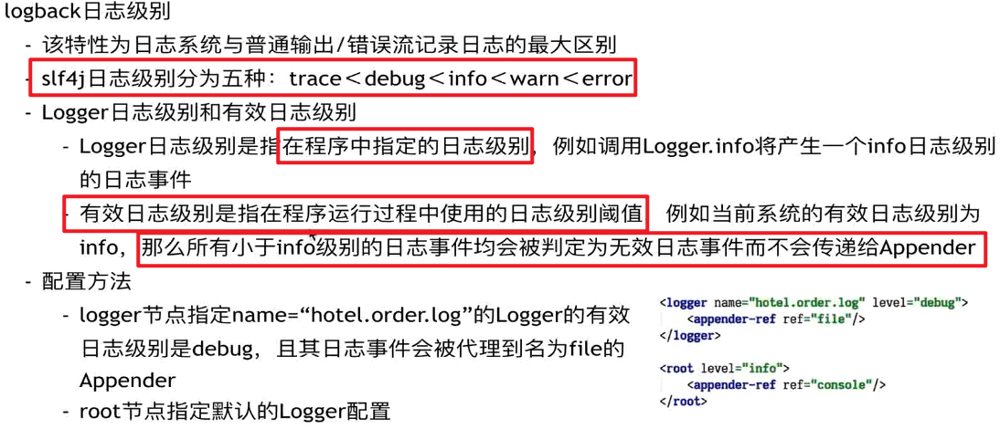

# Java Notes

>解决问题的能力最重要

## Basic

### JDK特性

#### JDK10

##### 局部变量推断`var`

```java
var list = new ArrayList<String>();
```

##### List.copyOf

获取一个不可修改的列表, 其中包含给定集合的元素

```java 
public static <E> List<E> copyOf(Collection<? extends E> coll)
```


### 常量

#### 常量折叠

常量折叠是Java在编译期做的一个优化，简单的来说，在编译期就把一些表达式计算好，不需要在运行时进行计算。

比如: `int a = 1 + 2`，经过常量折叠后就变成了`int a = 3`。

```java
public class Main {
    public static void main(String[] args) {
        String s1 = "a" + "bc";
        String s2 = "ab" + "c";
        System.out.println(s1 == s2);
    }
}
javap:
public class Main {
   public static void main(String[] var0) {
      String var1 = "abc";
      String var2 = "abc";
      System.out.println(var1 == var2);
   }
}
```

#### final local variable

```java
public class FinalLocalVariable{
	private final int a =0 ;
	private int b = 0;
	public void f1(){
		final int a = 0;
		
	}
	public void f2(){
		int a = 0;
	}
}
```

javap:

```java
Classfile /D:/EdwinXu/ProgrammingWorkspace2/java/FinalLocalVariable.class
  Last modified Sep 30, 2021; size 399 bytes
  MD5 checksum df6e0143aa3765acfe3b2f20919d5abc
  Compiled from "FinalLocalVariable.java"
public class FinalLocalVariable
  minor version: 0
  major version: 52
  flags: ACC_PUBLIC, ACC_SUPER
Constant pool:
   #1 = Methodref          #5.#19         // java/lang/Object."<init>":()V
   #2 = Fieldref           #4.#20         // FinalLocalVariable.a:I
   #3 = Fieldref           #4.#21         // FinalLocalVariable.b:I
   #4 = Class              #22            // FinalLocalVariable
   #5 = Class              #23            // java/lang/Object
   #6 = Utf8               a
   #7 = Utf8               I
   #8 = Utf8               ConstantValue
   #9 = Integer            0
  #10 = Utf8               b
  #11 = Utf8               <init>
  #12 = Utf8               ()V
  #13 = Utf8               Code
  #14 = Utf8               LineNumberTable
  #15 = Utf8               f1
  #16 = Utf8               f2
  #17 = Utf8               SourceFile
  #18 = Utf8               FinalLocalVariable.java
  #19 = NameAndType        #11:#12        // "<init>":()V
  #20 = NameAndType        #6:#7          // a:I
  #21 = NameAndType        #10:#7         // b:I
  #22 = Utf8               FinalLocalVariable
  #23 = Utf8               java/lang/Object
{
  public FinalLocalVariable();
    descriptor: ()V
    flags: ACC_PUBLIC
    Code:
      stack=2, locals=1, args_size=1
         0: aload_0
         1: invokespecial #1                  // Method java/lang/Object."<init>":()V
         4: aload_0
         5: iconst_0
         6: putfield      #2                  // Field a:I
         9: aload_0
        10: iconst_0
        11: putfield      #3                  // Field b:I
        14: return
      LineNumberTable:
        line 1: 0
        line 2: 4
        line 3: 9

  public void f1();
    descriptor: ()V
    flags: ACC_PUBLIC
    Code:
      stack=0, locals=2, args_size=1
         0: return
      LineNumberTable:
        line 7: 0

  public void f2();
    descriptor: ()V
    flags: ACC_PUBLIC
    Code:
      stack=1, locals=2, args_size=1
         0: iconst_0
         1: istore_1
         2: return
      LineNumberTable:
        line 9: 0
        line 10: 2
}
SourceFile: "FinalLocalVariable.java"
```

可以看到 方法 f1、f2 的JVM指令书分别为1条和3条，看似final局部变量更加高效，但是还有没有其他影响因素，比如指令重排之类的？

所以说对于字面量的赋值，推荐使用final定义局部变量，而其他情况局部变量没必要使用final定义。

### 基本类型

#### parseOf valueOf

从参数上说
Double.valueOf：参数可以是 double，也可以是 String。
Double.parseDouble：参数只能是 String。

从结果上说
Double.valueOf：返回 Double。
Double.parseDouble：返回 double。

#### 保留小数位数

方法一：String的format方法（推荐）

```java
double f = 111231.5585;
System.out.println(String.format("%.2f", f));
```

方法二：DecimalFormat的format方法

```java
double f = 111231.5585;
DecimalFormat df = new DecimalFormat("#.00");
System.out.println(df.format(f));
```

方法三：BigDecimal的setScale方法

```java
double f = 111231.5585;
BigDecimal bg = new BigDecimal(f);
double f1 = bg.setScale(2, BigDecimal.ROUND_HALF_UP).doubleValue();
System.out.println(f1);
```

方法四：NumberFormat的setMaximumFractionDigits方法

```java
double f = 111231.5585;
NumberFormat nf = NumberFormat.getNumberInstance();
nf.setMaximumFractionDigits(2);
System.out.println(nf.format(f));
```


### java参数

#### java -jar

java -jar myClass.jar
执行该命令时，会用到目录META-INF\MANIFEST.MF文件，在该文件中，有一个叫Main－Class的参数，它说明了java -jar命令执行的类。


```shell
java -jar email-sender-0.0.1-SNAPSHOT.jar --server.port=8888 --management.server.port=6667

```


#### java -cp

java -cp 和 -classpath 一样，是指定类运行所依赖其他类的路径，通常是类库，jar包之类，需要全路径到jar包，window上分号“;” 分隔，linux上是分号“:”分隔。不支持通配符，需要列出所有jar包，*

*格式：
java -cp .;myClass.jar packname.mainclassname  
表达式支持通配符，例如：
java -cp .;c:\classes01\myClass.jar;c:\classes02\*.jar packname.mainclassname* 

-cp 参数后面是类路径，是指定给解释器到哪里找到你的.class文件


-jar vs. -cp

```java
1. java -jar Test.jar
2. java -cp com.test.Test Test.jar	
```

java -jar通过MANFEST.MF 查询主类

-cp就不需要指定Main-Class来指定入口。因为第一个参数就指定了你的入口类，第二个参数就是你的jar包


显然-cp可以自定义主类


### Access Privileges

### extend

privete只能在本类访问，关于继承上，不会继承private方法和成员，那是父亲的私有部分，只能对父类中的成员开放。

一般情况下，父类中会有公用接口get、set之类的方法，可以通过这个方法进行访问。不能直接访问，即使通过super也不能调用。

子类和父类可以有完全一样的私有方法，他们不算重写，是各自的，互不影响。

### 

### interface

```java
public interface Int {
    // 实质为 public static final int M;
    int M = 110;
}
```


### 异常

printStackTrace： 在stderr中输出异常堆栈。**注意：此方法无论何时都不应该被调用！**


何时应该抛出异常？

一般来说，程序出现异常情况，逻辑无法继续时，需要抛出异常：

- 参数检查不通过，抛异常告知调用者调用错误
- 出现异常数据，导致继续执行会引发逻辑错误。

出现了异常情况，但是不影响正常逻辑的情况下，不需要抛出异常


如果能够妥善处理异常，则捕获异常，否则不要捕获异常

需要关注异常类型、监控异常时，捕获异常，可以处理掉，或者简单处理后抛出


#### Try With Resource

```java
try(InputStream is = new FileInputStream("D://d")) {

} catch (IOException e) {

}
```

java8就支持，编译器自动关闭资源

实质为实现AutoCloseable 的类都会自动关闭资源


1. 凡是实现了AutoCloseable接口的类，在try()里声明该类实例的时候，在try结束后，close方法都会被调用
2. try结束后自动调用的close方法，这个动作会早于finally里调用的方法。
3. 不管是否出现异常（int i=1/0会抛出异常），try()里的实例都会被调用close方法
4. 越晚声明的对象，会越早被close掉。


=======
>>>>>>> ec50c495d2610736010628a578873a8ec8bf6fc6
### 序列化

**什么情况下需要序列化**  
  a）当你想把的内存中的对象状态保存到一个文件中或者数据库中时候；
  b）当你想用套接字在网络上传送对象的时候；
  c）当你想通过RMI传输对象的时候；

```java
String path = "D:SerializableTest.txt";
final ObjectOutputStream outputStream = new ObjectOutputStream(new FileOutputStream(path));

final Cat cat = new Cat("edw");
outputStream.writeObject(cat);

final ObjectInputStream inputStream = new ObjectInputStream(new FileInputStream(path));
final Cat cat1 = (Cat)inputStream.readObject();
System.out.println(cat1);
```

相关注意事项
  a）序列化时，**只对对象的状态进行保存**，而不管对象的方法；
  b）当一个**父类实现序列化，子类自动实现序列化**，不需要显式实现Serializable接口；
  c）当**一个对象的实例变量引用其他对象，序列化该对象时也把引用对象进行序列化**；
  d）并非所有的对象都可以序列化，,至于为什么不可以，有很多原因了,比如：
    1.安全方面的原因，比如一个对象拥有**private**，public等field，对于一个要传输的对象，比如写到文件，或者进行rmi传输 等等，在序列化进行传输的过程中，这个对象的private等域是不受保护的。

​	2.资源分配方面的原因，比如socket，thread类，如果可以序列化，进行传输或者保存，也无法对他们进行重新的资源分 配，而且，也是没有必要这样实现。


#### Serializable

一个类实现了Serializable接口，它就可以被序列化

因为实现该接口后，使用ObjectOutputStream来持久化对象，该对象中：

```java
private void writeObject0(Object obj, boolean unshared)
    throws IOException
{
    boolean oldMode = bout.setBlockDataMode(false);
    depth++;
    try {
        // handle previously written and non-replaceable objects
        int h;
        if ((obj = subs.lookup(obj)) == null) {
            writeNull();
            return;
        } else if (!unshared && (h = handles.lookup(obj)) != -1) {
            writeHandle(h);
            return;
        } else if (obj instanceof Class) {
            writeClass((Class) obj, unshared);
            return;
        } else if (obj instanceof ObjectStreamClass) {
            writeClassDesc((ObjectStreamClass) obj, unshared);
            return;
        }

        // check for replacement object
        Object orig = obj;
        Class<?> cl = obj.getClass();
        ObjectStreamClass desc;
        for (;;) {
            // REMIND: skip this check for strings/arrays?
            Class<?> repCl;
            desc = ObjectStreamClass.lookup(cl, true);
            if (!desc.hasWriteReplaceMethod() ||
                (obj = desc.invokeWriteReplace(obj)) == null ||
                (repCl = obj.getClass()) == cl)
            {
                break;
            }
            cl = repCl;
        }
        if (enableReplace) {
            Object rep = replaceObject(obj);
            if (rep != obj && rep != null) {
                cl = rep.getClass();
                desc = ObjectStreamClass.lookup(cl, true);
            }
            obj = rep;
        }

        // if object replaced, run through original checks a second time
        if (obj != orig) {
            subs.assign(orig, obj);
            if (obj == null) {
                writeNull();
                return;
            } else if (!unshared && (h = handles.lookup(obj)) != -1) {
                writeHandle(h);
                return;
            } else if (obj instanceof Class) {
                writeClass((Class) obj, unshared);
                return;
            } else if (obj instanceof ObjectStreamClass) {
                writeClassDesc((ObjectStreamClass) obj, unshared);
                return;
            }
        }

        // remaining cases
        if (obj instanceof String) {
            writeString((String) obj, unshared);
        } else if (cl.isArray()) {
            writeArray(obj, desc, unshared);
        } else if (obj instanceof Enum) {
            writeEnum((Enum<?>) obj, desc, unshared);
        } else if (obj instanceof Serializable) {
            writeOrdinaryObject(obj, desc, unshared);
        } else {
            if (extendedDebugInfo) {
                throw new NotSerializableException(
                    cl.getName() + "\n" + debugInfoStack.toString());
            } else {
                throw new NotSerializableException(cl.getName());
            }
        }
    } finally {
        depth--;
        bout.setBlockDataMode(oldMode);
    }
}
```

从上述代码可知，如果被写对象的类型是String，或数组，或Enum，或Serializable，那么就可以对该对象进行序列化，否则将抛出NotSerializableException。

如果仅仅只是让某个类实现Serializable接口，而没有其它任何处理的话，则就是使用默认序列化机制。使用默认机制，在序列化对象时，不仅会序列化当前对象本身，还会对该对象引用的其它对象也进行序列化，同样地，这些其它对象引用的另外对象也将被序列化，以此类推。所以，如果一个对象包含的成员变量是容器类对象，而这些容器所含有的元素也是容器类对象，那么这个序列化的过程就会较复杂，开销也较大。

#### transient

 当某个字段被声明为transient后，默认序列化机制就会忽略该字段。

 对于上述已被声明为transient的字段age，除了将transient关键字去掉之外，是否还有其它方法能使它再次可被序列化？方法之一就是在Person类中添加两个方法：writeObject()与readObject()

```java
public   class  Person  implements  Serializable {
     transient   private  Integer age  =   null ;

     private   void  writeObject(ObjectOutputStream out)  throws  IOException {
        out.defaultWriteObject();
        out.writeInt(age);
    }

     private   void  readObject(ObjectInputStream in)  throws  IOException, ClassNotFoundException {
        in.defaultReadObject();
        age  =  in.readInt();
    }
}
```

在writeObject()方法中会先调用ObjectOutputStream中的defaultWriteObject()方法，该方法会执行默认的序列化机制，如5.1节所述，此时会忽略掉age字段。然后再调用writeInt()方法显示地将age字段写入到ObjectOutputStream中。readObject()的作用则是针对对象的读取，其原理与writeObject()方法相同。

####  Externalizable

无论是使用transient关键字，还是使用writeObject()和readObject()方法，其实都是基于Serializable接口的序列化。JDK中提供了另一个序列化接口--Externalizable，使用该接口之后，之前基于Serializable接口的序列化机制就将失效。

 Externalizable继承于Serializable，当使用该接口时，序列化的细节需要由程序员去完成

#### 序列化源码

```java
// writeObject是最复杂的、核心的方法，其他如writeString()等相对较为简单
public final void writeObject(Object obj) throws IOException {
    try {
        writeObject0(obj, false);
    } catch (IOException ex) {

    }
}

// unshared是否是共享对象
private void writeObject0(Object obj, boolean unshared)
    throws IOException
{
    boolean oldMode = bout.setBlockDataMode(false);
    depth++;
    try {
        // handle previously written and non-replaceable objects
        int h;
        if ((obj = subs.lookup(obj)) == null) {
            writeNull();
            return;
        } else if (!unshared && (h = handles.lookup(obj)) != -1) {
            writeHandle(h);
            return;
        } else if (obj instanceof Class) {
            writeClass((Class) obj, unshared);
            return;
        } else if (obj instanceof ObjectStreamClass) {
            writeClassDesc((ObjectStreamClass) obj, unshared);
            return;
        }

        // check for replacement object
        Object orig = obj;
        Class<?> cl = obj.getClass();
        ObjectStreamClass desc;
        for (;;) {
            // REMIND: skip this check for strings/arrays?
            Class<?> repCl;
            desc = ObjectStreamClass.lookup(cl, true);
            if (!desc.hasWriteReplaceMethod() ||
                (obj = desc.invokeWriteReplace(obj)) == null ||
                (repCl = obj.getClass()) == cl)
            {
                break;
            }
            cl = repCl;
        }
        if (enableReplace) {
            Object rep = replaceObject(obj);
            if (rep != obj && rep != null) {
                cl = rep.getClass();
                desc = ObjectStreamClass.lookup(cl, true);
            }
            obj = rep;
        }

        // if object replaced, run through original checks a second time
        if (obj != orig) {
            subs.assign(orig, obj);
            if (obj == null) {
                writeNull();
                return;
            } else if (!unshared && (h = handles.lookup(obj)) != -1) {
                writeHandle(h);
                return;
            } else if (obj instanceof Class) {
                writeClass((Class) obj, unshared);
                return;
            } else if (obj instanceof ObjectStreamClass) {
                writeClassDesc((ObjectStreamClass) obj, unshared);
                return;
            }
        }

        // remaining cases
        if (obj instanceof String) {
            writeString((String) obj, unshared);
        } else if (cl.isArray()) {
            writeArray(obj, desc, unshared);
        } else if (obj instanceof Enum) {
            writeEnum((Enum<?>) obj, desc, unshared);
        } else if (obj instanceof Serializable) {
            writeOrdinaryObject(obj, desc, unshared);
        } else {
            if (extendedDebugInfo) {
                throw new NotSerializableException(
                    cl.getName() + "\n" + debugInfoStack.toString());
            } else {
                throw new NotSerializableException(cl.getName());
            }
        }
    } finally {
        depth--;
        bout.setBlockDataMode(oldMode);
    }
}

// 上述代码中大部分是处理一些特殊情况，writeOrdinaryObject 才是序列化我们定义的普通对象
    private void writeOrdinaryObject(Object obj,
                                     ObjectStreamClass desc,
                                     boolean unshared
        try {
            desc.checkSerialize();
			// 序列化之前，会先写入一个标志位，用来表示后面是一个对象
            bout.writeByte(TC_OBJECT);
            writeClassDesc(desc, false);
            handles.assign(unshared ? null : obj);
            // 这里判断是否实现Externalizable，可以看到实现Externalizable后原来的Serialiable是无效的，前者优先级更高
            if (desc.isExternalizable() && !desc.isProxy()) {
                writeExternalData((Externalizable) obj);
            } else {
                writeSerialData(obj, desc);
            }
        } finally {
            if (extendedDebugInfo) {
                debugInfoStack.pop();
            }
        }
    }


private void writeSerialData(Object obj, ObjectStreamClass desc)
        throws IOException
    {
        ObjectStreamClass.ClassDataSlot[] slots = desc.getClassDataLayout();
        for (int i = 0; i < slots.length; i++) {
            ObjectStreamClass slotDesc = slots[i].desc;
            if (slotDesc.hasWriteObjectMethod()) {
                PutFieldImpl oldPut = curPut;
                curPut = null;
                SerialCallbackContext oldContext = curContext;

                if (extendedDebugInfo) {
                    debugInfoStack.push(
                        "custom writeObject data (class \"" +
                        slotDesc.getName() + "\")");
                }
                try {
                    curContext = new SerialCallbackContext(obj, slotDesc);
                    bout.setBlockDataMode(true);
                    // 反射，序列化
                    slotDesc.invokeWriteObject(obj, this);
                    bout.setBlockDataMode(false);
                    // 添加结束标志
                    bout.writeByte(TC_ENDBLOCKDATA);
                } finally {
                    curContext.setUsed();
                    curContext = oldContext;
                    if (extendedDebugInfo) {
                        debugInfoStack.pop();
                    }
                }

                curPut = oldPut;
            } else {
                // 序列化成员属性
                defaultWriteFields(obj, slotDesc);
            }
        }
    }
                                     
                                     
    private void defaultWriteFields(Object obj, ObjectStreamClass desc)
        throws IOException
    {
        Class<?> cl = desc.forClass();
        if (cl != null && obj != null && !cl.isInstance(obj)) {
            throw new ClassCastException();
        }

        desc.checkDefaultSerialize();
		// 处理基本类型
        int primDataSize = desc.getPrimDataSize();
        if (primVals == null || primVals.length < primDataSize) {
            primVals = new byte[primDataSize];
        }
        desc.getPrimFieldValues(obj, primVals);
        bout.write(primVals, 0, primDataSize, false);

        ObjectStreamField[] fields = desc.getFields(false);
        Object[] objVals = new Object[desc.getNumObjFields()];
        int numPrimFields = fields.length - objVals.length;
        desc.getObjFieldValues(obj, objVals);
        for (int i = 0; i < objVals.length; i++) {
            if (extendedDebugInfo) {
                debugInfoStack.push(
                    "field (class \"" + desc.getName() + "\", name: \"" +
                    fields[numPrimFields + i].getName() + "\", type: \"" +
                    fields[numPrimFields + i].getType() + "\")");
            }
            try {
                // 递归处理非基本类型
                writeObject0(objVals[i],
                             fields[numPrimFields + i].isUnshared());
            } finally {
                if (extendedDebugInfo) {
                    debugInfoStack.pop();
                }
            }
        }
    }
```


ObjectOutputStream封装了自己的IO 流对象：

```java
private static class BlockDataOutputStream
    extends OutputStream implements DataOutput
{
    /** maximum data block length */
    private static final int MAX_BLOCK_SIZE = 1024;
    /** maximum data block header length */
    private static final int MAX_HEADER_SIZE = 5;
    /** (tunable) length of char buffer (for writing strings) */
    private static final int CHAR_BUF_SIZE = 256;

    /** buffer for writing general/block data */
    private final byte[] buf = new byte[MAX_BLOCK_SIZE];
    /** buffer for writing block data headers */
    private final byte[] hbuf = new byte[MAX_HEADER_SIZE];
    /** char buffer for fast string writes */
    private final char[] cbuf = new char[CHAR_BUF_SIZE];
}
```

ObjectInputStream是相反的一个操作。

只看了个大概，后面有时间了再继续。


### 并发编程

https://juejin.cn/post/6844904130570371079

#### CompleteFeature

CompleteFeature是对Feature的增强，Feature只能处理简单的异步任务，而CompleteFeature可以将多个异步任务进行复杂的组**合，支持串行执行，并行执行，And汇聚，Or汇聚**，从而能对复杂的关联任务进行调度。

##### 串行任务

串行任务指任务B要等待任务A执行完成之后才会执行，串行任务有如下属性：

| 属性          | 描述                                                         |
| ------------- | ------------------------------------------------------------ |
| 可获取A的结果 | 任务B可获取任务A的执行结果作为参数使用                       |
| B有返回值     | 如果任务B有返回值，可以将执行结果通过返回值返回              |
| 可获取A异常   | 任务B可以获取任务A抛出的异常                                 |
| A异常则终止   | 当任务A抛出异常后，程序是否会终止，若会终止，程序将退出，任务B不会执行，否则程序不会退出，继续执行。 |

CompleteFeature支持的串行任务方法如下：

| 方法          | 可获取A的结果 | B有返回值 | 可获取A异常 | A异常则终止 |
| ------------- | ------------- | --------- | ----------- | ----------- |
| thenRun       | 否            | 否        | 否          | 是          |
| thenApply     | 是            | 是        | 否          | 是          |
| thenAccept    | 是            | 否        | 否          | 是          |
| thenCompose   | 是            | 是        | 否          | 是          |
| whenComplete  | 是            | 否        | 是          | 否          |
| exceptionally | 否            | 是        | 是          | 否          |
| handle        | 是            | 是        | 是          | 否          |

- 任务不会抛出异常就使用前四个方法，否则使用后三个方法。

- exceptionally相当于try {} catch {}的catch部分，whenComplete和handle相当于try {} catch {} finally {} 的catch和finall部分，区别是一个有返回值，一个没有返回值。

- thenApply和thenCompose的区别是，thenCompose在任务B中返回的是CompletableFuture

##### And汇聚

And汇聚关系是指：任务C要等待任务A或任务B都执行完后才执行。CompleteFeature支持此关系的方法如下：

| 方法           | C接收A或B返回值作为参数 | C有返回值 |
| -------------- | ----------------------- | --------- |
| thenCombine    | 是                      | 是        |
| thenAcceptBoth | 是                      | 否        |
| runAfterBoth   | 否                      | 否        |

##### Or汇聚

Or汇聚关系是指：任务C等待任务A或任务B其中一个执行完后就执行

| 方法           | C接收A或B返回值作为参数 | C有返回值 |
| -------------- | ----------------------- | --------- |
| applyToEither  | 是                      | 是        |
| acceptEither   | 是                      | 否        |
| runAfterEither | 否                      | 否        |

##### 多任务

CompletableFuture提供了两个多任务的方法：

| 方法  | 描述                                                         |
| ----- | ------------------------------------------------------------ |
| anyOf | 多个任务中的任意一个任务执行完则结束，可以获取到最先执行完的任务的返回值。 |
| allOf | 多个任务都执行完后才结束，不能获取到任何一个任务的返回值     |

以上所有方法的返回值都是CompletableFuture，这样就可以继续调用前面描述的方法来进行任务组合，组合出更加复杂的任务处理流程。

##### 方法族

以上方法中的最后一个任务都是和前面的任务在一个线程内执行，CompletableFuture中还有一套方法让最后一个任务在新线程中执行，只要在原方法上加上**Async后缀**则可

| 同步        | 异步             |
| ----------- | ---------------- |
| thenApply   | thenApplyAsync   |
| thenAccept  | thenAcceptAsync  |
| thenRun     | thenRunAsync     |
| thenCompose | thenComposeAsync |


```java
import java.util.concurrent.CompletableFuture;
import java.util.concurrent.ExecutionException;

public class CompleteFeatureDemo {
    public static void main(String[] args) throws ExecutionException, InterruptedException {
        simpleTask();
        serialTask();
        andTask();
        orTask();
        complexTask();
    
    sleep(2000); // 等待子线程结束
    System.out.println("end.");

}

private static void simpleTask() throws ExecutionException, InterruptedException {
    // 1. runAsync 执行一个异步任务，没有返回值
    CompletableFuture.runAsync(()-> System.out.println("1. runAsync"));
    sleep(100);

    // 2. supplyAsync 执行一个异步任务，有返回值
    CompletableFuture<String> future = CompletableFuture.supplyAsync(()->{
        System.out.println("2.1 supplyAsync task be called");
        sleep(100);
        return "2.2 supplyAsync return value";
    });
    System.out.println("2.3 after supplyAsync");
    System.out.println(future.get());
    sleep(200);
}

private static void serialTask() throws ExecutionException, InterruptedException {
    // 3. thenRun
    CompletableFuture.supplyAsync(()->{
        System.out.println("3.1 supplyAsync begin");
        sleep(100);  // 用于证明B等待A结束才会执行
        return "3.2 supplyAsync end";
    }).thenRun(()->{
        System.out.println("3.3 thenRun be called.");
    });
    sleep(200);

    // 4. thenApply
    CompletableFuture<String> future4 = CompletableFuture.supplyAsync(()->{
        sleep(100);
        return "4.1 apple";
    }).thenApply(returnVal->{
        return "4.2 " + returnVal + "-苹果";
    });
    System.out.println("4.3 get: " + future4.get());
    sleep(100);

    // 5. thenAccept
    CompletableFuture.supplyAsync(()->{
        sleep(100);
        return "5.1 orange";
    }).thenAccept(returnVal->{
        System.out.println("5.2 " + returnVal + "-桔子");
    });
    sleep(100);

    // 6. thenCompose
    CompletableFuture<String> future6 = CompletableFuture.supplyAsync(()->{
        sleep(100);
        return "6.1 apple";
    }).thenCompose((returnVal)->{
        return CompletableFuture.supplyAsync(()->{
            return "6.2 " + returnVal;
        });
    });
    System.out.println("6.3 get: " + future6.get());
    sleep(100);

    // 7. whenComplete
    CompletableFuture.supplyAsync(()->{
        sleep(100);
        if (true) {  //修改boolean值观察不同结果
            return "7.1 return value for whenComplete";
        } else {
            throw new RuntimeException("7.2 throw exception for whenComplete");
        }
    }).whenComplete((returnVal, throwable)->{
        System.out.println("7.2 returnVal: " + returnVal);  // 可以直接拿到返回值，不需要通过future.get()得到
        System.out.println("7.3 throwable: " + throwable);  // 异步任务抛出异常，并不会因为异常终止，而是会走到这里，后面的代码还会继续执行
    });
    sleep(100);

    // 8. exceptionally
    CompletableFuture<String> future8 = CompletableFuture.supplyAsync(()->{
        sleep(100);
        if (false) {  //修改boolean值观察不同结果
            return "8.1 return value for exceptionally";
        } else {
            throw new RuntimeException("8.2 throw exception for exceptionally");
        }
    }).exceptionally(throwable -> {
        throwable.printStackTrace();
        return "8.3 return value after dealing exception.";
    });
    System.out.println("8.4 get: " + future8.get());
    sleep(100);

    // 9. handle
    CompletableFuture<String> future9 = CompletableFuture.supplyAsync(()->{
        sleep(100);
        if (false) {  //修改boolean值观察不同结果
            return "9.1 return value for handle";
        } else {
            throw new RuntimeException("9.2 throw exception for handle");
        }
    }).handle((retuanVal, throwable)->{
        System.out.println("9.3 retuanVal: " + retuanVal);
        System.out.println("9.4 throwable: " + throwable);
        return "9.5 new return value.";
    });
    System.out.println("9.6 get: " + future9.get());
    sleep(100);
}

private static void andTask() throws ExecutionException, InterruptedException {
    // 10. thenCombine 合并结果
    CompletableFuture<String> future10 = CompletableFuture.supplyAsync(()->{
        sleep(100);
        return "10.1 TaskA return value";
    }).thenCombine(CompletableFuture.supplyAsync(()->{
        sleep(100);
        return "10.2 TaskB return value";
    }), (taskAReturnVal, taskBReturnVal) -> taskAReturnVal + taskBReturnVal);
    System.out.println("10.3 get: " + future10.get());
    sleep(200);

    // 11. thenAcceptBoth
    CompletableFuture.supplyAsync(()->{
        sleep(100);
        return "11.1 TaskA return value";
    }).thenAcceptBoth(CompletableFuture.supplyAsync(()->{
        sleep(100);
        return "11.2 TaskB return value";
    }), (taskAReturnVal, taskBReturnVal) -> System.out.println(taskAReturnVal + taskBReturnVal));
    sleep(200);

    // 12. runAfterBoth A，B都执行完后才执行C，C不关心前面任务的返回值
    CompletableFuture.supplyAsync(()->{
        sleep(200);  // 虽然这个任务先执行，但是执行时间比下面的任务长，所以最后会使用下面的返回结果
        System.out.println("12.1 TaskA be called.");
        return "12.2 TaskA return value";
    }).runAfterBoth(CompletableFuture.supplyAsync(()->{
        sleep(100);
        System.out.println("12.3 TaskB be called.");
        return "12.4 TaskB return value";
    }), () -> System.out.println("12.5 TaskC be called."));
    sleep(300);
}

private static void orTask() throws ExecutionException, InterruptedException {
    // 13. applyToEither 使用A,B两个异步任务优先返回的结果
    CompletableFuture<String> future13 = CompletableFuture.supplyAsync(()->{
        sleep(200);  // 虽然这个任务先执行，但是执行时间比下面的任务长，所以最后会使用下面的返回结果
        System.out.println("13.1 TaskA be called"); // 用于证明拿到B的结果后，A还会继续执行，并不会终止
        return "13.2 TaskA return value";
    }).applyToEither(CompletableFuture.supplyAsync(()->{
        sleep(100);
        return "13.3 TaskB return value";
    }), (returnVal) -> returnVal);
    System.out.println("13.4 get: " + future13.get());
    sleep(300);

    // 14. acceptEither 使用A,B两个异步任务优先返回的结果
    CompletableFuture.supplyAsync(()->{
        sleep(200);  // 虽然这个任务先执行，但是执行时间比下面的任务长，所以最后会使用下面的返回结果
        return "14.1 TaskA return value";
    }).acceptEither(CompletableFuture.supplyAsync(()->{
        sleep(100);
        return "14.2 TaskB return value";
    }), (returnVal) -> System.out.println(returnVal));
    sleep(300);

    // 15. runAfterEither A，B任意一个执行完后就执行C，C不关心前面任务的返回值
    CompletableFuture.supplyAsync(()->{
        sleep(200);  // 虽然这个任务先执行，但是执行时间比下面的任务长，所以最后会使用下面的返回结果
        System.out.println("15.1 TaskA be called.");
        return "15.2 TaskA return value";
    }).runAfterEither(CompletableFuture.supplyAsync(()->{
        sleep(100);
        System.out.println("15.3 TaskB be called.");
        return "15.4 TaskB return value";
    }), () -> System.out.println("15.5 TaskC be called."));
    sleep(300);
}

private static void complexTask() throws ExecutionException, InterruptedException {
    // 16. anyOf
    CompletableFuture future16 = CompletableFuture.anyOf(CompletableFuture.supplyAsync(()->
    {
        sleep(300);
        System.out.println("16.1 TaskA be called.");
        return "16.2 TaskA return value.";
    }), CompletableFuture.supplyAsync(()->{
        sleep(100);
        System.out.println("16.3 TaskB be called.");
        return "16.4 TaskB return value.";
    }));
    System.out.println("16.5 get: " + future16.get());
    sleep(400);

    // 17. allOf
    CompletableFuture<Void> future17 = CompletableFuture.allOf(CompletableFuture.supplyAsync(()->
    {
        sleep(300);
        System.out.println("17.1 TaskA be called.");
        return "17.2 TaskA return value.";
    }), CompletableFuture.supplyAsync(()->{
        sleep(100);
        System.out.println("17.3 TaskB be called.");
        return "17.4 TaskB return value.";
    }));
    System.out.println("17.5 get: " + future17.get()); // allOf没有返回值
}

private static void sleep(long millis) {
    try {
        Thread.sleep(millis);
    } catch (InterruptedException ie) {
        Thread.currentThread().interrupt();
    }
}
}
```


### Stream

Java8 中添加了一个新的接口类 Stream，Collection 新增了两个流方法，分别是 **Stream**() 和 **parallelStream**()

之前使用for或者迭代器来对数据进行遍历、排序、合并等操作。这种方式**不适合大数据量**，效率问题

Stream的聚合操作类似SQL的聚合操作

```java
List<String> names = Arrays.asList("张三","李四","王五","赵柳","张五六七","王少","赵四","张仁","李星");
//需求：找出 姓张中名字最长的
  int maxLengthStartWithZ = names.parallelStream()
    .filter(name -> name.startsWith("张"))
    .mapToInt(String::length)
    .max()
    .getAsInt();
  System.out.println(names.get(maxLengthStartWithZ));
}
```

#### Stream操作分类

官方将 Stream 中的操作分为两大类：

- **终结操作**（Terminal operations）
- **中间操作**（Intermediate operations）

**中间操作**会**返回一个新的流**，一个流可以后面跟随零个或多个中间操作。其目的主要是打开流，做出某种程度的数据映射/过滤，然后会返回一个新的流，交给下一个操作使用。这类操作都是**惰性化的（lazy），就是说，仅仅调用到这类方法，并没有真正开始流的遍历。而是在终结操作开始的时候才真正开始执行**。

**中间操作**又可以分为**无状态**（Stateless）与**有状态**（Stateful）操作:

- 无状态是指元素的处理不受之前元素的影响；

- 有状态是指该操作只有拿到所有元素之后才能继续下去。


**终结操作**是指返回最终的结果。**一个流只能有一个终结操作**，当这个操作执行后，这个流就被使用“光”了，无法再被操作。所以这必定这个流的最后一个操作。终结操作的执行才会真正开始流的遍历，并且会生成一个结果。


**终结操作**又可以分为**短路**（Short-circuiting）与**非短路**（Unshort-circuiting）操作，

- **短路**是指遇到某些符合条件的元素就可以得到最终结果，

- **非短路**是指必须处理完所有元素才能得到最终结果。操作分类详情如下图所示：


map():将流中的元素进行再次加工形成一个新流，流中的每一个元素映射为另外的元素。(接收一个函数作为参数，该函数会被应用到每个元素上，并将其映射成一个新的元素。)

`flatMap`：接收一个函数作为参数，将流中的每个值都换成另一个流，然后把所有流连接成一个流。

filter(): 返回结果生成新的流中只包含满足筛选条件的数据

limit()：返回指定数量的元素的流。返回的是 Stream 里前面的 n 个元素。

skip()：和 limit()相反，将前几个元素跳过（取出）再返回一个流，如果流中的元素小于或者等于 n，就会返回一个空的流。

sorted()：将流中的元素按照自然排序方式进行排序。

distinct()：将流中的元素去重之后输出。

peek()：对流中每个元素执行操作，并返回一个新的流，返回的流还是包含原来流中的元素。

归约**reduce**，也称缩减，顾名思义，是把一个流缩减成一个值，能实现对集合求和、求乘积和求最值操作。

`collect`，收集，可以说是内容最繁多、功能最丰富的部分了。从字面上去理解，就是把一个流收集起来，最终可以是收集成一个值也可以收集成一个新的集合。

`collect`主要依赖`java.util.stream.Collectors`类内置的静态方法。

因为流不存储数据，那么在流中的数据完成处理后，需要将流中的数据重新归集到新的集合里。`toList`、`toSet`和`toMap`比较常用，另外还有`toCollection`、`toConcurrentMap`等复杂一些的用法。

#### 性能对比

- 常规数据量：

  ##### 常规的迭代 > Stream 并行迭代> Stream 串行迭代

  Stream 串行迭代，使用了复杂的设计，导致执行速度偏低。所以是性能最低的

  Stream 并行迭代 使用了 Fork-Join 线程池,所以效率比 Stream 串行迭代快，但是对比常规迭代还是要慢

- 大数据量

  - 默认线程池：线程舒朗=CPU核心数。Stream并行快
  - 线程数<CPU核数：常规快(大概)
  - 线程数>CPU核数：常规快

  https://mp.weixin.qq.com/s/KqmZr68kibsWuwrKup9J4g
  
  

```java
public class StreamTest01 {
    @AllArgsConstructor
    @Data
    private static final class Student {
        String name;
        int age;
        String sex;
    }


    public static void main(String[] args) {
        List<Student> studentList = init();
        final Map<String, List<Student>> groupBy = groupBySex(studentList);
        groupBy.forEach((s, students) -> System.out.println(s+":"+ students.size()));
    }

    public static List<Student> init() {
        return Arrays.asList(
                new Student("小明", 168, "男"),
                new Student("大明", 182, "男"),
                new Student("小白", 174, "男"),
                new Student("小黑", 186, "男"),
                new Student("小红", 156, "女"),
                new Student("小黄", 158, "女"),
                new Student("小青", 165, "女"),
                new Student("小紫", 172, "女"));
    }

    public static Map<String, List<Student>> groupBySex(List<Student> studentsList) {
        return studentsList
                .stream()
                .collect(Collectors.groupingBy(Student::getSex));
    }

    public static List<Student> filterByAgeGh(List<Student> studentsList, int ghAge) {
            return studentsList
                .stream()
                .filter(student -> student.getAge() > ghAge)
                .collect(Collectors.toList());
    }

    public static void total(List<Student> studentsList) {
        int totalHeight = studentsList
                .stream()
                .mapToInt(Student::getAge)
                .sum();
        System.out.println(totalHeight);
    }

    public static void MaxAndMin(List<Student> studentsList) {
        int maxHeight = studentsList
                .stream()
                .mapToInt(Student::getAge)
                .max()
                .getAsInt();
        System.out.println("max:" + maxHeight);
        int minHeight = studentsList
                .stream()
                .mapToInt(Student::getAge)
                .min()
                .getAsInt();
        System.out.println("min:" + minHeight);
    }
}
```

#### 原理

https://www.cnblogs.com/CarpenterLee/p/6637118.html

Stream给人的感觉是有很多迭代，每一次操作一个迭代，但是实则不然，Stream采用Pipeline，可以很大程度减少迭代次数。

我们大致能够想到，应该采用某种方式记录用户每一步的操作，当用户调用结束操作时将之前记录的操作叠加到一起在一次迭代中全部执行掉。沿着这个思路，有几个问题需要解决：

1. 用户的操作如何记录？
2. 操作如何叠加？
3. 叠加之后的操作如何执行？
4. 执行后的结果（如果有）在哪里？

注意这里使用的是“*操作(operation)*”一词，指的是“Stream中间操作”的操作，很多Stream操作会需要一个回调函数（Lambda表达式），因此一个完整的操作是<*数据来源，操作，回调函数*>构成的三元组。Stream中使用Stage的概念来描述一个完整的操作，并用某种实例化后的*PipelineHelper*来代表Stage，将具有先后顺序的各个Stage连到一起，就构成了整个流水线。跟Stream相关类和接口的继承关系图示


还有*IntPipeline, LongPipeline, DoublePipeline*没在图中画出，这三个类专门为三种基本类型（不是包装类型）而定制的，跟*ReferencePipeline*是并列关系。图中*Head*用于表示第一个Stage，即调用调用诸如*Collection.stream()*方法产生的Stage，很显然这个Stage里不包含任何操作；*StatelessOp*和*StatefulOp*分别表示无状态和有状态的Stage，对应于无状态和有状态的中间操作。


操作如何叠加

需要有某种协议来协调相邻Stage之间的调用关系。

这种协议由*Sink*接口完成，*Sink*接口包含的方法如下表所示：

| 方法名                          | 作用                                                         |
| ------------------------------- | ------------------------------------------------------------ |
| void begin(long size)           | 开始遍历元素之前调用该方法，通知Sink做好准备。               |
| void end()                      | 所有元素遍历完成之后调用，通知Sink没有更多的元素了。         |
| boolean cancellationRequested() | 是否可以结束操作，可以让短路操作尽早结束。                   |
| void accept(T t)                | 遍历元素时调用，接受一个待处理元素，并对元素进行处理。Stage把自己包含的操作和回调方法封装到该方法里，前一个Stage只需要调用当前Stage.accept(T t)方法就行了。 |

有了上面的协议，相邻Stage之间调用就很方便了，每个Stage都会将自己的操作封装到一个Sink里，前一个Stage只需调用后一个Stage的`accept()`方法即可，并不需要知道其内部是如何处理的。当然对于有状态的操作，Sink的`begin()`和`end()`方法也是必须实现的。比如Stream.sorted()是一个有状态的中间操作，其对应的Sink.begin()方法可能创建一个乘放结果的容器，而accept()方法负责将元素添加到该容器，最后end()负责对容器进行排序。对于短路操作，`Sink.cancellationRequested()`也是必须实现的，比如Stream.findFirst()是短路操作，只要找到一个元素，cancellationRequested()就应该返回*true*，以便调用者尽快结束查找。Sink的四个接口方法常常相互协作，共同完成计算任务。**实际上Stream API内部实现的的本质，就是如何重载Sink的这四个接口方法**。

有了Sink对操作的包装，Stage之间的调用问题就解决了，执行时只需要从流水线的head开始对数据源依次调用每个Stage对应的Sink.{begin(), accept(), cancellationRequested(), end()}方法就可以了。一种可能的Sink.accept()方法流程是这样的：

```Java
void accept(U u){
    1. 使用当前Sink包装的回调函数处理u
    2. 将处理结果传递给流水线下游的Sink
}
```

Sink接口的其他几个方法也是按照这种[处理->转发]的模型实现。下面我们结合具体例子看看Stream的中间操作是如何将自身的操作包装成Sink以及Sink是如何将处理结果转发给下一个Sink的。先看Stream.map()方法：

```Java
// Stream.map()，调用该方法将产生一个新的Stream
public final <R> Stream<R> map(Function<? super P_OUT, ? extends R> mapper) {
    ...
    return new StatelessOp<P_OUT, R>(this, StreamShape.REFERENCE,
                                 StreamOpFlag.NOT_SORTED | StreamOpFlag.NOT_DISTINCT) {
        @Override /*opWripSink()方法返回由回调函数包装而成Sink*/
        Sink<P_OUT> opWrapSink(int flags, Sink<R> downstream) {
            return new Sink.ChainedReference<P_OUT, R>(downstream) {
                @Override
                public void accept(P_OUT u) {
                    R r = mapper.apply(u);// 1. 使用当前Sink包装的回调函数mapper处理u
                    downstream.accept(r);// 2. 将处理结果传递给流水线下游的Sink
                }
            };
        }
    };
}
```

上述代码看似复杂，其实逻辑很简单，就是将回调函数*mapper*包装到一个Sink当中。由于Stream.map()是一个无状态的中间操作，所以map()方法返回了一个StatelessOp内部类对象（一个新的Stream），调用这个新Stream的opWripSink()方法将得到一个包装了当前回调函数的Sink。

上述代码看似复杂，其实逻辑很简单，就是将回调函数*mapper*包装到一个Sink当中。由于Stream.map()是一个无状态的中间操作，所以map()方法返回了一个StatelessOp内部类对象（一个新的Stream），调用这个新Stream的opWripSink()方法将得到一个包装了当前回调函数的Sink。

再来看一个复杂一点的例子。Stream.sorted()方法将对Stream中的元素进行排序，显然这是一个有状态的中间操作，因为读取所有元素之前是没法得到最终顺序的。抛开模板代码直接进入问题本质，sorted()方法是如何将操作封装成Sink的呢？sorted()一种可能封装的Sink代码如下：

```java
// Stream.sort()方法用到的Sink实现
class RefSortingSink<T> extends AbstractRefSortingSink<T> {
    private ArrayList<T> list;// 存放用于排序的元素
    RefSortingSink(Sink<? super T> downstream, Comparator<? super T> comparator) {
        super(downstream, comparator);
    }
    @Override
    public void begin(long size) {
        ...
        // 创建一个存放排序元素的列表
        list = (size >= 0) ? new ArrayList<T>((int) size) : new ArrayList<T>();
    }
    @Override
    public void end() {
        list.sort(comparator);// 只有元素全部接收之后才能开始排序
        downstream.begin(list.size());
        if (!cancellationWasRequested) {// 下游Sink不包含短路操作
            list.forEach(downstream::accept);// 2. 将处理结果传递给流水线下游的Sink
        }
        else {// 下游Sink包含短路操作
            for (T t : list) {// 每次都调用cancellationRequested()询问是否可以结束处理。
                if (downstream.cancellationRequested()) break;
                downstream.accept(t);// 2. 将处理结果传递给流水线下游的Sink
            }
        }
        downstream.end();
        list = null;
    }
    @Override
    public void accept(T t) {
        list.add(t);// 1. 使用当前Sink包装动作处理t，只是简单的将元素添加到中间列表当中
    }
}
```

上述代码完美的展现了Sink的四个接口方法是如何协同工作的：

1. 首先beging()方法告诉Sink参与排序的元素个数，方便确定中间结果容器的的大小；
2. 之后通过accept()方法将元素添加到中间结果当中，最终执行时调用者会不断调用该方法，直到遍历所有元素；
3. 最后end()方法告诉Sink所有元素遍历完毕，启动排序步骤，排序完成后将结果传递给下游的Sink；
4. 如果下游的Sink是短路操作，将结果传递给下游时不断询问下游cancellationRequested()是否可以结束处理。


TODO 没看完


### 反射

#### int.class

基本类型也是有对应的Class的

#### getFields() getDeclaredFields()

getFields()：获得某个类的所有的公共（public）的字段，包括父类中的字段。 
getDeclaredFields()：获得某个类的所有声明的字段，即包括public、private和proteced，但是不包括父类的申明字段。


#### getInterfaces() getGenericInterfaces()

都是获取实现的接口，后者带有泛型


### 网络编程

#### socket is closed问题

出现这种问题，可能的原因有：

- server/client调用了socker.close()
- socket的inputstream、outputstream被关闭了
- 使用socket的inputstream、outputstream装饰的流被close

### IO流

#### 关闭问题

Java IO流可以采用装饰着模式，即可以不断添加装饰。但是需要注意：

装饰时流都是相关联的，外层的流依赖于底层的流，不管是那个流close都会导致里层的流close，所有流都会closed。

### NIO

http://tutorials.jenkov.com/java-nio/selectors.html

#### Java NIO Overview

核心概念：Channel、Buffer、Selector

#### Channel

和流类似，但是有几个区别：

- 能读能写，流一般是单向的
- 异步

Channel和socket、file等关联，thread要和channel交互，必须通过该buffer

往channel写：先写到buffer，buffer再写到channel

从channel读：先独到指定的buffer


实现类：

- The `FileChannel` reads data from and to files.
- The `DatagramChannel` can read and write data over the network via UDP.
- The `SocketChannel` can read and write data over the network via TCP.
- The `ServerSocketChannel` allows you to listen for incoming TCP connections, like a web server does. For each incoming connection a `SocketChannel` is created.

#### Buffer

usage：

1. Write data into the Buffer
2. Call `buffer.flip()` 读与写之间转换
3. Read data out of the Buffer
4. Call `buffer.clear()` or `buffer.compact()`

```java
RandomAccessFile aFile = new RandomAccessFile("data/nio-data.txt", "rw");
FileChannel inChannel = aFile.getChannel();

//create buffer with capacity of 48 bytes
ByteBuffer buf = ByteBuffer.allocate(48);

int bytesRead = inChannel.read(buf); //read into buffer.
while (bytesRead != -1) {

  buf.flip();  //make buffer ready for read

  while(buf.hasRemaining()){
      System.out.print((char) buf.get()); // read 1 byte at a time
  }

  buf.clear(); //make buffer ready for writing
  bytesRead = inChannel.read(buf);
}
aFile.close();
```


三个变量：

- capacity 固定的容量

- position 下一次操作的位置

- limit 读写的极限位置

  

- ByteBuffer
- MappedByteBuffer
- CharBuffer
- DoubleBuffer
- FloatBuffer
- IntBuffer
- LongBuffer
- ShortBuffer

Allocating a Buffer

```java
ByteBuffer buf = ByteBuffer.allocate(48);
```


The `flip()` method switches a `Buffer` from writing mode to reading mode. Calling `flip()` sets the `position` back to 0, and sets the `limit` to where position just was.


rewind()

The `Buffer.rewind()` sets the `position` back to 0, so you can reread all the data in the buffer. The `limit` remains untouched, thus still marking how many elements (bytes, chars etc.) that can be read from the `Buffer`.

If you call `clear()` the `position` is set back to 0 and the `limit` to `capacity`. In other words, the `Buffer` is cleared

If there is still unread data in the `Buffer`, and you want to read it later, but you need to do some writing first, call `compact()` instead of `clear()`.


You can mark a given position in a `Buffer` by calling the `Buffer.mark()` method. You can then later reset the position back to the marked position by calling the `Buffer.reset()` method.

```java
buffer.mark();
//call buffer.get() a couple of times, e.g. during parsing.
buffer.reset();  //set position back to mark. 
```


equals()

Two buffers are equal if:

1. They are of the same type (byte, char, int etc.)
2. They have the same amount of remaining bytes, chars etc. in the buffer.
3. All remaining bytes, chars etc. are equal.

The `compareTo()` method compares the remaining elements (bytes, chars etc.) of the two buffers, for use in e.g. sorting routines. A buffer is considered "smaller" than another buffer if:

1. The first element which is equal to the corresponding element in the other buffer, is smaller than that in the other buffer.
2. All elements are equal, but the first buffer runs out of elements before the second buffer does (it has fewer elements).


#### Scatter / Gather

Scatter：分散

Gather：聚合

A scattering read from a channel is a read operation that reads data into more than one buffer.

A gathering write to a channel is a write operation that writes data from more than one buffer into a single channel.

#### Channel To Channel Transfer

The `FileChannel` class has a `transferTo()` and a `transferFrom()` method

```java
RandomAccessFile fromFile = new RandomAccessFile("fromFile.txt", "rw");
FileChannel      fromChannel = fromFile.getChannel();

RandomAccessFile toFile = new RandomAccessFile("toFile.txt", "rw");
FileChannel      toChannel = toFile.getChannel();

long position = 0;
long count    = fromChannel.size();

toChannel.transferFrom(fromChannel, position, count);
```


```java
RandomAccessFile fromFile = new RandomAccessFile("fromFile.txt", "rw");
FileChannel      fromChannel = fromFile.getChannel();

RandomAccessFile toFile = new RandomAccessFile("toFile.txt", "rw");
FileChannel      toChannel = toFile.getChannel();

long position = 0;
long count    = fromChannel.size();

fromChannel.transferTo(position, count, toChannel);
```


#### Selector

Selector是一个可以检测到Channel实例的组件，并且决定那些channel是就绪的(比如读或者写)。 通过这种方式，单线程即可管理多个channel，单线程可以管理多个网络连接。(简单来说，channel注册到selector上，selector管理、感知那些channel有事件发生)


```java
// 创建selector
Selector selector = Selector.open();
// 把channel注册到selector上
// 注意：被注册到selector的channel必须是非阻塞的模式的。因此不能把FileChannel注册到Selector(因为FileChannel是阻塞的，不出在非阻塞模式)
channel.configureBlocking(false);
SelectionKey key = channel.register(selector, SelectionKey.OP_READ);
// SelectableChannel.register()的第二个参数是一个 “interest set”，即selector在channel上感兴趣的时间类型(感兴趣即监听)
// 目前有四种： connect、Accept、read、write，他们是SelectionKey的常量
// connect：一个channel成功连接到另外一个服务器，就是 connect 就绪态
// accept:一个serverChannel接收了一个连接，解释 accept 就绪态

// 如果想要监听多种事件，把上面四种状态进行 OR 操作即可
int interestSet = SelectionKey.OP_READ | SelectionKey.OP_WRITE;    
```

##### SelectionKey

注册channel的时候返回一个SelectionKey，SelectionKey包含：

- The interest set： 关注的事件类型，是关注类型的 OR 集，当然可以分离出来

  ```java
  int interestSet = selectionKey.interestOps();
  
  boolean isInterestedInAccept  = SelectionKey.OP_ACCEPT  == (interests & SelectionKey.OP_ACCEPT);
  boolean isInterestedInConnect = SelectionKey.OP_CONNECT == (interests & SelectionKey.OP_CONNECT);
  boolean isInterestedInRead    = SelectionKey.OP_READ    == (interests & SelectionKey.OP_READ);
  boolean isInterestedInWrite   = SelectionKey.OP_WRITE   == (interests & SelectionKey.OP_WRITE);
  ```

- The ready set：在关注的事件类型中，就绪的类型。 当然也可以通过is方法判断

  ```java
  int readySet = selectionKey.readyOps();
  
  selectionKey.isAcceptable();
  selectionKey.isConnectable();
  selectionKey.isReadable();
  selectionKey.isWritable();
  ```

- The Channel：一个SelectionKey是Channel和selector的映射？ 关联了二者

  ```java
  # 获取Channel对象
  Channel  channel  = selectionKey.channel();
  ```

- The Selector：

  ```java
  # 获取selector
  Selector selector = selectionKey.selector();  
  ```

- An attached object (optional)

  附件，可以添加需要的数据，比如需要的buffer


通过Selector选择Channel： 获取关注的事件类型中，已经发生事件的Channel

- int select()：**阻塞**的，直到获取到一个Channel
- int select(long timeout)：指定时间内阻塞
- int selectNow()：不阻塞，不管有没有结果

返回的整数中


**selectedKeys()**

一旦调用select()方法，一定会返回 >=1个Channel，使用selector.selectedKeys()可以获取这些Channel，返回的是一个SelectionKey (**SelectionKey代表着 channels registration with that selector， 相当于Channel和对象Selector的一个关联映射** )

迭代处理这些SelecttionKey:

```java 
Set<SelectionKey> selectedKeys = selector.selectedKeys();

Iterator<SelectionKey> keyIterator = selectedKeys.iterator();

while(keyIterator.hasNext()) {
    SelectionKey key = keyIterator.next();
    if(key.isAcceptable()) {
        // a connection was accepted by a ServerSocketChannel.连接已经被服务器接收
    } else if (key.isConnectable()) {
        // a connection was established with a remote server.已经和服务器建立连接
    } else if (key.isReadable()) {
        // a channel is ready for reading
    } else if (key.isWritable()) {
        // a channel is ready for writing
    }
    // 这里需要手动移除已经处理的key，不会自动移除的。
    keyIterator.remove();
}
```

```java
SelectionKey.channel();
// 返回指定的channel，可以cast到特定的channel
```


wakeUp():

调用select()方法时，线程会陷入阻塞，如果一直没有发生事件的channel，线程会一直阻塞下去，在其他线程中调用selector.wakeup()方法可以唤醒该线程，从Select()中退出。


close()

当selector使用完毕，调用selector.close()后可以关闭，调用后注册到改selector的所有key都会注销。但是channel是不会关闭的。


Selector完整的案例：

```java
Selector selector = Selector.open();

channel.configureBlocking(false);

SelectionKey key = channel.register(selector, SelectionKey.OP_READ);


while(true) {

  int readyChannels = selector.selectNow();

  if(readyChannels == 0) continue;


  Set<SelectionKey> selectedKeys = selector.selectedKeys();

  Iterator<SelectionKey> keyIterator = selectedKeys.iterator();

  while(keyIterator.hasNext()) {

    SelectionKey key = keyIterator.next();

    if(key.isAcceptable()) {
        // a connection was accepted by a ServerSocketChannel.

    } else if (key.isConnectable()) {
        // a connection was established with a remote server.

    } else if (key.isReadable()) {
        // a channel is ready for reading

    } else if (key.isWritable()) {
        // a channel is ready for writing
    }

    keyIterator.remove();
  }
}
```


#### FileChannel

FileChannel是阻塞的，不能设置为非阻塞

You need to obtain a FileChannel via an InputStream, OutputStream, or a RandomAccessFile

```java
RandomAccessFile aFile     = new RandomAccessFile("data/nio-data.txt", "rw");
FileChannel      inChannel = aFile.getChannel();
```


You can truncate a file by calling the `FileChannel.truncate()` method. When you truncate a file, you cut it off at a given length. Here is an example:

```
channel.truncate(1024);
```

#### SocketChannel

A Java NIO SocketChannel is a channel that is connected to a TCP network socket. It is Java NIO's

```java
SocketChannel socketChannel = SocketChannel.open();
socketChannel.connect(new InetSocketAddress("http://jenkov.com", 80));

ByteBuffer buf = ByteBuffer.allocate(48);
int bytesRead = socketChannel.read(buf);

String newData = "New String to write to file..." + System.currentTimeMillis();


ByteBuffer buf = ByteBuffer.allocate(48);
buf.clear();
buf.put(newData.getBytes());

buf.flip();

while(buf.hasRemaining()) {
    channel.write(buf);
}
```


connect()方法：

连接，需要注意的是，在非阻塞模式下，如果调用后立即连接，则返回true，如果不能立即连接，则返回false，这个连接在之后调用finishConnect后被完成。

所以调用finishConnect可以知道连接是否完成，调用时如果连接已经关闭，抛异常


read()方法：

返回-1： 客户端的数据发送完毕，并且主动的close socket**。所以在这种场景下，（服务器程序）你需要关闭socketChannel并且取消key，最好是退出当前函数。注意，这个时候服务端要是继续使用该socketChannel进行读操作的话，就会抛出“***\*远程主机强迫关闭一个现有的连接\”的IO异常。

返回0：3种情况，一是某一时刻socketChannel中当前（注意是当前）没有数据可以读，这时会返回0，其次是bytebuffer的position等于limit了，即bytebuffer的remaining等于0，这个时候也会返回0，最后一种情况就是客户端的数据发送完毕了，这个时候客户端想获取服务端的反馈调用了recv函数，若服务端继续read，这个时候就会返回0。

返回其他：读取的数量


#### Event

- OP_ACCEPT就绪条件：当收到一个客户端的连接请求时，该操作就绪。这是ServerSocketChannel上唯一有效的操作。
- OP_CONNECT就绪条件：只有客户端SocketChannel会注册该操作，当客户端调用SocketChannel.connect()时，该操作会就绪。
- OP_READ就绪条件：该操作对客户端和服务端的SocketChannel都有效，**当OS的读缓冲区中有数据可读时**，该操作就绪。
- OP_WRITE就绪条件：该操作对客户端和服务端的SocketChannel都有效，**当OS的写缓冲区中有空闲的空间时(大部分时候都有)**，该操作就绪。
  


#### 注意

- **finishConnect在连接成功时会消耗一次OP_CONNECT事件**, 所以在连接时如果调用消耗了，后面就会select不到
- **Server一开始监听的是ACCEPT时间，而Client一开始监听的是CONNECT事件**
- **用sk.interestOps(SelectionKey.OP_READ);的意思其实就是用同一个KEY重新注册，下次读到的余下的数据合并到上次这个KEY的部分数据上，代表同一客户端的一次完整的发送。**


### classname

根据JVM类型，每一种对象都会对应一个Class对象，即使是基本类型、Void/void、一维/多维数组都有的。

```java
public class Test02 {
    public static void main(String[] args) {
        // 基本类型
        System.out.println(int.class.getName()); // int
        System.out.println(int.class.getSimpleName()); // int

        // 一维基本类型数据
        final int[] ints = new int[10];
        System.out.println(ints.getClass().getName()); // [I
        System.out.println(ints.getClass().getSimpleName()); // int[]

        final byte[] bytes = new byte[1];
        System.out.println(bytes.getClass().getName());// [B
        System.out.println(bytes.getClass().getSimpleName()); //byte[]

        final short[] shorts = new short[1];
        System.out.println(shorts.getClass().getName()); // [S
        System.out.println(shorts.getClass().getSimpleName()); //short[]

        final long[] longs = new long[1];
        System.out.println(longs.getClass().getName()); // [J :注意是[J 而不是[L
        System.out.println(longs.getClass().getSimpleName()); // long[]

        // Void也是有对应的class的
        System.out.println(void.class.getName()); // void
        System.out.println(void.class.getSimpleName()); // void

        // void也是有对应包装类的
        System.out.println(Void.class.getName()); // java.lang.Void
        System.out.println(Void.class.getSimpleName()); // Void


        final Integer[] integers = new Integer[1];
        System.out.println(integers.getClass().getName()); // [Ljava.lang.Integer;
        System.out.println(integers.getClass().getSimpleName()); // Integer[]

        final int[][] ints1 = new int[1][1];
        System.out.println(ints1.getClass().getName()); // [[I
        System.out.println(ints1.getClass().getSimpleName()); //int[][]

        final Integer[][] integers1 = new Integer[1][1];
        System.out.println(integers1.getClass().getName());
        System.out.println(integers1.getClass().getSimpleName());
    }
}
```

| **元素类型**       | **class.getName** | **class.getSimpleName** |
| ------------------ | ------------- | ------------- |
| **boolean[]**      | **[Z**        | **boolean[]** |
| **byte[]**         | **[B**        | **byte[]** |
| **char[]**         | **[C**        | **char[]** |
| **class or interface[]** | **[Lclassname;** | **[L全限定名; 如[Ljava.lang.Integer;** |
| **double[]**       | **[D**        | **double[]** |
| **float[]**        | **[F**        | **float[]** |
| **int[]**          | **[I**        | **int[]** |
| **long[]**         | **[J**        | **long[]** |
| **short[]**        | **[S**        | **short[]** |
| **int[\][\]** | **[[I** | **int[\][\]** |
| **Integer[\][\]** | **[[Ljava.lang.Integer;** | **Integer[\][\]** |

### .class naming rules


## 动态代理 

### Spring动态代理类输出

```java
public static void main(String[] args) {
    // 产生jdk 代理文件
    System.getProperties().put("sun.misc.ProxyGenerator.saveGeneratedFiles", "true");
    // 输出cglib动态代理产生的类
    System.setProperty(DebuggingClassWriter.DEBUG_LOCATION_PROPERTY,
            "D:\\EdwinXu\\ProgrammingWorkspace\\myspringlearning\\cglib");
    // cglib.debugLocation

    SpringApplication.run(SpringlearningApplication.class, args);
}
```

如果是普通的Spring项目，使用System.setProperty不方便，就在 tomcat的配置： Vm options中添加

```bash
-Dsun.misc.ProxyGenerator.saveGeneratedFiles=true
-Dcglib.debugLocation=D:\tmp\class
```

**-D的参数说明：后面跟的是配置参数，相当于在application.propertices中的配置**

**-X这些参数基本上都是JVM参数**


### CGLIB动态代理

#### 案例

写一个普通的目标对象：

```java
public class Dog {
    public void eat(String food){
        System.out.println("The dog is eating "+food);
    }
}
```

定义方法拦截器MethodInterceptor，方法拦截器是对于CGLIB是核心的，增强是在方法拦截器中实现的：

```java
public class MyMethodInterceptor implements MethodInterceptor {
    @Override
    public Object intercept(Object o, Method method, Object[] objects, MethodProxy methodProxy) throws Throwable {
        System.out.println("before");
        // 注意这里的方法调用，不是用反射
        Object o1 = methodProxy.invokeSuper(o, objects);
        System.out.println("after");
        return o1;
    }
}
```

注意实现MethodInterceptor接口。

然后使用Enhancer生成代理类：

```java
public class Main {
    public static void main(String[] args) {
        //在指定目录下生成动态代理类，我们可以反编译看一下里面到底是一些什么东西
        System.setProperty(DebuggingClassWriter.DEBUG_LOCATION_PROPERTY,
                "D:\\EdwinXu\\ProgrammingWorkspace\\myspringlearning\\cglib");

        //创建Enhancer对象，类似于JDK动态代理的Proxy类
        Enhancer enhancer = new Enhancer();
        //设置目标类的字节码文件
        enhancer.setSuperclass(Dog.class);
        //设置回调函数
        enhancer.setCallback(new MyMethodInterceptor());
        //这里的creat方法就是正式创建代理类
        Dog proxyDog = (Dog)enhancer.create();
        System.out.println(proxyDog.getClass().getName()); // cn.edw.spring.aop.proxypattern.cglibdynamicproxy.demo01.Dog$$EnhancerByCGLIB$$e001ed5c
        //调用代理类的eat方法
        proxyDog.eat("baozi");
    }
}
```

可以发现这个proxyDog并不是Dog类，而是其子类，这里用多态特性。

打开字节码反编译就可以发现：

```java
public class Dog$$EnhancerByCGLIB$$e001ed5c extends Dog implements Factory {
    private boolean CGLIB$BOUND;
    public static Object CGLIB$FACTORY_DATA;
    private static final ThreadLocal CGLIB$THREAD_CALLBACKS;
    private static final Callback[] CGLIB$STATIC_CALLBACKS;
    // 自己写的MethodInterceptor被赋值到这里
    private MethodInterceptor CGLIB$CALLBACK_0;
    private static Object CGLIB$CALLBACK_FILTER;
    private static final Method CGLIB$eat$0$Method;
    private static final MethodProxy CGLIB$eat$0$Proxy;
    private static final Object[] CGLIB$emptyArgs;
    private static final Method CGLIB$equals$1$Method;
    private static final MethodProxy CGLIB$equals$1$Proxy;
    private static final Method CGLIB$toString$2$Method;
    private static final MethodProxy CGLIB$toString$2$Proxy;
    private static final Method CGLIB$hashCode$3$Method;
    private static final MethodProxy CGLIB$hashCode$3$Proxy;
    private static final Method CGLIB$clone$4$Method;
    private static final MethodProxy CGLIB$clone$4$Proxy;

    static void CGLIB$STATICHOOK1() {
        // 使用到了ThreadLocal
        CGLIB$THREAD_CALLBACKS = new ThreadLocal();
        CGLIB$emptyArgs = new Object[0];
        Class var0 = Class.forName("cn.edw.spring.aop.proxypattern.cglibdynamicproxy.demo01.Dog$$EnhancerByCGLIB$$e001ed5c");
        Class var1;
        // 还是利用了反射技术
        CGLIB$eat$0$Method = ReflectUtils.findMethods(new String[]{"eat", "(Ljava/lang/String;)V"}, (var1 = Class.forName("cn.edw.spring.aop.proxypattern.cglibdynamicproxy.demo01.Dog")).getDeclaredMethods())[0];
        // 创建了方法代理
        CGLIB$eat$0$Proxy = MethodProxy.create(var1, var0, "(Ljava/lang/String;)V", "eat", "CGLIB$eat$0");
    }

    final void CGLIB$eat$0(String var1) {
        super.eat(var1);
    }

    // 这个是代理方法
    public final void eat(String var1) {
        MethodInterceptor var10000 = this.CGLIB$CALLBACK_0;
        if (var10000 == null) {
            // 这里会通过ThreadLocal获取MethodInterceptor
            CGLIB$BIND_CALLBACKS(this);
            var10000 = this.CGLIB$CALLBACK_0;
        }
		// 这里方法代理不为空的话，会使用方法代理发起调用
        if (var10000 != null) {
            var10000.intercept(this, CGLIB$eat$0$Method, new Object[]{var1}, CGLIB$eat$0$Proxy);
        } else {
            // 否则直接调用父类方法，即非增强模式
            super.eat(var1);
        }
    }

    public Dog$$EnhancerByCGLIB$$e001ed5c() {
        CGLIB$BIND_CALLBACKS(this);
    }

    public static void CGLIB$SET_THREAD_CALLBACKS(Callback[] var0) {
        CGLIB$THREAD_CALLBACKS.set(var0);
    }

    public static void CGLIB$SET_STATIC_CALLBACKS(Callback[] var0) {
        CGLIB$STATIC_CALLBACKS = var0;
    }

    private static final void CGLIB$BIND_CALLBACKS(Object var0) {
        Dog$$EnhancerByCGLIB$$e001ed5c var1 = (Dog$$EnhancerByCGLIB$$e001ed5c)var0;
        if (!var1.CGLIB$BOUND) {
            var1.CGLIB$BOUND = true;
            Object var10000 = CGLIB$THREAD_CALLBACKS.get();
            if (var10000 == null) {
                var10000 = CGLIB$STATIC_CALLBACKS;
                if (var10000 == null) {
                    return;
                }
            }
            var1.CGLIB$CALLBACK_0 = (MethodInterceptor)((Callback[])var10000)[0];
        }
    }

    public Object newInstance(Callback[] var1) {
        CGLIB$SET_THREAD_CALLBACKS(var1);
        Dog$$EnhancerByCGLIB$$e001ed5c var10000 = new Dog$$EnhancerByCGLIB$$e001ed5c();
        CGLIB$SET_THREAD_CALLBACKS((Callback[])null);
        return var10000;
    }

    static {
        CGLIB$STATICHOOK1();
    }
}
```


##### 原理

```java
/**
 * General-purpose {@link Enhancer} callback which provides for "around advice". 环绕增强
 */
public interface MethodInterceptor
extends Callback
{
    /**
     * All generated proxied methods call this method instead of the original method. 所有生成的被代理方法调用被调用intercept，从而代替原方法
     * The original method may either be invoked by normal reflection using the Method object, 当然用Method也是可以通过反射调用的
     * or by using the MethodProxy (faster). 但是MethodProxy调用更快（Why）
     * @param obj "this", the enhanced object 增强对象
     * @param method intercepted Method       被拦截的方法
     * @param args argument array; primitive types are wrapped 参数，基本类型会包装 （注意包装使用的是单词wrapped， 而不是boxed）
     * @param proxy used to invoke super (non-intercepted method); may be called 
     * as many times as needed    MethodProxy proxy 用于调用父类，就是真正被代理的对象的方法
     */    
    public Object intercept(Object obj, java.lang.reflect.Method method, Object[] args,
                               MethodProxy proxy) throws Throwable;
```


```
MethodProxy
```


## JVM

### 引用

#### 强引用

默认声明就是强引用

```java
Object obj = new Object(); //只要obj还指向Object对象，Object对象就不会被回收
obj = null;  //手动置null
```

只要强引用存在，垃圾回收器将永远不会回收被引用的对象，哪怕内存不足时，JVM也会直接抛出OutOfMemoryError，不会去回收。如果想中断强引用与对象之间的联系，可以显示的将强引用赋值为null，这样一来，JVM就可以适时的回收对象了

#### 软引用

描述一些非必需但仍有用的对象。**在内存足够的时候，软引用对象不会被回收，只有在内存不足时，系统则会回收软引用对象，如果回收了软引用对象之后仍然没有足够的内存，才会抛出内存溢出异常**。这种特性常常被用来实现缓存技术，比如网页缓存，图片缓存等。

java.lang.ref.**SoftReference**类来表示软引用。

```java
public class TestOOM {
	private static List<Object> list = new ArrayList<>();
	public static void main(String[] args) {
	     testSoftReference();
	}
	private static void testSoftReference() {
		for (int i = 0; i < 10; i++) {
			byte[] buff = new byte[1024 * 1024];
			SoftReference<byte[]> sr = new SoftReference<>(buff);
			list.add(sr);
		}
		
		System.gc(); //主动通知垃圾回收
		
		for(int i=0; i < list.size(); i++){
			Object obj = ((SoftReference) list.get(i)).get();
			System.out.println(obj);
		}
		
	}
	
}
```

发现无论循环创建多少个软引用对象，打印结果总是只有最后一个对象被保留，其他的obj全都被置空回收了。

#### 弱引用

弱引用的引用强度比软引用要更弱一些，**无论内存是否足够，只要 JVM 开始进行垃圾回收，那些被弱引用关联的对象都会被回收**。在 JDK1.2 之后，用 java.lang.ref.**WeakReference** 来表示弱引用。

```java
	private static void testWeakReference() {
		for (int i = 0; i < 10; i++) {
			byte[] buff = new byte[1024 * 1024];
			WeakReference<byte[]> sr = new WeakReference<>(buff);
			list.add(sr);
		}
		
		System.gc(); //主动通知垃圾回收
		
		for(int i=0; i < list.size(); i++){
			Object obj = ((WeakReference) list.get(i)).get();
			System.out.println(obj);
		}
	}
```

#### 虚引用

虚引用是最弱的一种引用关系，如果一个对象仅持有虚引用，那么它就和没有任何引用一样，它随时可能会被回收，在 JDK1.2 之后，用 **PhantomReference** 类来表示，通过查看这个类的源码，发现它只有一个构造函数和一个 get() 方法，而且它的 get() 方法仅仅是返回一个null，也就是说将永远无法通过虚引用来获取对象，虚引用必须要和 **ReferenceQueue** 引用队列一起使用。

```java
public class PhantomReference<T> extends Reference<T> {
    /**
     * Returns this reference object's referent.  Because the referent of a
     * phantom reference is always inaccessible, this method always returns
     * <code>null</code>.
     *
     * @return  <code>null</code>
     */
    public T get() {
        return null;
    }
    public PhantomReference(T referent, ReferenceQueue<? super T> q) {
        super(referent, q);
    }
}
```

#### 引用队列（ReferenceQueue）

**引用队列可以与软引用、弱引用以及虚引用一起配合使用**，当**垃圾回收器准备回收一个对象时，如果发现它还有引用，那么就会在回收对象之前，把这个引用加入到与之关联的引用队列中去**。程序可以通过判断引用队列中是否已经加入了引用，来判断被引用的对象是否将要被垃圾回收，这样就可以在对象被回收之前采取一些必要的措施。

与软引用、弱引用不同，**虚引用必须和引用队列一起使用。**


### Exception

#### 异常处理

何时应该抛出异常？

一般来说，程序出现异常情况，逻辑无法继续时，需要抛出异常：

- 参数检查不通过，抛异常告知调用者调用错误
- 出现异常数据，导致继续执行会引发逻辑错误。

出现了异常情况，但是不影响正常逻辑的情况下，不需要抛出异常


如果能够妥善处理异常，则捕获异常，否则不要捕获异常

需要关注异常类型、监控异常时，捕获异常，可以处理掉，或者简单处理后抛出

#### sneakyThrows

lombok的功能

`@SneakyThrows`注解的用途得从java的异常设计体系说起。
 java中我们常见的2类异常。
 1.普通`Exception`类,也就是我们常说的受检异常或者Checked Exception。
 2.`RuntimeException`类，既运行时异常。
 前者会强制要求抛出它的方法声明throws，调用者必须显示的去处理这个异常。设计的目的是为了提醒开发者处理一些场景中必然可能存在的异常情况。比如网络异常造成IOException。

但是现实，往往事与愿违。大部分情况下的异常，我们都是一路往外抛了事。（强制处理我也处理不了啊！臣妾做不到）所以渐渐的java程序员处理Exception的常见手段就是外面包一层RuntimeException，接着往上丢。这种解决思想尤其在Spring中到处出现。

```php
try{
}catch(Exception e){
	throw new RuntimeException(e);
}
```

Lombok的@SneakyThrows就是为了消除这样的模板代码。
使用注解后不需要担心Exception的处理

```dart
 import lombok.SneakyThrows;

public class SneakyThrowsExample implements Runnable {
  @SneakyThrows(UnsupportedEncodingException.class)
  public String utf8ToString(byte[] bytes) {
    return new String(bytes, "UTF-8");
  }
  
  @SneakyThrows
  public void run() {
    throw new Throwable();
  }
}
```

真正生成的代码

```java
import lombok.Lombok;

public class SneakyThrowsExample implements Runnable {
  public String utf8ToString(byte[] bytes) {
    try {
      return new String(bytes, "UTF-8");
    } catch (UnsupportedEncodingException e) {
      throw Lombok.sneakyThrow(e);
    }
  }
  
  public void run() {
    try {
      throw new Throwable();
    } catch (Throwable t) {
      throw Lombok.sneakyThrow(t);
    }
  }
}
```

Lombok.sneakyThrow():

```java
    public static RuntimeException sneakyThrow(Throwable t) {
        if (t == null) throw new NullPointerException("t");
        return Lombok.<RuntimeException>sneakyThrow0(t);
    }

    private static <T extends Throwable> T sneakyThrow0(Throwable t) throws T {
        throw (T)t;
    }
    
```

利用泛型将我们传入的**Throwable强转为RuntimeException**。虽然事实上我们不是RuntimeException。但是没关系。因为**JVM并不关心这个。泛型最后存储为字节码时并没有泛型的信息**。这样写只是为了**骗过javac编译器**。


```java
Example usage:
public void run() {
	 throw sneakyThrow(new IOException("You don't need to catch me!"));
}
```


### Collections

#### WeakHashMap

自动清理无用数据的HashMap

案例：设计一个Cache，空间有限需要及时清除无用数据，所以需要对Key设置过期时间，比如可以使用Guava Cache，支持定期过期、LRU、LFU等，但是也有小概率可能导致有用的数据被淘汰，无用的数据迟迟不淘汰。

WeakHashMap可以利用JVM本身的GC机制，及时清除无用的数据。其中主要利用的是WeakReference，如果某个WeakReference对象指向的对象被判定为垃圾对象时，JVM会将该**WeakReference**对象放到一个ReferenceQueue中。

WeakHashMap的**键是“弱键”**。在 WeakHashMap 中，当某个键不再正常使用时，会被从WeakHashMap中被自动移除。某个键被终止时，它对应的键值对也就从映射中有效地移除了。

非线程安全，Collections.synchronizedMap 构造线程安全MAP

```
    private static class Entry<K, V> extends WeakReference<Object> implements java.util.Map.Entry<K, V> {
        V value;
        final int hash;
        WeakHashMap.Entry<K, V> next;

        Entry(Object key, V value, ReferenceQueue<Object> queue, int hash, WeakHashMap.Entry<K, V> next) {
            super(key, queue);
            this.value = value;
            this.hash = hash;
            this.next = next;
        }
```

其Entry继承自 WeakReference 


## Thread

### deamon

```
# 将一个线程设置为守护线程
thread.setDaemon(true);
```

**当运行的线程都是守护进程线程时，Java虚拟机会退出。**

setDaemon()必须在start之前得到调用


### join

```
public final synchronized void join(long millis) throws InterruptedException
```

Waits at most millis milliseconds for this thread to die

**主线程等待该线程millis毫秒，等待millis毫秒后主线程会继续执行，如果子线程运行不需要millis毫秒，则主线程在子线程结束后就会执行**

> 注意: join应该在start之后调佣，子线程启动后才会有等待一说


### interrupt() interruptted

```java
Thread.currentThread().interrupt()
```

首先，一个**线程不应该由其他线程来强制[中断]或停止，而是应该由线程自己自行停止**。
所以，Thread.stop, Thread.suspend, Thread.resume 都已经被废弃了。
而 Thread.**interrupt** 的作用其实也不是中断线程，而是「**通知线程应该中断了**」，
**具体到底中断还是继续运行，应该由被通知的线程自己处理**。


具体来说，当对一个线程，调用 interrupt() 时，
① 如果线程处于**被阻塞状态（例如处于sleep, wait, join 等状态**），那么线程将**立即退出被阻塞状态**，并抛出一个**InterruptedException**异常。仅此而已。
② **如果线程处于正常活动状态，那么会将该线程的中断标志设置为 true**，**仅此而已**。**被设置中断标志的线程将继续正常运行，不受影响**。


interrupt() 并**不能真正的中断线程**，需要被调用的线程自己进行配合才行。
也就是说，一个线程如果有被中断的需求，那么就可以这样做。
① 在正常运行任务时，经常检查本线程的中断标志位，如果被设置了中断标志就自行停止线程。
② 在调用阻塞方法时正确处理InterruptedException异常。（例如，catch异常后就结束线程。）


**Thread.interrupted()清除标志位是为了下次继续检测标志位**。
如果一个线程被设置中断标志后，选择结束线程那么自然不存在下次的问题，
而如果一个线程被设置中断标识后，进行了一些处理后选择继续进行任务，
而且这个任务也是需要被中断的，那么当然需要清除标志位了。


### 中断

在Java中没有办法立即停止一条线程，然而停止线程却显得尤为重要，如取消一个耗时操作。因此，Java提供了一种用于停止线程的机制——中断。

- 中断只是一种协作机制，Java没有给中断增加任何语法，中断的过程完全需要程序员自己实现。**若要中断一个线程，你需要手动调用该线程的interrupted方法，该方法也仅仅是将线程对象的中断标识设成true；接着你需要自己写代码不断地检测当前线程的标识位；如果为true，表示别的线程要求这条线程中断，此时究竟该做什么需要你自己写代码实现。**
- 每个线程对象中都有一个标识，用于表示线程是否被中断；**该标识位为true表示中断，为false表示未中断**；
- **通过调用线程对象的interrupt方法将该线程的标识位设为true；**可以在别的线程中调用，也可以在自己的线程中调用。


相关方法：

- public void interrupt()
  将调用者线程的中断状态设为true。

- public boolean isInterrupted()
  判断调用者线程的中断状态。

- public static boolean interrupted
  只能通过Thread.interrupted()调用。
  它会做两步操作：

  1. 返回**当前线程**的中断状态；

  1. 将当前线程的中断状态设为false；


使用中断：

要使用中断，首先需要在可能会发生中断的线程中不断监听中断状态，一旦发生中断，就执行相应的中断处理代码。
当需要中断线程时，调用该线程对象的interrupt函数即可。

```java
Thread t1 = new Thread( new Runnable(){
    public void run(){
        // 若未发生中断，就正常执行任务
        while(!Thread.currentThread.isInterrupted()){
            // 正常任务代码……
        }
 
        // 中断的处理代码……
        doSomething();
    }
} ).start();
```


安全停止线程：

stop函数停止线程过于暴力，它会立即停止线程，不给任何资源释放的余地。

因此使用 中断标志位自行判断是否需要中断


当我们捕获到中断状态后，究竟如何处理呢？

- Java类库中提供的一些**可能会发生阻塞的方法都会抛InterruptedException**异常，如：BlockingQueue#put、BlockingQueue#take、Object#wait、Thread#sleep。
- 当你在某一条线程中调用这些方法时，这个方法可能会被阻塞很长时间，你可以**在别的线程中调用当前线程对象的interrupt方法触发这些函数抛出InterruptedException异常**。
- **当一个函数抛出InterruptedException异常时，表示这个方法阻塞的时间太久了，别人不想等它执行结束了**。
- 当你的捕获到一个InterruptedException异常后，亦可以处理它，或者向上抛出。
- 抛出时要注意？？？：当你捕获到InterruptedException异常后，当前线程的中断状态已经被修改为false(表示线程未被中断)；此时你若能够处理中断，则不用理会该值；**但如果你继续向上抛InterruptedException异常，你需要再次调用interrupt方法，将当前线程的中断状态设为true**。
- **注意**：绝对**不能“吞掉中断”**！即捕获了InterruptedException而不作任何处理。这样违背了中断机制的规则**，别人想让你线程中断，然而你自己不处理，也不将中断请求告诉调用者，调用者一直以为没有中断请求。**


### ThreadFactory


## Math

### BigDecimal问题

```xml
public static void main(String[] args) {
    // Warning: unpredictable
    BigDecimal a = new BigDecimal(0.1);
    BigDecimal b = new BigDecimal(0.2);
    // 0.30000000000000004
    System.out.println(a.add(b).doubleValue() );

    a = new BigDecimal("0.1");
    b = new BigDecimal("0.2");
    // 0.3
    System.out.println(a.add(b).doubleValue() );
}
```

可以看到，使用int参数构造BigDecimal时，会出现误差，IDE也会提示不可预测的结果，原因是计算机本身就不能准确表达大部分小数，使用0.1作为参数，本身传入到BigDecimal就不是0.1， 于是会出现问题。

于是一定要使用String作为入参。

或者使用valueOf，本质也是一样的：

```java
    public static BigDecimal valueOf(double val) {
        return new BigDecimal(Double.toString(val));
    }
```

## Time

### Joda Time

The standard date and time classes prior to Java SE 8 are poor.

java自带的时间处理不方便

```java
<dependency>
  <groupId>joda-time</groupId>
  <artifactId>joda-time</artifactId>
  <version>2.10.10</version>
</dependency>
```

The five date-time classes that will be used most are:

- [`Instant`] (https://www.joda.org/joda-time/apidocs/org/joda/time/Instant.html) - Immutable class representing an instantaneous point on the time-line
- [`DateTime`] (https://www.joda.org/joda-time/apidocs/org/joda/time/DateTime.html) - Immutable replacement for JDK `Calendar`
- [`LocalDate`] (https://www.joda.org/joda-time/apidocs/org/joda/time/LocalDate.html) - Immutable class representing a local date without a time (no time-zone)
- [`LocalTime`] (https://www.joda.org/joda-time/apidocs/org/joda/time/LocalTime.html) - Immutable class representing a time without a date (no time-zone)
- [`LocalDateTime`] (https://www.joda.org/joda-time/apidocs/org/joda/time/LocalDateTime.html) - Immutable class representing a local date and time (no time-zone)

### SimpleDateFormat线程不安全

```java
public class Test {
    public static void main(String[] args) {
        SimpleDateFormat sdf = new SimpleDateFormat("yyyy-MM-dd");
        String[] dateStringArray = new String[]{
                "2000-01-01", "2000-01-02", "2000-01-03",
                "2000-01-04", "2000-01-05", "2000-01-06",
                "2000-01-07", "2000-01-08", "2000-01-09",
                "2000-01-10"
        };

        MyThread[] threadArray = new MyThread[10];
        for (int i = 0; i < 10; i++) {
            threadArray[i] = new MyThread(sdf, dateStringArray[i]);
        }
        for (int i = 0; i < 10; i++) {
            threadArray[i].start();
        }
    }


    static class MyThread extends Thread {

        private SimpleDateFormat sdf;
        private String dateString;

        public MyThread(SimpleDateFormat sdf,String dateString) {
            this.sdf = sdf;
            this.dateString = dateString;
        }

        @Override
        public void run() {
            try {
                Date dateRef = sdf.parse(dateString);
                String newDateString = sdf.format(dateRef).toString();
                if(!newDateString.equals(dateString)) {
                    System.out.println("ThreadName = " + Thread.currentThread().getName()
                            + "报错了  日期字符串：" + dateString + "转换成日期为：" + newDateString);
                }
            } catch (ParseException e) {
                e.printStackTrace();
            }
        }
    }
}
```

>ThreadName = Thread-0报错了  日期字符串：2000-01-01转换成日期为：2000-01-02
>ThreadName = Thread-6报错了  日期字符串：2000-01-07转换成日期为：2000-01-01
>ThreadName = Thread-4报错了  日期字符串：2000-01-05转换成日期为：0009-01-09
>ThreadName = Thread-8报错了  日期字符串：2000-01-09转换成日期为：0020-01-09

多线程下慎用


## concurrent

### InterruptedException

当阻塞方法收到中断请求的时候就会抛出InterruptedException异常

中断某一个线程需要调用该线程对象的interrupt方法。

即使在主线程中执行目标线程的interrupt()方法，但**目标线程并没有停止执行**。这正是interrupt机制设计的特别之处，**<u>当主线程发起目标线程中断的命令后，目标线程并不会立即放弃线程的执行权</u>**。


阻塞方法为何抛出InterruptedException

如果目标线程正在执行sleep方法而线程阻塞，调用interrupt()尝试中断，只能抛出异常结束阻塞状态。


#### 中断标志位：

当主线程向目标线程发起interrupt中断命令后，**目标线程的中断标志位被置为true**，目标线程通过查询中断标志位**自行决定是否停止当前线程的执行**。


#### isInterrupted()与interrupted()

```java
public static boolean interrupted() {
    return currentThread().isInterrupted(true);
}

public boolean isInterrupted() {
    return isInterrupted(false);
}

private native boolean isInterrupted(boolean ClearInterrupted);
```

interrupted()是静态方法而isInterrupted()是实例方法，他们的实现都是调用同一个native方法。主要的区别是他们的形参ClearInterrupted传的不一样。interrupted()在返回中断标志位后会清除标志位，isInterrupted()则不清除中断标志位。


### ThreadLocal

ThreadLocal为解决多线程程序的并发问题提供了一种新的思路，使用这个工具类可以很简洁地编写出优美的多线程程序。

ThreadLocal并不是一个Thread，而是Thread的局部变量

当使用ThreadLocal维护变量时，**ThreadLocal为每个使用该变量的线程提供独立的变量副本**，所以每一个线程都可以独立地改变自己的副本，而不会影响其它线程所对应的副本。从线程的角度看，目标变量就像是线程的本地变量，这也是类名中“Local”所要表达的意思。

案例：

> JDBC Connection 类是非线程安全的，两个线程不能安全地共享一个 Connection：当线程A获取到Connection，开启一个事务，正在在执行事务，但是未结束。此时，线程B也获取到Connection，它发送了一些SQL操作，这些SQL操作将会被数据库归入线程A的事务当中被执行，这就造成了张冠李戴。
>
> 如果采用线程局部变量的形式，此时Connection为线程A和线程B的局部变量，本质上就是开启了两个Connection，从而可以使线程A和线程B可以相关独立。


ThreadLocal类接口很简单，只有4个方法：

```java
void set(Object value) // 设置当前线程的线程局部变量的值。
public Object get() //返回当前线程所对应的线程局部变量。
public void remove()
protected Object initialValue() //返回该线程局部变量的初始值，该方法是一个protected的方法，显然是为了让子类覆盖而设计的。如果有人心急则吃不了热豆腐，在还没有set的情况下，调用get则返回null。
```


ThreadLocal是如何做到为每一个线程维护变量的副本的呢？其实实现的思路很简单：在ThreadLocal类中有一个Map，用于存储每一个线程的变量副本，Map中元素的键为线程对象，而值对应线程的变量副本。我们自己就可以提供一个简单的实现版本：

```java
public class MyThreadLocal
{
	private final ConcurrentHashMap<Thread, Object> valueMap = new ConcurrentHashMap<>();
	public void set(Object newValue)
	{
		valueMap.put(Thread.currentThread(), newValue);
	}
	public Object get()
	{
		Thread currentThread = Thread.currentThread();
		Object o = valueMap.get(currentThread);
		if (o == null && !valueMap.containsKey(currentThread))
		{
			o = initialValue();
			valueMap.put(currentThread, o);
		}
		return o;
	}

	public void remove()
	{
		valueMap.remove(Thread.currentThread());
	}
	public Object initialValue()
	{
		return null;
	}
}
        

public class Test
{
        //随机休息1000到2000毫秒
	public static void randSleep()
	{

		Random random = new Random();

		int rand = random.nextInt(1000) + 1000;

		try
		{
			Thread.sleep(rand);
		}
		catch (InterruptedException e)
		{
			e.printStackTrace();
		}

	}

	public static void main(String[] args)
	{

		final MyThreadLocal myThreadLocal = new MyThreadLocal();

		Runnable task1 = () -> {
			for (int i = 0; i < 5; i++)
			{
				randSleep();
				myThreadLocal.set(i);
				int num = (int) myThreadLocal.get();
				System.out.println("task1:" + num);
			}

		};

		Runnable task2 = () -> {

			for (int i = 5; i < 10; i++)
			{
				randSleep();
				myThreadLocal.set(i);
				int num = (int) myThreadLocal.get();
				System.out.println("task2:" + num);
			}

		};

		new Thread(task1).start();

		new Thread(task2).start();

	}

}
```


在同步机制中，通过对象的锁机制保证同一时间只有一个线程访问变量。这时该变量是多个线程共享的，使用同步机制要求程序慎密地分析什么时候对变量进行读写，什么时候需要锁定某个对象，什么时候释放对象锁等繁杂的问题，程序设计和编写难度相对较大。

而ThreadLocal则从另一个角度来解决多线程的并发访问。ThreadLocal会为每一个线程提供一个独立的变量副本，从而隔离了多个线程对数据的访问冲突。因为每一个线程都拥有自己的变量副本，从而也就没有必要对该变量进行同步了。ThreadLocal提供了线程安全的共享对象，在编写多线程代码时，可以把不安全的变量封装进ThreadLocal。

概括起来说，对于多线程资源共享的问题，**同步机制采用了“以时间换空间”的方式，而ThreadLocal采用了“以空间换时间”**的方式。前者仅提供一份变量，让不同的线程排队访问，而后者为每一个线程都提供了一份变量，因此可以同时访问而互不影响。


`ThreadLocal`实例通常总是以静态字段初始化如下：

```java
static ThreadLocal<User> threadLocalUser = new ThreadLocal<>();
```


思考：ThreadLocal只是实现了多线程的共享问题，如果需要共享一个值并保持可见性那就不行了

### JUC 

juc(Doug Lea贡献)下可以分为4类：

- 并发任务的提交
- 线程安全集合类
- CAS
- 线程协调类：如Semaphore


### ReadWriteLock


### ReentrantLock

- lock();  // block until condition holds 阻塞的

- tryLock()  // 非阻塞地获取锁，调用后立即返回，获取锁则返回true
- tryLock(timeout) //指定时间内尝试获取锁

### Semaphore

信号量，用来控制访问特定资源的线程数量

```java
acquire()  
获取一个令牌，在获取到令牌、或者被其他线程调用中断之前线程一直处于阻塞状态。

acquire(int permits)  
获取一个令牌，在获取到令牌、或者被其他线程调用中断、或超时之前线程一直处于阻塞状态。
    
acquireUninterruptibly() 
获取一个令牌，在获取到令牌之前线程一直处于阻塞状态（忽略中断）。
    
tryAcquire()
尝试获得令牌，返回获取令牌成功或失败，不阻塞线程。

tryAcquire(long timeout, TimeUnit unit)
尝试获得令牌，在超时时间内循环尝试获取，直到尝试获取成功或超时返回，不阻塞线程。

release()
释放一个令牌，唤醒一个获取令牌不成功的阻塞线程。

hasQueuedThreads()
等待队列里是否还存在等待线程。

getQueueLength()
获取等待队列里阻塞的线程数。

drainPermits()
清空令牌把可用令牌数置为0，返回清空令牌的数量。

availablePermits()
返回可用的令牌数量。
```


原理：利用AQS

### CountDownLatch

等待一组线程全部执行完，才继续执行后面的代码。此时这组线程已经全部执行完毕

CountDownLatch是通过一个计数器来实现的，计数器的初始化值为线程的数量。每当一个线程完成了自己的任务后，计数器的值就相应得减1。当计数器到达0时，表示所有的线程都已完成任务，然后在闭锁上等待的线程就可以恢复执行任务。


### CyclicBarrier

等待某组线程运行至某个状态，再同时全部执行线程，此时这组线程还未运行完

CyclicBarrier也叫同步屏障，在JDK1.5被引入，可以让一组线程达到一个屏障时被阻塞，直到最后一个线程达到屏障时，所以被阻塞的线程才能继续执行。

```java
public class Test {
    public static void main(String[] args) {
        final CyclicBarrier cyclicBarrier = new CyclicBarrier(3, ()->{
            System.out.println("over");
        });

        for (int i = 0; i < 3; i++) {
            new Thread(new Runnable() {
                @SneakyThrows
                @Override
                public void run() {
                    Thread.sleep((int)(Math.random() * 5000));
                    System.out.println(Thread.currentThread().getName());
                    cyclicBarrier.await();
                }
            }).start();
        }
        /**
         * Thread-1
         * Thread-2
         * Thread-0
         * over
         * */
    }
}
```


### Future

```java
public class FutureTest01 {
    public static void main(String[] args) throws ExecutionException, InterruptedException {
        ExecutorService executorService = Executors.newFixedThreadPool(10);
        // submit的任务，只会执行一次，get第一次调用时运行，并得到运行结果
        Future<Integer> submit = executorService.submit(() -> {
            System.out.println("begin");
            Thread.sleep(2000);
            System.out.println("end");
            return (int) (Math.random() * 100);
        });
        Integer integer = null;
        try {
            integer = submit.get(1000, TimeUnit.MILLISECONDS);
            System.out.println(integer);
        } catch (InterruptedException | TimeoutException | ExecutionException e) {
            System.out.println(e.getMessage());
        }

        try {
            integer = submit.get(3000, TimeUnit.MILLISECONDS);
            System.out.println(integer);
        } catch (InterruptedException | TimeoutException | ExecutionException e) {
            System.out.println(e.getMessage());
        }

        System.out.println(submit.get());
        System.out.println(submit.get());
        /*
        * output：
        * begin
            null
            end
            33
            33
            33
        * */
    }
}
```


Future 的重要方法：

- get(): 获取任务执行的返回值，可以传入时间，时间到之前阻塞线程，直到返回

- ```
  boolean cancel(boolean mayInterruptIfRunning);
  可以取消未执行/执行中的任务
  如果取消后再次get, 则会抛出CancellationException
  
  ```


### RunnableFuture

```java
public interface RunnableFuture<V> extends Runnable, Future<V> {
    /**
     * Sets this Future to the result of its computation
     * unless it has been cancelled.
     */
    void run();
}
```

RunnableFuture是可以运行的Future，它还允许访问执行结果

### FutureTask

```java
public class FutureTask<V> implements RunnableFuture<V> 
```


### ListableFuture

```java
public interface ListenableFuture<V> extends Future<V> 
```

能够接收completion listener(完成监听器)的Future。

每一个listener会关联一个executor，当改future完成后，executor会调用这个listener。listener添加时如何future已经完成了，listener会立即执行

ListenableFuture的主要作用是 串联异步操作图

不能直接访问Future result，如果要访问使用Futures.addCallback()

### ListenableFutureTask

```java
public class ListenableFutureTask<V> extends FutureTask<V> implements ListenableFuture<V> 
```

很少使用，常用于ExecutorService的开发


### CompletableFuture

使用`Future`获得异步执行结果时，要么调用阻塞方法`get()`，要么轮询看`isDone()`是否为`true`，这两种方法都不是很好，因为主线程也会被迫等待。

从Java 8开始引入了`CompletableFuture`，它针对`Future`做了改进，**可以传入回调对象，当异步任务完成或者发生异常时，自动调用回调对象的回调方法**。

```java
// 第一个任务:
        CompletableFuture<String> cfQuery = CompletableFuture.supplyAsync(() -> {
            return queryCode("中国石油");
        });
        // cfQuery成功后继续执行下一个任务:
        CompletableFuture<Double> cfFetch = cfQuery.thenApplyAsync((code) -> {
            return fetchPrice(code);
        });
```


`CompletableFuture`的优点是：

- 异步任务结束时，会自动回调某个对象的方法；
- 异步任务出错时，会自动回调某个对象的方法；
- 主线程设置好回调后，不再关心异步任务的执行。

`CompletableFuture`可以指定异步处理流程：

- `thenAccept()`处理正常结果；
- `exceptional()`处理异常结果；
- `thenApplyAsync()`用于串行化另一个`CompletableFuture`；
- `anyOf()`和`allOf()`用于并行化多个`CompletableFuture`。


### Futures

- transform：对于ListenableFuture的返回值进行转换。
- allAsList：对多个ListenableFuture的合并，返回一个当所有Future成功时返回多个Future返回值组成的List对象。注：当其中一个Future失败或者取消的时候，将会进入失败或者取消。
- successfulAsList：和allAsList相似，唯一差别是对于失败或取消的Future返回值用null代替。不会进入失败或者取消流程。
- immediateFuture/immediateCancelledFuture： 立即返回一个待返回值的ListenableFuture。
- makeChecked: 将ListenableFuture 转换成CheckedFuture。CheckedFuture 是一个ListenableFuture ，其中包含了多个版本的get 方法，方法声明抛出检查异常.这样使得创建一个在执行逻辑中可以抛出异常的Future更加容易
- JdkFutureAdapters.listenInPoolThread(future): guava同时提供了将JDK Future转换为ListenableFuture的接口函数。
- addCallBack为Future增加回调


## 容器

Ordering


TreeMap

### Map

#### LinkedHashMap

通过给Node加上前后连接，从而控制顺序。尾部存放的是最新的数据，头部是最老的数据。

有两种顺序，通过变量accessOrder控制

- accessOrder = true: 按访问顺序，即每次访问后都会自动调整顺序，把访问的调整到末尾。可以用来实现LRU缓存。
- accessOrder = false: 只通过查询顺序，不自动调整。

其中还有溢出策略，即达到容量时的移除策略，返回一个true, false， 插入时每次都会访问，如果返回true则移除旧的数据。

```java
@Override
protected boolean removeEldestEntry(Map.Entry<K, V> eldest) {
    return super.size() > capacity;
}
```

#### WeekHashMap


MRU(最近最常使用算法)


SimpleDateFormat不是线程安全的，时间处理全部使用joda-time


**@NotNull**

OOM怎么处理


### Iterator

容器实现Iterator接口，即可通过iterator()方法返回一个迭代器

#### 动态删除

iterator可以动态删除:

```java
public static void main(String[] args) {
    List<Integer> list = new ArrayList<Integer>();
    list.add(1);
    list.add(2);
    list.add(3);
    Iterator<Integer> iterator = list.iterator();
    while (iterator.hasNext()){
        System.out.println(iterator.next());
        iterator.remove();
    }
    System.out.println(list.size());


    // Exception，文档里面写了，remove会抛出异常
    list = Arrays.asList(1,2,3);
    iterator = list.iterator();
    while (iterator.hasNext()){
        System.out.println(iterator.next());
        iterator.remove();
    }
    System.out.println(list.size());
}
```

需要注意的是不同的容器实现iterator的方式不同，有的并不一定会符合Iterator原本的接口描述。比如上面 Arrays.asList(1,2,3)返回的内部类ArrayList的iterator即不支持remove方法。

需要注意：remove()只能在next()方法后调用一次。

#### 迭代器的一般实现：

**一般容器都会实现一个内部类，在内部类中实现自己的迭代器逻辑**，不过这些自定义的迭代器大体上类似。

#### 删除的实现

```java
public E remove(int index) {
    rangeCheck(index);

    modCount++;
    E oldValue = elementData(index);

    int numMoved = size - index - 1;
    if (numMoved > 0)
        System.arraycopy(elementData, index+1, elementData, index,
                         numMoved);
    elementData[--size] = null; // clear to let GC do its work

    return oldValue;
}
```

一般是将当前元素后面的元素整体前移一步，覆盖当前元素，并将size减一

注意: 删除没有采取失败策略，即不是快速失败，也不是安全失败。


## 日志

### SLF4j

SLF4J仿佛就是一个日志接口，Log4J更像是一个底层的实现，其中SLF4J提供了绝大部分的日志实现，在它下面可以包括更多的日志实现框架，比如Logback等等


SLF4J，即简单日志门面（Simple Logging Facade for Java），不是具体的日志解决方案，它只服务于各种各样的日志系统。按照官方的说法，SLF4J是一个用于日志系统的简单Facade，允许最终用户在部署其应用时使用其所希望的日志系统。


slf4j日志有五种级别：trace < debug < info < warn < error




(SLF4J是一个抽象，相当于接口，可以适配到任何实现，他也有自己的多个具体实现)

```
 Logger logger = LoggerFactory.getLogger(PlaceHolders.class);
```

```
<!-- slf4j依赖 -->
		<dependency>
			<groupId>org.slf4j</groupId>
			<artifactId>slf4j-api</artifactId>
			<version>1.7.12</version>
		</dependency>
		<!-- log4j依赖 -->
		<dependency>
			<groupId>org.slf4j</groupId>
			<artifactId>slf4j-log4j12</artifactId>
			<version>1.7.12</version>
		</dependency>
		<dependency>
			<groupId>log4j</groupId>
			<artifactId>log4j</artifactId>
			<version>1.2.17</version>
		</dependency>
		<!-- logback依赖 -->
		<dependency>
			<groupId>ch.qos.logback</groupId>
			<artifactId>logback-classic</artifactId>
			<version>1.1.2</version>
		</dependency>
		<dependency>
			<groupId>ch.qos.logback</groupId>
			<artifactId>logback-core</artifactId>
			<version>1.1.2</version>
		</dependency>
		<!-- slf4j自带的简单日志 -->
		<dependency>
			<groupId>org.slf4j</groupId>
			<artifactId>slf4j-simple</artifactId>
			<version>1.7.12</version>
		</dependency>
		<!-- jdk自带的日志 -->
		<dependency>
			<groupId>org.slf4j</groupId>
			<artifactId>slf4j-jdk14</artifactId>
			<version>1.7.12</version>
		</dependency>
		<!-- common-logging日志框架 -->
		<dependency>
			<groupId>org.slf4j</groupId>
			<artifactId>slf4j-jcl</artifactId>
			<version>1.7.12</version>
		</dependency>
		<dependency>
			<groupId>commons-logging</groupId>
			<artifactId>commons-logging</artifactId>
			<version>1.2</version>
		</dependency>

```

### log4j

Log4j是Apache的一个开源项目，通过使用Log4j，我们可以控制日志信息输送的目的地是控制台、文件、GUI组件，甚至是套接口服务器、NT的事件记录器、UNIX Syslog守护进程等；我们也可以控制每一条日志的输出格式；通过定义每一条日志信息的级别，我们能够更加细致地控制日志的生成过程。最令人感兴趣的就是，这些可以通过一个配置文件来灵活地进行配置，而不需要修改应用的代码。

```
<dependency>
    <groupId>log4j</groupId>
    <artifactId>log4j</artifactId>
    <version>1.2.12</version>
</dependency>
```

```
static final Logger logger = Logger.getLogger(Log4jTest.class);
```

config:

```bash
# Global logging configuration
# 设置日志输出级别以及输出目的地，可以设置多个输出目的地，开发环境下，日志级别要设置成DEBUG或者ERROR
# 前面写日志级别，逗号后面写输出目的地：我自己下面设置的目的地相对应，以逗号分开
# log4j.rootLogger = [level],appenderName1,appenderName2,…
log4j.rootLogger=DEBUG,CONSOLE,LOGFILE

#### 控制台输出 ####
log4j.appender.CONSOLE=org.apache.log4j.ConsoleAppender
# 输出到控制台
log4j.appender.CONSOLE.Target = System.out
# 指定控制台输出日志级别
log4j.appender.CONSOLE.Threshold = DEBUG
# 默认值是 true, 表示是否立即输出
log4j.appender.CONSOLE.ImmediateFlush = true
# 设置编码方式
log4j.appender.CONSOLE.Encoding = UTF-8
# 日志输出布局
log4j.appender.CONSOLE.layout=org.apache.log4j.PatternLayout
# 如果日志输出布局为PatternLayout 自定义级别，需要使用ConversionPattern指定输出格式
log4j.appender.CONSOLE.layout.ConversionPattern=%d{yyyy-MM-dd HH:mm:ss} %5p (%c:%L) - %m%n


#### 输出错误信息到文件 ####
log4j.appender.LOGFILE=org.apache.log4j.FileAppender
# 指定输出文件路径
#log4j.appender.LOGFILE.File =F://Intellij idea/logs/error.log 
log4j.appender.LOGFILE.File =./logs/error.log 

#日志输出到文件，默认为true
log4j.appender.LOGFILE.Append = true
# 指定输出日志级别
log4j.appender.LOGFILE.Threshold = ERROR
# 是否立即输出，默认值是 true,
log4j.appender.LOGFILE.ImmediateFlush = true
# 设置编码方式
log4j.appender.LOGFILE.Encoding = UTF-8
# 日志输出布局
log4j.appender.LOGFILE.layout = org.apache.log4j.PatternLayout
# 如果日志输出布局为PatternLayout 自定义级别，需要使用ConversionPattern指定输出格式
log4j.appender.LOGFILE.layout.ConversionPattern = %-d{yyyy-MM-dd HH:mm:ss}  [ %t:%r ] - [ %p ]  %m%n
```


常用的：

```
		<dependency>
            <groupId>org.slf4j</groupId>
            <artifactId>slf4j-api</artifactId>
            <version>1.7.31</version>
        </dependency>
        <dependency>
            <groupId>org.slf4j</groupId>
            <artifactId>slf4j-log4j12</artifactId>
            <version>1.7.31</version>
        </dependency>
   
   
   
log4j.rootLogger=info,CONSOLE,FILE

log4j.appender.CONSOLE=org.apache.log4j.ConsoleAppender
log4j.appender.CONSOLE.layout=org.apache.log4j.PatternLayout
log4j.appender.CONSOLE.layout.ConversionPattern=[%-5p] %d{yyyy-MM-dd HH:mm:ss} %C{1}@(%F:%L):%m%n

log4j.appender.FILE=org.apache.log4j.DailyRollingFileAppender
log4j.appender.FILE.File=${catalina.base}/logs/spring-web.log
log4j.appender.FILE.Encoding=utf-8
log4j.appender.FILE.DatePattern='.'yyyy-MM-dd
log4j.appender.FILE.layout=org.apache.log4j.PatternLayout
log4j.appender.FILE.layout.ConversionPattern=[%-5p] %d{yyyy-MM-dd HH\:mm\:ss} %C{1}@(%F\:%L)\:%m%n
```


### logback

logback直接实现了slf4j的接口，而不是使用适配曾调用日志的实现


### log IDEA Live Template

添加java live Template log

编辑属性，Expression设置为className()

```java
private static final Logger logger = LoggerFactory.getLogger(FutureTest02.class);
```

然后编辑器敲如log回车即可


### @Slf4j

:**如果不想每次都写private final Logger logger = LoggerFactory.getLogger(当前类名.class); 可以用注解@Slf4j;**


### 日志查看

一般公司不能直连服务器，使用跳板机


### 日志规范

- 禁止使用System.out.printXXX: 影响性能
- 在异常处理中需要打印关键信息：入参、关键变量
- 数据保密
- 不能影响正常业务：搞QPS控制日志量
- 
- 使用占位符代替字符串拼接


## 缓存

### 缓存设计

- 存储数据结构
- 容量大小
- 有效期
- 清理策略 LRU FIFO LFU
- 相关指标 ：miss hit

### Guava Cache


## 设计模式

### 单例

```java
public class Singleton {
    private static Object object;
    /**
     * 这个单例还是有问题：有序性。
     * 存在指令重排。
     * 使用validate可以解决
     * */
    public static Object getSingleton() {
        if (object == null){
            synchronized (Singleton.class) {
                if (object == null){
                    object = new Object();
                }
            }
        }
        return object;
    }
}
```


## 编程规范

### else也加上

```java
if (StringUtil.isChinese(ch)) {
    chineseCharacterCount++;
} else if (Character.isLetter(ch)) {
    englishCharacterCount++;
} else if (StringUtil.isChinesePunctuation(ch) || StringUtil.isEnPunctuation(ch)) {
    punctuationCount++;
} else {
    // do nothing TODO 一般可以这么写，保证逻辑结构完整
}
```


## 常见异常

### NoClassDefFoundError

具体是哪个类不见了？类明明还在，为什么找不到？而且我们很容易把java.lang.NoClassDefFoundError和java.lang.**ClassNotfoundException**这两个错误搞混，事实上这两个错误是完全不同的。

#### NoClassDefFoundError错误发生的原因

NoClassDefFoundError错误的发生，是因为Java虚拟机**在编译时能找到合适的类，而在运行时不能找到合适的类**导致的错误。

例如在运行时我们想调用某个类的方法或者访问这个类的静态成员的时候，发现这个类不可用，此时Java虚拟机就会抛出NoClassDefFoundError错误。

注意：NoClassDefFoundError是一个Error，继承自Error，而不是Exception


与ClassNotFoundException的不同在于，这个错误发生只在运行时需要加载对应的类不成功，而不是编译时发生。

简单总结就是，NoClassDefFoundError发生在编译时对应的类可用，而运行时在Java的classpath路径中，对应的类不可用导致的错误。发生NoClassDefFoundError错误时，你能看到如下的错误日志：

```bash
Exception in thread "main" java.lang.NoClassDefFoundError
```

错误的信息很明显地指明main线程无法找到指定的类，而这个main线程可能时主线程或者其他子线程。如果是主线程发生错误，程序将崩溃或停止，而如果是子线程，则子线程停止，其他线程继续运行。

#### NoClassDefFoundError和ClassNotFoundException区别

NoClassDefFoundError发生在JVM在动态运行时，根据你提供的类名，在classpath中找到对应的类进行加载，但当它找不到这个类时，就发生了java.lang.NoClassDefFoundError的错误，**而ClassNotFoundException是在编译的时候在classpath中找不到对应的类而发生的错误**。


#### 怎么解决NoClassDefFoundError

NoClassDefFoundError的错误是因为在运行时类加载器在classpath下找不到需要加载的类，所以我们需要把对应的类加载到classpath中，或者检查为什么类在classpath中是不可用的，这个发生可能的原因如下：

- 对应的Class在java的classpath中不可用
- 你可能用jar命令运行你的程序，但类并没有在jar文件的manifest文件中的classpath属性中定义
- 可能程序的启动脚本覆盖了原来的classpath环境变量
- 因为NoClassDefFoundError是java.lang.LinkageError的一个子类，所以可能由于程序依赖的原生的类库不可用而导致
- **检查日志文件中是否有java.lang.ExceptionInInitializerError这样的错**误,NoClassDefFoundError有可能是由于**静态初始化失败导致的**
- 如果你工作在J2EE的环境，有多个不同的类加载器，也可能导致NoClassDefFoundError
  

案例：

p_ods_service项目跑不起来，在Tomcat localhost.log中发现：


QConfigAttributes.java

```java 
public QConfigAttributes build() {
    this.serverUrl = System.getProperty("qconfig.server", this.serverUrl);
    this.adminUrl = System.getProperty("qconfig.admin", this.adminUrl);

    Preconditions.checkArgument(!Strings.isNullOrEmpty(this.hickwallUrl), "hickwall url can not be empty"); // 问题在这里，hickwallUrl是空的

    return new QConfigAttributes(this.company, addresses, httpsAddresses, this.serverUrl, this.adminUrl, this.dev, this.beta, this.prod, this.resources, this.buildGroup, this.bridge, this.serverApp, this.registerSelfOnStart, this.hickwallUrl);
}
```

http://conf.ctripcorp.com/pages/viewpage.action?pageId=177055970

在这里找到了答案，原来是QConfig需要设置为本地模式：


## 其他

### if a = x

```java
        boolean a = false;
        if (a == true){
            System.out.println("true");
        }

        boolean b = false;
        if (b = true){
            System.out.println("true");
        }
```

### predicate

断言

