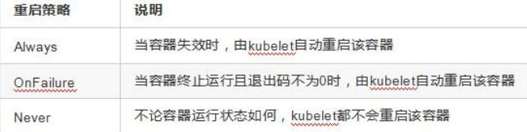

# Kubernetes Notes


## My Notes

### install

wsl安装

先在wsl2下安装docker


启动systemd支持

由于WSL2当前不支持systemd，所以systemctl命令无法使用，这会限制K8s的使用，目前有一些开源脚本可以替代。 首先安装git命令

```
sudo apt install git
复制代码
```

然后运行脚本

```bash
git clone https://github.com/DamionGans/ubuntu-wsl2-systemd-script.git
cd ubuntu-wsl2-systemd-script/
bash ubuntu-wsl2-systemd-script.sh
```

之后就可以使用systemctl了，不过目前看起来如果系统重启后，需要重新执行ubuntu-wsl2-systemd-script.sh，可以尝试加入启动项中


安装K8s

虽然Docker desktop中有建K8s的选项，但启动很慢，不建议使用，Docker总想去侵占容器编排的活儿，所以建议还是自己在Ubuntu中安装。

```arduino
sudo apt-get install -y apt-transport-https
```

需要以root用户执行

```ruby
curl https://mirrors.aliyun.com/kubernetes/apt/doc/apt-key.gpg | apt-key add - 

cat <<EOF | sudo tee /etc/apt/sources.list.d/kubernetes.list
deb https://mirrors.aliyun.com/kubernetes/apt/ kubernetes-xenial main
EOF
```

安装kubelet、kubeadm和kubectl

- `kubelet`：在集群中的每个节点上用来启动 Pod 和容器等。
- `kubectl`：用来与集群通信的命令行工具。
- `kubeadm`：用来初始化集群的指令。

```sql
sudo apt-get update
sudo apt-get install -y kubelet kubeadm kubectl
sudo apt-mark hold kubelet kubeadm kubectl
```


使用kind快速部署K8s

[kind](https://link.juejin.cn?target=https%3A%2F%2Fkind.sigs.k8s.io%2F) 即 Kubernetes In Docker，顾名思义，就是将 K8s 所需要的所有组件，全部部署在一个docker容器中，是一套开箱即用的 K8s 环境搭建方案。使用 kind 搭建的集群无法在生产中使用，但是如果你只是想在本地简单的玩玩 K8s，不想占用太多的资源，那么使用 kind 是你不错的选择。同样，kind 还可以很方便的帮你本地的 k8s 源代码打成对应的镜像，方便测试。 kind只是一个二进制的文件，直接下载下来就可以使用。

```bash
curl -Lo ./kind https://kind.sigs.k8s.io/dl/v0.11.1/kind-linux-amd64
chmod +x ./kind
sudo mv ./kind /bin/
```

查看安装情况

```
kind version 
```

最简单的情况，我们使用一条命令就能创建出一个单节点的 K8s 环境

```lua
kind create cluster 

```

至此，整个环境部署就已经完成

### kind

kind即 Kubernetes In Docker，将 k8s 所需要的所有组件，全部部署在了一个docker容器中，是一套开箱即用的 k8s 环境搭建方案，可以让我们快速的搭建k8s测试平台。它将每个容器模拟成一个k8s节点，可以轻松地在单节点上部署"多节点"集群，甚至"高可用集群"，而且还可以部署和管理多个版本集群。在搭建个人学习平台时，如果要搭建一个多控多计算的集群，个人电脑很难有这么高的资源配置，使用kind来部署集群就很有必要了。


### SpringCloud vs. K8s

Spring Cloud 和 Kubernetes 都声称自己是开发和运行微服务的最佳环境，但它们在本质上有很大的不同，解决的问题也不同。在本文中，我们将看看每个平台是如何交付基于微服务架构(MSA)的？它们擅长哪些领域？以及如何充分利用这两个领域在微服务的旅程中取得成功。


https://cloud.tencent.com/developer/article/1776313


### dashboard

https://raw.githubusercontent.com/kubernetes/dashboard/v2.7.0/aio/deploy/recommended.yaml

```
kubectl apply -f https://raw.githubusercontent.com/kubernetes/dashboard/v2.7.0/aio/deploy/recommended.yaml
kubectl delete -f https://raw.githubusercontent.com/kubernetes/dashboard/v2.7.0/aio/deploy/recommended.yaml
```


### Helm

k8s 包管理器


Helm 是 Kubernetes 的包管理器，类似于 Linux 系统中的 APT 或 Yum，它简化了在 Kubernetes 集群中部署和管理应用程序的过程。Helm 使用名为“图表”（Charts）的包格式，这些图表是预先配置好的 Kubernetes 资源的集合，可以用于部署和管理复杂的应用程序。

Helm 的关键特性和概念包括：

1. **Charts**：Helm 图表是一组文件，描述了在 Kubernetes 上部署应用程序所需的所有 Kubernetes 资源，如部署（Deployments）、服务（Services）、配置映射（ConfigMaps）等。图表可以包含模板，这些模板在安装或升级时会被渲染，以生成实际的 Kubernetes 清单文件。
2. **Repositories**：Helm 仓库是存放图表的地方。用户可以添加、更新和使用不同的 Helm 仓库来访问和管理图表。官方 Helm 仓库包含了大量的图表，用户可以直接使用。
3. **Releases**：Helm 的 release 是图表在 Kubernetes 集群中的一个实例。每次安装、升级或回滚操作都会创建一个新的 release 版本。这使得 Helm 能够跟踪应用程序的部署历史，并允许用户回滚到之前的版本。
4. **Values**：Helm 使用 values 文件来存储配置信息。这些值可以在安装或升级图表时被用户覆盖，以自定义应用程序的行为。values 文件提供了一种灵活的方式来管理应用程序的不同配置。
5. **Dependencies**：图表可以依赖其他图表，这使得复杂的应用程序可以模块化，并且易于管理和更新。
6. **Helm CLI**：Helm 的命令行界面（CLI）提供了与 Helm 仓库和 release 交互的工具，包括搜索、安装、升级、回滚和删除应用程序。

为什么使用 Helm：

- **简化部署**：Helm 通过提供预先配置的图表来简化 Kubernetes 应用程序的部署和管理。
- **提高可重用性**：图表可以在不同的项目和环境中重复使用，提高了资源的可重用性。
- **维护一致性**：使用 Helm 图表可以确保在不同环境（如开发、测试和生产）中部署的应用程序保持一致。
- **强大的社区支持**：Helm 拥有一个活跃的社区，提供了大量的图表和支持，使得用户可以快速找到并使用所需的资源。

Helm 是 Kubernetes 生态系统中的一个重要工具，它极大地简化了 Kubernetes 应用程序的生命周期管理。


安装：下载解压加env

https://github.com/helm/helm/releases/tag/v3.14.3

```
| Operating System | Cache Path                | Configuration Path
| Data Path               |
|------------------|---------------------------|--------------------------------|-------------------------|
| Linux            | $HOME/.cache/helm         | $HOME/.config/helm
| $HOME/.local/share/helm |
| macOS            | $HOME/Library/Caches/helm | $HOME/Library/Preferences/helm | $HOME/Library/helm      |
| Windows          | %TEMP%\helm               | %APPDATA%\helm
| %APPDATA%\helm          |

Usage:
  helm [command]

Available Commands:
  completion  generate autocompletion scripts for the specified shell
  create      create a new chart with the given name
  dependency  manage a chart's dependencies
  env         helm client environment information
  get         download extended information of a named release
  help        Help about any command
  history     fetch release history
  install     install a chart
  lint        examine a chart for possible issues
  list        list releases
  package     package a chart directory into a chart archive
  plugin      install, list, or uninstall Helm plugins
  pull        download a chart from a repository and (optionally) unpack it in local directory
  push        push a chart to remote
  registry    login to or logout from a registry
  repo        add, list, remove, update, and index chart repositories
  rollback    roll back a release to a previous revision
  search      search for a keyword in charts
  show        show information of a chart
  status      display the status of the named release
  template    locally render templates
  test        run tests for a release
  uninstall   uninstall a release
  upgrade     upgrade a release
  verify      verify that a chart at the given path has been signed and is valid
  version     print the client version information
```


## SGG教程

file:///D:/Programming/ProgrammingNotes/docs/_pdf/k8s/%E7%AC%94%E8%AE%B0/kubernetes(k8s)%E8%AF%BE%E7%A8%8B.pdf

### 概述

#### 基本介绍

是一个开源的，用于管理云平台中多个主机上的容器化的应用，Kubernetes 的目标是让部署容器化的应用简单并且高效（powerful）,Kubernetes 提供了应用部署，规划，更新，维护的一种机制。

1. 传统的应用部署方式是通过插件或脚本来安装应用: 系统绑定

2. VM：太重了
3. 容器：占用资源少部署快，镜像，可复制
4. k8s: 容器编排

#### 功能

自动化部署和扩缩容

将组成应用的容器组合成一个逻辑单元以更易管理和发现

1. 自动装箱：基于容器对应用运行环境的资源配置要求自动部署应用容器
2. 自我修复(自愈能力)：失败自动重启，部署的 Node 节点有问题时，会对容器进行重新部署和重新调度、容器未通过监控检查时，会关闭此容器直到容器正常运行时，才会对外提供服务
3. 水平扩展：行规模扩大或规模剪裁
4. 服务发现：用户不需使用额外的服务发现机制，就能够基于 Kubernetes 自身能力实现服务发现和负载均衡
5. 滚动更新：可以根据应用的变化，对应用容器运行的应用，进行一次性或批量式更新
6. 版本回退：
7. 秘钥和配置管理：在不需要重新构建镜像的情况下，可以部署和更新密钥和应用配置，类似热部署。
8. 存储编排：自动实现存储系统挂载及应用，特别对有状态应用实现数据持久化非常重要存储系统可以来自于本地目录、网络存储(NFS、Gluster、Ceph 等)、公共云存储服务
9. 批处理：提供一次性任务，定时任务；满足批量数据处理和分析的场景

#### 部署架构分类

1. 无中心节点架构：GlusterFS
2. 有中心节点架构：HDHS、k8s

#### k8s 集群架构


master node：

k8s 集群控制节点，对集群进行调度管理，接受集群外用户去集群操作请求

Worker Node 集群工作节点，运行用户业务应用容器；


### 集群搭建

1.kubeadm方式、二进制方式

2.kind

3.docker desktop

### yaml文件

YAML ：仍是一种标记语言。为了强调这种语言以数据做为中心，而不是以标记语言为重点。YAML 是一个可读性高，用来表达数据序列的格式

YAML 基本语法 

* 使用空格做为缩进 
* 缩进的空格数目不重要，只要相同层级的元素左侧对齐即可 
* 低版本缩进时不允许使用 Tab 键，只允许使用空格 
* 使用#标识注释，从这个字符一直到行尾，都会被解释器忽略

数据结构：

对象：键值对的集合，又称为映射(mapping) / 哈希（hashes） / 字典（dictionary）

数组：一组按次序排列的值，又称为序列（sequence） / 列表 （list）

纯量（scalars）：单个、不可再分的值，即基本数据类型


在 k8s 中，一般使用 YAML 格式的文件来创建符合我们预期期望的pod,这样的YAML 文件称为资源清单。

常用字段：

1. 必须存在的属性：


 spec 主要对象


### 命令行工具 kubectl

#### 概述

kubectl 是 Kubernetes 集群的命令行工具，通过 kubectl 能够对集群本身进行管理，并能够在集群上进行容器化应用的安装部署。

#### 语法

```shell
D:\Users\taoxu.xu>kubectl -h
kubectl controls the Kubernetes cluster manager.

 Find more information at: https://kubernetes.io/docs/reference/kubectl/

Basic Commands (Beginner):
  create          Create a resource from a file or from stdin
  expose          Take a replication controller, service, deployment or pod and expose it as a new Kubernetes service
  run             Run a particular image on the cluster
  set             Set specific features on objects

Basic Commands (Intermediate):
  explain         Get documentation for a resource
  get             Display one or many resources
  edit            Edit a resource on the server
  delete          Delete resources by file names, stdin, resources and names, or by resources and label selector

Deploy Commands:
  rollout         Manage the rollout of a resource
  scale           Set a new size for a deployment, replica set, or replication controller
  autoscale       Auto-scale a deployment, replica set, stateful set, or replication controller

Cluster Management Commands:
  certificate     Modify certificate resources
  cluster-info    Display cluster information
  top             Display resource (CPU/memory) usage
  cordon          Mark node as unschedulable
  uncordon        Mark node as schedulable
  drain           Drain node in preparation for maintenance
  taint           Update the taints on one or more nodes

Troubleshooting and Debugging Commands:
  describe        Show details of a specific resource or group of resources
  logs            Print the logs for a container in a pod
  attach          Attach to a running container
  exec            Execute a command in a container
  port-forward    Forward one or more local ports to a pod
  proxy           Run a proxy to the Kubernetes API server
  cp              Copy files and directories to and from containers
  auth            Inspect authorization
  debug           Create debugging sessions for troubleshooting workloads and nodes
  events          List events

Advanced Commands:
  diff            Diff the live version against a would-be applied version
  apply           Apply a configuration to a resource by file name or stdin
  patch           Update fields of a resource
  replace         Replace a resource by file name or stdin
  wait            Experimental: Wait for a specific condition on one or many resources
  kustomize       Build a kustomization target from a directory or URL

Settings Commands:
  label           Update the labels on a resource
  annotate        Update the annotations on a resource
  completion      Output shell completion code for the specified shell (bash, zsh, fish, or powershell)

Subcommands provided by plugins:

Other Commands:
  api-resources   Print the supported API resources on the server
  api-versions    Print the supported API versions on the server, in the form of "group/version"
  config          Modify kubeconfig files
  plugin          Provides utilities for interacting with plugins
  version         Print the client and server version information

Usage:
  kubectl [flags] [options]
```

格式

```
kubectl [cmd] [type] [name] [flags]
cmd: 对资源的操作，create、delete
type：资源类型
kubectl get pod xx
kubectl get pods xxx

name:资源名称，如果沈略显示所有
flags:可选参数
```


### POD

#### 概述

Pod 是 k8s 系统中可以创建和管理的最小单元，是资源对象模型中由用户创建或部署的最小资源对象模型，也是在 k8s 上运行容器化应用的资源对象，其他的资源对象都是用来支撑或者扩展 Pod 对象功能的，比如控制器对象是用来管控 Pod 对象的，Service 或者Ingress 资源对象是用来暴露 Pod 引用对象的，PersistentVolume 资源对象是用来为Pod提供存储等等，k8s 不会直接处理容器，而是 Pod，**Pod 是由一个或多个container 组成**

每一个 Pod 都有一个特殊的被称为**”根容器“的Pause容器**。Pause 容器对应的镜 像属于 Kubernetes 平台的一部分，除了Pause 容器，每个Pod还包含一个或多个紧密相关的**用户业务容器**


每个 Pod 都是应用的一个实例，有专用的 IP

一个 Pod 可以有多个容器，彼此间共享网络和存储资源，每个 Pod 中有一个Pause 容器保存所有的容器状态， 通过管理 pause 容器，达到管理 pod 中所有容器的效果

同一个 Pod 中的容器总会被调度到相同 Node 节点，不同节点间 Pod 的通信基于虚拟二层网络技术实现

#### Pod 特性

1.资源共享

一个 Pod 里的多个容器可以共享存储和网络，可以看作一个逻辑的主机。共享的如namespace,cgroups 或者其他的隔离资源

多个容器共享同一 network namespace，由此在一个 Pod 里的多个容器共享Pod 的IP 和端口 namespace，所以一个 Pod 内的多个容器之间可以通过 localhost 来进行通信,所需要注意的是不同容器要注意不要有端口冲突即可。不同的 Pod 有不同的IP,不同Pod 内的多个容器之前通信，不可以使用 IPC（如果没有特殊指定的话）通信，通常情况下使用Pod 的 IP 进行通信

一个 Pod 里的多个容器可以共享存储卷，这个存储卷会被定义为 Pod 的一部分，并且可以挂载到该 Pod 里的所有容器的文件系统上。

2.生命周期短暂

Pod 属于生命周期比较短暂的组件，比如，当 Pod 所在节点发生故障，那么该节点上的Pod会被调度到其他节点，但需要注意的是，被重新调度的 Pod 是一个全新的Pod,跟之前的Pod 没有半毛钱关系。

3.平坦的网络

K8s 集群中的所有 Pod 都在同一个共享网络地址空间中，也就是说每个Pod 都可以通过其他 Pod 的 IP 地址来实现访问

#### Pod 定义

yaml 文件定义：

```yaml
apiVersion: v1
kind: Pod
metadata: //元数据
name: string
namespace: string
labels:
-name: string
annotations:
-name: string
spec:
containers: //pod 中的容器列表，可以有多个容器
- name: string //容器的名称
image: string //容器中的镜像
imagesPullPolicy: [Always|Never|IfNotPresent]//获取镜像的策略，默认值为Always，每次都尝试重新下载镜像
command: [string] //容器的启动命令列表（不配置的话使用镜像内部的命令）args:[string] //启动参数列表
workingDir: string //容器的工作目录 volumeMounts: //挂载到到容器内部的存储卷设置
-name: string
mountPath: string //存储卷在容器内部 Mount 的绝对路径 readOnly: boolean //默认值为读写
ports: //容器需要暴露的端口号列表
-name: string
containerPort: int //容器要暴露的端口
hostPort: int //容器所在主机监听的端口（容器暴露端口映射到宿主机的端口，设置hostPort 时同一 台宿主机将不能再启动该容器的第 2 份副本）
protocol: string //TCP 和 UDP，默认值为 TCP env: //容器运行前要设置的环境列表
-name: string value: string
resources:
limits: //资源限制，容器的最大可用资源数量 cpu: Srting
memory: string
requeste: //资源限制，容器启动的初始可用资源数量 cpu: string
memory: string
livenessProbe: //pod 内容器健康检查的设置 exec:
command: [string] //exec 方式需要指定的命令或脚本 httpGet: //通过httpget 检查健康
path: string port: number host: string scheme: Srtring httpHeaders:
- name: Stirng value: string
tcpSocket: //通过 tcpSocket 检查健康
port: number initialDelaySeconds: 0//首次检查时间 timeoutSeconds: 0 //检查超时
时间
periodSeconds: 0 //检查间隔时间
successThreshold: 0
failureThreshold: 0 securityContext: //安全配置
privileged: falae
restartPolicy: [Always|Never|OnFailure]//重启策略，默认值为Always
nodeSelector: object //节点选择，表示将该 Pod 调度到包含这些label 的Node 上，以key:value 格式指定
imagePullSecrets:
-name: string
hostNetwork: false //是否使用主机网络模式，弃用 Docker 网桥，默认否volumes: //在该 pod 上定义共享存储卷列表
-name: string emptyDir: {} hostPath:
path: string secret:
secretName: string item:
-key: string path: string
configMap: name: string items:
-key: string
path: string
```

#### 基本使用方法

在 kubernetes 中对运行容器的要求为：容器的主程序需要一直在前台运行，而不是后台运行。应用需要改造成前 台运行的方式。如果我们创建的 Docker 镜像的启动命令是后台执行程序，则在 kubelet 创建包含这个容器的 pod 之 后运行完该命令，即认为Pod 已经结束，将立刻销毁该 Pod。如果为该 Pod 定义了 RC，则创建、销毁会陷入一个无限循环的过程中。Pod 可以由 1 个或多个容器组合而成。

```
kubectl create -f xxx.yaml
kubectl delete -f pod pod_name.yaml
```

#### Pod的分类

1.普通 Pod

普通 Pod 一旦被创建，就会被放入到 etcd 中存储，随后会被 Kubernetes Master 调度到某个具体的 Node 上并进行绑定，随后该 Pod 对应的 Node 上的 kubelet 进程实例化成一组相关的 Docker 容器并启动起来。在默认情 况下，当 Pod 里某个容器停止时，Kubernetes 会自动检测到这个问题并且重新启动这个 Pod 里某所有容器， 如果 Pod 所在的Node 宕机，则会将这个 Node 上的所有 Pod 重新调度到其它节点上。

2.静态 Pod

静态 Pod 是由 kubelet 进行管理的仅存在于特定 Node 上的 Pod,它们不能通过API Server进行管理，无法与 ReplicationController、Deployment 或 DaemonSet 进行关联，并且kubelet 也无法对它们进行健康检查。


#### 生命周期和重启策略

status:




状态转换：


#### 资源配置

每个 Pod 都可以对其能使用的服务器上的计算资源设置限额，Kubernetes 中可以设置限额的计算资源有 CPU 与 Memory 两种，其中 CPU 的资源单位为 CPU 数量,是一个绝对值而非相对值。Memory 配额也是一个绝对值，它的单 位是内存字节数。

Kubernetes 里，一个计算资源进行配额限定需要设定以下两个参数：Requests 该资源最小申请数量，系统必须满足要求 Limits 该资源最大允许使用的量，不能突破，当容器试图使用超过这个量的资源时，可能会被 Kubernetes Kill 并重启

### Label

#### 概述

Label 是 Kubernetes 系统中另一个核心概念。一个 Label 是一个 key=value 的键值对，其中 key 与 value 由用户自己指 定。Label 可以附加到各种资源对象上，如Node、Pod、Service、RC，一个资源对象可以定义任意数量的 Label， 同一个 Label 也可以被添加到任意数量的资源对象上，Label 通常在资源对象定义时确定，也可以在对象创建后动态添加或删除。 Label 的最常见的用法是使用 metadata.labels 字段，来为对象添加Label，通过spec.selector 来引用对象

### Controller控制器


### namespace

#### 概述

Namespace 在很多情况下用于**实现多用户的资源隔离**，通过将集群内部的资源对象分配到不同的 Namespace 中， 形成逻辑上的分组，便于不同的分组在共享使用整个集群的资源同时还能被分别管理。Kubernetes 集群在启动后，会创建一个名为"default"的Namespace，如果不特别指明 Namespace,则用户创建的 Pod，RC，Service 都将 被系统创建到这个默认的名为 default 的 Namespace 中。

```
kubectl get pods --namespace=development
```


## 官方文档学习

> https://www.kubernetes.org.cn/k8s
>
> https://kubernetes.io/zh-cn/docs/tasks/administer-cluster/kubeadm/

### 概述

[**Kubernetes**](https://www.kubernetes.org.cn/)是一个开源的，**用于管理云平台中多个主机上的容器化的应用**，Kubernetes的**目标是让部署容器化的应用简单并且高效**（powerful）,Kubernetes提供了应用部署，规划，更新，维护的一种机制。

Kubernetes一个核心的特点就是能够自主的管理容器来保证云平台中的容器按照用户的期望状态运行着（比如用户想让apache一直运行，用户不需要关心怎么去做，Kubernetes会自动去监控，然后去重启，新建，总之，让apache一直提供服务），管理员可以加载一个微型服务，让规划器来找到合适的位置，同时，Kubernetes也系统提升工具以及人性化方面，让用户能够方便的部署自己的应用（就像canary deployments）。

在Kubenetes中，所有的容器均在[**Pod**](https://www.kubernetes.org.cn/tags/pod)中运行,一个Pod可以承载一个或者多个相关的容器，在后边的案例中，同一个Pod中的容器会部署在同一个物理机器上并且能够共享资源。一个Pod也可以包含O个或者多个磁盘卷组（volumes）,这些卷组将会以目录的形式提供给一个容器，或者被所有Pod中的容器共享，对于用户创建的每个Pod,系统会自动选择那个健康并且有足够容量的机器，然后创建类似容器的容器,当容器创建失败的时候，容器会被node agent自动的重启,这个node agent叫kubelet,但是，如果是Pod失败或者机器，它不会自动的转移并且启动，除非用户定义了 replication controller。


用户可以自己创建并管理Pod,Kubernetes将这些操作简化为两个操作：基于相同的Pod配置文件部署多个Pod复制品；

Kubernetes支持一种特殊的网络模型，Kubernetes创建了一个地址空间，并且不动态的分配端口，它可以允许用户选择任何想使用的端口，为了实现这个功能，它为每个Pod分配IP地址。

所有Kubernetes中的资源，比如Pod,都通过一个叫URI的东西来区分，这个URI有一个UID,URI的重要组成部分是：对象的类型（比如pod），对象的名字，对象的命名空间，对于特殊的对象类型，在同一个命名空间内，所有的名字都是不同的，在对象只提供名称，不提供命名空间的情况下，这种情况是假定是默认的命名空间。UID是时间和空间上的唯一。


#### 起源

**大规模容器集群管理工具，从Borg到Kubernetes**

在Docker 作为高级容器引擎快速发展的同时，Google也开始将自身在容器技术及集群方面的积累贡献出来。在Google内部，容器技术已经应用了很多年，Borg系统运行管理着成千上万的容器应用，在它的支持下，无论是谷歌搜索、Gmail还是谷歌地图，可以轻而易举地从庞大的数据中心中获取技术资源来支撑服务运行。

Borg提供了3大好处:

1. 隐藏资源管理和错误处理，用户仅需要关注应用的开发。

2) 服务高可用、高可靠。

3) 可将负载运行在由成千上万的机器联合而成的集群中。

作为Google的竞争技术优势，Borg理所当然的被视为商业秘密隐藏起来，但当Tiwtter的工程师精心打造出属于自己的Borg系统（Mesos）时， Google也审时度势地推出了来源于自身技术理论的新的开源工具

2014年6月，谷歌云计算专家埃里克·布鲁尔（Eric Brewer）在旧金山的发布会为这款新的开源工具揭牌，它的名字Kubernetes在希腊语中意思是船长或领航员，这也恰好与它在容器集群管理中的作用吻合，即作为装载了集装箱（Container）的众多货船的指挥者，负担着全局调度和运行监控的职责。

Kubernetes作为容器集群管理工具，于2015年7月22日迭代到 v 1.0并正式对外公布，这意味着这个开源容器编排系统可以正式在生产环境使用。与此同时，谷歌联合Linux基金会及其他合作伙伴共同成立了CNCF基金会( Cloud Native Computing Foundation)，并将Kuberentes 作为首个编入CNCF管理体系的开源项目，助力容器技术生态的发展进步。Kubernetes项目凝结了Google过去十年间在生产环境的经验和教训，从Borg的多任务Alloc资源块到Kubernetes的多副本Pod，从Borg的Cell集群管理，到Kubernetes设计理念中的联邦集群，在Docker等高级引擎带动容器技术兴起和大众化的同时，为容器集群管理提供独了到见解和新思路。

### 设计架构

#### 节点

Kubernetes集群包含有**节点代理kubelet和Master组件**(APIs, scheduler, etc)，一切都基于分布式的存储系统。


在这张系统架构图中，我们把服务分为**运行在工作节点上的服务和组成集群级别控制板的服务。**

Kubernetes主要由以下几个核心组件组成：

- **etcd保存了整个集群的状态；**
- **apiserver提供了资源操作的唯一入口，并提供认证、授权、访问控制、API注册和发现等机制；**
- **controller manager负责维护集群的状态，比如故障检测、自动扩展、滚动更新等；**
- **scheduler负责资源的调度，按照预定的调度策略将Pod调度到相应的机器上；**
- **kubelet负责维护容器的生命周期，同时也负责Volume（CVI）和网络（CNI）的管理；**
- **Container runtime负责镜像管理以及Pod和容器的真正运行（CRI）；**
- **kube-proxy负责为Service提供cluster内部的服务发现和负载均衡；**

除了核心组件，还有一些推荐的Add-ons：

- kube-dns负责为整个集群提供DNS服务
- Ingress Controller为服务提供外网入口
- Heapster提供资源监控
- Dashboard提供GUI
- Federation提供跨可用区的集群
- Fluentd-elasticsearch提供集群日志采集、存储与查询


### 分层架构

Kubernetes设计理念和功能其实就是一个类似Linux的分层架构


- **核心**层：Kubernetes最核心的功能，对外提供API构建高层的应用，对内提供插件式应用执行环境
- **应用**层：部署（无状态应用、有状态应用、批处理任务、集群应用等）和路由（服务发现、DNS解析等）
- 管理层：系统度量（如基础设施、容器和网络的度量），自动化（如自动扩展、动态Provision等）以及策略管理（RBAC、Quota、PSP、NetworkPolicy等）
- 接口层：kubectl命令行工具、客户端SDK以及集群联邦
- 生态系统：在接口层之上的庞大容器集群管理调度的生态系统，可以划分为两个范畴
  - Kubernetes外部：日志、监控、配置管理、CI、CD、Workflow、FaaS、OTS应用、ChatOps等
  - Kubernetes内部：CRI、CNI、CVI、镜像仓库、Cloud Provider、集群自身的配置和管理等


kubelet:

kubelet负责管理[pods](https://www.kubernetes.org.cn/kubernetes-pod)和它们上面的容器，images镜像、volumes、etc。


kube-proxy

**每一个节点也运行一个简单的网络代理和负载均衡**（详见[services FAQ](https://github.com/kubernetes/kubernetes/wiki/Services-FAQ) )（PS:官方 英文）。 正如Kubernetes API里面定义的这些服务（详见[the services doc](https://github.com/kubernetes/kubernetes/blob/release-1.2/docs/user-guide/services.md)）（PS:官方 英文）也可以在各种终端中以轮询的方式做一些简单的TCP和UDP传输。

服务端点目前是通过DNS或者环境变量( Docker-links-compatible 和 Kubernetes{FOO}_SERVICE_HOST 及 {FOO}_SERVICE_PORT 变量都支持)。这些变量由服务代理所管理的端口来解析。


Kubernetes控制面板可以分为多个部分。目前它们都运行在一个*master* 节点，然而为了达到高可用性，这需要改变。不同部分一起协作提供一个统一的关于集群的视图。


etcd

所有master的持续状态都存在etcd的一个实例中。这可以很好地存储配置数据。因为有watch(观察者)的支持，各部件协调中的改变可以很快被察觉。


Kubernetes API Server

API服务提供[Kubernetes API](https://github.com/kubernetes/kubernetes/blob/release-1.2/docs/api.md) （PS:官方 英文）的服务。这个服务试图通过把所有或者大部分的业务逻辑放到不两只的部件中从而使其具有CRUD特性。它主要处理REST操作，在etcd中验证更新这些对象（并最终存储）。


Scheduler

调度器把未调度的pod通过binding api绑定到节点上。调度器是可插拔的，并且我们期待支持多集群的调度，未来甚至希望可以支持用户自定义的调度器。


Kubernetes控制管理服务器

所有其它的集群级别的功能目前都是由控制管理器所负责。例如，端点对象是被端点控制器来创建和更新。这些最终可以被分隔成不同的部件来让它们独自的可插拔。

[replicationcont](https://github.com/kubernetes/kubernetes/blob/release-1.2/docs/user-guide/replication-controller.md)[roller](https://github.com/kubernetes/kubernetes/blob/release-1.2/docs/user-guide/replication-controller.md)（PS:官方 英文）是一种建立于简单的 [pod](https://www.kubernetes.org.cn/kubernetes-pod) API之上的一种机制。一旦实现，我们最终计划把这变成一种通用的插件机制。

### 设计理念


### 创建k8s集群


